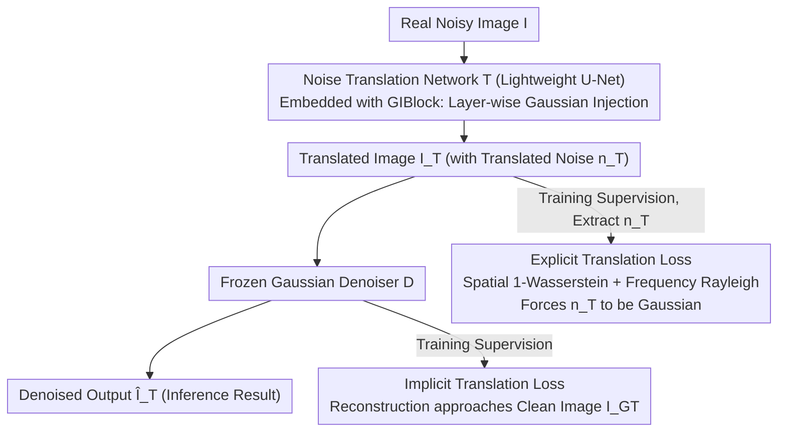

# Learning to Translate Noise for Robust Image Denoising

**Conference**: CVPR 2026 Findings  
**arXiv**: [2412.04727](https://arxiv.org/abs/2412.04727)  
**Code**: [https://hij1112.github.io/learning-to-translate-noise/](https://hij1112.github.io/learning-to-translate-noise/)  
**Area**: Image Restoration  
**Keywords**: Image Denoising, Noise Translation, Gaussian Noise, Out-of-Distribution Generalization, Wasserstein Distance

## TL;DR

A noise translation framework is proposed that converts unknown real-world noise into Gaussian noise through a lightweight translation network, which is then processed by a pre-trained Gaussian denoiser. This achieves an average PSNR improvement of over 1.5dB on OOD real noise benchmarks. The translation network contains only 0.29M parameters and is transferable across different denoisers.

## Background & Motivation

Deep learning-based image denoising methods perform excellently in controlled environments but suffer from severe generalization issues when facing out-of-distribution (OOD) real-world noise:

**Distribution Gap between Synthetic and Real Noise**: Early methods assuming Gaussian noise show significant performance drops in real-world scenarios.

**Overfitting to Real Datasets**: Models trained on specific noisy-clean pairs overfit to the noise-signal correlations unique to the training data, failing on new noise types.

**Impracticality of Covering All Distributions**: Noise generated by different cameras, sensors, and environments varies greatly.

**Limitations of Prior Work**: Fixed transformations (e.g., Anscombe transform) lack adaptability; test-time optimization (e.g., LAN) is computationally expensive and does not scale to large images.

**Key Insight**: An observation revealed that adding extra Gaussian noise to real noisy images before processing them with a Gaussian denoiser significantly improves results (PSNR increased from 29.63dB to 32.73dB). This inspired the "translate-then-denoise" strategy.

## Method

### Overall Architecture

The goal is to prevent denoisers from failing on unseen real noise. Instead of training a universal denoiser, this approach "translates" unfamiliar noise into a form the denoiser already handles well (Gaussian). The system consists of two stages: first, a Gaussian-only denoising network $\mathcal{D}(\cdot; \boldsymbol{\theta})$ is trained and frozen; then, a lightweight Noise Translation Network (NTN) $\mathcal{T}(\cdot; \boldsymbol{\phi})$ is trained to reshape any real noise into Gaussian noise. During inference, a real noisy image $I$ passes through the translation network then the denoiser: $\hat{I}_\mathcal{T} = \mathcal{D}(\mathcal{T}(I; \boldsymbol{\phi}); \boldsymbol{\theta}^*)$. The generalization pressure is shifted to the 0.29M parameter translation network.

### Key Designs

**1. Implicit Translation Loss: Back-propagating from the frozen denoiser**

The challenge is that there is no direct supervision for "translating to Gaussian." The authors bypass direct constraints on intermediate noise by using final denoising quality: the translated output is fed into the frozen denoiser, requiring the reconstruction to approach the clean image via $\mathcal{L}_{\text{implicit}} = \|\mathcal{D}(\mathcal{T}(I; \boldsymbol{\phi}); \boldsymbol{\theta}^*) - I_{\text{GT}}\|_1$. Since the denoiser $\boldsymbol{\theta}^*$ is only proficient in Gaussian noise, minimizing this loss forces the translation output to become "Gaussian-like."

**2. Explicit Translation Loss: Forcing Gaussianity in spatial and frequency domains**

To prevent the translation network from finding "shortcuts" that satisfy the denoiser without being truly Gaussian, distribution-level constraints are applied. The translated noise $n_\mathcal{T}$ is matched with a Gaussian reference noise $n_\mathcal{G}$ using two 1-Wasserstein distances. The spatial term $\mathcal{L}_{\text{spatial}}$ computes the L1 distance between sorted, flattened channels, equivalent to a 1D Wasserstein distance to enforce **element-wise** Gaussian distribution. To ensure the noise is spatially uncorrelated (preventing structural artifacts like zipper patterns), the frequency term $\mathcal{L}_{\text{freq}}$ exploits the property that the FFT magnitude of uncorrelated Gaussian noise follows a Rayleigh distribution. The total explicit loss is $\mathcal{L}_{\text{explicit}} = \mathcal{L}_{\text{spatial}} + \beta \cdot \mathcal{L}_{\text{freq}}$.

**3. Gaussian Injection Block (GIBlock): Internal layer-wise prior injection**

Adding Gaussian noise solely at the input might distort the image signal. GIBlock instead applies Gaussian priors **inside every layer** of the translation U-Net. Each block consists of a NAFBlock, Gaussian noise injection, and a residual connection. This allows the network to be repeatedly "reminded" across multiple scales that its output should tend toward a Gaussian distribution, improving translation reliability for unseen noise.

### Loss & Training

The total loss combines the three terms: $\mathcal{L}_{\text{total}} = \mathcal{L}_{\text{implicit}} + \alpha \cdot \mathcal{L}_{\text{explicit}}$, with weights $\alpha = 5 \times 10^{-2}$ and $\beta = 2 \times 10^{-3}$. The GIBlock uses an injection noise level of $\tilde{\sigma} = 100$. The denoiser is pre-trained on BSD400 + WED (with $\sigma=15$ Gaussian noise) and SIDD. The translation network is trained only on SIDD real noisy-clean pairs with $[0, 15]$ random Gaussian augmentation. Despite training on only one real dataset (SIDD), it generalizes to 9 OOD benchmarks.

## Key Experimental Results

### Main Results (OOD Average PSNR, dB)

| Method | SIDD (ID) | OOD Avg↑ | Gain |
|------|----------|---------|------|
| NAFNet | 39.97 | 38.43 | Baseline |
| **NAFNet + NTN (Ours)** | 39.24 | **39.94** | **+1.51** |
| Xformer | 39.98 | 38.58 | Baseline |
| **Xformer + NTN (Ours)** | 39.10 | **40.04** | **+1.46** |
| AFM (Prev. SOTA) | 38.29 | 39.07 | — |
| Mask-Denoising | 38.91 | 38.56 | — |
| CLIP-Denoising | 38.03 | 38.53 | — |

### Ablation Study

| Configuration | SIDD | OOD Avg | Description |
|------|------|---------|------|
| Baseline Translation (Implicit only) | 39.35 | 39.27 | Minimal version |
| + GIBlock | 39.05 | 39.61 | +0.34 OOD |
| + Explicit loss | 39.33 | 39.61 | +0.34 OOD |
| + Both (Full version) | 39.24 | **39.94** | +0.67 OOD |

### Comparison with Simple Gaussian Addition

| Input | SIDD | OOD Avg |
|------|------|---------|
| Original Noisy $I$ | 37.77 | 17.89 |
| $I + \mathcal{N}(\sigma=5)$ | 38.15 | 22.93 |
| $I + \mathcal{N}(\sigma=10)$ | 38.76 | 39.22 |
| $I + \mathcal{N}(\sigma=15)$ | 39.16 | 38.95 |
| **Translated $I_\mathcal{T}$ (Ours)** | **39.24** | **39.94** |

### Key Findings

1.  **Adaptivity**: Simple noise addition ($\sigma=10$ or $15$) works well on some datasets but poorly on others; the translation network adapts to various OOD noise.
2.  **Transferability**: An NTN trained for NAFNet works almost equally well (39.94 dB) when paired with Xformer (40.04 dB).
3.  **Anti-overfitting**: The slight PSNR drop on SIDD (ID) is because other methods overfit to specific training artifacts; the proposed method avoids this, leading to better OOD robustness.
4.  **Minimal Overhead**: The translation network has only 0.29M parameters and 1.07G MACs, which is negligible compared to NAFNet (29.1M/16.23G).

## Highlights & Insights

1.  **Intuition to Framework**: Derives a complete translation theory from the observation that adding Gaussian noise can paradoxically improve denoising.
2.  **Strong Mathematical Motivation**:
    *   Spatial domain: 1-Wasserstein matching for point-wise Gaussianity.
    *   Frequency domain: Rayleigh distribution of FFT magnitudes to ensure spatial uncorrelation.
3.  **Plug-and-play**: The translation and denoising stages are decoupled; one NTN can work with any pre-trained Gaussian denoiser.
4.  **No Test-time Optimization**: Unlike methods like LAN, this approach requires no per-pixel optimization during inference, making it scalable.
5.  **Visual Proof**: Noise distribution histograms clearly demonstrate the transformation from structured real noise to a Gaussian distribution.

## Limitations & Future Work

1.  Training ONLY on SIDD may limit performance when encountering noise vastly different from those found in SIDD.
2.  Minor ID performance drop (~0.7dB) suggests a need for extra fine-tuning if peak ID performance is required.
3.  The denoiser must be pre-trained on the target Gaussian level ($\sigma=15$); behavior with mismatched levels is unexplored.
4.  Currently verified on image denoising; applicability to video or other tasks (deblurring, SR) remains for discovery.

## Related Work & Insights

*   **DnCNN**: Early CNN denoiser that used frequency domain training to improve generalization.
*   **NAFNet / Restormer**: Powerful backbones but limited in generalization.
*   **Anscombe / Pixel-Shuffle**: Fixed transforms used to simplify noise, which lack adaptability.
*   **Key Insight**: Instead of trying to denoise every possible noise type, unify all noise into a single distribution (Gaussian) that the model is already proficient in.

## Rating

*   Novelty: ⭐⭐⭐⭐⭐ — The noise translation concept is novel and mathematically grounded.
*   Experimental Thoroughness: ⭐⭐⭐⭐⭐ — Comprehensive testing on 9 OOD benchmarks with detailed ablations.
*   Writing Quality: ⭐⭐⭐⭐⭐ — Clear logical flow from intuition to experiment.
*   Value: ⭐⭐⭐⭐⭐ — Lightweight, plug-and-play, and practical for real-world denoising.

<!-- RELATED:START -->

## Related Papers

- [\[ICLR 2026\] Are Deep Speech Denoising Models Robust to Adversarial Noise?](../../ICLR2026/image_restoration/are_deep_speech_denoising_models_robust_to_adversarial_noise.md)
- [\[CVPR 2026\] Convexity-Aware Noise Calibration: A Self-Supervised Framework for Noise-Level-Unknown Image Denoising](convexity-aware_noise_calibration_a_self-supervised_framework_for_noise-level-un.md)
- [\[CVPR 2026\] PNG: Diffusion-Based sRGB Real Noise Generation via Prompt-Driven Noise Representation Learning](diffusion-based_srgb_real_noise_generation_via_prompt-driven_noise_representatio.md)
- [\[CVPR 2026\] NEC-Diff: Noise-Robust Event–RAW Complementary Diffusion for Seeing Motion in Extreme Darkness](nec-diff_noise-robust_event-raw_complementary_diffusion_for_seeing_motion_in_ext.md)
- [\[CVPR 2025\] Classic Video Denoising in a Machine Learning World: Robust, Fast, and Controllable](../../CVPR2025/image_restoration/classic_video_denoising_in_a_machine_learning_world_robust_fast_and_controllable.md)

<!-- RELATED:END -->
