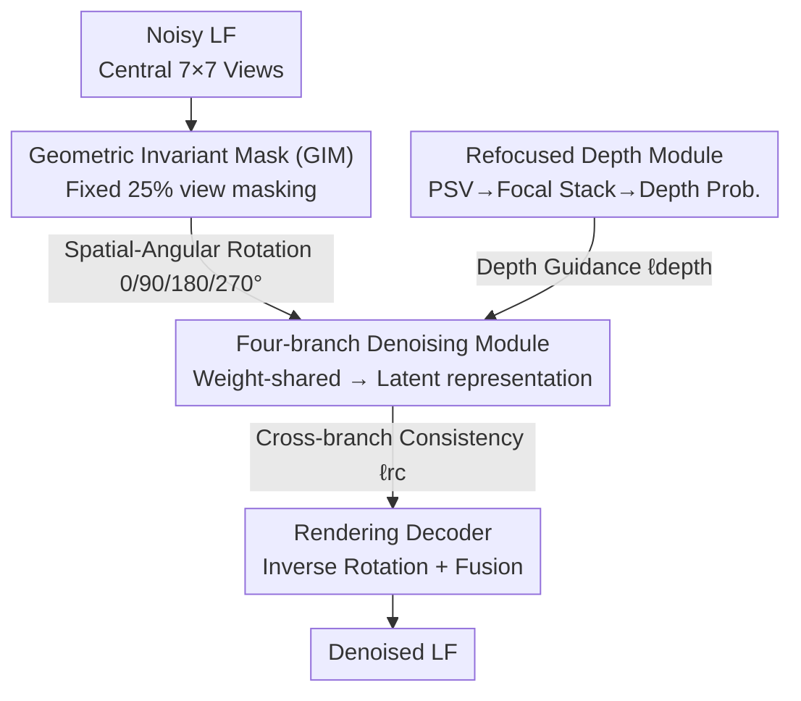

# LF-BVN: Blind-View Network for Self-Supervised Light Field Denoising

**Conference**: CVPR 2026  
**Paper**: [CVF Open Access](https://openaccess.thecvf.com/content/CVPR2026/html/Guo_LF-BVN_Blind-View_Network_for_Self-Supervised_Light_Field_Denoising_CVPR_2026_paper.html)  
**Code**: https://github.com/shuozh/LF-BVN (Code availability as stated in the paper)  
**Area**: Image Restoration / Light Field Denoising / Self-supervised  
**Keywords**: Light Field Denoising, Self-supervised, Blind-view, Geometric Invariant Mask, Cross-view Consistency

## TL;DR
The "blind-spot" ideology from single-image denoising is extended to "blind-view" for light fields (LF). By masking a subset of views and reconstructing them using the multi-view consistency of the remaining views, the network is trained without clean images. A Geometric Invariant Mask (GIM) enables a single weight-shared network to denoise all views. The method achieves or surpasses supervised counterparts on synthetic, real-world, and microscopic light fields.

## Background & Motivation
**Background**: Light field (LF) cameras record spatial and angular information in a single exposure. However, devices like camera arrays, Lytro Illum, and Raytrix often produce noisy LFs due to hardware and lighting limitations, which hampers downstream tasks like view synthesis, super-resolution, and depth estimation. Existing methods are categorized into traditional methods (LFBM5D, Hyperfan4D), which rely on handcrafted priors and often cause artifacts, and data-driven methods (APA, MSPNet, SRDNet), which require noise-clean pairs but struggle with generalization.

**Limitations of Prior Work**: Accurately aligned noise-clean LF pairs are nearly impossible to obtain in real-world scenarios. Existing self-supervised attempts (VCDNet, V2V3D) derived from Light Field Microscopy (LFM) suffer from two issues: heavy dependence on the Point Spread Function (PSF), which is absent in standard LF imaging, and the use of multiple **independent** networks to denoise different views, leading to visible inconsistencies and artifacts.

**Key Challenge**: Single-image blind-spot denoising relies on **spatial neighborhoods** to infer target pixels, often mistaking noise for texture in flat areas or real edges for noise. Light fields provide more reliable supervision via multi-view consistency: projections of the same 3D point across views are photometrically consistent when noise-free, whereas noise is highly unlikely to be consistent across views. The challenge lies in extending the blind-spot concept to "blind-view" without training separate networks for every view while maintaining consistency.

**Goal**: (1) Design a fixed mask compatible with LF structures to allow a single network to denoise all views; (2) Enforce cross-view consistency during multi-branch denoising; (3) Extract reliable depth cues from noisy LFs to guide the denoising process.

**Key Insight**: The authors observe that LFs possess "rotational invariance." By **synchronously** rotating the entire LF in both spatial and angular domains, the geometric (disparity) relationships between views remain unchanged (following [28]). This implies that applying the same mask to rotated inputs preserves the geometry observed by the network, allowing a single weight-shared network to handle all rotation branches.

**Core Idea**: Replace "blind-spot" with "blind-view"—masking several views to force the network to reconstruct them from **other views**. Multi-view consistency serves as a free self-supervision signal. Combining GIM with weight-sharing collapses the "one network per view" requirement into "one network for four rotation branches."

## Method

### Overall Architecture
LF-BVN is a self-supervised light field denoising framework. It takes a noisy LF (central 7×7 views) as input and outputs a denoised LF without needing clean references. The architecture uses a **four-branch, weight-shared** structure. First, a Geometric Invariant Mask (GIM) masks a fixed 25% of the views. The LF is then rotated by 0°/90°/180°/270° and fed into the branches. All branches share the parameters $f_\theta$. Inside each branch, the masked LF is processed by a denoising module $f_{\theta_1}$ to reconstruct a "latent representation volume" encoding the scene geometry, followed by a rendering decoder $f_{\theta_2}$. Finally, outputs are inverse-rotated and fused. A refocused depth estimation module extracts depth probabilities from the noisy LF for guidance, while the reconstruction consistency loss $\ell_{rc}$ ensures the latent representations across branches remain consistent.

### Key Designs

**1. Geometric Invariant Mask (GIM): Denoising All Views with One Network**
Blind-view denoising is difficult because while pixels in single images are statistically similar, LF views depend on **cross-view geometry**, which varies by view position. Changing the masking pattern usually requires retraining. Based on the disparity formula $D_{j\to i}(x_i)=(a_j-a_i)\cdot\frac{B\cdot f}{Z(x_i)}$, the authors argue that for a fixed scene $Z$, disparity depends only on relative angular positions. Therefore, a **fixed angular mask** is necessary to maintain geometric consistency. GIM leverages the property that geometry is invariant under synchronous spatial-angular rotation. By rotating the LF through 4 branches, the fixed mask "rotates" to cover all views, while the network always sees the same geometric relationships. GIM satisfies three principles: fixed angular pattern, uniform blind-view distribution, and a 25% masking ratio (optimal for 90° rotations across 4 branches).

**2. Latent Representation Volume + Reconstruction Consistency Loss $\ell_{rc}$**
Denoising views separately naturally leads to photometric inconsistency. The authors introduce a view-independent LF representation—the Latent Representation Volume (following [29], shape $4C\times H\times W$). Since all branches observe the same scene, they should learn the same latent representation. Consistency is enforced via:
$$\ell_{rc}=\sum_{r}\left\|R^{-r}_{x}\big(f_{\theta_1}(R^{r}_{ax}(L)\odot M)\big)-f_{\theta_1}(L\odot M)\right\|_1,\quad r\in\{90,180,270\}$$
By explicitly aligning geometric representations, cross-view photometric consistency is significantly improved, avoiding artifacts found in methods like V2V3D. The blind-view loss $\ell_{blind}=\|f_\theta(M\odot L)-(1-M)\odot L\|_2^2$ measures the error only on masked views.

**3. Refocused Depth Estimation Module + Depth Loss $\ell_{depth}$**
Accurate blind-view denoising requires finding 3D correspondences, which necessitates depth. Typical self-supervised depth estimation relies on photometric consistency, which is unreliable under noise. The authors shift the masked LF to the central view across depth planes to build a Plane Sweep Volume (PSV), then generate a focal stack:
$$FS=\frac{1}{|M|}\sum_{u=1}^{U}\sum_{v=1}^{V}PSV_{uv}$$
Since the central view is masked, the refocused image does not contain the original central view's information. Thus, the **noisy central view** can safely supervise the depth module $f_\sigma$ without learning an identity mapping:
$$\ell_{depth}=\Big\|\sum_{d}^{D}[f_\sigma(PSV)\odot FS]_d-\tilde I_c\Big\|_1$$
The resulting depth probabilities weigh the PSV to guide the latent representation. Total loss: $\ell_{total}=\ell_{blind}+\alpha\ell_{rc}+\beta\ell_{depth}$ with $\alpha=0.3, \beta=0.1$.

### Loss & Training
Implemented in PyTorch with Adam ($\beta_1=0.9, \beta_2=0.999$), batch size 20, fixed learning rate $10^{-4}$. Trained for $10^5$ iterations on an NVIDIA A5000. Training utilizes central 7×7 views cropped into 48×48 patches. Evaluation metrics: PSNR / SSIM.

## Key Experimental Results

### Main Results
Trained on 16 scenes from the HCI dataset and evaluated on 8 scenes, with zero-shot testing on HCIold (5 scenes) and DLFD (30 scenes). Compared against single-image blind-spot (B2U, ZSBlind), supervised LF (APA, DRLF, SRDNet, MSPNet), and self-supervised LF (V2V3D).

Synthetic data (sRGB, PSNR↑/SSIM↑):

| Noise | Dataset | Ours | SRDNet (Supervised SOTA) | V2V3D (Self-supervised) |
|------|--------|------|---------------------|------------------|
| σ=20 | HCI | 37.86 / **0.960** | **38.17** / 0.925 | 36.21 / 0.909 |
| σ=20 | HCIold | **37.72** / **0.953** | 36.78 / 0.937 | 35.97 / 0.896 |
| σ=20 | DLFD | **36.04** / **0.937** | 35.44 / 0.901 | 33.89 / 0.891 |
| σ=50 | HCI | 34.51 / **0.911** | **34.73** / 0.901 | 33.37 / 0.901 |
| σ=50 | DLFD | **33.19** / 0.883 | 32.27 / 0.884 | 33.04 / 0.883 |

Ours outperforms self-supervised methods and most supervised methods. Supervised SRDNet drops significant performance on HCIold/DLFD due to training distribution shifts, whereas Ours demonstrates superior generalization.

Unseen noise types (trained on Gaussian σ=20, tested on Poisson λ=30 / Uniform [−50,50]):

| Noise | Dataset | Ours | V2V3D | SRDNet |
|------|--------|------|-------|--------|
| Poisson | HCI | **36.09 / 0.932** | 34.17 / 0.889 | 30.64 / 0.763 |
| Poisson | DLFD | **34.51 / 0.917** | 33.85 / 0.867 | 29.26 / 0.726 |
| Uniform | HCI | **36.46 / 0.943** | 33.33 / 0.885 | 29.96 / 0.670 |
| Uniform | DLFD | **35.13 / 0.917** | 32.78 / 0.898 | 27.83 / 0.659 |

Supervised methods fail on unseen noise (SRDNet drops to 27–30 dB), while Ours maintains robustness, proving the architecture learns intrinsic geometry rather than overfitting noise.

### Ablation Study
Conducted on HCI with Gaussian σ=20.

Mask Ratios & Branches (Table 5):

| Config | Mask Ratio | PSNR | SSIM | FLOPs(T) |
|------|---------|------|------|----------|
| 4-Branch (90°) | 25% | **37.86** | **0.960** | 5.0 |
| 4-Branch (90°) | 50% | 36.91 | 0.942 | 5.0 |
| 4-Branch (90°) | 75% | 36.10 | 0.926 | 5.0 |
| 2-Branch (180°) | 50% | 35.97 | 0.925 | 2.5 |

Component Breakdown (Table 6):

| Config | PSNR | SSIM | Description |
|------|------|------|------|
| Base (Random Mask) | 30.56 | 0.812 | Cannot learn cross-view relations |
| + GIM | 36.47 | 0.915 | Adapts blind-spot to LF, +5.91 dB |
| + LRV | 37.27 | 0.930 | Collaborative denoising |
| + $\ell_{depth}$ | 37.55 | 0.954 | Depth guidance |
| + $\ell_{rc}$ (Full) | **37.86** | **0.960** | Consistency constraints |

### Key Findings
- Replacing GIM with random masking leads to a crash (30.56 dB), proving GIM is the critical component (+5.91 dB).
- 25% masking with 4 branches is the optimal trade-off between complexity and accuracy. Larger masking ratios reduce available context and lower performance.
- Effectiveness on Light Field Microscopy (LFM): Using PSF rendering, the method preserves more details compared to V2V3D.

## Highlights & Insights
- **Blind-spot to Blind-view Transition**: Single-image methods are limited by spatial continuity assumptions. LF multi-view signals provide stronger supervision because noise is rarely consistent across geometries.
- **GIM + Weight Sharing**: Utilizing rotational invariance to collapse a multi-network problem into a single 4-branch network is an elegant design that saves parameters and promotes consistency.
- **Pseudo-Supervision for Depth**: Using the noisy central view to supervise the refocusing module (which excludes the central view's own info) is a clever self-supervised signal for extracting geometry from noise.

## Limitations & Future Work
- The framework is strictly bound to light field geometry (disparity/refocusing) and rotational invariance, making it hard to transfer to monocular or sparse multi-view setups.
- The 4-branch architecture requires four forward passes, introducing higher inference overhead compared to single-branch methods.
- Geometric consistency might break in non-regular angular layouts or highly non-Lambertian scenes.

## Related Work & Insights
- **vs. Single-image Blind-spot**: Methods like B2U often blur textures or fail at edges; the blind-view approach leverages multi-view consistency to recover details in weak-texture areas.
- **vs. V2V3D**: V2V3D uses two independent networks and relies on PSF; LF-BVN uses weight-sharing and consistency losses, resulting in fewer artifacts and broader applicability to standard LFs.
- **vs. Supervised Methods**: LF-BVN avoids the need for clean data and shows significantly better generalization once the noise distribution changes.

## Rating
- Novelty: ⭐⭐⭐⭐⭐ Elegant extension of blind-spot to blind-view with geometric invariance.
- Experimental Thoroughness: ⭐⭐⭐⭐ Extensive datasets and noise types; downstream depth evaluation is a plus.
- Writing Quality: ⭐⭐⭐⭐ Clear theoretical derivation, though some details are in supplementary materials.
- Value: ⭐⭐⭐⭐ First self-supervised framework applicable to both standard LF and LFM with high generalization.

<!-- RELATED:START -->

## Related Papers

- [\[CVPR 2026\] TM-BSN: Triangular-Masked Blind-Spot Network for Real-World Self-Supervised Image Denoising](tm-bsn_triangular-masked_blind-spot_network_for_real-world_self-supervised_image.md)
- [\[CVPR 2026\] Self-Diffusion Driven Blind Imaging](self-diffusion_driven_blind_imaging.md)
- [\[CVPR 2026\] Next-Scale Prediction: A Self-Supervised Approach for Real-World Image Denoising](next-scale_prediction_a_self-supervised_approach_for_real-world_image_denoising.md)
- [\[CVPR 2026\] Convexity-Aware Noise Calibration: A Self-Supervised Framework for Noise-Level-Unknown Image Denoising](convexity-aware_noise_calibration_a_self-supervised_framework_for_noise-level-un.md)
- [\[CVPR 2026\] SelfHVD: Self-Supervised Handheld Video Deblurring](selfhvd_self-supervised_handheld_video_deblurring.md)

<!-- RELATED:END -->
