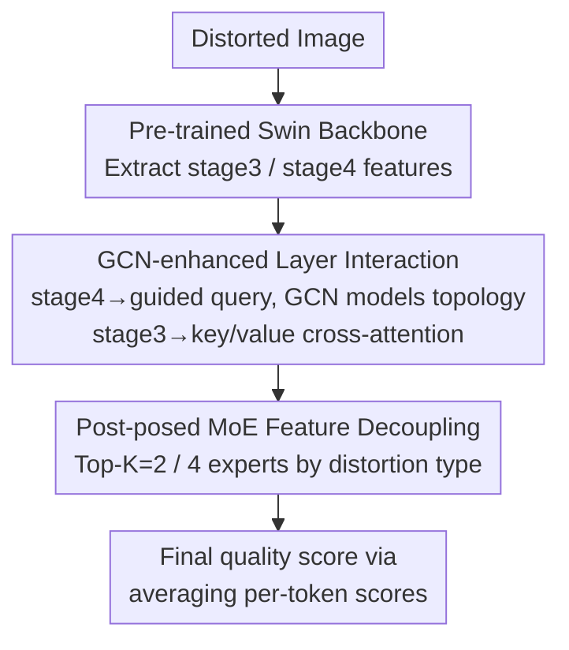

# Life-IQA: Boosting Blind Image Quality Assessment through GCN-enhanced Layer Interaction and MoE-based Feature Decoupling

**Conference**: CVPR 2026  
**Paper**: [CVF Open Access](https://openaccess.thecvf.com/content/CVPR2026/html/Tang_Life-IQA_Boosting_Blind_Image_Quality_Assessment_through_GCN-enhanced_Layer_Interaction_CVPR_2026_paper.html)  
**Code**: None  
**Area**: Image Quality Assessment / Low-level Vision  
**Keywords**: Blind Image Quality Assessment (BIQA), GCN, Mixture of Experts (MoE), Transformer Decoder, Cross-layer Interaction

## TL;DR
Addressing the issue in Blind Image Quality Assessment (BIQA) where "blindly merging all layer features introduces noise," Life-IQA utilizes only the features from the two deepest layers of the backbone for quality decoding. It employs a GCN-enhanced query topology to treat stage 4 features as queries and stage 3 features as keys/values for cross-layer interaction. Subsequently, a post-posed MoE head decouples features based on distortion types, achieving SOTA performance on seven BIQA benchmarks with approximately 95M parameters.

## Background & Motivation
**Background**: Mainstream BIQA methods utilize ImageNet pre-trained backbones (e.g., ResNet, Swin) to extract multi-scale features, then fuse shallow features (stage 1/2, encoding local texture) and deep features (stage 3/4, encoding global semantics) to feed into a regression head for quality score prediction. This practice assumes that "features across different levels are complementary."

**Limitations of Prior Work**: The authors evaluated the individual predictive capabilities of each layer by attaching a simple regression head (GAP + linear layer) to six pre-trained backbones on the LIVEC dataset. They found that the SROCC of shallow layers (stage 1/2) is systematically inferior to that of deep layers (stage 3/4)—the gap between stage 1 and stage 4 on ResNet50 reaches 0.178. Furthermore, t-SNE visualizations of features from KADID-10k show that stage 1 features are entangled with blurred class boundaries, while stage 4 features form compact, separable clusters.

**Key Challenge**: IQA datasets are limited in size, making it difficult for models to learn effective quality representations from shallow features dominated by fine details. "Complete and direct" fusion of all layers tends to inject noise and redundancy into quality decoding. Additionally, while various encoder backbones have been extensively studied, the **architecture of the quality decoding end is rarely explored**. DEIQT was the first to adopt an encoder-decoder structure, but its queries originate from a single ViT CLS token, leading to a limited perspective and performance constrained by the upstream encoder.

**Goal**: (1) Quantify the actual contribution of each layer to BIQA and redesign the decoding path accordingly; (2) Design a data-efficient quality decoder capable of distinguishing between different distortion types.

**Key Insight**: Given the minimal contribution of shallow layers, **traditional multi-scale fusion is discarded** in favor of focusing on efficient interaction between "deeper and more semantically rich" features.

**Core Idea**: Use stage 4 as the query and stage 3 as the key/value for cross-layer interaction (with GCN explicitly modeling the query topology), followed by a post-posed MoE head to decouple fused features along the distortion dimension. Both "which layers to fuse" and "how to decode" are redesigned.

## Method

### Overall Architecture
Given a distorted image, the pre-trained Swin Transformer first extracts two deep features: stage 3 ($\frac{H}{16}\times\frac{W}{16}\times C_3$) and stage 4 ($\frac{H}{32}\times\frac{W}{32}\times C_4$). The GCN-enhanced inter-layer interaction module compresses stage 4 into guided queries and pools stage 3 into a context sequence for cross-attention fusion. The fused results are sent to a post-posed MoE head for decoupling by distortion type. Finally, each query token generates a quality score, and the average is taken as the final image quality score. The entire pipeline only processes the two deepest layers, deliberately avoiding unstable full-scale fusion.

### Key Designs

**1. Observation of Deep Feature Dominance: Interaction between only the Deepest Two Layers**

This is the starting point of the paper and directly determines the architectural choice of using only "stage 3/4." The authors quantified each layer's contribution by attaching simple regression heads across six backbones on LIVEC, finding that shallow layers (stage 1/2) are systematically weaker in SROCC. t-SNE further showed blurred class boundaries in shallow features versus compact clusters in deep features. The conclusion is that in small-data IQA scenarios, shallow detail features fail to learn reliable quality representations, and direct fusion of all levels introduces noise. Thus, Life-IQA focuses on efficient interaction between the semantically richest features (stage 3 and 4).

**2. GCN-enhanced Layer Interaction: Stage 4 as Query, Stage 3 as Key/Value with Explicit Query Topology Modeling**

Standard Transformer decoders use a set of learnable embeddings $Q_{init}\in\mathbb{R}^{N\times D}$ ($D=384$) as initial queries, which lacks image-content anchors in the feature space, leading to inefficient learning. Life-IQA reduces stage 4 dimensionality via $1\times1$ convolution and compresses it into a global context vector $v_{global}$ via GAP, which is then broadcast to length $N$ and added to $Q_{init}$ to obtain guided queries: $Q'_{init}=\text{expand}(\text{GAP}(\text{conv}_1(stage4)))+Q_{init}$. This ensures each query starts with a prior of the overall image quality attributes, significantly accelerating convergence.

Crucially, in standard self-attention, queries/keys are generated via independent linear projections per token and are "blind" to each other, resulting in a lack of synergy and structural dependency. The authors replace query-key interaction in self-attention with a three-layer GCN: treating $Q'_{init}$ as $N$ nodes on a graph, with a **learnable adjacency matrix** $A_i\in\mathbb{R}^{N\times N}$ adaptively capturing relationships between queries. Propagation is performed layer-by-layer as $Q_{l}=\sigma(A_l\cdot H_{l-1}\cdot W_{l-1})$, where the output $Q_3$ incorporates neighborhood context. For fusion, leveraging the property that queries and keys/values do not need the same scale, stage 3 is compressed into a sequence $S\in\mathbb{R}^{N^2\times D}$ via patch average pooling to serve as key/value, while $Q_3$ acts as the query in cross-attention, allowing each query to adaptively aggregate the most relevant semantics from local regions.

**3. Post-posed MoE Feature Decoupling: MoE at the End of Decoding for "Ensemble Decision-making"**

Image distortion types vary widely. A single FFN's fixed mapping limits expressiveness and is prone to overfitting on small datasets (FFN accounts for ~70% of decoder parameters). A naive approach would replace FFNs with MoE in every decoding layer, but this leads to linear parameter expansion ($2/4/8$ experts $\approx 2.36\text{M}/4.73\text{M}/9.46\text{M}$), making sparse routers difficult to train on small IQA data. Life-IQA instead **post-poses** the MoE to the end of the decoding process to perform final ensemble decision-making on highly refined features—obtaining more robust quality judgments without depending on expert pre-training.

Specifically, the gating $g_i=W_g\cdot X_i+b_g$ ranks experts for each token, keeping only Top-K ($K=2$) and setting other logits to $-\infty$ before applying softmax for sparse weights. Outputs are aggregated from selected experts (each an independent MLP) based on these weights. To prevent load imbalance, router z-loss $L_z$ and auxiliary load balancing loss $L_{aux}$ are added during training. A regulated bypass controlled by a learnable scalar $\gamma$, $Y_{final}=Y_{MoE}(X)+\gamma\cdot X$, is used to suppress gradient variance from routing. The total loss is $L_{total}=L_{main}+\lambda_1 L_{aux}+\lambda_2 L_z$ ($\lambda_1=0.01, \lambda_2=0.001$), where $L_{main}$ is the L1 loss of the quality score. The authors claim this is the first work to apply MoE to BIQA.

### Loss & Training
The decoder has 4 layers, query count $N=6$, MoE with 4 experts and Top-K=2, 6-head attention, and an embedding dimension of 384. Optimization via Adam with a learning rate of $2\times10^{-4}$ for synthetic distortion datasets and $2\times10^{-5}$ for authentic distortions. Training lasts 30 epochs with a $0.01\times$ decay every 10 epochs. Each dataset is randomly split 8:2, with median SROCC/PLCC reported over 10 runs.

## Key Experimental Results

> Metrics: **SROCC** (Spearman Rank Order Correlation Coefficient) and **PLCC** (Pearson Linear Correlation Coefficient). Higher is better.

### Main Results
Comparison with SOTA methods on seven benchmarks (using Swin-Base backbone, ~95M parameters):

| Dataset | Metric | Life-IQA | DEIQT (24M) | VISGA |
|--------|------|----------|-----------|-------|
| CSIQ | SROCC/PLCC | **0.966 / 0.971** | 0.946 / 0.963 | 0.960 / 0.971 |
| TID2013 | SROCC/PLCC | **0.918 / 0.930** | 0.892 / 0.908 | 0.901 / 0.914 |
| KADID-10K | SROCC/PLCC | 0.940 / 0.943 | 0.889 / 0.887 | 0.939 / 0.944 |
| KonIQ | SROCC/PLCC | **0.943 / 0.946** | 0.921 / 0.934 | 0.931 / 0.940 |
| LIVEC | SROCC/PLCC | 0.896 / 0.919 | 0.875 / 0.894 | 0.882 / 0.912 |

Significant accuracy gains are observed compared to compact models like DEIQT (24M) and FsPN (34M). Compared to larger models like LIQE (151M) and TRes (152M), it achieves comparable or superior results with fewer parameters. In cross-dataset generalization (KonIQ training $\rightarrow$ other test), it ranks first in five out of six metrics.

### Ablation Study

Replacement of decoder variants (parameter budget aligned, Table 4) and component removal (Table 5):

| Configuration | CSIQ SROCC/PLCC | KADID-10K SROCC/PLCC | Description |
|------|----------------|----------------------|------|
| Life-IQA (Full) | **0.966 / 0.971** | **0.940 / 0.943** | Full model (~95M) |
| GCN $\rightarrow$ MHA | 0.942 / 0.954 | 0.917 / 0.914 | Replace GCN with Multi-head Attention |
| MoE $\rightarrow$ FFN | 0.952 / 0.960 | 0.924 / 0.925 | Replace MoE with standard FFN |
| SwinT + decoder | 0.959 / 0.968 | 0.926 / 0.926 | Vanilla Transformer decoder |
| w/o stage 3 (K/V path) | 0.938 / 0.952 | 0.933 / 0.934 | Remove deep guided fusion path |
| w/o MoE | 0.934 / 0.949 | 0.920 / 0.921 | Removing MoE head causes largest drop |
| w/o GCN | 0.952 / 0.963 | 0.931 / 0.931 | Remove query topology modeling |

### Key Findings
- **Removing the MoE head results in the largest performance drop** (CSIQ SROCC 0.966 $\rightarrow$ 0.934), indicating that ensemble decision-making at the end is the primary source of gain. Removing the stage 3 K/V path or GCN also consistently harms performance, showing all three items (deep interaction, query topology, expert head) are indispensable.
- **Data Efficiency**: Life-IQA outperforms DEIQT using only 20% of training data on LIVE/LIVEC/KonIQ. The advantage widens at 40%/60% data, confirming that "deep-only features + post-posed MoE" is more friendly to small data.
- **Backbone Scale**: Performance increases monotonically from Swin-T $\rightarrow$ S $\rightarrow$ B. Visualizations show that attention shifts from scattered at epoch 0 to focusing on main objects and distorted areas, indicating the model learns quality cues aligned with human perception.

## Highlights & Insights
- **"Diagnostic design" paradigm**: Quantifying layer contributions via regression heads and t-SNE before architectural design provides strong justification for pruning shallow features. This paradigm is transferable to other low-level vision tasks.
- **Post-posing MoE vs. replacing FFN**: An engineering insight that for small-data tasks, replacing every FFN with MoE only bloats parameters without aiding optimization. Placing it at the end for ensemble decision-making is more stable.
- **Explicit query topology via GCN**: Using a learnable adjacency matrix to bridge the "blind spot" where queries are independent in self-attention is a reusable trick for any decoder using learnable queries (e.g., DETR-like models for detection/segmentation).

## Limitations & Future Work
- The authors acknowledge that the capacity of experts to characterize "distortion-specific + semantic" information can be further enhanced.
- The method relies on fixed configurations (e.g., query count $N=6$, 4 experts Top-K=2). Sensitivity analysis for these hyperparameters across different data scales is missing, making automatic adaptation questionable. ⚠️
- Validated only on standard BIQA benchmarks; generalization to AIGC images or complex mixed distortions (SR, compression) is untested. Whether "post-posed MoE needs no pre-training" holds on larger data remains to be seen.
- In equation (15), the $L_{main}$ is written as $\frac{1}{N}\sum(\hat y_i-y_i)$ in the original text without absolute values; mathematically, L1 loss should be $|\hat y_i-y_i|$. ⚠️ Final interpretation follows the original text.

## Related Work & Insights
- **vs. DEIQT**: DEIQT first introduced encoder-decoders for BIQA, but its single CLS token query limits perspective. Life-IQA uses stage 4 for guided queries, GCN for topology, and stage 3 for cross-layer K/V, leading to richer information and superior accuracy.
- **vs. Traditional Multi-scale Fusion (e.g., DACNN)**: These assume layers are complementary and concatenate all of them. Life-IQA proves that shallow layers act as noise sources in small-data scenarios, opting for stable interaction between the deepest layers.
- **vs. MoE in NLP (e.g., Mixtral)**: NLP replaces FFNs with MoE and relies on large-scale pre-training. Life-IQA post-poses MoE for ensemble decision-making on small IQA data, bypassing the need for expert pre-training.

## Rating
- Novelty: ⭐⭐⭐⭐ First to apply MoE to BIQA. The combination of "post-posed MoE + GCN query topology + deep-only interaction" is innovative, though individual components are known.
- Experimental Thoroughness: ⭐⭐⭐⭐⭐ Comprehensive coverage across seven datasets, cross-dataset tests, data efficiency, backbone scaling, two-tier ablation, and visualization.
- Writing Quality: ⭐⭐⭐⭐ Logic is clear, motivations are derived from experiments. Some mathematical notations are slightly loose.
- Value: ⭐⭐⭐⭐ Achieves SOTA on BIQA with moderate parameters. The "diagnostic pruning" and "post-posed MoE" strategies have high transfer value.

<!-- RELATED:START -->

## Related Papers

- [\[CVPR 2026\] Rethinking Knowledge Transfer in Image Quality Assessment: A Perceptual Preference Structure Alignment Perspective](rethinking_knowledge_transfer_in_image_quality_assessment_a_perceptual_preferenc.md)
- [\[CVPR 2026\] Large-scale Robust Enhanced Ensemble Clustering via Outlier Decoupling](large-scale_robust_enhanced_ensemble_clustering_via_outlier_decoupling.md)
- [\[CVPR 2026\] Adapting In-context Generation for Enhanced Composed Image Retrieval](adapting_in-context_generation_for_enhanced_composed_image_retrieval.md)
- [\[CVPR 2026\] ArtiMuse: Fine-Grained Image Aesthetics Assessment with Joint Scoring and Expert-Level Understanding](artimuse_fine-grained_image_aesthetics_assessment_with_joint_scoring_and_expert-.md)
- [\[CVPR 2026\] Temporal Interaction in Spiking Transformers with Multi-Delay Mixer](temporal_interaction_in_spiking_transformers_with_multi-delay_mixer.md)

<!-- RELATED:END -->
