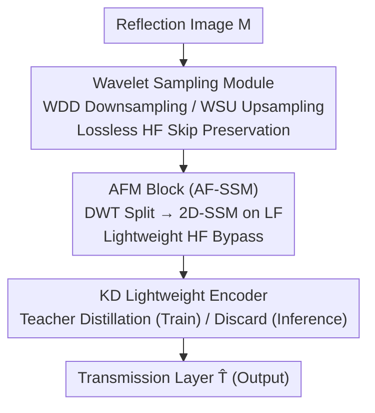

# LightRR: A Lightweight Network for Single Image Reflection Removal

**Conference**: CVPR 2026  
**Paper**: [CVF Open Access](https://openaccess.thecvf.com/content/CVPR2026/html/Yin_LightRR_A_Lightweight_Network_for_Single_Image_Reflection_Removal_CVPR_2026_paper.html)  
**Code**: None  
**Area**: Image Restoration / Reflection Removal / Lightweight  
**Keywords**: Single Image Reflection Removal, Mamba State Space Model, Wavelet Transform, Knowledge Distillation, Lightweight

## TL;DR
To address the issues of excessive size and slow speed in Single Image Reflection Removal (SIRR) models, LightRR employs wavelet frequency division to process low-frequency components (where reflections are concentrated) using a Mamba State Space Model, while high-frequency components pass through a lightweight bypass. During training, a knowledge distillation strategy allows a small encoder to learn from large pre-trained models and then discard them for inference. LightRR achieves near-SOTA performance using only 3.01% of the parameters and 5.22% of the FLOPs compared to RDNet.

## Background & Motivation
**Background**: When photographing through glass, the captured image $M$ contains both the desired transmission layer $T$ and the interfering reflection layer $R$, typically modeled as $M=T+R$. Separating these layers from a single image is a highly ill-posed problem. Recent deep learning advances (CEILNet, DSRNet, DSIT, RDNet, etc.) have shown significant progress but at the cost of skyrocketing parameters and computational requirements. Many SOTA methods rely on large CNN/Transformer backbones and pre-trained networks to obtain the global context necessary to distinguish reflections.

**Limitations of Prior Work**: Existing methods suffer from extremely high FLOPs and parameter counts—RDNet reaches 315.71M parameters and 184.21 GFLOPs, while DSIT utilizes 326.96M parameters and 233.18 GFLOPs. Pre-trained backbones often account for 60%–90% of the total parameters. Such heavy computational demands limit deployment on resource-constrained platforms like smartphones and edge devices. Lightweight methods based on deep unfolding require multiple iterations during inference, leading to high practical overhead.

**Key Challenge**: Reflection removal requires a **large receptive field/global context** to differentiate reflections from the background, but also demands **low computational cost** for practical deployment. These two requirements are fundamentally contradictory, as global modeling usually drives models to become larger and heavier.

**Goal**: To develop a truly lightweight and deployable reflection removal network that achieves both "global modeling capability" and "low computational cost" without sacrificing performance.

**Key Insight**: This work is based on two observations. First, Mamba (a variant of structured state space models, S4) can model long-range dependencies like Transformers but with **linear complexity**, making it suitable for efficient backbones. Second, reflections and transmissions have distinct frequency domain characteristics—visualizations show reflection artifacts ($M-T$) are mainly distributed in the **low-frequency LL** components, while high-frequency components (LH/HL/HH) are nearly identical in both $M$ and $T$, carrying critical details. This suggests that **uniform processing** across all frequencies (as seen in most SOTA methods) is suboptimal and computationally wasteful.

**Core Idea**: Replace large "uniform frequency" backbones with a "frequency-domain divide-and-conquer" approach using SSM. Computational power is concentrated on Mamba for low-frequency components rich in reflection artifacts, while high-frequency components are preserved via a lightweight path. Furthermore, knowledge distillation "transfers" the representation power of large models into a small encoder, which is then used independently during inference.

## Method

### Overall Architecture
LightRR is a U-shaped encoder-decoder network that integrates the "reflection in low-frequency, detail in high-frequency" prior into every component. The input image with reflections is first processed by a lightweight encoder optimized via knowledge distillation. The encoder/decoder backbone consists of stacked Asymmetric Frequency Mamba (AFM) blocks. Each block uses Discrete Wavelet Transform (DWT) to partition features into low-frequency LL and three high-frequency sub-bands. **The 2D State Space Model is applied only to the low-frequency components** to build global context, while high-frequency components are refined using lightweight depthwise convolutions. For sampling, the model uses Wavelet Decomposition Downsampling (WDD) and Wavelet Synthesis Upsampling (WSU) instead of interpolation or sub-pixel convolutions, ensuring high-frequency details are preserved through skip connections while deep layers only compute on 1/4 resolution low-frequency data. A large pre-trained "Teacher" network is used during training for feature distillation and discarded during inference.

### Key Designs

**1. Asymmetric Frequency Mamba Block (AFM/AF-SSM): Concentrating compute on reflection-heavy low frequencies**

To address the inefficiency of uniform frequency processing, the AFM block replaces the standard SSM in Mamba with the Asymmetric Frequency State Space Model (AF-SSM). It applies DWT to the input features $F_{in}\in\mathbb{R}^{C\times H\times W}$ to obtain four sub-bands $\{F_{LL},F_{LH},F_{HL},F_{HH}\}$ (each $\mathbb{R}^{C\times H/2\times W/2}$). The low-frequency $F_{LL}$, rich in reflection artifacts, follows a "heavy" path: Depthwise Convolution followed by a 2D-SSM for global context, $F'_{LL}=\text{2D-SSM}(\text{SiLU}(\text{DWConv}(F_{LL})))$. The three high-frequency sub-bands are concatenated and refined via a single lightweight Depthwise Convolution, $F'_{HF}=\text{DWConv}(\text{Concat}(F_{LH},F_{HL},F_{HH}))$. Finally, iDWT reconstructs the feature $F_{out}=\text{iDWT}(F'_{LL},F'_{HF})$. The advantage is that heavy 2D-SSM computation occurs only at 1/4 resolution, capturing long-range context efficiently while significantly reducing computation through DWT-based resolution reduction.

**2. Wavelet Sampling Module WDD / WSU: Lossless sampling at 1/4 resolution**

Traditional interpolation or sub-pixel convolutions introduce feature distortion and irreversibly lose high-frequency details. LightRR uses DWT/iDWT pairs for U-Net sampling. WDD downsampling applies DWT to $F^{en}$ and immediately sends the three high-frequency sub-bands $F^{en}_H\in\mathbb{R}^{3C\times H/2\times W/2}$ through a **skip connection**, bypassing expensive deep layers. Only the semantic-rich and reflection-heavy low-frequency $F^{en}_{LL}$ passes through a convolution layer into the deeper stages ($F_{down}=\text{Conv}(F^{en}_{LL})\in\mathbb{R}^{2C\times H/2\times W/2}$). This design ensures all subsequent AFM blocks operate on only 1/4 of the spatial area. WSU upsampling merges deep features $F^{de}$ with skip connections ($F^{en}_{LL}$, $F^{en}_H$). It uses Low-frequency Semantic Fusion (LSF, a cross-attention mechanism where $F^{en}_{LL}$ provides Query/Value and $F^{de}$ provides Key) to get refined low-frequency $F'_{LL}=\text{LSF}(F^{de},F^{en}_{LL})$, followed by iDWT to reconstruct the original resolution with the high-frequency skips $F_{up}=\text{iDWT}(F'_{LL},F^{en}_H)$.

**3. Knowledge Distillation Lightweight Encoder: Training with large models, inferring without them**

SOTA methods rely on large pre-trained backbones (VGG19, Swin) for representation power, which causes parameter bloat. LightRR treats an efficient encoder as a "student" and a fixed pre-trained network as the "teacher." During training, the student learns from the GT and mimics the teacher's intermediate features via a distillation loss:
$$\mathcal{L}_{distill}=\sum_{k=1}^{K}\big\|\text{Proj}_k(F_{S,k})-F_{T,k}\big\|_1$$
where $\text{Proj}_k$ is a $1\times1$ convolution for channel alignment. This decouples **training complexity from inference cost**. The expensive teacher is only used during training, allowing the student to inherit rich hierarchical features while maintaining minimal parameters and FLOPs for inference.

### Loss & Training
The reconstruction loss constrains the transmission layer in both image and gradient domains: $\mathcal{L}_{rec}=\alpha_1\|\hat T-T\|_2^2+\alpha_2\|\nabla\hat T-\nabla T\|_1$ ($\alpha_1=0.3,\alpha_2=0.6$). Perceptual loss $\mathcal{L}_{per}=\sum_i\omega_i\|\phi_i(\hat T)-\phi_i(T)\|_1$ uses VGG19 layers $\{2,7,12,21,30\}$. Total loss $\mathcal{L}_{all}=\mathcal{L}_{rec}+\mu_1\mathcal{L}_{per}+\mu_2\mathcal{L}_{distill}$ ($\mu_1=0.01,\mu_2=0.2$). Training is two-stage: ① Distillation for 40 epochs with $\mathcal{L}_{distill}$, learning rate $2\times10^{-4}$ decayed to $1\times10^{-4}$; ② Fine-tuning for 40 epochs with $\mathcal{L}_{rec}+\mu_1\mathcal{L}_{per}$ (without distillation) at $1\times10^{-4}$.

## Key Experimental Results

### Main Results
Trained following DSRNet (7,643 synthetic PASCAL VOC + real pairs) and evaluated on Real20 and SIR² (Objects/PostCard/Wild). Average results under the "w/o Nature" setting:

| Method | Avg PSNR | Avg SSIM | Params(M) | GFLOPs |
|------|-----------|-----------|---------|--------|
| DSIT | **26.27** | **0.917** | 326.96 | 233.18 |
| RDNet | 25.95 | 0.908 | 315.71 | 184.21 |
| DSRNet | 25.40 | 0.905 | 350.33 | 143.71 |
| ERRNet | 23.53 | 0.879 | 162.62 | 359.18 |
| **LightRR (Ours)** | 25.88 | 0.911 | **9.50** | **9.62** |

LightRR's average PSNR is only 0.26 dB lower than RDNet's, and its SSIM is only 0.02 lower, while utilizing **3.01% of the parameters and 5.22% of the FLOPs**.

### Ablation Study
Averaged across four real benchmarks:

| Configuration | PSNR / SSIM | Params(M) | GFLOPs | Peak Mem(MB) | Description |
|------|-------------|---------|--------|---------------|------|
| Full model (Ours) | **26.39 / 0.915** | 9.50 | 9.62 | 170.72 | Full model |
| AF-SSM → Native 2D-SSM | 25.95 / 0.909 | — | — | 361.03 | SSM on full feature; memory doubles |
| Wavelet → Sub-pixel Conv | 26.17 / 0.911 | 10.37 | 14.47 | — | Higher cost, lower performance |

Knowledge distillation (KD) ablation: (A) No pre-trained features → worst performance; (B) Injecting VGG19 directly without distillation → higher overhead and lower metrics; (Ours) $\mathcal{L}_{distill}$ → best results.

### Key Findings
- **AF-SSM is the primary memory saver**: Replacing it with full-feature 2D-SSM causes a 0.44 dB drop in PSNR and an 111% increase in peak memory (170.72MB to 361.03MB).
- **Efficiency via frequency divide-and-conquer**: Replacing the wavelet-based sampling with sub-pixel convolutions degrades parameters, FLOPs, and metrics.
- **Scalability**: As resolution increases (224 to 1024), the gap between LightRR and heavy competitors widens, showing better scalability.
- **Decoupling representation from cost**: Distillation allows the student to gain representation power from large models without carrying the computational burden into inference.

## Highlights & Insights
- **Prior-driven compute allocation**: Converting the observation "reflection is low-frequency, detail is high-frequency" into an asymmetric architecture ("heavy compute for LF, lossless bypass for HF") is a practical translation of domain priors.
- **First Mamba for SIRR**: Using linear-complexity SSM to replace large Transformers for global context effectively resolves the conflict between global modeling and computational efficiency.
- **"Train-then-discard" Distillation**: Using a teacher only during training to internalize hierarchical features without inference costs is a valuable strategy for lightweighting tasks dependent on pre-trained backbones.
- **Lossless Wavelet Sampling**: Using DWT/iDWT for sampling preserves details and naturally reduces spatial resolution for efficient processing.

## Limitations & Future Work
- Performance still lags slightly behind massive models (PSNR ~0.39 dB lower than DSIT), a trade-off for extreme efficiency.
- Reliance on the frequency-domain prior; performance may degrade in extreme cases where reflections contain high-frequency components or overlap significantly with the transmission spectrum.
- Training cost remains high due to the requirement of a large teacher network.
- Inference latency slightly increases due to DWT/iDWT operations, requiring careful balancing in latency-critical scenarios.

## Related Work & Insights
- **vs. RDNet / DSIT**: These rely on 300M+ parameters and uniform frequency processing; LightRR uses Mamba and frequency division to achieve comparable accuracy with 3% of the params.
- **vs. Deep Unfolding**: Unfolding methods have small parameters but high inference overhead due to iterations; LightRR is a single-forward lightweight U-Net.
- **vs. Scaled-down SOTA**: At the same parameter budget (e.g., DSIT-light), LightRR outperforms them by over 1 dB, proving efficiency comes from architecture, not just size.

## Rating
- Novelty: ⭐⭐⭐⭐ First application of Mamba in SIRR, with a novel combination of asymmetric frequency division and distillation.
- Experimental Thoroughness: ⭐⭐⭐⭐ Extensive real benchmark evaluation, efficiency metrics, and comprehensive ablations.
- Writing Quality: ⭐⭐⭐⭐ Clear motivation linking frequency observations to architectural design.
- Value: ⭐⭐⭐⭐⭐ Highly practical for mobile/edge deployment by reducing computation by two orders of magnitude with minimal accuracy loss.

<!-- RELATED:START -->

## Related Papers

- [\[CVPR 2025\] Reversible Decoupling Network for Single Image Reflection Removal](../../CVPR2025/image_restoration/reversible_decoupling_network_for_single_image_reflection_removal.md)
- [\[CVPR 2026\] Reflection Separation from a Single Image via Joint Latent Diffusion](reflection_separation_from_a_single_image_via_joint_latent_diffusion.md)
- [\[CVPR 2026\] ReflexSplit: Single Image Reflection Separation via Layer Fusion-Separation](reflexsplit_single_image_reflection_separation_via_layer_fusion-separation.md)
- [\[CVPR 2026\] Polarization State Tracing for Reflection Removal and Color-Consistent Reconstruction](polarization_state_tracing_for_reflection_removal_and_color-consistent_reconstru.md)
- [\[CVPR 2026\] UCAN: Unified Convolutional Attention Network for Expansive Receptive Fields in Lightweight Super-Resolution](ucan_unified_convolutional_attention_lightweight_sr.md)

<!-- RELATED:END -->
