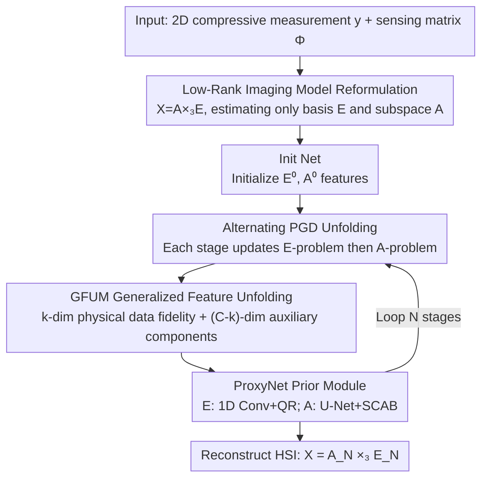

# LRDUN: A Low-Rank Deep Unfolding Network for Efficient Spectral Compressive Imaging

**Conference**: CVPR 2026  
**Paper**: [CVF Open Access](https://openaccess.thecvf.com/content/CVPR2026/html/Huang_LRDUN_A_Low-Rank_Deep_Unfolding_Network_for_Efficient_Spectral_Compressive_CVPR_2026_paper.html)  
**Code**: https://github.com/huang-he99/LRDUN  
**Area**: Image Restoration / Spectral Compressive Imaging / Deep Unfolding Network  
**Keywords**: Hyperspectral Reconstruction, CASSI, Low-Rank Decomposition, Deep Unfolding, Proximal Gradient Descent

## TL;DR
Directly embeds the low-rank decomposition of hyperspectral images (HSI) $X=A\times_3 E$ into the physical imaging (sensing) model of CASSI. Instead of reconstructing the entire high-dimensional data cube, the network alternatingly solves two lower-dimensional sub-problems: the "spectral basis $E$" and the "spatial subspace map $A$". Based on this, proximal gradient descent (PGD) is unfolded into LRDUN, and a Generalized Feature Unfolding Mechanism (GFUM) is proposed to decouple physical rank from feature dimension. LRDUN achieves a state-of-the-art (SOTA) PSNR of 40.96 dB on the KAIST dataset with only 30.58 GFLOPs, significantly reducing computational cost compared to competitive methods.

## Background & Motivation

**Background**: Spectral compressive imaging (SCI), especially CASSI (Coded Aperture Snapshot Spectral Imaging), compresses the entire 3D HSI data cube into a 2D measurement $Y$ via a single exposure, shifting the physical burden of hardware acquisition to computational reconstruction. The current dominant reconstruction paradigm is Deep Unfolding Networks (DUNs), which "unfold" iterative optimization algorithms such as PGD/ADMM/HQS into multiple trainable stages. Each stage alternatingly performs a data fidelity step (linear update) and a deep prior step (learnable denoising), retaining the interpretability of model-based methods while achieving the accuracy of end-to-end learning.

**Limitations of Prior Work**: Existing DUNs are entirely built on the "full HSI imaging model". In each stage, operations are directly carried out on the high-dimensional data cube $X\in\mathbb{R}^{H\times W\times B}$ to reconstruct the whole 3D cube from a single 2D measurement. This introduces two major issues: first, **computational redundancy**, as each stage processes data within the large $H\times W\times B$ space; second, **severe ill-posedness**, as back-projecting 2D residuals to 3D space involves a massive dimensional gap with far more unknowns ($H\times W\times B$) than observations, making each stage solve a highly underdetermined inverse problem.

**Key Challenge**: HSIs inherently possess strong spectral correlation and are naturally low-rank. However, existing works only treat the low-rank property as an "additional regularization term" or "post-processing module" (such as nuclear norm loss, TSVD layers, or subspace distillation SP) without altering the full HSI imaging model in the data fidelity term. As a result, the high dimensionality of the reconstruction variables remains, leaving both the ill-posedness and the computational burden unresolved.

**Goal**: (1) Rewrite the imaging model from stage one to transform high-dimensional reconstruction into low-dimensional sub-problems; (2) design an interpretable and efficient unfolding network based on this model; (3) address the side effects where physical rank constraints limit network expressiveness.

**Key Insight**: Rather than treating the low-rank property as an external plugin regularizer, the low-rank decomposition $X=A\times_3 E$ is **directly substituted into the sensing equations**. This forces the network to estimate the compact $E$ and $A$ from the beginning instead of the entire $X$. Since the physical rank $k\ll B$, the number of unknowns is drastically reduced, inherently mitigating the ill-posedness.

**Core Idea**: Reparameterize the sensing model itself into two lower-dimensional sub-problems: a "spectral basis imaging model" and a "subspace imaging model". Solve them jointly using an unfolded alternating PGD, and decouple the physical rank from the feature dimension using GFUM.

## Method

### Overall Architecture
LRDUN aims to solve: given a 2D compressive measurement $y$ and a known CASSI sensing matrix $\Phi$, reconstruct the hyperspectral cube $X$. Its key transition is **not directly estimating $X$**, but instead reformulating the sensing equations using low-rank decomposition $X=A\times_3 E$ ($E\in\mathbb{R}^{B\times k}$ is the spectral basis, $A\in\mathbb{R}^{H\times W\times k}$ is the subspace map, and $k$ is the physical rank with $k\ll B$) into two lower-dimensional imaging models with respect to $E$ and $A$. The entire network unfolds the alternating PGD for solving these two sub-problems into $N$ stages: first, an Init Net provides initial features $E^0_{\text{feat}},A^0_{\text{feat}}$. Within each stage, the E-problem (updating spectral basis) is solved first, followed by the A-problem (updating subspace). Each sub-problem contains a GFUM-based data-fidelity feature term and a learnable ProxyNet prior refinement. After $N$ stages, the final outputs $E_N,A_N$ are reconstructed into $X=A_N\times_3 E_N$.

### Key Designs

**1. Low-Rank Imaging Model Reformulation: Directly substituting low-rank decomposition into sensing equations to reduce dimensionality from the source**

To address the pain point where the "full HSI model leads to dimensional gaps and severe ill-posedness", the authors incorporate the low-rank prior directly into the imaging physics. The original vectorized imaging model of CASSI is $y=\Phi x+n$, where $x=\mathrm{vec}(X)$ requires solving for $N=H\times W\times B$ unknowns. Benefiting from the spectral low-rankness of HSIs, $X=A\times_3 E$ is written as $X_{(3)}=EA_{(3)}^\top$ in matrix form. By utilizing the vectorization identity $\mathrm{vec}(UVW)=(W^\top\otimes U)\,\mathrm{vec}(V)$, and respectively setting $(U,V,W)=(A,E^\top,I_B)$ and $(I_{HW},A,E^\top)$, two complementary imaging models are derived:

$$y=\Phi_A e+n,\qquad y=\Phi_E a+n,$$

where $e=\mathrm{vec}(E^\top)$, $a=\mathrm{vec}(A)$, $\Phi_A=\Phi(I_B\otimes A)$, and $\Phi_E=\Phi(E\otimes I_{HW})$ represent the sensing matrices for the respective sub-problems. Consequently, the reconstruction target is transformed from "the whole $X$" to "estimating $E\in\mathbb{R}^{B\times k}$ and $A\in\mathbb{R}^{HW\times k}$". Since $k\ll B$, the number of unknowns is drastically reduced: the spectral basis $E$ captures global spectral correlation and material features, while the subspace map $A$ encodes high-frequency spatial structures and local spectral sparsity. This step is the foundation of all subsequent efficiency and robustness, independently boosting PSNR from 38.16 dB to 39.44 dB while cutting FLOPs by 61.9% in ablation studies.

**2. Alternating PGD Unfolding: Unfolding the iterative optimization of two sub-problems into a learnable N-stage network**

With the two low-dimensional imaging models established, the authors formulate the SCI task as a joint optimization problem:

$$\min_{e,a}\ \tfrac12\|y-\Phi_A e\|_2^2+\tfrac12\|y-\Phi_E a\|_2^2+\lambda_e R_e(e)+\lambda_a R_a(a),$$

And alternatingly update $e$ and $a$ using proximal gradient descent (PGD). For the E-problem, $a_i$ is fixed to solve the quadratic problem regarding $e$: the gradient step is first performed as $e^{i+1/2}=e^i-\rho_e\Phi_{A_i}^\top(\Phi_{A_i}e^i-y)$, followed by the proximal operator $e^{i+1}=\mathrm{prox}_{\lambda_e\rho_e,R_e}(e^{i+1/2})$. The A-problem updates $a$ symmetrically. Each iteration is mapped to a network stage: gradient steps correspond to physics-driven data fidelity terms ($D_E,D_A$), and proximal steps are realized as learnable prior modules (ProxyNet E / ProxyNet A). Thus, the network inherits the interpretable structure of PGD (each step has a clear physical meaning) while being trainable end-to-end. Larger $N$ yields better quality but linearly increases computational cost; the paper provides three configurations ($N=3/6/9$) to adapt to different computational budgets.

**3. GFUM (Generalized Feature Unfolding Mechanism): Unlocking the expressiveness bottleneck caused by physical rank constraints**

Direct unfolding runs the risk where data-fidelity terms are defined strictly in the $k$-dimensional physical space, locking the input and output of ProxyNets inside this $k$-dimensional manifold, severely limiting network expressiveness to learn complex spatial-spectral dependencies. GFUM solves this by elevating $k$-dimensional physical variables into $C$-dimensional features ($C\ge k$) and **explicitly splitting them into two halves**: the first $k$ dimensions are "physical components" that participate in data fidelity (e.g., $E^i=E^i_{\text{feat}}(:k)\to E^{i+1/2}=D_E(E^i,y,\Phi,A_i)$); the remaining $(C-k)$ dimensions are "auxiliary components" that bypass the data fidelity step completely ($E^{i+1/2}_{\text{aux}}=E^i_{\text{aux}}$). They are then concatenated back into $E^{i+1/2}_{\text{feat}}=[E^{i+1/2};E^{i+1/2}_{\text{aux}}]$ and fed into the subsequent ProxyNet for joint refinement. Notably, though structurally simple, the auxiliary components are highly critical: visualizations show they implicitly learn spatially-variant information, such as proximal parameters, noise residuals, reconstruction artifacts, and even encode the physical mask of CASSI, thereby aiding the physical components in recovering rich details and suppressing noise. This decouples physical consistency (handled by rank $k$) from narrative capacity (handled by feature dimension $C$).

**4. ProxyNet Prior Modules: Custom-designed lightweight dual branches matching spectral and spatial structures**

The prior modules for the two sub-problems are structurally distinct, tailoring to the physical attributes of $E$ and $A$. ProxyNet E is a lightweight 1D architecture composed of stacked 1D convolutions, GELU, and residual connections to model local spectral correlations, applying a **QR decomposition to force column-orthonormality** ($E^\top E=I$). This enforces the orthogonality of the spectral basis, stabilizing the decomposition. ProxyNet A is a U-Net architecture employing symmetric Spatial Convolutional Attention Blocks (SCAB) alongside up/down-sampling blocks to capture spatial dependencies in subspace features. SCAB (detailed in Fig.3 of the original paper) adopts a "convolution-like attention" approach, utilizing a large $11\times11$ depthwise separable convolution to efficiently model long-range dependencies with a wide receptive field and selectively enhance features. It is identified in ablation studies as the major contributor to restoring sharp textures/edges and suppressing over-smoothing.

### Loss & Training
A multi-stage RMSE loss is adopted to supervise reconstruction at every stage. Implemented in PyTorch and trained on a single RTX 4090; Adam optimizer with an initial learning rate of $4\times10^{-4}$ and cosine annealing over 300 epochs with a batch size of 2. In all experiments, the physical rank is set to $k=11$ and the feature dimension to $C=16$. The number of stages is varied as $N=3/6/9$ to adapt to different model scales.

## Key Experimental Results

Datasets: Simulation experiments are trained on CAVE and tested on 10 KAIST scenes (each cropped to $256\times256$), adopting the $256\times256$ real coding mask from TSA-Net. Real-world experiments are conducted on 5 real measurements captured by a real CASSI system (spatial dimension $660\times714$).

### Main Results (Average PSNR/SSIM on 10 KAIST Scenes + Computational Complexity)

| Method | Source | Params (M) | FLOPs (G) | PSNR (dB) | SSIM |
|------|------|-----------|-----------|-----------|------|
| RDLUF-9stg | CVPR 2023 | 1.81 | 115.34 | 39.57 | 0.974 |
| DPU-9stg | CVPR 2024 | 2.85 | 49.26 | 40.52 | 0.977 |
| SSR-L | CVPR 2024 | 5.18 | 78.93 | 40.69 | 0.978 |
| LADE-DUN-9stg | ECCV 2024 | 2.78 | 88.68 | 40.09 | 0.979 |
| MiJUN-9stg | AAAI 2025 | 0.56 | 73.67 | 40.86 | 0.982 |
| **LRDUN-3stg** | Ours | 0.69 | **10.26** | 39.44 | 0.972 |
| **LRDUN-6stg** | Ours | 1.37 | 20.45 | 40.30 | 0.976 |
| **LRDUN-9stg** | Ours | 2.04 | 30.58 | **40.96** | 0.982 |
| **LRDUN-9stg\*** | Ours | **0.25** | 30.58 | 40.75 | 0.979 |

LRDUN-9stg achieves the highest average PSNR of 40.96 dB, surpassing the prior best DUNs (MiJUN-9stg 40.86 dB, SSR-L 40.69 dB). The key breakthrough lies in efficiency: while RDLUF-9stg and MiJUN-9stg reduce parameters using cross-stage parameter sharing, their FLOPs remain high (115.34 G / 73.67 G). In contrast, LRDUN-9stg achieves superior accuracy with only 30.58 GFLOPs. LRDUN-9stg\* uses the same cross-stage parameter sharing strategy, reducing parameters to just 0.25 M with negligible performance drop (40.75 dB), demonstrating the model's efficiency and scalability. Even the smallest LRDUN-3stg delivers 39.44 dB with only 10.26 GFLOPs / 0.69 M, positioning itself at the top-left corner of the accuracy-efficiency trade-off curve (Fig.1 in the paper).

### Ablation Study

**Low-Rank Embedding Schemes (Table 2, 3-stage)**

| Configuration | PSNR (dB) | Params (M) | FLOPs (G) | Description |
|------|-----------|-----------|-----------|------|
| Baseline-1 | 38.16 | 1.87 | 26.95 | Only ProxyNetA directly processes the full HSI |
| w. NNL | 37.66 | 1.87 | 26.95 | Adding nuclear norm loss makes training unstable and degrades performance |
| w. TSVD | 37.93 | 1.87 | 26.95 | Inserting TSVD layer, also unstable during training |
| w. SP-1 | 38.33 | 1.87 | 26.95 | Post-processing with subspace distillation, slight improvement but still relies on full HSI reconstruction |
| w. SP-2 | 38.52 | 1.87 | 26.95 | SP variant |
| **LRDUN** | **39.44** | **0.69** | **10.26** | Reformulated imaging model, accuracy ↑ and FLOPs −61.9% |

**Attention Mechanisms (Table 3, LRDUN-3stg)**

| Configuration | PSNR (dB) | Params (M) | FLOPs (G) | Description |
|------|-----------|-----------|-----------|------|
| Baseline-2 | 37.48 | 0.56 | 7.55 | Without SCAB |
| W-MSpaA | 39.13 | 0.74 | 9.73 | Window spatial attention |
| W-MSpeA | 39.02 | 0.74 | 9.70 | Window spectral attention |
| HS-MSA | 39.31 | 0.74 | 9.89 | Half-Shuffle attention |
| **SCAB** | **39.44** | 0.69 | 10.26 | Ours, convolution-like attention |

### Key Findings
- **Dimensionality reduction is more effective than adding regularization**: Treating low-rankness as an external plugin regularizer (NNL/TSVD) destabilizes training and degrades performance, while post-processing (SP) only yields minor improvements while carrying the heavy computation of full HSI reconstruction. Only reformulating the physical imaging model directly improves accuracy while slashing FLOPs by 61.9%. This is the core empirical finding of this work.
- **Larger feature dimension $C$ in GFUM is better, but requires a trade-off**: Fixing $k=11$ while increasing $C$ monotonically boosts PSNR (proving expanded expressiveness), but also increases FLOPs, hence $C=16$ is selected by default. Visualizations (Fig.7) show that the physical components capture semantic structures (object contours, logos), while the auxiliary components encode high-frequency textures, foreground-background separation, and mask perception cues, complementing each other.
- **An optimal physical rank $k$ exists**: When fixing $C=16$ and varying $k$, performance first increases and then saturates or degrades — too small a $k$ fails to model HSI spectral diversity, while too large a $k$ compresses the auxiliary feature space $(C-k)$, making $k=11$ the optimal choice.
- **Strong generalization**: On real-world datasets, LRDUN-9stg (trained only on simulated data) preserves both spatial structure and spectral consistency without any fine-tuning. The authors attribute this robustness to the fundamental mitigation of ill-posedness enabled by the low-rank reformulation.

## Highlights & Insights
- **"Welding" priors into physical models rather than "hanging" them outside**: Historically, low-rankness was only a regularizer or post-processing step. This paper rewrites the sensing matrices $\Phi_A$ and $\Phi_E$, forcing the network to solve the inverse problem in a low-dimensional space from step one. This paradigm of "modifying the imaging model itself" can be transferred to other inverse problems (e.g., MRI, CT, demosaicing) — any reconstruction task where target signals have strong structural priors but suffer from high-dimensional burdens can benefit from substituting priors directly into the forward operators.
- **The "physical + auxiliary" split in GFUM is elegant**: It resolves the common issue in deep unfolding networks where strict physical constraints compress dimensions and restrict network capacity. Retaining $k$ dimensions for physical consistency while reserving $(C-k)$ dimensions as a "free learning carrier" effectively boosts capacity without breaking interpretability. Visualizations prove that the auxiliary components successfully capture physical nuances like masks and noise residuals.
- **Custom-tailored ProxyNets matching physical properties**: The spectral basis uses 1D convolutions + QR orthonormalization (preserving basis orthogonality), whereas the subspace map uses a U-Net + large-kernel SCAB (preserving long-range spatial dependencies). These architectural choices are physically motivated rather than randomly stacked.
- **Genuine performance-efficiency trade-off**: At 9 stages, the FLOPs are nearly 4 times lower than RDLUF and over 2 times lower than MiJUN, while achieving higher PSNR.

## Limitations & Future Work
- **Physical rank $k$ requires manual tuning**: $k=11$ is an optimal value searched on CAVE/KAIST. Whether it fits other datasets/spectral bands, or if $k$ can be adaptively estimated, is not fully explored.
- **Dependence on a known sensing matrix $\Phi$ and mask calibration**: Like most CASSI DUNs, LRDUN assumes $\Phi$ is precisely known. The impact of actual calibration errors or mask misalignment on the low-rank reparameterization remains unassessed.
- **Evaluations are limited to the classic CAVE $\to$ KAIST pipeline**: The 10 mock scenes of size $256\times256$ represent a relatively small scale. Performance on larger spatial scenes, more spectral bands, or different dispersion configurations remains to be verified.
- **Promising future directions**: Making $k$ and $C$ learnable or input-adaptive; transferring the proposed "low-rank physical reformulation + GFUM" to video SCI, CT/MRI, and other compressive sensing reconstructions.

## Related Work & Insights
- **vs. Existing Full-HSI DUNs (DAUHST / PADUT / RDLUF / DPU / SSR / MiJUN)**: These methods execute alternating data fidelity and deep prior steps on the entire $H\times W\times B$ cube, resulting in severe ill-posedness and high computational costs. LRDUN solves lower-dimensional $E$ and $A$ instead, yielding better accuracy with dramatically lower FLOPs.
- **vs. Low-Rank as Regularization/Post-Processing (NNL, TSVD, CP Decomposition in TLPLN, Subspace Distillation SP)**: These methods do not reformulate the full HSI forward imaging model, leaving the high-dimensional objective variables intact. LRDUN rewrites the sensing model itself, outperforming these benchmarks across all settings (39.44 vs. $\le$ 38.52 dB in ablations).
- **vs. Plug-and-Play (PnP) Frameworks (e.g., DIP-HSI)**: PnP schemes insert fixed pre-trained denoisers, which struggle with adapting to physical spectral cues and exhibit slow convergence. LRDUN features end-to-end learnable ProxyNets, where the QR orthonormalization of ProxyNet E embeds explicit physical constraints that PnP struggles to enforce.

## Rating
- Novelty: ⭐⭐⭐⭐⭐ Substituting low-rank decomposition directly into the sensing model to construct two low-dimensional sub-problems represents a paradigm shift for SCI DUNs, rather than just adding another denoising module.
- Experimental Thoroughness: ⭐⭐⭐⭐ Extensive simulations, real-world data, various stage configurations, and three sets of ablations (low-rank embedding / GFUM / attention) are provided; though evaluation scales remain classic.
- Writing Quality: ⭐⭐⭐⭐ Mathematical formulations are clear, aligning well with motivations and ablations; block architecture details of ProxyNet are deferred to the supplementary material.
- Value: ⭐⭐⭐⭐⭐ Exceptional computation-accuracy efficiency and solid generalization payload. The concept of "incorporating priors into forward operators" serves as an inspiring paradigm for a broad class of compressive sensing reconstructions.

<!-- RELATED:START -->

## Related Papers

- [\[CVPR 2026\] Dual Graph Regularized Deep Unfolding Network for Guided Depth Map Super-resolution](dual_graph_regularized_deep_unfolding_network_for_guided_depth_map_super-resolut.md)
- [\[CVPR 2026\] SGDE: Self-supervised Geometry Degradation Estimation Framework for Coded Aperture Compressive Spectral Imaging](sgde_self-supervised_geometry_degradation_estimation_framework_for_coded_apertur.md)
- [\[CVPR 2026\] Spectral Super-Resolution via Adversarial Unfolding and Data-Driven Spectrum Regularization](spectral_super-resolution_via_adversarial_unfolding_and_data-driven_spectrum_reg.md)
- [\[ICML 2026\] Phy-CoSF: Physics-Guided Continuous Spectral Fields Reconstruction and Super-Resolution for Snapshot Compressive Imaging](../../ICML2026/image_restoration/phy-cosf_physics-guided_continuous_spectral_fields_reconstruction_and_super-reso.md)
- [\[CVPR 2026\] Gaussian Splatting-based Low-Rank Tensor Representation for Multi-Dimensional Image Recovery](gaussian_splatting-based_low-rank_tensor_representation_for_multi-dimensional_im.md)

<!-- RELATED:END -->
