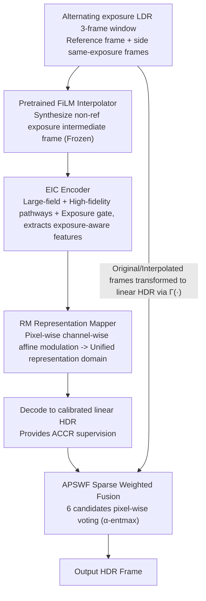

# LRHDR: Learning Representation-enhanced HDR Video Reconstruction

**Conference**: CVPR 2026  
**Paper**: [CVF Open Access](https://openaccess.thecvf.com/content/CVPR2026/html/Liao_LRHDR_Learning_Representation-enhanced_HDR_Video_Reconstruction_CVPR_2026_paper.html)  
**Code**: To be confirmed  
**Area**: Image Restoration / HDR Video Reconstruction  
**Keywords**: HDR video, multi-exposure fusion, cross-exposure representation, sparse weighted fusion, ghosting suppression

## TL;DR
LRHDR reconstructs HDR video from LDR video frames with alternating exposures. It replaces the traditional "align-then-fuse" paradigm with a "map-to-unified-representation and vote-to-fuse" approach: it uses the ACCR network to align features from different exposures into an exposure-agnostic unified representation domain via pixel-wise affine modulation, while the APSWF reformulates fusion as pixel-wise sparse candidate selection. It achieves State-of-the-Art (SOTA) in PSNR/SSIM for both two-exposure and three-exposure settings.

## Background & Motivation

**Background**: Standard cameras can only capture a narrow dynamic range. To obtain HDR video, the most practical route is to **alternate exposures** during shooting (e.g., odd frames at EV-3, even frames at EV+0) and then fuse adjacent LDR frames of different exposures into an HDR frame. Most existing HDR video methods follow the "alignment–reconstruction" paradigm: first registering neighboring frames to the reference frame using optical flow, deformable convolutions, or attention, followed by fusion.

**Limitations of Prior Work**: Alternating exposures introduce triple difficulties: large motion, photometric inconsistency caused by exposure changes, and information loss in overexposed/underexposed areas. These factors combined make **pixel-wise alignment a highly ill-posed problem**: overexposed regions lack matchable textures, while underexposed regions are submerged in dark noise, making optical flow inherently unreliable between different exposure frames. Once the intermediate alignment results are distorted, the artifacts propagate to the final HDR, manifesting as obvious ghosting and detail loss in dynamic areas.

**Key Challenge**: The overall upper bound of the traditional paradigm is limited by two factors: **alignment precision** and **performance of the fusion module**. However, in alternating exposure scenarios, the premise of "forcibly aligning different exposure frames to the reference frame at the pixel level" is itself difficult to establish. The more aggressive the alignment, the more severe the ghosting, often adding burden to subsequent reconstruction.

**Goal**: To bypass explicit cross-exposure alignment by reformulating "how to make different exposure frames complementary" as "how to map them to a shared, exposure-agnostic representation," and changing fusion from "how much to weighted average" to "which candidate to trust for each pixel."

**Key Insight**: The authors observe that under the assumption of locally well-exposed regions and a monotonic, differentiable camera response function, the derivative of features with respect to the exposure log $s=\log e$ can be approximated in an affine form $\partial_s E(x)\approx a(x,s)E(x)+b(x,s)$. Integrating along the exposure path yields $E(X^{e_b})(x)\approx k(x)E(X^{e_a})(x)+b(x)$—implying that **cross-exposure feature relationships are essentially pixel-wise, channel-wise linear modulations**. Thus, features from one exposure can be "translated" to another exposure domain without spatial alignment.

**Core Idea**: Replace "explicit alignment + dense fusion" with "mapping to unified representation + sparse voting fusion" to circumvent ill-posed cross-exposure pixel registration at the source.

## Method

### Overall Architecture
The input to LRHDR is an alternating exposure LDR video $\{L_t\}$ (the main paper focuses on the two-exposure mode $N_e=2$, with three-exposure $N_e=3$ in the appendix), and the output is an HDR video of the same length $\{H_t\}$. At time $t$, the framework takes a three-frame sliding window $L^{e_0}_{t-1}, L^{e_1}_t, L^{e_0}_{t+1}$, where $L^{e_1}_t$ is the reference frame. The entire pipeline is linked by three learnable/pretrained components:

1.  **Pretrained Interpolator (FiLM)**: A pretrained frame interpolation network FiLM is used to synthesize a non-reference exposure intermediate frame $\hat{L}^{e_0}_t$ from the same-exposure side frames $L^{e_0}_{t-1}, L^{e_0}_{t+1}$, providing motion information "independent of the reference frame" (this acts as a scaffold with frozen weights).
2.  **ACCR (Core Contribution ①)**: $\{L^{e_1}_t, \hat{L}^{e_0}_t\}$ are fed into ACCR. Internally, an **EIC encoder** extracts exposure-aware features, followed by the **RM (Representation Mapper)** which applies pixel-wise affine modulation to different exposure features to map them to a unified representation domain, decoding into calibrated linear HDR frames $\{\tilde{H}^{e_1}_t, \tilde{\hat{H}}^{e_0}_t\}$.
3.  **APSWF (Core Contribution ②)**: Six candidates including the original/interpolated LDR frames, candidates transformed to the linear HDR domain via $\Gamma(\cdot)$ $\{H^{e_0}_{t-1}, H^{e_1}_t, H^{e_0}_{t+1}, \hat{H}^{e_0}_t\}$, and unified representation HDRs $\{\tilde{H}^{e_1}_t, \tilde{\hat{H}}^{e_0}_t\}$ from ACCR are fed in. It predicts pixel-wise sparse normalized masks for weighted fusion to output the final HDR frame.

The LDR to linear HDR transformation is defined as $\Gamma(L)=L^{\gamma}/e$, where $\gamma=2.2$ and $e$ is the exposure time.

### Key Designs

**1. EIC Encoder: Tailored Exposure-aware Feature Extraction for Interleaved Exposure**

Traditional encoders treat all frames equally, but the distribution of reliable information in alternating exposures is completely different (underexposed frames are reliable in highlights; overexposed frames are reliable in shadows). EIC (Exposure-aware Interleaved Context) uses a dual-branch structure with a scalar exposure gate to let features "know which exposure they originate from." For a frame $L^{e_i}_t$, the fused feature is $F^{e_i}_t = \mathrm{LF}(L^{e_i}_t) + \alpha(e_i)\cdot \mathrm{HF}(L^{e_i}_t)$. The **LF (Large-Field) branch** uses standard convolutions with stride=2 for a large receptive field and stable spatial context. The **HF (High-Fidelity) branch** uses pixel-unshuffle, channel splitting, dot products, and stride=1 convolutions to preserve sub-pixel fine structures. The exposure gate $\alpha(e_i)=\sigma(w\log(e_i+\varepsilon)+b)$ (with $\varepsilon=10^{-8}$ and $w,b$ as learnable scalars) adaptively adjusts the high-fidelity branch weight based on the log exposure time—the model's trust in the fine branch changes with exposure length. Thus, LF and gated HF form an exposure-aware multi-scale information exchange mechanism.

**2. RM Representation Mapper: Pixel-wise Affine Modulation instead of Explicit Alignment**

The most critical design, addressing the "ill-posed cross-exposure alignment" issue. The RM (Representation Mapper) does not perform any spatial registration. Instead, it learns a normalization mapping $\Pi_e$ that applies to every exposure feature, projecting it onto an exposure-agnostic unified representation $R_t(x)$: $\tilde{F}^e_t(x)=\Pi_e(F^e_t(x))\approx R_t(x)$. Based on the affine conclusion derived in the motivation, $\Pi_e$ takes the form of pixel-wise, channel-wise linear modulation:

$$\tilde{F}^e_t(x) = K^e_t(x) \odot F^e_t(x) + B^e_t(x)$$

where $\odot$ is the Hadamard product, and $K, B$ are modulation coefficients. In areas dominated by overexposure or dark noise, single-path mapping is unreliable, so RM introduces two **cross-exposure cues** to guide the estimation of $K$ and $B$: $C_t=\Gamma(\hat{L}^{e_0}_t)-\Gamma(L^{e_1}_t)$ is a signed cross-exposure difference cue (indicating where to enhance or suppress), and $C^{\circ 2}_t=C_t\odot C_t$ provides magnitude/reliability cues (helping estimate confidence and modulation intensity). The brilliance of this design is that it transforms "how different exposures complement" from a spatial matching problem into a physically-grounded pixel-wise feature modulation problem, fundamentally avoiding distortions caused by forced alignment.

**3. APSWF Sparse Weighted Fusion: Reformulating Fusion as Pixel-wise Candidate Voting**

APSWF (Adaptive Pixel-wise Sparse Weighted Fusion) no longer asks "how much should each source be averaged," but "which reliable candidates should be activated for each pixel." it learns a set of pixel-wise sparse masks $M(x)=(M_1(x),\dots,M_6(x))$ for the 6 candidates $(H^{e_0}_{t-1}, H^{e_1}_t, H^{e_0}_{t+1}, \hat{H}^{e_0}_t, \tilde{H}^{e_1}_t, \tilde{\hat{H}}^{e_0}_t)$, satisfying $M_i(x)\ge 0$ and $\sum_i M_i(x)=1$. The final $\hat{H}_t=\sum_{i=1}^6 M_i H_i$. Fusion is conducted in the linear HDR domain to ensure physical consistency. The backbone is a U-Net with triplet attention, with four 6-channel heads predicting weighted logits at different scales (1/8, 1/4, 1/2, 1×), fused top-down. The key step is using **α-entmax** ($\alpha=1.75$) to project logits onto the 6-simplex, yielding a "winner-takes-all" style sparse mask—it generates **exact zeros** for unreliable candidates while maintaining smooth gradients, allowing only a few reliable candidates to participate in reconstructing each pixel, significantly suppressing ghosting and noise amplification.

### Loss & Training
The total loss is $L_{total}=\lambda_1 L_{Recon}+\lambda_2 L_{ACCR}+\lambda_3 L_{vote}$ (with $\lambda_1=1,\lambda_2=0.1,\lambda_3=0.5$), calculated in the $\mu$-law tone mapping domain $T(H)=\frac{\log(1+\mu H)}{\log(1+\mu)}$ ($\mu=5000$) to enhance perceptual quality:

-   **ACCR Loss** $L_{ACCR}=\lambda_{L1}L_{L1}+\lambda_{grad}L_{grad}$ ($\lambda_{L1}=1.0, \lambda_{grad}=0.01$) supervises the two linear HDR paths decoded by RM. $L_{L1}$ uses a reduced weight $\eta=0.7$ for the interpolated stream to avoid over-constraining. $L_{grad}$ is a multi-scale gradient fidelity loss at 1×/0.5×/0.25× scales (weights $\omega_s=(1.0, 0.5, 0.25)$).
-   **Vote Loss** $L_{vote}$ supervises APSWF using α-entmax cross-entropy: first, find the "oracle candidate" $i^\star(x)=\arg\min_i E_i(x)$ that best matches the ground truth by $E_i(x)=\|T(H_i(x))-T(H^\star(x))\|^2_2$, then align predicted logits with this oracle. This encourages convergence toward one-hot when a single candidate is superior while allowing low-entropy mixing elsewhere, preventing degradation into dense averaging.

Training uses AdamW, with initial learning rates of $10^{-4}$ for APSWF and $10^{-5}$ for ACCR, followed by cosine annealing to $10^{-6}$. Total 300 epochs, batch size 8, on 4×RTX 4090s. Frozen weights from one training session are evaluated across all datasets.

## Key Experimental Results

### Main Results
Evaluated against 7 SOTAs on Cinematic Video [8] and DeepHDRVideo [2] datasets under 2-exposure and 3-exposure settings. Results from the Cinematic Video dataset (PSNR/SSIM calculated in $\mu$-law domain):

| Setting / Dataset | Metric | NECHDR (Next Best) | Ours (LRHDR) | Gain |
| :--- | :--- | :--- | :--- | :--- |
| 2-Exp / Cinematic[8] | PSNR$_T$ | 40.59 | **41.11** | +0.52 |
| 2-Exp / Cinematic[8] | SSIM$_T$ | 0.9241 | **0.9274** | +0.0033 |
| 2-Exp / Cinematic[8] | HDR-VDP-2 | 73.31 | **75.23** | +1.92 |
| 3-Exp / Cinematic[8] | PSNR$_T$ | 37.24 | **37.64** | +0.40 |
| 3-Exp / Cinematic[8] | HDR-VDP-2 | 68.36 | **71.01** | +2.65 |
| 2-Exp / DeepHDRVideo[2]| PSNR$_T$ | 43.44 | **43.49** | +0.05 |
| 2-Exp / DeepHDRVideo[2]| HDR-VDP-2 | 73.31 | **80.68** | Significant Lead |

> Note: HDR-VDP-2 is an HDR quality metric based on the human visual system (higher is better). LRHDR achieves the best PSNR$_T$/SSIM$_T$ in almost all datasets and settings, notably leading by 1.92 (2-Exp) and 2.65 (3-Exp) in HDR-VDP-2 on Cinematic.

### Ablation Study
Ablations on the DeepHDRVideo dynamic subset (DeepHDRVideo-D) and Cinematic Video. Base = FiLM + APSWF + Vote Loss:

| Configuration | DeepHDRVideo-D PSNR$_T$ | Cinematic PSNR$_T$ | Description |
| :--- | :--- | :--- | :--- |
| Base | 44.51 | 40.01 | FiLM Interpolation + APSWF Fusion |
| + EIC | 44.86 | 40.27 | Gain from exposure-aware features |
| + RM | 45.11 | 40.47 | Mapping to unified representation further improves |
| + ACCR Loss | 45.46 | 40.61 | Constraint helps RM learn correct rep |
| ACCR + APSWF | 45.57 | 40.99 | Full ACCR |
| ALL w/o Vote Loss | 45.52 | 40.97 | Drops without voting supervision |
| **ALL (Full)** | **45.89** | **41.11** | Best performance |

### Key Findings
- **RM is a major contributor**: Adding EIC and then RM to Base increases Cinematic PSNR$_T$ from 40.01→40.27→40.47, validating that "mapping to unified representation" is more critical than just strengthening features.
- **Vote Loss is indispensable**: Removing voting supervision (ALL w/o Vote Loss) results in performance drops on both datasets, indicating that oracle voting supervision helps sparse masks learn correct candidate selection.
- **Unified Representation vs. Explicit Alignment**: Replacing ACCR with an optical flow-based explicit alignment model causes obvious distortions in dynamic regions that propagate to the final HDR; replacing APSWF with a dense fusion network also leads to consistent declines, proving "unified representation + sparse voting" is more robust for alternating exposures.

## Highlights & Insights
- **Reducing Cross-Exposure Relationships to Affine Modulation**: Deriving pixel-wise linear relationships from the imaging model's derivative with respect to $\log e$ provides physical grounding for RM's $K\odot F+B$ form, rather than arbitrary design. This "physics-first, architecture-second" approach is transferable to other multi-exposure/multi-modal alignment tasks.
- **Using α-entmax for Learnable Sparse Selection**: Compared to softmax's dense weighting, α-entmax produces exact zeros, enabling "winner-takes-all" behavior that excludes unreliable candidates. This is particularly effective for suppressing ghosting and has general value for multi-source/multi-view fusion.
- **Bypassing Alignment as the Key Insight**: When alignment is ill-posed, rather than investing in stronger aligners, it's better to switch to a representation that doesn't require alignment—a paradigm shift away from the "align-then-reconstruct" approach.

## Limitations & Future Work
- **Dependency on Pretrained FiLM Interpolator**: Non-reference exposure intermediate frames are synthesized by a frozen FiLM. Failures of the interpolator under extreme motion become an upstream bottleneck, as this component is not jointly optimized.
- **Bounds of Affine Approximation**: RM's linear modulation assumes locally well-exposed regions and monotonic camera response. For real cameras with extreme exposure/noise or highly non-linear tone curves, the accuracy of the unified representation might degrade.
- **Scalability to More Exposures**: The main paper details 2-exposure; 3-exposure details are in the appendix. How the APSWF voting head scales with a larger number of candidates ($N_e > 3$) remains to be seen.
- **Evaluation Constraints**: Quantitative results rely on synthetic/semi-synthetic datasets; end-to-end performance on real alternating-exposure cameras requires more in-the-wild validation.

## Related Work & Insights
- **vs. Explicit Alignment Paradigms (HDRFlow / Chen et al.)**: These rely on optical flow/DCN to register frames to the reference. Ours avoids spatial alignment entirely, using pixel-wise affine mapping to a unified representation, thus reducing ghosting in dynamic/saturated areas where matching is ill-posed.
- **vs. NECHDR (Exposure Completion)**: NECHDR completes missing exposure info via interpolation before rendering. Ours uses an interpolator only as a motion cue; the actual complementation happens in the unified representation domain.
- **vs. Dense Fusion Networks**: Unlike dense weight fusion, LRHDR uses α-entmax sparse masks for voting-style selection, which consistently performs better in dynamic scenes.

## Rating
- Novelty: ⭐⭐⭐⭐⭐ Paradigm shift from "alignment + dense fusion" to "unified representation + sparse voting" with physical derivation.
- Experimental Thoroughness: ⭐⭐⭐⭐ Solid results over two datasets and two exposure settings with ablation; could use more real-world camera validation.
- Writing Quality: ⭐⭐⭐⭐ Clear motivation and derivation, good synergy between text and figures; some logic density is high.
- Value: ⭐⭐⭐⭐ Provides a reusable "alignment-free" approach for the HDR video community; sparse voting fusion is generically applicable.

<!-- RELATED:START -->

1. **CVPR 2023** - *NECHDR: Neural Exposure Completion for High Dynamic Range Video Reconstruction*
2. **TIP 2022** - *Deep HDR Video Reconstruction with Propagation and Alignment*
3. **ICCV 2021** - *HDRFlow: Real-Time HDR Video Reconstruction with Large Motions*

<!-- RELATED:END -->

## Related Papers

- [\[CVPR 2026\] F²HDR: Two-Stage HDR Video Reconstruction via Flow Adapter and Physical Motion Modeling](f2hdr_two-stage_hdr_video_reconstruction_via_flow_adapter_and_physical_motion_mo.md)
- [\[CVPR 2026\] AE2VID: Event-based Video Reconstruction via Aperture Modulation](ae2vid_event-based_video_reconstruction_via_aperture_modulation.md)
- [\[CVPR 2026\] ExpoCM: Exposure-Aware One-Step Generative Single-Image HDR Reconstruction](expocm_exposure-aware_one-step_generative_single-image_hdr_reconstruction.md)
- [\[CVPR 2026\] HFR and HDR Video from Multi-Attenuated Spikes Using a Rapidly Rotating SpokeND Filter](hfr_and_hdr_video_from_multi-attenuated_spikes_using_a_rapidly_rotating_spokend_.md)
- [\[CVPR 2026\] PNG: Diffusion-Based sRGB Real Noise Generation via Prompt-Driven Noise Representation Learning](diffusion-based_srgb_real_noise_generation_via_prompt-driven_noise_representatio.md)

<!-- RELATED:END -->
