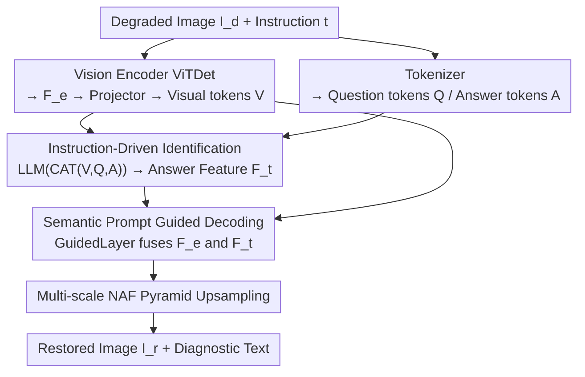

# MMDIR: Multimodal Instruction-Driven Framework for Mixed-Degradation Document Image Restoration

**Conference**: CVPR 2026  
**Paper**: [CVF Open Access](https://openaccess.thecvf.com/content/CVPR2026/html/Li_MMDIR_Multimodal_Instruction-Driven_Framework_for_Mixed-Degradation_Document_Image_Restoration_CVPR_2026_paper.html)  
**Code**: https://github.com/xiaomore/MMDIR  
**Area**: Image Restoration / Document Image Restoration  
**Keywords**: Document Image Restoration, Mixed Degradation, Instruction-Driven, Multimodal Large Language Model, Degradation Identification

## TL;DR
MMDIR integrates the process of "inquiring the model via text instructions about the presence/types of degradations in a document image" into the restoration pipeline. A degraded document image is paired with a text instruction; after joint processing by a vision encoder and an LLM, the LLM first outputs a diagnostic text identifying the existing degradations. These semantic features then guide the vision decoder for targeted restoration. This allows for the unified handling of four types of **mixed and uncertain** degradations—blur, shadow, text watermark, and seal—without relying on degradation priors or training separate models for each type.

## Background & Motivation
**Background**: Document Image Restoration (DIR) is a preprocessing task that removes interference such as blur, shadows, watermarks, and seals from scanned or photographed documents to restore content to a clear, readable state. The mainstream approach utilizes end-to-end "image-to-image" mapping, feeding degraded images into CNN, Transformer, GAN, or Diffusion models supervised by clean reference images to directly regress restoration results (e.g., DocRes, NAF-DPM, LGA-Doc).

**Limitations of Prior Work**: Such end-to-end models learn a **fixed mapping** without explicit degradation conditions, usually requiring a specialized model per degradation type. Handling multiple degradations necessitates multiple models. DocRes attempted to estimate degradation types in a preprocessing stage and concatenate weak prompts to the input, but it requires **prior knowledge of degradation categories** and relies on rigid preprocessing pipelines. It fails in open scenarios with ambiguous degradation types and is sensitive to the quality of extracted vision priors, where errors can directly contaminate restoration results.

**Key Challenge**: Real-world documents often exhibit **multiple simultaneous degradations** (e.g., a contract might have shadows, blur, seals, and text watermarks), and the exact types are unknown beforehand. Existing methods either assume a single degradation or require prior knowledge of the categories, making them fundamentally incapable of working under "unknown and mixed" conditions. Furthermore, restoration tasks share commonalities that independently trained models cannot exploit.

**Goal**: To develop a unified framework that automatically identifies simultaneous degradations in an image without prior knowledge and performs fine-grained, interpretable restoration accordingly.

**Key Insight**: The authors draw inspiration from the capability of Multimodal Large Language Models (MLLMs) in document understanding (OCR, VQA) to generate task-related text answers given prompts. Since MLLMs can answer "what is written in the image," they should also be able to answer "what degradations are in the image."

**Core Idea**: Treat "degradation identification" as a text-instruction-driven VQA task. The diagnostic semantic features output by the LLM serve as guidance signals to drive the vision decoder, replacing "degradation priors" with "semantic reasoning."

## Method

### Overall Architecture
MMDIR is an end-to-end multimodal architecture that accepts **multimodal inputs** (degraded image + text instruction) and produces **multimodal outputs** (restored image + diagnostic text). Given a degraded document image $I_d \in \mathbb{R}^{H\times W\times C}$ and a text instruction $t$ (consisting of a fixed part: "determine the noise/interference and point out the types," and an optional part: "specify removal of certain degradations"). On the vision side, a ViTDet encoder partitions the image into $16\times16$ patches, applies window self-attention to obtain feature map $F_e$, and uses a two-layer $3\times3$ convolutional Projector to compress them into 256 visual tokens $V$. On the text side, a tokenizer encodes the question (instruction) and answer (diagnosis) into $Q$ and $A$. All three are concatenated along the sequence dimension and fed into the LLM for cross-modal alignment. The LLM's output answer feature $F_t$ carries semantic information about the existing degradations. Finally, the vision decoder fuses encoder features $F_e$ with semantic guidance features $F_t$, performing multi-scale NAF pyramid upsampling to reconstruct the restored image $I_r$. During training, both $Q$ and $A$ are provided; during inference, only $I_d$ and $Q$ are given, and the LLM decodes the answer $A$ step-by-step, using the average of hidden states as $F_t$.

### Key Designs

**1. Instruction-Driven Degradation Identification: Replacing Priors with VQA**

Addressing the pain point where existing methods require pre-known degradation categories, MMDIR casts identification as a text-modal diagnostic task. Visual tokens $V$, question tokens $Q$, and answer tokens $A$ are concatenated and fed into the LLM:

$$F_e = \text{VisEncoder}(I_d),\quad V = \text{Projector}(F_e),\quad F_t = \text{LLM}(\text{CAT}(V, Q, A))$$

Leveraging common sense and reasoning learned during training, the LLM dynamically interprets instructions and generates a diagnostic response—explicitly identifying which degradations are present or absent. Crucially, if a user specifies "remove seal and blur" but the LLM detects no seal but finds a watermark, it corrects the output to "actually removing blur and watermark." This aligns text descriptions with actual spatial degradation regions, freeing the model from rigid priors.

**2. Semantic Prompt Guided Visual Decoder: Diagnosis as "Navigation"**

The LLM's answer features $F_t$ carry semantics of "what to fix." The vision decoder ($I_r = \text{VisDecoder}(F_e, F_t)$) upsamples encoder features $F_e$ into four multi-scale maps $\{F_0, F'_1, F'_2, F'_3\}$. It uses PixelShuffle for $2\times$ upscaling and concatenates features before NAF Blocks. The core is the **GuidedLayer**: text tokens $F_t$ are multiplied by a learnable weight $W_t$ (initialized to 1) to get $F'_t$, which is then added element-wise to $F_e$. This learnable weight allows the model to determine the intensity of semantic guidance, avoiding hard injections that might destroy visual details.

**3. MixedDoc Benchmark & Synthesis Pipeline: Filling the Multi-Degradation Gap**

Existing datasets often only contain single degradations. The authors synthesized data by collecting clean documents from CDLA, CDDOD, and FSDSRD, creating 110,000 mixed-degradation images. Each image randomly overlays 1–4 degradations (various blurs, seals from a 20k-image pool, shadow masks from FSDSRD/SynShadow, and randomly rendered text watermarks). The test set, **MixedDoc**, uses 1,837 images synthesized with a separate pipeline using unseen seals and shadow masks, systematically filling the data gap for "real-world multi-degradation coexistences."

**4. Multi-objective Composite Loss: Four-way Supervision**

The restoration is supervised by a pixel-level $L_1$ loss $L_{pixel}=\|I_{gt}-I_r\|_1$. To enhance perception of degradation regions, a local $L_1$ loss $L_{local}=\|I_{gt}\times I_{mask}-I_r\times I_{mask}\|_1$ is introduced, where the binary mask $I_{mask}$ is 1 in degradation areas (shadows/watermarks/seals) and 0 elsewhere. SSIM loss $L_{ssim}$ evaluates perceptual quality, and cross-entropy $L_{ce}$ supervises the LLM's diagnosis. The total loss is:

$$L_{total} = L_{pixel} + \alpha L_{local} + \beta L_{ssim} + \lambda L_{ce}$$

Empirical weights are $\alpha=4, \beta=0.5, \lambda=0.5$. The high weight of the local loss reflects the importance of restoration quality in specific degraded areas.

## Key Experimental Results

**Implementation Details**: LLM used is Qwen2.5 (0.5B), frozen except for embedding layers. Images are 1024×1024. AdamW optimizer with $3\times10^{-4}$ peak learning rate, 80 epochs, 2× A100 GPUs. Metrics include PSNR/SSIM and LPIPS/DISTS.

### Main Results

Single-degradation benchmarks (Blur BMVC + Shadow OSR), `*` indicates reproduction on same training set:

| Task | Metric | MMDIR | Runner-up | Note |
|------|------|-------|------|------|
| De-blur BMVC | PSNR↑ | 29.03 | 28.95 (LGA-Doc) | SOTA |
| De-blur BMVC | SSIM↑ | 0.977 | 0.978 (LGA-Doc) | -0.001 diff |
| De-blur BMVC | LPIPS↓ | 0.0150 | 0.0169 | ↓ approx 11.2% |
| De-blur BMVC | DISTS↓ | 0.0233 | 0.0470 | ↓ approx 43.0% |
| De-shadow OSR | LPIPS↓ | 0.0547 | 0.0579 (DiffUIR1024*) | Best |

Mixed-degradation benchmark MixedDoc (1–4 degradations per image):

| Method | PSNR↑ | SSIM↑ | LPIPS↓ | DISTS↓ |
|------|-------|-------|--------|--------|
| DocDiff1024* | 21.14 | 0.863 | 0.1923 | 0.1966 |
| DiffUIR1024* | 22.09 | 0.853 | 0.2008 | 0.2064 |
| **Ours** | **24.43** | **0.908** | **0.1217** | **0.1323** |

MMDIR leads significantly on MixedDoc across all metrics, with PSNR over 2.34 dB higher than the runner-up and substantial drops in LPIPS/DISTS, proving its robustness under uncertain mixed conditions.

### Ablation Study

Effect of text instructions (Inst.) on different benchmarks:

| Benchmark | Inst. | PSNR↑ | SSIM↑ | LPIPS↓ | DISTS↓ |
|------|------|-------|-------|--------|--------|
| BMVC | ✗ | 26.76 | 0.966 | 0.0219 | 0.0320 |
| BMVC | ✓ | 29.03 | 0.977 | 0.0150 | 0.0233 |
| MixedDoc | ✗ | 23.83 | 0.898 | 0.1324 | 0.1489 |
| MixedDoc | ✓ | 24.43 | 0.908 | 0.1217 | 0.1323 |

### Key Findings
- **Instructions are the core gain**: Adding instructions improved PSNR from 26.76 to 29.03 (+2.27 dB) on BMVC, proving the semantic signal's effectiveness.
- **Perceptual improvement exceeds pixel improvement**: Leads in LPIPS/DISTS (e.g., DISTS ↓43% on de-blur) are much larger than PSNR gains, showing superiority in generating realistic textures.
- **Mixed scenarios benefit most**: Comprehensive outperformance on MixedDoc confirms that the unified framework shares cross-task knowledge when degradations coexist.

## Highlights & Insights
- Reformulating "degradation identification" as a VQA task provides readable diagnosis (e.g., "no seal, but watermark present"), adding transparency and interpretability lacking in end-to-end models.
- The **GuidedLayer** with a learnable scalar $W_t$ initialized to 1 is a lightweight yet critical design, allowing the model to learn "how much to trust the LLM" to prevent destructive semantic injection.
- Inference-time guidance comes from **speculative semantics** of the LLM, meaning the model can override incorrect user instructions based on visual analysis.
- The high weight ($\alpha=4$) for the local $L_1$ loss on degradation masks is a concise way to prioritize "where to fix," which is transferable to other region-aware restoration tasks.

## Limitations & Future Work
- The LLM is restricted to a frozen 0.5B Qwen model; diagnostic capabilities might be limited for more complex degradations like creases, tears, or ink bleed. ⚠️ LLM misdiagnosis during inference could mislead the decoder, which lacks detailed error-rate analysis in the paper.
- **MixedDoc** is largely synthetic; differences from real-world degradation distributions and generalization to captured documents were primarily shown via qualitative samples rather than quantitative real-world test sets.
- In de-shadowing, PSNR/SSIM remain lower than BGSNet/DiffUIR. While attributed to those models being "over-smoothed," the benefit for pixel-fidelity-driven downstream tasks (like OCR) needs further validation.

## Related Work & Insights
- **vs DocRes**: DocRes estimates types in preprocessing and concatenates weak priors, requiring pre-known categories. MMDIR uses online LLM diagnosis via text, avoiding prior estimation errors and handling open scenarios.
- **vs DocDiff / NAF-DPM / LGA-Doc**: These are prompt-free end-to-end single-task models. MMDIR uses semantic guidance for multi-task restoration with superior perceptual metrics.
- **vs DiffUIR**: DiffUIR is a unified restorer for natural scenes using implicit distribution shared terms; MMDIR differentiates by using explicit language diagnosis as a condition.

## Rating
- Novelty: ⭐⭐⭐⭐ Introducing VQA-style identification into document restoration is innovative.
- Experimental Thoroughness: ⭐⭐⭐⭐ Good dual benchmarks and ablation; however, lacks real-world quantitative evaluation and misdiagnosis analysis.
- Writing Quality: ⭐⭐⭐⭐ Clear motivation and architecture; helpful diagrams.
- Value: ⭐⭐⭐⭐ Provides the MixedDoc benchmark and an interpretable unified restoration paradigm.

<!-- RELATED:START -->

## Related Papers

- [\[CVPR 2026\] Degradation-Robust Fusion: An Efficient Degradation-Aware Diffusion Framework for Multimodal Image Fusion in Arbitrary Degradation Scenarios](degradation-robust_fusion_an_efficient_degradation-aware_diffusion_framework_for.md)
- [\[CVPR 2026\] Restore, Assess, Repeat: A Unified Framework for Iterative Image Restoration](restore_assess_repeat_a_unified_framework_for_iterative_image_restoration.md)
- [\[CVPR 2026\] Hybrid Agents for Image Restoration](hybrid_agents_for_image_restoration.md)
- [\[CVPR 2026\] Degradation-Consistent Test-Time Adaptation for All-in-One Image Restoration](degradation-consistent_test-time_adaptation_for_all-in-one_image_restoration.md)
- [\[CVPR 2026\] SGDE: Self-supervised Geometry Degradation Estimation Framework for Coded Aperture Compressive Spectral Imaging](sgde_self-supervised_geometry_degradation_estimation_framework_for_coded_apertur.md)

<!-- RELATED:END -->
## Related Papers

- [\[CVPR 2026\] Degradation-Robust Fusion: An Efficient Degradation-Aware Diffusion Framework for Multimodal Image Fusion in Arbitrary Degradation Scenarios](degradation-robust_fusion_an_efficient_degradation-aware_diffusion_framework_for.md)
- [\[CVPR 2026\] Hybrid Agents for Image Restoration](hybrid_agents_for_image_restoration.md)
- [\[CVPR 2026\] DRFusion: Degradation-Robust Fusion via Degradation-Aware Diffusion Framework](drfusion_degradation_robust_fusion_via_degradation_aware_diffusion_framework.md)
- [\[CVPR 2026\] Degradation-Consistent Test-Time Adaptation for All-in-One Image Restoration](degradation-consistent_test-time_adaptation_for_all-in-one_image_restoration.md)
- [\[CVPR 2026\] InstantRetouch: Efficient and High-Fidelity Instruction-Guided Image Retouching with Bilateral Space](instantretouch_efficient_and_high-fidelity_instruction-guided_image_retouching_w.md)

<!-- RELATED:END -->
