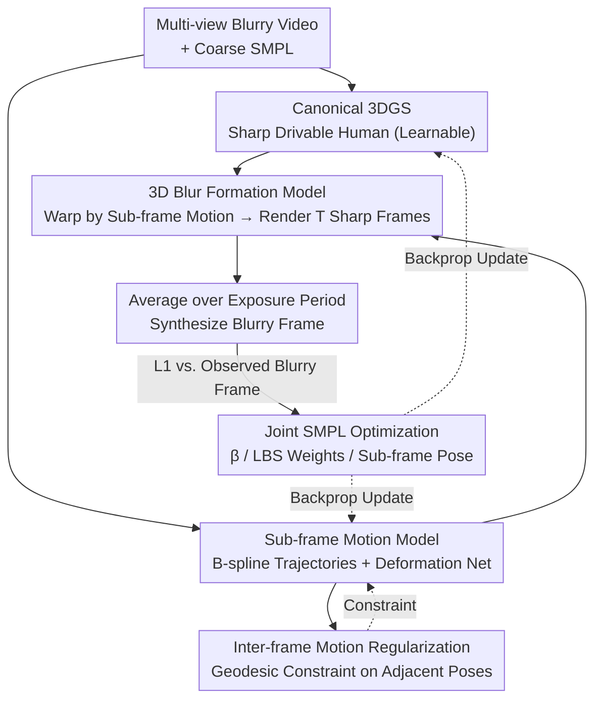

# MAD-Avatar: Motion-Aware Animatable Gaussian Avatars Deblurring

**Conference**: CVPR 2026  
**arXiv**: [2411.16758](https://arxiv.org/abs/2411.16758)  
**Code**: [GitHub](https://github.com/MyNiuuu/MAD-Avatar)  
**Area**: 3D Vision / Human Reconstruction / Deblurring  
**Keywords**: 3D human avatar, Gaussian splatting, motion blur, SMPL, deblurring  

## TL;DR
This work achieves the first direct reconstruction of sharp, drivable 3D Gaussian human avatars from blurry videos. It proposes a 3D-aware physical blur formation model that decomposes blur into sub-frame SMPL motion and a canonical 3DGS. By modeling sub-frame motion with B-spline interpolation and a pose deformation network, and addressing motion direction ambiguity through inter-frame regularization, the method significantly outperforms "2D deblurring + 3DGS" two-stage pipelines on both synthetic and real-world datasets (improving PSNR by approximately 2.5dB).

## Background & Motivation
Reconstructing 3D human avatars (e.g., GauHuman) traditionally relies on clear multi-view video inputs. However, in real-world scenarios, human movement inevitably introduces motion blur, leading to: (1) 3DGS learning distorted 3D representations due to the ambiguity where a single blurry image can correspond to multiple motions; (2) Inaccurate SMPL parameter estimation from blurry frames. Existing two-stage solutions (2D deblurring followed by 3DGS training) are insufficient, as 2D deblurring lacks 3D structural information, resulting in multi-view inconsistencies that limit reconstruction quality.

## Core Problem
The core problem is how to directly reconstruct sharp, drivable 3D human avatars from multi-view blurry videos. Key challenges include the motion ambiguity introduced by blur and SMPL initialization errors.

## Method

### Overall Architecture

The method takes multi-view blurry videos and coarsely estimated SMPL parameters as input, aiming to reconstruct a sharp, drivable 3DGS avatar in canonical space. The model jointly optimizes the clear 3DGS human avatar and the sub-frame motion trajectories within each exposure period. During each iteration, the canonical 3DGS is warped to the observation space based on the estimated sub-frame motion to render $T$ virtual sharp frames. These are averaged to produce a "simulated blurry frame," which is constrained against the observed blurry frame via L1 loss. Consequently, deblurring and 3D reconstruction are integrated into a single physical process.

### Key Designs

**1. 3D Blur Formation Model: Extending 2D Exposure Integration to 3D Space**

The fundamental flaw of two-stage schemes is that 2D deblurring lacks 3D awareness, leading to inconsistent outputs. Ours shifts the modeling: instead of applying a blur kernel at the pixel level, the traditional exposure integration formula is extended to 3D. The blurry frame is represented as $I_{blur} = \frac{1}{T}\sum_{t} \mathcal{R}(\mathcal{W}(G_{canonical}, S_t), R, K)$, where the canonical 3DGS is deformed by sub-frame SMPL motion $S_t$, rendered, and averaged. This physical process naturally preserves 3D structure and multi-view consistency.

**2. Sub-frame Motion Model: B-spline for Skeleton, Deformation Net for Details**

Human motion during exposure must be modeled explicitly to resolve ambiguity. A two-layer structure is used: first, a B-spline with $P$ control points interpolates continuous rotation trajectories for 24 SMPL joints to ensure smooth rigid motion. Second, a pose deformation network $G_{disp}$ (CNN) predicts residual displacements for each joint at every time step to capture high-frequency non-rigid changes. Ablations show that removing B-spline constraints leads to chaotic motion estimation (PSNR drops 1.5dB), while removing the deformation network drops PSNR by 0.25dB.

**3. Inter-frame Motion Regularization: Breaking Directional Symmetry with Continuity**

A single blurry image can be produced by motions in two symmetric directions (the ambiguity shown in paper Fig. 1(c)). While the middle time step might be similar, other sub-frames fail if the direction is incorrect. The solution constrains the pose of the last time step in the current frame to be close to the pose of the first time step in the next frame using geodesic distance. This utilizes natural video continuity to resolve temporal symmetry.

**4. Joint SMPL Optimization: Mitigating Initialization Error**

SMPL parameters estimated from blurry frames are inherently coarse. If treated as fixed ground truth, errors propagate to the reconstruction. Ours treats the shape $\beta$, LBS weights (initial values plus CNN-predicted offsets), and sub-frame poses as learnable parameters. Removing this joint optimization causes PSNR to drop by 3.9dB and 1.9dB on synthetic and real data, respectively, indicating it is critical for robustness.

### Loss & Training

The total loss is $L = L_1(\text{Synthesized Blur}, \text{Observed Blur}) + L_{reg}(\text{Inter-frame Pose Continuity})$. Optimization uses Adam with learning rates following original 3DGS. Input resolutions are $512 \times 512$ (synthetic) and $612 \times 512$ (real). Training is conducted on a single RTX 4090.

## Key Experimental Results

### Main Results (Synthetic ZJU-MoCap, $K_{blur}=5$)

| Method | PSNR↑ | SSIM↑ | LPIPS↓ |
|------|-------|-------|--------|
| GauHuman (Direct Blur) | 23.08 | 0.766 | 0.228 |
| BSST + GauHuman (Best 2-Stage) | 23.08 | 0.770 | 0.221 |
| **Ours** | **25.55** | **0.829** | **0.148** |

### Main Results (Real-world 360° Mixed-exposure)

| Method | PSNR↑ | SSIM↑ | LPIPS↓ |
|------|-------|-------|--------|
| BSST + GauHuman | 25.57 | 0.807 | 0.234 |
| **Ours** | **27.01** | **0.827** | **0.167** |

### Ablation Study
- **Without B-spline (Independent sub-poses)**: PSNR drops by 1.5dB due to unconstrained, disordered motion estimation.
- **Without Pose Deformation Net**: PSNR drops by 0.25dB, showing B-spline alone cannot capture complex non-rigid details.
- **Without Inter-frame Regularization**: Negligible difference at $t=0.5$, but performance drops significantly for other sub-frames (~1dB) due to motion direction misjudgment.
- **Without SMPL Optimization**: PSNR drops by 3.9dB (synthetic) and 1.9dB (real), indicating joint optimization is essential due to inaccurate initial SMPL.
- **B-spline vs. Linear vs. Slerp**: Minimal difference (B-spline slightly better) as the deformation network compensates for interpolation differences.
- **Robustness to SMPL Perturbation**: Even with large random perturbations ($\xi=0.4$), PSNR only drops by 0.4dB, proving the method is not dependent on precise initialization.

## Highlights & Insights
- **3D-aware blur formation paradigm**: Instead of 2D deblurring, modeling the blur process in 3D space allows deblurring and reconstruction to mutually enhance each other. This methodology is transferable to other dynamic 3D reconstruction tasks.
- **Solving motion direction ambiguity**: Inter-frame continuity is a simple yet vital design that resolves the temporal symmetry bottleneck.
- **System construction**: The authors built a 12-camera benchmark (4 blurry + 8 sharp mixed-exposure) that provides long-term value for the field.
- **Practicality**: The iPhone demo demonstrates generalization using single-view video and TRAM-based SMPL estimation.

## Limitations & Future Work
- Dependent on SMPL, making it unable to handle motion blur of handheld objects or very loose clothing.
- Averaging in sRGB space rather than linear radiance space leads to physical inaccuracies in high-contrast regions.
- Cannot recover geometry (normals/BRDF) as it is based on the 3DGS representation.
- Training overhead for multiple sub-frame renderings per iteration is likely high.

## Related Work & Insights
- **vs. BAD-NeRF/Deblur-NeRF**: These target static scene camera motion blur or defocus blur, which are inapplicable to dynamic human motion blur.
- **vs. DyBluRF/BARD-GS**: These handle dynamic scene blur but cannot produce a drivable avatar.
- **vs. GauHuman/3DGS-Avatar**: These require sharp inputs and degrade significantly with blurry data.

## Related Work & Insights
The "3D-aware blur formation" approach is particularly valuable for video understanding. By physically modeling blur to improve robustness in real-world scenes, one can better handle artifacts in dynamic environments.

## Rating
- Novelty: ⭐⭐⭐⭐ First to tackle "blurry video to sharp drivable avatar," with an elegant 3D blur formation model.
- Experimental Thoroughness: ⭐⭐⭐⭐⭐ Comprehensive synthetic and real-world results, 10+ ablations, and robustness tests.
- Writing Quality: ⭐⭐⭐⭐ Clear logic, informative visuals, and well-articulated motivation.
- Value: ⭐⭐⭐ The methodology of 3D blur formation is highly transferable, although human avatars are a specific niche.

<!-- RELATED:START -->

## Related Papers

- [\[CVPR 2026\] Event-Based Motion Deblurring Using Task-Oriented 3D Gaussian Event Representations](event-based_motion_deblurring_using_task-oriented_3d_gaussian_event_representati.md)
- [\[CVPR 2026\] Spatio-Temporal Difference Guided Motion Deblurring with the Complementary Vision Sensor](spatio-temporal_difference_guided_motion_deblurring_with_the_complementary_visio.md)
- [\[CVPR 2026\] Gyro-based Deep Video Deblurring](gyro-based_deep_video_deblurring.md)
- [\[CVPR 2026\] Gaussian Splatting-based Low-Rank Tensor Representation for Multi-Dimensional Image Recovery](gaussian_splatting-based_low-rank_tensor_representation_for_multi-dimensional_im.md)
- [\[CVPR 2026\] SelfHVD: Self-Supervised Handheld Video Deblurring](selfhvd_self-supervised_handheld_video_deblurring.md)

<!-- RELATED:END -->
