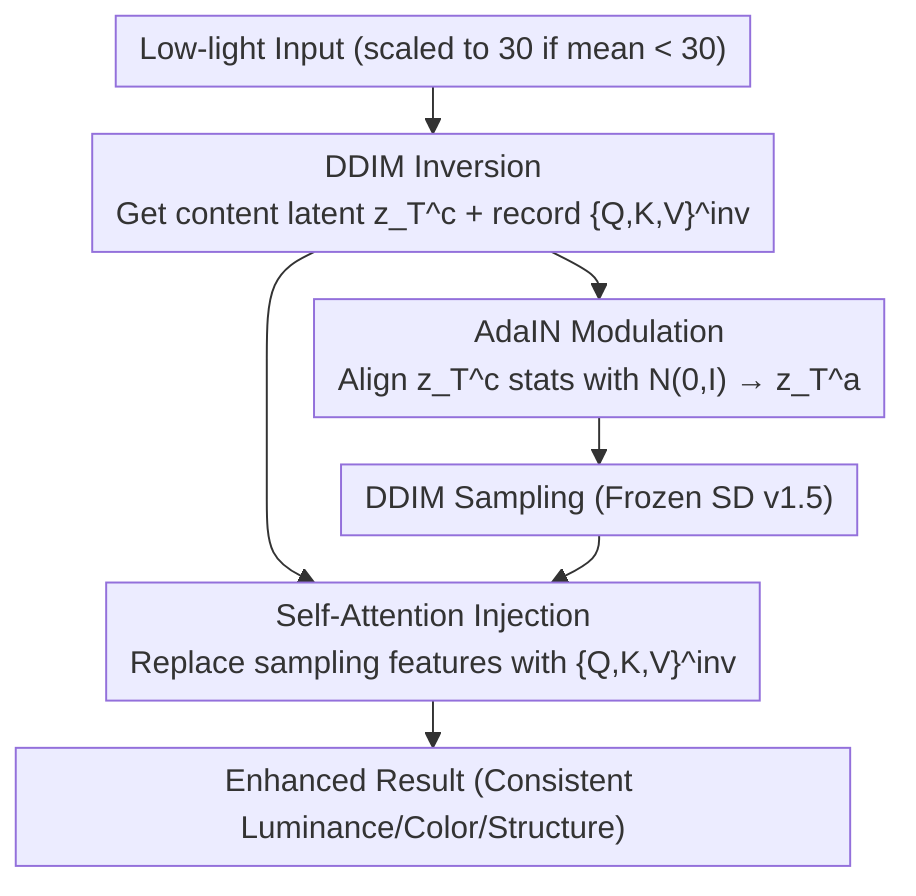

# MR. Illuminate: Zero-Shot Low-Light Image Enhancement with Diffusion Prior

**Conference**: CVPR 2026  
**Paper**: [CVF Open Access](https://openaccess.thecvf.com/content/CVPR2026/html/Cho_MR._Illuminate_Zero-Shot_Low-Light_Image_Enhancement_with_Diffusion_Prior_CVPR_2026_paper.html)  
**Code**: None (Not provided in the paper)  
**Area**: Image Restoration / Low-Light Enhancement  
**Keywords**: Low-light enhancement, zero-shot, diffusion prior, AdaIN, self-attention injection, color constancy

## TL;DR
MR. Illuminate utilizes a **completely frozen, zero-training, and zero-optimization** pre-trained diffusion model (SD v1.5) for low-light enhancement. It performs DDIM inversion on the input, applies AdaIN to align the statistics of the inverted latents with the standard normal distribution expected by the model for global luminance/color correction (Modulate), and injects self-attention features recorded during inversion into the sampling stage to restore local structures and colors (Refine). Without any auxiliary losses, degradation assumptions, or parameter tuning, it outperforms SOTA methods on standard benchmarks and maintains color constancy under varying illumination for the same scene.

## Background & Motivation
**Background**: Low-light image enhancement (LLIE) aims to restore dark photos into natural, bright versions. Methods are categorized by "when/how they learn": A. Supervised (paired data learning image-to-image mapping); B. Test-time optimization of network weights per image; C. Freezing pre-trained priors while still optimizing learnable components per input; D (Ours) Direct reuse of internal signals from frozen diffusion models for guidance. Most recent zero-shot diffusion methods (GDP, TAO, FourierDiff, etc.) fall into category C.

**Limitations of Prior Work**: Regardless of being supervised, unsupervised, or zero-shot, existing methods **rely on auxiliary loss functions and empirically tuned hyperparameters**. While they perform well on evaluation sets, they severely overfit and generalize poorly. Supervised methods are limited by the scarcity of paired data (LOLv1 ~500 pairs, LOLv2 ~700, LSRW ~5000) and often produce artifacts. Zero-shot GDP tends to hallucinate non-existent structures, while FourierDiff exhibits poor color constancy (color shifts in the same scene under different lighting).

**Key Challenge**: Diffusion models trained on billions of bright, balanced images (like LAION-5B) **implicitly learn to map $N(0,I)$ to natural bright images**. This prior could be used directly, but Category C methods layer on per-image optimization losses and hyperparameters, tying the "universal prior" to specific evaluation sets and losing generalization.

**Goal**: Develop a **zero-shot LLIE that requires no optimization and no degradation assumptions**, aiming to exceed SOTA performance while ensuring reconstruction consistency (color constancy) across different lighting conditions of the same scene.

**Key Insight**: Rather than adding external learnable components and custom losses, it is more effective to utilize the **internal signals** of a frozen diffusion model—specifically self-attention features (previously used for image editing)—and extend their utility to low-light enhancement.

**Core Idea**: Use AdaIN to align inverted latents with the expected input distribution for global illumination and color correction (Modulate), and use self-attention triplets from the inversion stage to anchor local structures and colors during sampling (Refine). This synergy achieves training-free and tuning-free enhancement.

## Method

### Overall Architecture
MR. Illuminate (pronounced "Mister Illuminate," emphasizing the **M**odulate–**R**efine design) operates on a frozen SD v1.5 (without text prompts). The entire framework **requires no training** and consists of three serial steps: (1) **Inversion**—performing DDIM inversion on the input image to obtain the content latent $z_T^c$ ($T=24$) while recording self-attention features from each U-Net block; (2) **Modulation**—using AdaIN to align the channel statistics of $z_T^c$ with $N(0,I)$ to obtain $z_T^a$, which retains input structure while matching the model's expected distribution for global luminance/color correction; (3) **Refinement**—performing DDIM sampling from $z_T^a$ and injecting the recorded self-attention features into the up-blocks at each timestep to restore local details lost during inversion and modulation. Pre-processing is minimal: if the average input intensity is below 30, it is linearly scaled to 30. The framework can also directly perform Automatic White Balance (AWB) without modification.

### Key Designs

**1. AdaIN Latent Modulation: Aligning inverted latents for global illumination and color correction**

To address low signal-to-noise ratios and color distortion in low-light images, as well as the fact that DDIM inverted latents do not perfectly follow the $N(0,I)$ assumption, AdaIN is applied to the initial latent. Given the inverted latent $z_T^c$ (content, $T=24$) and $z_T^s\sim N(0,I)$ (style), the modulated latent is:

$$z_T^a = \sigma(z_T^s)\left(\frac{z_T^c-\mu(z_T^c)}{\sigma(z_T^c)}\right)+\mu(z_T^s)$$

where $\mu(\cdot),\sigma(\cdot)$ are channel-wise means and standard deviations. Unlike PGDiff or StableSR, which perform AdaIN between degradation features and preset statistics/reference images, MR. Illuminate aligns the latent with the model's **expected input distribution $N(0,I)$**. This offers two benefits: (1) **Structural Consistency**—AdaIN is an affine, spatially uniform transformation that preserves the input's spatial structure, providing a "well-conditioned" starting point; (2) **Global Correction**—this statistical alignment shifts the brightness and color bias of the latent toward the distribution assumed by the denoising dynamics, outputting a well-lit image at $t=0$.

**2. Inversion Self-Attention Injection: Anchoring local structures and colors against inversion errors**

While AdaIN handles global aspects, DDIM inversion suffers from cumulative errors, and modulation can cause local structure/color drift. The method records self-attention triplets $\{Q_t,K_t,V_t\}^{\text{inv}}$ during inversion and replaces corresponding features during sampling:

$$\{Q_t,K_t,V_t\}^{\text{samp}} \leftarrow \{Q_t,K_t,V_t\}^{\text{inv}}$$

where $Q_t,K_t,V_t\in\mathbb{R}^{N\times d}$ and $N=H'W'$. PCA visualizations reveal that **self-attention during inversion accurately preserves local spatial correspondence and color relationships, whereas sampling attention deviates due to error accumulation**. Re-injecting inversion attention "re-anchors" the sampling process to the scene composition encoded in the input, restoring details lost during DDIM inversion and AdaIN.

**3. Synergy of AdaIN and Self-Attention: Global lighting + Local structure preservation**

The two signals collaborate rather than cancel out. Although self-attention biases the trajectory toward the input structure, the modulated latent $z_T^a$ continues to guide the diffusion process. The model predicts and removes noise under the condition of $z_T^a$, preserving the brightness and color balance introduced by AdaIN. Simultaneously, U-Net skip/residual connections propagate these photometric adjustments, allowing global normalization and local structure preservation to work in tandem.

### Mechanism

For a low-light input: first linearly scale its intensity if needed, then perform DDIM inversion ($T=24$) to get $z_T^c$ and store the up-block self-attention $\{Q,K,V\}^{\text{inv}}$. Next, apply AdaIN using random $z_T^s\sim N(0,I)$ to get $z_T^a$. During denoising, inject the stored inversion self-attention into the up-blocks ($t=24\to19\to14\to9\to0$). This process ensures that the predicted original image $\hat z_0^a$ progressively recovers local structure and color details, ultimately outputting an enhanced image that is well-lit and faithful to the input.

## Key Experimental Results

**Settings**: Frozen SD v1.5 with no text prompts; $T=24$; QuadPrior VAE decoder; Evaluated on LOL, LSRW, and five unpaired benchmarks. Metrics include PSNR/SSIM/LPIPS for paired sets and ILNIQE/BRISQUE/NL for unpaired sets (lower is better).

### Main Results

Comparison of zero-shot/unsupervised methods (Ours is Category D—no training data):

| Method | Category | LOL PSNR↑ | LOL SSIM↑ | LOL LPIPS↓ | Unpaired BRISQUE↓ | Unpaired NL↓ |
|------|------|-----------|-----------|------------|-------------------|--------------|
| GDP | Z(C) | 14.66 | 0.504 | 0.356 | 27.01 | 0.528 |
| FourierDiff | Z(C) | 16.95 | 0.604 | 0.293 | 26.57 | 1.221 |
| CoLIE | Z(B) | 14.90 | 0.499 | 0.327 | 18.97 | 0.964 |
| TAO | Z(C) | 19.18 | 0.607 | 0.390 | 42.14 | 0.384 |
| **MR. Illuminate** | **Z(D)** | **21.74** | **0.815** | **0.177** | **16.18** | **0.379** |

Efficiency (A10, 400×600, min/GB):

| Method | Time(min) | Memory(GB) | FLOPs |
|------|-----------|-----------|-------|
| GDP | 19.09 | 4.7 | – |
| TAO | 3.5 | 4.7 | 4.7e15 |
| FourierDiff | 0.82 | 7.1 | 8.5e14 |
| **MR. Illuminate** | **0.12** | 6.7 | 5.8e13 |

### Ablation Study

| Configuration | Function | Observation |
|------|------|------|
| Full (AdaIN + SA Injection to Up-blocks) | Global correction + Local refinement | Best fidelity and color consistency |
| w/o SA (AdaIN only, direct denoising $z_T^a$) | Removed local refinement | Correct global brightness, blurry local details |
| Inject Residual / Cross instead of Self | Different feature types | Degraded fidelity (Self-attention is optimal) |
| Inject into Down / Mid / Up blocks only | Different injection locations | Fidelity follows location; Up-blocks are best |
| Samp (Default sampling, no SA injection) | No anchoring | Geometric and color distortion |

### Key Findings
- **AdaIN for global, SA for local**: Removing SA injection results in correct brightness but blurred local details. PCA confirms that inversion SA is more faithful to the input than sampling SA.
- **Zero-optimization yields stronger generalization**: Supervised CIDNet drops from 28.9 dB (LOLv1) to 12.0 dB (MIT5K), whereas MR. Illuminate generalizes better across unseen datasets due to its lack of data dependency.
- **Fast and efficient**: At 0.12 min/image, it is significantly faster than GDP (19 min) or TAO (3.5 min) because it avoids iterative per-image optimization.
- **Direct AWB migration**: The framework performs Automatic White Balance without modification, being the first zero-shot AWB method for color-imbalanced images.

## Highlights & Insights
- The core insight is converting enhancement into a **distribution alignment task**. Since the model already knows how to map $N(0,I)$ to natural images, a simple AdaIN suffices for global correction.
- Distinguishing between "inversion SA" and "sampling SA" highlights that the former acts as a structural anchor to counteract cumulative inversion errors.
- By eliminating per-image optimization and auxiliary losses, the method avoids overfitting to specific benchmark distributions, prioritizing universal generalization.
- The dual capability for LLIE and AWB suggests the Modulate–Refine design captures universal properties of "global color/luminance statistics + local structure preservation."

## Limitations & Future Work
- Reliance on DDIM inversion introduces cumulative errors; while SA injection mitigates this, the stability of inversion for extreme low-light/high-noise inputs remains to be quantified. AWB performance is primarily detailed in the supplementary material.
- Supervised methods still achieve higher peak PSNR within their training distribution (e.g., LOLv1). Zero-shot generalization comes at the cost of peak fidelity in specific domains.
- Effectiveness across different diffusion backbones remains to be verified, and the reliance on a high-quality VAE decoder suggests sensitivity to the compression stage.

## Related Work & Insights
- **vs. GDP / TAO (Category C)**: These rely on iterative per-image optimization and custom losses, making them slow and sensitive to hyperparameters. MR. Illuminate is significantly faster and more robust.
- **vs. FourierDiff**: FourierDiff optimizes frequency components but lacks color constancy; the proposed method ensures consistency via AdaIN and SA anchoring.
- **vs. ReFIR / ZVRD**: Unlike frameworks requiring reference images or extra attention modules, MR. Illuminate reuses its own internal signals, focusing on reconstruction consistency rather than style transfer.

## Rating
- Novelty: ⭐⭐⭐⭐⭐ Transforming enhancement into distribution alignment and SA injection is a self-consistent and innovative training-free paradigm.
- Experimental Thoroughness: ⭐⭐⭐⭐ Wide comparisons and clear ablations, though AWB quantitative data is relegated to the supplementary materials.
- Writing Quality: ⭐⭐⭐⭐ Clear methodology and convincing visualizations; some OCR noise in formulas.
- Value: ⭐⭐⭐⭐⭐ Fast, zero-training, and dual-purpose (LLIE/AWB), making it highly attractive for practical deployment.

<!-- RELATED:START -->

## Related Papers

- [\[CVPR 2026\] Multinex: Lightweight Low-light Image Enhancement via Multi-prior Retinex](multinex_lightweight_low-light_image_enhancement_via_multi-prior_retinex.md)
- [\[CVPR 2026\] Bi-Bridge: Bidirectional Diffusion Bridges for Low-Light Image Enhancement](bi-bridge_bidirectional_diffusion_bridges_for_low-light_image_enhancement.md)
- [\[CVPR 2026\] Zero-Shot Image Denoising via Hybrid Prior-Guided Pseudo Sample Generation](zero-shot_image_denoising_via_hybrid_prior-guided_pseudo_sample_generation.md)
- [\[CVPR 2026\] Event-Illumination Collaborative Low-light Image Enhancement with a High-resolution Real-world Dataset](event-illumination_collaborative_low-light_image_enhancement_with_a_high-resolut.md)
- [\[CVPR 2026\] Self-supervised Dynamic Heterogeneous Degradation Modeling for Unified Zero-Shot Image Restoration](self-supervised_dynamic_heterogeneous_degradation_modeling_for_unified_zero-shot.md)

<!-- RELATED:END -->
