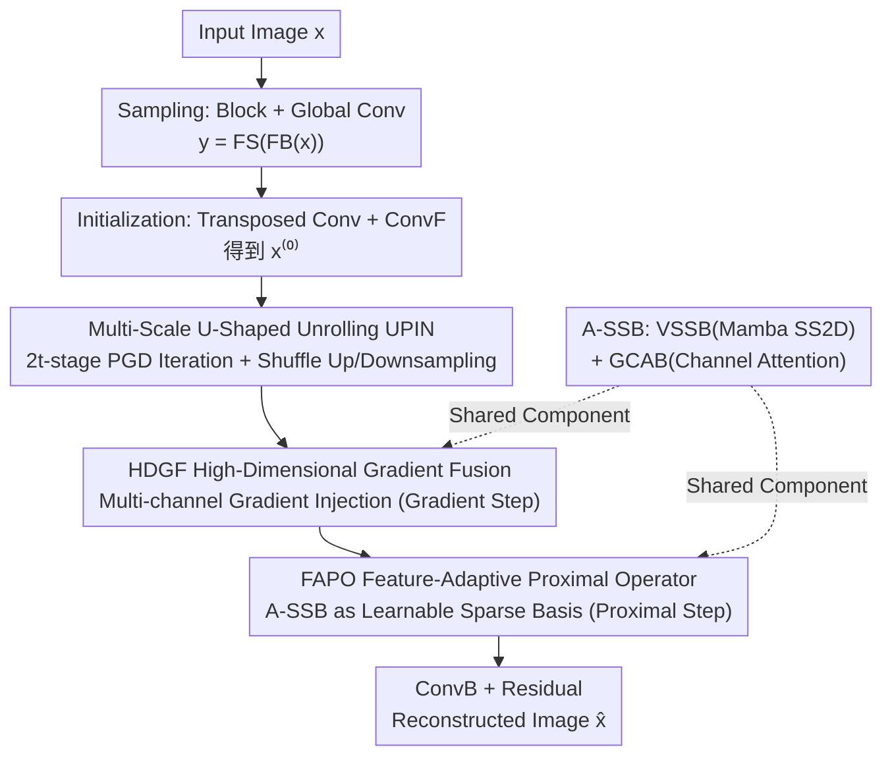

# Multi-Scale Gradient-Guided Unrolling Architecture with Adaptive Mamba for Compressive Sensing

**Conference**: CVPR 2026  
**Paper**: [CVF Open Access](https://openaccess.thecvf.com/content/CVPR2026/html/Yang_Multi-Scale_Gradient-Guided_Unrolling_Architecture_with_Adaptive_Mamba_for_Compressive_Sensing_CVPR_2026_paper.html)  
**Code**: https://github.com/ (The paper claims MambaCS is open-sourced; ⚠️ check the original text for the specific address)  
**Area**: Image Restoration / Compressive Sensing Reconstruction  
**Keywords**: Compressive Sensing, Deep Unrolling Network, Mamba, Gradient Guidance, Proximal Gradient Descent

## TL;DR
MambaCS unrolls the classic Proximal Gradient Descent (PGD) algorithm into a U-shaped deep network across multiple feature scales. It replaces traditional convolution/Transformer modules in unrolling networks with a customized Adaptive State-Space Block (A-SSB) and redesigns the High-Dimensional Gradient Fusion (HDGF) and Feature-Adaptive Proximal Operator (FAPO). It achieves SOTA PSNR/SSIM on multiple compressive sensing reconstruction datasets with comparable parameter counts.

## Background & Motivation
**Background**: Compressive Sensing (CS) reconstructs signal $x$ from measurements $y=\Phi x$ at rates far below the Nyquist rate. Deep Unrolling Networks (DUN) "unroll" the iterative process of traditional optimization solvers (e.g., PGD, ISTA) into sequential modules of a network. This paradigm maintains the interpretability and data fidelity of optimization algorithms while leveraging the fitting capabilities of deep learning, serving as the mainstream approach for CS reconstruction.

**Limitations of Prior Work**: The authors summarize three shortcomings of existing DUNs: ① **Cross-stage feature homogenization**: The iterative modules at each stage have rigid, repetitive structures, leading to a lacks of diversity in extracted features; ② **Inefficient injection of gradient guidance**: Traditional DUNs implement gradient descent steps in the image domain using single-channel matrix operations, creating an "information bottleneck" where features are irreversibly lost between iterations; ③ **Insufficient spatial feature extraction**: CNNs have local receptive fields, and Transformer computational complexity grows quadratically with resolution, forcing a choice between "global receptive field" and "computational efficiency."

**Key Challenge**: DUNs aim to simultaneously achieve interpretability (following PGD iterative structure), reconstruction quality (strong feature extraction), and efficiency (global modeling with linear complexity), but traditional module designs cause these three goals to constrain each other.

**Goal**: While maintaining the interpretability of PGD unrolling, design an architecture that possesses a global receptive field, maintains linear complexity, and stably injects gradient guidance information across multiple scales.

**Key Insight**: The authors observe that Mamba (Selective State Space Model) can model long-range dependencies with linear complexity, effectively filling the gap left by CNNs/Transformers. Thus, Mamba is introduced into DUN—marking the first application of Mamba in deep unrolling for CS.

**Core Idea**: Using the customized A-SSB (Mamba + Channel Attention) as the basic building block, PGD is unrolled within a multi-scale U-shaped structure. The gradient step (HDGF) and proximal step (FAPO) of PGD are rewritten to utilize the global adaptive perception of A-SSB.

## Method

### Overall Architecture
MambaCS consists of a sampling stage + $2t$ reconstruction stages (default $t=4$, i.e., 8 stages). The sampling stage divides the single-channel image into $B\times B$ blocks ($B=128$) and performs unbiased global convolution to obtain measurements $y$. In the reconstruction stage, transposed convolution is first used for initialization to obtain $x_f$, followed by a convolution projection ConvF to get $x^{(0)}$. This is then fed into a U-shaped PGD iterative network (UPIN) of depth $t$. Mapping PGD iterations to stages, UPIN uses Pixel Shuffle/Unshuffle for up/down-sampling to achieve multi-scale representation. Each stage contains two sub-modules: HDGF (corresponding to the gradient descent step $s^{(k)}$) and FAPO (corresponding to the proximal mapping $x^{(k+1)}$). Finally, inverse convolution projection ConvB and a residual connection yield the reconstructed image $\hat{x}$. A-SSB is a shared component throughout HDGF and FAPO.

### Key Designs

**1. Multi-Scale U-Shaped Unrolling (UPIN): Breaking Cross-Stage Feature Homogenization**

Addressing Limitations of Prior Work ①, where traditional DUNs repeat homogeneous modules at the same resolution. MambaCS arranges $2t$ PGD iterations in a U-shape: the first $t$ stages progressively down-sample (Pixel Unshuffle), and the latter $t$ stages progressively up-sample (Pixel Shuffle) with skip connections added to symmetric stages. Consequently, different iterations naturally operate at different feature scales. Feature gains evolve along the trajectory of "edge texture → global structure → edge texture" (verified by visualization), rather than extracting the same features at every stage. The overall reconstruction is formulated as $x^{(2t)}=\mathrm{UPIN}(x^{(0)})+x^{(0)}$ and $\hat{x}=\mathrm{ConvB}(x^{(2t)})+x_f$, where the residual structure ensures training stability.

**2. HDGF High-Dimensional Gradient Fusion: Expanding Gradient Steps into Multi-Channel Guidance**

Addressing Limitations of Prior Work ②, where traditional DUNs directly implement $s^{(k)}=x^{(k)}-\rho^{(k)}\Phi^{\top}(\Phi x^{(k)}-y)$, and single-channel matrix operations limit bandwidth. The authors expand this to $s^{(k)}=x^{(k)}-\rho^{(k)}\Phi^{\top}\Phi x^{(k)}+\rho^{(k)}\Phi^{\top}y$, identifying three key variables: $x^{(k)}$, $\Phi^{\top}\Phi x^{(k)}$, and $\Phi^{\top}y$. These are concatenated along the channel dimension and passed through a "Depthwise Convolution (DConv) + A-SSB + Sigmoid" structure to generate gradient guidance information, which is then subtracted from $x^{(k)}$:

$$s^{(k)}=x^{(k)}-\rho^{(k)}\,F_{\text{grad}}\!\big(F_{\text{concat}}(x^{(k)},\,\Phi^{\top}\Phi x^{(k)},\,\Phi^{\top}y)\big),\quad F_{\text{grad}}(\cdot)=\mathrm{Sigmoid}(\text{A-SSB}(\mathrm{DConv}(\cdot))).$$

This allows gradient guidance to be continuously and stably injected in high-dimensional feature space, preserving PGD data fidelity while avoiding irreversible feature loss between iterations.

**3. FAPO Feature-Adaptive Proximal Operator: Replacing Fixed Thresholding with A-SSB as a Learnable Sparse Basis**

Addressing Limitations of Prior Work ③ and the dependence of traditional proximal steps on a fixed orthogonal sparse basis $\Psi$. The classic PGD proximal step is $x^{(k+1)}=\Psi^{\top}\mathrm{Soft}(\Psi s^{(k)},\theta^{(k)})$, requiring $\Psi$ to be orthogonal, which is difficult to satisfy. FAPO replaces the forward operator $\Psi$ with A-SSB and the inverse operator $\Psi^{\top}$ with $\text{A-SSB}^{\top}$ (the inverse process of the forward operator), with a soft-thresholding shrinkage in between:

$$x^{(k+1)}=\text{A-SSB}^{\top}\!\big(\mathrm{Soft}(\text{A-SSB}(s^{(k)}),\theta^{(k)})\big).$$

A-SSB provides global adaptive attention across space and channels, effectively turning the sparse basis into a learnable version sensitive to multi-scale features, significantly improving detail reconstruction.

**4. A-SSB Adaptive State Space Block: Global Receptive Field with Linear Complexity via Mamba**

A-SSB is the core component for both HDGF and FAPO, consisting of two parts: **VSSB** (Visual State Space Block) for long-sequence spatial modeling—using a dual-branch structure where one branch passes through LN→Linear→DConv→SiLU→SS2D. SS2D uses four-directional scanning to flatten 2D features into four 1D sequences processed by State Space Equations before summation; the other branch acts as a gate. **GCAB** (Gated Channel Attention Block) performs cross-channel aggregation, using DConv to generate Q/K/V with attention defined as $\mathrm{Attention}(Q,K,V)=V\cdot\mathrm{Softmax}(K^{\top}Q/\alpha)$ ($\alpha$ is a learnable scale), followed by dual-path GELU gating. VSSB focuses on space while GCAB focuses on channels, enabling A-SSB to achieve a near-global Effective Receptive Field (ERF) with linear complexity.

### Loss & Training
Reconstruction is constrained using simple Mean Squared Error (MSE) between the reconstructed image and ground truth: $\mathcal{L}(A,W^{1\sim 2t})=\frac{1}{N}\sum_{i=1}^{N}\|\hat{x}_i-x_i\|_2^2$, where $W^{1\sim2t}$ represents all trainable parameters (including the learnable sampling matrix $A$). Defaults: 8 stages, channel configuration $[32,64,128,256]$, and sampling kernel size 128.

## Key Experimental Results

### Main Results
Across General100, LIVE29, OST300, Set14, and BSD68 datasets at CS rates $\tau\in\{0.01,0.04,0.10,0.25\}$, MambaCS outperforms 11 comparison methods (TransCS, DGU-Net+, OCTUF, NesTD-Net, CPP-Net, etc.) in PSNR/SSIM almost entirely. Average results on General100 are as follows:

| Method | Avg. PSNR (dB) | Avg. SSIM |
|------|------|------|
| OCTUF (CVPR2023) | 30.67 | 0.8305 |
| NesTD-Net (TIP2024) | 30.74 | 0.8292 |
| CPP-Net (CVPR2024) | 31.17 | 0.8427 |
| **MambaCS (Ours)** | **31.71** | **0.8447** |

At $\tau=0.04$ on General100, MambaCS improves by approximately 2.39dB (8.77%) / 3.03dB (11.39%) / 1.29dB (4.55%) over TransCS / DPC-DUN / OCTUF, respectively. Visually, MambaCS exhibits fewer artifacts and sharper edge details at low CS rates.

### Ablation Study
The authors evaluated components by progressively replacing/removing them (Net-1 to Net-8) on Set11 at $\tau=0.10$:

| Configuration | Change | Set11 PSNR (dB) | Params (M) |
|------|------|------|------|
| **MambaCS (Full)** | — | **31.94** | 44.91 |
| Net-5 | Remove A-SSB in HDGF | 31.40 | 41.12 |
| Net-6 | Remove GCAB in FAPO | 31.14 | 38.43 |
| Net-7 | Remove VSSB in FAPO | 31.22 | 40.02 |
| Net-8 | Remove Channel-Adaptive Thresholding (CAT) | 31.44 | 44.90 |
| Net-1 | Sampling Kernel KS=32 | 30.27 | 18.17 |

### Key Findings
- Removing GCAB in FAPO (Net-6) resulted in the largest performance drop (Set11 −0.80dB), indicating that channel attention contributes most to detail recovery in proximal mapping; VSSB followed (Net-7, −0.72dB), confirming the dual "spatial + channel" design is essential.
- Reducing the sampling kernel from 128 to 32 (Net-1) caused a significant drop but reduced parameters from ~45M to 18M; its ERF still outperformed comparison methods, showing the global receptive field of A-SSB does not strictly depend on a large kernel.
- MambaCS maintains comparable parameter counts (~45M) to CPP-Net but leads across the board, proving gains come from architectural design rather than parameter stacking.

## Highlights & Insights
- **First Introduction of Mamba to CS Deep Unrolling**: Solves the "global receptive field vs. computational efficiency" trade-off using a linear-complexity selective state space model, providing a paradigm transferable to other inverse problems (MRI, Snapshot Compressive Imaging, Hyperspectral).
- **Algebraically Expanded High-Dimensional Gradient Injection (HDGF)**: Mathematically identifies $\Phi^{\top}\Phi x$ and $\Phi^{\top}y$ as explicit input channels for network fusion. This maintains interpretability while breaking single-channel bandwidth limits—a clever "physics-aware + high-expressivity" approach.
- **A-SSB as a Learnable Sparse Basis (FAPO)**: Replaces the fixed basis $\Psi$ in classic proximal operators with learnable forward/inverse Mamba operators, bypassing the engineering difficulty of satisfying orthogonality.

## Limitations & Future Work
- Parameter size is relatively large (~45M), not as lightweight as early DUNs. Since A-SSB is repeatedly called in HDGF and FAPO, actual inference speed and memory overhead are not fully detailed in the main text (⚠️ check original text/supplementary material).
- The code address is a placeholder "MambaCS" in the text; full open-sourcing needs confirmation (⚠️ check original text).
- Evaluation focuses on natural image CS. While MRI and hyperspectral applications are mentioned, validation on real medical/remote sensing scenarios is missing, leaving cross-domain generalization untested.
- The complexity-accuracy trade-off of SS2D's four-way scanning and dual A-SSB design could be further pruned (Net-1 already showed significant parameter savings by reducing the sampling kernel).

## Related Work & Insights
- **vs. OCTUF / CPP-Net (Transformer/Custom Proximal DUNs)**: These rely on cross-attention or custom proximal modules for detail improvement but are limited by Transformer's quadratic complexity or local modeling. MambaCS uses A-SSB to obtain a larger ERF with linear complexity and higher PSNR/SSIM at similar parameter scales.
- **vs. VMamba / FourierMamba (SSM Visual Backbones)**: These use Mamba as a general vision backbone. MambaCS customizes Mamba as a state-space block within an unrolling network, embedding it into PGD's gradient and proximal steps—representing a combination of "algorithm unrolling + SSM" rather than just a backbone swap.
- **vs. Traditional PGD Solvers**: Traditional methods have strict theoretical guarantees but require manual tuning, are computationally expensive, and demand orthogonal measurement matrices. MambaCS retains the interpretable iteration skeleton while replacing difficult-to-satisfy assumptions (like orthogonal sparse bases) with learnable modules.

## Rating
- Novelty: ⭐⭐⭐⭐ First to introduce Mamba into CS deep unrolling; HDGF/FAPO rewrites are clever, though the overall idea of "swapping DUN backbones" is established.
- Experimental Thoroughness: ⭐⭐⭐⭐ Comprehensive comparisons across datasets/rates + fine-grained ablation + ERF/feature visualization; quite solid.
- Writing Quality: ⭐⭐⭐⭐ Clear correspondence between formulas and physical meanings; the three limitations and designs are well-mapped.
- Value: ⭐⭐⭐⭐ Consistently sets new SOTA in CS reconstruction; paradigm is transferable to MRI/hyperspectral inverse problems.

<!-- RELATED:START -->

## Related Papers

- [\[CVPR 2026\] Beyond Single Solution: Multi-Hypothesis Collaborative Deep Unfolding Network for Image Compressive Sensing](beyond_single_solution_multi-hypothesis_collaborative_deep_unfolding_network_for.md)
- [\[CVPR 2026\] DetectSCI: Toward Object-Guided ROI Reconstruction for High-Resolution Video Snapshot Compressive Imaging](detectsci_toward_object-guided_roi_reconstruction_for_high-resolution_video_snap.md)
- [\[CVPR 2026\] VEMamba: Efficient Isotropic Reconstruction of Volume Electron Microscopy with Axial-Lateral Consistent Mamba](vemamba_efficient_isotropic_reconstruction_of_volume_electron_microscopy_with_ax.md)
- [\[CVPR 2026\] Customized Fusion: A Closed-Loop Dynamic Network for Adaptive Multi-Task-Aware Infrared-Visible Image Fusion](customized_fusion_a_closed-loop_dynamic_network_for_adaptive_multi-task-aware_in.md)
- [\[ICML 2026\] Phy-CoSF: Physics-Guided Continuous Spectral Fields Reconstruction and Super-Resolution for Snapshot Compressive Imaging](../../ICML2026/image_restoration/phy-cosf_physics-guided_continuous_spectral_fields_reconstruction_and_super-reso.md)

<!-- RELATED:END -->
