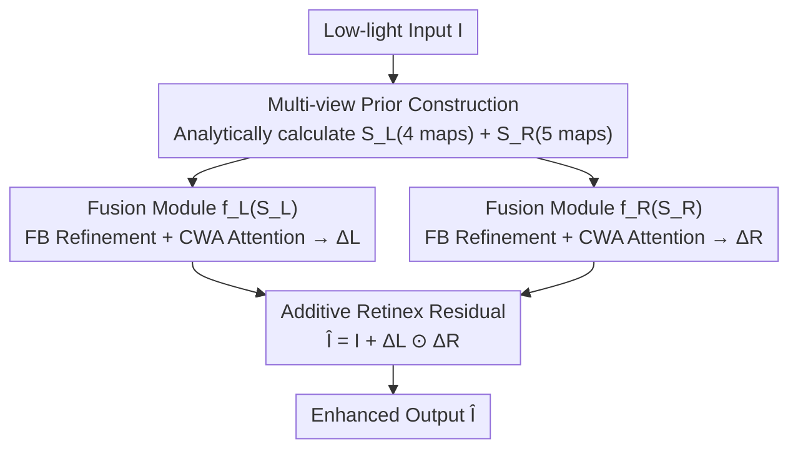

# Multinex: Lightweight Low-light Image Enhancement via Multi-prior Retinex

**Conference**: CVPR 2026  
**Paper**: [CVF Open Access](https://openaccess.thecvf.com/content/CVPR2026/html/Brateanu_Multinex_Lightweight_Low-light_Image_Enhancement_via_Multi-prior_Retinex_CVPR_2026_paper.html)  
**Code**: https://albrateanu.github.io/multinex (Project Page)  
**Area**: Image Restoration / Low-light Enhancement  
**Keywords**: Low-light Enhancement, Retinex, Lightweight Network, Multi-prior Fusion, Edge Deployment

## TL;DR
Multinex reformulates Retinex decomposition from a "reconstruction target" into an "additive residual prior." By feeding a set of analytically computed multi-view luminance/chrominance priors into two ultra-lightweight fusion networks, it outperforms SOTA lightweight models and approaches million-parameter models using only 45K (or even 0.7K) parameters across seven low-light benchmarks.

## Background & Motivation

**Background**: The goal of low-light image enhancement (LLIE) is to restore natural brightness, color fidelity, and structural details under severe underexposure. Current mainstream methods range from early CNNs to Transformers and Diffusion Models, continuously improving perceptual quality. Among them, Retinex-based methods (Retinex-Net, KinD, RetinexFormer) are a significant branch due to the "Illumination × Reflectance" physical prior, with recent derivatives decoupling luminance and chrominance in YCbCr/YUV/HSV/HVI color spaces (e.g., CIDNet).

**Limitations of Prior Work**: Two specific problems coexist. First, **color and luminance coupling**—most methods still operate primarily in RGB space where luminance and chrominance are intertwined, weakening the decoupling advantage of Retinex and leading to red artifacts, black-surface noise, and training instability. Switching to a single non-RGB color space introduces new artifacts (e.g., hue discontinuity in HSV). Second, **excessive model weight**—SOTA models typically require millions of parameters and hundreds of GFLOPs, making them unsuitable for real-time deployment on edge devices like surveillance cameras, phones, or drones. Enhancing quality drops significantly when parameters are compressed below 1M.

**Key Challenge**: To achieve physical interpretability and cross-scene stability, thorough decoupling of luminance/chrominance is necessary. To achieve edge deployability, extreme parameter compression is required. These two objectives are usually mutually exclusive—decoupling often relies on learning color space transforms or large networks, while extreme compression lacks representation learning capacity.

**Goal**: To stably decouple luminance and chrominance and restore high-quality results under extreme compression (below 1M parameters, even down to the 10K magnitude).

**Key Insight**: The authors observe that existing methods focus only on a "single color space" (RGB, YUV, or HVI), wasting complementary luminance and chrominance cues present in the input. Rather than forcing a small network to learn a color space transform, these cues should be **analytically calculated** as priors to offload the burden of representation learning.

**Core Idea**: Replace "implicit Retinex reconstruction + single color space learning" with a triplet of "additive enhancement residual + multi-view analytical priors + lightweight learnable fusion"—specifically, predicting the required exposure/color correction rather than reconstructing the entire image.

## Method

### Overall Architecture
Multinex takes a low-light RGB image $\mathbf{I}$ as input and outputs an enhanced image $\hat{\mathbf{I}}$. It reformulates the multiplicative reconstruction $\hat{\mathbf{I}}=L\odot R$ of standard Retinex into "original image + additive correction." First, it analytically calculates two prior stacks from the input: the luminance guidance stack $\mathcal{S}_L$ (4 illumination maps) and the reflectance guidance stack $\mathcal{S}_R$ (5 chrominance maps). Then, two lightweight fusion modules $f_L, f_R$ with shared structures but independent weights fuse these stacks into a luminance correction $\Delta L$ and a color correction $\Delta R$. Finally, they are multiplied in Retinex style and added back to the original image. Structure preservation is guaranteed by the identity of $\mathbf{I}$, allowing the network to focus solely on learning the additive residual, enabling extreme parameter compression.

### Key Designs

**1. Additive Retinex Enhancement Delta: Correction instead of Reconstruction**

Addressing the pain point that direct Retinex multiplicative reconstruction is difficult and costly under low exposure, the authors treat Retinex decomposition as a **structural prior** rather than a reconstruction output. Instead of predicting $L$ and $R$ to reconstruct the image, the model estimates an additive correction field $\Delta\mathbf{I}$ to "fix" the input, decomposed into luminance correction $\Delta L$ and reflectance correction $\Delta R$:

$$\hat{\mathbf{I}} = \mathbf{I} + \Delta\mathbf{I} = \mathbf{I} + \Delta L \odot \Delta R.$$

Specifically, per channel: $\hat{\mathbf{I}}_i = \mathbf{I}_i + f_L(\mathbf{I},\theta_L)\odot f_{R_i}(\mathbf{I},\theta_R)$, where $\Delta L=f_L(\cdot)\in\mathbb{R}^{H\times W\times1}$ is shared across channels and $\Delta R=f_R(\cdot)\in\mathbb{R}^{H\times W\times3}$ is channel-independent. No restrictive activation is applied to the output to encourage flexible correction. Since the original image $\mathbf{I}$ retains texture structures, the network only needs to approximate an additive residual, avoiding color shifts and detail loss while simplifying "reconstruction" into "correction."

**2. Multi-view Analytical Prior Stack: Analytical Calculation instead of Color Space Learning**

To avoid the burden of learning color transforms, the authors **calculate two sets of complementary priors** based on classical color vision theory. The luminance stack $\mathcal{S}_L=[Y_{\text{Rec.709}}, Y_{v\max}, Y_{\text{lightness}}, Y_{L2}]$ contains $K_L=4$ maps: BT.709 weighted luminance, channel maximum (highlight proxy), HSL lightness, and RGB vector L2-norm. The reflectance stack $\mathcal{S}_R=[C_b,C_r,r,g,S]$ contains $K_R=5$ maps: YCbCr blue/red difference, normalized chromaticity ratios $r, g$, and saturation $S$. These are selected to cover a wide range of physical/perceptual cues with minimal redundancy. The enhancement formula becomes:

$$\hat{\mathbf{I}}_i = \mathbf{I}_i + f_L(\mathcal{S}_L(\mathbf{I}),\theta_L)\odot f_{R_i}(\mathcal{S}_R(\mathbf{I}),\theta_R).$$

Providing decoupled multi-view cues significantly reduces the representation learning burden.

**3. Dual-branch Lightweight Fusion Network (FB + CWA): Refining and Fusing Priors**

The fusion modules use two lightweight operators. The **Fusion Block (FB)** handles refinement: $\bar{\mathbf{X}}=\text{MSEF}\circ\sigma_{\text{ReLU}}\circ\text{DSConv}\circ\text{MSEF}(\mathbf{X})$. It uses MSEF for channel-wise calibration, 3×3 depthwise separable convolution for spatial filtering, and another MSEF for cross-channel consistency. The **Component-Wise Attention (CWA)** integrates local and global cues: $\mathbf{A}=\sigma\circ\text{Conv}_{1\times1}\circ\text{DWConv}(\mathbf{X})$, using a 7×7 depthwise convolution followed by a zero-bias $1\times1$ convolution to generate **independent attention maps for each component**. The full module is:

$$f(\mathcal{S})=\text{Conv}_{1\times1}\circ\text{FB}^T\big(\text{CWA}(\mathcal{S})\odot\bar{\mathcal{S}}\big),\quad \bar{\mathcal{S}}=\text{FB}^T\circ\text{Conv}_{1\times1}(\mathcal{S}).$$

Two variants are instantiated: **Lightweight** (3 FBs) and **Nano** (1 FB and simplified path, 0.7K parameters). CWA outperforms standard CBAM/MHSA by maintaining component independence.

### Loss & Training
A hybrid loss function is used: a weighted sum of pixel-wise MSE, multi-scale structural similarity (MS-SSIM), and perceptual loss.

## Key Experimental Results

### Main Results
On LOL-v1 / LOL-v2 benchmarks, Multinex leads in the lightweight category (<1M) and approaches the best mid-sized models. Multinex-Nano achieves SOTA in the micro category (<10K).

| Dataset | Metric | Multinex(45K) | LYT-Net(45K, Prev. SOTA) | CIDNet(1.88M, mid) |
|--------|------|---------------|------------------------|--------------------|
| LOLv1 | PSNR↑ | 23.19 | 22.38 | 23.81 |
| LOLv2-real | PSNR↑ | 23.04 | 21.83 | 24.11 |
| LOLv2-syn | PSNR↑ | 25.04 | 23.78 | 25.71 |
| — | Param(M)↓ | 0.0446 | 0.0449 | 1.88 |
| — | GFLOPs↓ | 2.50 | 3.49 | 7.57 |

On non-reference benchmarks (MEF, LIME, etc.), Multinex achieves top perceptual quality with an average NIQE of 3.64 and BRISQUE of 14.33. In downstream ExDark detection, Multinex-Nano as a pre-processor for YOLOv3 achieves mAP50 of 80.7, taking the top spot with only 0.7K parameters.

### Ablation Study
Performed on LOL-v1 with 45K configuration (Tab.4):

| Config | PSNR | Description |
|------|------|------|
| $\hat{\mathbf{I}}_i=f_i(\mathbf{I}_i)$ (No priors) | 14.15 | RGB only, worst performance |
| w/ $\Delta L$ only | 20.57 | Luminance prior, primary driver for exposure |
| w/ $\Delta R$ only | 18.50 | Chrominance prior, stabilizes hue |
| $\Delta L\odot\Delta R$ (Full) | 23.19 | Physical decomposition, best |
| w/o CWA & MSEF | ~20 | Removing core operators drops ~3dB |
| CWA vs CBAM/MHSA/MDTA | 23.19 vs ~22 | CWA provides best attention at low complexity |

### Key Findings
- **Priors are vital**: Removing priors drops PSNR to 14dB, while adding $\Delta L$ jumps it to 20dB+, proving luminance cues are essential for exposure recovery.
- **CWA and MSEF are complementary**: One handles channel weighting and the other local details; both are required to reach 23dB.
- **Stability under extreme compression**: The Nano variant (0.7K params) excels in micro-group and detection tasks, validating the "analytical prior + additive residual" approach.

## Highlights & Insights
- **"Outsourcing" learning to analytical formulas**: Instead of making a 45K network learn color transforms, providing 9 analytical priors allows it to match large models with 1/40th of the parameters.
- **"Correction over Reconstruction"**: Treating the original image as a structural backbone and learning only the additive residual naturally prevents color artifacts and detail loss.
- **Component-Wise Attention**: Assigning independent attention to each analytical descriptor without mixing channels outperforms MHSA/MDTA at lower complexity.

## Limitations & Future Work
- While Multinex leads in perceptual quality (NIQE/BRISQUE), its reference-based PSNR (23.19 on LOLv1) remains slightly lower than mid-sized models (CIDNet 23.81), achieving "proximity but not superiority" to million-parameter models.
- The selection of the 9 specific priors relies on empirical analysis; whether this is optimal for all sensors/noise distributions or could be automatically searched remains a question.
- As the prior stack expands, the extremely small parameter budget of the fusion module might become a bottleneck.

## Related Work & Insights
- **vs RetinexFormer / KinD**: Unlike these models that predict $L, R$ for multiplicative reconstruction, Multinex uses Retinex as a structural prior in an additive residual framework, reducing parameters from millions to 45K.
- **vs CIDNet / HVI**: Unlike data-dependent learnable decoupling, Multinex uses stable analytical priors, saving parameters at the cost of slightly lower PSNR.
- **vs LYT-Net / ZeroDCE**: At the ~45K level, Multinex outperforms LYT-Net (YUV-based) and ZeroDCE (curve-based) across all benchmarks.

## Rating
- **Novelty**: ⭐⭐⭐⭐ The combination of "Retinex as structural prior + analytical multi-view priors" is clever, though components have existing roots.
- **Experimental Thoroughness**: ⭐⭐⭐⭐⭐ Comprehensive coverage across 7 benchmarks and downstream detection.
- **Writing Quality**: ⭐⭐⭐⭐ Clear physical motivation; however, some analysis (DIA/LRA) is moved to the supplement.
- **Value**: ⭐⭐⭐⭐⭐ High practical value for edge deployment (surveillance, drones) with 0.7K–45K parameters.

<!-- RELATED:START -->

## Related Papers

- [\[CVPR 2026\] MR. Illuminate: Zero-Shot Low-Light Image Enhancement with Diffusion Prior](mr_illuminate_zero-shot_low-light_image_enhancement_with_diffusion_prior.md)
- [\[CVPR 2026\] Event-Illumination Collaborative Low-light Image Enhancement with a High-resolution Real-world Dataset](event-illumination_collaborative_low-light_image_enhancement_with_a_high-resolut.md)
- [\[CVPR 2026\] Bi-Bridge: Bidirectional Diffusion Bridges for Low-Light Image Enhancement](bi-bridge_bidirectional_diffusion_bridges_for_low-light_image_enhancement.md)
- [\[CVPR 2026\] BiEvLight: Bi-level Learning of Task-Aware Event Refinement for Low-Light Image Enhancement](bievlight_bi-level_learning_of_task-aware_event_refinement_for_low-light_image_e.md)
- [\[CVPR 2026\] Gaussian Splatting-based Low-Rank Tensor Representation for Multi-Dimensional Image Recovery](gaussian_splatting-based_low-rank_tensor_representation_for_multi-dimensional_im.md)

<!-- RELATED:END -->
## Related Papers

- [\[CVPR 2026\] MR. Illuminate: Zero-Shot Low-Light Image Enhancement with Diffusion Prior](mr_illuminate_zero-shot_low-light_image_enhancement_with_diffusion_prior.md)
- [\[CVPR 2026\] Event-Illumination Collaborative Low-light Image Enhancement with a High-resolution Real-world Dataset](event-illumination_collaborative_low-light_image_enhancement_with_a_high-resolut.md)
- [\[CVPR 2026\] Bi-Bridge: Bidirectional Diffusion Bridges for Low-Light Image Enhancement](bi-bridge_bidirectional_diffusion_bridges_for_low-light_image_enhancement.md)
- [\[CVPR 2026\] VSRELL: A Simple Baseline for Video Super-Resolution and Enhancement in Low-Light Environment](vsrell_a_simple_baseline_for_video_super-resolution_and_enhancement_in_low-light.md)
- [\[CVPR 2026\] BiEvLight: Bi-level Learning of Task-Aware Event Refinement for Low-Light Image Enhancement](bievlight_bi-level_learning_of_task-aware_event_refinement_for_low-light_image_e.md)

<!-- RELATED:END -->
