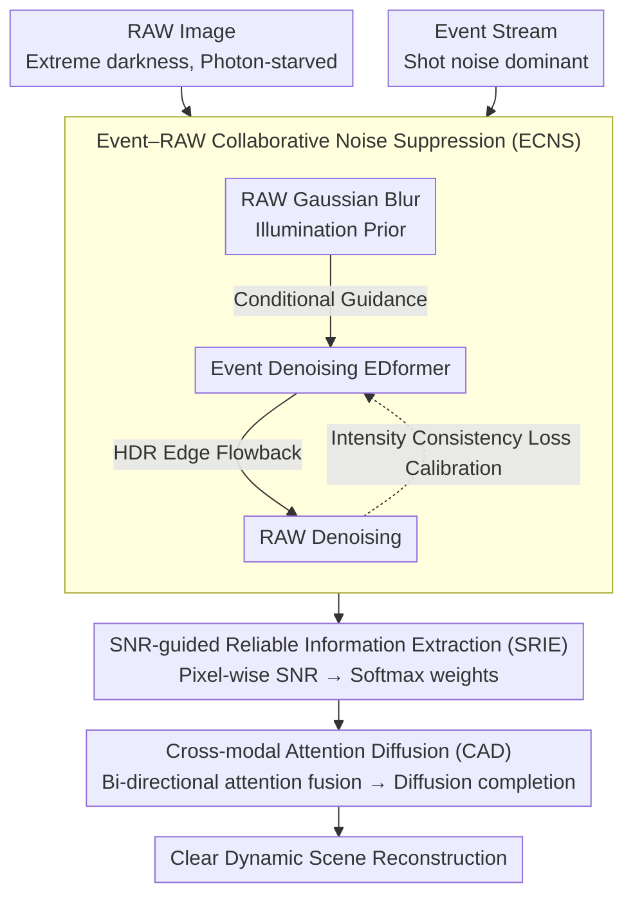

# NEC-Diff: Noise-Robust Event–RAW Complementary Diffusion for Seeing Motion in Extreme Darkness

**Conference**: CVPR 2026  
**arXiv**: [2603.20005](https://arxiv.org/abs/2603.20005)  
**Code**: [https://github.com/jinghan-xu/NEC-Diff](https://github.com/jinghan-xu/NEC-Diff)  
**Area**: Image Restoration / Low-light Enhancement  
**Keywords**: Extreme low-light imaging, Event camera, RAW image, Collaborative denoising, Diffusion model

## TL;DR

Proposes NEC-Diff, a diffusion-based event-RAW hybrid imaging framework that utilizes illumination priors from RAW images to guide event denoising and high dynamic range edges from events to assist image denoising. By combining dual-modal SNR-guided reliable information extraction and cross-modal attention diffusion, it achieves high-quality dynamic scene reconstruction in extreme darkness (0.001-0.8 lux) with a PSNR of 24.51 dB on the REAL dataset.

## Background & Motivation

1. **Background**: Low-light image enhancement methods are categorized into sRGB-based, RAW-based, event-based, and hybrid methods. RAW methods model noise more effectively but cannot resolve information loss due to short exposures; event cameras offer a high dynamic range but fail to recover intensity in smooth regions.
2. **Limitations of Prior Work**: In extreme darkness (<1 lux), both modalities suffer from severe noise—RAW images are photon-starved with extreme noise, and shot noise in event cameras becomes the dominant background activity (with density exceeding other noise types by over 50 times). Existing hybrid methods either ignore noise (EvRAW) or only consider single-modal SNR (EvLight), failing to denoise effectively.
3. **Key Challenge**: In extreme low light, signals and noise are difficult to distinguish. Simple filtering or single-network denoising cannot simultaneously preserve weak signals and suppress noise.
4. **Goal**: How can fine scene details be effectively denoised and recovered from two severely degraded modal signals?
5. **Key Insight**: Leverage the physical complementarity between RAW and events—RAW's linear response to illumination can guide event denoising, while denoised events provide high dynamic range edges to assist image denoising.
6. **Core Idea**: Physics-constrained cross-modal collaborative denoising + SNR-guided adaptive fusion + high-fidelity diffusion reconstruction.

## Method

### Overall Architecture

NEC-Diff aims to reconstruct clean frames from RAW images and event streams, both heavily contaminated by noise in extreme dark dynamic scenes (0.001–0.8 lux). The core premise is that rather than performing independent hard denoising before fusion, it is more effective to let the two modalities reduce noise for each other through physical relationships before fusion and generation. The pipeline follows three stages: **Event–RAW Collaborative Noise Suppression** (ECNS), followed by **SNR-guided Reliable Information Extraction** (SRIE) to identify reliable components per pixel, and finally **Cross-modal Attention Diffusion** (CAD) to fuse features and perform high-fidelity reconstruction. The first two steps focus on noise suppression and weighting, while the third stage completes the weak signals into a full image.

### Key Designs

**1. Event–RAW Collaborative Noise Suppression (ECNS): Mutual Denoising via Physical Relationships**

In extreme darkness, both modalities are heavily degraded: RAW is photon-starved, and event shot noise density can exceed other noise types by 50 times. ECNS exploits a physical fact—event shot noise density positively correlates with light intensity (validated experimentally), and RAW responds linearly to light. It uses a Gaussian-blurred RAW image as a coarse illumination prior for the event denoising network (EDformer). In areas with high illumination, real events are more likely and noise criteria are relaxed; in low illumination, background noise is suppressed more aggressively. Conversely, denoised events provide high dynamic range edge info to help the RAW network distinguish true details from noise in weak texture regions.

To ensure physical consistency, Ours derives a logarithmic relationship between RAW and events from the event imaging model: $\tilde{E}(t) = \frac{1}{C}\log\frac{\tilde{R}(t)}{\tilde{R}(t-\Delta t)}$ (where $C$ is the contrast threshold). An intensity consistency loss is enforced:

$$\mathcal{L}_{\text{cons}} = \left\|\hat{E}(t)\cdot C - \log\frac{\hat{R}(t)+\epsilon}{\hat{R}(t-\Delta t)+\epsilon}\right\|_1$$

This loss calibrates event jumps and RAW temporal changes against each other. In ablation studies, this component contributed most to performance (improving PSNR by 3.45 dB).

**2. SNR-guided Reliable Information Extraction (SRIE): Weighting by Pixel-wise SNR**

Denoising is followed by intentional fusion based on modal blind spots: events have high SNR in textured/motion areas but near-zero SNR in smooth regions; RAW is reliable in brighter areas but noise-dominated in extreme darkness. SRIE quantifies reliability using residuals before and after denoising to calculate SNR maps:

$$M_{\text{SNR}} = 10\cdot\log\frac{M_{\text{in}}^2}{(M_{\text{in}}-M_{\text{den}})^2+\epsilon}$$

Lower differences indicate cleaner signals and higher SNR. Jointly processed SNR maps are converted to spatial weights $W_{\text{img}}, W_{\text{evt}}$ via channel-wise softmax. This dual-modal strategy ensures that in dark, smooth areas where event SNR is near zero, the system retains weak signals from the image rather than relying blindly on events. SRIE improves performance by 0.76 dB over direct fusion.

**3. Cross-modal Attention Diffusion (CAD): Bi-directional Attention and Diffusion Completion**

Using weighted features, CAD performs deep fusion and reconstruction. It employs bi-directional cross-attention—image features query event K/V, and vice versa—to complete context before concatenating into a multi-modal representation $F_{\text{fused}}$. This representation serves as a condition for the diffusion model $\hat{\epsilon}_\theta = \epsilon_\theta(x_t, F_{\text{fused}}, t)$, utilizing 50-step DDIM deterministic sampling. Diffusion is preferred over single-step regression because extreme dark regions have such low SNR that single-step networks often produce residual noise; the progressive denoising of diffusion approaches the clean distribution while constraints from $F_{\text{fused}}$ ensure high fidelity.

### Loss & Training

A two-stage training strategy is adopted: Stage 1 trains image and event denoising modules independently. Stage 2 introduces cross-modal consistency constraints for joint training. The total loss is:

$$\mathcal{L}_{\text{total}} = \mathcal{L}_{\text{rec}} + 10\cdot\mathcal{L}_{\text{grad}} + 0.5\cdot\mathcal{L}_{\text{cons}}$$

The gradient term (weight 10) emphasizes edge sharpness, and the consistency term (weight 0.5) enforces physical constraints. Optimization uses Adam with a learning rate of $1\times10^{-4}$ for 50 epochs, with 256×256 crops. Diffusion uses 1000 forward steps on an RTX 4090.

## Key Experimental Results

### Main Results

| Input | Method | LLRVD-simu PSNR/SSIM/LPIPS | REAL PSNR/SSIM/LPIPS |
|------|------|---------------------------|---------------------|
| sRGB | LightenDiffusion | 21.64/0.818/0.265 | 22.19/0.714/0.282 |
| RAW | BRVE | 27.58/0.817/0.137 | 21.87/0.717/0.334 |
| RAW | RID(NoiseModelling) | 26.76/0.825/0.127 | 22.72/0.729/0.258 |
| Event+sRGB | EvLight | 17.06/0.677/0.291 | 21.20/0.626/0.277 |
| **Event+RAW** | **Ours** | **27.74/0.828/0.125** | **24.51/0.742/0.201** |

### Ablation Study

| Configuration | PSNR ↑ | SSIM ↑ | LPIPS ↓ |
|------|--------|--------|---------|
| w/o ECNS (SRIE+CAD only) | 21.06 | 0.653 | 0.278 |
| w/o SRIE (ECNS+CAD) | 23.24 | 0.698 | 0.243 |
| w/o CAD (ECNS+SRIE) | 22.53 | 0.671 | 0.265 |
| Full Model | **24.51** | **0.742** | **0.201** |

### Key Findings

- ECNS provides the largest contribution (3.45 dB drop without it), proving collaborative denoising is the foundation of the pipeline.
- Dual SNR guidance outperforms image-only SNR guidance by 0.43 dB and direct fusion by 0.76 dB.
- Advantages are more pronounced on the REAL dataset (+1.79 dB over the best RAW method) due to complex real-world noise.
- Performance gains are particularly superior in extreme darkness (0.001–0.3 lux), which covers 70% of the dataset.
- Using both cross-modal input and consistency loss yields the best event denoising results.

## Highlights & Insights

- **Physics-driven cross-modal denoising** is the core contribution: utilizing the linear response of RAW and the luminance correlation of event shot noise creates a robust mutual denoising framework beyond simple fusion or post-processing.
- **REAL Dataset** construction is highly valuable, using a co-axial imaging system with optical attenuation to simulate 0.001 lux, providing 47,800 pixel-aligned triplets (RAW/Event/GT).
- **SNR maps as fusion weights** is a simple yet effective strategy applicable to various multi-modal fusion scenarios.

## Limitations & Future Work

- The event contrast threshold $C$ is learned from data; varying thresholds across different event cameras in deployment may reduce generalization.
- Inference speed of the diffusion model is slow (50-step DDIM), limiting real-time applications.
- Evaluation was limited to 256×256 resolution; high-resolution scenarios require further validation.
- Future work could explore test-time adaptation for different event camera parameters.

## Related Work & Insights

- **vs EvLight**: EvLight only uses image SNR for fusion, ignoring zero SNR in smooth dark event regions. The dual SNR strategy in NEC-Diff is more comprehensive.
- **vs ELEDNet/RETINEV**: These use low-pass filters or CNNs for event noise, but simple filtering cannot balance noise suppression and detail preservation.
- **vs EvRAW**: EvRAW focuses on detail and color recovery but neglects sensor noise, leading to limited performance in extreme darkness.

## Rating

- Novelty: ⭐⭐⭐⭐ The physics-driven cross-modal collaborative denoising is novel, though the diffusion framework with conditional generation is common.
- Experimental Thoroughness: ⭐⭐⭐⭐ Sufficient comparison on synthetic and real datasets with clear ablations, though lacking broader real-world generalization testing.
- Writing Quality: ⭐⭐⭐⭐ Clear physical modeling and high-quality illustrations, though method descriptions are slightly long.
- Value: ⭐⭐⭐⭐ Significant dataset contribution with clear application scenarios in extreme low-light imaging.

<!-- RELATED:START -->

## Related Papers

- [\[CVPR 2026\] RawMetaDiff: Unlocking Extreme Darkness from Dual-Exposure RAW with Meta-Guided Diffusion](rawmetadiff_unlocking_extreme_darkness_from_dual-exposure_raw_with_meta-guided_d.md)
- [\[CVPR 2026\] Event-Based Motion Deblurring Using Task-Oriented 3D Gaussian Event Representations](event-based_motion_deblurring_using_task-oriented_3d_gaussian_event_representati.md)
- [\[CVPR 2026\] From Events to Clarity: The Event-Guided Diffusion Framework for Dehazing](from_events_to_clarity_the_event-guided_diffusion_framework_for_dehazing.md)
- [\[CVPR 2026\] Spatio-Temporal Difference Guided Motion Deblurring with the Complementary Vision Sensor](spatio-temporal_difference_guided_motion_deblurring_with_the_complementary_visio.md)
- [\[CVPR 2026\] Efficient Real-Time Raw-to-Raw Denoising for Extreme Low-Light Ultra HD Video on Mobile Devices](efficient_real-time_raw-to-raw_denoising_for_extreme_low-light_ultra_hd_video_on.md)

<!-- RELATED:END -->
