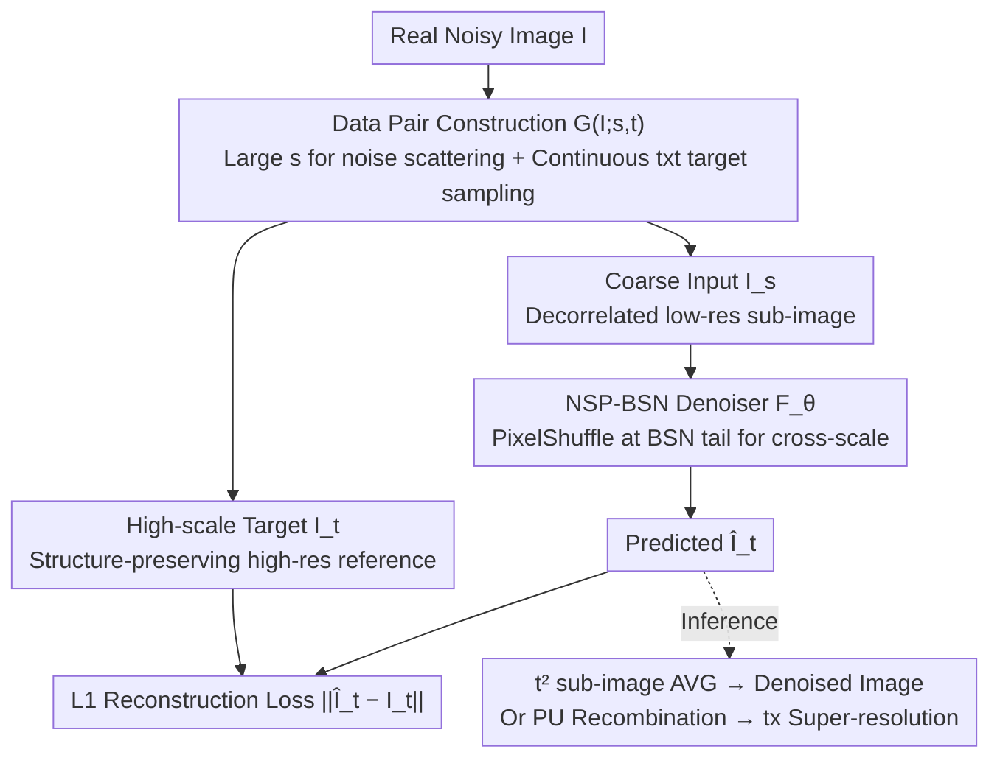

# Next-Scale Prediction: A Self-Supervised Approach for Real-World Image Denoising

**Conference**: CVPR 2026  
**Paper**: [CVF Open Access](https://openaccess.thecvf.com/content/CVPR2026/html/Shan_Next-Scale_Prediction_A_Self-Supervised_Approach_for_Real-World_Image_Denoising_CVPR_2026_paper.html)  
**Code**: https://github.com/XLearning-SCU/2026-CVPR-NSP  
**Area**: Image Restoration / Self-Supervised Denoising  
**Keywords**: Self-Supervised Denoising, Blind-Spot Network, Pixel-shuffle Downsampling, Cross-scale Training Pairs, Real-world Noise

## TL;DR
Inspired by "Next-Scale Prediction" in visual autoregression, NSP allows a Blind-Spot Network (BSN) to take **low-resolution, decorrelated** sub-images (derived from a large downsampling factor) as input to predict **high-resolution, detail-preserving** targets (corresponding to a small downsampling factor). This decouples "noise decorrelation" and "detail preservation"—two traditionally conflicting objectives—across different scales, achieving self-supervised SOTA on real-world denoising benchmarks while providing noise-aware super-resolution for free.

## Background & Motivation

**Background**: Self-supervised real-world denoising does not rely on clean labels. The dominant paradigm is the Blind-Spot Network (BSN), which predicts the clean value of a center pixel from its neighbors, assuming "pixel-wise independent noise." However, real-world noise through ISP pipelines often exhibits strong spatial correlation, causing BSNs to fail by learning to predict target noise from neighborhood noise. To address this, Pixel-shuffle Downsampling (PD) is used to break the image into smaller sub-images, where a large downsampling factor $s$ scatters correlated noise into approximately pixel-wise independent noise for BSN removal.

**Limitations of Prior Work**: The PD downsampling factor $s$ presents a dilemma. A large $s$ thoroughly decorrelates noise but shatters high-resolution structures, forcing the BSN to learn from tiny patches and failing to recover fine edges—sometimes even discarding sharp structures as noise. A small $s$ preserves detail, but spatial noise correlation returns, preventing the BSN from removing "signal-like residual noise."

**Key Challenge**: Noise decorrelation and detail preservation act on the **same set of spatial dependencies** in opposite directions. This is an inherent "identifiability" problem that cannot be solved by parameter tuning. Scattering correlated noise inevitably removes high-frequency cues used to distinguish detail from noise. Any solution must **explicitly decouple** these two objectives rather than attempting to satisfy both at a single scale.

**Goal**: Find a strategy that maintains the decorrelation advantages of PD without destroying high-resolution structures, assigning "denoising" and "detail preservation" to their respective optimal scales.

**Key Insight**: The authors draw inspiration from "Next-Scale Prediction" in Visual Autoregressive modeling (VAR, Best Paper NeurIPS 2024), where a Transformer predicts scale-by-scale from coarse to fine. Can denoising also be a coarse-to-fine process involving "coarse-scale denoising and fine-scale detail completion"?

**Core Idea**: Reframe denoising as "Next-Scale Prediction" (NSP): the BSN takes low-resolution sub-images (large PD factor) as input to predict high-resolution targets (small PD factor). The low scale handles noise decorrelation, while the high scale handles detail preservation, naturally decoupling the two.

## Method

### Overall Architecture
NSP is built on the PD+BSN paradigm but switches from "same-scale prediction" to "cross-scale prediction." Given a real noisy image $\mathbf{I}\in\mathbb{R}^{C\times H\times W}$, the "Data Pair Construction" operator $\mathcal{G}$ generates cross-scale training pairs $(\mathbf{I}_s, \mathbf{I}_t) = \mathcal{G}(\mathbf{I}; s, t)$: $s$ is the PD factor from original to sub-image (set large to scatter noise), making $\mathbf{I}_s$ a coarse-scale, decorrelated input; $t$ is the relative scale from sub-image to target (set small), making $\mathbf{I}_t$ a high-scale, structure-preserving reference. The BSN $\mathcal{F}_\theta$ learns to predict $\mathbf{I}_t$ from $\mathbf{I}_s$ using an $\ell_1$ reconstruction loss. Since both input and target are sampled from the same noisy image, this forms a **self-supervised loop**. During inference, the test image is divided into $t^2$ sub-images using factor $t$, processed by the BSN, and averaged; alternatively, using Pixel-shuffle Upsampling (PU) for recombination yields a $t\times$ super-resolution image without extra training.

### Key Designs

**1. Next-Scale Prediction Paradigm: Decoupling Conflicting Goals into Two Scales**

To solve the fundamental contradiction where noise decorrelation and detail preservation cannot coexist at the same scale, NSP reconstructs denoising as a cross-scale task. Formally, the BSN learns $\hat{\mathbf{I}}_t=\mathcal{F}_\theta(\mathbf{I}_s)$ with the objective $\mathcal{L}(\theta)=\|\hat{\mathbf{I}}_t-\mathbf{I}_t\|_1$. The process is a self-supervised loop: $\mathbf{I}\xrightarrow{\mathcal{G}}(\mathbf{I}_s,\mathbf{I}_t)\xrightarrow{\mathcal{F}_\theta}(\hat{\mathbf{I}}_t,\mathbf{I}_t)\xrightarrow{\mathcal{L}}\text{Update }\theta$. The key is that the input uses a large factor $s$—where noise is scattered into approximately pixel-wise independence, allowing the BSN to denoise cleanly at this **coarse scale**. The target uses the high scale corresponding to a small factor $t$—where spatial structures and details are preserved, allowing the BSN to learn detail restoration at this **fine scale**. This hierarchical arrangement ensures "denoising at the optimal scale" and "restoration at the optimal scale" without mutual interference.

**2. Cross-scale Data Pair Construction: Blocking Cross-scale Noise Correlation**

To address the issue where constructed pairs might still allow the BSN to access correlated noise or destroy pixel arrangements, the authors established three principles: block noise-correlated pixels across scales, maintain structural consistency, and use random sampling to cover diverse noise/structures. The noisy image is first divided into $s\times s$ non-overlapping patches $\{\mathbf{P}_{i,j}\}$. Within each patch, $t\times t$ pixels are randomly sampled to form the high-scale target $\mathbf{L}_{i,j}=\text{Sample}(\mathbf{P}_{i,j};t)\in\mathbb{R}^{C\times t\times t}$. The remaining $(s^2-t^2)$ pixels are distributed into $(s^2-t^2)$ sub-images. Each sub-image is paired with the same target to form training pairs $\{(\mathbf{I}_{i,j}^{(k)},\mathbf{L}_{i,j})\}$. This one-to-one random assignment **splits noise-correlated adjacent pixels into different sub-images**, blocking correlation across scales.

The strategy for sampling target pixels is critical: constant relative spatial mapping is key. Comparison between "Pure Random / Row-first / Interlaced / Continuous $t\times t$ patch" (Fig.3) shows that **preserving relative spatial pixel arrangement** is vital. Continuous patches are the default choice as they preserve position perfectly (yielding $(s-t+1)^2$ possible targets).

**3. BSN Denoiser with Pixel-shuffle: Changing Scales in Blind-Spot Networks**

Original BSNs operate at the same scale and cannot output higher resolutions. The authors insert a PixelShuffle layer at the end of the BSN (between $1\times1$ convolutional blocks) to perform scale transformation while **maintaining the blind-spot property**. The framework is compatible with both CNN-based (DBSN) and Transformer-based (TBSN) architectures, denoted as NSP(DBSN) and NSP(TBSN) respectively. This minor structural change is crucial for transitioning the BSN from a "same-scale pixel predictor" to a "cross-scale detail predictor."

### Loss & Training
The loss is $\ell_1$ reconstruction: $\|\hat{\mathbf{I}}_t-\mathbf{I}_t\|_1$. Default settings: $s=5, t=2$, patch size $160\times 160$, batch size 16, 750 epochs (400 iterations/epoch), learning rate 1e-4 with Adam. Training is conducted on 320 real noisy images from the SIDD Medium dataset.

## Key Experimental Results

### Main Results
Comparison on SIDD Validation, SIDD Benchmark, and DND real-world noise datasets (PSNR/SSIM). NSP achieves the best results among almost all self-supervised methods.

| Method | Type | #Param | SIDD Validation | DND |
|------|------|--------|-----------------|-----|
| AP-BSN | Self-supervised | 3.66M | 34.46/0.8296 | 37.46/0.9244 |
| SDAP | Self-supervised | 3.66M | 36.58/0.8630 | 37.71/0.9278 |
| TBSN | Self-supervised | 12.74M | 36.59/0.8574 | 37.90/0.9288 |
| **NSP(DBSN)** | Self-supervised | 3.75M | **37.02/0.8865** | 37.80/0.9319 |
| **NSP(TBSN)** | Self-supervised | 12.77M | **37.12/0.8853** | 37.87/0.9342 |

Under similar parameter counts, NSP(DBSN) outperforms SDAP by 0.44dB/0.0235 on SIDD Validation. Qualitatively, while AP-BSN/SDAP/TBSN produce checkerboard artifacts, NSP recovers significantly more detail due to high-scale target supervision.

### Ablation Study
Analysis of target construction strategy, number of targets $n$, and upsampling factor $t$:

| Setting | Configuration | PSNR/SSIM | Conclusion |
|------|------|-----------|------|
| Target Strategy ($n{=}1$) | Pure Random | 36.77/0.8835 | Poor due to lost relative position |
| Target Strategy ($n{=}1$) | Row-first | 36.91/0.8835 | Partial position recovery |
| Target Strategy ($n{=}1$) | Continuous $t\times t$ | **37.02/0.8865** | Best (positions preserved) |
| Number of Targets | $n{=}1\to2$ | 36.77→37.11 | More targets improve performance |
| Upsampling Factor | $t{=}1/2/4$ | 34.12 / 37.02 / 36.46 | $t{=}2$ is the sweet spot |

### Key Findings
- **Preserving relative pixel position is essential**: Randomly selected targets perform poorly, while strategies that maintain relative spatial arrangement (continuous/interlaced) excel, as they encode structural information.
- **Scale factors have a sweet spot**: $t=2$ is significantly better than $t=1$ (34dB vs 37dB) or $t=4$ (36.46dB). Too small fails to decorrelate; too large shatters structures.
- **Free Super-resolution**: Replacing averaging with PU recombination provides $t\times$ super-resolution. NSP(DBSN) outperforms two-stage "SDAP+SR" methods on SIDD SR tasks with fewer parameters.

## Highlights & Insights
- **Transferring generative paradigms to low-level restoration**: Adapting the "coarse-to-fine" framework from VAR effectively addresses the decoupling requirements of denoising.
- **Small change, big impact**: Simply inserting a PixelShuffle layer into a BSN enables it to act as a cross-scale predictor while maintaining its core blind-spot properties.
- **Unified Denoising and Super-resolution**: Since the model naturally predicts higher-resolution versions, it possesses inherent SR capabilities without extra architectural modifications.

## Limitations & Future Work
- Validated primarily on SIDD/DND (ISP noise); performance on other modalities (medical/low-light/scientific imaging) is unknown.
- Hyperparameters $s=5, t=2$ are empirically tuned for SIDD; optimal values may vary with noise statistics and resolution.
- Inference requires processing $t^2$ sub-images, adding overhead compared to single-pass methods.

## Related Work & Insights
- **vs AP-BSN / SDAP**: These operate at a **single scale**, leading to the "decorrelation vs detail" conflict and checkerboard artifacts. NSP solves this cross-scale.
- **vs TBSN**: NSP can use TBSN as a backbone (NSP(TBSN)) to further improve results by combining cross-scale prediction with long-range dependencies.
- **vs Two-stage "SDAP+SR"**: Sequential methods accumulate artifacts; NSP's unified approach uses fewer parameters and produces sharper edges.

## Rating
- Novelty: ⭐⭐⭐⭐⭐ Decoupling conflicting denoising goals via cross-scale prediction is a clean and insightful paradigm.
- Experimental Thoroughness: ⭐⭐⭐⭐ Strong results across benchmarks and backbones; however, training is limited to SIDD Medium.
- Writing Quality: ⭐⭐⭐⭐⭐ Excellent articulation of the PD dilemma and clear logical flow from motivation to method.
- Value: ⭐⭐⭐⭐ Self-supervised SOTA on real denoising with free SR potential.

<!-- RELATED:START -->

## Related Papers

- [\[CVPR 2026\] TM-BSN: Triangular-Masked Blind-Spot Network for Real-World Self-Supervised Image Denoising](tm-bsn_triangular-masked_blind-spot_network_for_real-world_self-supervised_image.md)
- [\[CVPR 2026\] Convexity-Aware Noise Calibration: A Self-Supervised Framework for Noise-Level-Unknown Image Denoising](convexity-aware_noise_calibration_a_self-supervised_framework_for_noise-level-un.md)
- [\[ECCV 2024\] Asymmetric Mask Scheme for Self-supervised Real Image Denoising](../../ECCV2024/image_restoration/asymmetric_mask_scheme_for_self-supervised_real_image_denoising.md)
- [\[CVPR 2026\] LF-BVN: Blind-View Network for Self-Supervised Light Field Denoising](lf-bvn_blind-view_network_for_self-supervised_light_field_denoising.md)
- [\[CVPR 2026\] SelfHVD: Self-Supervised Handheld Video Deblurring](selfhvd_self-supervised_handheld_video_deblurring.md)

<!-- RELATED:END -->
