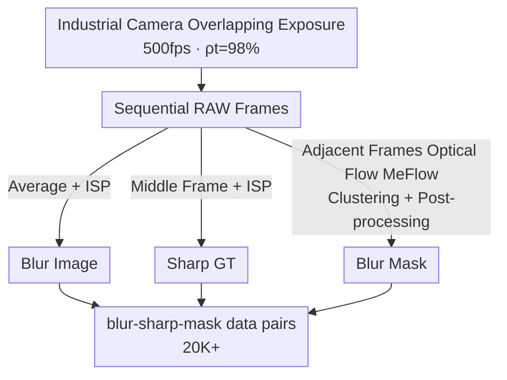
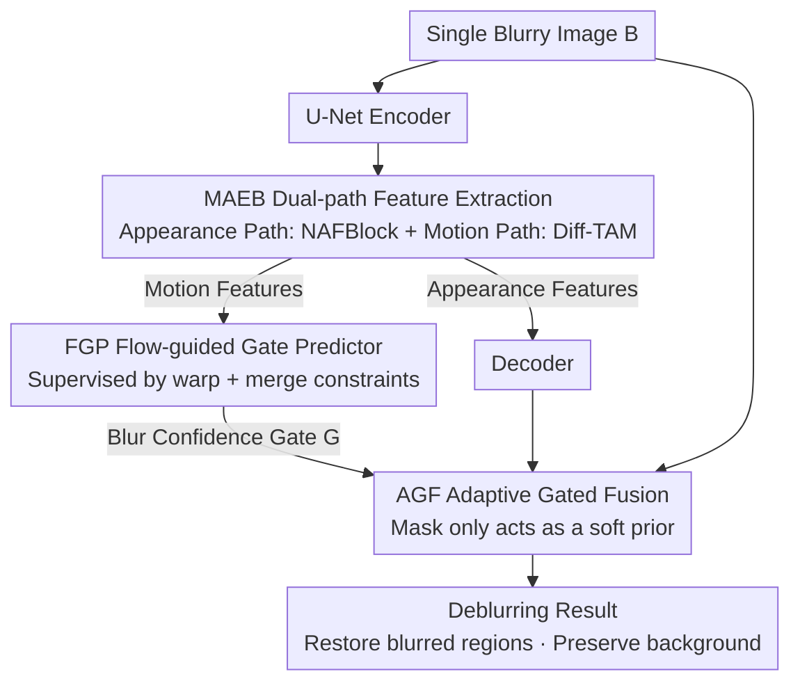

# OMoBlur: An Object Motion Blur Dataset and Benchmark for Real-World Local Motion Deblurring

**Conference**: CVPR 2026  
**Paper**: [CVF Open Access](https://openaccess.thecvf.com/content/CVPR2026/html/Yu_OMoBlur_An_Object_Motion_Blur_Dataset_and_Benchmark_for_Real-World_CVPR_2026_paper.html)  
**Code**: https://yudingchuan.github.io/OMoBlur_homepage/ (Available)  
**Area**: Image Restoration / Motion Deblurring  
**Keywords**: Local Motion Deblurring, Object Motion Blur, Dataset, Exposure Accumulation, Gated Fusion

## TL;DR
Targeting the "local and non-uniform" blur caused by moving objects in static scenes, the authors utilize programmable exposure control of industrial cameras to construct a physically faithful accumulative synthetic dataset, OMoBlur (containing over 20,000 blur-sharp-mask pairs, with an effective exposure ratio up to 98%). Additionally, they propose a deblurring network, OMDNet, which restores only the blurred areas and preserves the static background without relying on pixel-level mask annotations.

## Background & Motivation
**Background**: Motion blur is generally categorized into two types: camera shake blur (spatially continuous across the entire image, which has been extensively studied) and object motion blur (independent moving objects recorded by a static camera, where the blur is **local and discontinuous**). The latter is challenging because multiple objects can move at different speeds and in different directions, forming sharp semantic boundaries with the static background, and causing mutual occlusions, resulting in highly spatially heterogeneous blur. Moreover, object motion trajectories (such as the cycloidal trajectory of rolling wheels) are fundamentally different from camera shake trajectories, necessitating datasets specifically tailored for object motion.

**Limitations of Prior Work**: Existing data sources are all sub-optimal. 1) **Real-world shooting** (such as the first local motion blur dataset ReLoBlur) uses a beam-splitter camera to capture synchronized blur-sharp pairs. However, the hardware is bulky and difficult to scale up. Furthermore, optical/electronic inconsistencies lead to residual geometric and photometric misalignments, which hinder supervised training. 2) **Multi-frame accumulation synthesis** (such as GoPro, which averages sequential frames) relies on simplified models, leading to a domain gap with real blur. 3) **Kernel-based synthesis** (convolving sharp images with blur kernels) fundamentally fails to model object motion—arbitrary kernels do not satisfy kinematic constraints, and motions like rotating spheres cause pixels to appear or disappear along the boundaries. Most importantly, the **occlusion dynamics** caused by moving objects mean a pixel integrates light from both the foreground and background during the exposure time, which kernel-based methods cannot represent due to this time-varying blending.

**Key Challenge**: To scale up $\rightarrow$ synthesis is the only way; to generalize to the real world $\rightarrow$ synthesis must be faithful to the physical imaging process. Historically, these two goals were mutually exclusive: real-world capture via beam-splitters cannot scale up and suffers from misalignment, while pure synthesis exhibits physical domain gaps.

**Goal**: (1) To construct an object motion blur dataset that is both scalable and physically faithful; (2) To design a single-image deblurring network that can "localize blurred regions and protect the background" without requiring precise mask annotations.

**Key Insight**: Starting from the physical exposure process of a camera (photons being continuously integrated into charges by photodiodes during the exposure interval), an industrial camera capable of directly outputting RAW format, combined with programmable exposure timing, is used to physically replicate this "exposure integration" in hardware, rather than approximating it post hoc with gamma correction or inverse ISP.

**Core Idea**: Utilizing an "exposure-faithful signal accumulation model + overlapping exposure acquisition" to elevate the effective exposure ratio from approximately 10% in previous RAW-based schemes to 98%, making the synthetic blur physically equivalent to real-world blur. On the network side, a flow-guided gating mechanism is used to determine "where to restore" based on motion clues, thereby bypassing the reliance on pixel-level mask annotations.

## Method

### Overall Architecture
This paper offers dual contributions: "dataset + network". **On the dataset side**: The blur imaging process is first formulated as a time-integrated signal accumulation model. Sequential RAW frames are then captured at 500 fps with a 98% effective exposure ratio using programmable overlapping exposure controls on an industrial camera. The sequential RAW frames are averaged and passed through an ISP to yield the blurry image. The middle frame is independently processed through the ISP to serve as the sharp ground truth (GT). Adjacent frames are processed via optical flow estimation, clustering, and post-processing to generate the blur mask. Ultimately, over 20,000 blur-sharp-mask pairs are released. **On the network side**: OMDNet is a SIMO (Single-Input Multiple-Output) U-Net. It replaces the skip connections with dual-path Motion-Appearance Extract Blocks (MAEB, consisting of an appearance path and a motion path). The motion path passes through the Flow-guided Gate Predictor (FGP), which uses multi-frame GTs to supervise optical flow and predict a "blur confidence gate". Finally, the Adaptive Gated Fusion (AGF) weighted-fuses the decoder output with the blurry input based on the predicted gate. Only a single image is required during inference.

Dataset construction pipeline:

OMDNet architecture:

### Key Designs

**1. Exposure-Faithful Signal Accumulation Model: Physically Approximating Real Exposure Integration**

Addressing the pain points of "pure synthetic blur having domain gaps and kernel-based methods failing to model occlusion blending," the authors formulate the process starting from RAW imaging: a pixel $(x,y)$ integrates the photon arrival rate over the exposure interval $\Delta T$ to obtain the photon number $N_{ph}=\int_T^{T+\Delta T} p(t,x,y)\,dt$, which is then mapped to RAW output through the conversion pipeline $C(\cdot)$ (incorporating gain $G$ and noise $\varepsilon$). The commonly used multi-frame averaging blur model is $B=g\{\frac{1}{n}\sum_{i=0}^{n-1} g^{-1}[S_i]\}$, where $S_i=\mathrm{ISP}(\mathrm{RAW}_i)$ and $g^{-1}$ is the inverse response mapping the ISP output back to the approximately linear photon domain. The issue is that $g^{-1}$ for consumer-grade cameras is unknown, and approximating it with gamma correction or inverse ISP cannot faithfully restore the signal accumulation process. The authors demonstrate that when $g^{-1}\to\mathrm{ISP}^{-1}$, adjacent frames connect end-to-end $t_i+\Delta t\to t_{i+1}$, gain remains constant $G_i\equiv G$, and noise is negligible, the above equation can be upgraded to the **time-integrated signal accumulation model**:

$$B \approx \mathrm{ISP}\Big(C\big[\textstyle\int_{t_0}^{t_n} p(t)\,dt,\ \tfrac{G}{n}\big]\Big)$$

This derivation clarifies that "to make synthesis $\approx$ real, the effective exposure ratio $\rho_t=\frac{\Delta t}{t_{i+1}-t_i}$ must be close to 1," fundamentally bypassing the time-varying occlusion blending that kernel-based methods cannot express.

**2. Overlapping Exposure Acquisition: Pushing the Effective Exposure Ratio from ~10% to 98% via Hardware**

The assumption of the aforementioned model is realized via capture engineering. The authors select a Basler industrial camera capable of directly outputting RAW format (where $g^{-1}$ is exactly equal to $\mathrm{ISP}^{-1}$), and implement **overlapping exposure** through hardware programming—where the exposure of the next frame starts during the readout of the previous frame. The hardware constraint requires that the readout of each frame must complete before the readout of the next frame begins; thus, the exposure time must be longer than the readout time. Meanwhile, to ensure a sharp GT, a short exposure is preferred. These competing requirements are resolved through a "short readout": restricting the ROI to $1920\times360$ reduces the readout time to 1921 µs. Adding approximately 40 µs of hardware delay (for sensor reset/charge clearing) and setting the exposure to 1960 µs yields **500 fps and $\rho_t=98\%$** (previous RAW schemes were limited to about 10% due to hardware constraints). The remaining 2% exposure gap is mitigated by choosing appropriate optics based on imaging geometry (an 8mm lens, equivalent to about 45mm), which restrains object displacement on the image plane during the exposure gap to under 0.1 pixels, achieving near-perfect alignment with real motion blur. The acquisition covers in-plane and out-of-plane motions of pedestrians, vehicles, and balls from multiple perspectives, as well as hand-held movements of printed posters and calligraphy to enrich the datasets with complex motions and textures.

**3. MAEB + Diff-TAM: Dual-Path Separation of Appearance and Motion to Specificially Purify Motion Features**

To address the requirement that "gating requires high-quality motion information, otherwise localization will be inaccurate," MAEB uses the NAFBlock from NAFNet as a shared stem, which then branches into two paths: the appearance path is followed by another NAFBlock, while the motion path is connected to a **Differential Transposed Attention Module (Diff-TAM)**. Diff-TAM draws inspiration from differential amplifiers in electrical engineering and differential attention in language models—suppressing background responses by comparing paired attention paths. The differential attention map is denoted as $A=A_1-\lambda A_2$ (⚠️ please refer to the original paper for the exact value of $\lambda$), thereby "purifying" motion patterns from the static background to provide clean inputs for subsequent optical flow prediction. For efficiency, it adopts a Restormer-style transposed attention along the channel dimension and is implemented exclusively within the MAEB rather than the entire backbone. Appearance features are simultaneously sent to the corresponding decoder and higher-level MAEBs, while motion features are passed to the FGP.

**4. FGP + AGF: Flow-Guided Gate Prediction + Adaptive Gated Fusion Treatment of Mask as a Soft Prior**

This is the core design for "localizing blurred areas and protecting the background without requiring precise mask annotations." **FGP** fuses motion features with upsampled low-level optical flow to predict bidirectional optical flow $F=\{F_{-\to0}, F_{+\to0}\}$ and a flow mask $O\in[0,1]$, then concatenates the magnitude of the flow $\lVert F\rVert$ with $F$ to generate the gate $\hat G_i$. The optical flow is supervised by two constraints: **warp constraint**, which requires backward warping of the middle frame $S_i$ using $F$ to reconstruct the first and last sharp frames ($\hat S_{i-}\approx S_{i-}$ and $\hat S_{i+}\approx S_{i+}$); and **merge constraint**, designed for occlusion areas where warping fails, which requires the fused result $\hat m_i=\frac{2}{3}(\hat S_{i-}\otimes O+\hat S_{i+}\otimes(1-O))+\frac{1}{3}\hat S_i$ to match the GT fused result $m_i=\frac{1}{3}(S_{i-}+S_i+S_{i+})$. This design makes gate prediction explicitly dependent on optical flow while implicitly forcing the encoder to learn more precise motion representations.

**AGF** addresses the problem where "algorithmically generated masks are inaccurate, and misalignments or noise in blur-sharp pairs can falsely activate the gate on backgrounds." During training, the mask $M_i$ is treated only as a **soft prior**, and two gated outputs are calculated and supervised using the sharp GT $S_i$: the standard gating $\hat S_{iG}=\hat S_i\otimes\hat G_i+B_i\otimes(1-\hat G_i)$ drives the blurred regions toward $\hat G_i\to1$; the augmented gating $\hat S^*_{iG}=\hat S_i\otimes\hat G_i+(M_i\otimes B_i+(1-M_i)\otimes S_i)\otimes(1-\hat G_i)$ replaces $B_i$ with $S_i$ on background pixels to encourage $\hat G_i\to0$ in the background. Even if $M_i$ is directory-imperfect, the joint supervision of both formulations provides complementary error correction across blurred and background regions. During testing, only the standard gated output $\hat S_{iG}$ is exported.

### Loss & Training
The total loss is $L_{total}=\lambda_1 L_{warp}+\lambda_2 L_{merge}+\lambda_3 L_r+\lambda_4 L_g$, where $\lambda_1=0.05$, $\lambda_2=0.4$, $\lambda_3=1.0$, and $\lambda_4=0.4$. $L_{warp}$ directly supervises the optical flow $F$ and takes the minimum of the two directional warping pairs (due to the inherent motion direction ambiguity in blurry images, which avoids enforcing a fixed warping direction, $L_{warp}$ also prevents the network from collapsing bidirectional information into a single mixed flow field); $L_{merge}$ softly supervises $F$ and $\hat S_i$; $L_r$ strictly supervises $\hat S_i$; and $L_g$ adaptively supervises the gate $\hat G_i$ and $\hat S_i$, taking the average of the $\hat S_{iG}$ and $\hat S^*_{iG}$ paths. Here, $L_1$ represents the pixel-level $\ell_1$ loss, and $f$ denotes the combination of $\ell_1$ and FFT loss. Training is conducted using Adam with a batch size of 8 for 500K iterations, where the initial learning rate of $1\times10^{-4}$ decays via a milestone scheduler. A BAPC-style blur-aware cropping strategy is employed to sample $256\times256$ patches (more likely to cover blurred regions).

## Key Experimental Results

### Main Results
Evaluation is conducted on the OMoBlur test set (1,354 pairs, native resolution of $1920\times360$) using a single RTX 4090, comparing CNN, Transformer, and Mamba-based methods. Metrics include PSNR/SSIM, weighted PSNRw/SSIMw focusing on the blurred regions, and perceptual metrics LPIPS (VGG) & DISTS.

| Method | PSNR↑ | SSIM↑ | PSNRw↑ | SSIMw↑ | LPIPS↓ | DISTS↓ |
|------|-------|-------|--------|--------|--------|--------|
| MIMO-UNet | 35.36 | 0.8819 | 33.15 | 0.8543 | 0.2301 | 0.0889 |
| Restormer | 35.55 | 0.8880 | 33.24 | 0.8613 | 0.2379 | 0.0964 |
| NAFNet | 35.51 | 0.8878 | 33.18 | 0.8607 | 0.2375 | 0.0971 |
| EVSSM | 35.54 | 0.8862 | 33.21 | 0.8578 | 0.2419 | 0.0987 |
| LBAG | 35.55 | 0.8883 | 33.23 | 0.8615 | 0.2360 | 0.0947 |
| LMD-ViT | 35.68 | 0.8888 | 33.55 | 0.8660 | 0.2345 | 0.0923 |
| **OMDNet (Ours)** | **35.73** | **0.8891** | **34.04** | **0.8716** | **0.2171** | **0.0788** |

OMDNet performs best across all metrics, with **gains concentrated primarily in weighted PSNRw/SSIMw and perceptual LPIPS/DISTS** (PSNRw increases from the second-best LMD-ViT's 33.55 to 34.04, and LPIPS drops from 0.2345 to 0.2171), indicating significantly stronger performance in blurred region restoration and visual realism. The improvement in global PSNR/SSIM is minor because the gating mechanism intentionally avoids forcefully "correcting" inherent residual misalignments in blur-sharp pairs, which aligns with the design objective.

### Ablation Study
Progressive integration of the three core modules (all variants utilize AGF):

| Diff-TAM | FGP | MAEB | PSNR | SSIM | PSNRw | SSIMw |
|:--------:|:---:|:----:|------|------|-------|-------|
| | | | 35.53 | 0.8865 | 33.39 | 0.8662 |
| | | ✓ | 35.58 | 0.8871 | 33.46 | 0.8673 |
| | ✓ | ✓ | 35.69 | 0.8885 | 33.88 | 0.8702 |
| ✓ | ✓ | ✓ | 35.73 | 0.8891 | 34.04 | 0.8716 |

The minimal backbone (without extra modules) is already competitive with the CNN SOTA LBAG (PSNRw 33.39); when adding only MAEB, the gate relies on appearance clues and lacks motion specificity, resulting in limited gains (33.46). Adding FGP provides optical flow-supervised motion features and gate maps, boosting PSNRw to 33.88. Integrating Diff-TAM further enhances motion modeling efficiency, achieving the best performance at 34.04.

### Key Findings
- **The physical fidelity of the dataset directly determines generalization**: In cross-dataset generalization evaluations on real-world ReLoBlur data, MIMO-UNet/Restormer are trained respectively on GoPro, OMoBlur-FI (Frame Interpolation version), and OMoBlur. Models trained on GoPro struggle to restore features or even introduce artifacts; OMoBlur-FI, though visually indistinguishable from OMoBlur, fails on in-plane rotation (wheel textures) and out-of-plane motion (turning black car); only training on OMoBlur consistently removes cycloidal trailing artifacts, maintains robust performance across diverse scenes, and even yields cleaner reconstructions than ReLoBlur's ground truth.
- **Gating mechanism is crucial for background preservation**: Evaluating the Mean Absolute Error (MAE) between the reconstruction and input in the static regions of ReLoBlur shows that under Zoom1, "No Gating / LBAG Gating / Ours" yields 0.041 / 0.023 / 0.007 respectively, and under Zoom2, yields 0.026 / 0.017 / 0.006. This indicates that our AGF provides the best protection for backgrounds. While LBAG's gate tends to falsely classify static backgrounds as blurred (false positives), AGF more accurately activates only key blurry regions.
- FGP contributes the largest single-step improvement (+0.42 in PSNRw), validating that "optical-flow-supervised motion features" are key to accurate gating.

## Highlights & Insights
- **Treating "data generation" as a physical imaging problem**: Rather than approximating post hoc with gamma correction or inverse ISP, the programmable overlapping exposure of industrial cameras is used to achieve an actual $\rho_t$ of 98%. Furthermore, the displacement during the remaining 2% gap is restricted to 0.1 pixels using lens geometry. This triple-pronged approach of "hardware + optics + timing" approximates the physical exposure integration, offering a highly transferable paradigm for physically provable data synthesis.
- **Treating the mask only as a soft prior is a pragmatic and clever compromise**: Since algorithmically generated masks are inevitably inaccurate and manual annotation is too costly, AGF supervises both the standard gate and augmented gate paths with the sharp GT to allow complementary error correction. This bypasses the bottleneck of requiring pixel-level precise masks. This "weak annotation + dual-path self-supervised mutual correction" scheme can be extended to other restoration tasks requiring regional gating where precise masks are hard to acquire.
- **Diff-TAM transfers "differential background suppression" from electronic circuits and language models to visual motion purification**: Subtracting paired attention paths to suppress background responses and highlight motion is an innovative concept, and confining it to the MAEB keeps additional computational overhead under control.

## Limitations & Future Work
- **Restricted evaluation comparability**: OMoBlur reconstructs the middle frame (a natural choice to resolve physical motion direction ambiguity), whereas ReLoBlur targets the starting frame. This target inconsistency makes cross-dataset quantitative scores not directly comparable, forcing the authors to turn to qualitative comparisons. Fair cross-dataset quantitative comparison remains an open problem.
- **Limited global PSNR/SSIM improvements**: Although intentional (to avoid forcing the restoration of residual misalignments), this also implies that the advantage is less pronounced in scenarios dominated by global fidelity, requiring evaluation to be interpreted alongside weighted/perceptual metrics.
- **Strong hardware dependency for acquisition**: The proposed pipeline is tied to an industrial camera capable of outputting RAW format with programmable exposure and specific lenses, making it difficult for common users to replicate the acquisition process. Additionally, the ROI is restricted to $1920\times360$, and scaling up to full resolution or larger scenes is not fully discussed.
- **Future Directions**: Unifying the evaluation protocols for middle/starting frames to support quantitative cross-dataset comparison; exploring lighter-weight, consumer-device-reproducible approximations for high-$\rho_t$ acquisition.

## Related Work & Insights
- **vs ReLoBlur / LBAG**: ReLoBlur captures 2,405 real-world pairs using a beam-splitter, and LBAG relies on its GT mask for gated localization. This work scales up the dataset size to over 20,000 alignment-free pairs using accumulative synthesis. Furthermore, AGF eliminates the dependence on precise masks, yielding superior background preservation (MAE 0.007 vs 0.023 of LBAG) and enhanced blurred region restoration.
- **vs GoPro Multi-Frame Accumulation**: GoPro averages sequential frames using a simplified model, which leads to an obvious physical domain gap and poor cross-dataset generalization. This work employs a physically faithful signal accumulation model, achieving significantly stronger generalization.
- **vs Kernel-based Synthesis (spatially-varying kernel)**: Kernel-based methods fail to satisfy kinematic constraints and cannot express time-varying occlusion blending. The proposed method models the actual physical exposure integration, natively supporting these complex object motions.
- **vs LMD-ViT / MUGNet / PGDN**: These methods improve efficiency via adaptive pruning, model motion uncertainty with probabilistic frameworks, or employ an auxiliary self-supervised network to predict a 3-parameter blur kernel as a prior, respectively. In contrast, this work pursues a "dual-path motion purification + flow-guided soft gating" paradigm, outperforming other methods across all metrics on OMoBlur (PSNRw 34.04 vs LMD-ViT's 33.55).

## Rating
- Novelty: ⭐⭐⭐⭐⭐ Formulating data synthesis as a provable physical imaging problem (98% effective exposure ratio), combined with adaptive gating using a soft mask prior, presents a highly solid and unique approach.
- Experimental Thoroughness: ⭐⭐⭐⭐ Offers comprehensive main comparisons, module ablation studies, cross-dataset generalization, and gated MAE analysis. However, quantitative cross-dataset comparisons are constrained by the inconsistent target frames.
- Writing Quality: ⭐⭐⭐⭐⭐ The logical flow is clear, tightly coupling equations and motivations from exposure physics through acquisition engineering to the network architecture.
- Value: ⭐⭐⭐⭐⭐ Establishes the first large-scale, physically faithful object motion blur dataset along with a matching SOTA method, serving as solid infrastructure for practical local deblurring.

<!-- RELATED:START -->

## Related Papers

- [\[CVPR 2026\] Toward Real-world Infrared Image Super-Resolution: A Unified Autoregressive Framework and Benchmark Dataset](real_iisr_infrared_image_super_resolution_autoregressive.md)
- [\[CVPR 2026\] Spatio-Temporal Difference Guided Motion Deblurring with the Complementary Vision Sensor](spatio-temporal_difference_guided_motion_deblurring_with_the_complementary_visio.md)
- [\[CVPR 2026\] Event-Based Motion Deblurring Using Task-Oriented 3D Gaussian Event Representations](event-based_motion_deblurring_with_unpaired_data.md)
- [\[ICLR 2026\] FideDiff: Efficient Diffusion Model for High-Fidelity Image Motion Deblurring](../../ICLR2026/image_restoration/fidediff_efficient_diffusion_model_for_high-fidelity_image_motion_deblurring.md)
- [\[CVPR 2026\] Event-Illumination Collaborative Low-light Image Enhancement with a High-resolution Real-world Dataset](event-illumination_collaborative_low-light_image_enhancement_with_a_high-resolut.md)

<!-- RELATED:END -->
