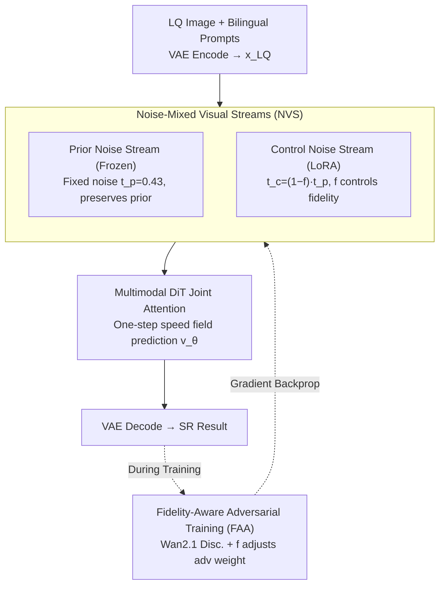

# One-Step Diffusion Transformer for Controllable Real-World Image Super-Resolution

**Conference**: CVPR 2026  
**Paper**: [CVF Open Access](https://openaccess.thecvf.com/content/CVPR2026/html/Fang_One-Step_Diffusion_Transformer_for_Controllable_Real-World_Image_Super-Resolution_CVPR_2026_paper.html)  
**Code**: https://github.com/RedMediaTech/ODTSR  
**Area**: Image Restoration / Diffusion Models  
**Keywords**: Real-World Image Super-Resolution, One-Step Diffusion, Diffusion Transformer, Controllable Generation, Adversarial Training

## TL;DR
Based on Qwen-Image, the One-Step Diffusion Transformer (ODTSR) utilizes "Noise-Mixed Visual Streams" (NVS) to achieve simultaneous fidelity and prompt controllability, continuously adjustable via a fidelity weight $f$. Combined with "Fidelity-Aware Adversarial Training" (FAA) to compress multi-step denoising into single-step inference, it achieves SOTA performance in both general Real-ISR and Chinese/English scene text SR.

## Background & Motivation
**Background**: Diffusion models have significantly advanced the perceptual quality of Real-World Image Super-Resolution (Real-ISR). Mainstream approaches follow two paths: multi-step diffusion methods achieve strong controllability through iterative denoising, while one-step methods trade efficiency for performance via distillation or fine-tuning of pre-trained models.

**Limitations of Prior Work**: It is difficult to balance fidelity and controllability. Multi-step methods suffer from high stochasticity and often deviate from the low-quality (LQ) input, leading to **low fidelity** and slow inference. One-step methods undergo heavy task-specific fine-tuning for fidelity, which causes them to **lose the original prompt controllability** of pre-trained models, failing in diverse scenarios.

**Key Challenge**: Real-ISR is a classic ill-posed problem under complex degradation and semantic ambiguity. High-resolution results are non-unique, essentially **requiring controllability for disambiguation**. However, existing one-step methods solidify "fidelity" into weights, sacrificing this necessary controllability.

**Key Insight**: The authors conducted pilot experiments on Qwen-Image (Sec. 3): denoising the same image with different noise intensities revealed that **noise levels directly determine the fidelity-controllability trade-off**. High-noise inputs yield strong prompt controllability and quality but low fidelity; low-noise inputs yield high fidelity but fail to achieve SR effects. Crucially, prompt controllability can still restore damaged Chinese characters even under low noise. Importantly, this capability is **available out-of-the-box** in pre-trained models without further training.

**Core Idea**: Since a single visual stream can only satisfy one objective at a time, the authors **decouple it into two streams**: one stream with fixed noise to preserve the pre-trained prior (fidelity), and another with adjustable noise controlled by a user weight $f$ (controllability). Both are joint-attended in a Multimodal DiT, followed by adversarial training to compress multi-step denoising into a single step.

## Method

### Overall Architecture
ODTSR uses Qwen-Image (Dual-stream MMDiT with visual and text streams) as the backbone, formulating SR as one-step denoising. The input LQ image $I_{LQ}$ is encoded into the latent space $x_{LQ}$ via VAE. The original single visual stream is expanded into two: the **Prior Noise stream** receives fixed noise $t_p$ and is frozen to maintain the pre-trained diffusion prior; the **Control Noise stream** adjusts noise dynamically based on the user-controlled fidelity weight $f \in [0, 1]$ and is fine-tuned using LoRA to handle adaptive high-frequency detail restoration. Both visual streams, along with the text stream, are processed via joint attention in the MMDiT to predict the speed field in a **single step**, pushing the latent variable toward the high-quality target. During training, a discriminator initialized from Wan2.1 is introduced for **Fidelity-Aware Adversarial Training (FAA)**, which dynamically adjusts adversarial signal strength based on $f$ to enforce one-step inference capability.

### Key Designs

**1. Noise-Mixed Visual Streams (NVS): Decoupling Fidelity and Controllability**

Observation shows that tuning noise on a single visual stream is a deadlock. NVS splits the visual stream into two. The Prior Noise stream injects fixed noise $x_{t_p}=(1-t_p)x_{LQ}+t_p\epsilon$ (with $t_p$ empirically set to 0.43) and is **frozen** to maximize the preservation of pre-trained priors. The Control Noise stream adjusts noise dynamically: $x_{t_c}=(1-t_c)x_{LQ}+t_c\epsilon, t_c=(1-f)\cdot t_p$. When $f=1$, $t_c=0$ (highest fidelity); when $f=0$, $t_c=t_p$ (strongest controllability/generation). Parameters are initialized from the Prior Noise stream and fine-tuned with LoRA. The speed field is predicted in **one step**: $x_{pred}=x_{t_p}+(0-t_p)v_\theta(x_{t_p},x_{t_c},t_p,c)$. Ablations show NVS outperforms the 1-Visual variant in fidelity, quality, and prompt following by assigning prior preservation and controllability adjustment to different streams.

**2. Fidelity-Aware Adversarial Training (FAA): One-Step Compression and Adaptive Weights**

Compressing multi-step denoising into one step is challenging. Inspired by Diffusion APT, since the input is a noisy LQ latent rather than pure noise, the authors **skip the discrete-time consistency distillation stage** and perform single-stage adversarial training on the Real-ISR task. The generator loss combines RGB reconstruction $L_{rec}=L_{MSE}+\lambda_1 L_{LPIPS}$ and latent adversarial loss. To avoid mode collapse, a **Relativistic GAN loss** is used instead of the non-saturating GAN loss: $L_{adv}^{G}=-\mathbb{E}_{x_r}[\log(1-R(x_r,x_f))]-\mathbb{E}_{x_f}[\log R(x_f,x_r)]$, where $R(x_r,x_f)=\sigma(D(x_r,t,c)-D(x_f,t,c))$. Crucially, adversarial weights are coupled with fidelity: $L_G=L_{rec}+(f\lambda_{min}+(1-f)\lambda_{max})L_{adv}^G$. Smaller $f$ values (harder reconstruction) trigger larger adversarial weights to synthesize realistic details based on prompts, while larger $f$ values favor reconstruction fidelity. The discriminator uses Wan2.1, outputting **patch-wise** scores with an R1-like regularization $L_{reg}$.

### Loss & Training
Generator objective: $L_G = L_{rec} + (f\lambda_{min} + (1-f)\lambda_{max})L_{adv}^G$, where $L_{rec} = L_{MSE} + \lambda_1 L_{LPIPS}$.  
Discriminator objective: $L_D = L_{adv}^D + \lambda_2 L_{reg}$, with $L_{reg} = \|D(x_r,t,c) - D(N(x_r,\sigma I),t,c)\|_2^2$.  
Training details: $f$ sampled uniformly from $[0, 1]$, $t_p=0.43$, $\lambda_1=1.0, \lambda_{min}=0.02, \lambda_{max}=0.1, \lambda_2=5.0$. Generator: Qwen-Image; Discriminator: Wan2.1-T2V-1.3B. Trained on 8×H20 for 10,000 steps with batch size 32. Data: LSDIR + FFHQ, LQ synthesis via Real-ESRGAN pipeline.

## Key Experimental Results

> Metrics: **LPIPS/DISTS** (↓); **FID** (↓); **MUSIQ/MANIQA** (↑); **PSNR/SSIM** (↑, pixel-level fidelity); **CLIP-T** (↑, prompt following); **NED** (↑, Normalized Edit Distance for text: $\mathrm{NED}=1-\mathrm{ED}(P,G)/\max(|P|,|G|)$).

### Main Results

General Real-ISR (Selected LPIPS/DISTS/FID, ↓ is better; Steps):

| Dataset | Method | Steps | LPIPS↓ | DISTS↓ | FID↓ |
|------|------|------|------|------|------|
| RealSR | TSD-SR | 1 | 0.2743 | 0.2104 | 114.45 |
| RealSR | TVT | 1 | 0.2597 | 0.2061 | 109.90 |
| RealSR | DiT4SR (40 steps) | 40 | 0.3215 | 0.2251 | 118.55 |
| RealSR | **ODTSR (f=1, No Prompt)** | 1 | **0.2398** | **0.1894** | **101.49** |
| DRealSR | TVT | 1 | 0.2899 | 0.2205 | 134.28 |
| DRealSR | **ODTSR (f=1, No Prompt)** | 1 | **0.2592** | **0.1926** | **119.86** |

Controllable Real-ISR: On RealCE-val, ODTSR **without training on scene text datasets** achieved a NED of 0.8475 with prompts (up from 0.7609 without), outperforming SUPIR (0.6877) and DiT4SR (0.6794), while achieving the best FID (68.05).

### Ablation Study

Effectiveness of NVS (RealSR, 1-Visual is the single-stream variant):

| Structure | LPIPS↓ | MANIQA↑ | FID↓ | CLIP-T↑ |
|------|------|------|------|------|
| 1-Visual (f=1, No Prompt) | 0.2655 | 0.6387 | 118.08 | 32.01 |
| **NVS (f=1, No Prompt)** | **0.2398** | **0.6622** | **101.49** | **32.37** |
| **NVS (f=1, w/ Prompt)** | **0.2310** | **0.6622** | **101.49** | **34.01** |

Effectiveness of FAA (RealSR, w/ Prompt; vs. Fixed GAN Weights):

| Strategy | CLIP-T (f=1→0.2) | MANIQA (f=1→0.2) | Description |
|------|------|------|------|
| **FAA** | 34.01 → 34.56 ↑ | 0.668 → 0.682 ↑ | Controllability/Quality rise as $f$ drops |
| Fixed 0.02 | 34.01 → 33.09 ↓ | 0.646 → 0.673 | Prompt following drops unexpectedly |

### Key Findings
- **NVS dominates in high-fidelity states**: At $f=1$, NVS outperforms the single-stream variant across LPIPS, MANIQA, FID, and CLIP-T, proving that stream splitting successfully decouples prior preservation from controllability.
- **FAA is critical for monotonic adjustment**: Fixed GAN weights fail to improve prompt following when $f$ decreases, whereas FAA encodes the adaptive response into the model.
- **Zero-shot generalization to scene text**: ODTSR restores legible Chinese and English text without specific training, confirming that freezing the Prior Noise stream effectively retains Qwen-Image's text rendering priors.
- **User Study**: In a 20-volunteer vote, ODTSR received 53.25%, exceeding the sum of TSD-SR, DiT4SR, and PiSA-SR.

## Highlights & Insights
- **Turning the fidelity-controllability trade-off into a continuous knob $f$**: One scalar allows users to slide between fidelity and prompt control, with a single model covering the entire trade-off curve.
- **Dual-Stream = Frozen Prior + LoRA Control**: Combining a frozen backbone for priors with a lightweight LoRA for control provides a transferable framework for other controllable generation tasks.
- **Fidelity-aware weight coupling**: Adjusting adversarial strength based on input difficulty (determined by $f$) is key to training controllability into the model rather than relying purely on inference-time noise adjustment.
- **First 20B+ parameter one-step Real-ISR model supporting bilingual prompts**, showing significant engineering value and zero-shot scene text capabilities.

## Limitations & Future Work
- The 20B+ backbone and Wan2.1 discriminator result in high training costs (8×H20). While inference is one-step, the computational/memory overhead per step remains a deployment hurdle.
- Key hyperparameters like $t_p=0.43$ are determined empirically; sensitivity analysis of Prior Noise levels is relegated to the supplementary materials.
- PSNR/SSIM metrics are not superior (e.g., SSIM 0.6108 on DIV2K-Val), which may be a concern for applications strictly requiring pixel-wise fidelity.
- Reliance on automated prompt extraction (Qwen2.5-VL) means final results are sensitive to prompt quality and OCR errors.

## Related Work & Insights
- **vs. One-Step Methods (PiSA-SR / TSD-SR / TVT)**: These methods lose prompt controllability due to heavy fine-tuning; ODTSR regains it through NVS and $f$.
- **vs. Multi-Step Methods (SUPIR / DiT4SR)**: Unlike multi-step models that suffer from stochasticity and slow inference, ODTSR achieves fidelity, quality, and prompt following in a single step.
- **vs. APT (Adversarial Post-Training)**: ODTSR skips consistency distillation by using noisy latent inputs directly and replaces scalar discrimination with patch-wise relativistic GAN losses to mitigate mode collapse.

## Rating
- **Novelty**: ⭐⭐⭐⭐⭐ NVS and FAA turn the one-step fidelity-controllability trade-off into a continuous, self-consistent adjustment.
- **Experimental Thoroughness**: ⭐⭐⭐⭐ Solid results across general and scene text ISR, though quantitative inference overhead comparison is missing.
- **Writing Quality**: ⭐⭐⭐⭐ Clear motivation and logical flow in Section 3; however, the complex loss terms require careful reading.
- **Value**: ⭐⭐⭐⭐⭐ Strong practical impact as the first 20B+ bilingual one-step Real-ISR model.

<!-- RELATED:START -->

<!-- RELATED:END -->

## Related Papers

- [\[CVPR 2026\] Bridging Fidelity-Reality with Controllable One-Step Diffusion for Image Super-Resolution](bridging_fidelity-reality_with_controllable_one-step_diffusion_for_image_super-r.md)
- [\[CVPR 2026\] IFCSR: Inference-Free Fidelity-Realism Control for One-Step Diffusion-based Real-World Image Super-Resolution](ifcsr_inference-free_fidelity-realism_control_for_one-step_diffusion-based_real-.md)
- [\[CVPR 2026\] Time-Aware One Step Diffusion Network for Real-World Image Super-Resolution](time-aware_one_step_diffusion_network_for_real-world_image_super-resolution.md)
- [\[CVPR 2026\] DreamSR: Towards Ultra-High-Resolution Image Super-Resolution via a Receptive-Field Enhanced Diffusion Transformer](dreamsr_towards_ultra-high-resolution_image_super-resolution_via_a_receptive-fie.md)
- [\[CVPR 2026\] SAT: Selective Aggregation Transformer for Image Super-Resolution](sat_selective_aggregation_transformer_for_image_super_resolution.md)

<!-- RELATED:END -->
