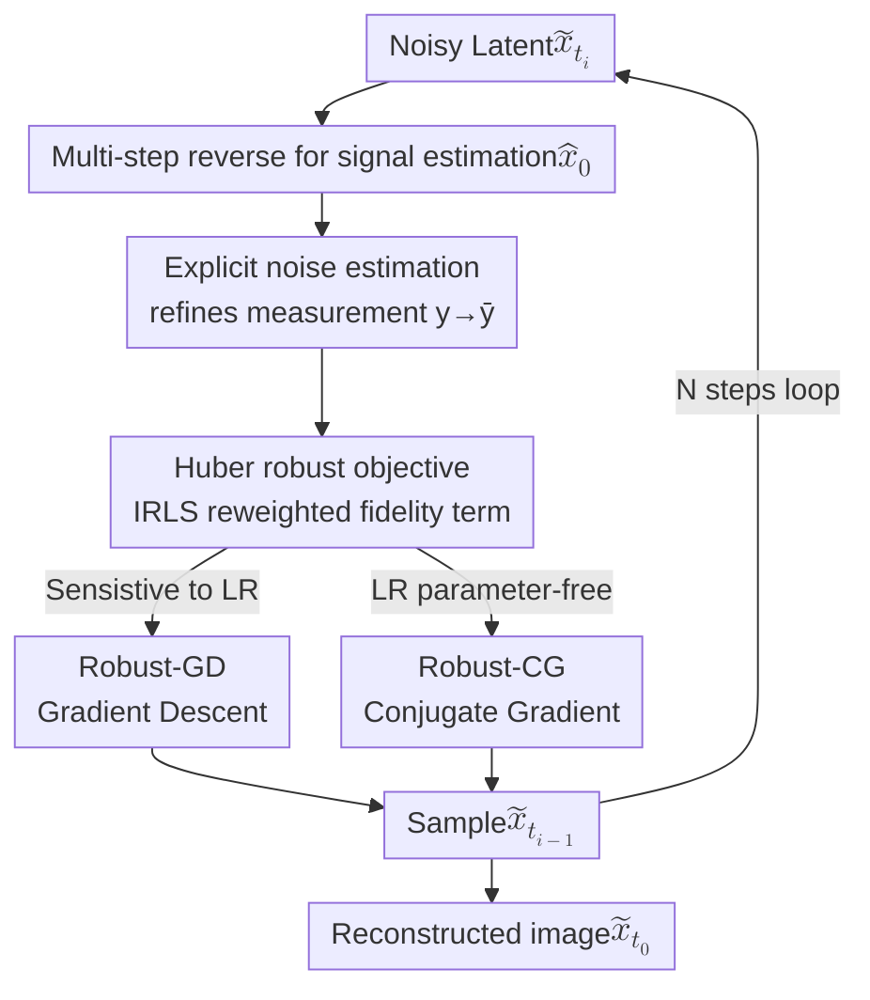

# Outlier-Robust Diffusion Solvers for Inverse Problems

**Conference**: CVPR 2026  
**arXiv**: [2605.09477](https://arxiv.org/abs/2605.09477)  
**Code**: None  
**Area**: Image Restoration / Diffusion Models / Inverse Problems  
**Keywords**: Diffusion Inverse Problems, Outlier-robust, Huber Loss, Conjugate Gradient, Noise Estimation

## TL;DR
Aiming at outliers commonly found in real-world measurements, this paper introduces two safeguards to inverse problem solvers based on pre-trained diffusion models—first refining measurements with explicit noise estimation, then replacing the squared $\ell_2$ data fidelity term with Iteratively Reweighted Least Squares using Huber loss, solved via gradient descent (Robust-GD) and conjugate gradient (Robust-CG) respectively. It proves significantly more stable than recent methods like DPS and DAPS under outlier contamination for linear and non-linear tasks such as super-resolution, inpainting, and deblurring.

## Background & Motivation
**Background**: Using pre-trained diffusion models (DM) to solve inverse problems (IP) is a popular research direction. Inverse problems aim to recover the original signal $\bm{x}_0^*$ from degraded and noisy observations $\bm{y}=\mathcal{A}(\bm{x}_0^*)+\bm{\nu}$, covering tasks like super-resolution, inpainting, and deblurring. Compared to specialized models requiring supervised training on paired data, methods such as DPS, DiffPIR, DAPS, and RED-diff are popular because they leverage the generative prior of pre-trained DMs without task-specific retraining.

**Limitations of Prior Work**: These methods almost exclusively consider Gaussian noise in observations but ignore **outliers**. In practical measurements, besides Gaussian noise, there is often outlier contamination caused by sensor failures or transient interference—following the "arbitrary contamination model" adopted in the paper, a proportion $\rho$ of the observation components is replaced by an arbitrary outlier vector $\bm{\xi}$: $y_i=\xi_i$ when $i$ falls within an unknown contamination set $\mathcal{C}$, otherwise $y_i=(\mathcal{A}(\bm{x}_0^*))_i+\nu_i$.

**Key Challenge**: Data fidelity terms in existing DM solvers are generally in the squared $\ell_2$ form $\|\bm{y}-\mathcal{A}(\bar{\bm{x}}_0)\|_2^2$. Squared penalties are extremely sensitive to large residuals; the massive residuals contributed by outliers dominate the optimization and bias the reconstruction. In other words, the problem lies not in the prior, but in the "strong guidance using contaminated measurements" itself.

**Goal**: To make solvers robust to outliers without retraining the DM, while still handling normal Gaussian noise, applicable to both linear and non-linear forward operators.

**Key Insight**: Tools for handling outliers have long existed in robust statistics. The authors compare three categories—trimmed loss (discarding high-loss points), median-of-means (taking the median of block means), and Huber loss (quadratic penalty for small residuals and only linear penalty for large residuals). The first two categories **discard** information from suspected outliers, whereas Huber loss utilizes all measurements with differentiated penalties, making it more suitable as a fidelity term.

**Core Idea**: Replace the original squared $\ell_2$ fidelity term with a two-step process: "refining measurements via explicit noise estimation" + "Iteratively Reweighted Least Squares with Huber loss," providing both GD and CG solvers.

## Method

### Overall Architecture
The method is embedded in the reverse sampling loop of a standard DM. Each timestep $t_i$ involves a cycle of "estimation → refinement → robust solving → sampling." Specifically: first, a signal estimation $\hat{\bm{x}}_0$ is obtained from the current noisy latent $\tilde{\bm{x}}_{t_i}$ using a multi-step reverse process (identical to DAPS); then, the original measurement $\bm{y}$ is refined into $\bar{\bm{y}}$ using **explicit noise estimation** to weaken additive noise; next, a robust objective function with **Huber loss** as the fidelity term is constructed to handle outliers and solved approximately to obtain $\bar{\bm{x}}_0$; the solver has two versions—**Robust-GD** via gradient descent and **Robust-CG** via conjugate gradient; finally, $\tilde{\bm{x}}_{t_{i-1}}$ is sampled from $\mathcal{N}(\alpha_{t_{i-1}}\bar{\bm{x}}_0,\sigma_{t_{i-1}}^2\bm{I}_n)$, repeating for $N$ steps to output $\tilde{\bm{x}}_{t_0}$ as the reconstruction result. The three contributing components (refinement via noise estimation, Huber robust objective, GD/CG solver) are linked sequentially within the inner loop of the sampling process.

### Key Designs

**1. Measurement Refinement via Explicit Noise Estimation: De-noise before guidance**

Solving inverse problems usually involves optimizing $\min_{\bar{\bm{x}}_0}\frac{1}{2r_t^2}\|\bar{\bm{x}}_0-\hat{\bm{x}}_0\|_2^2+\lambda\|\bm{y}-\mathcal{A}(\bar{\bm{x}}_0)\|_2^2$, but when measurements are heavily contaminated, the huge deviation between noisy $\bm{y}$ and noiseless $\mathcal{A}(\bm{x}_0^*)$ ruins reconstruction. Unlike [4], which trains an additional model to generate pseudo-conditions, this paper **explicitly estimates additive noise** $\bar{\bm{\nu}}$ to refine the measurement. Assuming additive noise follows $\mathcal{N}(\bm{0},\sigma^2\bm{I}_m)$, the noise term is included as an additional variable in the objective:

$$\min_{\bar{\bm{x}}_0,\bar{\bm{\nu}}}\frac{1}{2r_t^2}\|\bar{\bm{x}}_0-\hat{\bm{x}}_0\|_2^2+\frac{1}{2\sigma^2}\|\bar{\bm{\nu}}\|_2^2+\frac{1}{2\gamma_t^2}\|\bm{y}-\mathcal{A}(\bar{\bm{x}}_0)-\bar{\bm{\nu}}\|_2^2.$$

Fixing $\bar{\bm{x}}_0=\hat{\bm{x}}_0$ yields a closed-form solution for $\bar{\bm{\nu}}$, $\tilde{\bm{\nu}}=\frac{\sigma^2}{\gamma_t^2+\sigma^2}(\bm{y}-\mathcal{A}(\hat{\bm{x}}_0))$. Substituting this back gives the refined measurement $\bar{\bm{y}}=\frac{1}{\gamma_t^2+\sigma^2}(\gamma_t^2\bm{y}+\sigma^2\mathcal{A}(\hat{\bm{x}}_0))$—a convex combination of the original measurement and the current reconstruction prediction. The time-varying weight is set as $\gamma_t=1/\sigma_t$: in early timesteps, $\hat{\bm{x}}_0$ is robust to latent perturbations, allowing a smaller $\gamma_t$ (stronger measurement guidance, noise tolerance); in later stages, $\hat{\bm{x}}_0$ becomes sensitive, requiring a larger $\gamma_t$ to keep $\bar{\bm{x}}_0$ close to $\hat{\bm{x}}_0$ and preserve reconstruction naturalness. $1/\sigma_t$ happens to satisfy "low early, high late."

**2. IRLS with Huber Loss: Retain all information while suppressing outliers**

Refinement only weakens Gaussian noise; outliers persist. The authors replace the squared $\ell_2$ residual in the fidelity term with the sum of element-wise Huber losses. The Huber operator $\mathcal{H}_\delta(r)$ takes $r^2$ (quadratic penalty) when $|r|\le\delta$ and $2\delta|r|-\delta^2$ (linear penalty) when $|r|>\delta$—acting like least squares for small residuals and growing only linearly for large residuals (outliers), thereby limiting the loss contribution of outliers without discarding data like trimmed loss / MOM.

To solve this via Iteratively Reweighted Least Squares (IRLS), the Huber term is rewritten into an equivalent quadratic form $\tilde{\mathcal{H}}_\delta(\bm{r})=\|\mathcal{W}_\delta(\bm{r})\bm{r}\|_2^2$, where the diagonal weighting operator is:

$$\mathcal{W}_\delta(\bm{r})_{ii}=\begin{cases}1,&|r_i|\le\delta,\\ \sqrt{\delta/|r_i|},&|r_i|>\delta.\end{cases}$$

Components with larger residuals receive smaller weights ($\sqrt{\delta/|r_i|}<1$), effectively downweighting outliers. Key trick: although the weight $\bm{W}_\delta$ is calculated from the current $\bar{\bm{x}}_0$, it is **detached from gradient computation**, ensuring the gradient of the quadratic form with respect to $\bar{\bm{x}}_0$ is strictly equal to the original Huber term, enjoying the convenience of IRLS without introducing bias. The final objective is:

$$\min_{\bar{\bm{x}}_0}\frac{1}{2}\Big(\frac{1}{r_t^2}\|\bar{\bm{x}}_0-\hat{\bm{x}}_0\|_2^2+\frac{1}{\gamma_t^2}\|\bm{W}_\delta(\bar{\bm{y}}-\mathcal{A}(\bar{\bm{x}}_0))\|_2^2\Big).$$

Robust-GD performs $J$ steps of gradient descent (learning rate $\eta_x$) on this objective, initialized from $\tilde{\bm{x}}_0$ and recalculating $\bm{W}_\delta$ at each step.

**3. CG Solver + Closed-form Step Size: Fully removing learning rate dependency**

A pain point of Robust-GD is its sensitivity to the learning rate $\eta_x$, requiring fine-tuning. The authors switch to the Conjugate Gradient (CG) method and derive a closed-form solution for the step size $\alpha_j$, eliminating parameter tuning. In the $j$-th step, given gradient $\bm{g}_j$ and direction $\bm{d}_j$, the step size is a line search problem; when the forward operator is linear ($\mathcal{A}(\bm{x})=\bm{A}\bm{x}$), the objective is quadratic, allowing the optimal step size to be calculated directly:

$$\alpha_j=\frac{\bm{g}_j^\mathrm{T}\bm{g}_j}{\frac{1}{r_t^2}\bm{d}_j^\mathrm{T}\bm{d}_j+\frac{1}{\gamma_t^2}(\bm{W}_\delta^{(j)}\bm{A}\bm{d}_j)^\mathrm{T}(\bm{W}_\delta^{(j)}\bm{A}\bm{d}_j)}.$$

The numerator uses the $\bm{g}_j^\mathrm{T}\bm{g}_j$ form common in non-linear CG (empirically superior to the standard $\bm{g}_j^\mathrm{T}\bm{d}_j$). For non-linear IPs, $\mathcal{A}(\bar{\bm{x}}_0^{(j)}+\alpha\bm{d}_j)$ is approximated with a first-order Taylor expansion at the current point. Since explicitly calculating the Jacobian is too expensive, the Jacobian-vector product is approximated via finite difference $\bm{J}\bm{d}_j\approx(\mathcal{A}(\bar{\bm{x}}_0^{(j)}+\eta\bm{d}_j)-\mathcal{A}(\bar{\bm{x}}_0^{(j)}))/\eta$. Substituting this yields a step size identical in form to the linear case (replacing $\bm{W}_\delta \bm{A} \bm{d}_j$ with $\bm{\omega}_j$). The search direction uses the Fletcher-Reeves formula $\bm{d}_{j+1}=\bm{g}_{j+1}+\frac{\bm{g}_{j+1}^\mathrm{T}\bm{g}_{j+1}}{\bm{g}_j^\mathrm{T}\bm{g}_j}\bm{d}_j$ to ensure conjugacy. Thus, Robust-CG requires no learning rate.

### Loss & Training
Ours **requires no training**, directly reusing pre-trained DMs. "Loss" refers to the optimization objective for the inner-layer solver at each timestep (Eq. 17). Key hyperparameters: Huber threshold $\delta$ (0.01~0.02 for most tasks), finite difference parameter $\eta$ ($10^{-3}\sim10^{-4}$), noise-related time-varying weight $\gamma_t=1/\sigma_t$, inner iteration steps $J$, and sampling steps $N$. Outlier vectors are set to $\xi_i=-1$ in experiments (matching the measurement boundary $\bm{y}\in[-1,1]$).

## Key Experimental Results

Datasets: CelebA, FFHQ, ImageNet (all 256×256, 100 random validation images each, FFHQ results in appendix). All main tasks performed under Gaussian noise $\sigma=0.05$ with contamination ratio $\rho=0.02$ or $0.10$. Metrics: PSNR, SSIM (distortion) + LPIPS, FID (perception). Baselines: DPS, DiffPIR, DCPS, RED-diff, DAPS.

### Main Results

Linear tasks (4× SR, inpainting random 70%), CelebA, selected PSNR↑ / LPIPS↓ / FID↓:

| Task / Contamination | Metric | DPS | DAPS | Robust-GD | Robust-CG |
|------|------|------|------|------|------|
| SR ρ=0.02 | PSNR | 23.99 | 22.51 | 29.41 | **29.67** |
| SR ρ=0.02 | LPIPS | 0.184 | 0.403 | 0.145 | **0.125** |
| Inpainting ρ=0.02 | PSNR | 26.68 | 25.57 | 30.47 | **31.20** |
| Inpainting ρ=0.02 | FID | 63.49 | 195.00 | 62.62 | **51.42** |
| SR ρ=0.10 | PSNR | 20.95 | 16.63 | 26.52 | **28.96** |
| Inpainting ρ=0.10 | LPIPS | 0.185 | 0.596 | 0.374 | **0.093** |

Deblurring (Gaussian/Motion), CelebA, selected PSNR↑:

| Task / Contamination | DPS | DAPS | RED-diff | Robust-GD | Robust-CG |
|------|------|------|------|------|------|
| Gauss Blur ρ=0.02 | 25.14 | 23.73 | 27.99 | **30.00** | 29.48 |
| Motion Blur ρ=0.02 | 23.44 | 23.74 | 24.80 | **29.87** | 29.27 |
| Gauss Blur ρ=0.10 | 22.06 | 16.18 | 22.96 | **29.27** | 29.38 |

Non-linear deblurring (learned blurring operator), selected PSNR↑:

| Task / Contamination | DPS | RED-diff | DAPS | Robust-GD | Robust-CG |
|------|------|------|------|------|------|
| CelebA ρ=0.02 | 23.42 | 22.49 | 20.90 | **28.25** | 26.89 |
| CelebA ρ=0.10 | 21.26 | 16.37 | 15.89 | **27.06** | 26.80 |
| ImageNet ρ=0.10 | 19.19 | 14.95 | 15.21 | **24.55** | 23.67 |

It is evident that heavier contamination (ρ=0.10) causes baselines to fail severely (DAPS/RED-diff PSNR drops to 12~16), while Ours maintains stability at 24~29, further widening the gap.

### High Intensity Gaussian Noise (σ=0.5, ρ=0.02, CelebA)

| Task | Metric | DPS | DCPS | Robust-GD | Robust-CG |
|------|------|------|------|------|------|
| SR | PSNR | 20.55 | 18.77 | 22.16 | **23.04** |
| Inpainting | PSNR | 21.90 | 22.54 | 23.91 | **24.62** |

### Ablation Study

Huber threshold $\delta\in\{0.005,0.01,0.02,0.04\}$ (Robust-CG, CelebA, ρ=0.10, σ=0.05):

| δ | Gauss Blur PSNR | Motion Blur PSNR |
|------|------|------|
| 0.005 | 28.75 | 27.91 |
| 0.010 | 29.04 | 28.55 |
| 0.020 | 29.38 | **28.91** |
| 0.040 | **29.64** | 27.67 |

Finite difference parameter $\eta\in\{10^{-3},5\times10^{-4},10^{-4}\}$:

| η | Gauss Blur PSNR | Non-linear Blur PSNR |
|------|------|------|
| 0.0010 | 29.38 | 25.97 |
| 0.0005 | 29.38 | 26.37 |
| 0.0001 | 29.38 | **26.80** |

### Key Findings
- **Huber threshold δ is insensitive**: Within the range {0.005~0.04}, the PSNR fluctuation of Robust-CG is minimal (28.75~29.64 for Gauss blur), indicating that robustness does not depend on fine-tuning δ. δ=0.04 results in a slight drop for motion blur (27.67), as a larger value weakens the quadratic penalty on medium residuals.
- **Finite difference η has no impact on linear tasks and slight impact on non-linear ones**: PSNR is identical (29.38) across three η values for Gauss blur because the linear operator Jacobian is just $\bm{A}$, making the finite difference approximation exact; for non-linear tasks, smaller η is more accurate (25.97→26.80).
- **Advantages become more pronounced with heavier contamination**: When ρ increases from 0.02 to 0.10, baselines collapse significantly, while the drop for Ours is negligible. Outlier robustness is the core selling point.
- **GD vs. CG trade-offs**: Robust-CG is superior in most linear tasks and is parameter-free regarding learning rate; Robust-GD achieves higher PSNR in some deblurring and non-linear tasks, but at the cost of tuning $\eta_x$.

## Highlights & Insights
- **"Merging" Robust Statistics into Diffusion Inverse Problems**: The core innovation is not a new network but identifying that "squared $\ell_2$ fidelity terms in current DM solvers are naturally non-robust to outliers." Replacing it with Huber loss is a clean, plug-and-play idea that doesn't require retraining and can migrate to any DM-based IP solver.
- **Detached weights in IRLS is clever**: Rewriting Huber as a weighted quadratic form and detaching the weights $\bm{W}_\delta$ from the gradient graph ensures the gradient is strictly identical to the original Huber term—achieving both the solvability of IRLS and gradient accuracy.
- **CG + Closed-form step size for parameter-free operation**: Sensitivity to learning rate in GD is a major practicality issue; the authors avoid tuning by using CG with closed-form optimal step sizes (approximated via finite difference for non-linear cases), making it deployment-friendly.
- **Noise estimation as a convex combination**: The refined measurement $\bar{\bm{y}}$ uses time-varying weights $1/\sigma_t$ to smoothly transition between "trusting the measurement" and "trusting the current reconstruction" over timesteps, aligned with the intuition of "noise tolerance early, fidelity preservation late."

## Limitations & Future Work
- **Idealized Outlier Model**: Outliers in experiments are uniformly set to $\xi_i=-1$. Real-world outlier distributions could be more complex, and whether robustness holds as well remains to be fully verified.
- **No Unified Winner Between Methods**: Robust-GD and Robust-CG outperform each other in different tasks/contaminations; the paper lacks a clear criterion for "when to use which," requiring some trial and error (especially for GD's learning rate).
- **Task-Dependent Hyperparameters**: Although δ is insensitive, specific values for δ and η vary across tasks (e.g., δ=0.005~0.02 for SR), requiring empirical determination.
- **Computational Overhead**: Each timestep requires $J$ inner iterations, and CG's non-linear case needs an extra forward pass per step for finite difference calculation, making it heavier than pure DPS's single gradient guidance. Execution time comparisons are not provided.

## Related Work & Insights
- **vs DAPS**: Ours adopts DAPS’s multi-step reverse estimation $\hat{\bm{x}}_0$ and decoupled sampling, but DAPS still uses squared $\ell_2$ and only resists Gaussian noise; Ours adds noise estimation refinement + Huber robust objective, maintaining PSNR at 24~29 at ρ=0.10 where DAPS collapses to 14~18.
- **vs DiffPIR / DPS**: They use proximal updates and Tweedie formula + gradient posterior correction respectively, but both use squared $\ell_2$. Ours serves as an "orthogonal patch" to the DM-IP pipeline by modifying the fidelity term.
- **vs trimmed loss / median-of-means**: These robust methods discard suspected outliers, losing measurement information. Ours chooses Huber loss to differentiate penalties without discarding data, utilizing information more fully under high contamination.
- **Insight**: The "fidelity replacement" strategy may apply to any generative inverse problem solver (including flow matching, latent diffusion) using squared $\ell_2$ for data consistency, deserving consideration as a standard option for enhancing robustness.

## Rating
- Novelty: ⭐⭐⭐⭐ Not a brand new framework, but systematically integrating Huber statistics + IRLS + CG step size into diffusion IPs is solid and addresses the overlooked outlier issue.
- Experimental Thoroughness: ⭐⭐⭐⭐ Covers 3 datasets, multiple linear/non-linear tasks, two contamination levels, high-noise conditions + δ/η ablation; however, lacks runtime and real outlier distribution validation.
- Writing Quality: ⭐⭐⭐⭐ Clear derivations, complete pseudocode for both algorithms, and logical flow; some critical comparisons (GD vs CG use cases) are in the appendix.
- Value: ⭐⭐⭐⭐ Plug-and-play, no retraining needed, very practical for real-world measurements with outliers; serves as a standard robustness patch for DM-IP solvers.

<!-- RELATED:START -->

## Related Papers

- [\[CVPR 2026\] Dual Ascent Diffusion for Inverse Problems](dual_ascent_diffusion_for_inverse_problems.md)
- [\[CVPR 2026\] GSNR: Graph Smooth Null-Space Representation for Inverse Problems](gsnr_graph_smooth_null_space_representation_for_inverse_problems.md)
- [\[ICML 2026\] Measurement-Consistent Langevin Corrector for Stabilizing Latent Diffusion Inverse Problem Solvers](../../ICML2026/image_restoration/measurement-consistent_langevin_corrector_for_stabilizing_latent_diffusion_inver.md)
- [\[ICLR 2026\] Noise-Adaptive Diffusion Sampling for Inverse Problems Without Task-Specific Tuning](../../ICLR2026/image_restoration/noise-adaptive_diffusion_sampling_for_inverse_problems_without_task-specific_tun.md)
- [\[CVPR 2026\] PnP-CM: Consistency Models as Plug-and-Play Priors for Inverse Problems](pnp-cm_consistency_models_as_plug-and-play_priors_for_inverse_problems.md)

<!-- RELATED:END -->
