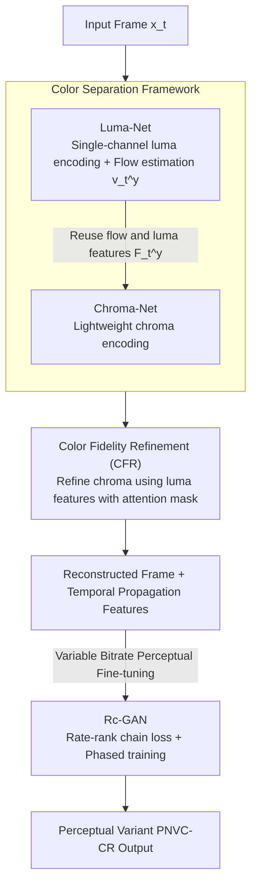

# Perceptual Neural Video Compression with Color Separation and Rank Chain

**Conference**: CVPR 2026  
**Paper**: [CVF Open Access](https://openaccess.thecvf.com/content/CVPR2026/html/Liang_Perceptual_Neural_Video_Compression_with_Color_Separation_and_Rank_Chain_CVPR_2026_paper.html)  
**Code**: https://github.com/lxz-nan/PNVC-CR  
**Area**: Neural Video Compression / Image & Video Restoration  
**Keywords**: Neural Video Compression, Perceptual Quality, Luma-Chroma Separation, Rank Chain Loss, Variable Bitrate  

## TL;DR
To address the issues of existing neural video compression focusing solely on PSNR, neglecting the human eye's perceptual differences between luma and chroma, and inconsistent perceptual quality under variable bitrates, this paper proposes PNVC-CR. This framework combines a "luma-chroma separated dual-codec framework (PNVC-C)" with "rate-rank chain adversarial optimization (Rc-GAN)," achieving BD-rate savings of 77.71% / 53.94% / 54.44% / 42.27% on perceptual metrics like LPIPS / DISTS / KID / FID relative to VTM, while maintaining objective fidelity.

## Background & Motivation
**Background**: Neural Video Compression (NVC) has recently achieved SOTA performance with conditional coding schemes represented by the DCVC series (DCVC-DC / DCVC-FM / DCVC-RT). However, most still utilize objective distortion metrics like PSNR as the optimization target.

**Limitations of Prior Work**: Optimization aimed at pixel-level fidelity sacrifices perceptual plausibility—the reconstructed results have high PSNR but appear unnatural. Existing works introduce GANs and perceptual losses to improve visual realism, but two major drawbacks remain: (1) Optimization is performed in a unified color space (RGB or upsampled YUV444), ignoring the **asymmetric sensitivity** of the human visual system to luma and chroma. (2) Consistency optimization for variable bitrate models is overlooked, leading to unstable perceptual quality across different bitrates.

**Key Challenge**: On one hand, human luma and chroma perception are processed by different photoreceptor cells with asymmetric sensitivity (traditional coding exploits this via YUV420 chroma subsampling), yet NVC models both in a unified color space. On the other hand, adversarial scoring is inherently unstable and struggles to reliably perceive bitrate changes, making it difficult for variable bitrate models to align optimization with the human quality ranking of "higher bitrate means better quality." Consequently, most perceptual NVC methods must train a separate model for each bitrate.

**Goal**: (1) Design a color-separated NVC framework aligned with the asymmetric perception of the human eye. (2) Ensure a single variable bitrate model maintains a consistent, monotonic perceptual quality ranking across different bitrates.

**Key Insight**: Separate "luma details" and "chroma" into two specialized networks, allocating more computational/bitrate budget to the luma component to which the eye is more sensitive. Incorporate the monotonic relationship of "bitrate $\leftrightarrow$ perceptual quality" explicitly into the adversarial training via ranking constraints.

**Core Idea**: Replace unified color space modeling with a "luma-chroma separated dual-codec" and use "rate-rank chain loss" to constrain the quality ranking of variable bitrates within the discriminator, providing fine-grained perceptual feedback to the encoder.

## Method

### Overall Architecture
PNVC-C decomposes a frame $x_t$ into a luma component $x_t^y$ and a chroma component $x_t^{uv}$, which are processed by two specialized networks. Luma-Net handles high-fidelity luma encoding and estimates optical flow $\hat v_t^y$ and luma propagation features $\hat F_t^y$. Chroma-Net reuses the optical flow and luma features for lightweight chroma encoding and employs Color Fidelity Refinement (CFR) at the decoder to enhance chroma textures using luma features. This PNVC-C-Base, obtained through objective pre-training, is then perceptually fine-tuned using Rc-GAN to produce the perceptual variant PNVC-CR. The pipeline follows a serial process: "separation → dual-network encoding (with CFR) → perceptual adversarial fine-tuning":

### Key Designs

**1. Color Separation Framework: Aligning Asymmetric Sensitivity with Dual Specialized Networks**

To address the issue of unified color space modeling ignoring asymmetric perception, PNVC-C decouples luma and chroma into two independent codec networks. Luma-Net is based on DCVC-DC but modifies input/output from three channels to a single channel for luma and utilizes a Luma-SpyNet for luma flow estimation. It also replaces original ResBlocks with lightweight Partial Convolution ResBlocks to reduce complexity. Chroma-Net is a redesigned lightweight network: it **reuses** the reconstructed flow $\hat v_t^y$ from Luma-Net, eliminating its own flow estimation and compression modules. The downsampled $\hat v_t^y$ is fed into chroma Temporal Context Mining (TCM) for motion compensation, extracting multi-scale features as conditions for chroma encoding. This design is effective because luma carries the structural information most sensitive to the human eye, justifying higher reconstruction quality and compute budget, while chroma can be cheaply encoded using luma motion/structural cues. Empirically, Chroma-Net accounts for only 15.53% of total complexity and 4.52% of the average bitrate.

**2. Color Fidelity Refinement (CFR): Injecting Luma Details into Chroma Reconstruction**

Since the chroma component is heavily compressed, it often loses structure and texture. CFR introduces attention-based refinement at the decoder: it fuses luma propagation features $\hat F_t^y$ with intermediate chroma features $\ddot F_t^{uv}$ from the context decoder to generate a modulation mask $m_t$ (acting as an attention map representing structural confidence). This mask is applied to $\ddot F_t^{uv}$ to obtain the refined chroma propagation feature $\hat F_t^{uv}$. This is effective because the luma network has already learned high-fidelity structural/textural cues; the chroma network can simply leverage these cues. CFR is extremely lightweight (adding only ~0.1M parameters and negligible MACs) but yields additional BD-rate savings of 6.0% / 6.6% in YUV PSNR / LPIPS during objective pre-training.

**3. Rc-GAN Rate-Rank Chain Optimization: Encoding Quality Monotonicity as a Training Constraint**

To solve the inconsistency of perceptual quality under variable bitrates, Rc-GAN enables the discriminator to learn perceptual quality rankings across bitrates. Given a variable bitrate codec $g_u(X,r)$, where bitrate index $r\in\{0,\dots,n_{\text{rate}}-1\}$ corresponds to increasing bitrates (with the original sample denoted as $\hat X_{n_{\text{rate}}}$), the discriminator score $f(\cdot)$ should satisfy the **chain ranking constraint** $f(\hat X_{n_{\text{rate}}}) > f(\hat X_{n_{\text{rate}}-1}) > \cdots > f(\hat X_0)$. Directly maximizing the difference between the ends of the chain results in coarse binary classification (original vs. lowest bitrate), losing intermediate rankings. The authors decompose the global chain into **local pairwise constraints** $f(\hat X_{i+1}) > f(\hat X_i)$ and propose **phased training**: each iteration is divided into $n_{\text{rate}}$ sub-phases, constraining pairs from the highest to the lowest bitrate. The discriminator loss is $\mathcal L_D^r = -f(\hat X_{r+1}) + f(\hat X_r)$; the generator's ranking loss is applied only when the current ranking is correct—$\mathcal L_G^r = \mathbb I[f(\hat X_{r+1}) > f(\hat X_r)]\cdot f(\hat X_r)$. This gated gradient approach, inspired by ReWaGAN's Ref-vs-SR pairwise ranking, prevents misleading updates when rankings are unstable, providing more precise perceptual feedback across bitrates and suppressing artifact accumulation in long sequences.

### Loss & Training
Two-stage training: First, objective pre-training with MSE yields PNVC-C-Base (training units of $m=8$ frames, $n_{\text{rate}}=4$ rate points, base $\lambda$ of 85/170/380/840, frame weights $w_t=(0.5,1.2,0.5,0.9)$). Second, perceptual fine-tuning using Rc-GAN yields PNVC-CR. Discriminator and codec are optimized alternately; total generator loss includes $\alpha\!\cdot\!L_{L2} + \beta\!\cdot\!L_{lps} + \gamma\!\cdot\!L_G$ ($\alpha=1/2,\ \beta=1/320,\ \gamma=1/640$), with discriminator gradient clipping $c=0.001$.

## Key Experimental Results

> Note: **BD-Rate (Bjøntegaard Delta rate)** measures the change in bitrate relative to an anchor at equivalent quality. **Larger negative values are better** (more bitrate saved); the anchor is VTM-13.2 (H.266/VVC), tested with 96 frames, IP=−1.

### Main Results
| Metric | Method | Avg. BD-Rate(%) vs VTM |
|------|------|------|
| LPIPS↓ | DCVC-FM | +2.56 |
| LPIPS↓ | DCVC-RT | +7.71 |
| LPIPS↓ | **PNVC-CR** | **−77.71** |
| DISTS↓ | DCVC-RT | +56.20 |
| DISTS↓ | **PNVC-CR** | **−53.94** |
| KID↓ | DCVC-FM | +52.63 |
| KID↓ | **PNVC-CR** | **−54.44** |
| FID↓ | DCVC-FM | +46.84 |
| FID↓ | **PNVC-CR** | **−42.27** |
| YUV PSNR↑ | DCVC-FM | −21.69 |
| YUV PSNR↑ | **PNVC-C-Base** | **−25.26** |
| YUV PSNR↑ | **PNVC-CR** | −15.91 |

Key Highlights: PNVC-CR leads across all four perceptual metrics (where most other codecs show positive BD-rates, performing worse than VTM), while retaining a 15.91% YUV PSNR bitrate saving—6.7% better than the baseline DCVC-DC. The objective-oriented PNVC-C-Base achieves SOTA in YUV PSNR / SSIM / VMAF (e.g., YUV PSNR −25.26%, YUV SSIM −22.34%, VMAF −19.34%). Compared to the diffusion-based DiffVC, PNVC-CR achieves 32.18 dB RGB PSNR at 0.014 bpp, whereas DiffVC reaches 29.68 dB only at 0.191 bpp, with a 480p inference time of 125 ms (vs. ~4.0 s for DiffVC).

### Ablation Study
| Configuration (Color Separation, BD-Rate%, Anchor $M_a$=reproduced DCVC-DC) | YUV PSNR | LPIPS | Description |
|------|------|------|------|
| $M_a$ | 0 | 0 | Reproduced DCVC-DC baseline |
| $M_b$ + Color Separation | −7.2 | −9.1 | Independent luma/chroma encoding |
| $M_c$ + CFR | −13.2 | −15.7 | Reusing luma features for chroma refinement (+0.1M params) |
| $M_d$ + Longseq Training | −21.4 | — | Enhanced temporal consistency, no extra inference cost |
| $M_e$ + Partial Conv | −20.7 | −24.3 | Sacrifices 0.7% PSNR for 1583.6→1412.6 kMacs/pixel |

| Configuration (Perceptual Loss, BD-Rate%, Anchor $M_e$=PNVC-C-Base) | YUV PSNR | LPIPS | Description |
|------|------|------|------|
| $M_e$ | 0 | 0 | Objective pre-trained backbone |
| $M_f$ + LPIPS | +14.7 | −51.2 | Perceptual gain but PSNR degradation and obvious artifacts |
| $M_g$ + WGAN | +11.5 | −60.1 | Alleviates early artifacts, but long-sequence artifacts return |
| $M_h$ + Rc-GAN | +8.3 | −77.5 | Best perceptual/objective balance, suppresses artifact accumulation |

### Key Findings
- Color separation + CFR is the primary source of objective fidelity: $M_a \to M_c$ gains 13.2% YUV PSNR BD-rate solely through separation and lightweight feature reuse, with CFR being nearly cost-free.
- Rc-GAN significantly outperforms "plain LPIPS" and "LPIPS+WGAN" in perceptual optimization: while plain LPIPS reduces LPIPS by 51.2%, it increases PSNR BD-rate by 14.7% and produces severe artifacts; Rc-GAN further compresses LPIPS to −77.5% while containing PSNR degradation to +8.3%, thanks to more precise cross-rate ranking feedback.
- Resource allocation validates the "luma-heavy" strategy: Chroma-Net accounts for only 15.53% complexity and 4.52% average bitrate, with chroma bitrate ratios across four points ranging only from 3.19% to 6.07%.

## Highlights & Insights
- The classic perceptual prior of "prioritizing luma and downsampling chroma" from traditional codecs is effectively mapped into end-to-end neural codec architecture (dual specialized networks + luma-guided chroma).
- The "gated gradient" trick in Rc-GAN is a reusable adversarial training technique: when a constraint is difficult to satisfy stably, it is better to use an indicator function gate to apply gradients only when the constraint is met, preventing misleading updates.
- Decomposing global chain ranking into adjacent pairwise phased training prevents the adversarial target from collapsing into coarse binary classification.

## Limitations & Future Work
- Complexity increase: PNVC-CR total MACs are 2951G with 34.07M parameters, 5.99% higher than DCVC-DC (though the authors argue the gains justify it).
- Comparisons with DiffVC are metric-by-metric across non-overlapping bitrate intervals rather than BD-rate. Training in YUV420 but evaluating RGB PSNR introduces domain shift errors.
- Robustness to ultra-low bitrates or extreme motion scenarios is not extensively detailed.

## Related Work & Insights
- **vs. DCVC Series (DCVC-DC/FM/RT)**: These focus on objective fidelity in unified color spaces. This work applies luma-chroma separation + perceptual optimization to their conditional coding framework, significantly leading in perceptual metrics while remaining competitive objectively.
- **vs. Existing Perceptual NVC**: Most perform adversarial training in unified color spaces without exploiting the inherent ranking properties of variable bitrate models. This work uses rate-rank chains to explicitly constrain the "bitrate $\leftrightarrow$ quality" monotonicity.
- **vs. ReWaGAN**: Borrows the Ref-vs-SR pairwise ranking and "correct ranking only" gradient update, extending it from a single pair to a multi-bitrate chain of local pairwise constraints.
- **vs. DiffVC (Diffusion-based)**: Diffusion synthesis offers high quality but slow inference (~4.0s/frame). This paper provides a non-diffusion alternative at 125ms/frame with a better balance of quality, fidelity, and efficiency at low bitrates.

## Rating
- Novelty: ⭐⭐⭐⭐ Maps traditional perceptual priors and variable bitrate ranking onto neural NVC; combination is novel despite individual components having precedents.
- Experimental Thoroughness: ⭐⭐⭐⭐ Multiple benchmarks + objective/perceptual metrics + ablation groups + complexity analysis; slightly lacks data on ultra-low bitrate/extreme motion robustness.
- Writing Quality: ⭐⭐⭐⭐ Clear motivation, complete formulas, though some abbreviations and captions are dense.
- Value: ⭐⭐⭐⭐ Consistent perceptual optimization for single-model variable bitrate is directly valuable for practical video coding. Code is open-source.

<!-- RELATED:START -->

## Related Papers

- [\[CVPR 2026\] Real-Time Neural Video Compression with Unified Intra and Inter Coding](real-time_neural_video_compression_with_unified_intra_and_inter_coding.md)
- [\[CVPR 2026\] VLIC: Vision-Language Models As Perceptual Judges for Human-Aligned Image Compression](vlic_vision-language_models_as_perceptual_judges_for_human-aligned_image_compres.md)
- [\[CVPR 2026\] ReflexSplit: Single Image Reflection Separation via Layer Fusion-Separation](reflexsplit_single_image_reflection_separation_via_layer_fusion-separation.md)
- [\[CVPR 2026\] Low-Rank Residual Diffusion Models](low-rank_residual_diffusion_models.md)
- [\[CVPR 2026\] Reflection Separation from a Single Image via Joint Latent Diffusion](reflection_separation_from_a_single_image_via_joint_latent_diffusion.md)

<!-- RELATED:END -->
