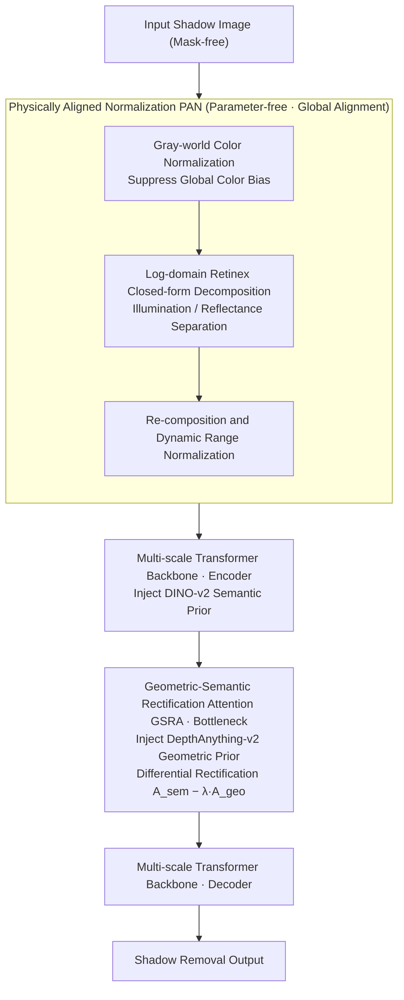

# PhaSR: Generalized Image Shadow Removal with Physically Aligned Priors

**Conference**: CVPR 2026  
**arXiv**: [2601.17470](https://arxiv.org/abs/2601.17470)  
**Code**: [https://github.com/ming053l/PhaSR](https://github.com/ming053l/PhaSR)  
**Area**: Image Restoration  
**Keywords**: Shadow Removal, Retinex Decomposition, Differential Attention, Geometric-Semantic Prior Alignment, Ambient Light Normalization

## TL;DR
The PhaSR framework is proposed to achieve generalized shadow removal—ranging from single-source direct shadows to multi-source ambient light scenes—through dual-level physical prior alignment. This includes global-level PAN, which performs parameter-free Retinex decomposition to suppress color bias, and local-level GSRA, which utilizes differential attention to align DepthAnything geometric priors with DINO-v2 semantic embeddings. PhaSR achieves SOTA performance on WSRD+ and Ambient6K with the lowest FLOPs.

## Background & Motivation

**Background**: Shadow removal is a fundamental computer vision task. The core challenge lies in accurately distinguishing shadows from the intrinsic dark regions of objects and performing physically plausible color correction. Learning-based methods have evolved from CNNs to Transformers and Diffusion models, yet most are evaluated only on single-source direct shadow benchmarks.

**Limitations of Prior Work**: (1) Relying solely on RGB cues often leads to confusion between shadows and intrinsic material properties, causing color distortion at texture boundaries; (2) Existing methods perform well on single-source benchmarks but lack generalization to multi-source indoor ambient light scenes (characterized by color shifts and indirect illumination); (3) Traditional encoder-decoder frameworks fail to effectively propagate physical priors, as uniform fusion ignores spatially varying degradation features, resulting in edge blurring.

**Key Challenge**: Prior misalignment. Geometric features (local shading variations, normal directions) are sensitive to illumination geometry but noisy, while semantic features (object categories, materials) are stable across illumination but spatially coarse. Without proper alignment, geometric noise can disrupt semantic consistency, or semantic over-smoothing can erase illumination boundaries—particularly under indirect lighting.

**Goal**: (1) Suppression of global color bias; (2) Resolution of cross-modal conflicts between geometric and semantic priors; (3) Generalization from single-source to multi-source scenarios.

**Key Insight**: A unified approach to "alignment"—global-level alignment (using PAN for illumination-reflectance decomposition) and local-level alignment (using GSRA with differential attention to coordinate geometry and semantics).

**Core Idea**: Through dual-level physical prior alignment (global parameter-free Retinex normalization + local differential attention cross-modal correction), the shadow removal system can generalize from single-source to complex multi-source scenes.

## Method

### Overall Architecture
PhaSR decomposes "generalized shadow removal" into two levels of physical alignment, concatenated in two stages. Stage 1 is PAN, a **completely parameter-free** preprocessing module: the input image first undergoes Gray-world color normalization to suppress global color shifts, followed by a closed-form Retinex decomposition in the log-domain to separate illumination and reflectance, and finally, re-normalization to output an illumination-consistent image. Stage 2 involves a multi-scale Transformer encoder-decoder that processes this clean image. During this stage, two types of frozen external priors are injected at different depths: DINO-v2 semantic embeddings during the encoder stage and DepthAnything-v2 depth/normal geometric priors at the bottleneck. These priors are then aligned and fused by the GSRA module at the bottleneck using differential attention. The entire pipeline does not rely on shadow masks; global color bias is managed by PAN, while local cross-modal conflicts are handled by GSRA, corresponding to the "global alignment + local alignment" design.

### Key Designs

**1. Physically Aligned Normalization (PAN): Eliminating global color bias at the input via closed-form Retinex**

Methods that directly feed RGB images into a network often confuse shadows with intrinsic dark colors of materials, and indirect lighting can cause overall color shifts. PAN requires no learnable parameters and addresses input degradation through three closed-form steps: First, Gray-world color normalization $\mathbf{I}_{\text{norm}} = \mathbf{I} \cdot \frac{\mathbb{E}[\mathbf{I}]}{\mathbb{E}_c[\mathbf{I}]+\varepsilon}$ flattens illumination across channels to remove color bias. Second, Retinex decomposition is performed in the log-domain using additive separability, where the illumination component is the spatial mean $\log\hat{\mathbf{S}} = \mathbb{E}_{H,W}[\log(\mathbf{I}_{\text{norm}}+\varepsilon)]$ and reflectance is the residual $\log\hat{\mathbf{R}} = \log(\mathbf{I}_{\text{norm}}+\varepsilon) - \log\hat{\mathbf{S}}$; the log-domain ensures a closed-form solution without iterative optimization. Finally, the image is re-composed and its dynamic range is normalized: $\hat{\mathbf{I}} = \frac{\hat{\mathbf{R}} \otimes \hat{\mathbf{S}} - \min}{\max - \min + \varepsilon}$. Unlike learnable Retinex methods, PAN is zero-parameter and zero-training, serving as a plug-and-play module. Experiments show that adding it to OmniSR/DenseSR yields a gain of 0.15–0.34dB, suggesting that the bottleneck for many methods lies in untreated input color bias.

**2. Geometric-Semantic Rectification Attention (GSRA): Leveraging stable semantics and sensitive geometry via cross-modal subtraction**

Geometric priors (depth/normals) are accurate at shadow edges but noisy in uniform areas, while semantic priors are stable across lighting but spatially coarse. Uniform fusion would let geometric noise contaminate semantics or let semantic over-smoothing erase illumination boundaries. GSRA performs multi-modal prior injection: using a shared query feature, it adds geometric and semantic priors (each with a learnable scale factor $\alpha$) to generate modality-specific key-value pairs. Then, two attention maps $\mathbf{A}_{\text{geo}}$ and $\mathbf{A}_{\text{sem}}$ are calculated from the shared query, followed by a differential rectification:

$$\mathbf{A}_{\text{rect}} = \mathbf{A}_{\text{sem}} - \lambda \cdot \mathbf{A}_{\text{geo}}$$

By treating semantics as a "globally stable base" and geometry as a "locally illumination-sensitive perturbation" to be subtracted, the learnable $\lambda$ regulates the balance between sensitivity to illumination changes and geometric regularization strength. Finally, the two outputs are concatenated: $\mathbf{F}_{\text{output}} = \text{Concat}(\mathbf{A}_{\text{rect}}\mathbf{V}_{\text{geo}}, \mathbf{A}_{\text{rect}}\mathbf{V}_{\text{sem}})$. This subtractive structure acts as a physically interpretable gate: geometric precision is preserved at real illumination boundaries, while geometric noise is suppressed in uniform regions. Unlike the original DiffTransformer which performs subtraction within a single self-attention head, GSRA's subtraction is **cross-modal**—resolving conflicts between two heterogeneous priors.

**3. Multi-scale Transformer Backbone: Injecting priors at appropriate depths based on abstraction levels**

Mask-free shadow removal requires a backbone capable of incorporating physical priors at different stages. The backbone is a hierarchical encoder-decoder with a base channel dimension of $C=32$ and 2 layers per Transformer block. The key is the placement of injections: semantic priors are stable and suitable for guiding high-level understanding in the abstract encoder stage, so frozen DINO-v2 embeddings are injected there. Geometric priors are fine-grained with high information density, making them suitable for the highly compressed bottleneck; thus, DepthAnything-v2 depth/normals are injected at the bottleneck and aligned by GSRA. Assigning each prior to its most suitable abstraction level allows the backbone to propagate physical priors stably without uniform blurring.

### Loss & Training
The total loss is $\mathcal{L}_{\text{total}} = 0.95\mathcal{L}_{\text{Charb}} + 0.05\mathcal{L}_{\text{SSIM}}$, using Charbonnier loss for pixel fidelity and a small amount of SSIM loss to constrain structural consistency. The model uses the AdamW optimizer with a batch size of 9, trained for 1400 epochs with a learning rate of $2\times10^{-4}$ and cosine annealing.

## Key Experimental Results

### Main Results

| Dataset | Metric | PhaSR | Prev. SOTA | Gain |
|--------|------|------|----------|------|
| ISTD | PSNR/SSIM | 30.73/0.960 | 30.64(DenseSR) | +0.09 |
| ISTD+ | PSNR/SSIM | 34.48/0.960 | 35.19(StableSD) | -0.71 |
| INS | PSNR/SSIM | 30.38/0.961 | 30.64(DenseSR) | -0.26 |
| WSRD+ | PSNR/SSIM | **28.44/0.842** | 26.28(DenseSR) | **+2.16** |
| Ambient6K | PSNR/SSIM | **23.32/0.834** | 22.54(DenseSR) | **+0.78** |

Note: The largest gains are observed on the most challenging WSRD+ and Ambient6K (multi-source ambient light) datasets, validating generalization capability.

### Ablation Study (PAN as a Plugin)

| Framework + PAN | ISTD(PSNR) | WSRD+(PSNR) | Ambient6K(PSNR) |
|------|---------|------|------|
| OmniSR | 30.45→30.60 | 26.07→26.22 | 23.01→23.15 |
| DenseSR | 30.64→30.98 | 26.28→26.47 | 22.54→22.73 |
| PhaSR(Ours) | 30.73 | 28.44 | 23.32 |

### Complexity Comparison

| Method | FLOPs(G) | Params(M) |
|------|----------|-----------|
| OmniSR | 118.67 | 21.02 |
| DenseSR | 109.32 | 24.70 |
| PhaSR | **55.63** | **18.95** |

### Key Findings
- **PhaSR leads significantly on ambient light scenes (Ambient6K)**—outperforming the specialized ambient normalization method IFBlend (21.44dB) by 1.88dB, demonstrating the critical role of physically aligned priors in multi-source scenarios.
- **PAN as a plug-and-play module** consistently improves the performance of various frameworks, with error reductions of up to 26.4% on the ISTD dataset.
- **PhaSR is the most computationally efficient**—FLOPs are only 55.63G, approximately 47% of OmniSR and 51% of DenseSR, while maintaining the smallest parameter count (18.95M).
- While PhaSR underperforms compared to StableShadowDiffusion on ISTD+, the latter is a diffusion-based method with much higher computational costs.
- Compared to traditional color correction methods (ACE, White-balance, etc.), PAN superiorly outperforms them across all metrics.

## Highlights & Insights
- **The plug-and-play nature of PAN** is the primary highlight—a parameter-free closed-form preprocessing module can consistently enhance various shadow removal methods by 0.15-0.34dB, indicating that color bias at the input stage is a common bottleneck. This module is transferable to any image restoration task.
- **Cross-modal differential attention in GSRA**: The operation $\mathbf{A}_{\text{sem}} - \lambda \cdot \mathbf{A}_{\text{geo}}$ offers strong physical interpretability—semantic attention provides a "globally stable base" while geometric attention represents "local illumination-sensitive perturbations." The subtraction corrects semantic over-smoothing while suppressing geometric noise. This cross-modal differential paradigm can be generalized to other tasks requiring the fusion of heterogeneous priors.
- **Generalization from single to multi-source light**: Achieving generalization through physical alignment rather than pure data-driven methods is a more elegant approach than simply expanding the training set.

## Limitations & Future Work
- PAN is based on the Gray-world assumption, which might introduce bias for images with highly non-uniform color distributions (e.g., large monochromatic backgrounds).
- Log-domain Retinex uses global means for illumination estimation, making it unable to handle complex lighting with high spatial variation (e.g., multi-directional spotlights).
- There is still room for improvement in fine texture recovery, as seen in the performance gap compared to diffusion models on ISTD+.
- The $\lambda$ in GSRA is a learnable global scalar; a spatially adaptive $\lambda(x,y)$ might perform better when dealing with local complex shadows.

## Related Work & Insights
- **vs OmniSR**: OmniSR also uses geometric-semantic priors but its fusion strategy fails to correctly align the intensities of complementary modalities; PhaSR explicitly corrects this through differential attention.
- **vs DenseSR**: DenseSR reformulates shadow removal as dense prediction using adaptive fusion, yet remains significantly below PhaSR on Ambient6K, suggesting that fusion without physical alignment is insufficient for multi-source scenes.
- **vs ReHiT**: ReHiT uses Retinex-guided dual-branch decomposition for mask-free shadow removal, but its performance drops in ambient light scenarios (only 19.98dB on Ambient6K), whereas PhaSR achieves better generalization via PAN and GSRA.

## Rating
- Novelty: ⭐⭐⭐⭐ The dual-level physical alignment (PAN+GSRA) design is systematic and physically intuitive.
- Experimental Thoroughness: ⭐⭐⭐⭐⭐ Covers five benchmarks including ambient light scenes, with comprehensive PAN plugin experiments, comparisons with traditional methods, and complexity analysis.
- Writing Quality: ⭐⭐⭐⭐ Physical motivations are clearly articulated with helpful diagrams.
- Value: ⭐⭐⭐⭐ PAN as a plug-and-play module has broad application value, and GSRA’s cross-modal alignment logic is highly generalizable.

<!-- RELATED:START -->

## Related Papers

- [\[CVPR 2025\] Detail-Preserving Latent Diffusion for Stable Shadow Removal](../../CVPR2025/image_restoration/detail-preserving_latent_diffusion_for_stable_shadow_removal.md)
- [\[CVPR 2026\] Physically-Grounded Turbulence Mitigation with Frame-Shared Degradation Parameters](physically-grounded_turbulence_mitigation_with_frame-shared_degradation_paramete.md)
- [\[CVPR 2026\] Disentangled Textual Priors for Diffusion-based Image Super-Resolution](disentangled_textual_priors_for_diffusion-based_image_super-resolution.md)
- [\[CVPR 2026\] Beyond Ground-Truth: Leveraging Image Quality Priors for Real-World Image Restoration](beyond_ground-truth_leveraging_image_quality_priors_for_real-world_image_restora.md)
- [\[CVPR 2025\] SoftShadow: Leveraging Soft Masks for Penumbra-Aware Shadow Removal](../../CVPR2025/image_restoration/softshadow_leveraging_soft_masks_for_penumbra-aware_shadow_removal.md)

<!-- RELATED:END -->
