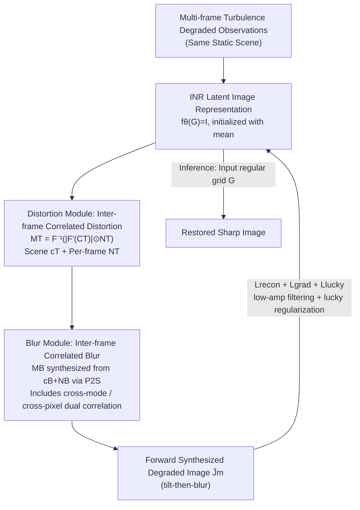

# Physically-Grounded Turbulence Mitigation with Frame-Shared Degradation Parameters

**Conference**: CVPR 2026  
**Paper**: [CVF Open Access](https://openaccess.thecvf.com/content/CVPR2026/html/Xie_Physically-Grounded_Turbulence_Mitigation_with_Frame-Shared_Degradation_Parameters_CVPR_2026_paper.html)  
**Code**: None  
**Area**: Image Restoration / Atmospheric Turbulence Mitigation  
**Keywords**: Atmospheric Turbulence Restoration, Unsupervised Optimization, Physical Degradation Model, Inter-frame Correlated Stochastic Process, Implicit Neural Representation

## TL;DR
TMFS is an unsupervised, optimization-based multi-frame atmospheric turbulence restoration method. It decomposes the distortion field and blur parameters of each frame in the physically-grounded "tilt-then-blur" degradation model into a **scene-shared correlation function + per-frame noise maps**. By leveraging the statistical correlation of turbulence across multiple frames of the same scene, it constrains the highly ill-posed per-frame estimation, achieving better generalization on real-world turbulence data than supervised methods trained on synthetic datasets.

## Background & Motivation

**Background**: In long-range outdoor imaging, random fluctuations in the atmospheric refractive index cause both **spatially varying geometric distortion (tilt) and blur**, which severely degrade downstream tasks such as recognition and tracking. Turbulence mitigation is divided into single-frame and multi-frame categories; this paper focuses on multi-frame mitigation, where multiple degraded frames of the same static scene provide complementary information. Mainstream deep learning methods are mostly supervised and perform well on synthetic benchmarks.

**Limitations of Prior Work**: Supervised methods rely on paired "degraded-clean" training data, whereas ground truth is almost impossible to obtain in real-world turbulence scenes. They are limited to training on synthetic degradation, but physical atmospheric imaging is highly complex, and synthetic degradations often fail to faithfully replicate real turbulence. This limits generalization in the real world and has driven the rise of unsupervised methods. These methods do not rely on synthetic supervision, but instead utilize a differentiable forward model and an optimization framework to minimize reconstruction error between the degraded observations and simulated degradations generated via optimization parameters.

**Key Challenge**: Unsupervised multi-frame restoration requires simultaneously estimating the latent clean image, the per-frame distortion field $\{M^T_m\}$, and the blur parameters $\{M^B_m\}$ **solely from the degraded frames**. Without clean image supervision, this problem is extremely ill-posed and highly prone to overfitting. Existing unsupervised methods (such as NDIR) estimate degradation parameters for each frame **independently**, **completely neglecting the correlation across frames within the same scene**, and are minimally constrained by turbulence physics.

**Goal**: (1) Explicitly model cross-frame dependencies to reduce the ill-posedness of per-frame estimation; (2) Guide the optimization process with physical constraints of turbulence imaging to converge toward physically plausible solutions.

**Key Insight**: The authors draw inspiration from **stochastic process-based turbulence simulation**. In turbulence simulation, the Zernike coefficients of each frame are modeled as samples from a scene-related stochastic process. Its autocorrelation is determined by physical quantities such as propagation distance and turbulence strength, which remain approximately stable and scene-shared over short observation periods. Since the degradation parameters are samples of the same stochastic process during "degradation generation", the estimated parameters should also share the same correlation structure during "degradation inference".

**Core Idea**: Decompose the per-frame distortion and blur parameters into a **scene-shared correlation function (autocorrelation structure) and a per-frame noise map**. These two elements are synthesized into the per-frame degradation parameters via power spectral density sampling of the stochastic process. Replacing per-frame independent parameters with scene-level shared parameters introduces cross-frame constraints and mitigates the ill-posedness.

## Method

### Overall Architecture
TMFS addresses the problem of restoring a single sharp image from multiple distorted and blurred images captured over a short duration of the same static scene. It adopts the tilt-then-blur degradation model $J_m = B\big(I(G + M^T_m), \, M^B_m\big)$ (Eq. 1): where $G$ is the regular grid, $M^T_m$ is the displacement field induced by tilt (mapping grid points to distorted coordinates), $I(G+M^T_m)$ is the distorted image, and $B(\cdot, M^B_m)$ applies spatially varying blur. The latent sharp image $I$ is represented by an **implicit neural representation (INR)** (a 4-layer MLP with positional encoding) as $f_\theta(G)=I(G)$.

The entire pipeline is a **per-scene optimization** process: the optimizable variables include the INR parameters $\theta$, the scene parameters for distortion $c_T$ and per-frame noise $\{N^T_m\}$, and the scene parameters for blur $c_B$ and per-frame noise $\{N^B_m\}$. The forward pass uses these parameters to simulate the degraded image for each frame $\hat J_m$, while the backward pass minimizes the discrepancy between $\hat J_m$ and the observation $J_m$ (along with physical regularization). During inference, the regular grid $G$ is fed into the network (without distortion or blur), and the INR directly outputs the restored image. The core mechanism is centered on "how to generate $M^T$ and $M^B$ from scene parameters and per-frame noise" (Fig. 2 in the paper).

### Key Designs

**1. Inter-frame Correlated Distortion Modeling: Decomposing Tilt into "Scene-Shared Correlation Function + Per-Frame Noise"**

To address the pain point of highly ill-posed independent per-frame distortion estimation, TMFS treats the distortion field $M^T_m$ of each frame as a sample from the same **scene-specific stochastic process**, using power spectral density (PSD) sampling:

$$M^T = \mathcal{F}^{-1}\big(|\mathcal{F}'(C_T)| \odot N^T\big)[:W, :H]$$ (Eq. 9)

where $C_T$ is a 2D anisotropic autocorrelation matrix describing the stochastic process (only outer-mode correlation is considered), $N^T$ is a per-frame optimizable noise matrix, and $\odot$ denotes element-wise multiplication. Since tilt has directions along two coordinate axes, the parameters appear in pairs. Due to the symmetry of the real Fourier transform, the dimensions of $C_T$ and $N^T$ are twice those of the image. Directly optimizing physical turbulence parameters is highly expensive, so TMFS follows [8] by using two 1D functions—the isotropic term $c_1$ and the anisotropic term $c_2$—to construct the 2D autocorrelation:

$$w(\theta) = 0.5\cos(2\theta) + 0.5$$
$$C_T(\rho,\theta)[0] = w(\theta)\odot c_1(\rho) + (1-w(\theta))\odot c_2(\rho)$$

where $\rho$ is the distance between two points, $\theta$ is the angle between the connecting line and the horizontal axis, and $w$ mixes the isotropic/anisotropic correlations (the mixing weight style differs from [8] to facilitate constraints). Crucially, **instead of optimizing $\{M^T_m\}_{m=1}^M$ for $M$ frames, it optimizes a scene-level parameter $c_T=\{c_1, c_2\}$ and per-frame variables $\{N^T_m\}$**. Since all frames share the same correlation structure $c_T$, cross-frame information is forcibly coupled, drastically reducing the degrees of freedom in per-frame estimation and mitigating ill-posedness. Monotonicity is strictly enforced by defining $c_1, c_2$ as the reverse cumulative sum of a non-negative learnable sequence.

**2. Inter-frame Correlated Blur Modeling: Cross-Mode + Cross-Pixel Dual Correlation + P2S Generation**

Blur is more complex than distortion: high-order Zernike coefficients (which determine the PSF) exhibit **two types of correlation**—inter-mode (between different order coefficients of the same pixel) and spatial (between same-order coefficients across different pixels). For spatial correlation, TMFS uses a PSD sampling pipeline similar to distortion, where $C_B$ represents a set of autocorrelation functions corresponding to each high-order Zernike coefficient ($c_B$ contains $L-2$ pairs of arrays, $L=21$). For inter-mode correlation, the fixed covariance matrix $\Sigma_B$ defined in [8] is decomposed as $\Sigma_B = RR^T$ and multiplied by the noise:

$$M^B[u] = R \times \big(\mathcal{F}^{-1}(|\mathcal{F}'(C_B)| \odot N^B)[:W, :H]\big)[u]$$ (Eq. 13)

Since directly converting high-order Zernike coefficients into PSFs per-pixel and performing space-varying convolution is extremely expensive, TMFS adopts **Phase-to-Space (P2S)**: it uses a pre-computed PSF basis + a shallow network to map high-order coefficients to basis coefficients, and the blurred image is obtained via linear combination after convolution. Additionally, a **delta function basis** is incorporated to better approximate PSFs close to delta functions (where P2S is less accurate). Similarly, the blur module only optimizes the scene-level $c_B$ and per-frame $\{N^B_m\}$, rather than the per-frame $\{M^B_m\}$ directly.

**3. Physically-Driven Regularization: Low-Amplitude Filtering, Lucky Region, and Gradient Sharpening**

Reconstruction loss alone is insufficient to constrain this highly ill-posed problem. TMFS introduces three types of physically-motivated regularizations to prevent the degradation parameters from entering trivial solutions. **Low-amplitude filtering**: Without restricting the representation capacity of the simulated distortion, the tilt matrix tends to fit the image content, essentially "imprinting" the shape of the observed images onto $M^T$ (Fig. 4). To prevent this, a threshold $\alpha_p$ is used to generate a mask $\tau$ to filter out low-amplitude frequency components of the PSD: $\mathcal{F}'(C_T) = \mathcal{F}(C_T)\odot\tau(\mathcal{F}(C_T))$ (Eqs. 17-18), limiting the degrees of freedom of tilt to avoid local minima. **Lucky region regularization**: Leveraging the lucky effect—where each pixel is expected to be sharp in at least one frame—the maximum of the central PSF values across all frames $K[u]=\max_m k_{u,m}([0,0])$ (where a larger central value indicates less blur) is used as a constraint. When $K[u]<\alpha_l$ ($\alpha_l=0.8$), a penalty of $1-K[u]$ is applied to encourage each pixel to belong to a lucky region in at least one frame (Eqs. 19-20). To prevent trivial convergence where all lucky regions collapse into a single frame while other frames have over-smoothed PSFs, the weight of the reconstruction loss for the frame with the largest error is increased during training. **Gradient loss**: Based on the lucky effect intuition that "the gradient of the sharp original image should be higher than that of the degraded observations", a penalty of $\text{ReLU}(\nabla J_m - \nabla \hat J_m)$ (Eq. 16, where edges are detected by Canny) is applied, with $\{M^B_m\}$ frozen during this optimization step to sharpen the restored image.

### Loss & Training
The total loss is a weighted sum of three terms:

$$L_{total} = \lambda_1 L_{recon} + \lambda_2 L_{grad} + \lambda_3 L_{lucky}$$ (Eq. 14)

The main reconstruction loss is the $L_1$ discrepancy $L_{recon} = \sum_{m=1}^M \|J_m - \hat J_m\|_1$ (Eq. 15). The optimizable parameters are $\theta$, $\{N^T_m\}$, $c_T$, $\{N^B_m\}$, and $c_B$. The INR parameters $\theta$ are initialized by fitting the mean of the observed frames. For high-resolution images (such as 1920×1080 RLR-AT), TMFS processes the images as **overlapping patches** independently and then stitches them. Since correlation decays over spatial distance (as shown in Fig. 6 where correlation approaches zero at large distances on RLR-AT), patch-based processing still captures the dominant correlation structures, and the supplementary material demonstrates no visible stitching artifacts. The entire method is **trained per-scene** without requiring any external paired data.

## Key Experimental Results

### Main Results
Synthetic data are generated at three levels (weak/medium/strong) using the turbulence simulator from [24], with clean images sourced from the UC Merced remote sensing dataset. Real-world data include OTIS (natural turbulence), Heat Chamber (controlled thermal chamber), and RLR-AT small (1920×1080 natural turbulence video). The default input consists of 20 frames of size 256×256 on a single RTX 4090. Comparisons are made against supervised methods (RVRT/TSR/TMT/DATUM, all trained on synthetic data) and unsupervised methods (CLEAR/CDSP/NDIR).

| Dataset | Metric | TMFS (Ours, Unsupervised) | Strongest Unsupervised Baseline | Strongest Supervised Method |
|--------|------|------|----------|------|
| Weak (D/r0=1) | SSIM↑ | **0.7505** | NDIR 0.5841 | TMT 0.7405 |
| Weak (D/r0=1) | PSNR↑ | **25.70** | NDIR 21.59 | TMT 24.21 |
| Middle (D/r0=2) | SSIM↑ | 0.5786 | NDIR 0.4235 | DATUM 0.5874 |
| Middle (D/r0=2) | PSNR↑ | **22.10** | NDIR 19.37 | TSR 21.77 |
| Strong (D/r0=3) | SSIM↑ | **0.4331** | NDIR 0.3608 | DATUM 0.4064 |
| Strong (D/r0=3) | PSNR↑ | 19.671 | NDIR 18.24 | TSR 20.35 |
| Heat (Real Thermal Chamber) | SSIM↑ | 0.7080 | NDIR 0.6847 | DATUM 0.7298 |

Under weak turbulence, TMFS achieves the overall best performance (ranking first in both SSIM and PSNR) and consistently outperforms other unsupervised methods across all levels. Under medium/strong turbulence, some supervised methods surpass TMFS in PSNR, but TMFS still achieves the highest SSIM in the strong turbulence setting. Although CLEAR secures high SSIM on some synthetic datasets, it suffers from over-sharpening, leading to lower PSNR. In visual comparisons on real-world data (Fig. 3 RLR-AT, Fig. 7 OTIS), supervised methods (RVRT/TSR) leave obvious residual distortions, and DATUM exhibits artifacts and over-sharpening, whereas TMFS removes distortions more cleanly. The authors attribute this to the stochastic process-based distortion modeling, rather than the simple INR grid parameterization used in NDIR.

### Ablation Study
Since CDSP and NDIR only provide code for their distortion modules and rely on L0-sparse for deblurring, the authors combine **TMFS's distortion module with L0-sparse (denoted as T+L0)**. This is compared against CDSP/NDIR under identical conditions to isolate the contribution of the distortion module:

| Configuration | Dataset | SSIM↑ | PSNR↑ |
|------|--------|-------|-------|
| T+L0 (Ours Distortion Module) | Middle | **0.4802** | **20.96** |
| NDIR | Middle | 0.4235 | 19.37 |
| CDSP | Middle | 0.4019 | 18.66 |
| T+L0 (Ours Distortion Module) | Heat | **0.7001** | **20.09** |
| NDIR | Heat | 0.6847 | 19.89 |
| CDSP | Heat | 0.6282 | 19.76 |

Under the same deblurring backend (L0-sparse), simply replacing the distortion module allows T+L0 to outperform CDSP and NDIR across both Middle and Heat datasets in terms of SSIM and PSNR. This demonstrates that **the distortion mitigation module itself** is superior to existing unsupervised distortion methods, indicating that the improvement does not solely rely on the deblurring backend. Qualitative ablations also support the design of low-amplitude filtering (Fig. 4) and lucky region regularization (Fig. 5).

### Key Findings
- **Scene-shared correlation vs. independent per-frame estimation** is the core source of performance gain: compressing the distortion/blur parameters into "scene-level $c$ + per-frame noise $N$" yields significantly better generalization on real-world turbulence than the independent per-frame estimation in NDIR.
- **Supervised methods perform well on synthetic data but poorly in the real world**: While supervised methods dominate synthetic benchmarks, they leave distinct distortions, artifacts, and over-sharpening on real-world RLR-AT/OTIS data, showing that their quantitative advantage does not translate to visual enhancement. This confirms that "synthetic degradations fail to faithfully replicate real-world turbulence".
- **Stronger turbulence remains a challenge**: The overall PSNR under strong turbulence is still relatively low, and the authors acknowledge that restoration quality remains limited under severe distortion.
- **Cross-domain transferability**: When directly applied to real-world underwater turbulence (water tank stirring) data (Fig. 8), TMFS successfully restores finer textures and sharper edges compared to Oreifej, NDIR, and NERT without requiring any underwater training data, illustrating that it captures the degradation characteristics shared across different turbulent media.

## Highlights & Insights
- **Reversing simulation priors for restoration optimization**: In turbulence simulation, Zernike coefficients are sampled from a stochastic process. The authors directly leverage this physical generation hypothesis as the parameterization structure for unsupervised restoration—estimating degradation by mimicking how it was generated, which is logically consistent and naturally physically-constrained.
- **The decomposition into scene-level $c$ + per-frame $N$ is a key trick to reduce ill-posedness**: Coupling all frames with a low-dimensional scene correlation function while retaining per-frame noise essentially enforces a cross-frame low-rank/shared-structure prior on degradation parameters. This concept can be transferred to any inverse problem involving "multi-observation shared degradation" (e.g., multi-frame deblurring, deraining/dehazing, underwater imaging).
- **Low-amplitude filtering prevents tilt from copying image content**: A highly practical observation—without constraint, the distortion field tends to fit the observed image structures (a typical over-fitting issue of degradation parameters). Limiting the degrees of freedom using a PSD low-amplitude mask is simple yet highly effective.
- **Quantifying lucky regions into loss**: Translating the classic "lucky imaging" intuition (that each pixel is sharp in at least one frame) into a differentiable regularization term, while addressing the degradation mode where all lucky regions collapse into a single frame.

## Limitations & Future Work
- The authors acknowledge two limitations: **the high computational overhead of per-scene optimization** (which prevents real-time generation) and **limited restoration quality under severe turbulence distortion** (as PSNR remains low under strong settings).
- High-resolution handling relies on patch partition, assuming "correlation decays over spatial distance". If the scene's correlation structure is larger than the patch size, long-range correlation might be lost, though the authors report no visible stitching artifacts.
- Heavy reliance on the tilt-then-blur physical model and the Zernike/P2S simulation assumptions: When real-world turbulence deviates from this model (e.g., strong anisotropy or dynamic scenes), the physical constraints might act as a bias.
- Only applicable to multi-frame static scenes; moving scenes or dynamic targets are not addressed, which is a natural direction for future extension.

## Related Work & Insights
- **vs NDIR [20]**: Both use unsupervised INR + differentiable forward models, but NDIR utilizes an INR-based grid parameterization to estimate distortion **independently per frame** and uses L0-sparse for deblurring. In contrast, TMFS parameterizes distortion and blur via **stochastic processes and inter-frame correlation**. The ablation (T+L0 vs NDIR) proves that TMFS's distortion module itself is stronger, achieving cleaner distortion removal on real-world data.
- **vs CDSP [29]**: CDSP relies on better reference frame selection and priors, addressing only geometric distortion. TMFS jointly estimates distortion, blur, and the latent image end-to-end with physical regularizations, comprehensively outperforming CDSP quantitatively.
- **vs Supervised Methods (TMT/DATUM/TSR/RVRT)**: Supervised methods are trained on synthetic data, showing strong benchmark numbers but poor real-work generalization (leaving distortions, artifacts, or over-sharpening). TMFS is unsupervised, independent of paired data, and generalizes better to real-world turbulence, at the cost of slower per-scene optimization.
- **vs Turbulence Simulation [8, 24]**: TMFS borrows the Zernike autocorrelation stochastic process modeling from [8] and the PSF basis acceleration of P2S [24]. However, instead of "forward degradation generation", TMFS reverses them as "optimizable parameterizations for unsupervised restoration", adjusting the mixing weight definitions to facilitate constraints like monotonicity.

## Rating
- Novelty: ⭐⭐⭐⭐ Reversing the stochastic process prior from turbulence simulation to serve as a frame-shared parameterization for unsupervised restoration is a novel and self-consistent approach.
- Experimental Thoroughness: ⭐⭐⭐⭐ Comprehensive evaluation covering three synthetic levels, three real-world datasets, underwater domain transfer, and isolated ablation of the distortion module; however, some ablations are limited (regularization terms are only analyzed qualitatively with figures).
- Writing Quality: ⭐⭐⭐ The physical derivations are clear, but some notations, formula formatting, and representations are slightly unrefined (e.g., inconsistent decimal precision in the SSIM table).
- Value: ⭐⭐⭐⭐ Demonstrating superior real-world turbulence generalization over supervised methods and possessing transferability to underwater scenarios, presenting high practical value for real-world long-range imaging restoration.

<!-- RELATED:START -->

## Related Papers

- [\[CVPR 2026\] PhaSR: Generalized Image Shadow Removal with Physically Aligned Priors](phasr_generalized_image_shadow_removal_with_physically_aligned_priors.md)
- [\[CVPR 2026\] Degradation-Robust Fusion: An Efficient Degradation-Aware Diffusion Framework for Multimodal Image Fusion in Arbitrary Degradation Scenarios](degradation-robust_fusion_an_efficient_degradation-aware_diffusion_framework_for.md)
- [\[NeurIPS 2025\] Implicit Augmentation from Distributional Symmetry in Turbulence Super-Resolution](../../NeurIPS2025/image_restoration/implicit_augmentation_from_distributional_symmetry_in_turbulence_super-resolutio.md)
- [\[ICML 2026\] From 2D Grids to 1D Tokens: Reforming Shared Representations for Multimodal Image Fusion](../../ICML2026/image_restoration/from_2d_grids_to_1d_tokens_reforming_shared_representations_for_multimodal_image.md)
- [\[ECCV 2024\] Exploiting Dual-Correlation for Multi-frame Time-of-Flight Denoising](../../ECCV2024/image_restoration/exploiting_dual-correlation_for_multi-frame_time-of-flight_denoising.md)

<!-- RELATED:END -->
