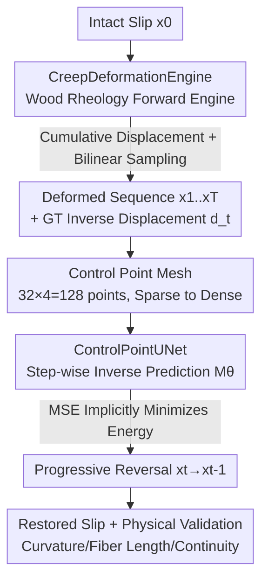

# Physics-Guided Multistep Deformation Reversal for Ancient Bamboo Slip Restoration

**Conference**: CVPR 2026  
**Paper**: [CVF Open Access](https://openaccess.thecvf.com/content/CVPR2026/html/Tang_Physics-Guided_Multistep_Deformation_Reversal_for_Ancient_Bamboo_Slip_Restoration_CVPR_2026_paper.html)  
**Code**: https://github.com/VillanelleQQ/PGDR-BambooSlips  
**Area**: Image Restoration / 3D Vision / Digital Archaeology  
**Keywords**: Bamboo slip restoration, physics-guided, deformation reversal, control point displacement field, wood rheology

## TL;DR
To address the complex non-linear deformations of excavated ancient bamboo slips caused by dehydration stress, this paper utilizes wood rheology to establish a computable "forward physical deformation engine" for generating unpaired training data. It then trains a ControlPointUNet to progressively predict **reverse displacement fields**, "bending" the bamboo slips back to their original state step-by-step. The method significantly outperforms data-driven approaches such as CycleGAN, DewarpNet, and DDRM in terms of text fidelity (TRQ) and physical deformation consistency (DCI).

## Background & Motivation
**Background**: Bamboo slips are core carriers of ancient East Asian civilization (500 BC–300 AD). However, after excavation, they often undergo severe warping and deformation due to water loss and changes in the soil environment, which hinders character recognition and fragment reassembly. Restoration methods are split into two categories: traditional physical restoration (moisture control, mechanical flattening, chemical consolidation), which is precise but extremely time-consuming and risks irreversible damage; and computational methods (Thin Plate Spline TPS, mesh deformation), which assume overly simplistic deformation patterns.

**Limitations of Prior Work**: Real bamboo slip deformation involves multi-directional warping and non-uniform shrinkage, which TPS/mesh-based methods cannot handle, often introducing artifacts and losing character details while correcting geometry. Data-driven generative models (CycleGAN, Stable Diffusion, DDRM, etc.) suffer from two critical issues: ① Extremely scarce paired data of deformed/original states, making supervised training nearly impossible; ② Black-box denoising-style restoration lacks modeling of wood-specific physical laws, leading to "straightened" images that ignore physical plausibility and cause character distortion.

**Key Challenge**: The nature of the restoration task is the inversion of an **accumulated, time-varying, and non-linear** process governed by material physics (fiber microstructure, stress diffusion, moisture coupling, viscoelastic creep). Existing methods either lack physical models or use overly simplified physical assumptions that fail to represent the characteristic stress-diffusion coupling of bamboo.

**Goal**: To construct a **physics-interpretable** framework capable of progressively reversing complex deformations while preserving characters, without the need for paired real-world data.

**Key Insight**: The authors reformulate "restoration" as the "inverse process of deformation." Since deformation is a deterministic evolution driven by physics, the forward physical process is modeled as a computable engine for batch data generation. The network then learns the inverse displacement field rather than predicting abstract noise.

**Core Idea**: A dual process of "physical forward deformation + progressive reverse displacement prediction" replaces black-box denoising restoration with a controllable, interpretable inversion in the **control point displacement space**.

## Method
The system is built upon the physical deformation model in Section 3 and consists of two collaborating components: the **CreepDeformationEngine**, which deterministically "deforms" an intact slip $x_0$ to $x_t$ over time steps $t$ according to wood rheology (generating unpaired $(x_t, d_t^{\text{true}})$ pairs); and the **ControlPointUNet**, which observes the deformed image $x_t$ at each step to predict the reverse control point displacement $\hat{\mathbf d}_t$ required to revert to $x_{t-1}$. Both components share the same control point representation, ensuring the "ground truth displacement" from the forward engine serves as the supervisory signal for the network.

### Overall Architecture
Input: A deformed bamboo slip image (synthetic or real). Output: The restored slip. Training Phase: The engine applies physical deformations to an intact slip step-by-step from $t=1\dots T$, obtaining a sequence $\{x_t\}$ and incremental displacements $d_t^{\text{fw}}$. The network takes $x_t$ as input and $d_t^{\text{fw}}$ as ground truth to learn inverse displacement. Inference Phase: Starting from the deformed image, the network progressively predicts inverse displacements and reverts the image via bilinear sampling across multiple steps.

### Key Designs

**1. CreepDeformationEngine: Generating "Physics-Realistic" Unpaired Training Data**

The major obstacle is the lack of "deformed-intact" paired ground truth. Instead of data collection, the authors build a deterministic physical engine to generate data by discretizing the continuum model onto a control point mesh, coupling three effects: ① **Fiber Elongation (FE)**: Bamboo consists of longitudinal fiber bundles. Humidity changes $\Delta W$ alter bundle lengths $x_i' = x_i(1+\alpha_i\cdot\Delta W)$. Uneven expansion causes curvature $\kappa\approx\frac{\Delta L}{L\cdot h}$. Vertical displacement is derived via beam theory: $\Delta d_{i,y}^{\text{elong}}=\frac{t}{T}\cdot A_\kappa\cdot(y_i-y_{\text{center}})$. ② **Force Balance (FB)**: Adjacent bundles couple through the matrix. Stress $\sigma_{i\to j}(r)=\sigma_i\,e^{-r/\lambda}$ decays exponentially; approximated via a $3\times3$ Gaussian kernel. ③ **Moisture Diffusion (MD)**: Displacement gradients serve as a physical stress proxy $\sigma_i\approx\|\nabla\mathbf d_i\|$, magnifying deformation by $(1+\gamma_i\sigma_i)$ and adding time-increasing Gaussian noise $\mathcal N(0,0.05\cdot t/T)$ for heterogeneity. Each step applies these effects to get $d_t^{\text{fw}}$, and the cumulative field $D_t=D_{t-1}+d_t^{\text{fw}}$ transforms $x_0$ into $x_t$ via bilinear sampling. This produces "physically plausible" trajectories rather than random perturbations.

**2. Control Point Mesh Representation: Compressing Dense Deformation into 128 "Skeleton Points"**

Predicting dense pixel-level displacement is computationally expensive and hard to constrain. A $32\times4$ control point mesh (4 longitudinal bundles × 32 points = 128 points) is automatically defined from the slip outline. These act as "skeleton points" governing global warping. Sparse displacements are mapped to dense fields via bilinear interpolation, ensuring spatial smoothness consistent with continuum mechanics and reducing parameters by >98%. This mesh serves as the unified interface between the engine (calculating physical displacement) and the network (regressing these 128 points).

**3. ControlPointUNet: Progressive Inverse Prediction with Implicit Physical Constraints**

Restoration is decomposed into $T$ simple "single-step inverse operations," avoiding direct mapping of complex non-linearities. At each step $t$, the network predicts $\hat{\mathbf d}_t=M_\theta(x_t,t)\in\mathbb R^{128\times2}$. The loss is $L_{\text{MSE}}=\sum_{t=1}^{T}\|\hat{\mathbf d}_t-d_t^{\text{true}}\|^2$. Crucially, since $d_t^{\text{true}}$ is calculated based on energy minimization $E_{total}=E_{bend}+E_{stretch}$, the network **implicitly** inherits physical constraints by fitting this ground truth, requiring no additional regularization terms. This contrasts with purely data-driven methods like DDRM, which often produce discontinuous or physically illogical displacement fields.

### Loss & Training
Supervision is provided solely by the MSE of incremental inverse displacement. Training data is generated on-the-fly by the forward engine for $t\in\{1,\dots,150\}$. $T=150$, AdamW (lr $=1\times10^{-4}$, batch 8, 100 epochs), with physical parameters $A_\kappa=0.15, \lambda=0.3, D_{\text{moist}}=0.15$. Interpretation is validated by solving for curvature $\kappa_t$, fiber length $\hat x_i$, and continuity $E_{\text{cont}}$ from predicted displacements.

## Key Experimental Results

### Main Results
Dataset: 2000 images ($320\times32$) of Han Dynasty slips from Yunmeng (1800/200 split). 500 real-world deformed slips used for evaluation. Metrics: Straightness, LPIPS (perceptual quality), TRQ (Text Readability Quality improvement ratio), DCI (Deformation Consistency Index, normalized [1,10] for physical plausibility).

Comparison on Synthetic Test Set:

| Method | Straightness↑ | LPIPS↓ | TRQ↑ | DCI↑ |
|------|--------------|--------|------|------|
| CycleGAN | 0.226 | **0.118** | 0.848 | 3.258 |
| DewarpNet | 0.220 | 0.226 | 0.965 | 7.392 |
| StableDiffusion | 0.243 | 0.347 | 0.786 | 7.700 |
| DDRM | **0.348** | 0.314 | 0.962 | 2.195 |
| **Ours** | 0.296 | 0.232 | **1.018** | **7.941** |

Ours leads in TRQ (+5.4% over DewarpNet) and DCI (+7.4%), and is the only method with TRQ $>1$. DDRM has the highest straightness but the lowest DCI (2.195), indicating discontinuous displacement fields. Ours balances competitive straightness with the highest character fidelity and physical consistency.

Generalization to 500 Real-world Excavated Slips:

| Method | Straightness↑ | TRQ↑ | DCI↑ |
|------|--------------|------|------|
| CycleGAN | 0.182 | 0.753 | 2.841 |
| DewarpNet | 0.191 | 0.915 | 6.273 |
| StableDiff | 0.204 | 0.682 | 6.619 |
| DDRM | **0.281** | 0.893 | 1.975 |
| **Ours** | 0.243 | **1.004** | **7.151** |

Ours remains the only method with TRQ $>1$ on real data. DCI (7.151) is 3.6 times higher than DDRM, proving that physical modeling provides a higher performance ceiling for complex archaeological deformations.

### Ablation Study
Removing physical components from the engine (Synthetic Set):

| Configuration | Straightness↑ | LPIPS↓ | TRQ↑ | DCI↑ | Description |
|------|--------------|--------|------|------|------|
| Full | 0.296 | 0.232 | 1.018 | 7.942 | Full Model |
| w/o FE | 0.073 | 0.341 | 1.002 | 3.213 | No Fiber Elongation; straightness collapses |
| w/o FB | 0.094 | 0.358 | 0.928 | 2.884 | No Force Balance; DCI collapses |
| w/o MD | 0.166 | 0.295 | 0.897 | 6.115 | No Moisture Diffusion; TRQ falls below 1.0 |

### Key Findings
- **Force Balance (FB) is critical for physical plausibility**: Without it, DCI drops from 7.942 to 2.884 due to discontinuous displacement fields—a common flaw in pure data-driven methods like DDRM.
- **Fiber Elongation (FE) drives geometric restoration**: Without it, straightness collapses to 0.073, as FE provides the primary bending displacement.
- **Character quality depends on all components**: Both w/o FB and w/o MD result in TRQ < 1.0, meaning character quality worsens.
- Qualitatively, baselines fail on real slips: CycleGAN introduces artifacts; DewarpNet and SD generate unnatural textures that distort strokes. Ours maintains stroke continuity and integrity by explicitly modeling the rheological process.

## Highlights & Insights
- **Turning "Data Generation" into Physical Simulation**: For archaeology where paired data is scarce, using wood rheology to build a deterministic engine is a clever workaround that ensures ground truth displacements satisfy energy minimization.
- **DCI Metric fills an evaluation gap**: Traditional metrics like Straightness/LPIPS fail to measure "physical plausibility." DCI uses continuity energy $E_{\text{cont}}$ to expose the "stretchy but disconnected" nature of DDRM-style methods.
- **Implicit Physical Constraints via MSE**: Since the supervisory signal is an energy-minimized solution, the network inherits constraints without explicit physical loss terms, simplifying implementation.
- **Control Point Space + Multistep**: Compressing dense recovery into 128 points and $T$ small steps reduces parameters and simplifies complex mappings into learnable increments.

## Limitations & Future Work
- Limited robustness to **severely broken or fractured** bamboo slips. Physical parameters are sensitive to the original environment, limiting generalization. Progressive simulation incurs high computational overhead.
- Note: Custom metrics TRQ and DCI are paper-specific. TRQ uses edge sharpness/stroke continuity weighting because reliable OCR for Qin Seal Script is unavailable (utility OCR accuracy <20%). 
- Future directions: Adaptive control point hierarchies, hybrid physics-data models, and more efficient solvers for various cultural heritage materials.

## Related Work & Insights
- **vs DDRM / Diffusion Solvers**: DDRM treats restoration as a generic image inverse problem and predicts abstract noise, optimizing geometric likelihood while ignoring physical continuity.
- **vs DewarpNet (Document Unwarping)**: DewarpNet lacks wood-specific physics, resulting in distorted strokes. This work's fiber structure modeling ensures superior character fidelity.
- **vs CycleGAN / Stable Diffusion**: Generative methods optimize distribution likelihood and are black-box, often introducing artifacts. This work uses a "physical forward + physical inverse" duality.
- **vs PINNs**: Most existing PINNs use simplified physical assumptions that cannot express the stress-diffusion coupling in bamboo; this work uses a customized rheological model.

## Rating
- Novelty: ⭐⭐⭐⭐⭐ Integrating wood rheology into a progressive recovery framework for unpaired data generation is a new paradigm.
- Experimental Thoroughness: ⭐⭐⭐⭐ Extensive synthetic and real-world evaluation, though relies on custom metrics.
- Writing Quality: ⭐⭐⭐⭐ Clear logic, though some derivations are relegated to supplemental materials.
- Value: ⭐⭐⭐⭐ Interpretable restoration paradigm for fragile cultural relics.

<!-- RELATED:START -->

## Related Papers

- [\[ICML 2026\] Phy-CoSF: Physics-Guided Continuous Spectral Fields Reconstruction and Super-Resolution for Snapshot Compressive Imaging](../../ICML2026/image_restoration/phy-cosf_physics-guided_continuous_spectral_fields_reconstruction_and_super-reso.md)
- [\[CVPR 2026\] ReasonX: MLLM-Guided Intrinsic Image Decomposition](reasonx_mllm-guided_intrinsic_image_decomposition.md)
- [\[CVPR 2026\] From Events to Clarity: The Event-Guided Diffusion Framework for Dehazing](from_events_to_clarity_the_event-guided_diffusion_framework_for_dehazing.md)
- [\[CVPR 2026\] Unpaired Image Deraining Using Reward-Guided Self-Reinforcement Strategy](unpaired_image_deraining_using_reward-guided_self-reinforcement_strategy.md)
- [\[CVPR 2026\] Language-Guided One-Step Diffusion Model for Nighttime Flare Removal](language-guided_one-step_diffusion_model_for_nighttime_flare_removal.md)

<!-- RELATED:END -->
