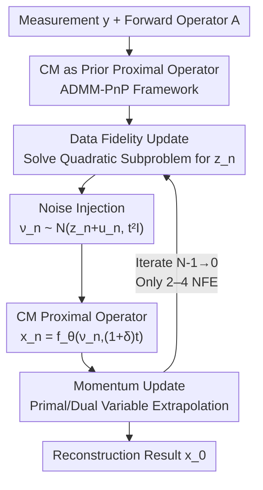

# PnP-CM: Consistency Models as Plug-and-Play Priors for Inverse Problems

**Conference**: CVPR 2026  
**Paper**: [CVF Open Access](https://openaccess.thecvf.com/content/CVPR2026/html/Gulle_PnP-CM_Consistency_Models_as_Plug-and-Play_Priors_for_Inverse_Problems_CVPR_2026_paper.html)  
**Code**: https://github.com/MerveGulle/PnP-CM  
**Area**: Image Restoration / Inverse Problems  
**Keywords**: Consistency Models, Inverse Problems, Plug-and-Play Priors, ADMM, MRI Reconstruction

## TL;DR
Consistency Models (CM) are reinterpreted as "proximal operators of a prior" and integrated into an ADMM-based Plug-and-Play (PnP) framework. By incorporating noise injection and momentum to compress iterations to 2–4 Number of Function Evaluations (NFE), this work unifiedly solves linear/nonlinear inverse problems and applies CM training to MRI reconstruction for the first time.

## Background & Motivation
**Background**: The mainstream approach for inverse problems (deblurring, super-resolution, inpainting, JPEG artifact removal, phase retrieval, MRI reconstruction) uses Diffusion Models (DM) as priors. By combining unconditional scores with data fidelity terms, the posterior $p(x\mid y)$ is approximated via reverse SDE / probability flow ODE sampling. While the quality is high, it typically requires hundreds of NFEs, which is too slow for large-scale or real-time scenarios.

**Limitations of Prior Work**: To accelerate inference, Consistency Models distill diffusion trajectories into a consistency function $f_\theta(x_t,t)$, mapping any point on an ODE trajectory directly back to the clean origin $x_0$, enabling high-quality sampling in 1–4 NFEs. however, existing CM-based solvers have significant drawbacks: CoSIGN requires an external ControlNet to encode the measurement operator, requiring retraining/fine-tuning for each degradation; CM4IR uses back-projection via the pseudo-inverse $A^\dagger$ for measurement consistency, essentially acting as preconditioned Proximal Gradient Descent (PGD). It is highly sensitive to the condition number of the forward operator and unstable in highly ill-posed cases (e.g., multi-coil MRI), where the pseudo-inverse can amplify aliasing artifacts. It also scales poorly to nonlinear operators.

**Key Challenge**: Achieving the "efficiency of low NFEs" (CM's strength) while maintaining "robustness to forward operator condition numbers + unified handling of linear/nonlinear problems + convergence guarantees" (PnP/ADMM strengths). These two mechanisms have not been cleanly integrated before.

**Goal**: (1) Provide a mathematical identity for CM that allows embedding into PnP; (2) Achieve high-quality reconstruction under an extremely low budget of 2–4 NFEs; (3) Validate the framework on real-world large-scale medical imaging (MRI).

**Key Insight**: The core operation of PnP is to "replace the proximal operator of the prior subproblem with a ready-made denoiser." Since CM is exactly a denoising mapping that predicts a clean image from a noisy state, $f_\theta$ can be treated as the proximal operator of a prior $g(\cdot)$.

**Core Idea**: Interpret CM as the proximal operator of a prior within the x-update of ADMM-PnP. Add noise injection and momentum to compensate for performance loss at extremely low NFEs, while proving these acceleration terms do not destroy ADMM convergence.

## Method

### Overall Architecture
Inverse problems aim to recover a clean signal $x$ from degraded observations $y = A(x) + n$, where $A(\cdot)$ is the (potentially nonlinear) forward operator and $n$ is measurement noise. MAP estimation can be formulated as:

$$\arg\min_x\; f(x) + \lambda g(x),$$

where the data fidelity term for i.i.d. Gaussian noise is $f(x)=\tfrac12\|y-Ax\|_2^2$, and $g(\cdot)$ is the prior/regularization term. ADMM decomposes this into three alternating minimization steps via variable splitting:

$$z^{(k+1)} = \arg\min_z f(z) + \tfrac{\rho}{2}\|z - x^{(k)} + u^{(k)}\|_2^2,$$
$$x^{(k+1)} = \arg\min_x g(x) + \tfrac{\rho}{2}\|z^{(k+1)} - x + u^{(k)}\|_2^2,$$
$$u^{(k+1)} = u^{(k)} + z^{(k+1)} - x^{(k+1)}.$$

The z-update handles data fidelity, the x-update is the proximal operator of the prior, and $u$ is the dual variable. Since the proximal operator of $g(\cdot)$ is usually intractable, PnP replaces this step with a pre-trained denoiser $D_\sigma$: $x^{(k+1)} = D_{\sigma_k}\!\big(z^{(k+1)} + u^{(k)}\big)$. This work instantiates this denoiser as a Consistency Model $f_\theta$.

The iteration flow is: Solve a quadratic data fidelity subproblem to get $z_n$ → Inject controlled noise to get $\nu_n$ → Use CM as the proximal operator to denoise and get $x_n$ → Update dual variables → Apply momentum extrapolation to both primal and dual variables. The algorithm uses reverse iteration indices (from $N-1$ down to 0) following diffusion/CM conventions.

### Key Designs

**1. CM as Prior Proximal Operator in ADMM-PnP: Resisting Ill-posedness via ADMM Quadratic Penalty**

Addressing the pain point that "PGD-based methods like CM4IR are sensitive to forward operator condition numbers." PnP replaces the ADMM x-update with a denoiser, and this work specifically selects the consistency model $f_\theta$. Since CM is a mapping that takes a noisy state back to a clean image, it semantically corresponds to a proximal operator. The benefit comes from the quadratic penalty $\tfrac{\rho}{2}\|z-\cdots\|^2$ in the ADMM data fidelity subproblem: it is equivalent to Tikhonov regularization, improving the condition number of the subproblem and making the overall system less sensitive to the ill-posedness of $A$. In contrast, CM4IR's data fidelity is based on back-projection $\tfrac12\|A^\dagger(y-Ax)\|_2^2$, inheriting the condition number of $A$; in multi-coil MRI ($m>n$), $A^\dagger(Ax-y)$ degenerates to $x-A^\dagger y$, pushing the solution toward the least-squares solution $A^\dagger y$, which is inherently filled with aliasing artifacts. Furthermore, ADMM typically requires fewer iterations to reach moderate precision than PGD, making it ideal for "few-step" inverse problems.

The data fidelity update for linear operators has a closed-form solution:

$$z_n = \big(A^\top A + \rho_{n+1} I\big)^{-1}\big(A^\top y + \rho_{n+1}(\hat x_{n+1} - \hat u_{n+1})\big),$$

which can be solved efficiently via SVD. For large-scale problems (e.g., MRI), it uses Conjugate Gradient (CG) to avoid explicit inversion. For nonlinear forward models, first-order methods like GD or Adam are used—hence the unified coverage of linear and nonlinear problems.

**2. Controlled Noise Injection: Running CM at Higher Noise Levels without Breaking Convergence**

Addressing the issue that "directly plugging CM into PnP does not reach full potential at extremely low NFEs." CM is trained on inputs with varying noise levels. Simple PnP iterations often provide inputs with low noise levels at few steps, limiting performance. This work adds a controlled perturbation to the CM input:

$$\nu_n \sim \mathcal{N}\big(z_n + \hat u_{n+1},\; t_{n+1}^2 I\big),\qquad x_n = f_\theta\big(\nu_n,\,(1+\delta_{n+1})\,t_{n+1}\big),$$

where the input to CM is sampled as a random variable centered at $z_n+\hat u_{n+1}$ with variance following the time step $t$, and the time label passed to CM is scaled by $(1+\delta)t$. Crucially, this maintains convergence guarantees (Theorem 1): In PnP-ADMM, if the denoiser is $L$-Lipschitz and noise $\eta_k$ is injected, the algorithm still converges to a fixed point as long as the noise sequence is decreasing and satisfies the energy bound $\sum_{k=0}^\infty \|\eta_k\|_2 < \infty$. Unlike CM4IR which uses a correction term based on the previous noise instance, the noise here is randomly generated, consistent with classical inverse problem practices.

**3. Momentum Update: Acceleration in the Low NFE Regime**

Addressing the goal of "reducing NFE to 2–4 while maintaining quality." Momentum is standard for accelerating convergence in gradient descent and has been shown to reduce iterations in imaging ADMM. This work applies Nesterov-style extrapolation to both primal and dual variables:

$$\hat x_n = x_n + \mu_{n+1}(x_n - x_{n+1}),\qquad \hat u_n = u_n + \mu_{n+1}(u_n - u_{n+1}).$$

Ablations show momentum is most effective in the low NFE regime, with diminishing returns as NFE increases—perfectly aligning with the "few-step" objective.

### Loss & Training
CM itself is trained using the standard consistency loss: for two independent noisy versions $(x_t,t)$ and $(x_{t'},t')$ of the same $x_0$, the predictions from $f_\theta$ must be consistent:

$$\mathcal{L}_{CM} = \mathbb{E}\big[w(t)\,d\big(f_\theta(x_t,t),\, f_{\theta^-}(x_{t'},t')\big)\big],$$

where $w(t)$ is a weight, $d(\cdot,\cdot)$ is $\ell_2$ or LPIPS distance, and $f_{\theta^-}$ is the EMA "teacher" network. It can be obtained via Consistency Distillation (CD) from a DM or Consistency Training (CT) from data. This work uses pre-trained CM for LSUN Bedroom and trains EDM then distills to CM for CelebA-HQ and MRI. The MRI training uses all 973 volumes from fastMRI, marking the first time CM is trained and applied to large-scale medical imaging. Note that the PnP-CM denoiser is plug-and-play; once trained, it works with any forward operator without retraining.

## Key Experimental Results

### Main Results
Natural images were evaluated on CelebA-HQ and LSUN Bedroom at 256×256 resolution ($\sigma_y=0.05$) using PSNR↑ and LPIPS↓. PnP-CM at 4 NFE matches or exceeds methods requiring thousands of NFEs.

| Task (CelebA-HQ) | Method | NFE | PSNR↑ | LPIPS↓ |
|------|------|-----|-------|--------|
| Gaussian Blur | DPS | 1000 | 25.36 | 0.225 |
| Gaussian Blur | CM4IR | 4 | 27.30 | 0.297 |
| Gaussian Blur | **Ours** | **4** | **28.94** | **0.249** |
| Super-Res ×4 | CM4IR | 4 | 26.77 | 0.392 |
| Super-Res ×4 | **Ours** | **4** | **27.27** | **0.285** |
| Inpainting (70%) | DiffPIR | 100 | 30.71 | 0.207 |
| Inpainting (70%) | **Ours** | **4** | 29.23 | **0.201** |

For MRI reconstruction (fastMRI), PnP-CM at 4 NFE significantly outperforms DPS (1000 NFE), DDS (100 NFE), and CM4IR (4 NFE):

| Setup | Method | NFE | PSNR↑ | SSIM↑ |
|------|------|-----|-------|-------|
| Coronal PD, R=8 | DPS | 1000 | 31.88 | 0.863 |
| Coronal PD, R=8 | DDS | 100 | 32.27 | 0.868 |
| Coronal PD, R=8 | CM4IR | 4 | 29.60 | 0.755 |
| Coronal PD, R=8 | **Ours** | **4** | **33.24** | **0.884** |

On non-linear tasks (JPEG artifact removal QF5, non-linear deblurring, phase retrieval), PnP-CM at 4–8 NFE outperforms or matches DPS (1000 NFE) and DPnP.

### Ablation Study
Deconstructing the contributions of noise injection and momentum (CelebA-HQ, NFE=4, $\sigma_y=0.05$):

| Noise Injection | Momentum | SR ×4 | Gaussian Blur | Inpainting |
|---------|------|---------|-----------|------|
| ✗ | ✗ | 22.93 / 0.461 | 27.26 / 0.427 | 28.69 / 0.295 |
| ✓ | ✗ | 24.25 / 0.300 | 28.89 / 0.251 | 29.13 / 0.204 |
| ✗ | ✓ | 25.97 / 0.469 | 26.59 / 0.453 | 28.72 / 0.293 |
| ✓ | ✓ | **27.27 / 0.285** | **28.94 / 0.249** | **29.23 / 0.201** |

### Key Findings
- Both acceleration terms are useful and complementary: For SR ×4, noise injection improves PSNR from 22.93 to 24.25, momentum to 25.97, and both to 27.27. Noise injection significantly improves LPIPS (0.461 → 0.300).
- Momentum gains are concentrated in the low NFE range, confirming it is tailored for few-step sampling.
- Extreme efficiency: PnP-CM at 4 NFE outperforms DPS at 1000 NFE and PnP-DM at 2034 NFE. Its advantage is even more pronounced in multi-coil MRI where CM4IR suffers from aliasing.
- The paper claims 2 steps yield meaningful results, while 4 steps reach SOTA; phase retrieval requires N=8.

## Highlights & Insights
- **Clever identity shift ($CM = \text{proximal operator}$)**: This bridges CM's few-step sampling with PnP's convergence guarantees without requiring task-specific training (no retraining for different $A$).
- **Using ADMM quadratic penalty to offset ill-posedness**: This is the core theoretical advantage over CM4IR. The paper provides a convincing derivation of how CM4IR's back-projection degenerates and causes aliasing in MRI.
- **Noise injection with convergence theory**: An empirical trick is grounded in theory (decreasing noise with bounded energy does not break convergence).
- **First CM for MRI**: Demonstrates the paradigm's transferability to large-scale medical imaging, surpassing 100/1000 NFE diffusion baselines with only 4 NFE.

## Limitations & Future Work
- Phase retrieval still requires N=8 and has relatively lower absolute quality, suggesting the framework's advantage narrows for highly non-convex problems.
- There are multiple hyperparameters ($\mu, \rho, \delta, \text{noise levels}$); while sensitivity analysis is in the supplement, the tuning cost for new tasks is not fully quantified.
- CMs for CelebA-HQ and MRI must be trained from scratch (via EDM), posing a barrier for modalities without pre-trained CMs.
- Convergence theory relies on the $L$-Lipschitz assumption of the denoiser, which may be hard to verify strictly for neural networks.

## Related Work & Insights
- **vs CM4IR**: Both use CM for 4 NFE, but CM4IR is sensitive to condition numbers and fails on multi-coil MRI (33.24 vs 29.60 PSNR).
- **vs CoSIGN**: CoSIGN needs to retrain ControlNets for different degradations; PnP-CM is plug-and-play.
- **vs Diffusion-based (DPS, DiffPIR, etc.)**: These require 100–2900+ NFEs; PnP-CM achieves comparable quality 2-3 orders of magnitude faster.
- **vs Classic PnP**: Classic PnP uses standard CNN denoisers; this work upgrades the denoiser to a Consistency Model, gaining the expressive power of generative priors with fewer steps.

## Rating
- Novelty: ⭐⭐⭐⭐ The perspective of embedding CM in ADMM-PnP is clean and practical.
- Experimental Thoroughness: ⭐⭐⭐⭐ Covers 6 types of inverse problems plus real MRI with solid baselines.
- Writing Quality: ⭐⭐⭐⭐ Theoretical derivations (MRI regression/Theorem 1) are convincing and clear.
- Value: ⭐⭐⭐⭐⭐ 4 NFE SOTA + Plug-and-Play + MRI deployment offers high utility for real-time/large-scale solving.

<!-- RELATED:START -->

## Related Papers

- [\[CVPR 2026\] Dual Ascent Diffusion for Inverse Problems](dual_ascent_diffusion_for_inverse_problems.md)
- [\[CVPR 2026\] GSNR: Graph Smooth Null-Space Representation for Inverse Problems](gsnr_graph_smooth_null_space_representation_for_inverse_problems.md)
- [\[ICML 2026\] Solving Inverse Problems with Flow-based Models via Model Predictive Control](../../ICML2026/image_restoration/solving_inverse_problems_with_flow-based_models_via_model_predictive_control.md)
- [\[ICLR 2026\] Taming Score-Based Denoisers in ADMM: A Convergent Plug-and-Play Framework](../../ICLR2026/image_restoration/taming_score-based_denoisers_in_admm_a_convergent_plug-and-play_framework.md)
- [\[ICLR 2026\] Adaptive Moments are Surprisingly Effective for Plug-and-Play Diffusion Sampling](../../ICLR2026/image_restoration/adaptive_moments_are_surprisingly_effective_for_plug-and-play_diffusion_sampling.md)

<!-- RELATED:END -->
