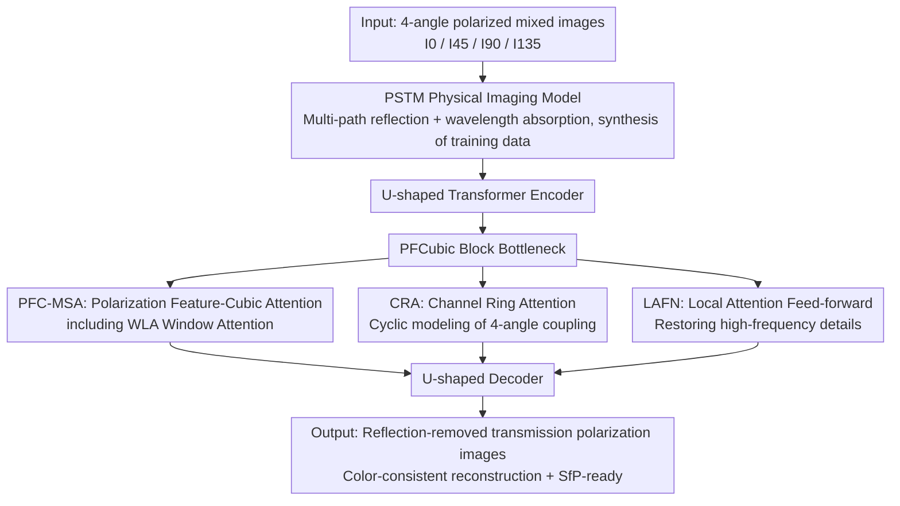

# Polarization State Tracing for Reflection Removal and Color-Consistent Reconstruction

**Conference**: CVPR 2026  
**Paper**: [CVF Open Access](https://openaccess.thecvf.com/content/CVPR2026/html/Wang_Polarization_State_Tracing_for_Reflection_Removal_and_Color-Consistent_Reconstruction_CVPR_2026_paper.html)  
**Code**: None  
**Area**: Image Restoration / Polarization Imaging / Reflection Removal  
**Keywords**: Polarization Imaging, Colored Glass, Reflection Removal, Color-Consistent Reconstruction, Stokes-Muller Physical Modeling

## TL;DR
Addressing the overlooked degradation problem of "ghosting artifacts + color bias" when photographing through colored glass, this paper introduces polarization imaging theory into modeling for the first time. It proposes a physical imaging model, PSTM (tracing multi-path propagation of polarized light + wavelength-selective absorption), and designs a polarization-aware network, PANet, featuring Channel Ring Attention. On the self-built real-world dataset GlassPol, it achieves an improvement of approximately 3dB PSNR over existing SOTA methods while reconstructing transmission scenes with high color fidelity.

## Background & Motivation

**Background**: Mainstream approaches for single image reflection removal (SIRR) treat the observed image as a linear superposition of a "reflection layer + transmission layer," employing smoothness priors, gradient sparsity priors, or deep networks for layer separation. A few polarization-based methods use polarization as an auxiliary weighting signal to suppress reflections.

**Limitations of Prior Work**: These methods assume the reflection layer has a "single, consistent appearance" and primarily rely on RGB intensity cues. However, photographing through **colored glass** introduces a specific phenomenon: the appearance of two layers of reflection ghosting with nearly identical geometry but different colors and intensities, alongside a distinct color bias across the entire image. This indicates that light undergoes multiple reflections and wavelength-selective attenuation inside the glass. The observed image is no longer a simple two-layer mixture, making these layers inseparable in the RGB domain. Powerful RGB-based methods like DExNet and DSRNet, as well as the diffusion-plus-polarization-based PolarFree, fail in such scenarios.

**Key Challenge**: The degradation caused by colored glass is essentially a physical process of "multiple internal reflections + wavelength-selective absorption." Existing methods **ignore the absorption effect** and only perform layer separation in the spatial domain (RGB), where these layers are inseparable but remain separable in the polarization domain.

**Goal**: To treat colored glass degradation as a new, unsolved problem, aiming to simultaneously remove reflection ghosting and restore true colors distorted by glass staining.

**Key Insight**: Instead of hard-separating layers in the RGB domain, it is better to directly build a physical model for the complete optical reflection-transmission-absorption process and allow the network to perform restoration under the guidance of this physical model using polarization cues.

**Core Idea**: Replace the RGB layer separation assumption with a physical imaging model (PSTM) capable of tracing polarization state evolution. This unites reflection, transmission, and wavelength absorption into a single physical process. A polarization-aware network then jointly completes reflection removal and color-consistent reconstruction under the constraints of this model.

## Method

### Overall Architecture
The method consists of two parts: a **physical imaging model PSTM** (used to explain degradation and synthesize physically consistent training data) and a **polarization-aware reconstruction network PANet** (performing actual restoration under PSTM guidance). The input to PANet is the mixed images $\{I_0, I_{45}, I_{90}, I_{135}\}$ captured at four polarization angles (0°, 45°, 90°, 135°), and the output is the corresponding reflection-removed transmission polarization images $\{\hat T_0, \hat T_{45}, \hat T_{90}, \hat T_{135}\}$. It adopts a U-shaped Transformer encoder-decoder backbone, retaining the four polarization angles as independent feature dimensions for joint angular-spatial reasoning. At the network bottleneck, the core **PFCubic Block** is placed, containing two complementary branches: the global polarization attention branch **PFC-MSA** (including WLA and CRA) and the local refinement branch **LAFN**, corresponding to the "global propagation of polarization states" and "local absorption variations" in PSTM, respectively.

### Key Designs

**1. PSTM Polarization State Tracing Model: Formulating colored glass degradation as a derivable physical process**

This is the physical foundation of the paper, directly addressing the limitation that prior methods ignore absorption. PSTM models the glass as a planar dielectric plate with thickness $t$ and refractive index $n$, assigning wavelength-selective absorption coefficients $\beta_\lambda=\{\beta_r,\beta_g,\beta_b\}$ to the RGB channels. Light follows Snell’s Law ($n_0\sin\theta_i = n\sin\theta_t$) at the surfaces, and Fresnel’s Law is used at each interface to form Muller matrices $M_R, M_T$ acting on the Stokes vector: $S'=MS$. Internal absorption is expressed as a diagonal matrix $E(L)=\mathrm{diag}(e^{-\beta_r L}, e^{-\beta_g L}, e^{-\beta_b L})$ according to the Beer–Lambert Law, where the single-pass transmission path length is $L=t/\cos\theta_t$. Internal reflections also produce a lateral displacement $\Delta x = 2t\tan\theta_t$, which is the source of the "geometrically similar but shifted ghosting layers." The final observed Stokes intensity is decomposed into the sum of four physical paths $S=S_R^1+S_T^1+S_R^2+S_T^2$ (first/second-order reflection and transmission), with higher-order terms ignored due to strong attenuation. This model not only explains ghosting and color bias but is also used to **synthesize physically consistent training data**—the authors generated 1400/160 training/test pairs covering incident angles $20^\circ\!-\!80^\circ$ and thicknesses of 2–10mm.

**2. PFCubic Block and PFC-MSA: Attention on the "Polarization-Spatial Cube" rather than treating polarization as ordinary channels**

To address the issue of polarization information being treated as auxiliary weighting without angular dependency modeling, the authors placed the PFCubic Block at the bottleneck. Its global branch, PFC-MSA (Polarization Feature-Cubic based Multi-head Self-Attention), partitions the stacked polarization inputs into small "polarization-spatial cubes." It computes attention across both spatial positions and polarization channels within these cubes, adaptively modeling inter-angular dependencies and the spatial correlation of reflection-transmission. To manage the cost of global self-attention while maintaining local consistency, it integrates **WLA (Window-Level Attention)**, which divides the feature cubes into non-overlapping spatial windows. This maintains the local coherence of reflection patterns and avoids over-smoothing. Ablations show that removing the PFCubic Block caused the most significant performance drop (PSNR 31.11→19.48), identifying the cubic representation in the "spatial + inter-angular" domain as critical to the network's success.

**3. CRA Channel Ring Attention: Characterizing periodic coupling of the four polarization angles using a cyclic matrix**

Standard channel attention treats channels as independent features, but the four polarization angles are physically coupled—polarization intensity varies periodically with the angle: $I_\theta=\tfrac12(S_0+S_1\cos 2\theta+S_2\sin 2\theta)$. Accordingly, CRA represents inter-angular attention as a **cyclic, rank-constrained matrix** $A_{\mathrm{CRA}}\in\mathbb{R}^{4\times4}$. This enforces rotational symmetry between polarization directions, capturing both local correlations between adjacent angles and global consistency across the polarization period. Physically, CRA can be understood as a learnable approximation of polarization state propagation in PSTM, implicitly encoding multi-angle dependencies into cyclic feature interactions. Removing CRA (damaging PFC-MSA) dropped the PSNR to 25.58 with visible residual reflections and uneven lighting, verifying the necessity of cross-channel dependency modeling.

**4. LAFN Local Attention Feed-forward Branch: Restoring high-frequency details lost to global attention**

PFC-MSA excels at global polarization consistency but tends to suppress fine textures. LAFN (Local Attention Feed-forward Network), as a complementary local branch within the bottleneck, adaptively aggregates neighborhood polarization responses and modulates them based on local spatial context to reintroduce high-frequency textures and local intensity variations (corresponding to spatially varying absorption/reflection residuals in PSTM). It corresponds to the "local absorption variations" aspect of PSTM and works synergistically with the "global propagation" of PFC-MSA. Removing LAFN resulted in blurred images and reduced edge contrast (PSNR 25.56), showing that local context fusion is a necessary supplement to global Transformer attention.

### Loss & Training
The training objective is a weighted combination of L1 (Charbonnier form) and SSIM losses: $\mathcal{L}=\tfrac1N\sum_i\sqrt{(\hat y_i-y_i)^2+\varepsilon^2}+\lambda(1-\mathrm{SSIM}(\hat y,y))$, where $\varepsilon=10^{-3}$ and $\lambda=0.2$. Training was performed on a single RTX A6000 using PyTorch with a batch size of 8 and a fixed learning rate of $2\times10^{-4}$ for 600 epochs. Only the transmission layer was supervised to ensure fair alignment with comparison methods that have explicit reflection estimation branches.

## Key Experimental Results

### Main Results
Evaluation was conducted on two datasets: the PSTM synthetic set (1400/160 pairs) and the real-world GlassPol set (500/200 pairs, captured with a FLIR polarization camera and downsampled from 2448×2042 to 256×256). Metrics used were PSNR, SSIM, and LPIPS, comparing against 7 recent methods (2 polarization-based + 5 RGB-based), all retrained on the same data.

| Dataset | Metric | Ours | Sub-optimal | Notes |
| :--- | :--- | :--- | :--- | :--- |
| Synthetic | PSNR↑ | **32.80** | 26.83 (IBCLN) | Leading by nearly 6dB |
| Synthetic | SSIM↑ | **0.947** | 0.917 (DExNet) | — |
| Synthetic | LPIPS↓ | **0.109** | 0.174 (IBCLN) | Significant lead in perceptual quality |
| GlassPol | PSNR↑ | **31.11** | 28.03 (PolarFree) | ~3dB higher than polar-diffusion method |
| GlassPol | SSIM↑ | **0.895** | 0.871 (PolarFree) | — |
| GlassPol | LPIPS↓ | **0.094** | 0.118 (PolarFree) | — |

Note: The "approx. 3dB PSNR improvement" claimed in the abstract primarily refers to the 31.11 vs 28.03 comparison against the runner-up PolarFree on the real-world GlassPol dataset.

### Ablation Study
Ablations performed on the real-world GlassPol set by removing modules (PANet Full: PSNR 31.11 / SSIM 0.895 / LPIPS 0.094):

| Configuration | PSNR↑ | SSIM↑ | LPIPS↓ | Notes |
| :--- | :--- | :--- | :--- | :--- |
| Full PANet | 31.11 | 0.895 | 0.094 | Full model |
| w/o WLA | 26.79 | 0.834 | 0.182 | Global structural artifacts appear |
| w/o CRA | 25.58 | 0.806 | 0.245 | Residual reflections and uneven lighting |
| w/o LAFN | 25.56 | 0.798 | 0.243 | Blurred images, weak edges |
| w/o PFC-MSA | 22.43 | 0.743 | 0.283 | Significant performance drop |
| w/o PFCubic Block | 19.48 | 0.684 | 0.324 | Most severe performance drop |

### Key Findings
- **PFCubic Block contributes the most**: Removing it caused PSNR to plummet from 31.11 to 19.48, proving that establishing a cubic representation in the "spatial + inter-angular" domain is the core of the method.
- **CRA and LAFN are nearly equally important**: Removing either separately dropped the PSNR to ~25.5dB, indicating that global angular coupling (CRA) and high-frequency detail restoration (LAFN) are complementary.
- **Physical modeling ensures cross-domain generalization**: The method leads on both synthetic and real datasets, attributed to the physical consistency of PSTM. The visual similarity between synthetic and real images validates PSTM's synthesis logic.
- **Downstream transferability**: The restored polarization information can be directly fed into Shape-from-Polarization (SfP). Mixed inputs cause pre-trained SfP to produce incorrect normals, whereas the proposed method allows for high-accuracy surface normal recovery.

## Highlights & Insights
- **Systematic integration of classical polarization physics (Stokes/Muller/Fresnel/Beer–Lambert) into deep reflection removal**: Rather than treating polarization as a secondary weight, it uses a complete optical path model to explain both ghosting ($\Delta x$) and color bias ($E(L)$) with specific physical motivation.
- **Dual-purpose physical model**: PSTM serves as both the design motivation and the data synthesizer, circumventing the difficulty of collecting paired data for colored glass.
- **Clever CRA design**: Using a $4\times4$ cyclic rank-constrained matrix to explicitly encode the periodic symmetry of polarization angles is more grounded in physics than unstructured channel attention and serves as a reusable trick.
- **Establishing "colored glass degradation" as an independent problem**: Accompanied by the real-world benchmark GlassPol, this provides significant value to the dataset community.

## Limitations & Future Work
- The real-world GlassPol dataset contains only 32 scenes and 700 pairs, downsampled to 256×256. Generalization to high-resolution/complex scenes remains to be verified.
- The method relies on a **polarization camera** for four-angle acquisition, making it unusable for standard RGB images and increasing deployment costs.
- PSTM ignores third-order reflections and assumes optically uniform glass, which may not hold for thick, non-uniform, or curved glass. ⚠️ Some explicit Muller matrix forms are in the supplementary material; full reproduction requires them.
- Future directions: Extending the physical model to non-planar/heterogeneous glass; exploring restoration from single or few-angle polarization images to reduce costs.

## Related Work & Insights
- **vs. RGB Reflection Removal (DExNet / DSRNet / IBCLN)**: These perform layer separation in the RGB intensity domain without physical constraints, leading to over-smoothing and inaccurate color restoration. This method uses polarization + a physical model for superior color consistency.
- **vs. Polarization Reflection Removal (Lei et al. / PolarFree)**: Lei et al. used simplified linear decomposition and ignored absorption; PolarFree uses diffusion + polarization but only performs intensity normalization without modeling multi-path reflection, leaving residual ghosting under strong absorption. This method Separates layers that are inseparable in RGB by modeling the full reflection-transmission-absorption process.
- **vs. Color Correction/Color Constancy**: Traditional white balance assumes Lambertian surfaces + single light sources. It fails when color bias stems from the imaging medium (glass absorption). This work specifically addresses this by modeling the medium’s selective absorption.

## Rating
- Novelty: ⭐⭐⭐⭐⭐ First systematic integration of a full polarization physical imaging model for the new problem of colored glass.
- Experimental Thoroughness: ⭐⭐⭐⭐ Synthetic + real benchmarking with 7 comparisons and detailed ablations, though real-world data scale is modest.
- Writing Quality: ⭐⭐⭐⭐ Clear physical derivations and complete diagrams; some details moved to supplementary.
- Value: ⭐⭐⭐⭐ Proposes a new problem + benchmark + physical modeling approach, offering strong reference value for the polarization vision community.

<!-- RELATED:START -->

## Related Papers

- [\[CVPR 2025\] PolarFree: Polarization-based Reflection-Free Imaging](../../CVPR2025/image_restoration/polarfree_polarization-based_reflection-free_imaging.md)
- [\[CVPR 2026\] LightRR: A Lightweight Network for Single Image Reflection Removal](lightrr_a_lightweight_network_for_single_image_reflection_removal.md)
- [\[CVPR 2026\] VEMamba: Efficient Isotropic Reconstruction of Volume Electron Microscopy with Axial-Lateral Consistent Mamba](vemamba_efficient_isotropic_reconstruction_of_volume_electron_microscopy_with_ax.md)
- [\[CVPR 2026\] Reflection Separation from a Single Image via Joint Latent Diffusion](reflection_separation_from_a_single_image_via_joint_latent_diffusion.md)
- [\[CVPR 2026\] ReflexSplit: Single Image Reflection Separation via Layer Fusion-Separation](reflexsplit_single_image_reflection_separation_via_layer_fusion-separation.md)

<!-- RELATED:END -->
