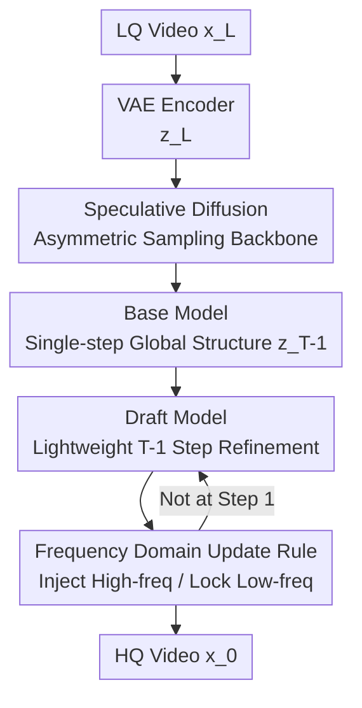

# PS-SR: Pseudo-Single-Step Video Super-Resolution via Speculative Diffusion

**Conference**: CVPR 2026  
**Paper**: [CVF Open Access](https://openaccess.thecvf.com/content/CVPR2026/html/Wu_PS-SR_Pseudo-Single-Step_Video_Super-Resolution_via_Speculative_Diffusion_CVPR_2026_paper.html)  
**Code**: None (Project page: https://waq2001.github.io/PS-SR-page/)  
**Area**: Video Super-Resolution / Diffusion Models / Image Restoration  
**Keywords**: Video Super-Resolution, Speculative Diffusion, Single-step Diffusion, Frequency Domain Constraint, Computational Asymmetry Sampling

## TL;DR
PS-SR decomposes an expensive multi-step diffusion SR process into an asymmetric sampling sequence consisting of "1 step by a strong base model + T−1 steps of speculative refinement by a lightweight draft model." It then applies a frequency domain update rule to ensure subsequent steps only inject high-frequency details without altering low-frequency structures, achieving multi-step diffusion quality and detail at speeds approaching single-step models.

## Background & Motivation
**Background**: Video Super-Resolution (VSR) has long been trapped in a trade-off between efficiency and image quality. CNN/lightweight Transformer-based single-step models offer real-time inference but struggle to generate high-frequency textures. Multi-step diffusion models (e.g., STAR, SeedVR) provide stunning quality, but their iterative denoising makes them too slow for practical deployment.

**Limitations of Prior Work**: To bridge this gap, mainstream approaches distill multi-step diffusion into single-step students (e.g., OSEDiff, SeedVR2, DOVE). While distillation preserves a significant portion of perceptual quality, single-step forward passes fail to capture the iterative reasoning ability of multi-step diffusion to "gradually hallucinate reasonable high-frequency details." Consequently, student models tend to converge towards safer, average predictions, leading to blurred textures.

**Key Challenge**: The fundamental contradiction is that the detail-creating capability of multi-step diffusion stems from the **iterative process** itself, which single-step distillation eliminates for speed. One must choose between being slow (multi-step, detailed) or blurred (single-step, losing details), with no middle ground.

**Goal**: To build a "pseudo-single-step" framework that looks like a single-step model, runs at high speed, and maintains input-output consistency, while retaining the high-frequency creativity of multi-step diffusion.

**Key Insight**: The authors borrow the idea of **speculative sampling** from Large Language Models (LLMs)—using a lightweight draft model to "guess" extensively and a strong base model for verification. In VSR, the "first step" that determines the global structure is the most expensive and critical; subsequent steps merely refine details and do not require the full capacity of a large model.

**Core Idea**: A strong base model executes a single step to define the global structure and semantics. The remaining T−1 steps are handled by a lightweight draft model for speculative refinement. A frequency domain rule is applied to lock the low frequencies, forcing subsequent steps to only add high-frequency details, thereby "faking" multi-step results at near single-step costs.

## Method

### Overall Architecture
PS-SR is built upon pairwise Flow Matching. For a low-quality/high-quality latent pair $(z_L, z_H)$, the intermediate state follows a straight linear flow $z_t = (1-\sigma_t)z_H + \sigma_t z_L$, and the model $\phi$ regresses the velocity field pushing $z_L$ toward $z_H$. PS-SR decomposes this flow into an **asymmetric multi-model collaboration sequence**: a strong base model takes a large step, followed by several small refinement steps by a lightweight draft model, each filtered by a frequency domain update rule. The entire generation process is compressed into the following formula:

$$\hat{x}_H = \left(\prod_{t=1}^{T-1}(I + H \circ \phi_{\text{draft}})\right)\circ \phi_{\text{base}}(x_L)$$

where $H$ is a high-pass filter and $I$ is the identity operator (preserving low frequencies). Intuitively, $\phi_{\text{base}}$ handles the "large structure," while each $(I + H\circ\phi_{\text{draft}})$ term overlays high-frequency details onto the existing result.

### Key Designs

**1. Speculative Diffusion: Asymmetric pipeline of "1-step grounding + T-1 steps speculative refinement"**

This is the main skeleton of PS-SR, directly addressing the "multi-step slow, single-step blur" contradiction. Instead of running a large model for T steps, the flow matching sequence is split. In the first stage, the base model takes a large step to push the source latent significantly toward the target:

$$z_{T-1} = z_L - (1-\sigma_{T-1})\phi_{\text{base}}(z_L; T), \quad x_{T-1} = E^{-1}\big(z_{T-1} - \sigma_{T-1}\phi_{\text{base}}(z_L; T)\big)$$

This step establishes the global structure and semantic content, representing the most critical jump in the flow. The second stage uses the draft model for the remaining T-1 steps, updating both the latent $z$ and pixel-domain estimates $x$:

$$z_{t-1} = z_t - (\sigma_t - \sigma_{t-1})\phi_{\text{draft}}(z_t; t), \quad x_{t-1} = x_t + H\circ E^{-1}\big(z_{t-1} - \sigma_{t-1}\phi_{\text{draft}}(z_t; t)\big)$$

The key is that the expensive large model is called only once, while the cheap small model is called multiple times (T=4 in experiments, i.e., 1+3). Since the heavy lifting (global structure) is resolved by the base model in one step, the draft model is sufficient for detail refinement. This effectively implements the LLM "draft and verify" logic in diffusion, approaching single-step speeds while preserving iterative high-frequency detail generation.

**2. Base Model: One-step global structure reconstruction via VSD, adversarial, and two-stage training**

The base model must recover global structure and semantics from LQ inputs in a **single step**. The difficulty is that single-step L2 supervision naturally leads to over-smoothing. The authors initialize from the Wan2.1 video foundation model to inherit generative and motion priors, apply LoRA fine-tuning to all DiT blocks for VSR, and use **two-stage training** to boost quality. In the latent space stage, in addition to the base L2 velocity field loss $\mathcal{L}_{L2} = \mathbb{E}\|\phi_{\text{base}}(z_L) - (z_L - z_H)\|^2$, two "quality boosters" are added: **Variational Score Distillation (VSD)**, which aligns the single-step output distribution with a multi-step teacher using a LoRA-tuned regulator $\phi'_{\text{reg}}$ and a frozen pre-trained regulator $\phi_{\text{reg}}$: $\nabla_\theta \mathcal{L}_{\text{vsd}} = \mathbb{E}_{t,\varepsilon}[\omega(t)(\phi_{\text{reg}}(\hat{z}_t;t) - \phi'_{\text{reg}}(\hat{z}_t;t))\partial\hat{z}_H/\partial\theta]$; and a **latent adversarial loss** $\mathcal{L}_{\text{adv}}$ based on a VGG-16 discriminator to enhance realism. After latent convergence, the model enters a pixel stage where VSD and adversarial losses are removed to save VRAM, replaced by a patch-wise strategy: predicted latents are decoded into pixel blocks $\hat{x}_H^{\text{crop}}$ and optimized with a composite L2 + LPIPS loss $\mathcal{L}_{\text{pixel}} = \lambda_{L2}\mathbb{E}\|\hat{x}_H^{\text{crop}} - x_H^{\text{crop}}\|^2 + \lambda_{\text{lpips}}\mathcal{L}_{\text{lpips}}$. This stabilizes the distribution in latent space before refining details in the pixel domain.

**3. Draft Model: Lightweight refiner pruned from base with feature injection**

To make speculative refinement cost-effective, the draft model must be lightweight. It is initialized from the fine-tuned base model by **uniformly pruning DiT blocks** (e.g., removing 20 out of 30 blocks). To compensate for the loss of capacity due to pruning, base model features are concatenated along the channel dimension with corresponding draft blocks and passed through a fully connected layer to restore the hidden dimension. This allows the draft model to work on the "semantic scaffolding" provided by the base model. Unlike the base, the draft model is **fully fine-tuned** to adapt to complex targets, taking interpolated latents $z_t = \sigma_t z_L + (1-\sigma_t)z_H$ to predict the velocity field, supervised by L2 and pixel losses $\mathcal{L}_{\text{draft}} = \lambda_{L2}\mathcal{L}_{L2} + \lambda_{\text{pixel}}\mathcal{L}_{\text{pixel}}$. Notably, **VSD and adversarial losses are not used** here—since the base model has already handled distributional alignment, the draft model's responsibility is focused purely on recovering high-frequency details.

**4. Frequency Domain Update (FDU): Forcing refinement on high frequencies while locking low frequencies**

Allowing the draft model to freely rewrite outputs can lead to semantic drift, where the low-frequency structure established by the base model is altered, causing input-output inconsistency. FDU provides a "frequency domain guardrail." Given the previous step result $x_t$ and the current prediction $\tilde{x}_{t-1}$, both are converted to the YUV color space. The high-frequency component of the luminance channel $Y$ is extracted using a high-pass filter $H$: $Y^H = H(Y)$. An **adaptive weight** balances old and new high-frequency contributions:

$$w_t = \frac{|\tilde{Y}_{t-1}^H|}{|Y_t^H| + |\tilde{Y}_{t-1}^H|}$$

The updated high-frequency component is $Y_{t-1}^H = \alpha(w_t \tilde{Y}_{t-1}^H + (1-w_t)Y_t^H)$, where $\alpha$ controls refinement intensity (set to 0.6). Finally, this new high-frequency luminance is combined with the low-frequency and chroma channels of $x_t$ and converted back to RGB. This ensures **low-frequency content always originates from the base model's initial result**, while only high-frequency components are iteratively enhanced, serving as the key mechanism for "faking" single-step consistency.

### Loss & Training
- Base model latent objective: $\mathcal{L}_{\text{latent}} = \lambda_{L2}\mathcal{L}_{L2} + \lambda_{\text{vsd}}\mathcal{L}_{\text{vsd}} + \lambda_{\text{adv}}\mathcal{L}_{\text{adv}}$, with weights $\lambda_{L2}=1, \lambda_{\text{vsd}}=1, \lambda_{\text{adv}}=0.1$; pixel stage uses $\lambda_{\text{pixel}}=1, \lambda_{\text{lpips}}=2$.
- Training Data: YouHQ (approx. 37K HQ video clips), LQ inputs synthesized using the RealESRGAN degradation pipeline.
- Implementation: VAE and base initialized from Wan2.1-T2V-1.3B; draft model pruned to 10 blocks from 30; speculative steps $T=4$, refinement intensity $\alpha=0.6$, LoRA rank 32; 8×A800 GPUs, batch size 8, AdamW, learning rate $5\times10^{-5}$, pixel loss applied to 160×160 patches.

## Key Experimental Results

### Main Results
Comparisons were conducted across UDM10, SPMCS, YouHQ40, and VideoLQ against multi-step (STAR, SeedVR) and single-step (DLoRAL, SeedVR2, DOVE) methods. PS-SR leads in fidelity-based metrics (SSIM/LPIPS/DISTS). While no-reference sharpness metrics (CLIP-IQA/MUSIQ) are not the highest, the authors note that methods scoring extremely high on these often deviate from LQ inputs and suffer from semantic drift.

| Dataset | Metric | DOVE (1-step) | SeedVR2 (1-step) | PS-SR (Ours) |
|--------|------|-----------|--------------|------------|
| UDM10 | SSIM ↑ | 0.7434 | 0.7349 | **0.7547** |
| UDM10 | LPIPS ↓ | 0.2672 | 0.2587 | **0.2444** |
| UDM10 | DISTS ↓ | 0.1569 | 0.1340 | **0.1277** |
| SPMCS | SSIM ↑ | 0.5802 | 0.5950 | **0.6287** |
| SPMCS | LPIPS ↓ | 0.3727 | 0.3232 | **0.2940** |
| YouHQ40 | LPIPS ↓ | 0.3192 | 0.3100 | **0.3011** |

For temporal consistency (flow warping error $E^*_{\text{warp}}$ ↓), PS-SR achieves the lowest error across all four datasets (e.g., UDM10 1.43 vs DOVE 1.79, SeedVR2 4.78), confirming it preserves the motion priors of the video diffusion backbone. Inference speed (29 frames at 720×1280, A800):

| Method | STAR | SeedVR | DLoRAL | SeedVR2 | DOVE | PS-SR |
|------|------|--------|--------|---------|------|-------|
| Steps | 15 | 50 | 1 | 1 | 1 | 1+3 |
| Time (s) | 98.61 | 188.93 | 45.48 | 22.36 | 20.43 | **21.11** |

PS-SR is only ~0.7s slower than the fastest single-step model while delivering multi-step level detail.

### Ablation Study
Component ablation on SPMCS (Table 3):

| Configuration | PSNR ↑ | SSIM ↑ | LPIPS ↓ | Description |
|------|--------|--------|---------|------|
| Full (Ours) | 22.092 | 0.6287 | 0.2940 | Complete model |
| w/o $\mathcal{L}_{\text{vsd}}$ | 22.097 | 0.6333 | 0.3361 | Perceptual metrics drop; distribution alignment fails |
| w/o $\mathcal{L}_{\text{adv}}$ | 22.165 | 0.6355 | 0.3448 | Realistic texture decreases |
| w/o $\mathcal{L}_{\text{pixel}}$ | 22.266 | 0.6340 | 0.3046 | Spatial precision of details worsens |
| w/o FDU | 18.661 | 0.5299 | 0.3293 | PSNR/SSIM plummet; structural fidelity collapses |

Without FDU, PSNR drops from 22.09 to 18.66 and SSIM from 0.629 to 0.530, marking the most significant performance degradation. This confirms FDU is essential for "locking low frequencies and preserving structure." Interestingly, without FDU, the no-reference score (MUSIQ 67.07) actually increases, suggesting the model "over-hallucinates" and deviates from the ground truth.

### Key Findings
- **FDU is the lifeline of structural fidelity**: Removing it causes no-reference sharpness to soar while reconstruction metrics collapse, quantifying the trade-off between sharpness and semantic drift.
- **Sampling steps T as a quality-fidelity knob** (Table 5): At T=1, PSNR/SSIM are highest but perceptual quality is weakest. Increasing steps improves perceptual quality while reconstruction metrics decrease slowly. The authors choose T=4 as a compromise.
- **Sweet spot for draft pruning** (Table 6): Pruning to 10 blocks (out of 30) barely impacts quality (MUSIQ 61.5→61.0), but pruning further to 5 blocks causes significant degradation. Thus, 10/30 is the balance point for speed and quality.
- **Human Evaluation**: In a study with 20 users and 20 videos, PS-SR outperformed baselines significantly (e.g., 78% win rate vs. SeedVR2).

## Highlights & Insights
- **Applying speculative sampling to VSR**: The core insight is that the first step of VSR diffusion is the most critical, while subsequent steps are for detail refinement. This asymmetric sampling paradigm—one heavy base step and multiple light draft steps—is clean and transferable.
- **Frequency domain guardrails**: Using high-pass filters and identity operators to "lock low frequencies and only stack high frequencies" into the update rule provides a more rigid and controllable constraint than simple consistency losses.
- **Draft model via feature injection**: Using base model features as a scaffold instead of independent training avoids the "lightweight drop-off" trap. This "scaffold feature reuse" approach is applicable to other generation tasks requiring lightweight refinement heads.

## Limitations & Future Work
- The base model depends heavily on the generative and motion priors of the Wan2.1 video foundation model; its effectiveness without a strong foundation (e.g., medical/satellite video) remains uncertain. ⚠️
- FDU applies high-pass filtering only to the Y (luminance) channel in YUV; the recovery of high-frequency details in chroma channels (e.g., colored texture edges) might be limited.
- T, $\alpha$, and pruning ratios are determined via empirical grid searches, lacking an adaptive mechanism for different degradation levels.
- Evaluations are still based on synthetic degradations (RealESRGAN pipeline). Performance on complex real-world degradations (VideoLQ) does not show a clear lead in all no-reference metrics.

## Related Work & Insights
- **vs. Single-step Distillation (OSEDiff / SeedVR2 / DOVE)**: These compress multi-step teachers into single-step passes, losing high-frequency creativity. PS-SR keeps the iterative behavior but shifts the computational load to a draft model.
- **vs. Multi-step Diffusion (STAR / SeedVR)**: These achieve quality at the cost of unusable speeds (e.g., SeedVR 188s). PS-SR provides comparable or better quality in 21s using a 1+3 step sequence.
- **vs. Naive Flow Matching SR**: PS-SR avoids uniform steps with the same model, instead using asymmetric roles and frequency domain constraints to structure where capacity is needed and where structure must be protected.

## Rating
- Novelty: ⭐⭐⭐⭐⭐ Implementing speculative sampling + frequency domain constraints in VSR is a clever and self-consistent paradigm.
- Experimental Thoroughness: ⭐⭐⭐⭐⭐ Comprehensive evaluation across four datasets, multiple metrics, temporal consistency, human studies, and extensive ablations.
- Writing Quality: ⭐⭐⭐⭐ Visualizations and formulas are clear, though some YUV update notations are better understood alongside diagrams.
- Value: ⭐⭐⭐⭐⭐ Directly addresses the VSR efficiency-quality trade-off with high practical value.

<!-- RELATED:START -->

## Related Papers

- [\[CVPR 2026\] GDPO-SR: Group Direct Preference Optimization for One-Step Generative Image Super-Resolution](gdpo-sr_group_direct_preference_optimization_for_one-step_generative_image_super.md)
- [\[CVPR 2026\] Time-Aware One Step Diffusion Network for Real-World Image Super-Resolution](time-aware_one_step_diffusion_network_for_real-world_image_super-resolution.md)
- [\[CVPR 2026\] STCDiT: Spatio-Temporally Consistent Diffusion Transformer for High-Quality Video Super-Resolution](stcdit_spatio-temporally_consistent_diffusion_transformer_for_high-quality_video.md)
- [\[CVPR 2026\] FiDeSR: High-Fidelity and Detail-Preserving One-Step Diffusion Super-Resolution](fidesr_high-fidelity_and_detail-preserving_one-step_diffusion_super-resolution.md)
- [\[CVPR 2026\] Bridging Fidelity-Reality with Controllable One-Step Diffusion for Image Super-Resolution](bridging_fidelity-reality_with_controllable_one-step_diffusion_for_image_super-r.md)

<!-- RELATED:END -->
