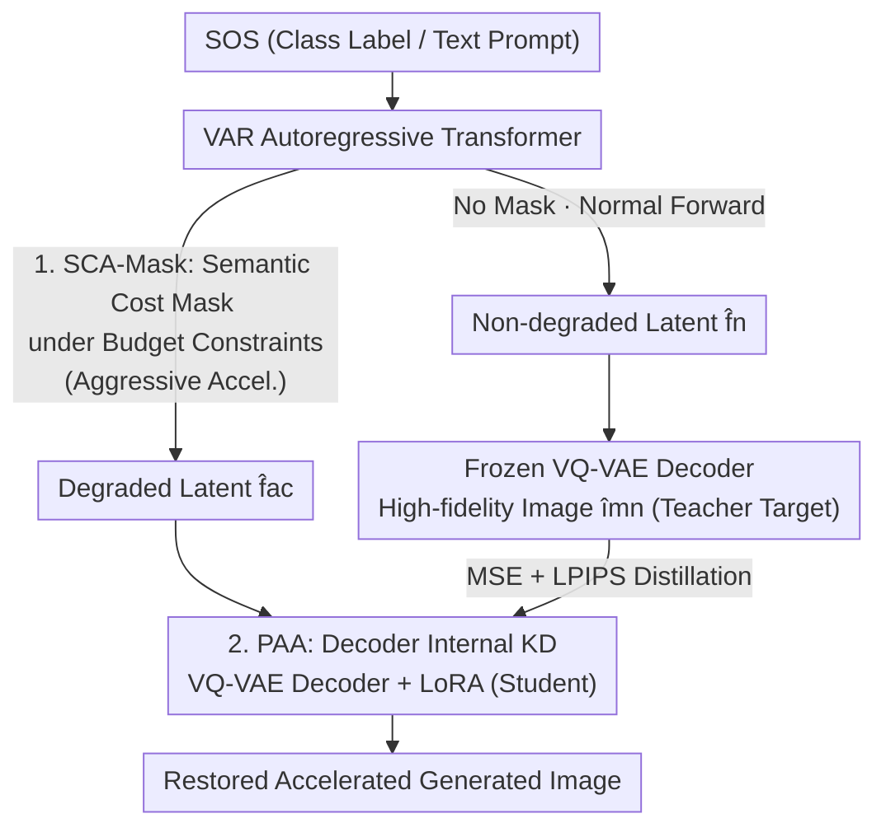

# RADAR: VQ-VAE Decoder of VAR is a Good Student for Restoring Against Degradation by Acceleration

**Conference**: CVPR 2026  
**Paper**: [CVF Open Access](https://openaccess.thecvf.com/content/CVPR2026/html/Wang_RADAR_VQ-VAE_Decoder_of_VAR_is_a_Good_Student_for_CVPR_2026_paper.html)  
**Code**: None  
**Area**: Image Restoration / Visual Autoregressive Generation / Inference Acceleration  
**Keywords**: VAR Acceleration, Attention Masking, Knowledge Distillation, VQ-VAE Decoder, LoRA

## TL;DR
To address the issue of latent representation degradation and decreased image quality in Visual Autoregressive (VAR) models after acceleration, this paper proposes RADAR, a two-stage framework. First, the Semantic Cost-Aware Mask (SCA-Mask) converts attention pruning into an optimization problem of "retaining maximum semantic information under budget constraints." Second, Post-Acceleration Adaptation (PAA) utilizes a LoRA attached to the VQ-VAE decoder and uses the unaccelerated branch as a teacher for internal knowledge distillation to restore degraded latent representations into high-fidelity images. This achieves approximately 1.6–1.9× speedup on ImageNet-1K with almost no loss in FID (restoring VAR-d20 from a degraded 5.02 back to 2.68, compared to the original 2.61).

## Background & Motivation
**Background**: Visual Autoregressive (VAR) modeling replaces traditional token-by-token raster scanning with "coarseto-fine next-scale prediction," allowing GPT-style Transformers to surpass diffusion models in image generation for the first time. This has rapidly led to an ecosystem including text-to-image (Infinity), image editing, and multi-modal understanding (VARGPT).

**Limitations of Prior Work**: VAR inference remains slow. Mainstream acceleration strategies involve adding masks to attention layers—either pruning tokens that have minimal impact on the final image or compressing the context tokens used at each step. However, designing "where to prune" for VAR is exceptionally difficult because each step predicts an entire new scale in parallel, and initial coarse scales continuously influence the whole image. The authors observed two strong biases in attention maps—**coarse-scale attention sinks** (early scale tokens absorb excessively high weights, similar to streamingLLM) and **strong spatial locality** (intra-scale attention follows a near-diagonal block structure). This means pruning attention at different positions/steps/scales causes **non-uniform** damage to image quality.

**Key Challenge**: Existing methods (such as LiteVAR using diagonal patterns for handcrafted masks or HACK manually splitting attention heads) rely on heuristic inductive biases, **lacking a quantitative criterion** to measure "how much semantic information is lost during pruning/compression." Consequently, the trade-off between acceleration and quality cannot be explicitly optimized, and the "cost of acceleration" remains unclear. More critically, prior work focuses almost exclusively on accelerating the autoregressive Transformer, **completely ignoring the decoder**. Once the Transformer is aggressively accelerated, the latent sequence fed into the VQ-VAE decoder inevitably degrades. Repairing this usually requires massive GPU-hours to retrain the entire large Transformer (e.g., MVAR).

**Key Insight**: The authors noted that the VQ-VAE decoder has only about 100M parameters, accounting for a small portion of total inference latency, yet has been long overlooked. It possesses strong visual modeling capabilities (in Token-Opt, it can even generate meaningful images independently of the Transformer). Since the decoder is the final stop from "latent sequence → pixels," can this **small yet powerful decoder act as a student to specifically learn how to restore degraded latents into high-fidelity images**?

**Core Idea**: Replace "hand-crafted masks + retraining large Transformers" with a two-stage path: "Optimizable semantic cost masks (deciding how aggressively to prune) + Lightweight distillation adaptation on the decoder (fixing what was pruned away)." This provides a data-independent, low-cost, and trade-off-friendly acceleration path for VAR.

## Method

### Overall Architecture
RADAR splits VAR acceleration into **two stages, each handling a specific task**: The first stage uses SCA-Mask on the autoregressive Transformer side to "dare to prune"—automatically calculating an attention mask that retains the most semantics under a given compute/memory budget to gain throughput. The second stage uses PAA on the VQ-VAE decoder side to "be able to fix"—attaching a LoRA to the frozen decoder and using internal knowledge distillation from a dual-branch forward pass to learn how to restore the degraded latents. Neither stage requires retraining the massive autoregressive Transformer or using external image data.

The data flow is as follows: The input (SOS token for class labels or text prompts) passes through the VAR Transformer. The normal branch produces the non-degraded latent $\hat{f}_n$, while the accelerated branch (with SCA-Mask) produces the degraded latent $\hat{f}_{ac}$. The former is passed through the original frozen decoder to produce a high-fidelity image $\hat{im}_n$ as the teacher target, while the latter is restored by the "Decoder + LoRA" student. During testing, only the accelerated branch is kept, so PAA adds zero inference overhead.

### Key Designs

**1. SCA-Mask: Transforming "Where to Prune" into Semantic Retention Optimization under Constraints**

This design addresses the pain point that the cost of acceleration is unclear and the trade-off cannot be explicitly optimized. The authors start from first principles: the value of attention (and the source of redundancy) lies in the information exchange between different local image regions. Thus, **the semantic importance of a region = the frequency of its information exchange with other regions**. Specifically, each attention matrix is partitioned into tiles aligned with GPU compute granularity (e.g., 64×64 or 128×128). When the average token attention score of a tile-to-tile block exceeds a threshold $\tau$, it is recorded as an "effective interaction." Two types of scores are accumulated across the generation process:

$$\text{Score}_Q(\text{tile}_{i,j}) = \sum_{k=1}^{K} T^{Q}_{ijk}, \qquad \text{Score}_{KV}(\text{tile}_{i,j}) = \sum_{k=1}^{K} T^{KV}_{ijk}$$

where $k$ indexes the generation step and $K$ is the total number of steps. $T^{Q}_{ijk}$ is the number of tokens in the tile whose queries effectively attend to other tiles (measuring its activity as a "questioner"), and $T^{KV}_{ijk}$ is the number of tokens in the tile whose keys/values are effectively queried by other tiles (measuring its activity as "context"). With semantic scores, the mask design is formulated as a budget-constrained optimization: let $x_{ij}\in\{0,1\}$ indicate whether to keep the attention calculation for $\text{tile}_{i,j}$, and $y_{ij}\in[0,1]$ indicate what percentage of KV to keep in the cache, then:

$$\max_{x,y}\ \alpha \sum_{i,j}\text{Score}_Q(\text{tile}_{i,j})\,x_{ij} + \beta \sum_{i,j}\text{Score}_{KV}(\text{tile}_{i,j})\,y_{ij}$$

Subject to $\sum_{i,j} c_{ij} x_{ij}\le C_{budget}$ and $\sum_{i,j} m_{ij} y_{ij}\le M_{budget}$. This objective maximizes the retained semantic content (equivalent to minimizing context loss) under compute budget $C_{budget}$ and memory budget $M_{budget}$. Reducing the budget values automatically yields more aggressive acceleration. Since FLOPs/memory per tile are approximately equal on modern GPUs ($c_{ij}\approx c$, $m_{ij}\approx m$), the constraint simplifies to "number of tiles kept ≤ budget." This can be solved once before inference using a small batch (approx. 50K images) as a mixed-integer programming problem. During inference, masked tiles skip attention calculation, and their KVs are compressed proportionally. This is "daring to prune"—where pruning intensity is controllable and every cut seeks to preserve high semantic value.

**2. PAA: Decoder as a Student for Restoring High-Fidelity from Degraded Latents via Internal KD**

This design targets the issue where accelerated latents degrade and fixing them requires expensive retraining of the large Transformer. The core is a **dual-branch forward pass**: for the same SOS token, the VAR Transformer perform a normal forward pass to get $\hat{f}_n$ and an accelerated forward pass with SCA-Mask to get the degraded $\hat{f}_{ac}$. The frozen decoder processes $\hat{f}_n$ to get the high-fidelity image $\hat{im}_n$ (teacher output). The same decoder, **paralleled with a LoRA**, processes $\hat{f}_{ac}$ to get the student output $\hat{im}_{ac}$. The training goal is to align the student with the teacher:

$$\hat{f}_n = \text{VAR}(\text{sos};\,\text{normal}),\quad \hat{f}_{ac} = \text{VAR}(\text{sos};\,\text{accelerated})$$
$$\hat{im}_n = \text{Dec}(\hat{f}_n),\quad \hat{im}_{ac} = \text{Dec}(\hat{f}_{ac};\,W+\Delta W)$$
$$\mathcal{L}_{KD} = \lambda_m \mathcal{L}_{MSE}(\hat{im}_n,\hat{im}_{ac}) + \lambda_p \mathcal{L}_{LPIPS}(\hat{im}_n,\hat{im}_{ac})$$

where $\Delta W = \frac{\alpha}{r}BA$ is the low-rank LoRA increment added to the frozen decoder weight $W$. The loss combines pixel-level MSE and perceptual LPIPS. Only the LoRA is learnable; all VAR blocks and decoder weights are frozen. This is essentially Internal Knowledge Distillation (IKD): the unaccelerated branch + original decoder is the teacher, while the accelerated branch + LoRA decoder is the student. Minimizing $\mathcal{L}_{KD}$ allows the LoRA to learn to compensate for degradation caused by acceleration. It is much lighter than original IKD (which uses the whole BERT as a teacher for self-distillation): it is **data-independent** (teacher targets are generated online from SOS/prompts), requires few LoRA iterations, and the dual-branch reuse of the frozen model keeps peak memory nearly identical to standard VAR inference. At test time, the teacher branch is discarded, incurring zero extra inference overhead. Being plug-and-play, it can be directly applied to existing methods like FastVAR, ScaleKV, or SkipVAR for quality compensation.

### Loss & Training
PAA uses AdamW with a base learning rate of 3e-6 and weight decay of 1e-5. The VQ-VAE decoder is fine-tuned for 10k iterations with early stopping to prevent catastrophic forgetting. The batch size is 16 per GPU (with gradient accumulation for stability). The distillation loss is a weighted combination of MSE and LPIPS ($\lambda_m, \lambda_p$). SCA-Mask requires no training and is a one-time mixed-integer programming solution before inference.

## Key Experimental Results

### Main Results
On ImageNet-1K class-conditional generation (single RTX 5090, FlexAttention, without FlashAttention/FP16), cutting the compute budget of VAR by 50% and memory budget by ~40% yields the "degraded version," then RADAR restoration is applied:

| Model | FID↓ | IS↑ | Precision↑ | Recall↑ | Throughput↑ |
|-------|------|-----|-----------|---------|-------------|
| VAR-d20 | 2.61 | 295.3 | 0.83 | 0.54 | 51.4 it/s |
| VAR-d20 Degraded | 5.02 | 269.8 | 0.78 | 0.51 | 94.4 it/s |
| VAR-d20 + RADAR | 2.68 | 293.1 | 0.83 | 0.54 | 92.7 it/s (1.92×) |
| VAR-d24 Degraded | 4.29 | 275.5 | 0.69 | 0.53 | 57.8 it/s |
| VAR-d24 + RADAR | 2.19 | 298.2 | 0.83 | 0.56 | 57.9 it/s (1.80×) |
| VAR-d30 Degraded | 3.58 | 283.4 | 0.80 | 0.52 | 38.9 it/s |
| VAR-d30 + RADAR | 2.01 | 306.2 | 0.85 | 0.58 | 35.7 it/s (1.57×) |

RADAR maintains a throughput increase of ~1.6–1.9× while pulling the degraded FID back to near-original levels (d20: 5.02→2.68 vs. original 2.61). Precision and Recall are also restored to levels comparable to or higher than the original VAR. Comparison with existing acceleration methods (based on Infinity text-to-image, GenEval metrics):

| Method | Throughput↑ | FID↓ | GenEval↑ |
|--------|-------------|------|----------|
| Infinity | 1.32 it/s | 19.61 | 0.73 |
| + ScaleKV | 1.87 it/s | 22.45 | 0.64 |
| + FastVAR | 1.98 it/s | 26.44 | 0.60 |
| + RADAR | 2.08 it/s | 22.97 | 0.69 |

RADAR preserves the best GenEval (0.69, close to the original 0.73) even at the highest throughput, and its FID outperforms FastVAR. Furthermore, applying the modules to VARGPT-v1.1 (SCA-Mask for visual encoder and LLM, PAA for LM head and top layers) achieved a 1.6× speedup on GQA/TextVQA/VQAv2 with only marginal performance drops, still outperforming models like Qwen-VL-Chat and LLaVA-1.5. This indicates the method extends beyond image synthesis to multi-modal understanding.

### Ablation Study
VAR-d20 @256×256, average of 10 runs:

| Configuration | FID↓ | GFLOPs↓ | Latency(ms)↓ | Description |
|---------------|------|---------|-------------|-------------|
| Vanilla VAR | 2.61 | 81.25 | 5458±57 | Original Baseline |
| + SCA-Mask | 5.02 | 64.47 | 2895±88 | Pruning only: FLOPs/Latency nearly halved, but FID worsened significantly |
| + PAA | 2.88 | 81.44 | 5403±48 | Distillation only (no acceleration): Slight drop as no accelerated branch exists as teacher |
| + full RADAR | 2.68 | 64.47 | 2964±84 | Pruning + Distillation: Latency ≈ halved and FID nearly restored |

### Key Findings
- **Synergy is Essential**: Acceleration gains come from SCA-Mask, while quality restoration relies on PAA; they must be used together. Using SCA-Mask alone reduces FLOPs from 81.25 to 64.47 and latency from 5458ms to 2895ms, but FID crashes from 2.61 to 5.02. Using PAA alone (without acceleration) actually causes a slight drop (2.61→2.88) because there is no "accelerated vs. normal" disparity to provide a teacher signal. Only their combination achieves both speed and quality.
- **Zero Inference Overhead**: The latency of full RADAR (2964ms) is nearly identical to using only SCA-Mask (2895ms), proving the LoRA student is virtually cost-free during inference.
- **Extreme GPU-hour Efficiency**: Compared to MVAR which requires retraining, RADAR achieves higher acceleration ratios while consuming **over 20×** fewer GPU-hours. This is primarily because the VQ-VAE decoder forward pass is much faster than VAR blocks, and PAA itself is lightweight.
- **Plug-and-play Compensation**: Attaching PAA to FastVAR/ScaleKV/SkipVAR significantly mitigates the irreversible degradation caused by aggressive acceleration (e.g., recovering FastVAR's 73.0% loss).

## Highlights & Insights
- **"Decoder as Student" is a Free Lunch**: While others focus on retraining large Transformers, this work does the opposite—the VQ-VAE decoder is small (~100M), fast, and expressive. Training it to "repair degraded latents" uses 20× less compute for equivalent quality. This is a transferable perspective: when the upstream is aggressively compressed/quantized, it is better to let the downstream small module learn a "correction mapping."
- **Formalizing Heuristic Masks as Constrained Optimization**: Using "information exchange frequency" to define tile semantic scores and solving it via mixed-integer programming allows acceleration intensity to be explicitly controlled by a single knob ($C_{budget}/M_{budget}$), answering the previously unclear question of "acceleration cost."
- **Data-independent Distillation**: Teacher targets are generated online from SOS/prompts. The dual-branch reuse of the frozen model means peak memory is roughly equivalent to standard inference, making it highly practical for engineering.
- **Cross-task Adaptability**: The same modules can accelerate class-conditional/text-to-image synthesis and multi-modal understanding (VARGPT), showing the "prune + repair" paradigm is not tied to a specific generation task.

## Limitations & Future Work
- **Teacher Signal Dependency**: PAA requires a normal forward pass to act as a teacher. Training with dual branches is more expensive than a single branch (though discarded at test time). If acceleration is so extreme that the normal branch cannot provide a meaningful target, distillation will fail.
- **Calibration Data for Masking**: SCA-Mask semantic scores are accumulated over a subset of ~50K images. Whether this statistics remains representative when shifting data domains/tasks is not deeply discussed ⚠️.
- **Restoration is not Lossless**: There is a small residual FID gap (e.g., d20 2.68 vs. original 2.61), and the acceleration ratio decreases as the model size increases (d20 can reach 1.92×, while d30 only 1.57×). There is an acknowledgment that some "irreversible degradation" can only be constrained, not eliminated.
- **Hyperparameter Sensitivity**: The paper does not provide a systematic analysis of sensitivity to threshold $\tau$ or weights $\alpha, \beta, \lambda_m, \lambda_p$, which might require tuning in actual deployment.

## Related Work & Insights
- **vs. LiteVAR / HACK (Handcrafted Masks)**: These rely on observing diagonal patterns or manually splitting heads, lacking quantitative criteria. RADAR uses tile semantic scores + budget-constrained optimization to automatically find the optimal mask with explicit control over acceleration intensity.
- **vs. FastVAR / ScaleKV / SkipVAR (Other Accel)**: These only perform token selection/context compression on the Transformer side without compensating for decoder-side degradation. RADAR provides a better trade-off (better GenEval/FID at the same throughput) and PAA can be used to provide quality compensation for these methods.
- **vs. MVAR (Retraining-based)**: MVAR retrains the autoregressive Transformer, consuming massive GPU-hours. RADAR only trains the LoRA on the decoder side, saving 20× the compute while achieving higher acceleration.
- **Insight**: The problem of "acceleration/quantization/pruning degradation" in expensive upstream modules can be transformed into a data-independent correction via internal knowledge distillation in cheap downstream modules—this strategy is applicable to any "large encoder + small decoder" or "heavy backbone + light head" cascaded system.

## Rating
- Novelty: ⭐⭐⭐⭐ First to treat the decoder as a "student for repairing degradation" and formalize mask design as a budget-constrained optimization. Deeply insightful, although components (constrained pruning + LoRA distillation) have mature precursors.
- Experimental Thoroughness: ⭐⭐⭐⭐ Covers three VAR depths + text-to-image + multi-modal VQA + comparisons with retraining/non-compensated baselines. Ablations are clear, though cross-domain robustness is slightly lacking.
- Writing Quality: ⭐⭐⭐⭐ Motivation (attention biases → non-uniform pruning cost) and methodology are well-explained. Figure 3 provides an intuitive comparison of four categories of methods.
- Value: ⭐⭐⭐⭐ Data-independent, low-cost, and plug-and-play, offering direct practical value for deploying VAR-based generation models.

<!-- RELATED:START -->

## Related Papers

- [\[CVPR 2026\] Degradation-Robust Fusion: An Efficient Degradation-Aware Diffusion Framework for Multimodal Image Fusion in Arbitrary Degradation Scenarios](degradation-robust_fusion_an_efficient_degradation-aware_diffusion_framework_for.md)
- [\[ICML 2025\] ε-VAE: Denoising as Visual Decoding](../../ICML2025/image_restoration/epsilon-vae_denoising_as_visual_decoding.md)
- [\[CVPR 2026\] Physically-Grounded Turbulence Mitigation with Frame-Shared Degradation Parameters](physically-grounded_turbulence_mitigation_with_frame-shared_degradation_paramete.md)
- [\[ICLR 2026\] VARestorer: One-Step VAR Distillation for Real-World Image Super-Resolution](../../ICLR2026/image_restoration/varestorer_one-step_var_distillation_for_real-world_image_super-resolution.md)
- [\[CVPR 2026\] RAW-Domain Degradation Models for Realistic Smartphone Super-Resolution](rawdomain_degradation_models_smartphone_sr.md)

<!-- RELATED:END -->
