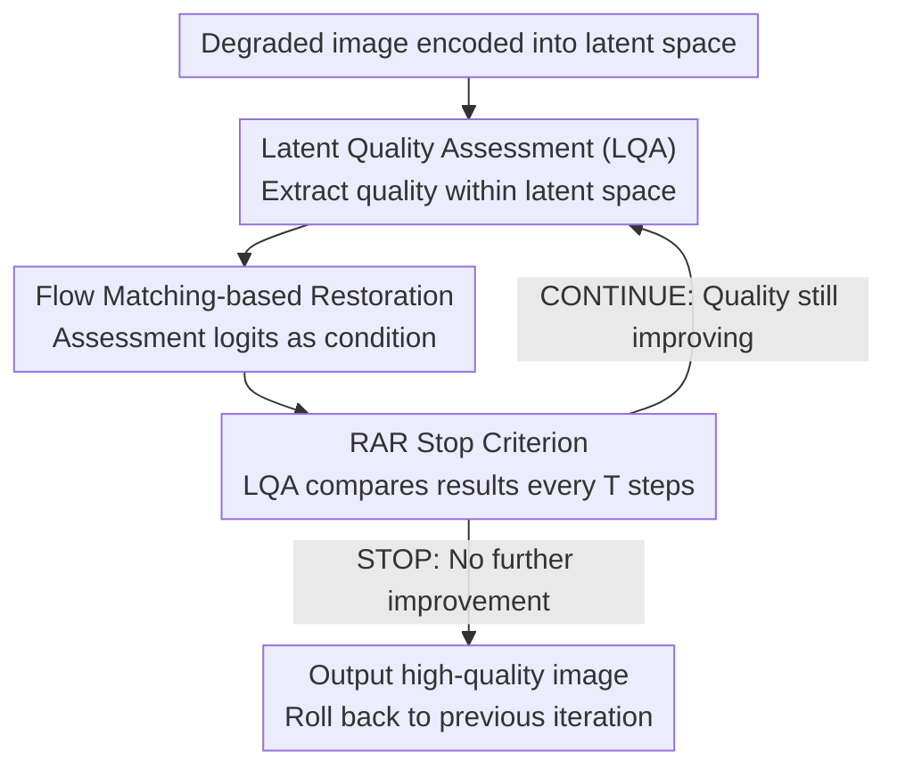

# RAR: Restore, Assess, Repeat - A Unified Framework for Iterative Image Restoration

**Conference**: CVPR 2026  
**arXiv**: [2603.26385](https://arxiv.org/abs/2603.26385)  
**Code**: [https://restore-assess-repeat.github.io/](https://restore-assess-repeat.github.io/)  
**Area**: Image Restoration  
**Keywords**: Image Restoration, Image Quality Assessment, Iterative Restoration, Composite Degradation, Flow Matching

## TL;DR

RAR deeply integrates Image Quality Assessment (IQA) and Image Restoration (IR) into a unified end-to-end model. It iteratively executes an "assess-restore-verify" loop within the latent space, achieving a +2.71 dB PSNR gain in composite degradation scenarios while operating 11.27× faster than AgenticIR.

## Background & Motivation

In real-world scenarios, image degradations are complex and unknown, often involving simultaneous artifacts such as blur, noise, and rain/fog. Existing solutions generally fall into two categories: All-in-one models (a single model handling various degradations, but with limited performance) and Agentic models (agents iteratively selecting specialized tools, which are effective but extremely slow).

**Key Challenge**: All-in-one models lack precise degradation identification capabilities, while Agentic models' IQA and IR modules are completely decoupled—requiring repetitive image encoding/decoding and LLM planning, leading to a bloated process and significant information loss.

**Key Insight**: This work combines the advantages of both approaches—utilizing VLM-based free-text IQA (not limited to predefined degradation categories) and deeply integrating IQA and IR into the same latent space to achieve an end-to-end trainable iterative restoration process.

## Method

### Overall Architecture

RAR addresses restoration under "composite and unknown degradations." It identifies current artifacts, performs targeted restoration, and determines when to terminate the process. The core mechanism compresses IQA and IR into a shared latent space for cyclic operation—using DepictQA as the IQA backbone and SD3.5 as the IR backbone, aligned via two lightweight adapters. A degraded image is encoded into the latent space where the Latent Quality Assessment (LQA) module extracts the current quality. The assessment results are fed directly as conditions for the IR module without text conversion. The restored result is then re-evaluated by the LQA. This "assess → restore → re-assess" loop continues iteratively until the LQA determines that quality no longer improves. The entire restore-assess-repeat cycle is an end-to-end trainable unit rather than a pipeline of independent models scheduled by an LLM.

### Key Designs

**1. Latent Quality Assessment (LQA): Integrating IQA into the IR latent space for end-to-end connectivity**

A fatal bottleneck in previous Agentic solutions was the total decoupling of IQA and IR—assessment results had to be decoded into text and then re-encoded by the IR text-condition branch, while the image required repeated encoding/decoding each round. LQA bridges this gap with two adapters: the Input Adapter $\mathcal{A}_I$ connects the IR latent codes directly to the IQA input space, bypassing image decoding; the Output Adapter $\mathcal{A}_Q$ aligns IQA output logits directly to the IR condition embedding space, skipping "text decoding + text encoding." This allows the assessment signals to flow continuously within the latent space, eliminating the IQA→Text→IR information bottleneck and reducing parameter-driven latency. Training is conducted in two stages: first training the adapters to establish the pathway, followed by full-parameter fine-tuning for backbone synergy.

**2. Flow Matching-based Direct Mapping: Ensuring interpretable intermediate states for iterative assessment**

This design serves the goal of "repeatedly assessing quality during iteration." Traditional diffusion models start from pure noise, meaning intermediate steps consist of noisy latent variables which LQA cannot evaluate. RAR employs Flow Matching to directly learn the velocity field from the degradation distribution $\rho_{deg}$ to the high-quality distribution $\rho_{hq}$:

$$\mathcal{L}_v = \mathbb{E}\,\bigl\|v_\theta(\mathbf{z}_t^n, Q_{deg}^n, t) - (\mathbf{z}_{hq} - \mathbf{z}_{deg}^n)\bigr\|^2$$

Since the trajectories are linear interpolations between the degraded and target images, the intermediate state $\mathbf{z}_t^n$ at any time step $t$ represents a "meaningful image" (a transitional state between degradation and high quality), allowing LQA to provide effective assessments. This physical interpretability of Flow Matching intermediate representations is what enables the "assess-while-restoring" loop—a core reason why RAR avoids noise-based diffusion schemes.

**3. RAR Stop Criterion: Adaptive termination via comparative IQA capability**

Composite degradations vary across images; a fixed number of iterations might result in insufficient restoration or wasted computation. RAR invokes LQA every $T$ steps to compare the quality before and after the current restoration segment. As the DepictQA backbone natively supports image pair comparison, LQA outputs a binary decision: CONTINUE (new image is better) or STOP (quality no longer improves, terminate and revert to the previous result). This allows each image to receive a natural number of iterations based on its degradation severity.

### Loss & Training

The training objective combines the Flow Matching velocity field loss $\mathcal{L}_v$ with the IQA training loss. Crucially, the RAR iterative process is seamlessly embedded into standard Flow Matching training—LQA can be invoked at any time step to update IR conditions, meaning the "assess-restore" loop is a learned behavior rather than just inference-time logic.

## Key Experimental Results

### Main Results

| Method | Composite PSNR↑ | MANIQA↑ | CLIP-IQA↑ | Speed |
|------|-------------|---------|-----------|------|
| AgenticIR | 21.04 | 0.3071 | 0.4474 | 1× |
| AutoDIR | 19.64 | 0.2500 | 0.3767 | — |
| MiOIR | 20.84 | 0.2451 | 0.3933 | — |
| **Ours (RAR)** | **20.46** | **0.4659** | **0.6566** | **11.27×** |

RAR significantly leads in perceptual metrics (MANIQA, CLIP-IQA) and operates 11.27× faster than AgenticIR.

### Ablation Study

| Configuration | Key Metric | Description |
|------|---------|------|
| W/o LQA (Fixed text condition) | Significant drop | Dynamic assessment conditions are vital |
| Diffusion instead of Flow Matching | IQA failure | Noisy intermediate states are non-assessable |
| W/o Iteration (Single pass) | Incomplete restoration | Iteration is necessary for composite artifacts |
| Full RAR | Optimal | All components synergize effectively |

### Key Findings

- Flow Matching's direct mapping is a critical design choice for iterative restoration—the noise injection process of diffusion models is fundamentally incompatible with iterative IQA assessment.
- The iterative process naturally prioritizes degradations (e.g., "denoise then deblur"), aligning with the principle of processing from easy to difficult degradations.
- End-to-end integration offers massive advantages in latency and performance compared to pipeline-based solutions.

## Highlights & Insights

- **Deep IQA-IR Integration**: Transitioning from "collaborating independent models" to "dual capabilities of a single model." This paradigm is transferable to other tasks requiring an assess-act loop.
- **Unintended Advantage of Flow Matching**: An overlooked benefit of Flow Matching over diffusion is the physical meaning of its intermediate states, which makes iterative evaluation possible.
- **Stop Criterion Design**: Using the comparative capability of IQA to determine termination elegantly solves the problem of "how many iterations are enough."

## Limitations & Future Work

- PSNR is lower than AgenticIR in certain settings (trade-off between fidelity and perceptual quality).
- Performance depends on DepictQA's assessment ability; it may fail on degradation types the backbone has not encountered.
- The stop criterion might lack robustness in specific edge cases.
- Future work could explore integration with larger generative models.

## Related Work & Insights

- **vs AgenticIR**: AgenticIR uses LLM planning + specialized tools, which is powerful but slow; RAR integrates assessment and restoration, performing 11× faster and being end-to-end trainable.
- **vs AutoDIR**: AutoDIR uses CLIP for degradation classification (closed-set); RAR uses DepictQA for free-text evaluation (open-set), providing stronger generalization.
- **vs PromptIR/MiOIR**: All-in-one methods lack dynamic assessment capabilities and struggle with complex composite degradations.

## Rating

- Novelty: ⭐⭐⭐⭐⭐ Integration in latent space + Flow Matching iteration is highly innovative.
- Experimental Thoroughness: ⭐⭐⭐⭐⭐ Covers composite/single/unknown degradations with both fidelity and perceptual metrics.
- Writing Quality: ⭐⭐⭐⭐⭐ Clear architecture, rigorous logic, and excellent illustrations.
- Value: ⭐⭐⭐⭐⭐ Represents a paradigmatic contribution to the image restoration field.

<!-- RELATED:START -->

## Related Papers

- [\[CVPR 2026\] Retrieve-to-Restore: Efficient All-in-One Image Restoration with a Retrieval-Based Degradation Bank](retrieve-to-restore_efficient_all-in-one_image_restoration_with_a_retrieval-base.md)
- [\[CVPR 2026\] Toward Real-world Infrared Image Super-Resolution: A Unified Autoregressive Framework and Benchmark Dataset](real_iisr_infrared_image_super_resolution_autoregressive.md)
- [\[CVPR 2026\] Self-supervised Dynamic Heterogeneous Degradation Modeling for Unified Zero-Shot Image Restoration](self-supervised_dynamic_heterogeneous_degradation_modeling_for_unified_zero-shot.md)
- [\[CVPR 2026\] MMDIR: Multimodal Instruction-Driven Framework for Mixed-Degradation Document Image Restoration](mmdir_multimodal_instruction-driven_framework_for_mixed-degradation_document_ima.md)
- [\[CVPR 2026\] More Than Meets the Eye: A Unified Image Fusion Framework via Semantic-Pixel Entropy Trade-off for Zero-Shot Generalization](more_than_meets_the_eye_a_unified_image_fusion_framework_via_semantic-pixel_entr.md)

<!-- RELATED:END -->
