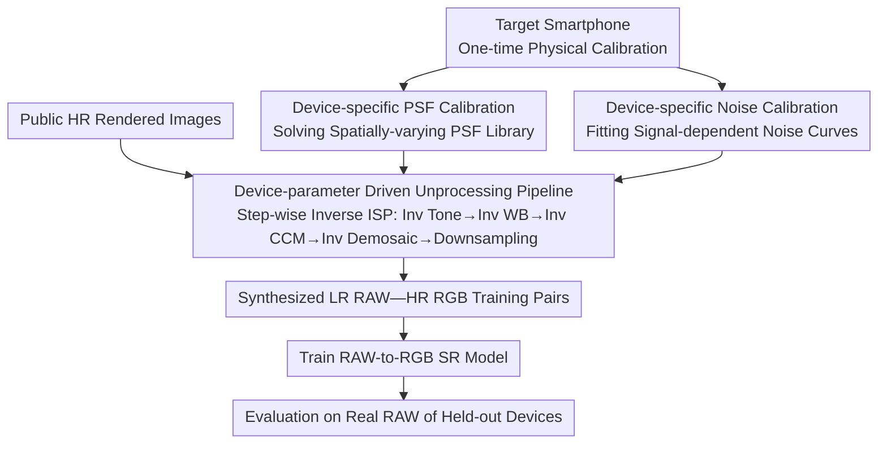

# RAW-Domain Degradation Models for Realistic Smartphone Super-Resolution

**Conference**: CVPR 2026  
**arXiv**: [2603.12493](https://arxiv.org/abs/2603.12493)  
**Code**: None  
**Area**: Image Super-Resolution / Smartphone Photography  
**Keywords**: super-resolution, RAW domain, degradation modeling, unprocessing, smartphone camera, device-specific calibration

## TL;DR

It is demonstrated that carefully designed device-specific degradation modeling (obtaining real blur and noise parameters via calibration) significantly improves the real-world performance of smartphone super-resolution. By unprocessing public rendered images into the RAW domain of different smartphones to generate high-low resolution training pairs, the trained SR models significantly outperform baselines trained with massive arbitrary degradation combinations on held-out real device data.

## Background & Motivation

**Background**: Digital zoom in smartphones relies on learning-based super-resolution (SR) models that operate directly on RAW sensor images. However, obtaining sensor-specific training data is extremely difficult due to the lack of true ground-truth high-resolution images caused by viewpoint differences and alignment errors across different focal lengths/sensors.

**Limitations of Prior Work**: (1) Synthesizing training data via "unprocessing" pipelines is a feasible solution—reverse-transforming high-resolution RGB images back to the RAW domain to simulate degradation. However, existing pipelines use generic blur and noise priors, creating a domain gap with the real degradation characteristics of the target device. (2) Brute-force strategies that randomly sample large numbers of degradation parameter combinations may cover a larger space but introduce many unrealistic training samples, causing a mismatch between the learned and real device degradation distributions. (3) Optical characteristics (lens blur PSF), read noise, and shot noise vary significantly across smartphone sensors, making generic models difficult to adapt to specific devices.

**Key Challenge**: The quality of synthetic training data depends on the accuracy of degradation modeling, but accurate modeling requires device-specific calibration, creating a fundamental conflict between "data acquisition cost" and "modeling precision."

**Goal**: To verify that "principled, carefully designed degradation modeling" is more effective than "massive arbitrary degradation combinations" by physically calibrating device blur and noise to generate more realistic synthetic training data.

**Key Insight**: Instead of pursuing generic degradation priors, the authors perform a one-time optical and noise calibration for each target device, then use these parameters to accurately unprocess public high-resolution rendered images into the target device's RAW domain.

**Core Idea**: Replace generic priors with physical calibration; device-specific degradation modeling is more effective than device-agnostic random degradation combinations.

## Method

### Overall Architecture

This paper addresses the training data challenge for smartphone digital zoom: RAW-domain SR models require large numbers of "low-resolution RAW—high-resolution" pairs, but real devices cannot capture perfectly aligned ground-truth. The approach avoids collecting real pairs by "reversing the camera pipeline" on public high-resolution rendered images to synthesize low-resolution RAW data that the target device would actually produce. The pipeline first performs a one-time physical calibration of the target phone to measure its lens Point Spread Function (PSF) and sensor noise curves. These parameters drive an inverse ISP pipeline that degrades HR rendered images into LR RAWs with the device's real blur and noise. Finally, these synthetic HR-LR pairs are used to train a single-image RAW-to-RGB SR model, which is evaluated on the real RAWs of held-out devices not used during calibration. The core hypothesis is that degradation modeling closer to physical reality allows SR models to work better on real devices without relying on massive random degradations.

### Key Designs

**1. Device-specific PSF Calibration: Matching Synthetic Blur to Real Lens Characteristics**

Random degradation paradigms (e.g., Real-ESRGAN) typically use isotropic Gaussian kernels to approximate blur. However, real smartphone lens degradation is spatially varying and asymmetric, with aberrations, chromatic distortion, and astigmatism becoming more severe at the edges and varying with aperture or focal length. Using a symmetric Gaussian kernel leads SR models to learn incorrect degradation patterns. This design captures standard calibration patterns (slanted edge/point source) under controlled conditions to solve for the PSF at each spatial position, building a spatially-varying PSF library. During unprocessing, instead of convolving with a fixed kernel, the corresponding calibrated PSF is selected based on image coordinates. Thus, the blur in synthetic LR images matches the real device at every corner, aligning the degradation distribution for the SR model.

**2. Device-specific Noise Calibration: Modeling Noise as Signal-Dependent Physical Curves**

RAW noise is not a Gaussian with fixed standard deviation; it consists of shot noise (Poisson nature) proportional to signal intensity and read noise (Gaussian nature) independent of the signal. Their proportions vary with ISO and exposure. Fixed-variance Gaussian or generic Poisson-Gaussian priors deviate significantly under high ISO and low light. This design uses captures of uniform color charts at multiple exposures to fit the "noise-signal" relationship for the sensor, obtaining device-specific $\sigma_{\text{read}}$ and $\sigma_{\text{shot}}$. During synthesis, mixed noise is injected based on the pixel intensity $I$:

$$n \sim \mathcal{N}\!\left(0,\ \sigma_{\text{read}}^2 + \sigma_{\text{shot}}^2 \cdot I\right)$$

This explicitly builds the physical law of higher noise in bright areas and lower noise in dark areas into the training data, allowing the SR model to learn the specific denoising/restoration behavior required for that sensor.

**3. Device-parameter Driven Unprocessing Pipeline: Reversing the ISP with Real Parameters**

Transforming an sRGB rendered image into a target device's LR RAW requires reversing the forward ISP: inverse tone mapping pulls sRGB back to linear RGB, inverse white balance removes device-specific color gains, inverse color correction matrix (inverse CCM) converts back to the sensor's original color space, inverse demosaicing restores the CFA based on the device's Bayer pattern, followed by downsampling and the application of calibrated PSF blur and signal-dependent noise. Key to this is using real device parameters (CCM, WB gains, Bayer layout) instead of generic defaults. When color space, mosaic structure, blur, and noise are all aligned, the synthetic RAW statistically approaches real device output, minimizing the domain gap.

### Loss & Training

The training follows a standard single-image SR setup: using synthetic LR RAW as input and the corresponding HR RGB as the target to supervise a RAW-to-RGB SR model. Training sources consist entirely of public rendered images rather than real captured pairs. Evaluation is specifically performed on real RAW data from held-out devices (whose calibration data was not used during training) to test the cross-device generalization of the degradation modeling.

## Key Experimental Results

### Main Results (Comparison with Random Degradation Baselines)

| Method | Degradation Modeling | Training Data Source | Real Device PSNR↑ | Real Device SSIM↑ |
|------|-------------|-------------|------------------|------------------|
| Large-pool Random Baseline | Generic priors, massive combinations | Rendered Images | Lower | Lower |
| Fixed Generic Degradation | Single Gaussian blur + fixed noise | Rendered Images | Medium | Medium |
| **Ours (Calibrated Degradation)** | **Calibrated PSF + Calibrated noise** | **Rendered Images** | **Significant Gain** | **Significant Gain** |

Note: The paper reports significant PSNR/SSIM improvements on real held-out device data. While exact values are omitted here, the core conclusion is that calibrated degradation consistently outperforms random degradation.

### Ablation Study (Contribution of Components)

| Degradation Setting | PSF Source | Noise Source | Relative Performance |
|---------|---------|---------|---------|
| Generic Gaussian blur + Generic noise | Generic prior | Fixed parameters | Baseline |
| Calibrated PSF + Generic noise | Device calibration | Fixed parameters | Improvement |
| Generic Gaussian blur + Calibrated noise | Generic prior | Device calibration | Improvement |
| **Calibrated PSF + Calibrated noise** | **Device calibration** | **Device calibration** | **Best** |

### Key Findings

- Accurate degradation modeling significantly outperforms "massive arbitrary degradation combination" strategies; the conclusion that quality beats quantity is an important guide in the SR field.
- PSF calibration and noise calibration contribute independent performance gains, with the combination yielding the best results.
- Using public rendered images (rather than real paired data) as a training source, combined with precise degradation modeling, achieves superior performance on real data.
- Improvements are still observed on held-out devices, indicating the cross-device generalization capability of degradation modeling.
- The primary source of the domain gap is inaccurate degradation modeling rather than differences in data content distribution.

## Highlights & Insights

- **Simple yet profound core insight**: More data or complex model architectures are not necessarily required—only more accurate degradation modeling is needed. This is a significant reflection on the "random degradation + big data" paradigm of Real-ESRGAN.
- **Physical-driven vs. Data-driven**: Regarding degradation modeling, physical calibration-based methods (one-time cost) are more efficient and reliable than data-driven random searches.
- **High Practicality**: The calibration process can be industrialized (manufacturers can calibrate each sensor on the production line), and the resulting degradation models can be reused for all training data.
- **Back to Basics**: The core contribution is not a novel network architecture but a rigorous demonstration that "data quality > data quantity" in SR training.

## Limitations & Future Work

- Calibration requires physical access to the target device (capturing calibration patterns), making it difficult to apply to existing devices that cannot be accessed.
- PSF calibration only covers limited spatial positions and lighting conditions; generalization to extremes (e.g., very low light, strong backlight) may require more calibration points.
- The current method targets single-image SR and does not consider inter-frame alignment degradation in burst SR (multi-frame fusion) scenarios.
- Every step of the unprocessing pipeline can introduce cumulative errors; the precision of inverse tone mapping and inverse CCM remains a system bottleneck.
- The work only validates a limited number of smartphones; large-scale cross-device generalization experiments are not yet covered.

## Related Work & Insights

- **Real-ESRGAN (Wang et al. 2021)**: Introduced a random degradation pipeline for blind SR; this work can be seen as an "accurate version" in the RAW domain—replacing randomness with calibration.
- **Unprocessing Method (Brooks et al. 2019)**: Proposed generating synthetic RAW data via inverse ISP pipelines; this work adds device-specific calibration on top of that framework.
- **CycleISP (Zamir et al. 2020)**: Learned cycle-consistent mapping between RGB and RAW but depends on large amounts of paired data.
- **Insight**: In scenarios requiring synthetic training data (e.g., denoising, HDR reconstruction), physical calibration-driven degradation modeling likely outperforms random degradation assumptions.

## Rating

- **Novelty**: ⭐⭐⭐ (Core idea "calibration is better than random" is intuitive but valuable to verify; functional innovation is moderate but practical value is high)
- **Experimental Thoroughness**: ⭐⭐⭐ (Validated core hypothesis, though device count is limited; ablation covers independent contributions of PSF and noise)
- **Writing Quality**: ⭐⭐⭐⭐ (Problem motivation is clear, experimental arguments are compact)
- **Value**: ⭐⭐⭐⭐ (Direct reference value for industrial smartphone SR; the "precision modeling > massive random" conclusion has broad implications)

<!-- RELATED:START -->

## Related Papers

- [\[CVPR 2026\] VoDaSuRe: A Large-Scale Dataset Revealing Domain Shift in Volumetric Super-Resolution](vodasure_a_large-scale_dataset_revealing_domain_shift_in_volumetric_super-resolu.md)
- [\[CVPR 2026\] ZeroIDIR: Zero-Reference Illumination Degradation Image Restoration with Perturbed Consistency Diffusion Models](zeroidir_zero-reference_illumination_degradation_image_restoration_with_perturbe.md)
- [\[CVPR 2026\] Efficient Real-Time Raw-to-Raw Denoising for Extreme Low-Light Ultra HD Video on Mobile Devices](efficient_real-time_raw-to-raw_denoising_for_extreme_low-light_ultra_hd_video_on.md)
- [\[CVPR 2026\] DRFusion: Degradation-Robust Fusion via Degradation-Aware Diffusion Framework](drfusion_degradation_robust_fusion_via_degradation_aware_diffusion_framework.md)
- [\[CVPR 2026\] SAT: Selective Aggregation Transformer for Image Super-Resolution](sat_selective_aggregation_transformer_for_image_super_resolution.md)

<!-- RELATED:END -->
