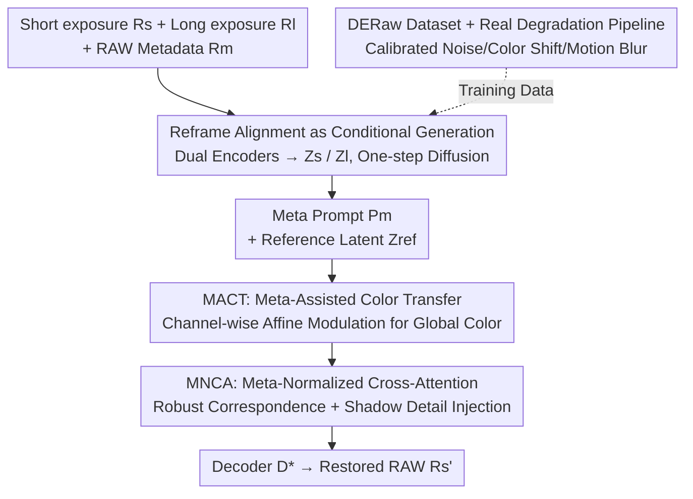

# RawMetaDiff: Unlocking Extreme Darkness from Dual-Exposure RAW with Meta-Guided Diffusion

**Conference**: CVPR 2026  
**Paper**: [CVF Open Access](https://openaccess.thecvf.com/content/CVPR2026/html/Liu_RawMetaDiff_Unlocking_Extreme_Darkness_from_Dual_Exposure_RAW_with_Meta_Guided_Diffusion_CVPR_2026_paper.html)  
**Code**: None  
**Area**: Image Restoration / Diffusion Models / Low-light Enhancement  
**Keywords**: Extreme Dark RAW Restoration, Dual-Exposure, Diffusion Models, RAW Metadata, Cross-Exposure Alignment

## TL;DR
RawMetaDiff reframes the fragile explicit registration of "short/long exposure frames" as a "conditional generation" problem. It uses noisy short-exposure RAW as the diffusion initialization, references a potentially misaligned long-exposure RAW, and is guided by RAW metadata (ISO/CCM/exposure) for one-step latent diffusion. Utilizing MACT for global color transfer and MNCA for shadow detail injection, it achieves a 33% LPIPS improvement on synthetic data and a 15% DeQA gain on real data.

## Background & Motivation
**Background**: Single-frame RAW restoration in extreme darkness is a long-standing challenge in computational photography. Sensor readout signals are heavily contaminated by noise and clipping, creating an information bottleneck where signals in dark regions are either submerged in noise or clipped. Regression-based methods (e.g., Restormer) output blurry or noisy results. Even with diffusion priors, single-frame methods can only "hallucinate" plausible but inaccurate details and color shifts.

**Limitations of Prior Work**: One solution is to capture an additional long-exposure frame for supplementary information (dual-exposure methods like HDR, LSD2, or LSFNet). However, these rely on **explicit cross-exposure alignment**, using classical correspondences like optical flow to register frames. The issue is that extreme exposure differences and non-rigid motion blur from handheld shooting make optical flow extremely fragile. Once registration fails, detail recovery degrades and color fidelity collapses.

**Key Challenge**: Long-exposure frames carry credible global color and shadow details, but utilizing them requires alignment, which is unreliable under large exposure gaps and motion blur. Explicit alignment is fundamentally a bottleneck.

**Goal**: To robustly utilize a "potentially misaligned" long-exposure reference for restoring noisy short-exposure RAW without performing explicit pixel alignment.

**Key Insight**: The authors reframe the task from "alignment" to "conditional generation"—treating the noisy short-exposure RAW as the noisy initialization for diffusion, allowing the diffusion prior to denoise it onto the natural image manifold. The long-exposure frame serves as a **condition** rather than a target for pixel-wise registration. However, preliminary experiments revealed two new challenges: (1) extreme exposure gaps disrupt cross-attention, making correspondences unreliable; (2) naive conditional injection entangles "color transfer" with "detail injection," leading to inaccurate color and decreased fidelity.

**Core Idea**: Use **RAW metadata** (ISO, CCM, exposure parameters describing the physical relationship of the dual exposures) as explicit conditions. This decouples color transfer and detail injection into two complementary mechanisms: MACT handles global color consistency along channels, while MNCA constrains cross-exposure correspondences within a physically feasible range to inject shadow details.

## Method

### Overall Architecture
RawMetaDiff is a **one-step conditional latent diffusion** model. The inputs are noisy short-exposure RAW $R_s$, clean but potentially blurry long-exposure RAW $R_l$ (Bayer single-channel converted to 3-channel linear RAW via bicubic interpolation), and RAW metadata $R_m$ concatenated into a vector. The output is the restored linear RAW $R_s'$.

The pipeline operates as follows: two independent encoders $E_s, E_l$ map $R_s, R_l$ into latent representations $Z_s, Z_l$. An embedder derives two conditional paths from $R_m$ and $Z_l$: the **Meta Prompt** $P_m$ (encoding the physical relationship of the exposures) and the **reference latent** $Z_{ref}$ (carrying complementary information from the long exposure). The UNet backbone uses $Z_s$ as the noisy initialization and performs conditional restoration guided by $P_m$ through two mechanisms: MACT uses $Z_{ref}$ and $P_m$ for channel-level modulation to achieve global color transfer, while MNCA uses $P_m$ to normalize query/key for robust correspondence and shadow detail injection from $Z_{ref}$. Finally, a specialized linear RAW decoder $D^*$ reconstructs $R_s'$ from the high-fidelity latent $Z_s'$.

### Key Designs

**1. Reframing Explicit Alignment as Conditional Generation: Bypassing Fragile Registration with Diffusion Priors**

This addresses the fundamental pain point of dual-exposure methods: explicit cross-exposure alignment inevitably fails under large exposure gaps and motion blur. The authors shift the framework: instead of calculating pixel correspondences, they treat the noisy short-exposure RAW $R_s$ as the "noisy initialization" of the diffusion process. The model denoises it toward the natural image manifold using diffusion priors, while the long-exposure frame acts as conditional information (color statistics + shadow details) without requiring pixel-perfect alignment. This is implemented as a **one-step** conditional latent diffusion (based on a pre-trained SD-2.1 UNet), which benefits from generative priors for realistic textures and is naturally robust to motion misalignment. This step is the prerequisite for the following two mechanisms.

**2. MACT: Meta-Assisted Color Transfer: Decoupling Color Transfer from Detail Injection**

Naive conditional injection entangles color and detail, leading to inaccurate color shifts. MACT aims for robust, global color transfer by capturing global color statistics from the reference latent $Z_{ref}$. Combined with the Meta Prompt $P_m$, these are fed into a lightweight MLP to predict **channel-wise affine modulation parameters**—scaling vectors $\gamma_{1,2}, \alpha_{1,2}$ and translation vectors $\beta_{1,2}$ applied to various Scale/Scale-Shift modulation points in the network. Modulation of an intermediate feature $Z_t$ is:

$$Z_t' = \gamma \odot Z_t + \beta.$$

The novelty lies in using RAW metadata to **stabilize** this process: color correction is anchored by the reference frame's color and constrained by the physical relationship encoded in $P_m$ (response differences across ISO/exposure), thereby suppressing color shifts caused by inconsistent channel responses in $R_s$.

**3. MNCA: Meta-Normalized Cross-Attention: Constraining Cross-Exposure Correspondences within Physical Manifolds**

An "information gap" exists between short and long exposure features, causing naive cross-attention to produce unreliable attention maps. MNCA applies physical constraints to attention using RAW metadata. The key is **Meta-Norm**: specialized scale/shift values are predicted from the Meta Prompt via an MLP to bring the query and key into a comparable distribution across exposures before performing attention:

$$[\gamma_{q,k},\beta_{q,k}]=\text{MLP}(P_m),\quad q=W_Q(\text{LN}(Z_s)\cdot\gamma_q+\beta_q),\quad k=W_K(\text{LN}(Z_{ref})\cdot\gamma_k+\beta_k),$$

The value $v=W_V(Z_{ref})$ is taken only from the well-exposed reference feature to ensure high-quality detail synthesis. Finally, $Z_{ca}=\text{softmax}(qk^\top/\sqrt{d_k})\,v$. This division of labor—Meta-Norm for reliable Q/K correspondence and high-quality V for detail—restricts retrieval to a physically feasible manifold, making it resilient to exposure mismatch.

**4. DERaw Dataset and Real Degradation Pipeline: Aligning Training with Dual-Exposure Physics**

Diffusion training requires vast data, but dual-exposure RAW lacks benchmarks. The authors collected ~1K real-world RAW triplets, **DERaw**: tripod short-exposure (noisy, no blur), handheld long-exposure (natural blur, low noise), and tripod long-exposure (GT). A **real degradation pipeline** then converts sRGB to clean linear RAW via inverse ISP and applies three types of degradation: sensor noise via heteroscedastic Gaussian modeling $n\sim\mathcal{N}(0,\sigma_r^2+y\cdot\sigma_s)$ (shot and readout noise calibrated by ISO); color shifts via brightness-dependent channel scaling $C_k'=f_k(L)\cdot C_k$; and motion blur performed **in the linear RAW domain** using composite kernels sampled from a PSF Kernel Bank. Synthesizing 90K pairs this way ensures histogram statistics closely match real data.

### Loss & Training
A two-stage strategy is used. **Stage 1: Linear RAW VAE Adaptation**: The pre-trained SD-2.1 VAE is fine-tuned to the linear RAW domain using KL + MSE + LPIPS + GAN objectives to obtain a specialized encoder $E^*$ and decoder $D^*$. **Stage 2: Framework Training**: $E_s, E_l$ are initialized with $E^*$. The decoder $D^*$ is frozen, while the dual encoders and the entire UNet are fine-tuned end-to-end using MSE + LPIPS + latent + GAN supervision, concentrating model capacity on feature modulation and injection.

## Key Experimental Results

The dataset includes 90K synthetic pairs and 600 test pairs plus real DERaw. All evaluations are in the sRGB domain with uniform ISP parameters. Baselines include single-frame Restormer, generative RDDM/OSEDiff/HYPIR, and traditional dual-frame fusion LSD2/LSFNet.

### Main Results (Synthetic Data, Table 1)

| Method | PSNR↑ | LPIPS↓ | ∆E↓ | MUSIQ↑ | MANIQA↑ | CLIP-IQA↑ | DeQA↑ |
|------|-------|--------|------|--------|---------|-----------|-------|
| Restormer | 23.74 | 0.4156 | 6.197 | 55.29 | 0.3549 | 0.6787 | 3.381 |
| RDDM | 17.36 | 0.3301 | 16.96 | 61.69 | 0.4171 | 0.6163 | 2.993 |
| LSD2 | 23.07 | 0.2499 | 6.948 | 65.82 | 0.4122 | 0.6069 | 3.629 |
| LSFNet | 22.89 | 0.2629 | 7.655 | 63.76 | 0.3528 | 0.5887 | 3.639 |
| HYPIR | 22.16 | 0.2447 | 7.020 | 66.23 | 0.3881 | 0.5883 | 3.811 |
| **Ours** | **23.74** | **0.1650** | **5.407** | **70.32** | **0.4363** | **0.7008** | **4.115** |

LPIPS improved by ~33% over the second-best (HYPIR 0.2447 vs 0.1650); $\Delta E$ dropped to 5.407. Perception and color metrics are nearly all ranked first. PSNR is comparable to deterministic baselines, striking a balance between pixel fidelity and perceptual realism.

### Main Results (Real DERaw Data, Table 2 - No-reference Metrics)

| Method | NIQE↓ | MUSIQ↑ | MANIQA↑ | CLIP-IQA↑ | DeQA↑ |
|------|-------|--------|---------|-----------|-------|
| LSFNet | 8.070 | 31.82 | 0.2414 | 0.2656 | 1.519 |
| HYPIR | 9.960 | 36.96 | 0.3067 | 0.4269 | 2.017 |
| **Ours** | **7.709** | **44.60** | **0.3352** | **0.4348** | **2.343** |

First place in all five no-reference metrics, with significant leads in MUSIQ and DeQA (~15% gain), demonstrating robustness to real-world complex degradations.

### Ablation Study (Synthetic Data, Table 3)

| Configuration | PSNR↑ | ∆E↓ | MUSIQ↑ | DeQA↑ | CLIP-IQA↑ |
|------|-------|------|--------|-------|-----------|
| w/o Cond. | 21.37 | 7.8052 | 68.99 | 4.067 | 0.6290 |
| w/o MNCA | 21.42 | 7.5449 | 70.57 | 4.063 | 0.6533 |
| w/o MACT | 21.58 | 7.7757 | 71.18 | 4.111 | 0.6729 |
| **Ours (Full)** | **23.59** | **5.5077** | **71.45** | **4.115** | **0.7008** |

### Key Findings
- Removing the long-exposure condition (w/o Cond.) caused PSNR to drop from 23.59 to 21.37 and $\Delta E$ to rise to 7.81, showing the reference frame is an essential information source.
- Removing MNCA resulted in the worst perceptual quality (CLIP-IQA 0.6533) due to insufficient shadow details and artifacts; removing MACT led to high $\Delta E$ and strong color shifts. The two mechanisms are complementary and distinct in their roles (detail vs. color).

## Highlights & Insights
- **Reframing "Alignment" as "Conditional Generation"**: When registration is fundamentally unreliable, shifting to a framework where the diffusion prior handles misalignment as tolerable conditional noise is a powerful paradigm shift applicable to other multi-frame tasks (denoising, burst SR).
- **Physical Metadata as a "Normalizer"**: MNCA's Meta-Norm doesn't just concatenate metadata; it uses it to predict scale/shift to align cross-exposure distributions, constraining attention search to physically feasible manifolds.
- **Decoupling Color and Detail**: Identifying that naive conditions entangle color and detail and subsequently splitting them into MACT (channel-wise color) and MNCA (spatial details) is a logical and effective design pattern.
- **Degradation in the Linear RAW Domain**: Modeling motion blur in the linear RAW domain (before non-linear transformations) is more physically accurate and better preserves highlights compared to blurring in the RGB domain.

## Limitations & Future Work
- The system depends on the availability of RAW metadata (ISO/CCM/exposure), making it inapplicable to cameras that only provide sRGB or lack metadata.
- DERaw is relatively small (~1K triplets), and real-world evaluation relies on no-reference IQA metrics, which may not perfectly align with human perception.
- Calibration parameters in the degradation pipeline are based on specific cameras used by the authors; cross-sensor generalization requires further validation.
- The dual-exposure setup requires a successful long-exposure capture, which remains a limitation for extremely dynamic scenes.

## Related Work & Insights
- **vs. LSFNet / LSD2 (Traditional Fusion)**: These rely on explicit alignment (optical flow) which is fragile under motion; Ours uses conditional generation + meta-guided soft correspondence for much better robustness.
- **vs. Restormer (Single-frame Regression)**: Single frames are information bottlenecks; Ours uses a second frame + generative prior to truly recover missing shadow details.
- **vs. RDDM / HYPIR (Generative Restoration)**: Single-frame diffusion often hallucinates inaccurate details; RawMetaDiff uses long-exposure references + metadata constraints, leading to superior performance with one-step inference efficiency.

## Rating
- Novelty: ⭐⭐⭐⭐⭐ Reframing alignment as conditional generation + meta-normalized attention is fresh and practical.
- Experimental Thoroughness: ⭐⭐⭐⭐ Solid synthetic and real benchmarks, though real-world results lack full-reference metrics.
- Writing Quality: ⭐⭐⭐⭐ Clear logical chain from motivation to diagnosis to solution.
- Value: ⭐⭐⭐⭐ A strong baseline for extreme dark dual-exposure RAW restoration with a useful dataset and pipeline.

<!-- RELATED:START -->

## Related Papers

- [\[CVPR 2026\] NEC-Diff: Noise-Robust Event–RAW Complementary Diffusion for Seeing Motion in Extreme Darkness](nec-diff_noise-robust_event-raw_complementary_diffusion_for_seeing_motion_in_ext.md)
- [\[CVPR 2026\] From Events to Clarity: The Event-Guided Diffusion Framework for Dehazing](from_events_to_clarity_the_event-guided_diffusion_framework_for_dehazing.md)
- [\[CVPR 2026\] Dual Ascent Diffusion for Inverse Problems](dual_ascent_diffusion_for_inverse_problems.md)
- [\[CVPR 2026\] HDW-SR: High-Frequency Guided Diffusion Model based on Wavelet Decomposition for Image Super-Resolution](hdw-sr_high-frequency_guided_diffusion_model_based_on_wavelet_decomposition_for_.md)
- [\[CVPR 2026\] UniLDiff: Unlocking the Power of Diffusion Priors for All-in-One Image Restoration](unildiff_unlocking_the_power_of_diffusion_priors_for_all-in-one_image_restoratio.md)

<!-- RELATED:END -->
