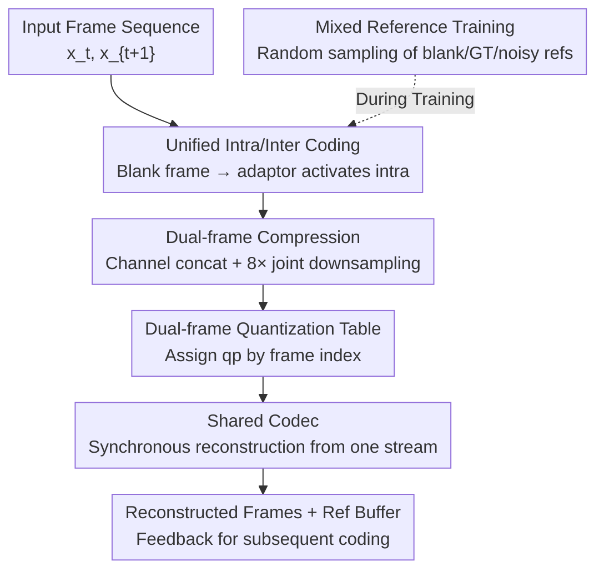

# Real-Time Neural Video Compression with Unified Intra and Inter Coding

**Conference**: CVPR 2026  
**Paper**: [CVF Open Access](https://openaccess.thecvf.com/content/CVPR2026/html/Xiang_Real-Time_Neural_Video_Compression_with_Unified_Intra_and_Inter_Coding_CVPR_2026_paper.html)  
**Code**: https://github.com/ihuixiang/UIIC  
**Area**: Image and Video Restoration  
**Keywords**: Neural Video Compression, Unified Intra/Inter Coding, Dual-frame Compression, Error Propagation, Real-time Codec

## TL;DR
To address the weak intra-coding capability of real-time neural video compression (e.g., DCVC-RT) during scene cuts or new content—which typically causes quality drops, bitrate spikes, and error propagation due to "periodic refresh" mechanisms—this paper proposes a single-model unified intra/inter coding approach. By using dual-frame compression and mixed reference training, the model adaptively switches between intra and inter modes based on reference reliability. It achieves an average bitrate saving of 12.1% (BD-rate) over DCVC-RT while maintaining real-time speed, a smaller model size, and eliminating the need for periodic refresh.

## Background & Motivation

**Background**: Neural Video Compression (NVC) has advanced rapidly. Real-time solutions such as DCVC-RT have surpassed H.266/VVC in compression efficiency while enabling real-time decoding. These methods generally follow the "conditional coding + implicit latent alignment" paradigm, exploiting temporal (inter-frame) references to remove redundancy.

**Limitations of Prior Work**: Most NVC methods focus heavily on inter-redundancy but neglect **intra-coding capability when references are scarce or unreliable**. During scene cuts, there is no temporal correlation between the last frame of the previous scene and the first frame of the new scene. P-frame models are forced to degrade into intra-mode—yet SOTA P-frame models have very weak intra-coding capabilities, leading to massive quality drops and error propagation. Recent solutions introduce "periodic feature refresh" (reconstructing accumulated features into 3-channel pixel maps to be re-fed as references), but this has two major drawbacks: (1) it discards valuable long-term temporal information and details of occluded objects along with the errors; (2) it causes bitrate spikes at refresh points, risking network congestion and hindering deployment.

**Key Challenge**: It is difficult to simultaneously achieve low bitrate, high quality, and real-time speed in reference-scarce scenarios. SOTA methods still rely on an **independent, heavyweight I-frame model** to handle these cases. However, integrating such heavy intra-coding complexity into the inter-frame pipeline slows down inference, which is critical for low-latency applications.

**Goal**: To unify intra and inter coding within a single model, allowing it to adaptively balance both modes based on current reference error levels, while enhancing robustness in reference-scarce scenarios without sacrificing real-time speed.

**Key Insight**: Return to the wisdom of classical video coding—standard codecs allow for local switching to intra-mode within inter-coded frames (to handle new content or complex motion). This idea of "embedding intra tools within inter coding" is brought into the NVC framework.

**Core Idea**: Train a unified model capable of adaptive intra/inter coding. During the first frame or scene cuts, a "blank frame" is fed through an adaptor to generate reference features, activating intra-coding capability. Furthermore, "dual-frame compression" is used to leverage backward references to compensate for intra-coding weaknesses under complexity constraints.

## Method

### Overall Architecture
The model, named UI2C (Unified Intra and Inter Coding), is built upon the real-time codec DCVC-RT. It removes the dedicated I-frame model and unifies intra/inter coding into a single spatio-temporal network. When encoding $x_t$ where $t$ is even, a 1-frame delay is introduced to wait for $x_{t+1}$. The two frames are concatenated along the channel dimension, subjected to 8× joint downsampling, and fed into a shared codec. This leverages both forward (decoded frames) and backward ($x_{t+1}$) redundancies. The decoder reconstructs both frames simultaneously from a single bitstream and stores fused features in the reference buffer. For "no-reference" cases like the first frame or scene cuts, a blank frame is transformed into reference features via a First-frame Adaptor (ADI), directly invoking the model's inherent intra-coding capability. A "dual-frame quantization table" performs fine-grained bitrate allocation between the two frames, and "mixed reference training" teaches the model to evaluate reference errors and switch modes adaptively.

### Key Designs

**1. Unified Intra/Inter Coding: One Model for Both I and P Tasks**

Traditional NVC uses separate models for I and P frames to allow specialization. However, the first frame (no reference) and scene cuts (no correlation) are essentially the same scenario: "encoding the current frame without available references." The authors argue that **dedicated I-frame models are redundant**. A single unified model can cover both scenarios. During inference, for the first frame or scene cuts, a blank frame (all zeros) is passed through a First-frame Adaptor (ADI) to generate reference features, activating the intrinsic intra-coding capability. For subsequent frames, the same model reuses information-rich reference features for inter-coding. This eliminates dependency on I-frame models (fewer parameters) and naturally intercepts error propagation without manual refresh mechanisms. Experiments show its intra-capability is significantly stronger than the DCVC-RT P-frame model.

**2. Dual-frame Compression: Using Backward References to Compensate for Complexity Constraints**

In real-time streaming, a 1-frame delay is usually acceptable, creating space to use the next frame as a backward reference. The authors concatenate two consecutive frames $x_t, x_{t+1}$ and perform 8× joint downsampling (suppressing irrelevant high frequencies and enhancing feature-level consistency). These are fed into a shared single-stream codec, producing one compact bitstream from which the decoder reconstructs both frames. The key benefit: in reference-scarce scenarios (first frame/scene cut), backward references from $x_{t+1}$ compensate for the lack of forward info, mitigating quality loss of weak intra-coding under constrained complexity. During inter-coding, bi-directional cues better model occlusions and calibrate errors for noisy/imperfect propagated features. This provides a solution for the trade-off between "maintaining low complexity" and "enhancing coding robustness" at the cost of only 1-frame delay.

**3. Dual-frame Quantization Table: Fine-grained Bitrate Allocation by Frame Role**

Jointly compressing two frames introduces an RD-optimization challenge: maintaining the efficiency of a Hierarchical Quality Structure while controlling quality between two co-coded frames. DCVC-RT uses a shared quantization table, but ignores the different reference roles: $x_{t+1}$ serves as a backward reference for $x_t$ and a future reference for subsequent frames, whereas $x_t$ only provides forward context. The authors query a quality parameter $qp$ based on frame index to obtain two different $qp$ values, which then look up different tables for quantization coefficients. These are multiplied with features element-wise for quality control. Specifically, the **later frame is assigned a higher $qp$** to make it a better reference.

**4. Mixed Reference Training: Learning to Evaluate Reference Errors and Switch Adaptively**

To make the unified model effective, the training strategy is crucial. It is not trivial to train a model to dynamically balance intra and inter modes based on error levels. The authors consider three candidates for the initial frame reference: a pure blank signal (zeros), the ground truth (GT) of the previous frame, and a noisy version of that GT. During training, one of these is randomly sampled as the reference for the initial frame, forcing the model to **implicitly evaluate reference error levels**. When references are accurate, it leans on inter-prediction; when references are erroneous or insufficient, it adaptively strengthens intra-coding for error correction. This allows the model to adaptively reinforce intra-coding without manual reference discarding when handling sequences longer than those in training, while avoiding "information-discarding refresh," thus lowering peak bitrates and congestion risks.

### Loss & Training
The model is trained on 7-frame sequences from Vimeo-90k and fine-tuned on longer sequences tailored for DCVC-RT. The loss function is scaled YUV Mean Squared Error (MSE), with hierarchical weights assigned per frame. Multi-rate support is achieved by randomly selecting $qp \in [0, 63]$ per iteration, with $qp$ offsets of $[0,8,0,4,0,4,0,4]$ for groups of 8 frames. Training utilized 8× RTX 4090; testing was conducted on a single RTX 3090 + Xeon Gold 6248R, using YUV420, low-delay, intra-period=-1, with bitrate evaluated via estimated entropy.

## Key Experimental Results

### Main Results

BD-rate (%) relative to the DCVC-RT anchor (0.0) and codec speeds:

| Method | HEVC-B | HEVC-C | HEVC-D | HEVC-E | MCL-JCV | UVG | Average | Enc.(fps) | Dec.(fps) |
|------|--------|--------|--------|--------|---------|-----|------|-----------|-----------|
| VTM-17.0 | 15.7 | 21.1 | 34.7 | 28.0 | 13.8 | 28.5 | 23.6 | 0.01 | 20.5 |
| DCVC-FM | -1.4 | -13.9 | -16.9 | -7.7 | 4.5 | 3.9 | -5.3 | 1.5 | 1.7 |
| DCVC-RT | 0.0 | 0.0 | 0.0 | 0.0 | 0.0 | 0.0 | 0.0 | 56.8 | 51.5 |
| **UI2C (Ours)** | **-9.8** | **-16.4** | **-23.5** | **-17.7** | 1.1 | **-6.1** | **-12.1** | **65.1** | 46.1 |

UI2C saves an average of 12.1% bitrate over DCVC-RT with comparable speed. Compared to DCVC-FM, UI2C's RD performance is 6.8% lower, but it is ~25× faster. It saves 35.7% avg. over VTM. It excels at low bitrates and in long sequences (e.g., HEVC-E) due to reduced error accumulation, though it slightly lags (+1.1%) on short sequences like MCL-JCV.

Complexity Comparison (Table 2):

| Model | Enc.(kMACs/px) | Dec.(kMACs/px) | Params (M) | Latent Ch. | Dec. Steps |
|------|----------------|----------------|---------|-----------|---------|
| DCVC-DC | 1333 | 910 | 50.9 | 128 | 4 |
| DCVC-FM | 1137 | 866 | 45.0 | 128 | 4 |
| DCVC-RT | 142 | 167 | 66.4 | 128 | 2 |
| **UI2C (Ours)** | 157 | 233 | **46.7** | 64 | **1** |

### Ablation Study

Anchored to the full model without refresh (BD-rate=0, HEVC average, Table 3 excerpt):

| Config | Unified | Dual-frame | Mixed Ref | Refresh | Avg. BD-rate(%) |
|------|---------|---------|---------|---------|----------------|
| I-model only + Refresh | ✗ | ✗ | ✗ | 64 | 33.8 |
| I-model only w/o Refresh | ✗ | ✗ | ✗ | – | 93.9 |
| +Unified w/o Refresh | ✔ | ✗ | ✗ | – | 29.0 |
| +Dual-frame | ✔ | ✔ | ✗ | – | 5.3 |
| +Mixed Ref (Full) | ✔ | ✔ | ✔ | – | 0.0 |

### Key Findings
- **Unified coding is the key to removing refresh dependency**: Without refresh, the independent I-model approach accumulates massive errors (93.9%). Switching to a unified model improves this to 29.0% immediately, as the model handles error propagation more effectively.
- **Dual-frame compression provides the largest gain**: Reducing the rate from 29.0% to 5.3%, backward references significantly compensate for weak intra-coding under constrained complexity.
- **Mixed reference training is the final touch**: Compared to using only blank references, RD improves by another ~5.3% (5.3→0.0), enabling the model to truly switch modes based on reference reliability.
- **More stable bitrate/quality**: After scene cuts (e.g., Kimono1 frame 141), quality recovery is significantly faster than DCVC-RT, with lower peak bitrates and no manual refresh required.

## Highlights & Insights
- **Return of "Classical Coding Wisdom + Neural Networks"**: Classical standards have long allowed local intra modes in inter frames. This paper reactivates this neglected tool for NVC using a simple yet elegant single-model + blank adaptor design, addressing a real pain point in SOTA models.
- **Trading 1-frame delay for robustness**: Dual-frame compression solves the "low complexity vs. strong intra" deadlock. This bi-directional yet low-latency compromise is highly practical for low-delay streaming.
- **Mixed reference training as a transferable trick**: Randomly sampling between blank, clean, and noisy references forces the model to implicitly estimate reference quality—a technique applicable to any sequence model prone to error propagation.

## Limitations & Future Work
- The authors acknowledge that inference speed is not yet optimized for edge devices (TPUs/NPUs). High-bitrate compression efficiency still lags behind more complex non-real-time NVCs.
- Observation: Performance is slightly worse (+1.1%) on short sequences (MCL-JCV) as the gains from backward references and long-sequence error suppression are less pronounced; 1-frame delay is unacceptable for strict zero-latency scenarios.

## Related Work & Insights
- **vs. DCVC-RT**: Both use real-time conditional coding, but UI2C adds unified intra/inter capabilities and dual-frame backward references, saving 12.1% bitrate without refresh and with less error propagation at similar speeds.
- **vs. DCVC-FM**: DCVC-FM relies on optical flow and long-sequence refresh, making it non-real-time. UI2C is ~25× faster with only a 6.8% loss in RD performance.
- **vs. VTM (H.266)**: Adopts the "intra-within-inter" philosophy but implements it adaptively with a single neural model, saving 35.7% bitrate.

## Rating
- Novelty: ⭐⭐⭐⭐ Unified intra/inter + dual-frame compression in a single model is a pragmatic and effective solution.
- Experimental Thoroughness: ⭐⭐⭐⭐ Extensive testing across 6 datasets with full complexity and ablation reports.
- Writing Quality: ⭐⭐⭐⭐ Clear motivation and architecture descriptions.
- Value: ⭐⭐⭐⭐ Real-time + no refresh + stable bitrate; high direct value for low-latency video streaming applications.

<!-- RELATED:START -->

## Related Papers

- [\[CVPR 2026\] Perceptual Neural Video Compression with Color Separation and Rank Chain](perceptual_neural_video_compression_with_color_separation_and_rank_chain.md)
- [\[CVPR 2026\] Efficient Real-Time Raw-to-Raw Denoising for Extreme Low-Light Ultra HD Video on Mobile Devices](efficient_real-time_raw-to-raw_denoising_for_extreme_low-light_ultra_hd_video_on.md)
- [\[CVPR 2026\] Time-Specialized Event-Image Alignment for Blur-to-Video Decomposition](time-specialized_event-image_alignment_for_blur-to-video_decomposition.md)
- [\[CVPR 2026\] Toward Real-world Infrared Image Super-Resolution: A Unified Autoregressive Framework and Benchmark Dataset](real_iisr_infrared_image_super_resolution_autoregressive.md)
- [\[CVPR 2026\] Time-Aware One Step Diffusion Network for Real-World Image Super-Resolution](time-aware_one_step_diffusion_network_for_real-world_image_super-resolution.md)

<!-- RELATED:END -->
