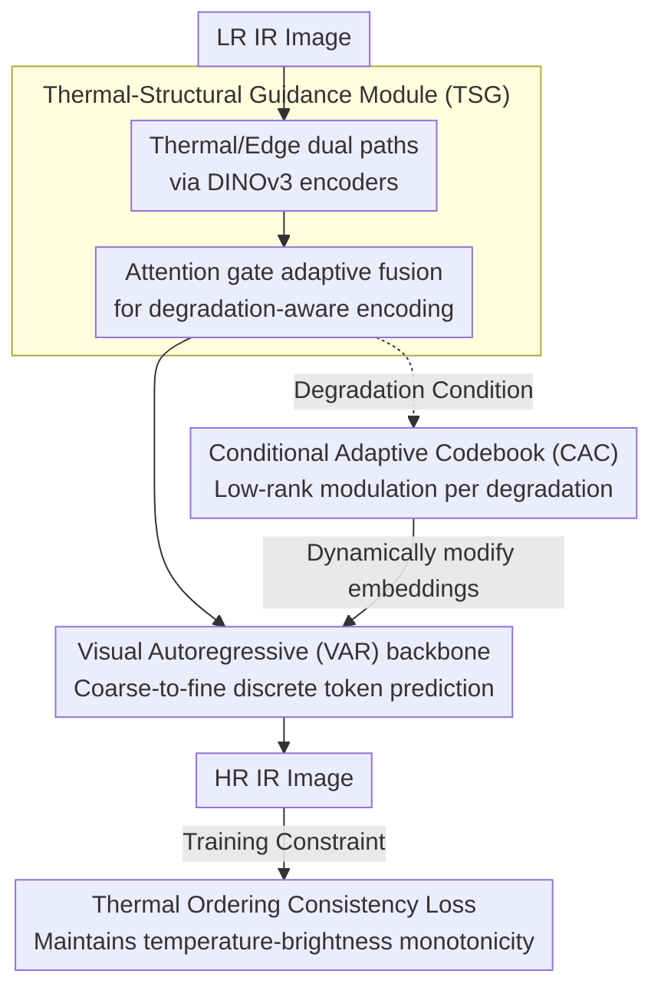

# Toward Real-world Infrared Image Super-Resolution: A Unified Autoregressive Framework and Benchmark Dataset

**Conference**: CVPR 2026  
**arXiv**: [2603.04745](https://arxiv.org/abs/2603.04745)  
**Code**: [https://github.com/JZD151/Real-IISR](https://github.com/JZD151/Real-IISR)  
**Area**: Image Restoration / Infrared Image Super-Resolution  
**Keywords**: Infrared Image Super-Resolution, Visual Autoregression, Thermal-Structural Guidance, Conditional Adaptive Codebook, Thermal Ordering Consistency

## TL;DR

Ours proposes Real-IISR, a unified autoregressive framework that addresses the unique challenges of real-world infrared image super-resolution (IISR) through a Thermal-Structural Guidance module, a Conditional Adaptive Codebook, and a Thermal Ordering Consistency loss, while constructing the FLIR-IISR dataset (1457 pairs of real LR-HR infrared images).

## Background & Motivation

1. **Background**: While visible light image super-resolution has seen significant progress, infrared imaging suffers from unique degradations such as spatially-varying blur, unstable thermal boundaries, and temperature-related radiation drift due to longer wavelengths and weaker atmospheric scattering.
2. **Limitations of Prior Work**: Existing IISR methods are trained on simulated datasets (downsampled IVIF datasets), failing to capture real infrared degradation. The stochastic sampling of diffusion models and their lack of infrared degradation priors limit their applicability in IISR.
3. **Key Challenge**: (1) Lack of real-world infrared degradation datasets; (2) Absence of infrared-aware degradation modeling—thermal radiation intensity does not strictly align with structural edges, and non-uniform degradation introduces quantization bias.
4. **Goal**: Simultaneously fill the fundamental gaps in both datasets and methodologies for real-world IISR.
5. **Key Insight**: Leverage the temperature-brightness monotonicity of infrared imaging as a physical constraint.
6. **Core Idea**: Thermal-structural dual guidance + degradation-adaptive codebook + thermal ordering preservation loss.

## Method

### Overall Architecture

Real-IISR treats real-world infrared super-resolution as an **autoregressive generation problem under degradation conditions**, with the entire pipeline centered around infrared-specific physical priors. A low-resolution (LR) infrared image first enters the Thermal-Structural Guidance (TSG) module, where it is decomposed into thermal and edge maps and then fused to obtain a degradation-aware encoding that "knows both the heat distribution and the edge locations." This encoding is fed into a Visual Autoregressive (VAR) backbone, which predicts discrete tokens in a coarse-to-fine manner per scale to generate high-resolution results. During generation, the Conditional Adaptive Codebook (CAC) dynamically modifies quantization embeddings based on current degradation conditions, allowing the same codebook entry to decode into different textures under different degradations. Finally, the Thermal Ordering Consistency (TOC) loss constrains the output to ensure the restored results maintain the infrared physical law of "higher temperature, brighter pixel." Compared to the stochastic multi-step denoising of diffusion methods, the deterministic scale-by-scale prediction of VAR is faster and avoids blurring high-frequency thermal details.

### Key Designs

**1. Thermal-Structural Guidance Module (TSG): Focusing on heat distribution and real edges simultaneously**

Strong heat sources (e.g., car engines) in infrared images produce large high-brightness radiation zones, which often deviate from the actual contours of the object. End-to-end training might overfit to thermal peaks and blur edge restoration. TSG constructs a thermal map $I_{\text{Heat}}$ and an edge map $I_{\text{Edge}}$ from the LR input, extracts features using a DINOv3 encoder for each, and employs a learnable attention gate $W = \sigma(L(A) + G(A))$ to adaptively weight the contributions—relying more on the thermal map when the heat source is prominent and more on the edge map when textures are rich. The fused features guide the LR feature encoding via cross-attention, aligning "heat" and "shape" cues before generation to prevent deviations where the two signals conflict.

**2. Conditional Adaptive Codebook (CAC): Adapting discrete codebook entries to degradation conditions**

VAR relies on VQ-VAE style discrete quantization, but the quantization error of a fixed codebook is amplified under the spatially non-uniform degradation of infrared images—the same code entry should decode into different textures in clear versus defocused areas. CAC adds a low-rank perturbation to each code embedding for dynamic modulation:

$$Z'(g)[i] = Z[i] + \tanh(\alpha)\big[(U_i \odot h(g))V^\top\big]$$

Where the condition vector $h(g)$ is derived from the degradation-aware features of TSG, and $\tanh(\alpha)$ limits the modulation magnitude to a controllable range to avoid training divergence. This allows the same discrete index to decode into different embedding vectors under different degradation conditions, transforming the codebook from a "static lookup table" to a "condition-tuned" system, balancing flexibility and stability with a low-rank structure.

**3. Thermal Ordering Consistency Loss $\mathcal{L}_{\text{TOC}}$: Integrating "temperature-brightness monotonicity" into the objective**

In infrared imaging, higher temperatures correspond to brighter pixels, which is a hard physical law. However, defocus and motion blur can compress local temperatures and shift thermal peaks. Since MSE only constrains absolute pixel values, it cannot maintain the relative brightness order of adjacent regions, potentially resulting in restored values that are numerically close but physically inverted in cold-heat order. TOC directly targets the brightness ordering of adjacent patch pairs:

$$\mathcal{L}_{\text{TOC}} = \text{ReLU}\big(-[(I_{\text{SR}}^p(i) - I_{\text{SR}}^p(j)) \times (I_{\text{HR}}^p(i) - I_{\text{HR}}^p(j))]\big)$$

When the direction of brightness difference for a patch pair in SR is consistent with HR, the product is positive and the ReLU yields no penalty. If SR inverts the cold-heat order, the product is negative and the loss increases. It constrains relative ordering rather than absolute values, effectively supplementing physical consistency where MSE fails, and successfully suppressing thermal peak drift in experiments.

### Loss & Training

The total loss weighting combines autoregressive cross-entropy, pixel reconstruction, and physical constraints: $\mathcal{L}_{\text{total}} = \mathcal{L}_{\text{CE}} + \lambda_1 \mathcal{L}_{\text{MSE}} + \lambda_2 \mathcal{L}_{\text{TOC}}$, with $\lambda_1=0.2,\ \lambda_2=0.8$. The weight for the physical consistency term is significantly higher than pixel MSE, reflecting a trade-off that prioritizes maintaining thermal order over pixel-wise accuracy. Training was performed with 10K fine-tuning steps using AdamW on 4 × A800 GPUs.

## Key Experimental Results

### Main Results

| Dataset | Metric | Ours | DifIISR (Prev. SOTA) | Gain |
|--------|------|-----------|-------------------|------|
| FLIR-IISR@Set5 | MUSIQ↑ | 59.90 | 54.79 | +5.11 |
| FLIR-IISR@Set15 | MUSIQ↑ | 57.06 | 53.16 | +3.90 |
| FLIR-IISR@Set5 | LPIPS↓ | 0.1615 | 0.2525 | -0.091 |

### Ablation Study

| Configuration | PSNR | MUSIQ | Description |
|------|------|-------|------|
| W/o TSG | Decrease | Decrease | Blurred edges, inaccurate thermal distribution |
| W/o CAC | Decrease | Decrease | Unstable textures |
| W/o $\mathcal{L}_{\text{TOC}}$ | Decrease | Decrease | Thermal peak drift |
| VAR vs Diffusion Baseline | VAR Better | VAR Better | Deterministic generation is more suitable for IR |

### Key Findings

- While Real-IISR has the most parameters (1144.6M), it achieves the fastest inference (2.45 FPS) since the autoregressive model does not require multi-step denoising.
- The iterative denoising of diffusion methods blurs high-frequency thermal details and destroys the structure-thermal correspondence.
- $\mathcal{L}_{\text{TOC}}$ effectively prevents thermal peak drift and maintains physical consistency.

## Highlights & Insights

- **Domain-Specific Constraint Design**: The Thermal Ordering Consistency loss cleverly utilizes the physical monotonicity of infrared imaging.
- **Real-world Dataset Construction**: Simulates real degradation through autofocus variations and motion blur, filling the gap for real infrared SR data.
- **Low-rank Perturbation in CAC**: Uses a low-rank structure to control the modulation magnitude of the codebook, balancing flexibility and stability.

## Limitations & Future Work

- The FLIR-IISR dataset contains only 1457 pairs, which is still limited in scale.
- Only 4× super-resolution is supported; other magnification factors have not been verified.
- The quality of thermal and edge maps depends on the LR input and may be unreliable under extreme degradation.
- Future work could extend to infrared video SR to leverage temporal information.

## Related Work & Insights

- **vs VARSR**: VARSR is designed for visible light without infrared constraints; Real-IISR introduces thermal priors.
- **vs DifIISR**: DifIISR uses diffusion with gradient alignment, but multi-step denoising is slow and blurs infrared details.

## Rating

- Novelty: ⭐⭐⭐⭐ TSG and thermal ordering constraints are innovative designs for IR, filling the gap in real infrared SR.
- Experimental Thoroughness: ⭐⭐⭐⭐ Two datasets + multiple comparison methods + comprehensive ablations, with complete efficiency analysis.
- Writing Quality: ⭐⭐⭐⭐ Clear structure; thermal map visualizations and grayscale fluctuation plots intuitively demonstrate physical consistency.
- Value: ⭐⭐⭐⭐ Fills the double gap of data and methodology for real-world infrared SR, providing a benchmark for the field.

<!-- RELATED:START -->

## Related Papers

- [\[CVPR 2026\] OMoBlur: An Object Motion Blur Dataset and Benchmark for Real-World Local Motion Deblurring](omoblur_an_object_motion_blur_dataset_and_benchmark_for_real-world_local_motion_.md)
- [\[CVPR 2026\] Event-Illumination Collaborative Low-light Image Enhancement with a High-resolution Real-world Dataset](event-illumination_collaborative_low-light_image_enhancement_with_a_high-resolut.md)
- [\[CVPR 2026\] One-Step Diffusion Transformer for Controllable Real-World Image Super-Resolution](one-step_diffusion_transformer_for_controllable_real-world_image_super-resolutio.md)
- [\[CVPR 2026\] DVAR: Dynamic Visual Autoregressive Modeling for Image Super-Resolution](dvar_dynamic_visual_autoregressive_modeling_for_image_super-resolution.md)
- [\[ECCV 2024\] A New Dataset and Framework for Real-World Blurred Images Super-Resolution](../../ECCV2024/image_restoration/a_new_dataset_and_framework_for_real-world_blurred_images_super-resolution.md)

<!-- RELATED:END -->
