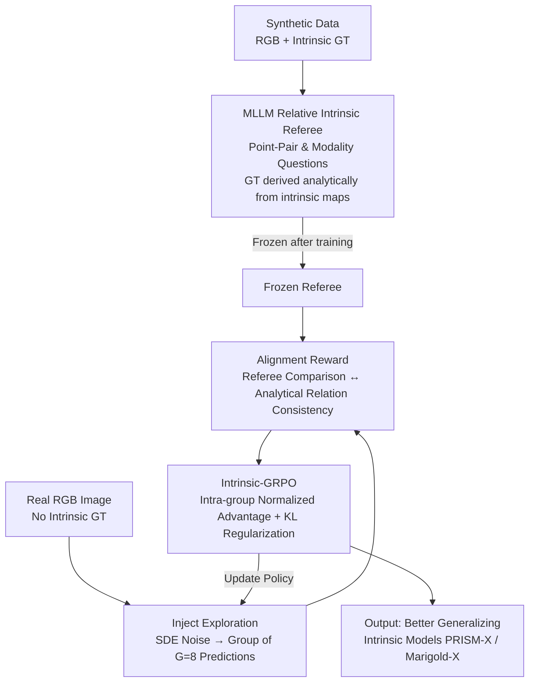

# ReasonX: MLLM-Guided Intrinsic Image Decomposition

**Conference**: CVPR 2026  
**Paper**: [CVF Open Access](https://openaccess.thecvf.com/content/CVPR2026/html/Dirik_ReasonX_MLLM-Guided_Intrinsic_Image_Decomposition_CVPR_2026_paper.html)  
**Code**: https://github.com/alaradirik/reasonx  
**Area**: Image Restoration / Intrinsic Image Decomposition / Inverse Rendering  
**Keywords**: Intrinsic Image Decomposition, MLLM Referee, Relative Comparison Supervision, GRPO, Unlabeled Fine-Tuning

## TL;DR
ReasonX leverages a fine-tuned Multimodal Large Language Model (MLLM) as a "perceptual referee" to make relative intrinsic judgments (which point is closer, which is brighter, or whether they share the same material) on point pairs in RGB images. It then uses the consistency between the referee's judgment and the model's predicted analytical relation as a GRPO reward to fine-tune intrinsic decomposition models on real-world images **without any intrinsic ground-truth annotations**. This allows models like PRISM and Marigold to reduce the IIW albedo WHDR by 9–25% in the wild and improve the ETH3D depth accuracy by up to 46%.

## Background & Motivation

**Background**: Intrinsic image decomposition aims to separate physical properties such as albedo, depth, normals, and irradiance from a single RGB image, representing a classic inverse problem. Recently, diffusion models and vision Transformers have achieved impressive results. Models like PRISM and Marigold generate high-quality decompositions on synthetic indoor data, supporting downstream applications such as relighting and material editing.

**Limitations of Prior Work**: These state-of-the-art (SOTA) methods **heavily rely on paired synthetic datasets**, as only physical rendering engines (e.g., HyperSim, InteriorVerse, OpenRooms) can provide pixel-wise intrinsic ground truth. Although realistic, synthetic data suffers from a narrow domain coverage (mostly indoor scenes) and fails to capture the full complexity of real-world images. Consequently, the generalization capability of these models degrades significantly when encountering out-of-distribution real-world images (outdoor scenes, harsh lighting, overexposure/underexposure). Meanwhile, obtaining intrinsic ground-truth annotations for real-world scenes is prohibitively expensive.

**Key Challenge**: Intrinsic decomposition requires **pixel-wise absolute supervision**, yet **such absolute annotations are unavailable** for the real world. Thus, models are either confined to synthetic domains or left with no signal to learn from.

**Goal**: Fine-tune intrinsic decomposition models on real-world images **without any intrinsic ground truth** while simultaneously improving their generalization to out-of-the-wild scenes.

**Key Insight**: The authors made two observations: first, MLLMs excel at **relative spatial reasoning** ("which point is closer", "are these two patches the same material") even though they struggle with absolute metric estimation; second, human perception itself is inherently proficient at comparative judgment rather than absolute measurement. These two insights align perfectly: instead of forcing the model to learn absolute values, an MLLM can serve as a referee to answer only **relative comparison questions**.

**Core Idea**: An MLLM is trained to act as a "referee" capable of making relative intrinsic judgments. Then, the alignment between "the referee's comparison results" and "the analytical relations computed from the model's predictions" is utilized as the reward signal. Using GRPO, the intrinsic model is fine-tuned on unlabeled real-world images. This effectively replaces **absolute ground-truth supervision** with **relative comparison supervision**.

## Method

### Overall Architecture

ReasonX consists of two main stages: **(a) Training an MLLM referee**—InternVL2.5-4B is fine-tuned on synthetic dataset with ground truth to answer point-pair-level relative intrinsic questions, after which it is frozen; **(b) Ground-truth-free GRPO fine-tuning**—the frozen referee serves as the reward model. For each real RGB image, the intrinsic model samples a group ($G=8$) of predictions. The referee scores these predictions across point-pairs and modalities to compute intra-group relative advantages, which are then used to update the intrinsic model. The entire pipeline runs on real images **without any intrinsic ground truth**, requiring only the RGB images and the pre-trained referee.

A key engineering challenge is that intrinsic prediction is **strongly RGB-conditioned and almost deterministic** (a single RGB image typically corresponds to only one solution), leaving no exploration space for policy gradient methods. Drawing inspiration from Flow-GRPO, ReasonX injects stochastic noise into the sampling trajectory, transforming the deterministic trajectory into a slightly stochastic one. This allows the model to generate multiple slightly different but plausible predictions for the same image, enabling group-relative optimization.

### Key Designs

**1. MLLM Relative Intrinsic Referee: Replacing absolute regression with comparative judgment to inject high-level semantic priors into low-level intrinsic tasks**

Instead of prompting the MLLM to directly regress pixel-wise intrinsic values (which it performs poorly on), the authors refigure the task as **point-pair relative comparison**. Specifically, point pairs $(x_1,y_1),(x_2,y_2)$ are sampled on synthetic RGB images and overlaid with colored visual markers. Specific relative questions are queried for different modalities—depth: "which point is closer?", normal: "which point's surface faces more towards the camera?", irradiance: "which point is brighter?", albedo: "do the two points share the same base color?". The ground-truth answers for these questions **do not require human annotation**; instead, they are analytically derived from the corresponding synthetic intrinsic ground-truth maps. For depth, scalar values are directly compared (point pairs with negligible differences are filtered out to avoid ambiguity). For normals, the forwardness of the z-component is compared (assuming the camera looks towards the +z axis). For irradiance, brightness is compared under the Lambertian assumption. For albedo, the thresholded perceptual color difference is estimated. By fine-tuning InternVL2.5-4B on these triplets of (RGB + marker image, modality question, analytical answer), the referee learns relationship reasoning that reliably transfers to real images. On the held-out test set, the referee achieves accuracies of 0.962 for depth, 0.935 for normals, 0.894 for albedo, and 0.876 for irradiance, demonstrating that comparison tasks are far more robust than absolute predictions.

**2. Alignment Reward: Binding "referee's perceptual judgment" and "predicted physical structure" as the reward**

The referee must be converted into a backpropagatable reward. For a predicted intrinsic map $I_m$, $N$ point pairs are sampled from the RGB input, overlaid with markers, and queried to the frozen referee to obtain the relative judgments. Meanwhile, the analytical relation $g_m$ is used to compute the relative relationship of the same point pairs from $I_m$. A reward is given when the two are consistent:

$$r(I_{\text{RGB}}, I_m) = \frac{1}{N}\sum_{i=1}^{N}\big[\,\mathrm{MLLM}(I_{\text{RGB}}^{(i)}, q_m) = g_m(I_m, p_i)\,\big]$$

where $q_m$ is the modality-specific question and $g_m$ is the deterministic relation computed from the predicted intrinsic map. This reward anchors both the **model's physical structure** (analytical relations) and the **referee's comparative perception**. The model can only receive a high reward if its predictions structurally align with the referee's perception of the real world. This is the key mechanism to supervise "ground-truth-free" real images; the reward comes not from absolute ground truth, but from the alignment of "internal self-consistency + external perception".

**3. Intrinsic-GRPO: Injecting exploration into deterministic intrinsic predictions for group-relative optimization**

Intrinsic prediction models like PRISM and Marigold rely on deterministic denoising trajectories conditioned on RGB, leaving no exploratory distribution for policy gradients. Following Flow-GRPO, the authors inject a stochastic term into the sampling process, using an Euler–Maruyama update to render the deterministic trajectory stochastic:

$$x_{t+\Delta t} = x_t + f_\theta(x_t, t, c)\,\Delta t + \sigma_t\sqrt{\Delta t}\,\epsilon,\quad \epsilon\sim\mathcal{N}(0,I)$$

Independent noise enables the model to generate multiple plausible predictions for the same RGB, making group-relative optimization feasible. For each real image, a target modality $m$ is randomly selected, $G$ predictions are generated, and a reward is calculated for each. Group-normalized advantages are computed as $\hat{A}_i = (r_i - \mu_G)/\sigma_G$. The model is then updated using the clipped PPO objective with KL regularization of GRPO:

$$\mathcal{J}(\theta) = \mathbb{E}_{\pi_\theta}\Big[\min\big(\rho_t\hat{A},\,\mathrm{clip}(\rho_t,1-\epsilon,1+\epsilon)\hat{A}\big) - \beta\,D_{\mathrm{KL}}(\pi_\theta\|\pi_{\mathrm{ref}})\Big]$$

The KL regularization constrains the updated policy close to the frozen reference model, **preventing reward hacking** (e.g., collapsing to a near-constant intrinsic map to exploit the reward) and ensuring that performance gains represent true alignment with comparative judgments. Since the transition distribution under stochastic updates is Gaussian, the KL divergence can be computed in closed form using the velocity fields of the active and reference models. Unlike standard applications of GRPO in generative models (where rewards stem from preference scores or internal critics), ReasonX targets **deterministic, RGB-conditioned** intrinsic prediction, where rewards come from **modality-specific relative comparisons** of the referee instead of subjective preferences.

### Loss & Training
**Referee**: InternVL2.5-4B is fine-tuned on synthetic data (the base model's training set, containing intrinsic ground truth) and then frozen. **GRPO Fine-Tuning**: Fine-tuning is performed on 10,000 real-world RGB images from the COCO training set. Each iteration samples $N=40$ point pairs and $T=15$ denoising steps ($T=50$ is used during inference), with a group size $G=8$ and SDE noise level $a=0.7$. AdamW is used with a learning rate of $10^{-5}$, cosine decay, and a gradient clipping threshold of 1.0. Training is conducted on 6 H100 GPUs for 3 epochs. PRISM is conditioned on empty text prompts.

## Key Experimental Results

ReasonX is a model-agnostic framework. It is applied to PRISM (a rectified-flow diffusion Transformer) and Marigold IID Lighting v1.1 (a diffusion model predicting joint albedo and irradiance), yielding PRISM-X and Marigold-X. All evaluations on real datasets are conducted in a **zero-shot** manner (neither the base models nor the ReasonX variants have seen these test sets).

### Main Results

| Task / Dataset | Metric | Base Model | ReasonX Variant | Gain |
|------|------|------|------|------|
| Albedo IIW | WHDR 10% ↓ | PRISM 17.2 | PRISM-X **12.9** | +25.0% |
| Albedo IIW | WHDR 10% ↓ | Marigold 16.7 | Marigold-X 15.2 | +9.0% |
| Albedo MAW | Intensity(×100) ↓ | PRISM 0.71 | PRISM-X **0.43** | +39.4% |
| Albedo MAW | Intensity(×100) ↓ | Marigold 0.49 | Marigold-X 0.41 | +16.3% |
| Depth ETH3D | AbsRel ↓ | PRISM 0.142 | PRISM-X **0.077** | +45.8% |
| Depth ETH3D | δ1 ↑ | PRISM 0.836 | PRISM-X 0.950 | +13.6% |
| Depth NYUv2 | AbsRel ↓ | PRISM 0.061 | PRISM-X 0.053 | +13.1% |
| Normal NYUv2 | Mean ↓ | PRISM 16.1 | PRISM-X 15.7 | +2.5% |
| Normal DIODE | Mean ↓ | PRISM 14.6 | PRISM-X 14.5 | +0.7% |

PRISM-X achieves zero-shot SOTA performance on IIW albedo, comparable to the fully supervised (on IIW) non-competing competitor CRefNet (WHDR 12.8). The most dramatic improvement is seen on the outdoor-heavy ETH3D dataset (+45.8% for depth), validating that the framework's generalization gains on wild/outdoor scenes far exceed those on indoor scenes (e.g., only +13.1% on NYUv2). Since the base models are already highly performant on surface normals, the gains on normals are moderate, yet they still outperform dedicated normal estimators such as DSINE, GeoWizard, and StableNormal, **all without any ground-truth normal supervision during fine-tuning**.

### Cross-Modal Consistency and Referee Reliability

| Experiment | Dataset / Modality | Base Model | PRISM-X | Gain |
|------|---------|------|------|------|
| Depth ↔ Normal Alignment | ETH3D RMSE ↓ | 0.146 | 0.099 | +32% |
| Depth ↔ Normal Alignment | COCO RMSE ↓ | 0.202 | 0.137 | +32.2% |
| Depth ↔ Normal Alignment | ETH3D SSIM ↑ | 0.582 | 0.640 | +10.0% |
| Referee Accuracy | Depth / Normal | — | 0.962 / 0.935 | — |
| Referee Accuracy | Albedo / Irradiance | — | 0.894 / 0.876 | — |

Cross-modal alignment is measured by computing surface normals from the predicted depth map and comparing them to the predicted normals. PRISM-X reduces the RMSE on both ETH3D and COCO by ~32%, indicating significantly improved geometric consistency. On the held-out validation set, the referee achieves high accuracies on depth and normals. The accuracies on albedo and irradiance are slightly lower due to ambiguities arising from visual markers covering local areas and color variations within the same materials, but qualitatively the referee still provides semantically correct feedback.

### Key Findings
- **Largest gains in outdoor/wild scenarios**: ETH3D depth improved by +45.8% and IIW albedo under PRISM-X by +25%, precisely filling the gap in real-world distribution that synthetic training data lacks.
- **Relative supervision is sufficient to replace absolute supervision**: Throughout the entire process, no intrinsic ground truth is used. Relying solely on the "relative consistency" reward allows the models to approach or even exceed dedicated models trained on absolute ground truth, validating the core premise that "MLLMs are competent at relative but incompetent at absolute tasks".
- **KL regularization is critical for stability**: Without it, the model tends to collapse into near-constant intrinsic maps to exploit the reward (reward hacking). KL regularization anchors the policy to the reference model, ensuring genuine alignment.
- **Prominent robustness to overexposure/underexposure**: On the MIT Intrinsic Images dataset under diverse lighting, ReasonX variants demonstrate significantly higher albedo consistency across different lighting conditions of the same scene compared to the base models, signifying a stronger decoupling of material and illumination.

## Highlights & Insights
- **Turning the "MLLM struggle with absolute but excel at relative" weakness into a design principle**: Instead of forcing the MLLM to regress absolute pixel values, the authors reframe the task as point-pair comparison. This bypasses the MLLM's quantitative limitations while injecting high-level semantic priors into low-level intrinsic tasks, which is the most remarkable insight of the paper.
- **A clever dual-anchored reward design**: The reward is jointly tied to the "analytical relations of model predictions" and the "perceptual judgments of the referee". This enables ground-truth-free training while preventing the model from running wild, constructing a self-consistent signal rare in unsupervised fine-tuning.
- **A general recipe for RL on deterministic tasks**: Since intrinsic prediction is almost deterministic, the authors inject SDE noise into the denoising process to create an exploratory stochastic process for GRPO. This "exploration-by-noising" concept is highly transferable to any "strongly conditioned, near-deterministic" prediction tasks (e.g., single-image depth, normal estimation, optical flow).
- **Model-agnostic and modality-agnostic**: The same framework yields improvements across two architectures (PRISM and Marigold) and four modalities (albedo, depth, normal, irradiance), making it highly practical for deployment.

## Limitations & Future Work
- **Reliance on point-pair sampling and single-modality rewards**: The training optimizes only one randomly selected modality at each step, and point-pair sampling introduces variance. The authors acknowledge this limitation and suggest exploring joint multi-modality optimization or reconstruction-based holistic signals.
- **Ambiguity in referee's albedo/irradiance judgments**: Since visual markers cover local patches rather than single pixels, "same material" or "same lighting" judgments can be ambiguous. Consequently, the referee's accuracy in these modalities is notably lower than in depth/normals (0.89/0.88 vs 0.96/0.94), potentially limiting the performance ceiling for these channels.
- **Limited improvement on normal estimation**: The base models are already exceptionally strong on normals. Consequently, the gains of ReasonX on normals are modest (e.g., +2.5% on NYUv2, and even -3.1% on the DIODE 11.25° metric), showing diminishing returns of relative comparison supervision when the geometric channels are already excellent.
- **Directions for improvement**: Expanding the framework to broader inverse rendering tasks, introducing reconstruction consistency constraints, or enabling the referee to perform joint multi-modal considerations to mitigate single-modality sampling variance.

## Related Work & Insights
- **vs Ordinal Shading [5]**: Ordinal Shading imposes a scale/translation-invariant ordinal relationship within the shading map using a two-stage CNN, enforcing global coherence via relative rather than absolute intensity. ReasonX generalizes this "ordinal constraint/relative reasoning" principle to arbitrary modalities (depth, albedo, irradiance) and optimizes it using an MLLM as a unified comparative referee via GRPO, enabling unpaired cross-modal fine-tuning.
- **vs PRISM / Marigold [12,18]**: These models jointly predict multiple intrinsic properties based on synthetic datasets. Although powerful on synthetic data, they suffer from limited generalization. ReasonX represents an **orthogonal generalization path**—without modifying the base model's architecture, it uses MLLM-guided ordinal-aware refinement to continue training on real-world images.
- **vs GRPO on Generative Models (e.g., Flow-GRPO [25])**: Traditional GRPO is applied to generative tasks with rewards derived from preference scores or internal critics. In contrast, ReasonX targets deterministic, RGB-conditioned intrinsic predictions, utilizing reward signals from **modality-specific relative comparisons** instead of preference grading.
- **vs OmniGen2 Fine-tuning Baseline [40]**: The authors also experimented with directly fine-tuning a general-purpose MLLM into an intrinsic generator (generating depth/albedo directly from RGB and text prompts). Although competitive, it is generally outperformed by the ReasonX variants, indicating that "using a dedicated model refined via a referee and GRPO" is more effective than "generating intrinsics directly using a general MLLM".

## Rating
- Novelty: ⭐⭐⭐⭐⭐ Leveraging the MLLM's relative reasoning capability as a reward signal for ground-truth-free intrinsic decomposition is highly innovative and self-consistent.
- Experimental Thoroughness: ⭐⭐⭐⭐ The work covers four modalities, two base models, and multiple zero-shot datasets alongside validations for referee reliability and cross-modal consistency. It is slightly regrettable that the main ablation studies (relative vs. absolute, role of KL) are placed in the supplementary materials.
- Writing Quality: ⭐⭐⭐⭐ The motivational chain is clear, the two-stage method is explained thoroughly, and Figures 2, 4, and 8 significantly aid understanding.
- Value: ⭐⭐⭐⭐⭐ Effectively addresses the core bottleneck of "lack of annotations in the real world" for intrinsic decomposition, and the "exploration-by-noising + MLLM relative referee" paradigm is easily transferable to generalized inverse rendering.

<!-- RELATED:START -->

## Related Papers

- [\[CVPR 2026\] HDW-SR: High-Frequency Guided Diffusion Model based on Wavelet Decomposition for Image Super-Resolution](hdw-sr_high-frequency_guided_diffusion_model_based_on_wavelet_decomposition_for_.md)
- [\[CVPR 2026\] Time-Specialized Event-Image Alignment for Blur-to-Video Decomposition](time-specialized_event-image_alignment_for_blur-to-video_decomposition.md)
- [\[ECCV 2024\] Intrinsic Single-Image HDR Reconstruction](../../ECCV2024/image_restoration/intrinsic_single-image_hdr_reconstruction.md)
- [\[CVPR 2026\] Unpaired Image Deraining Using Reward-Guided Self-Reinforcement Strategy](unpaired_image_deraining_using_reward-guided_self-reinforcement_strategy.md)
- [\[ECCV 2024\] Joint RGB-Spectral Decomposition Model Guided Image Enhancement in Mobile Photography](../../ECCV2024/image_restoration/joint_rgb-spectral_decomposition_model_guided_image_enhancement_in_mobile_photog.md)

<!-- RELATED:END -->
