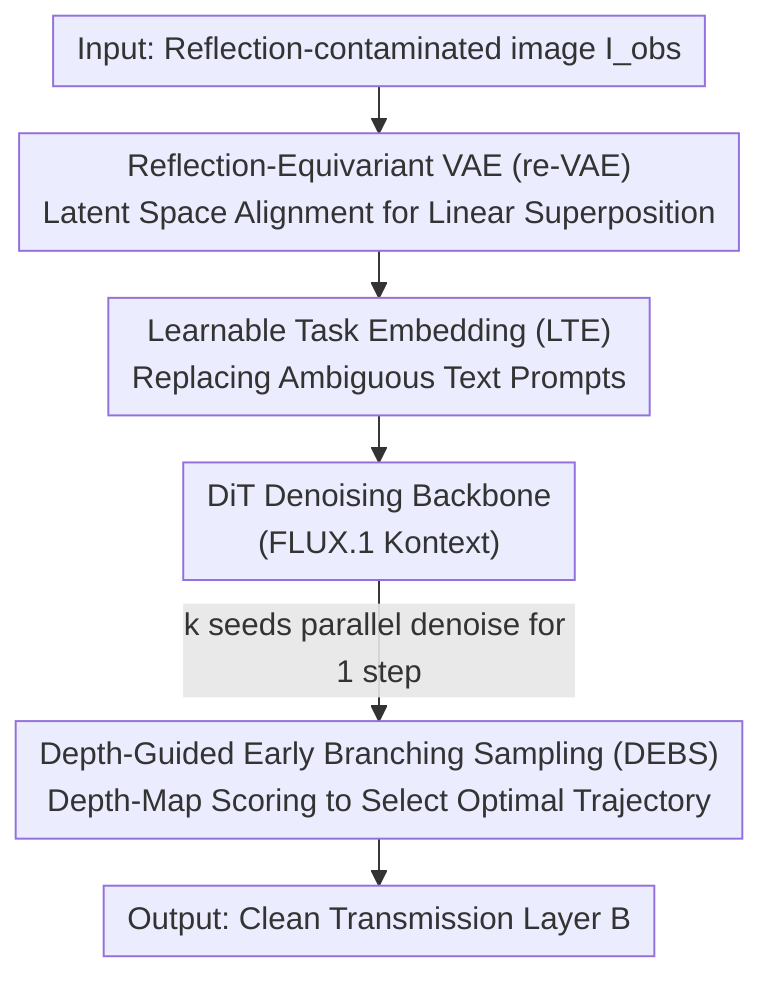

# Rectifying Latent Space for Generative Single-Image Reflection Removal

**Conference**: CVPR 2026  
**Paper**: [CVF Open Access](https://openaccess.thecvf.com/content/CVPR2026/html/Li_Rectifying_Latent_Space_for_Generative_Single-Image_Reflection_Removal_CVPR_2026_paper.html)  
**Code**: https://gensirr.research.mingjia.li (Project Page)  
**Area**: Image Restoration / Reflection Removal / Diffusion Models  
**Keywords**: Single-image reflection removal, latent space alignment, equivariant VAE, learnable task embeddings, test-time scaling

## TL;DR
GenSIRR adapts a large image editing diffusion model (FLUX.1 Kontext) into a single-image reflection remover. The core idea is to enable the latent space of the VAE to "understand" that the reflection image is a linear superposition of the background layer and the reflection layer (reflection-equivariant VAE). This is paired with learnable task embeddings that replace vague language prompts, and a depth-guided early branching scheme to select the optimal sampling trajectory. The method achieves a new state-of-the-art (SOTA) on benchmarks like Real20, SIR2, and Nature, while demonstrating strong generalization on real-world out-of-distribution photos.

## Background & Motivation
**Background**: Single-image reflection removal (SIRR) is a highly ill-posed inverse problem. When taking a photo through a transparent surface like glass, the camera sensor records the superposition of the transmission layer $B$ and the reflection layer $R$. The classical physical model is written as $I_{\text{obs}} = (1-\alpha)B + \alpha R$, where the goal is to recover the clean $B$ from $I_{\text{obs}}$. From early hand-crafted priors (relative smoothness, sparse gradients, ghosting cues) to CNNs/Transformers, and recently to diffusion methods, the community has continuously leveraged various pretrained models to mitigate this ill-posedness.

**Limitations of Prior Work**: The authors point out "the elephant in the room"—the superimposed image $I_{\text{obs}}$ cannot be well-perceived by pretrained models due to semantic ambiguity. Formally, the latent representation $z_I = E(I_{\text{obs}})$ given by a pretrained encoder $E$ does not equal the linear combination of its components' embeddings $(1-\alpha)z_B + \alpha z_R$, i.e., $z_I \neq (1-\alpha)z_B + \alpha z_R$. For image classification-driven pretrained models, this issue is less severe due to the widespread use of Mixup-like augmentations; however, for latent diffusion models (LDMs) trained on image-text pairs, this has never been addressed.

**Key Challenge**: The authors demonstrate the core of the problem with a key experiment (Table 1): simply fine-tuning the VAE with standard reconstruction loss to better reconstruct synthetic mixed images yields almost no benefit to the final reflection removal performance. What actually brings a huge improvement is explicitly aligning $z_I$ to $(1-\alpha)z_B + \alpha z_R$. In other words, the bottleneck lies not in reconstruction fidelity, but in whether the latent space possesses a geometry that "understands superposition." Additionally, applying LDMs to SIRR faces two practical obstacles: (1) natural language must be used to describe the scene, but the superimposed image itself is semantically ambiguous, making it difficult for tagging/captioning models to provide correct text; (2) the inherent stochasticity of generative models leads to highly variable output quality across different initial noises, whereas selecting the optimal one from multiple full samplings is computationally prohibitive.

**Goal**: To "tame" a powerful pretrained image-editing LDM into an accurate and robust SIRR model. Specifically, this is decomposed into three sub-problems: (1) reshaping the latent space to make it reflection-equivariant; (2) bypassing ambiguous text prompts to provide precise task guidance; and (3) stably selecting high-quality results from stochasticity at an approximation of single-inference cost.

**Key Insight**: Given that the root of the problem is "the latent space does not understand linear superposition," one can directly enforce linear superposition constraints in the latent space, forcing the encoder to learn to deconstruct the superimposed image into a linear mix of the two layers. The universality of this perspective is that, in principle, it can be extrapolated to other "layer superposition" problems such as watermark removal and alpha matting (though this paper only focuses on reflection removal due to space limitations).

**Core Idea**: Utilizing a tripartite design of "reflection-equivariant VAE + learnable task embeddings + depth-guided early-branching sampling" to adapt the large image-editing model FLUX.1 Kontext to SIRR, where the reflection-equivariant alignment of the latent space serves as the soul of the entire approach.

## Method

### Overall Architecture
GenSIRR aims to adapt a pretrained image editing LDM (with FLUX.1 Kontext selected as the base) into an SIRR model. The entire pipeline contains two trainable components and one optional test-time module, corresponding to three stages: **Stage I** trains a reflection-equivariant VAE (re-VAE), utilizing an equivalence loss to reshape the geometry of the latent space so that it recognizes the superimposed image as a linear mixture of two layers; **Stage II** freezes the VAE encoder/decoder, initializes a learnable task embedding (LTE) with a text embedding, and fine-tunes it alongside the DiT backbone, enabling the model to be precisely guided to perform "reflection removal" without natural language prompts; **Stage III** is an optional test-time scaling module—using different seeds for parallel sampling, and leveraging depth maps to score and select the most faithful candidate trajectories to continue denoising (DEBS). The input is a single reflection-contaminated image $I_{\text{obs}}$, and the output is the clean transmission layer $B$ after reflection removal.

### Key Designs

**1. Reflection-equivariant VAE (re-VAE): Helping the latent space understand "superposition = linear mixture"**

This is the core of the paper, addressing the pain point that "pretrained encoders cannot interpret the superimposed image as a linear superposition of two layers." The authors first point out the deficiency of a naive solution: simply fine-tuning the VAE with standard reconstruction loss (pixel L2 + LPIPS),

$$\mathcal{L}_{\text{recon}} = \lVert D(E(x)) - x \rVert_2^2 + \text{LPIPS}(D(E(x)), x)$$

does improve the reconstruction fidelity of synthetic mixed images, but this merely "forces the VAE into a new distribution" without giving the latent space a favorable geometry—which is precisely what is missing when transitioning from reconstruction to reflection removal. Thus, the authors' goal is not to improve reconstruction metrics, but to reshape the latent space to be "reflection-equivariant": making the linear physical relationship of the observation image $I_{\text{obs}} \approx (1-\alpha)B + \alpha R$ also hold at the encoder output. Specifically, they enforce an equivalence loss:

$$\mathcal{L}_{\text{equiv}} = \left\lVert E(I_{\text{obs}}) - \left( (1-\alpha)E(B) + \alpha E(R) \right) \right\rVert_2^2$$

During training, background $B$, reflection $R$, and the interpolation factor $\alpha \in [0,1]$ are randomly sampled to synthesize $I_{\text{obs}}$, and $\mathcal{L}_{\text{recon}}$ is jointly optimized with $\mathcal{L}_{\text{equiv}}$. Consequently, the VAE can faithfully reconstruct the input while explicitly "becoming aware" of the linear superposition principle. To prevent the latent space from drifting severely, the authors only train a rank-8 LoRA adapter. Why it works: Table 1 shows that including $\mathcal{L}_{\text{equiv}}$ yields reconstruction scores on synthetic data comparable to the baseline, but the SIRR performance on real images (Real20) jumps from 25.79 dB to 27.27 dB—proving that it is indeed the latent space structure, rather than the reconstruction fidelity itself, that plays the vital role.

**2. Learnable Task-Specific Text Embedding (LTE): Bypassing ambiguous language, directly providing the LDM with a task vector**

This design addresses the pain point that "superimposed images are semantically ambiguous, making it difficult for natural language prompts to correctly describe the reflection removal task." Instead of relying on captioning/tagging models to generate text, the authors introduce a learnable task embedding $P_{\text{task}}$: it is first initialized using a fixed text "please remove the reflection within the image." encoded by the text encoder (i.e., Fixed Text Embedding, FTE). Then, this vector is optimized alongside the model via backpropagation during fine-tuning. The key lies in the initialization—it places the starting point of optimization in a semantically meaningful location. Ablation studies show that if initialized randomly or using RDNet's prompt generator, the loss does not converge at all, because the prompt embedding space is too massive, and a useful task vector cannot be found without a good starting point (while RDNet's prompts are effective within its own architecture, they are semantically misaligned with the pretrained knowledge of FLUX.1). The optimized $P_{\text{task}}$ breaks away from the original linguistic meaning, evolving into a "reflection removal" task instruction directly understood by the LDM's attention mechanism.

**3. Depth-Guided Early Branching Sampling (DEBS): Turning generative stochasticity into controllable test-time gains**

This design targets the pain point that "stochasticity in generative models leads to unstable output quality, and selecting the optimal output from multiple full samplings is computationally expensive." The authors' key observation is that the structural success or failure of reflection removal is essentially determined in the very first denoising step (Figure 4)—if the reflection is suppressed in the single-step latent representation, the final fully denoised result remains clean. Accordingly, DEBS runs one step of denoising in parallel starting from $k$ different noise seeds, then uses a reference-free metric to pick the best candidate to continue the full $T$-step denoising, discarding the other trajectories. This reference-free metric is depth: clean natural images typically possess coherent, piecewise-smooth depth maps, whereas reflection-contaminated areas are misidentified by monocular depth estimators as "ghost objects" floating in the foreground, yielding noisy/blurred depth maps. The authors hypothesize that the candidate with the "deepest" depth map corresponds to the best reflection removal—since successfully removing the reflection as a foreground occlusion reveals the farther, true background, increasing the overall estimated depth. Using a lightweight depth estimator as a perceptual quality proxy allows filtering out sub-optimal trajectories early in the sampling process. Since only the selected trajectory runs for the full $T$ steps, the total cost is only slightly higher than a single inference (approx. 1.25× when $k=4$).

### Loss & Training
Two-stage training. Stage I (re-VAE): Train a rank-8 LoRA adapter on the PD-12M dataset (approx. 3.84 million image pairs) using AdamW, a learning rate of 1e-4, a global batch size of 128, for 30,000 iterations. The target loss is $\mathcal{L}_{\text{recon}} + \mathcal{L}_{\text{equiv}}$. Stage II (DiT Fine-tuning): Freeze the VAE encoder/decoder, initialize from the FLUX.1 Kontext checkpoint, use AdamW with a fixed learning rate of 1e-5 and batch size of 32. The training data is a mixture of real (Real / Nature / RRW) and synthetic images, jointly optimizing the DiT and the LTE. Stage III (DEBS) is an optional test-time strategy that does not introduce extra training.

## Key Experimental Results

### Main Results
Compared with 8 representative methods on three benchmarks (Real20, SIR2, Nature) using PSNR/SSIM (higher is better). GenSIRR sets a new SOTA across the board, which is further improved when DEBS ($k=4$) is added.

| Method | Type | Real20 PSNR/SSIM | SIR2 PSNR/SSIM | Nature PSNR/SSIM | Average PSNR/SSIM |
|------|------|------|------|------|------|
| DSIT (NeurIPS'24) | Non-Generative | 25.22/0.836 | 26.43/0.911 | 26.77/0.847 | 26.40/0.905 |
| RDNet (CVPR'25) | Non-Generative | 25.71/0.850 | 26.69/0.908 | 26.31/0.846 | 26.63/0.903 |
| DAI (AAAI'26) | Generative | 25.21/0.841 | 27.47/0.919 | 26.81/0.843 | 27.35/0.913 |
| **Ours** | Generative | 27.27/0.871 | 27.99/0.921 | 27.30/0.838 | 27.93/0.916 |
| **Ours + DEBS (k=4)** | Generative | **27.58/0.881** | **28.08/0.937** | **27.34/0.840** | **28.03/0.931** |

According to the human evaluation (Table 6, where 5 evaluators judged whether reflections were successfully removed), GenSIRR's average success rates lead by a large margin across four datasets: OpenRR-val 96.6% (RDNet 30.4% / DAI 41.2%), Nature 96.0%, Real20 91.0%, and SIR2 78.5% (where the runner-up peaked at only 34.2%), remaining above 78% even on the most challenging SIR2.

### Ablation Study
Validation of the three main components on Real20 (PSNR/SSIM).

| Configuration | PSNR | SSIM | Description |
|------|------|------|------|
| VAE w/o Training | 25.72 | 0.841 | Without VAE training |
| VAE with only $\mathcal{L}_{\text{recon}}$ | 25.79 | 0.842 | Only reconstruction loss, no equivariance constraint |
| Complete VAE (Ours, with $\mathcal{L}_{\text{equiv}}$) | **27.27** | **0.871** | Equivariance loss added |
| Prompt: Fixed text (FTE) | 26.52 | 0.830 | Fixed text prompt |
| Prompt: Random initialization / RDNet generated | N/A | N/A | Loss does not converge |
| Prompt: LTE (Ours) | **27.27** | **0.871** | Learnable task embedding |
| DEBS: w/o (k=1) | 27.27 | 0.871 | Without early branching |
| DEBS: k=4 | 27.58 | 0.881 | 4 candidates |
| DEBS: k=8 | 27.72 | 0.879 | 8 candidates |
| DEBS: k=16 | 27.74 | 0.882 | 16 candidates, gains saturated |

### Key Findings
- **re-VAE is key to performance**: Fine-tuning the VAE using only the reconstruction loss (25.79 dB) is almost equivalent to not training it (25.72 dB), whereas adding the equivariance loss directly jumps to 27.27 dB—confirming the authors' core argument that it is the latent space structure, rather than the reconstruction fidelity, that dictates performance.
- **Initialization of LTE is critical**: The fixed text prompt drops to 26.52 dB; random initialization or using RDNet's prompt generator completely fails to converge due to the massive prompt embedding space and the lack of a good start. Initializing with a semantically meaningful text embedding is a prerequisite for the LTE to learn successfully.
- **DEBS gains saturate after k=8**: Moving $k$ from 1 to 4 to 8 to 16 yields PSNRs of 27.27, 27.58, 27.72, and 27.74. At 8 candidates, depth scoring already has a high probability of selecting a high-quality trajectory, hence further increasing the sample size yields diminishing returns. Meanwhile, the overhead is only 1.25× for $k=4$ and 1.92× for $k=16$ (on 256×256 images, 2061.9ms -> 3952.4ms).
- **Speed-reliability trade-off**: GenSIRR takes about 2 seconds per image (2580ms at $k=4$), which is much slower than RDNet/DAI (<100ms). However, its success rate of 90.5% far exceeds theirs (RDNet 36.0% / DAI 46.1%). For photography restoration tasks, the authors argue that spending a few seconds for an artifact-free result is highly acceptable.

## Highlights & Insights
- **Redefining "ill-posed reflection removal" as a "latent space geometric alignment" problem**: Instead of designing more complex dual-stream or iterative interaction networks, the authors go back to the foundational level—pretrained encoders simply do not interpret superimposed images as a linear mixture of two layers. The equivalence loss $\mathcal{L}_{\text{equiv}}$ injects the physical superposition prior into the latent space using a single line formula. This is a clean approach with strong potential for extrapolation to other layer superposition recovery tasks (such as watermark removal and alpha matting).
- **Learnable task embedding is an elegant way to bypass "linguistic bottlenecks"**: For restoration tasks that are difficult to describe with text, rather than forcing a tagging model to generate vague prompts, it is better to distill the task itself into a vector that is directly understood by the attention mechanisms. The detail of "initializing with FTE" is key to its convergence and is highly transferable to other conditional generation tasks where text is difficult to describe.
- **DEBS turns generative stochasticity from a liability into an asset**: Utilizing the observation that "the first denoising step determines success or failure" combined with depth as a reference-free quality proxy, DEBS achieves test-time scaling at ~1.25x the computational cost of single-inference. The physical intuition that "depth overall increases after reflection removal" serves as a clever and training-free scoring mechanism.

## Limitations & Future Work
- **Limitations admitted by the authors**: High inference latency. Based on iterative diffusion and a large Transformer backbone, it takes about 2 seconds for a 256×256 image, which is significantly slower than non-generative methods (RDNet) and one-step diffusion (DAI) (<100ms). The authors prioritize acceleration for future work.
- **Self-discovered limitations**: The method heavily relies on the generative priors and world knowledge of the large-scale base FLUX.1 Kontext. Whether it maintains its advantages on smaller base models is unverified. The depth scoring in DEBS assumes "depth overall increases after reflection removal," which might fail when the reflection itself is far from the camera or the scene has a highly complex depth structure (⚠️ this failure mode lacks quantitative analysis in the paper, please refer to the original text for precise details). The SSIM on Nature is slightly lower for our method (0.838~0.840) than for some non-generative methods (such as DSIT at 0.847), implying a minor trade-off in structural similarity for generative outputs.
- **Direction for improvement**: Distilling the model into few-step/one-step sampling to reduce latency; generalizing the equivariance loss to multi-layer superpositions (watermarks, haze, shadows) to form a unified "layer-decoupled" restoration framework; and designing more robust multi-metric scoring for DEBS (depth + edge/semantic consistency).

## Related Work & Insights
- **vs Non-generative SOTA (DSIT / RDNet)**: They use semantic encoders for end-to-end layer separation, but the encoders themselves are not proficient at processing superimposed inputs, and they lack generative priors to complete heavily occluded regions, yielding residual artifacts. GenSIRR uses a large generative model with latent space equivariance alignment, which successfully decouples the layers while synthesizing realistic textures in occluded regions (Figure 6).
- **vs Generative SIRR (L-DiffER / PromptRR / DAI)**: The former two are text-guided and trained from scratch on task data, limited by text ambiguity and unable to exploit the world knowledge of large-scale pretraining. DAI uses a one-step diffusion prior + a new dataset, but a one-step prior lacks the generation capacity to repair heavily occluded regions and similarly overlooks the root cause of the "unstructured latent space for superimposed images." This work bypasses language via LTE, solves the latent space structure via re-VAE, and completes occluded areas using multi-step generation, directly addressing their respective shortcomings.
- **vs General Image Editing Models (InstructPix2Pix / ControlNet / FLUX.1 Kontext / Qwen-Image-edit)**: They rely on text/structural conditions for general editing, but for high-precision restoration tasks like SIRR, they either lack fidelity or have difficulty accurately describing reflection-removal instructions via text. This work uses these powerful bases as a starting point, filling in the missing pieces for SIRR adaptions (equivariant latent space + task embeddings + depth-guided sampling).

## Rating
- Novelty: ⭐⭐⭐⭐⭐ Highly insightful tripartite design of re-VAE, LTE, and DEBS, redefining reflection removal as "latent space reflection-equivariant alignment".
- Experimental Thoroughness: ⭐⭐⭐⭐ Solid evaluation on three benchmarks plus human evaluation, complete with three ablation groups and speed/cost analysis. However, it lacks a quantitative dissection of depth-based DEBS failure modes and base model dependence.
- Writing Quality: ⭐⭐⭐⭐⭐ The motivation is progressively introduced, cementing the core argument via Table 1, with clear mapping between the methodology and ablation studies.
- Value: ⭐⭐⭐⭐ Demonstrates strong real-world out-of-distribution (OOD) generalization and leaves competitors far behind in success rate. The methodology can be extrapolated to other layer-superposition restoration tasks, though real-time application is currently limited by latency.

<!-- RELATED:START -->

## Related Papers

- [\[CVPR 2026\] Reflection Separation from a Single Image via Joint Latent Diffusion](reflection_separation_from_a_single_image_via_joint_latent_diffusion.md)
- [\[CVPR 2026\] GFRRN: Explore the Gaps in Single Image Reflection Removal](gfrrn_explore_the_gaps_in_single_image_reflection_removal.md)
- [\[CVPR 2026\] LightRR: A Lightweight Network for Single Image Reflection Removal](lightrr_a_lightweight_network_for_single_image_reflection_removal.md)
- [\[CVPR 2026\] ReflexSplit: Single Image Reflection Separation via Layer Fusion-Separation](reflexsplit_single_image_reflection_separation_via_layer_fusion-separation.md)
- [\[CVPR 2026\] ExpoCM: Exposure-Aware One-Step Generative Single-Image HDR Reconstruction](expocm_exposure-aware_one-step_generative_single-image_hdr_reconstruction.md)

<!-- RELATED:END -->
