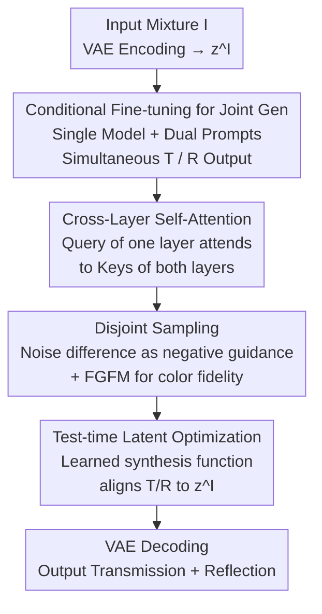

# Reflection Separation from a Single Image via Joint Latent Diffusion

**Conference**: CVPR 2026  
**arXiv**: [2606.04107](https://arxiv.org/abs/2606.04107)  
**Code**: https://brian90709.github.io/diff-reflection-separation/ (Project Page)  
**Area**: Image Restoration / Diffusion Models / Reflection Separation  
**Keywords**: Single-image reflection separation, latent diffusion, cross-layer self-attention, disjoint sampling, test-time latent optimization

## TL;DR
Addressing the difficulty of simultaneously restoring transmission and reflection layers in extreme scenarios like strong glare or weak reflections, this paper fine-tunes a latent diffusion model to **simultaneously** generate both layers using a unified model with "Transmission / Reflection" prompts. Combined with cross-layer self-attention, disjoint sampling, and test-time latent synthesis optimization, it achieves SOTA quality for both transmission and reflection across multiple real-world benchmarks (e.g., Real20 PSNR 25.32, reflection layer LPIPS reduced from 0.52 to 0.37).

## Background & Motivation
**Background**: Single-Image Reflection Separation (SIRS) aims to decompose an image $\mathcal{I}$ taken through glass or semi-reflective media into a desired transmission layer $\mathcal{T}$ (the real scene) and an undesired reflection layer $\mathcal{R}$. This is a highly ill-posed inverse problem. Prevailing approaches fall into two categories: one relies on additional cues (flash, multi-frame, text descriptions) to reduce uncertainty; the other uses purely discriminative deep networks (YTMT, DSRNet, DSIT, RDNet, etc.) trained on large-scale synthetic data for end-to-end regression of the T/R distributions.

**Limitations of Prior Work**: Discriminative methods essentially perform "erasure"—in strong glare scenarios, occluded content lacks baseline information for restoration, forcing networks to produce residual reflections or distorted artifacts. in weak reflection scenarios, the reflection signals are so faint that networks discard them as noise, failing to extract meaningful reflection content. Methods relying on extra cues (e.g., the most relevant L-DiffER requires precise layer-wise text labels) are limited in deployment as such labels are often unavailable in reality. Furthermore, almost all generative works focus solely on transmission, discarding the reflection layer.

**Key Challenge**: When information is insufficient, discriminative networks lack the capacity for "hallucination." Conversely, naively adapting diffusion models for single-layer prediction may hallucinate missing details but often introduces unrealistic artifacts, while independent prediction of two layers leads to cross-contamination (reflection residues in transmission, transmission objects in reflection).

**Goal**: (1) Utilize generative priors to reasonably "hallucinate" content when information is missing; (2) Enable **joint** modeling and mutual constraints between transmission and reflection layers rather than independent calculation; (3) Avoid reliance on complex linguistic annotations by using fixed prompts; (4) Maintain robustness in "in-the-wild" scenarios with manageable computational overhead.

**Key Insight**: The authors observe that the generative priors of pretrained diffusion models (Stable Diffusion v2.1) are **useful for both layers**—the reflection layer provides additional scene context that can, in turn, assist transmission recovery. Thus, SIRS is reformulated as a conditional generation task where a unified diffusion model outputs both layers simultaneously under prompt guidance.

**Core Idea**: Fine-tune a single latent diffusion model driven by fixed "Transmission" and "Reflection" prompts for **joint generation**. Use cross-layer self-attention for feature-space communication between layers, disjoint sampling for mutual exclusion in the noise space, and a learned latent synthesis function for test-time optimization to align the layers back to the original image.

## Method

### Overall Architecture
Given an input image $\mathcal{I}$ with reflections, it is first compressed into a latent code $z^{\mathcal{I}}=\mathcal{E}(I)$ using a pretrained VAE encoder. $z^{\mathcal{I}}$ is concatenated channel-wise with a noisy latent $z_t$ and fed into a fine-tuned U-Net. The same model runs two branches under "Transmission" and "Reflection" prompts to obtain noise predictions for each layer. The pipeline proceeds through three stages: **feed-forward generation and separation** (conditional fine-tuning + cross-layer self-attention for initial layers) → **disjoint sampling** (mutual exclusion along the denoising trajectory to suppress overlaps + FGFM to prevent color shifts) → **test-time latent optimization** (using a learned synthesis function to recombine layers into $z^{\mathcal{I}}$ and iteratively refine the latent codes). Finally, the VAE decodes the final transmission and reflection images.

The approach is summarized as a hybrid strategy of "fine-tuning for stable initial values + test-time optimization for refinement": the former ensures basic quality and stability, while the latter utilizes the model's implicit knowledge to align separation results with the real input.

### Key Designs

**1. Joint Dual-Layer Generation via Conditional Fine-tuning: One Diffusion Model, Two Layers**

Addressing the pain points of "cross-contamination in independent predictions" and the "inability of discriminative models to hallucinate missing content," the authors remodel SIRS as diffusion conditional generation. Following standard image-conditioned fine-tuning paradigms: the VAE encoding $z^{\mathcal{I}}$ of the input is concatenated channel-wise with the noisy latent $z_t$ and passed to the U-Net. The training objective follows the standard noise prediction loss $\mathbb{E}\|\epsilon_t-\epsilon_\theta(z_t,t,c)\|_2^2$, with $z_t$ replaced by the concatenated tensor. Crucially, **instead of training separate models for each layer**, text cues are introduced—using "Transmission" and "Reflection" as conditions $c$, allowing the same model to predict the corresponding layer under different prompts. This reuses the pretrained generative prior (hallucinating details under strong reflection and capturing faint content in weak reflection) while sharing parameters for subsequent cross-layer interaction. Unlike L-DiffER, which requires precise linguistic labels, this uses two fixed words, incurring zero annotation cost.

**2. Cross-Layer Self-Attention (CLSA): Feature-Space Interaction**

With fine-tuning alone, artifacts still persist in difficult cases. The authors modify the U-Net self-attention modules into explicit cross-layer interactions: each attention block processes transmission and reflection features **simultaneously**, allowing the queries of one layer to attend to the keys of both layers. Formally:

$$H^i=\text{softmax}\!\Big(\frac{Q^i\,[K^{\mathcal{T}};K^{\mathcal{R}}]^\top}{\sqrt{d}}\Big)\,[V^{\mathcal{T}};V^{\mathcal{R}}],\quad i\in\{\mathcal{T},\mathcal{R}\}$$

where $[\cdot;\cdot]$ denotes spatial concatenation, and $Q^i,K^i,V^i$ are activated by their respective prompts. Intuitively, a transmission query looks at its own keys as well as reflection keys, and vice versa. Under ground-truth supervision, this interaction allows each branch to amplify "layer-consistent" features and suppress irrelevant interference. This significantly improves reflection layer reconstruction (extracting even weak reflections), which in turn provides stronger guidance for a clearer transmission layer.

**3. Disjoint Sampling + FGFM: Noise-Space Exclusion and Color Fidelity**

Even with feature-space interaction, layers may overlap along the denoising trajectory (e.g., a transmission object appearing in the reflection). Borrowing from Classifier-Free Guidance, the authors **explicitly push apart** the latent representations during sampling. Let $\epsilon_t^{\mathcal{T}}$ and $\epsilon_t^{\mathcal{R}}$ be the predicted noises for transmission and reflection at step $t$. The goal of the transmission branch is to maximize the probability ratio $p(z_t\mid\mathcal{T})/p(z_t\mid\mathcal{R})^k$. Since fine-tuning allows the noise branches to model $\nabla_z\log p(z_t\mid\mathcal{T})$ and $\nabla_z\log p(z_t\mid\mathcal{R})$ separately, the noise difference is used as mutually exclusive negative guidance:

$$\hat{\epsilon}_t^{\mathcal{T}}=\epsilon_t^{\mathcal{T}}+k(\epsilon_t^{\mathcal{T}}-\epsilon_t^{\mathcal{R}}),$$

followed by updating the denoising latent $z_{t-1}^{\mathcal{T}}$ accordingly; the reflection branch uses a symmetric update. Iterating this step throughout the diffusion process continuously reduces cross-contamination ($k=0.2$). To prevent color shifts caused by this repulsion, a **Fidelity-Guided Feature Modulation (FGFM)** module is added, introducing multi-scale features from the original mixture for calibration: $\hat{y}_{dec}=y_{dec}+w\times f([y_{enc}\,|\,y_{dec}])$, where $y_{enc}$ are encoded features of the original image, $f$ represents convolutional layers, and $w$ controls modulation strength ($w=0.8$). A value of 0.8 represents a trade-off between separation quality and fidelity.

**4. Test-time Latent Synthesis Optimization: Iterative Refinement via Learned Synthesis**

A single feed-forward pass often fails to perfectly satisfy the constraint that the two layers should recombine into the original image. The authors introduce test-time latent optimization, but with a key innovation: **they do not assume $\mathcal{I}=\mathcal{T}+\mathcal{R}$ in pixel space**—real-world imaging deviates from strict addition and cannot be characterized by a single parametric rule. Instead, a compact convolutional synthesis network $\mathcal{C}$ is trained on synthetic data with ground truth, taking two latent codes as input and outputting a pseudo-synthetic latent $\hat{z}^{\mathcal{I}}=\mathcal{C}(z_{0|t}^{\mathcal{T}},z_{0|t}^{\mathcal{R}})$, learning "how to synthesize layers in latent space" via $\mathcal{L}_{\text{comp}}=\|\hat{z}^{\mathcal{I}}-z^{\mathcal{I}}\|_2^2$. During inference, the Tweedie formula approximates $z_{0|t}$ from $z_t$ in one step, followed by iterative gradient-based refinement of the latent codes:

$$\hat{z}_t^{\mathcal{T}}=z_t^{\mathcal{T}}-\gamma_i\|z_t^{\mathcal{T}}\|\,\nabla_{z_t^{\mathcal{T}}}\mathcal{L}_{\text{comp}},$$

with the same applied to the reflection layer. Because optimization occurs in latent space and avoids backpropagation through the VAE decoder and large feature maps, it is fast and memory-efficient—taking only 0.15s per step at 512×512, compared to 1.53s for pixel-space optimization, while yielding higher quality (PSNR on Nature increases from 21.53 to 25.54).

### Loss & Training
- **Diffusion Fine-tuning**: Standard L2 noise prediction loss, with transmission and reflection targets trained jointly where condition $c$ is the corresponding prompt; input is the channel-wise concatenation of $z^{\mathcal{I}}$ and $z_t$.
- **Synthesis Network $\mathcal{C}$**: Trained separately on synthetic data using $\mathcal{L}_{\text{comp}}=\|\hat{z}^{\mathcal{I}}-z^{\mathcal{I}}\|_2^2$.
- **FGFM**: Trained with a combined pixel-level loss (details in supplement).
- **Inference Setup**: Stable Diffusion v2.1 as base model, inference resolution 960×960, FGFM $w=0.8$, disjoint sampling strength $k=0.2$. Baselines are retrained on DSRNet Setting 2 + Nature for fairness.

## Key Experimental Results

### Main Results
Comparing the transmission layer against 7 methods on three real datasets (Real20, Nature, SIR2), the proposed method leads in most metrics, particularly perceptual ones (LPIPS, DISTS):

| Dataset | Metric | Ours | Sub-optimal | Gain |
|---------|--------|------|-------------|------|
| Real20 | PSNR↑ | **25.32** | 24.89 (RDNet) | +0.43 |
| Real20 | LPIPS↓ | **0.107** | 0.145 (RDNet) | Significant perceptual lead |
| Real20 | DISTS↓ | **0.089** | 0.103 (RDNet) | — |
| Nature | LPIPS↓ | **0.080** | 0.114 (RDNet) | -0.034 |
| SIR2 | LPIPS↓ | **0.075** | 0.108 (DSIT) | — |
| SIR2 | DISTS↓ | **0.065** | 0.074 (RDNet) | — |

Improvements for the reflection layer (reflection GT available only for SIR2) are even more pronounced—while previous methods largely focused on transmission, this method's reflection separation is far superior:

| Metric | YTMT | DSRNet | DSIT | RDNet | Ours |
|--------|------|--------|------|-------|------|
| PSNR↑ | 16.64 | 20.59 | 18.51 | 18.00 | **21.14** |
| SSIM↑ | 0.252 | 0.671 | 0.462 | 0.362 | **0.681** |
| LPIPS↓ | 0.646 | 0.533 | 0.520 | 0.526 | **0.373** |
| DISTS↓ | 0.576 | 0.380 | 0.402 | 0.340 | **0.275** |

The authors emphasize: PSNR/SSIM are provided for completeness; LPIPS/DISTS better reflect separation quality as they align with human perception and are less sensitive to the non-uniqueness of pixel-level decomposition.

### Ablation Study
Module-wise accumulation on SIR2 (C=Cross-layer self-attention, O=Latent Optimization, D=Disjoint Sampling):

| Config | PSNR↑ | SSIM↑ | LPIPS↓ | DISTS↓ | Note |
|--------|-------|-------|--------|--------|------|
| baseline | 24.66 | 0.843 | 0.133 | 0.107 | Fine-tuning only |
| +C | 24.67 | 0.858 | 0.120 | 0.094 | + CLSA |
| +C+O | 25.03 | 0.866 | 0.115 | 0.091 | + Latent Optimization |
| +C+O+D | **25.35** | **0.911** | **0.075** | **0.065** | Full model; Disjoint sampling yields the biggest jump |

Additional specific ablations:

| Comparison | Key Metric | Note |
|------------|------------|------|
| w/o CLSA → w/ CLSA (Reflection SIR2) | LPIPS 0.429→0.385, DISTS 0.382→0.284 | CLSA primarily improves reflection reconstruction |
| Pixel-space OP → Latent-space OP (Nature) | PSNR 21.53→25.54, 1.53s→0.15s per step | Latent optimization is more accurate, faster, and leaner |

### Key Findings
- **Disjoint Sampling (D) is the largest contributor**: Moving from +C+O to the full model sees PSNR +0.32, SSIM jump from 0.866 to 0.911, and LPIPS nearly halved (0.115→0.075), showing that explicit repulsion in noise space is key to removing cross-contamination.
- **CLSA primarily benefits the reflection layer**: For transmission, PSNR barely moves (24.66→24.67), but the reflection layer's perceptual metrics improve significantly, providing better inverse guidance for transmission quality.
- **FGFM $w$ is a quality-fidelity trade-off**: Higher $w$ adds more detail but risks residual reflection; performance drops sharply for $w < 0.5$. $w=0.8$ is optimal.
- **Latent Optimization Win-Win**: Compared to pixel-space $\mathcal{I}=\mathcal{T}+\mathcal{R}$ assumptions, the latent synthesis function fits real non-linear imaging better and is 10x faster by bypassing VAE decoder backpropagation.

## Highlights & Insights
- **Reframing "Reflection Erasure" as "Joint Dual-Layer Generation"**: Previous discriminative methods treated reflection as trash to be erased. This work realizes the reflection layer carries scene context, making joint modeling mutually beneficial—a fundamental shift in problem formulation.
- **Zero-Annotation Prompt Driven**: Utilizing "Transmission" and "Reflection" prompts to divide a single model's labor avoids dependencies on precise layer-wise linguistic descriptions (as in L-DiffER), making it engineering-simple and reproducible.
- **Disjoint Sampling as "Inter-layer Mutually Exclusive CFG"**: Migrating the negative guidance idea from Classifier-Free Guidance to "repelling two outputs" using the noise difference $\epsilon^{\mathcal{T}}-\epsilon^{\mathcal{R}}$ is a transferable trick for any diffusion任务 requiring output separation (e.g., intrinsic image decomposition, multi-layer matting).
- **Latent-Space Test-Time Optimization Paradigm**: Learning a "latent synthesis function" instead of a fixed pixel-addition constraint, combined with latent-space gradient refinement, balances fidelity and efficiency—a generic template for inverse problems where the imaging model is not strictly known.

## Limitations & Future Work
- **Dependency on synthetic data for network $\mathcal{C}$**: If synthetic imaging laws deviate from real distributions, the latent synthesis function may learn a bias, impacting in-the-wild generalization.
- **Inference cost of multi-step diffusion and optimization**: Despite latent optimization saving memory, the overall pipeline involves multi-step sampling and iterative refinement, making it slower than single-pass discriminative methods (full end-to-end time not provided).
- **Generative prior as a double-edged sword**: "Hallucinating" missing content under strong reflections means the output might not strictly adhere to the physical world, requiring caution in downstream tasks where authenticity is critical (e.g., forensics).
- **Scarce reflection ground truth**: Quantitative evaluation for the reflection layer is limited to SIR2, leaving reflection separation quality under-evaluated across different domains.
- **Manual Hyperparameters $w$, $k$**: FGFM strength $w$ and disjoint strength $k$ are fixed empirical values and may not be optimal for all scenes.

## Related Work & Insights
- **vs. L-DiffER**: Both fine-tune Stable Diffusion, but L-DiffER depends on precise layer-wise text descriptions and only restores transmission; Ours uses fixed prompts + CLSA + disjoint sampling to **jointly** output two layers without complex labeling costs.
- **vs. DSRNet / DSIT / RDNet (Discriminative SOTA)**: These rely on dual-stream interaction architectures for end-to-end regression but only "smear" content under strong reflections. Ours uses generative priors to "hallucinate" missing info, significantly leading in perceptual metrics (LPIPS/DISTS).
- **vs. Naive Diffusion Single-Layer Adaptation**: Directly using diffusion as a single-layer predictor introduces unrealistic artifacts; joint generation with mutual constraints (CLSA + Disjoint Sampling) suppresses artifacts and cross-contamination.
- **vs. ControlNet Baseline**: As the only available diffusion baseline, ControlNet lags significantly (Real20 PSNR only 18.68), proving that general conditional control is insufficient for SIRS and requires task-specific designs.

## Rating
- Novelty: ⭐⭐⭐⭐⭐ Original reformulation of SIRS as "joint generation" with CLSA, Disjoint Sampling, and Latent Synthesis.
- Experimental Thoroughness: ⭐⭐⭐⭐ Solid results across three benchmarks and extensive ablations; reflection evaluation is limited by data availability; lacks end-to-end latency analysis.
- Writing Quality: ⭐⭐⭐⭐ Methodology is clear; motivations and diagrams are well-executed; some details are deferred to supplements.
- Value: ⭐⭐⭐⭐⭐ Refreshes SOTA in extreme reflection scenarios; the disjoint sampling and latent optimization paradigms are highly transferable.

<!-- RELATED:START -->

## Related Papers

- [\[CVPR 2026\] ReflexSplit: Single Image Reflection Separation via Layer Fusion-Separation](reflexsplit_single_image_reflection_separation_via_layer_fusion-separation.md)
- [\[CVPR 2026\] LightRR: A Lightweight Network for Single Image Reflection Removal](lightrr_a_lightweight_network_for_single_image_reflection_removal.md)
- [\[CVPR 2026\] PS-SR: Pseudo-Single-Step Video Super-Resolution via Speculative Diffusion](ps-sr_pseudo-single-step_video_super-resolution_via_speculative_diffusion.md)
- [\[CVPR 2026\] Perceptual Neural Video Compression with Color Separation and Rank Chain](perceptual_neural_video_compression_with_color_separation_and_rank_chain.md)
- [\[CVPR 2026\] Polarization State Tracing for Reflection Removal and Color-Consistent Reconstruction](polarization_state_tracing_for_reflection_removal_and_color-consistent_reconstru.md)

<!-- RELATED:END -->
