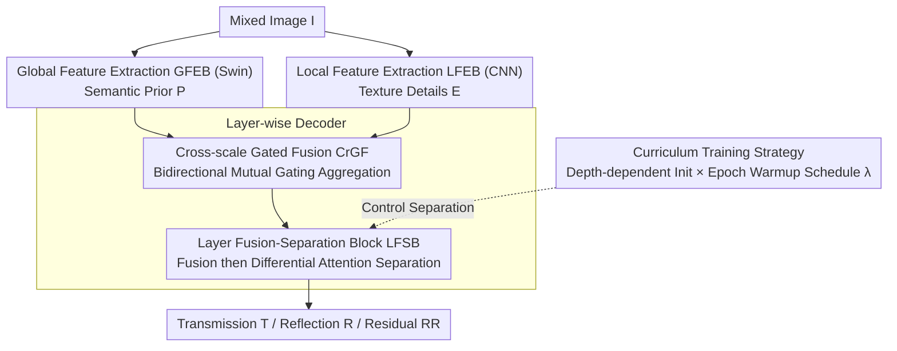

# ReflexSplit: Single Image Reflection Separation via Layer Fusion-Separation

**Conference**: CVPR 2026  
**arXiv**: [2601.17468](https://arxiv.org/abs/2601.17468)  
**Code**: [https://github.com/wuw2135/ReflexSplit](https://github.com/wuw2135/ReflexSplit)  
**Area**: Image Restoration  
**Keywords**: Single Image Reflection Separation, Differential Attention, Cross-scale Fusion, Curriculum Learning, Dual-stream Architecture

## TL;DR
ReflexSplit proposes an explicit layer fusion-separation framework. It adaptively aggregates multi-scale features through Cross-scale Gated Fusion (CrGF) and employs differential dual-dimensional attention $\mathbf{A}^t - \lambda_\ell \mathbf{A}^r$ within the Layer Fusion-Separation Block (LFSB) for cross-stream interference suppression. Combined with a curriculum training strategy utilizing depth-dependent initialization and epoch-wise warmup, it achieves SOTA performance on both synthetic and real-world reflection separation benchmarks.

## Background & Motivation

1. **Background**: Single Image Reflection Separation (SIRS) aims to decompose a mixture image $\mathbf{I}$ into a transmission layer $\mathbf{T}$ and a reflection layer $\mathbf{R}$. Recent methods have evolved from simple linear models $\mathbf{I}=\mathbf{T}+\mathbf{R}$ to non-linear residual models $\mathbf{I}=\mathbf{T}+\mathbf{R}+\Phi(\mathbf{T},\mathbf{R})$, enhancing interlayer interactions through methods like YTMT, DSRNet, and DSIT.

2. **Limitations of Prior Work**: When facing strong reflections (e.g., specular reflections on water) or semantically ambiguous scenes (e.g., a moon painting on a wall misidentified as a reflection), networks frequently confuse transmission and reflection layers ("reflection-transmission confusion"). As network depth increases, the loss of feature information renders intra-layer and inter-layer features inseparable, which is particularly severe in deep decoders.

3. **Key Challenge**: Existing methods are deficient in two dimensions: (a) Inadequate hierarchical feature aggregation leads to unstable gradients—DSIT lacks gradient stability, RDNet lacks explicit scale coordination, and MuGI operates only at a single scale; (b) Implicit fusion mechanisms lead to progressive layer confusion—DSIT directly aggregates dual-dimensional attention outputs without separation constraints.

4. **Goal**: (a) How to adaptively aggregate features from diverse sources (semantic priors, texture details, decoder context) across multiple scales? (b) How to enforce layer-specific separation while fusing shared structural information? (c) How to avoid instabilities caused by excessive separation constraints during early training?

5. **Key Insight**: Model reflection separation explicitly as an alternating "fusion-separation" process—fusing first to obtain shared structural information, then employing differential attention for layer-specific separation. Extend the attention cancellation idea from Differential Transformer—originally for single-stream noise suppression—to dual-stream layer separation.

6. **Core Idea**: By executing alternating fusion (shared structure extraction) and differential attention separation (cross-stream subtraction $\mathbf{A}^t - \lambda_\ell \mathbf{A}^r$) within a dual-stream architecture, combined with a curriculum training strategy to progressively enhance separation intensity, robust transmission-reflection separation is achieved.

## Method

### Overall Architecture

ReflexSplit adopts a dual-stream encoder-decoder architecture. The encoder contains dual-branch feature extraction: a pre-trained Swin Transformer serves as the Global Feature Extraction Block (GFEB) to extract semantic priors $\{\mathbf{P}_\ell\}$, while a MuGI-based CNN acts as the Local Feature Extraction Block (LFEB) to capture texture details $\{\mathbf{E}_\ell\}$. The decoder adaptively aggregates multi-scale features via CrGF, and the LFSB executes alternating fusion and differential separation at each layer. The model outputs the transmission layer $\mathbf{T}$, reflection layer $\mathbf{R}$, and residual $\mathbf{RR}$ (capturing non-linear interactions).

### Key Designs

**1. Cross-scale Gated Fusion (CrGF): Stabilizing multi-scale feature flow to prevent progressive decoder degradation**

Features for reflection separation originate from three misaligned sources: global semantic priors $\mathbf{P}_\ell$ from Swin, local textures $\mathbf{E}_\ell$ from CNN, and the preceding decoder context $\mathbf{F}_{\ell+1}$. Prior methods either interact at a single scale (MuGI), concatenate without adaptive gating (RobustSIRR), or follow fixed paths (RDNet), leading to inadequate cross-scale coordination and gradient instability. CrGF first sums the three paths into a raw feature $\mathbf{F}_\ell^{\text{raw}} = \mathbf{F}_{\ell+1} + \mathbf{P}_\ell + \mathbf{E}_\ell$, then executes bidirectional mutual gating with the decoder context:

$$\mathbf{F}_\ell^{\text{main}} = \mathcal{G}_1(\mathbf{F}_\ell^{\text{raw}}) \odot \mathcal{G}_2(\mathbf{F}_{\ell+1}), \qquad \mathbf{F}_\ell^{\text{aux}} = \mathcal{G}_1(\mathbf{F}_{\ell+1}) \odot \mathcal{G}_2(\mathbf{F}_\ell^{\text{raw}})$$

The gate $\mathcal{G}$ selects complementary channels via channel splitting, and the two paths are fused using softmax weighting. This bidirectional gating allows the "current layer" and "context" to mutually filter and dynamically reorganize, stabilizing the feature flow at each scale.

**2. Layer Fusion-Separation Block (LFSB): Maintaining layer separability through alternating fusion and differential attention**

Strong reflections or semantic ambiguities cause networks to blend transmission and reflection signals. LFSB decomposes each stage into three alternating steps. Early fusion utilizes bidirectional cross-stream projection $\mathbf{F}^{t'}_\ell = \mathbf{W}^t[\mathbf{F}^t_\ell \| \mathbf{F}^r_\ell]$ to align streams in a shared semantic space. This is followed by critical differential dual-dimensional attention: Self-Attention (SA) along the batch dimension for spatial correlation and Cross-Attention (CA) along the sequence dimension for interlayer dependency, followed by cross-stream subtraction:

$$\mathbf{A}^t_{\text{diff}} = (\mathbf{A}^t_{\text{SA}} + \mathbf{A}^t_{\text{CA}}) - \sigma(\lambda_\ell)\,(\mathbf{A}^r_{\text{SA}} + \mathbf{A}^r_{\text{CA}})$$

Finally, FFN and residual connections aggregate the separated features. Unlike DSIT, which simply sums SA and CA outputs without separation constraints, this subtraction "cancels out" residual reflection responses in the transmission stream (and vice versa), maintaining layer-specific signals at all depths.

**3. Curriculum Training Strategy: Progressive enhancement of separation intensity across depth and time**

The differential coefficient $\lambda$ is a double-edged sword: strong separation early in training causes oscillation, while weak separation fails to decouple layers. ReflexSplit employs a spatial-temporal joint schedule. Spatially, it uses depth-dependent initialization $\lambda_\ell^{\text{init}} = 0.8 - 0.6\,e^{-0.3\ell}$, applying stronger separation ($\lambda \to 0.8$) in deep layers where information loss is high and weaker separation ($\lambda \to 0.2$) in shallow layers to preserve fine textures. Temporally, an epoch-wise warmup $\lambda_{\text{diff}}(e)$ linearly scales the global coefficient from 0.1 to 1.0 over the first 30 epochs. The effective coefficient is $\lambda_\ell(e) = \lambda_\ell^{\text{init}} \cdot \lambda_{\text{diff}}(e)$, allowing the network to learn reconstruction first and separation later.

### Loss & Training

The total loss function consists of six components: Charbonnier reconstruction loss $\mathcal{L}_{\text{rec}}$ (transmission), $\ell_1$ reflection loss $\mathcal{L}_{\text{refl}}$, VGG perceptual loss $\mathcal{L}_{\text{vgg}}$ (layers {2,7,12,21,30}), color consistency loss $\mathcal{L}_{\text{color}}$, exclusivity loss $\mathcal{L}_{\text{exclu}}$, and reconstruction constraint loss $\mathcal{L}_{\text{recons}}$.

## Key Experimental Results

### Main Results

| Dataset | PSNR↑ / SSIM↑ | ReflexSplit (Ours) | Prev. SOTA (RDNet) | Gain |
|--------|------|------|----------|------|
| Real20 | PSNR / SSIM | 25.22 / 0.846 | 25.17 / 0.841 | +0.05 / +0.005 |
| Objects | PSNR / SSIM | 27.08 / 0.929 | 27.11 / 0.925 | -0.03 / +0.004 |
| Postcard | PSNR / SSIM | 25.38 / 0.927 | 25.04 / 0.910 | +0.34 / +0.017 |
| Wild | PSNR / SSIM | 27.30 / 0.933 | 27.86 / 0.931 | -0.56 / +0.002 |
| Nature | PSNR / SSIM | 27.03 / 0.854 | 26.75 / 0.846 | +0.28 / +0.008 |
| Mean (540 imgs) | PSNR / SSIM | 26.40 / 0.898 | 26.38 / 0.890 | +0.02 / +0.008 |

Note: ReflexSplit has 174M parameters vs. RDNet's 266.4M, demonstrating higher parameter efficiency.

### Ablation Study

Insights from LFSB differential attention visualization and hierarchical feature separation comparison:

| Config | Key Effect | Description |
|------|---------|------|
| DSIT (baseline) | Reflection-transmission confusion in deep layers | No separation constraint, progressive degradation |
| + CrGF | Stabilized gradient flow | Adaptive cross-scale aggregation |
| + LFSB (w/o diff) | Fusion without separation | Shared structures but unresolved layer confusion |
| + LFSB (w/ diff) | Effective layer feature separation | Differential operator suppresses cross-stream interference |
| + Curriculum Training | Improved training stability | Progressive enhancement of separation intensity |

### Key Findings
- The most significant improvement occurs on the Postcard subset (+0.34 PSNR / +0.017 SSIM), which features strong reflections and obvious non-linear mixtures.
- Differential attention visualization (Figure 6) clearly shows how cross-stream subtraction suppresses overlapping attention patterns, transforming blurred mixed attention into layer-specific balanced distributions.
- Compared to RDNet (266.4M parameters, two-stage training), ReflexSplit achieves comparable or superior performance with fewer parameters (174M) and a simpler training pipeline.

## Highlights & Insights
- **Migration from Differential Transformer to Dual-stream Separation**: While the original Differential Transformer uses subtraction within a single head to cancel noise, this work extends it to cross-stream applications—using the attention from one stream to "cancel" interlayer interference in the current stream. This concept of cross-modal/cross-stream subtraction is broadly applicable to multi-stream architectures requiring signal disentanglement.
- **Spatial-Temporal Synergy in Curriculum Training**: The combination of depth-dependent initialization and epoch-wise warmup creates a 2D control surface for separation intensity. This ensures an optimal fusion-separation balance across different training stages and depths, offering a fine-grained strategy for other multi-scale decomposition tasks.

## Limitations & Future Work
- PSNR is slightly lower than RDNet on certain subsets (Objects, Wild), indicating the need for better adaptation to specific scene types.
- Reliance on a pre-trained Swin Transformer for global semantics may limit generalization to data outside the training domain.
- The initialization formula for differential coefficient $\lambda_\ell$ is manually designed and may not be universal across all data distributions.
- Detailed comparisons of computational efficiency (FLOPs, inference latency) were not provided; 174M parameters is larger than DSIT (136M) though smaller than RDNet (266M).

## Related Work & Insights
- **vs DSIT**: DSIT uses dual-dimensional attention but aggregates outputs without separation constraints, leading to progressive deep-layer confusion. ReflexSplit explicitly disentangles features via differential operators.
- **vs RDNet**: RDNet uses invertible encoders for lossless gradient flow but suffers from high parameter counts (266M) and requires two-stage training. ReflexSplit achieves adaptive cross-scale coordination with fewer parameters using CrGF.
- **vs DSRNet**: DSRNet introduces MuGI for interlayer interaction but only at a single scale. CrGF extends its gating philosophy to cross-scale aggregation.

## Rating
- Novelty: ⭐⭐⭐⭐ Application of differential attention in dual-stream separation is creative, though the framework is incrementally improved.
- Experimental Thoroughness: ⭐⭐⭐⭐ Evaluation across multiple datasets with visualization analysis, though detailed ablation numbers are limited.
- Writing Quality: ⭐⭐⭐⭐ Clear motivation, detailed methodology, and rich illustrations.
- Value: ⭐⭐⭐ Significant value within the SIRS subfield, but impact on the broader vision community may be limited.

<!-- RELATED:START -->

## Related Papers

- [\[CVPR 2026\] Reflection Separation from a Single Image via Joint Latent Diffusion](reflection_separation_from_a_single_image_via_joint_latent_diffusion.md)
- [\[CVPR 2026\] LightRR: A Lightweight Network for Single Image Reflection Removal](lightrr_a_lightweight_network_for_single_image_reflection_removal.md)
- [\[CVPR 2026\] GFRRN: Explore the Gaps in Single Image Reflection Removal](gfrrn_explore_the_gaps_in_single_image_reflection_removal.md)
- [\[CVPR 2026\] Rectifying Latent Space for Generative Single-Image Reflection Removal](rectifying_latent_space_for_generative_single-image_reflection_removal.md)
- [\[AAAI 2026\] Depth-Synergized Mamba Meets Memory Experts for All-Day Image Reflection Separation](../../AAAI2026/image_restoration/depth-synergized_mamba_meets_memory_experts_for_all-day_image_reflection_separat.md)

<!-- RELATED:END -->
