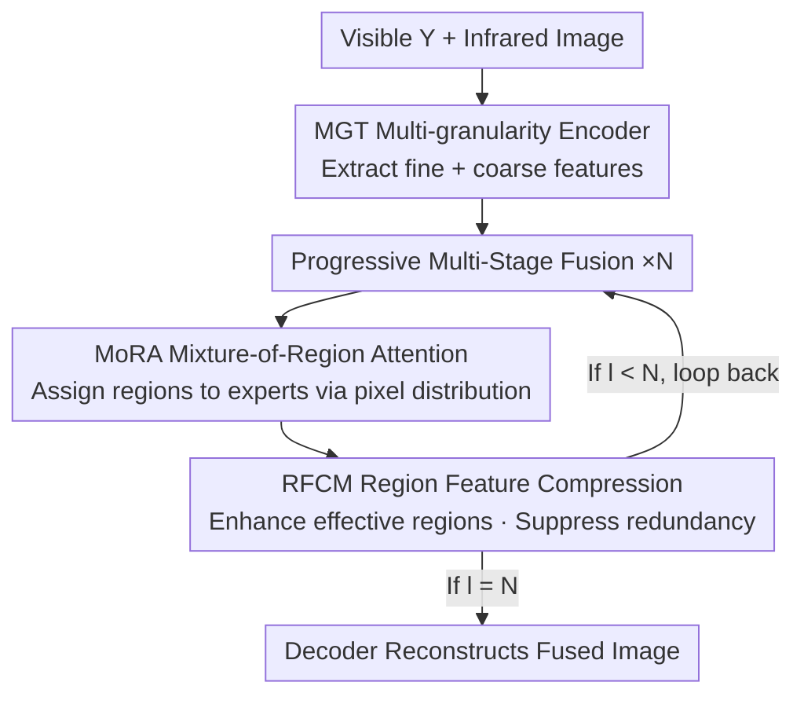

# RegionFuse: Region-Adaptive Pixel Distribution Learning for Infrared and Visible Image Fusion

**Conference**: CVPR 2026  
**Paper**: [CVF Open Access](https://openaccess.thecvf.com/content/CVPR2026/html/Xia_RegionFuse_Region-Adaptive_Pixel_Distribution_Learning_for_Infrared_and_Visible_Image_CVPR_2026_paper.html)  
**Code**: https://github.com/DarkIceField/RegionFuse (Available)  
**Area**: Image Restoration / Infrared and Visible Image Fusion  
**Keywords**: Infrared and visible fusion, region-adaptive, pixel distribution, region-attention MoE, dynamic fusion weights

## TL;DR
RegionFuse refines the fusion weights of Infrared-Visible Image Fusion (IVIF) from "global uniformity" to "region-adaptive according to local pixel distribution." By utilizing a region-level Mixture-of-Region Attention (MoRA) to dispatch regions with different pixel distributions to various masked attention experts, and enhancing effective regions while suppressing redundancy via a Region Feature Compression Module (RFCM), it achieves SOTA performance on four IVIF benchmarks and exhibits particular robustness against non-uniform illumination and exposure.

## Background & Motivation

**Background**: The goal of Infrared-Visible Image Fusion (IVIF) is to synthesize thermal radiation information from infrared and texture details from visible images into a single frame, compensating for single-modality limitations and providing better inputs for downstream tasks like detection and segmentation. Current deep learning methods (AE, GAN, Diffusion, CNN, Transformer, Hybrid) mostly follow two paths: **Fixed Fusion** (static, scene-independent weights) and **Sample-adaptive Fusion** (dynamic weights calculated based on the global pixel distribution of the entire image, such as the illumination-aware loss in PIAFusion or Mixture-of-Experts in MoE-Fusion).

**Limitations of Prior Work**: Fixed fusion cannot adapt to real-world imaging conditions—where visible textures should dominate under high illumination and infrared under low light. Static weights either discard useful modal information or amplify modal noise. While sample-adaptive fusion adjusts per image, its **granularity is too coarse**: it calculates a single set of weights for the entire image, ignoring the fact that "pixel distributions across different regions within the same image are inconsistent." An image can simultaneously contain overexposed, underexposed, and correctly exposed regions, each requiring trust in different modalities.

**Key Challenge**: The mismatch between the decision granularity of fusion weights and the spatial inconsistency of pixel distributions. Sample-level weights cannot differentiate modal re-weighting between "different reliability regions within the same image," thus failing to capture key cross-modal information or suppress modal redundancy artifacts in scenes with severely non-uniform pixel distributions (e.g., non-uniform lighting).

**Key Insight**: The authors observe that "sample-adaptive fusion is a special case of region-adaptive fusion"—when the region size equals the full image, region-adaptive fusion degrades into sample-adaptive. Therefore, lowering the decision granularity to the region level, allowing each region to learn a set of fusion weights based on its local pixel distribution, should theoretically be strictly more powerful and generalize better. Intuitively: introduce more infrared in under/overexposed regions and preserve visible details in well-lit regions.

**Core Idea**: Decompose the fusion task into **multiple sub-tasks based on local pixel distributions** and use region-level Mixture-of-Region Attention to dynamically optimize fusion weights for different regions—referred to as "Region-Adaptive Pixel Distribution Learning."

## Method

### Overall Architecture
RegionFuse takes the Y-channel of the visible image $I_v$ and the infrared image $I_r$ (both $\mathbb{R}^{1\times H\times W}$) as input, outputting the fused Y-channel $I_f$. The framework consists of three stages: **two MGT encoders** extracting features from visible and infrared respectively; the **Region-Aware Dynamic Fusion** module adaptively fusing features based on regions and pixel distributions; and finally, a **decoder** for image reconstruction.

The two main components within the fusion module are the **RegionFormer Block (RFB)** (centered on MoRA) and **RFCM**, which are linked through "progressive multi-stage fusion." The fusion at stage $l$ is denoted as:

$$F^l = \mathrm{Fuse}\big([\,F_v + F^{l-1},\; F_r + F^{l-1}\,]\big),\quad l\in[1,N],$$

where $[\cdot,\cdot]$ denotes channel concatenation. Each stage refines the previous fusion result, progressively integrating cross-modal and cross-region information.

### Key Designs

**1. Multi-granularity Transformer Encoder (MGT): Preserving both intra-region details and cross-region global context**

Since pixel distributions are inconsistent across regions in IVIF, the encoder must extract **fine-grained intra-region features** to preserve details in under/overexposed areas and perform **coarse-grained cross-region global interactions** to avoid intensity non-uniformity. The authors utilize the X-Restormer block, proven in image restoration, to build the encoder: $F_* = \mathrm{MGT}(\mathrm{Embed}(I_*))$, $I_*\in\{I_v, I_r\}$. While not the primary innovation, ablation shows that replacing it with a standard Restormer encoder (w/o MGT) leads to significant drops in gradient information and visual fidelity, indicating that "fine + coarse" hierarchical representation is the prerequisite for region-adaptive fusion.

**2. Mixture-of-Region Attention (MoRA): Assigning different pixel distribution regions to distinct masked attention experts**

This is the core contribution, addressing the pain point that "sample-level weights are too coarse." MoRA combines the task decomposition capability of Mixture-of-Experts (MoE) with the feature interaction capability of Attention, making each expert responsible for a specific class of pixel distribution. It follows three steps:

First, **Region Embedding**: A region embedding layer is added after Q/K/V projections to slice the feature map into region-level tokens, resulting in $Q,K,V\in\mathbb{R}^{C\frac{H}{R}\frac{W}{R}\times R^2}$ ($R$ is region size). Overlapping partitioning that increases with network depth is introduced, where final region size $R=(1+\gamma)R_o$ ($\gamma$ is the growth ratio) to mitigate intensity sudden changes between regions.

Second, **Pixel-Distribution-Aware Routing**: An MLP + softmax predicts the responsibility score of each region for each expert: $S=\mathrm{Softmax}(\mathrm{MLP}(\mathrm{RSP}(X)))$, where $S\in\mathbb{R}^{E\times C\frac{H}{R}\frac{W}{R}}$, $E$ is the number of experts, and $\mathrm{RSP}(\cdot)$ is the region splitting operation. The router classifies regions by pixel distribution.

Third, **Masked Attention Experts**: Each expert uses an attention mask $M_e$ to limit its interaction solely to regions with "the same class of pixel distribution." The mask is determined by the TopK selection of the router: $\hat C(i,e)=\mathrm{TopK}(s_i(e),k)$ indicating if region $i$ is chosen by expert $e$:

$$m^e_{ij}=\begin{cases}1,& \hat C(i,e)=1 \text{ and } \hat C(j,e)=1\\ 0,& \text{otherwise}\end{cases}$$

The attention for expert $e$ is $\mathrm{ATTN}_e(Q,K,V)=\mathrm{Softmax}(M_e\odot QK^\top/\alpha)\,V$. The final MoRA output is the weighted sum of experts $\sum_{e} S(e)\,\mathrm{ATTN}_e(Q,K,V)$. This ensures that overexposed and normal regions are routed to different experts with distinct fusion behaviors, achieving region-by-region adaptation. Visualization confirms that shallow experts focus on simple brightness changes, while deep experts capture high-level semantics like salient objects/backgrounds.

**3. Region Feature Compression Module (RFCM): Enhancing effective regions and suppressing redundancy in high-dimensional features**

Directly performing attention on high-dimensional features is computationally expensive. RFCM follows each MoRA for region-level compression. It reshapes features into region patches $F_r\in\mathbb{R}^{\frac{H}{R}\frac{W}{R}\times C\times R\times R}$ and applies channel attention $F'_r=M_c(F_r)\odot F_r$ to enhance key channels and suppress redundancy, where $M_c(F_r)=\mathrm{Sigmoid}(\mathrm{Conv}(\mathrm{GAP}(F_r)))$. Then, a $1\times1$ convolution + LeakyReLU reduces dimensions $F'_{r\_out}=\mathrm{LReLU}(\mathrm{Conv}(F'_r))$, compressing channels from $C$ to $C'$. This addresses the redundancy in region representations produced by MoRA and reduces costs. Ablation shows that replacing RFCM with standard convolution (w/o RFCM) leads to the largest drop in visual fidelity.

**4. Enhanced Intensity Loss: Substituting element-wise maximum with gradient-weighted masks**

In the absence of ground truth for IVIF, loss design is critical. Traditional intensity losses use element-wise maximums, which may introduce too much visible light in overexposed areas or redundant infrared in well-lit areas. The authors use a gradient-weighted mask $M$:

$$L_{int}=\tfrac{1}{HW}\big\|\,I_f-(M\odot I_v+(1-M)\odot I_r)\,\big\|_F^2,$$

where the mask is decided by local average gradients: $m(i,j)=1$ if $G_v(i,j)>G_r(i,j)$ else $0$, where $G_v, G_r$ are Sobel average gradients within a $R\times R$ local area. This forces the network to rely more on infrared in overexposed regions and preserve visible textures in well-lit areas. The total loss includes gradient loss $L_{gra}=\tfrac{1}{HW}\|\nabla I_f-\max(\nabla I_v,\nabla I_r)\|_1$ and a load balancing loss $L_{load}$ (active only for the first 5 epochs) to stabilize routing: $L=L_{int}+\lambda L_{gra}+\mu L_{load}$.

### Loss & Training
Trained on the MSRS dataset (1083 pairs) with $128\times128$ patches, Adam optimizer, 80 epochs + 4 epoch linear warm-up, cosine learning rate decay, batch size 8, initial lr $10^{-4}$, $\lambda=\mu=5$. $L_{load}$ is used only in the first 5 epochs to stabilize the router.

## Key Experimental Results

### Main Results
Compared with 7 SOTAs across four benchmarks (MSRS / RoadScene / M3FD / TNO). Five metrics (SF, AG, VIF, Qabf, Qcb) are used (higher is better). RegionFuse was trained only on MSRS; **the zero-shot testing on the other three datasets** still shows leadership, demonstrating strong generalization.

| Dataset | Method | SF↑ | AG↑ | VIF↑ | Qabf↑ | Qcb↑ |
|--------|------|------|------|------|------|------|
| MSRS | PIAFusion | 11.49 | 3.75 | 0.99 | 0.69 | 0.58 |
| MSRS | CDDFuse | 11.56 | 3.73 | 1.05 | 0.69 | 0.58 |
| MSRS | DCEvo | 11.46 | 3.71 | 1.03 | 0.71 | 0.59 |
| MSRS | **RegionFuse** | **12.12** | **3.99** | **1.06** | **0.72** | **0.60** |
| RoadScene | CDDFuse | 18.93 | 6.74 | 0.62 | 0.48 | 0.49 |
| RoadScene | DCEvo | 14.83 | 5.50 | 0.68 | 0.57 | 0.48 |
| RoadScene | **RegionFuse** | 18.73 | **6.81** | **0.68** | **0.59** | **0.51** |

Note: On RoadScene, SF is slightly lower than CDDFuse (18.73 vs 18.93), but other metrics like AG/Qabf/Qcb are optimal. RegionFuse also leads in fidelity metrics (VIF/Qabf) on M3FD and TNO.

### Ablation Study
Removing modules sequentially on MSRS (higher is better):

| Configuration | SF | AG | VIF | Qabf | Qcb | Note |
|------|------|------|------|------|------|------|
| w/o MGT | 11.374 | 3.678 | 1.037 | 0.713 | 0.597 | Using standard Restormer encoder; gradient/fidelity drop |
| w/o MoRA | 11.640 | 3.774 | 1.060 | 0.717 | 0.592 | Standard attention; fusion quality degrades |
| w/o RFCM | 11.779 | 3.832 | 1.018 | 0.682 | 0.569 | Standard conv; fidelity drops most significantly |
| w/o $L_{load}$ | 12.088 | 3.954 | 1.036 | 0.714 | 0.593 | Slight drop in VIF/Qcb |
| Region→Sample | 11.965 | 3.938 | 1.039 | 0.719 | 0.584 | Becomes sample-adaptive; VIF/Qcb drop |
| **Full (Ours)** | **12.115** | **3.995** | **1.063** | **0.723** | **0.601** | Full model performs best |

### Extensions
- **Object Detection (M3FD, YOLOv5s)**: Detectors trained on RegionFuse images reach **86.50%** mAP@0.5, outperforming others (DDFM 85.05, PIAFusion 84.41), particularly in Lamp (84.20) and Motorcycle (87.87) categories.
- **VIS-NIR Scene (Unseen Task)**: Zero-shot transfer to NIR-VIS leads across all metrics (VIF 1.12 / Qcb 0.62), verifying the adaptability of the region-adaptive paradigm.
- **Extreme Non-uniform Illumination**: Artificially generated images with both over/underexposure using $I'=\phi[k(I-0.5)+0.5]$ where $k$ ranges from 1.5 to 5.0. As $k$ increases, RegionFuse's advantage becomes more pronounced.

### Key Findings
- **Removing RFCM causes the largest drop** (Qabf 0.723→0.682), indicating that cross-region modal interactions must be explicitly compressed to avoid redundancy.
- **Region-level vs Sample-level** (Region→Sample) directly validates the core hypothesis: moving decision granularity from whole-image to region-level improves VIF/Qcb, confirming that sample-adaptive is indeed a suboptimal special case.
- **Expert Division**: Shallow experts handle brightness differences, while deep experts capture salient semantics, proving that MoRA learns meaningful pixel distribution classification rather than random partitioning.

## Highlights & Insights
- **The Granularity Story is compelling**: Placing "Fixed → Sample-Adaptive → Region-Adaptive" on a progression chain and proving sample-adaptive is just a special case makes the narrative of being "strictly stronger" very persuasive.
- **Natural Synergy between MoE and Masked Attention**: Using a router to assign regions and an attention mask to confine experts within "same-distribution regions" effectively brings MoE "conditional computing" to the spatial domain rather than just token/sample domains. This is a transferable concept for tasks with spatial inconsistency (e.g., non-uniform dehazing, HDR fusion).
- **Alignment with Motivation in Loss Design**: The gradient-weighted mask intensity loss directly incorporates the "trust IR in overexposure, trust visible in bright areas" intuition into the supervision signal, echoing the region-adaptive architecture.
- **Generalization and Downstream gains**: SOTA results on 3/4 benchmarks via zero-shot and mAP improvements in detection show that region-adaptation isn't just an overfitted trick.

## Limitations & Future Work
- **Region size $R$ and overlap ratio $\gamma$ are critical hyperparameters**. While sensitivity analysis was placed in the supplementary materials, the main paper doesn't show the performance curve for $R$ ranges, which might require tuning during deployment.
- **Lack of main-text ablation for expert count $E$ and TopK $k$**: MoE methods are usually sensitive to expert count and sparsity; the trade-off between capacity and computation is not fully explored in the main paper.
- **Computational overhead is only qualitatively "acceptable"**: Although RFCM is designed to reduce costs, there's no comparative table for Parameters/FLOPs/Inference speed against SOTAs.
- **Y-Channel Limitation**: Following standard practice of Y-channel fusion + color retention ignores color consistency, and color fidelity under strong light shifts was not separately evaluated.

## Related Work & Insights
- **vs PIAFusion**: PIAFusion uses illumination-aware loss at the **sample level**, applying one set of weights to the whole image. RegionFuse pushes this to the region level, allowing differential treatment of overexposed/normal areas within the same image.
- **vs MoE-Fusion**: MoE-Fusion uses MoE for dynamic fusion but routes **samples** (different images to different experts). By definition, it is a special case of RegionFuse (where region = whole image).
- **vs CDDFuse / Restormer series**: These rely on strong backbone representations but use static or global fusion strategies. RegionFuse utilizes X-Restormer as a multi-granularity encoder base, with the true innovation lying in the region-adaptive fusion on top.
- **Transferable Insight**: The mechanism of "routing spatial regions to specialized masked attention experts based on local distributions" is highly valuable for any task where statistical properties vary significantly within a single image.

## Rating
- Novelty: ⭐⭐⭐⭐ Refines fusion granularity to region-level via MoE+Masked Attention with clear logic, though components have precedents.
- Experimental Thoroughness: ⭐⭐⭐⭐ 4 benchmarks + extreme lighting + downstream tasks + ablation + visualization; solid, despite missing main-text efficiency and expert-count ablations.
- Writing Quality: ⭐⭐⭐⭐ Clear motivation and well-explained modules.
- Value: ⭐⭐⭐⭐ SOTA in IVIF with open-source code and downstream gains; the region-adaptive routing mechanism is transferable.

<!-- RELATED:START -->

## Related Papers

- [\[CVPR 2026\] Bridging Human Evaluation to Infrared and Visible Image Fusion](bridging_human_evaluation_to_infrared_and_visible_image_fusion.md)
- [\[CVPR 2026\] Customized Fusion: A Closed-Loop Dynamic Network for Adaptive Multi-Task-Aware Infrared-Visible Image Fusion](customized_fusion_a_closed-loop_dynamic_network_for_adaptive_multi-task-aware_in.md)
- [\[CVPR 2026\] Beyond Strict Pairing: Arbitrarily Paired Training for High-Performance Infrared and Visible Image Fusion](beyond_strict_pairing_arbitrarily_paired_training_for_high-performance_infrared_.md)
- [\[CVPR 2026\] Degradation-Robust Fusion: An Efficient Degradation-Aware Diffusion Framework for Multimodal Image Fusion in Arbitrary Degradation Scenarios](degradation-robust_fusion_an_efficient_degradation-aware_diffusion_framework_for.md)
- [\[CVPR 2026\] Enhancing Unregistered Hyperspectral Image Super-Resolution via Unmixing-based Abundance Fusion Learning](enhancing_unregistered_hyperspectral_image_super-resolution_via_unmixing-based_a.md)

<!-- RELATED:END -->
