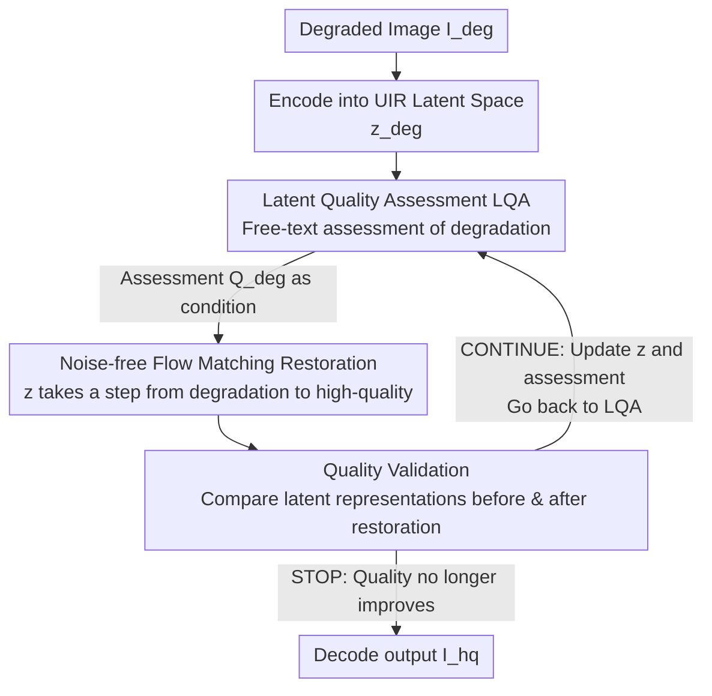

# Restore, Assess, Repeat: A Unified Framework for Iterative Image Restoration

**Conference**: CVPR 2026  
**Paper**: [CVF Open Access](https://openaccess.thecvf.com/content/CVPR2026/html/Chen_Restore_Assess_Repeat_A_Unified_Framework_for_Iterative_Image_Restoration_CVPR_2026_paper.html)  
**Code**: [Project Page](https://restore-assess-repeat.github.io/)  
**Area**: Image Restoration  
**Keywords**: All-in-one Image Restoration, Composite Degradation, Image Quality Assessment, Flow Matching, Iterative Restoration

## TL;DR
RAR integrates "Image Quality Assessment (IQA)" and "Image Restoration (IR)" into the same latent space to form an end-to-end trainable model. By repeatedly executing "assess $\rightarrow$ restore $\rightarrow$ reassess" in the latent space, it cleans up images under unknown/composite degradations both accurately and rapidly (11.27× faster than SOTA).

## Background & Motivation
**Background**: Image restoration aims to recover clean images from those corrupted by noise, blur, haze, rain, low light, and other degradations. In the real world, degradations are often **composite and unknown beforehand** (e.g., an image simultaneously having noise, haze, and low light), which is the focus of this paper. Currently, handling composite degradations follows two main approaches: (1) **all-in-one models**—which use a single unified generative model to handle everything directly, which is highly efficient but lags in performance; (2) **agentic models**—which use an agent to repeatedly pick tools from a library of "single-degradation specialized restoration tools", which can restore images step-by-step but are extremely clunky and slow.

**Limitations of Prior Work**: Both lines of work suffer from severe drawbacks. For all-in-one models, a representative work, AutoDIR, incorporates an assessment step but relies on CLIP for IQA. CLIP essentially performs n-way classification over a **pre-defined set of degradation labels**. Its zero-shot IQA performance is poor; it requires supervised fine-tuning to focus on degradations rather than semantics, which restricts its generalization capability to a closed set. For agentic models, a representative work, AgenticIR, uses descriptive IQA (DepictQA) to provide rich assessments. However, **IQA and IR are decoupled modules**: the restoration tools must first **decode the latent representation into a real image**, which is then encoded into the IQA latent space for assessment. It is then handed over to a large LLM for next-step planning and trial-and-error execution. This entire pipeline is incredibly slow. Moreover, even if the IQA accurately identifies the degradation, whether it can be restored still depends on whether the corresponding tool exists in the pre-defined toolset.

**Key Challenge**: The root cause lies in the **disconnection between the IQA and IR modules**. The assessment results must be transferred to the restoration module via "text decoding", which is non-differentiable and lossy, causing both slow speed and information loss. Furthermore, the assessment is performed only once at the beginning, meaning the assessment does not update as the image quality changes during restoration.

**Goal**: Combine the strengths of both lines of work—achieving **rich free-text assessment + iterative restoration** like agentic models, while maintaining the **unified efficiency** of all-in-one models.

**Key Insight**: If IQA and IR **share the same latent space**, the assessment can skip decoding and be directly fed into the restoration module as logits/embeddings. Consequently, the entire "assessment-restoration" loop can be integrated into an end-to-end trainable framework, allowing for multi-round iterations within the latent space.

**Core Idea**: Reformulate the descriptive IQA into a **Latent Quality Assessment (LQA)** operating within the restoration module's latent space, and utilize **Flow Matching** for noise-free iterative restoration, forming a closed loop of **Restore-Assess-Repeat**—where assessment, restoration, and validation are conducted for multiple rounds entirely in the latent space.

## Method

### Overall Architecture
Given an input image $I_{deg}$ with unknown composite degradations, RAR aims to automatically identify the degradations and iteratively restore it into a high-quality image $I_{hq}$. This entire process is **conducted entirely in the latent space**: LQA first assesses what degradations remain in the current latent representation, feeds the assessment results as conditions to the Unified Image Restoration (UIR) module for a single-step restoration, and then LQA re-assesses the updated latent representation—repeating this process until the "quality validation" of LQA determines that the quality no longer improves. Compared to naive approaches (e.g., assessing text $\rightarrow$ encoding with the text branch of a diffusion model $\rightarrow$ restoring, where the assessment is performed only once), RAR introduces two key modifications: bringing IQA into the latent space of the restoration module (LQA) and establishing a feedback loop between the two modules to achieve multi-round iterations.

### Key Designs

**1. Latent Quality Assessment (LQA): Merging IQA and IR into the Same Latent Space to Eliminate the Text Decoding Bottleneck**

The pain point is that in a naive integration, IQA starts from pixel space using its own autoencoder $E_{IQA}$, while the restoration module uses another autoencoder $E_{restore}$, leading to misaligned latent spaces. Moreover, the assessment results must be decoded into text first and then encoded back by the text-conditioning branch of the diffusion model, which is **non-differentiable** (preventing end-to-end training) and **lossy**. LQA aligns both aspects. First, it performs **input-side alignment**: the restoration module projects the degraded image to $z_{deg}=E_{restore}(I_{deg})$. Instead of reading images from pixels, LQA connects a trainable adapter $\mathcal{A}_I$ to bridge the restoration module's latent representation into the IQA:
$$LQA(z_{deg}) = IQA(\mathcal{A}_I(z_{deg}))$$
Second, it performs **condition-side alignment**: instead of using text output from IQA, it directly aligns the output latent representation of IQA, $\tilde{Q}_{deg}=LQA(z_{deg})$, with the output embedding of the restoration module's text-conditioning branch $\mathcal{T}$, using another adapter $\mathcal{A}_Q$:
$$Q_{deg} = \mathcal{T}(\mathcal{A}_Q(\tilde{Q}_{deg}))$$
This step directly uses embeddings as conditions and bypasses text decoding. Consequently, the heavy and slow text-conditioning branch of the restoration module can be **completely discarded**, saving latency and parameter count. The training adopts a two-stage strategy: first, freeze the backbones of IQA/UIR and train only the adapters, then unfreeze everything for fine-tuning. For the base models, IQA uses **DepictQA** (VLM-based), which can output free text and also compare image pairs, and UIR uses any strong generative model. Ablations (Table 4) show that using embedding conditioning instead of text, and latent space instead of pixel input space, boosts the PSNR from 24.70 to 28.49 (on unknown degradations), validating the effectiveness of "eliminating decoding and sharing the latent space."

**2. Noise-free Flow Matching Restoration: Allowing Intermediate Latents to be Repeatedly Assessed Without Noise Corruption**

To perform iterative assessment, one must feed the **intermediate latent representation** $z^n_{deg}$ during the restoration process back to the LQA. However, if a standard diffusion denoising paradigm is used, the intermediate representations **contain added noise**, which corrupts LQA's assessment. Therefore, the authors switch to **Stable Diffusion 3.5's Flow Matching (FM)** and introduce a key modification: removing the noise term to **directly learn the mapping from the degraded image distribution $\rho_{deg}$ to the high-quality image distribution $\rho_{hq}$** (instead of standard approaches starting from noise $\mathcal{N}(0,I)$ and conditioning on the degraded image). A velocity field $v_\theta$ is trained to predict the velocity vector between the two distributions:
$$\mathcal{L}_v = \mathbb{E}_{z_{deg},z_{hq},Q_{deg},t}\, \| v_\theta(z_t,Q_{deg},t) - (z_{hq}-z_{deg}) \|^2$$
where $z_t=(1-t)z_{deg}+t\,z_{hq}$ represents the linear interpolation between the two distributions. Consequently, the updated input $z^n_{deg}$ at each iteration step remains a "clean" degraded latent representation without noise corruption, allowing LQA to provide meaningful feedback. Ablation studies (Table 5) show that iterative conditioning is beneficial for FM (SD3.5 composite degradation PSNR increases from 18.76 to 19.16) but acts as a **detriment** for diffusion (SD1.5 drops from 18.37 to 18.17), precisely because diffusion's noise corrupts the latent representation that LQA needs to read.

**3. Restore-Assess-Repeat Iterative Closed Loop + Quality Validation Stopping Criterion: Dynamically Updating Conditions and Adaptively Deciding the Number of Iteration Rounds**

With noise-free FM, a feedback loop can be established between the two modules. UIR starts with the initial $z^0_{deg}$ and the initial assessment $Q^0_{deg}$. Every few steps, the input is updated using the predicted velocity $z^{n+1}_{deg}=z^n_{deg}+v^n$, and LQA re-assesses to update the condition $Q^{n+1}_{deg}=LQA(z^{n+1}_{deg})$. The training objective is modified accordingly to operate on intermediate representations (Equation 6, replacing $z_{deg},Q_{deg}$ with $z^n_{deg},Q^n_{deg}$), seamlessly integrating into standard FM training—allowing LQA to be called at any random time step during training. This achieves **progressive, on-demand restoration** (e.g., first denoising, then looking back to find remaining haze, and dehazing in the next round).

During inference, a **stopping criterion** is required: every $T$ steps, leveraging DepictQA's capability to "compare image pairs," LQA compares the latent representations before and after restoration ($z^n_{deg}$ and $z^{n+T}_{deg}$) and outputs a binary decision. If the new latent representation is better, it outputs **CONTINUE**; otherwise, it outputs **STOP** and outputs $z^n_{deg}$ as the final result. Ablations (Table 6) show that this criterion runs for an average of **2.4 rounds**, achieving a good balance between fidelity (PSNR/SSIM) and perceptual quality (CLIP-IQA/MUSIQ). Running a fixed 1 round yields the highest fidelity but poorer perceptual quality, while a fixed 4 rounds yields the best perceptual quality but drops fidelity; 2.4 rounds sits right at the optimal trade-off point.

## Key Experimental Results

### Main Results
We cover three setups: composite degradation (16 groups of mixed degradations constructed via MiO100 following AgenticIR, categorized into levels A/B/C, with C containing 3 degradations being the most difficult), unknown degradation (UDC/EUVP), and single degradation (AutoDIR setup, average over 8 standard benchmarks).

Composite degradation (excerpt of Group C, the most difficult 3-degradation tier):

| Metric | RAR | AgenticIR | AutoDIR |
|------|-----|-----------|---------|
| PSNR ↑ | **19.33** | 18.82 | 18.61 |
| SSIM ↑ | **0.6579** | 0.5474 | 0.5443 |
| LPIPS ↓ | **0.1489** | 0.4493 | 0.5019 |
| MANIQA ↑ | **0.4653** | 0.2698 | 0.2045 |
| CLIP-IQA ↑ | **0.6554** | 0.3948 | 0.2939 |
| MUSIQ ↑ | **56.56** | 48.68 | 37.86 |

In terms of perceptual metrics, RAR achieves approximately double the performance of the SOTA, with its advantage becoming more pronounced in harder setups. For unknown degradation (UDC), RAR also leads across the board (MUSIQ 55.97 vs. AgenticIR 52.76, CLIP-IQA 0.602 vs. 0.358). On single degradation, RAR's fidelity metrics (PSNR 25.88) are slightly inferior to AutoDIR (27.81), but it leads comprehensively in perceptual metrics (LPIPS 0.0699 vs. 0.1283, MANIQA 0.4125 vs. 0.3053). The authors explain that this is because the GT of the single degradation test set often only addresses one issue while leaving other degradations, whereas RAR tends to remove all degradations; this "over-restoration" paradoxically lowers its fidelity to the GT.

Efficiency (Table 7, Group A):

| Method | Wall-clock Time | Avg. Rounds | LPIPS ↓ |
|------|---------|---------|---------|
| RAR | **6.29** | 2.82 | **0.1299** |
| AutoDIR | 14.30 | 2.92 | 0.3967 |
| AgenticIR | 48.00 | 3.37 | 0.3148 |

RAR is about 11.27× faster than AgenticIR with a smaller parameter count.

### Ablation Study

| Configuration | Unknown Deg. PSNR | Composite Deg. (C) PSNR | Description |
|------|------|------|------|
| CLIP + Text + Pixel (SD1.5) | 20.67 | 16.70 | Naive baseline |
| DepictQA + Text + Pixel (SD1.5) | 22.34 | 17.67 | Switch to descriptive IQA |
| DepictQA + Text + Pixel (SD3.5) | 24.41 | 17.88 | Switch to stronger base model |
| + noise-free cond. | 24.70 | 17.89 | Remove noise conditioning |
| + Latent Input Space | 24.90 | 18.72 | Input-side alignment |
| **+ Embedding Conditioning (Full)** | **28.49** | 18.76 | Condition-side alignment |

| Training Method | Unknown PSNR | Composite (C) PSNR | Description |
|------|------|------|------|
| SD1.5 Non-iterative | 25.57 | 18.37 | — |
| SD1.5 Iterative | 23.05 | 18.17 | Noise corruption, **leads to drop instead** |
| SD3.5 Non-iterative | 28.49 | 18.76 | — |
| SD3.5 Iterative (Full) | **28.60** | **19.16** | Only noise-free FM yields iteration benefits |

### Key Findings
- **The biggest contribution comes from "shared latent space + embedding conditioning"**: On unknown degradations, PSNR jumps from 24.90 (Latent+Text) to 28.49 (Latent+Embedding). Embeddings contain much more information than decoded text and are more efficient.
- **The benefits of iteration are only accessible via noise-free FM**: When enabling iterative conditioning, diffusion (SD1.5) drops performance due to nose-corrupted latents, whereas FM (SD3.5) consistently improves—clearly explaining "why transitioning to noise-free Flow Matching is necessary."
- **Fidelity vs. Perceptual quality is a setup-dependent trade-off**: RAR comprehensively dominates on composite and unknown degradations; its slightly lower fidelity on single degradation is purely because the GT itself is not fully cleaned, while RAR "over-restores."

## Highlights & Insights
- **"Shared latent space" is key to cutting through the IQA-IR decoupled bottleneck**: Previously, the assess-to-restore loop had to go through a non-differentiable, lossy bridge of "decoding to text/images $\rightarrow$ re-encoding." This paper lets both modules share the same latent representations and directly feed embeddings, which allows end-to-end training and eliminates the text-conditioning branch. This paradigm can be generalized to any coupled "assessment + generation" task (e.g., controllable editing, feedback-driven generation).
- **Leveraging the noise-free characteristics of Flow Matching to serve the requirement of "repeatedly reading intermediate representations"**: This serves as an exemplar of matching model selection to task requirements—using FM not for the sake of using FM, but because diffusion noise corrupts the latent representations needed by LQA, which forces the shift to noise-free FM.
- **Reusing DepictQA's "image pair comparison" ability as a stopping criterion**: The same LQA acts as both an evaluator and a binary decision-maker ("has it improved?"), achieving adaptive stopping with zero extra modules, thus saving computation with an average of 2.4 rounds.
- **The "over-restoration" phenomenon is highly insightful**: RAR's slightly lower fidelity on single degradation exposes the fact that existing GT annotations themselves are not fully clean. This suggests that perceptual metrics are more reliable than fidelity metrics in composite degradation scenarios.

## Limitations & Future Work
- **Inferior fidelity on single degradation**: The iterative restoration tends to remove all degradations, which goes beyond the GT that "only fixes one issue." This leads to lower PSNR/SSIM compared to AutoDIR, posing a risk in fidelity-heavy applications (e.g., medical, forensics).
- **Dependency on base model quality**: LQA is built on DepictQA, and UIR uses SD3.5. Thus, the overall performance and stopping decisions are bounded by the capacity of these base models. An incorrect assessment by DepictQA will mislead the entire iteration loop.
- **Architecture and training details are in the supplementary material**: The main text lacks reproducibility details such as adapter structures and two-stage training hyperparameters, presenting a hurdle for replication.
- **Reliability of the stopping criterion has not been stress-tested**: The binary CONTINUE/STOP decisions are generated by LQA comparisons. If LQA falsely judges an image as "improved," the iteration might stop prematurely or fail to stop at all. The paper only reports the average round count on UDC.

## Related Work & Insights
- **vs AutoDIR**: Both attempt to use IQA to handle unknown degradations. However, AutoDIR relies on CLIP for closed-set n-way classification, which has poor zero-shot performance and must be fine-tuned on pre-defined label sets, limiting its generalization. RAR employs the free-text descriptive DepictQA and integrates it into a shared latent space, which is end-to-end trainable and open-ended, leading by a large margin on composite/unknown degradations.
- **vs AgenticIR**: Both use VLM-based IQA like DepictQA. However, in AgenticIR, the IQA and IR tools are disconnected—requiring decoding into images, re-encoding, and then scheduling via a large LLM through trial-and-error, which is slow and bounded by the toolset. RAR integrates both into a single latent space to form an end-to-end model, running ~11.27× faster with superior performance.
- **vs Traditional All-in-One Generative Models (PromptIR/AdaIR/InstructIR, etc.)**: These models heavily rely on known degradation priors or classifiers, which limits their degradation scope. RAR does not assume prior knowledge of degradations and dynamically conditionalizes through LQA feedback to handle unknown/composite degradations.

## Rating
- Novelty: ⭐⭐⭐⭐⭐ Integrating IQA-IR into a shared latent space + leveraging noise-free FM for iterative latent-space assessment is an elegant solution to the assess-restore decoupling bottleneck.
- Experimental Thoroughness: ⭐⭐⭐⭐☆ Three settings + multiple benchmarks + complete ablation studies are solid. The fidelity drop in single-degradation scenarios is transparently discussed, though some details are left in the supplementary materials.
- Writing Quality: ⭐⭐⭐⭐⭐ The motivation is clearly derived, the ablation studies systematically break down each component's contribution, and anti-intuitive findings (e.g., iteration harms diffusion) are well explained.
- Value: ⭐⭐⭐⭐⭐ Establishes a new SOTA on composite/unknown degradations while being an order of magnitude faster. The "shared latent space for assessment feedback" paradigm is highly transferable.

<!-- RELATED:START -->

## Related Papers

- [\[CVPR 2026\] Retrieve-to-Restore: Efficient All-in-One Image Restoration with a Retrieval-Based Degradation Bank](retrieve-to-restore_efficient_all-in-one_image_restoration_with_a_retrieval-base.md)
- [\[CVPR 2026\] Toward Real-world Infrared Image Super-Resolution: A Unified Autoregressive Framework and Benchmark Dataset](real_iisr_infrared_image_super_resolution_autoregressive.md)
- [\[CVPR 2026\] FAPE-IR: Frequency-Aware Planning and Execution Framework for All-in-One Image Restoration](fape-ir_frequency-aware_planning_and_execution_framework_for_all-in-one_image_re.md)
- [\[CVPR 2026\] Self-supervised Dynamic Heterogeneous Degradation Modeling for Unified Zero-Shot Image Restoration](self-supervised_dynamic_heterogeneous_degradation_modeling_for_unified_zero-shot.md)
- [\[CVPR 2026\] MMDIR: Multimodal Instruction-Driven Framework for Mixed-Degradation Document Image Restoration](mmdir_multimodal_instruction-driven_framework_for_mixed-degradation_document_ima.md)

<!-- RELATED:END -->
