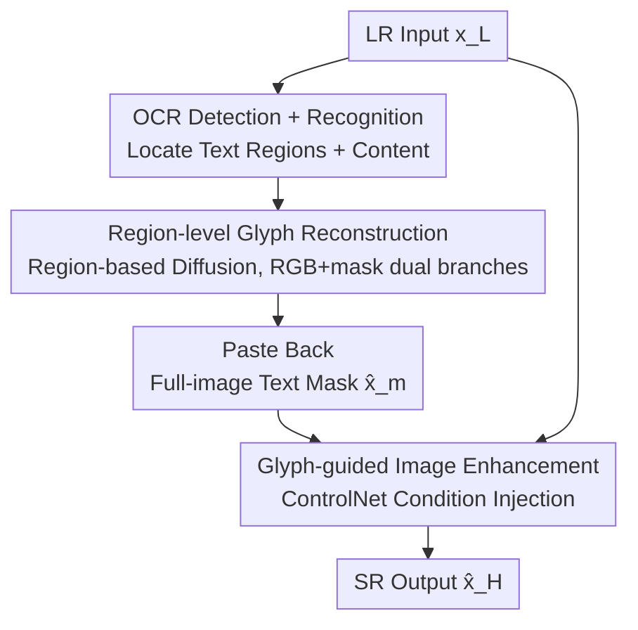

# Restore Text First, Enhance Image Later: Two-Stage Scene Text Image Super-Resolution with Glyph Structure Guidance

**Conference**: CVPR 2026  
**Paper**: [CVF Open Access](https://openaccess.thecvf.com/content/CVPR2026/html/Luo_Restore_Text_First_Enhance_Image_Later_Two-Stage_Scene_Text_Image_CVPR_2026_paper.html)  
**Code**: Project page (Annotated as "Project page: link" in the paper, specific address not provided ⚠️ Subject to the original text)  
**Area**: Image Restoration / Super-Resolution  
**Keywords**: Scene Text Super-Resolution, Glyph Structure, Two-Stage, Diffusion Models, ControlNet Guidance

## TL;DR
TiGeSR decouples the inherent trade-off between "image quality" and "text readability" in scene text super-resolution using a "restore text first, enhance image later" two-stage paradigm. It first reconstructs precise glyph structures in text regions via a diffusion model, then injects these glyphs as conditions into ControlNet for full-image super-resolution. The authors also released UZ-ST, the first Chinese scene text dataset with a maximum zoom of $\times 14.29$, achieving SOTA in both image quality and OCR accuracy on Real-CE and UZ-ST.

## Background & Motivation
**Background**: Scene Text Image Super-Resolution (STISR) aims to restore high-resolution (HR) images from degraded low-resolution (LR) inputs while preserving textual meaning. Recent mainstream approaches leverage strong generative priors from diffusion models (e.g., StableSR, DiffBIR, SeeSR, SUPIR, OSEDiff, DiT4SR) to "fill in" missing details.

**Limitations of Prior Work**: General image super-resolution methods prioritize "overall visual perception" and excel at synthesizing natural textures like grass or leaves but often turn text regions into gibberish. This occurs because they ignore text structure and tend to collapse glyphs into "averaged" simplified forms, producing overlapping or distorted characters. This issue is particularly severe for Chinese due to complex strokes, diverse glyphs, and low saliency in images—a single stroke error can change the character's meaning. Another category of text-centric methods (e.g., MARCONet, DiffTSR) improves readability but lacks global background constraints, leading to style inconsistencies and blocky artifacts between text and background.

**Key Challenge**: There is a trade-off between readability (accurate text structure) and image quality (natural full-image harmony). The authors' key observation is that **these two objectives are not mutually exclusive if text and non-text regions are treated explicitly differently**. By reconstructing text structures via a specialized mechanism and using them to guide full-image restoration, global style harmony can be maintained without introducing artifacts.

**Goal**: ① Accurately reconstruct text glyphs; ② Maintain high visual quality across the entire image while preserving text structure; ③ Fill the data gap for Chinese, heavy degradation, and multi-line text evaluation.

**Key Insight**: "Restore text first, enhance image later"—**decoupling** glyph reconstruction from image enhancement into two serial stages. The first stage focuses on text structure, while the second stage uses the restored glyphs as conditions to guide full-image super-resolution.

## Method

### Overall Architecture
TiGeSR is a two-stage serial pipeline. The input is a low-resolution image $x_L \in \mathbb{R}^{H\times W\times C}$, and the output is the super-resolution result $\hat{x}_H$. **Stage 1 (Text Restoration)**: An OCR detector locates each text region and identifies its content. Each region is fed into a diffusion-based glyph structure restoration model to reconstruct stroke geometry region-by-region. All restored regions are then pasted back to their original positions to form a full-image text mask $\hat{x}_m$. **Stage 2 (Image Enhancement)**: The text mask $\hat{x}_m$ and LR input $x_L$ are fed together into a ControlNet-style network, which performs denoising at specific timesteps to generate the full-image SR result $\hat{x}_H$. Glyph structures act as conditions to "steer" the global super-resolution, ensuring harmony between text and background while suppressing artifacts.

### Key Designs

**1. Decoupled "Restore Text First, Enhance Image Later" Paradigm: Splitting Readability and Image Quality into Serial Objectives**

This is the core contribution. The pain point is that a single generative prior often sacrifices text structure for global optimization. TiGeSR splits the workflow: Stage 1 performs glyph reconstruction on text regions $\tilde{x}_L$ to produce a text mask $\hat{x}_m$; Stage 2 injects $\hat{x}_m$ as a structural condition for full-image SR. Stage 2 uses ControlNet $\epsilon_\phi$ for single-step denoising of $z_L$ at a specific timestep $t$. The SR latent is $\hat{z}_H = z_L - \sigma_t\,\epsilon_\phi(z_L, \hat{z}_m, t, c_{\text{Null}})$, where $c_{\text{Null}}$ is the null text embedding and $\sigma_t$ is determined by the diffusion schedule. This "structure-aware control" is injected into the generation process, allowing the network to enhance global quality while being "pinned" by the glyph mask. This prevents stroke collapse, effectively breaking the trade-off.

**2. Region-level Glyph Structure Reconstruction (RGB/Structure Dual Branches): Robust Stroke Generation on Degraded Text**

Standard text segmentation models (e.g., HiSAM) fail on low-resolution, fragmented, or distorted text. In Stage 1, each detected text region $\tilde{x}_L$ is encoded by a VAE into $\tilde{z}_L$. After concatenating with noise $z_T$, a UNet $\epsilon_\theta$ iteratively denoises into **two branches**: an appearance branch $z^{RGB}_{t-1}$ and a structure branch $z^m_{t-1}$. Simultaneously, OCR-recognized text content $y$ is embedded as $c_{te}$ and fused via cross-attention to guide structure restoration. After $T$ steps, the structure branch output $z^m_0$ is decoded into a region mask $\tilde{x}_m$. Reconstructing only on text regions allows the model to focus on glyphs without non-text interference.

**3. Two-phase "Synthetic-to-Real" Training + Segmentation-guided Loss: Balancing Glyph Precision and Real-world Generalization**

Since segmentation masks for real degraded text are scarce, and pure synthetic data generalizes poorly, the authors designed a **two-phase training** strategy. Phase 1 uses both synthetic and real data to learn real-world degradation patterns while producing masks. However, noisy masks in real data can degrade quality, so Phase 2 freezes the RGB-out and mask-out modules and fine-tunes the UNet using only synthetic data to refine mask quality. The Stage 1 total loss is $\mathcal{L}=\lambda_{td}\mathcal{L}_{td}+\lambda_{Seg}\mathcal{L}_{Seg}$. $\mathcal{L}_{td}$ is the standard text-controlled diffusion MSE. $\mathcal{L}_{Seg}$ is the segmentation-guided loss—matching the decoded mask $x'^m_0$ from the structure branch to the ground truth $x^m_0$ using a combination of MSE, Focal, and Dice losses to constrain glyph accuracy at the pixel level.

**4. Glyph-aware ControlNet + Edge Loss: Preventing Stroke Integrity Loss during Full-image Enhancement**

Stage 2 training enhances strokes beyond standard reconstruction losses. The reconstruction loss $\mathcal{L}_{img}=\lambda_{l2}\|x_H-\hat{x}_H\|^2_2+\lambda_{LPIPS}\,\text{LPIPS}(x_H,\hat{x}_H)$ balances fidelity and perception. To emphasize glyph structures, an edge loss $\mathcal{L}_{edge}=\|\text{Sobel}(x_H)-\text{Sobel}(\hat{x}_H)\|^2_2$ is added using Sobel operators. The total Stage 2 loss is $\mathcal{L}=\mathcal{L}_{img}+\lambda_{edge}\mathcal{L}_{edge}$. The glyph mask condition combined with the edge constraint ensures stroke integrity while harmonizing text and background.

### Loss & Training
- **Stage 1**: $\mathcal{L}=\lambda_{td}\mathcal{L}_{td}+\lambda_{Seg}\mathcal{L}_{Seg}$. Segmentation loss = MSE + Focal + Dice (supervised at pixel-level on decoded masks). Two-phase training: Phase 1 (Synthetic + Real), Phase 2 (Freeze output blocks, fine-tune UNet on synthetic data).
- **Stage 2**: $\mathcal{L}=\mathcal{L}_{img}+\lambda_{edge}\mathcal{L}_{edge}$. $\mathcal{L}_{img}$ = MSE + LPIPS, edge term uses Sobel.
- **Implementation**: Synthetic data based on LSDIR rendering + Real-ESRGAN degradation. Real data from Real-CE (filtered/re-labeled 337 train / 188 test) and UZ-ST. Stage 1 based on IDM architecture; Stage 2 based on Stable Diffusion 3.5 using tile-based inference.

## Key Experimental Results

### Main Results
Full-image quality + text accuracy (OCR-A based on Levenshtein ratio, higher is better; OCR-A $=\frac{\text{Len}(s_{pred})+\text{Len}(s_{gt})-\text{Dist}(s_{pred},s_{gt})}{\text{Len}(s_{pred})+\text{Len}(s_{gt})}$). Representative comparison on Real-CE ($\times 4$ hardest tier) and UZ-ST (average):

| Dataset | Method | PSNR↑ | SSIM↑ | LPIPS↓ | DISTS↓ | FID↓ | OCR-A↑ |
|--------|------|-------|-------|--------|--------|------|--------|
| Real-CE | HAT | 23.61 | 0.830 | 0.214 | 0.176 | 51.16 | 56.6% |
| Real-CE | TADiSR | 23.83 | 0.790 | 0.286 | 0.154 | 44.42 | 64.7% |
| Real-CE | **Ours** | **24.12** | **0.839** | **0.164** | **0.125** | **38.72** | **67.3%** |
| UZ-ST | OSEDiff | 25.07 | 0.819 | 0.201 | 0.169 | 20.53 | 28.9% |
| UZ-ST | TADiSR | 24.61 | 0.796 | 0.203 | 0.160 | 36.61 | 36.6% |
| UZ-ST | **Ours** | **25.48** | **0.830** | **0.196** | **0.156** | **20.01** | **43.0%** |

Ours also achieves the best cropped text region metrics. Notably, $\Delta$OCR-A (change in OCR accuracy relative to LR) is positive for Ours: Real-CE +2.5%, UZ-ST +1.3%. In contrast, almost all general SR methods show negative gains (e.g., SUPIR −37.0%, OSEDiff −38.0%), indicating they "damage text while enhancing the image."

### Ablation Study

| Ablation Dimension | Configuration | OCR-A↑ | Description |
|----------|------|--------|------|
| UZ-ST Dataset | OSEDiff w/o → w/ | 22.8% → 28.9% | General models improve with UZ-ST fine-tuning |
| UZ-ST Dataset | DiT4SR w/o → w/ | 19.3% → 23.7% | Validates dataset effectiveness |
| UZ-ST Dataset | Ours w/o → w/ | 40.0% → 43.0% | Ours further improves with UZ-ST |
| OCR Text Input | Null Text | 40.4% | Still outperforms TADiSR (35.5%) without OCR text |
| OCR Text Input | Random Text | 40.3% | Robust to incorrect OCR |
| OCR Text Input | Predicted (Ours) | 44.6% | Full version (35mm subset) |

### Key Findings
- **Decoupling Paradigm is the Core Gain**: Unlike general SR methods that usually drop in text accuracy, TiGeSR is one of the few that positively improves readability, validating that "restore text first" breaks the trade-off.
- **Dataset Universality**: Both UNet-based (OSEDiff) and DiT-based (DiT4SR) models improve OCR-A after fine-tuning on UZ-ST, demonstrating the value of heavy-degradation Chinese data.
- **Limited OCR Dependency**: Even with null or random text in Stage 1, OCR-A remains high (40.4%), showing the model recovers glyphs from the LR structure itself rather than over-relying on OCR semantics.
- **Typical Failure of Competitors**: TADiSR collapses on small text due to cross-attention resolution limits. MARCONet/DiffTSR struggle with long text or extreme aspect ratios and lack global semantics, leading to text-background separation.

## Highlights & Insights
- **Clean Decoupling Perspective**: Extracting text structure for independent reconstruction before re-injecting it as a condition is a simple yet direct solution to the "text vs. background" conflict. This "restore hard constraints first, then generate soft details" approach is transferable to other tasks (e.g., tables, sheet music, circuit diagrams).
- **Structure Branch + Segmentation Loss**: Decoding diffusion intermediates back to pixels for supervision (MSE+Focal+Dice) is a practical trick for binding "generation" and "segmentation."
- **Solid Dataset Contribution**: UZ-ST uses 4-focal-length (14/35/85/200mm) real-world capture with coarse-to-fine alignment, pushing Chinese scene text SR to $\times 14.29$ zoom for the first time.
- **$\Delta$OCR-A Evaluation**: This metric sharply highlights the long-ignored issue where general SR models actually degrade text readability.

## Limitations & Future Work
- **OCR Detection Dependency**: While robust to recognition errors, the first stage cannot repair regions if detection fails or misses text.
- **Computation Cost**: The two-stage multi-step diffusion denoising (region-level in Stage 1 + full-image in Stage 2) involves high inference latency. 
- **Code Availability**: The project page lacks a specific URL (⚠️ Subject to the original text), increasing the barrier to reproduction.
- **Language Scope**: Primarily validated on Chinese; generalization to other complex scripts (e.g., Arabic, Devanagari) remains unverified.

## Related Work & Insights
- **vs. TADiSR**: TADiSR uses cross-attention maps for supervision, which fails on small/heavily degraded text due to resolution limits. TiGeSR uses a dedicated region-level reconstruction branch with pixel-level loss, offering better robustness.
- **vs. MARCONet / DiffTSR**: These reconstruct text regions only (StyleGAN codebooks or latent denoising), leading to style mismatches. TiGeSR Stage 2 uses ControlNet for better background harmony.
- **vs. General Diffusion SR**: General models (SUPIR, OSEDiff, etc.) target global aesthetics, often resulting in negative $\Delta$OCR-A. TiGeSR is one of the few with positive $\Delta$OCR-A.

## Rating
- Novelty: ⭐⭐⭐⭐ The decoupling paradigm is simple but effective; the dataset adds significant value.
- Experimental Thoroughness: ⭐⭐⭐⭐⭐ Comprehensive coverage across two benchmarks, dual metrics for image/text, and thorough ablations.
- Writing Quality: ⭐⭐⭐⭐ Motivation and methodology are clear; some formulas in the draft have minor LaTeX noise.
- Value: ⭐⭐⭐⭐ Directly addresses the pain point of SR-induced readability loss; UZ-ST is a genuine asset for the Chinese STISR community.

<!-- RELATED:START -->

## Related Papers

- [\[CVPR 2026\] SDUIE: Semi-Supervised Diffusion for Underwater Image Enhancement with Quant-Text Dual Control](sduie_semi-supervised_diffusion_for_underwater_image_enhancement_with_quant-text.md)
- [\[CVPR 2026\] White-Balance First, Adjust Later: Cross-Camera Color Constancy via Vision-Language Evaluation](white-balance_first_adjust_later_cross-camera_color_constancy_via_vision-languag.md)
- [\[CVPR 2026\] F²HDR: Two-Stage HDR Video Reconstruction via Flow Adapter and Physical Motion Modeling](f2hdr_two-stage_hdr_video_reconstruction_via_flow_adapter_and_physical_motion_mo.md)
- [\[CVPR 2026\] Rethinking Diffusion Model-Based Video Super-Resolution: Leveraging Dense Guidance from Aligned Features](rethinking_diffusion_model-based_video_super-resolution_leveraging_dense_guidanc.md)
- [\[CVPR 2026\] RAR: Restore, Assess, Repeat - A Unified Framework for Iterative Image Restoration](rar_restore_assess_repeat_a_unified_framework_for_iterative_image_restoration.md)

<!-- RELATED:END -->
