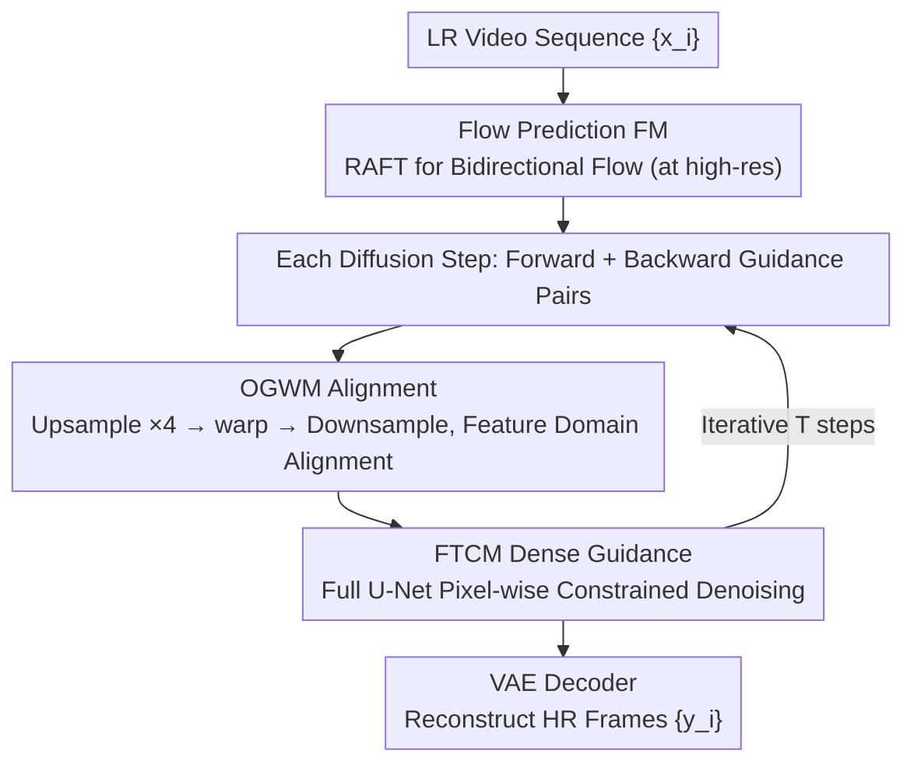

# Rethinking Diffusion Model-Based Video Super-Resolution: Leveraging Dense Guidance from Aligned Features

**Conference**: CVPR 2026  
**Paper**: [CVF Open Access](https://openaccess.thecvf.com/content/CVPR2026/html/Xu_Rethinking_Diffusion_Model-Based_Video_Super-Resolution_Leveraging_Dense_Guidance_from_Aligned_CVPR_2026_paper.html)  
**Code**: https://github.com/tszssong/DGAF-VSR  
**Area**: Image Restoration / Video Super-Resolution  
**Keywords**: Video Super-Resolution, Diffusion Models, Feature Alignment, Optical Flow Warping, Dense Temporal Guidance

## TL;DR
DGAF-VSR revisits the role of "alignment + compensation" in diffusion-based video super-resolution (VSR). Based on two quantitative observations—that the feature domain exhibits stronger spatio-temporal correlation than the pixel domain, and that warping at high resolutions better preserves high-frequency details—the authors design the OGWM module for "up-warp-down" alignment in the feature domain and the FTCM module using a full U-Net for dense temporal guidance. The method outperforms SOTAs across perceptual quality, fidelity, and temporal consistency (DISTS $-35.82\%$, PSNR $+0.20$dB, tLPIPS $-30.37\%$).

## Background & Motivation
**Background**: Compared to Single Image Super-Resolution (SISR), Video Super-Resolution (VSR) utilizes temporal information from adjacent frames to simultaneously improve spatial details and temporal consistency. Non-diffusion methods (EDVR, BasicVSR/++, RVRT) offer high fidelity but poor perceptual quality (blurring, over-smoothing). Diffusion-based (DM) methods (StableVSR, MGLD-VSR, etc.) provide impressive perceptual quality and stable temporal sequences.

**Limitations of Prior Work**: Existing DM-based VSR **biases heavily toward perceptual synthesis while neglecting the fidelity gains from "accurate alignment + sufficient compensation."** Specifically: ① Most methods provide temporal guidance directly in the pixel domain or solely through U-Net encoders, resulting in sparse compensation; ② Inaccurate feature alignment causes errors to accumulate across diffusion steps, leading to lower fidelity metrics like PSNR/SSIM.

**Key Challenge**: A long-standing trade-off exists between perceptual quality and fidelity. The authors argue the root cause lies in the lack of clarity regarding "in which domain and at what resolution alignment and guidance should occur"—the potential of alignment and compensation is undervalued in DM pipelines.

**Goal**: ① Clarify whether the "feature domain vs. pixel domain" is better suited for temporal guidance; ② Determine the optimal resolution for warping to preserve high frequencies; ③ Design alignment and dense guidance modules to achieve both high perception and high fidelity.

**Key Insight**: Instead of relying on intuition, the authors conduct two sets of quantitative observations (Observation 1/2) on REDS4, using data to drive the design of the modules.

**Core Idea**: Move both alignment and dense guidance to the **feature domain**, perform warping on **upsampled high-resolution features**, and utilize a full U-Net to provide "pixel-wise constrained" dense temporal conditions, thereby preserving original video information during the diffusion process.

## Method

### Overall Architecture
DGAF-VSR consists of three parts: a Flow prediction Module (FM, using RAFT to estimate bidirectional flow between adjacent frames), $T$ diffusion steps, and a pre-trained VAE decoder. Given a low-resolution sequence $\{x_i\}$ of $N$ frames, the goal is to reconstruct the high-resolution sequence $\{y_i\}$. The $T$ diffusion steps are divided into $T/2$ pairs, each consisting of one **forward guidance** (using features from previous frames) and one **backward guidance** (using features from subsequent frames). Each guidance process integrates two modules: **OGWM** aligns adjacent features, and **FTCM** denoises the current feature under the dense guidance of the aligned features. After $T$ steps, the final features are fed into the VAE decoder to obtain high-resolution frames.

### Key Designs

**1. Two Quantitative Observations: Transforming Intuition into Data-driven Conclusions**

These form the foundation of the method. **Observation 1**: The feature domain (latent) has stronger spatio-temporal correlation than the pixel domain. The authors calculated four correlation metrics—SSIM, PSNR, $F(H)$, and $F(\sigma)$—for the "noise-free approximate features" $\tilde{z}^i_{t\to0}$ and reconstructed frames $\tilde{y}^i_{t\to0}$ ($F(H)=\frac{1}{1+H}$, $F(\sigma)=\frac{1}{1+\sigma}$, where higher values indicate stronger correlation). The feature domain won across all four: averaging across all diffusion steps, the feature domain outperformed the pixel domain by PSNR $+13.53\%$, SSIM $+22.61\%$, $F(H)$ $+10.81\%$, and $F(\sigma)$ $+106.50\%$. **Observation 2**: Warping at higher resolutions better preserves high frequencies, though this is not monotonic and an optimal magnification factor exists. Analyzing over 80,000 feature sets, they found warping low-resolution features dropped edge intensity by $12.68\%$ and high-pass intensity by $5.34\%$, whereas high-resolution warping only dropped them by $4.38\%/1.75\%$. Furthermore, "upsampling-warp-downsampling" increased edge intensity by $+9.98\%$ and high-pass intensity by $+4.43\%$ compared to direct low-resolution warping. These findings directly led to FTCM (latent dense guidance) and OGWM (high-resolution warping).

**2. OGWM (Optical-flow Guided Warping Module): Preserving High Frequencies during Alignment via "Upsample-Warp-Downsample"**

Based on Observation 2, OGWM addresses the need for "accurate spatial alignment while preserving high frequencies." In the forward guidance of each diffusion step, it follows three steps: (a) **Input Preparation**: Take the noise-free approximate feature $\tilde{z}^{i-1}_{t\to0}$ from the previous frame and upsample it by $s=4$ via nearest-neighbor interpolation to get $\tilde{z}^{i-1,s\times Ne}_{t\to0}$; (b) **Feature Alignment**: Warp the upsampled feature in latent space using flow $v_{i-1,i}$ from FM to get $\tilde{z}^{i-1,s\times warp}_{t\to0}$; (c) **Downsampling & Integration**: Downsample by $s$ back to the original resolution $\tilde{z}^{i-1,s\times warp\times\frac{1}{s}}_{t\to0}$ and feed it into FTCM. Compared to StableVSR's direct latent motion compensation, which introduces artifacts, OGWM's "expand-warp-shrink" strategy significantly reduces cumulative error and preserves more texture details.

**3. FTCM (Feature-level Temporal Condition Module): Dense Guidance via Full U-Net**

Based on Observation 1, FTCM makes temporal compensation "dense." Most DM-based super-resolution methods use only the U-Net encoder as a guidance network, resulting in coarse compensation. FTCM draws inspiration from BrushNet by using a **full U-Net** (rather than just the encoder) as the guidance network, introducing strict pixel-wise constraints across different receptive fields to extract and reconstruct information. The denoising of the $i$-th frame latent at step $t$ is expressed as:  
$$z^i_{t-1}=D_U(\langle z^i_t, x^i\rangle)+\text{Conv}(G_U(\langle z^i_t, x^i, \tilde{z}^{i-1,s\times warp\times\frac{1}{s}}_{t\to0}\rangle))$$  
Where $D_U$ is the frozen denoising U-Net, $G_U$ is the trainable guidance U-Net, $\langle\cdot\rangle$ denotes concatenation, and $\text{Conv}$ is a zero-initialized convolution (to prevent perturbing $D_U$ features early in training). After denoising, $\tilde{z}^i_{t-1\to0}$ is derived as guidance for the next frame.

### Loss & Training
- **Bidirectional Paired Guidance**: $T$ steps are split into $T/2$ pairs; each pair includes one forward and one backward guidance to utilize bidirectional temporal information.
- **Frozen/Trainable Split**: The denoising U-Net $D_U$ is frozen (preserving pre-trained generative priors), while the guidance U-Net $G_U$ is fully trainable. Zero-initialized convolutions ensure stable training starts.

## Key Experimental Results

### Main Results
4× VSR on synthetic datasets REDS4 and Vid4. Metrics include Perceptual (⋄, LPIPS/DISTS lower is better, MUSIQ/CLIP-IQA higher, NIQE lower) and Fidelity (⋆, PSNR/SSIM):

| Dataset | Method | LPIPS↓ | DISTS↓ | MUSIQ↑ | PSNR↑ | SSIM↑ |
| :--- | :--- | :--- | :--- | :--- | :--- | :--- |
| REDS4 | RVRT (Non-DM, SOTA Fidelity) | 0.128 | 0.067 | 67.46 | 32.75 | 0.911 |
| REDS4 | StableVSR (DM SOTA) | 0.098 | 0.045 | 67.62 | 27.97 | 0.795 |
| REDS4 | **DGAF-VSR** | **0.095** | **0.043** | **67.90** | **28.17** | **0.804** |
| Vid4 | StableVSR | 0.182 | 0.116 | 67.20 | 24.47 | 0.699 |
| Vid4 | **DGAF-VSR** | **0.175** | **0.113** | **67.95** | **24.75** | **0.714** |

Among DM-based methods, DGAF-VSR achieves the highest PSNR/SSIM: $+0.20$dB PSNR / $+0.009$ SSIM over StableVSR on REDS4, and $+0.28$dB / $+0.015$ on Vid4, demonstrating a superior balance between fidelity and perception. On the real-world dataset VideoLQ (no-reference metrics), it also leads with MUSIQ 59.05 and CLIP-IQA 0.498.

### Ablation Study
Deconstruction of dense guidance (FTCM) and rescaling-based warping (OGWM) on REDS (tLPIPS/tOF are temporal consistency metrics, lower is better):

| Case | Warping Method | Dense Guidance | PSNR↑ | SSIM↑ | LPIPS↓ | DISTS↓ | tLPIPS↓ | tOF↓ |
| :--- | :--- | :--- | :--- | :--- | :--- | :--- | :--- | :--- |
| 1 | Bicubic | ✗ | 27.81 | 0.791 | 0.104 | 0.047 | 6.25 | 2.83 |
| 2 | Nearest | ✗ | 26.70 | 0.756 | 0.118 | 0.050 | 21.61 | 3.29 |
| 3 | Bicubic | ✓ | 28.13 | 0.803 | 0.099 | 0.045 | 4.28 | 2.81 |
| 4 (Ours) | Nearest (rescaling) | ✓ | **28.17** | **0.804** | **0.095** | **0.043** | **3.92** | **2.71** |

### Key Findings
- **Dense guidance is the primary driver for fidelity and temporal consistency**: comparing Case 1 vs Case 3 and Case 2 vs Case 4 shows that adding dense guidance significantly improves PSNR and tLPIPS (tLPIPS $6.25\to4.28$, $21.61\to3.92$), confirming that FTCM's full U-Net pixel-wise constraints effectively preserve original video information.
- **Rescaling-based warping is effective**: The full version (Case 4) slightly leads Case 3 across all metrics, validating the "high-resolution warp loses less high-frequency" observation.
- **Substantial leads in temporal consistency**: tLPIPS improved by $56.30\%$ compared to non-DM SOTA RVRT, and by $30.37\%$ compared to DM SOTA StableVSR.
- **Simultaneous SOTA in three dimensions**: DGAF-VSR achieves SOTA in perception (DISTS $-35.82\%$), fidelity (PSNR $+0.20$dB), and temporal consistency (tLPIPS $-30.37\%$), breaking the standard perception-fidelity trade-off.

## Highlights & Insights
- **"Observe first, design later" methodology**: The two quantitative observations were derived from 80,000 feature sets rather than intuition, providing a reliable analytical framework for domain/resolution alignment.
- **"Upsample-Warp-Downsample" is a cheap and effective trick**: Simply changing the working resolution for warping reduces high-frequency loss from $\sim12.7\%$ to $\sim4.4\%$ with almost zero structural cost; this is transferable to any video task requiring latent-space motion compensation.
- **Full U-Net guidance**: Following the BrushNet philosophy to introduce pixel-wise dense constraints is key to achieving dense compensation, identifying why previous DM-VSR models lacked fidelity due to sparse guidance.
- **Bidirectional paired guidance**: Efficiently incorporating bidirectional temporal information into iterative denoising significantly contributes to temporal stability.

## Limitations & Future Work
- **Dependency on optical flow quality**: OGWM relies on RAFT; inaccurate flow during extreme motion or occlusion directly impairs alignment.
- **Inference cost**: Utilizing a full U-Net for guidance and bidirectional warping at each step creates significant computational and memory overhead.
- **Optimal magnification tuning**: While $s=4$ was used, the stability of this factor across different data/degradations remains to be fully explored.
- **Limited fidelity gains**: Despite improvements, a significant PSNR gap remains between DM-based models and non-DM models like RVRT (32.75).

## Related Work & Insights
- **vs. StableVSR**: StableVSR's direct latent motion compensation introduces artifacts and yields sparse guidance. DGAF-VSR's "up-warp-down" strategy and dense guidance yield superior PSNR, SSIM, and temporal consistency.
- **vs. MGLD-VSR**: While MGLD-VSR also uses feature-level guidance, DGAF-VSR is the first to **quantitatively validate** that the feature domain is superior to the pixel domain in a DM-based VSR context.
- **vs. BasicVSR**: BasicVSR advocates for feature-level guidance but lacks quantitative validation within diffusion models; DGAF-VSR provides this empirical evidence and extends it to dense pixel-wise guidance.

## Rating
- Novelty: ⭐⭐⭐⭐ (Combining flow-warp and U-Net is evolutionary, but the "quantified observation-driven design" and "warping resolution" insights are innovative)
- Experimental Thoroughness: ⭐⭐⭐⭐⭐ (Comprehensive testing across three datasets and three metric types, plus validation of observations)
- Writing Quality: ⭐⭐⭐⭐ (The logic from observation to design is clear)
- Value: ⭐⭐⭐⭐ (Provides a reproducible alignment analysis framework and code, pushing the boundaries of DM-based VSR)

## Related Papers

- [\[AAAI 2026\] Temporal Inconsistency Guidance for Super-resolution Video Quality Assessment](../../AAAI2026/image_restoration/temporal_inconsistency_guidance_for_super-resolution_video_quality_assessment.md)
- [\[CVPR 2026\] PS-SR: Pseudo-Single-Step Video Super-Resolution via Speculative Diffusion](ps-sr_pseudo-single-step_video_super-resolution_via_speculative_diffusion.md)
- [\[CVPR 2026\] Restore Text First, Enhance Image Later: Two-Stage Scene Text Image Super-Resolution with Glyph Structure Guidance](restore_text_first_enhance_image_later_two-stage_scene_text_image_super-resoluti.md)
- [\[CVPR 2026\] STCDiT: Spatio-Temporally Consistent Diffusion Transformer for High-Quality Video Super-Resolution](stcdit_spatio-temporally_consistent_diffusion_transformer_for_high-quality_video.md)
- [\[CVPR 2026\] EMR-Diff: Edge-aware Multimodal Residual Diffusion Model for Hyperspectral Image Super-resolution](emr-diff_edge-aware_multimodal_residual_diffusion_model_for_hyperspectral_image_.md)

<!-- RELATED:END -->

<!-- RELATED:START -->

## Related Papers

- [\[CVPR 2026\] Restore Text First, Enhance Image Later: Two-Stage Scene Text Image Super-Resolution with Glyph Structure Guidance](restore_text_first_enhance_image_later_two-stage_scene_text_image_super-resoluti.md)
- [\[CVPR 2026\] PS-SR: Pseudo-Single-Step Video Super-Resolution via Speculative Diffusion](ps-sr_pseudo-single-step_video_super-resolution_via_speculative_diffusion.md)
- [\[CVPR 2026\] From Events to Clarity: The Event-Guided Diffusion Framework for Dehazing](from_events_to_clarity_the_event-guided_diffusion_framework_for_dehazing.md)
- [\[CVPR 2026\] EMR-Diff: Edge-aware Multimodal Residual Diffusion Model for Hyperspectral Image Super-resolution](emr-diff_edge-aware_multimodal_residual_diffusion_model_for_hyperspectral_image_.md)
- [\[CVPR 2026\] RawMetaDiff: Unlocking Extreme Darkness from Dual-Exposure RAW with Meta-Guided Diffusion](rawmetadiff_unlocking_extreme_darkness_from_dual-exposure_raw_with_meta-guided_d.md)

<!-- RELATED:END -->
