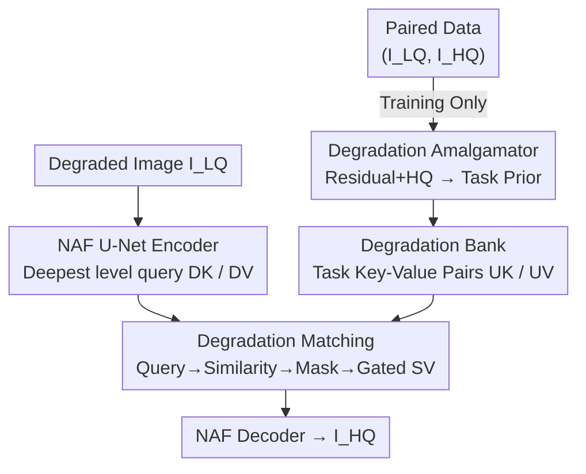

# Retrieve-to-Restore: Efficient All-in-One Image Restoration with a Retrieval-Based Degradation Bank

**Conference**: CVPR 2026  
**Paper**: [CVF Open Access](https://openaccess.thecvf.com/content/CVPR2026/html/Wang_Retrieve-to-Restore_Efficient_All-in-One_Image_Restoration_with_a_Retrieval-Based_Degradation_Bank_CVPR_2026_paper.html)  
**Code**: [https://github.com/cscxwang/R2R](https://github.com/cscxwang/R2R)  
**Area**: Image Restoration  
**Keywords**: All-in-One Image Restoration, Degradation Decoupling, Retrieval-Based Prior, Degradation Bank, Lightweight

## TL;DR
R2R decouples "degradation adaptation" from the backbone by offloading it to an external retrievable "degradation bank." During training, a degradation amalgamator distills clean priors from various degradations into the bank; during inference, degradation matching retrieves the most relevant priors to modulate features. This allows a single lightweight backbone to handle multiple degradations stably, matching SOTA PSNR while using only 9% of the computational cost.

## Background & Motivation

**Background**: All-in-one image restoration aims to handle multiple degradations (noise, haze, rain, blur, low-light, etc.) with a single model, avoiding the burden of separate training and deployment. Mainstream approaches employ "internal modulation" within a shared backbone: either by injecting visual/textual prompts (PromptIR, InstructIR, DA-CLIP) or using MoE routing to dispatch inputs to degradation-specific experts (MoCE-IR).

**Limitations of Prior Work**: These internal modulation strategies inadvertently inflate the parameter space—prompt stacks grow larger, experts increase in number, and additional hyperparameters or routing dynamics are introduced. More critically, parameters optimized for one degradation may conflict with those needed for another, leading to **cross-task interference** during multi-degradation joint training. This results in inconsistent parameter updates and training instability, making it difficult to maintain robust performance across all tasks.

**Key Challenge**: Degradation adaptation (which must vary by degradation) and backbone computation (which should be shared across tasks) are forced into the same set of parameters, hindering each other. Flexible adaptation requires degradation-dependent parameters, while stable training requires cross-task consistency; these two goals are difficult to reconcile within a shared backbone.

**Goal**: To simultaneously achieve three objectives in a single model: (1) **Explicitly separate** degradation information from shared reconstruction capabilities to suppress interference; (2) Unify parameters to maintain stable optimization that does not deteriorate as the number of degradations $|T|$ increases; (3) Maintain high computational efficiency and scalability to new degradations.

**Key Insight**: The authors observe that degradations exhibit a strong structure of **intra-class similarity and inter-class separability**—rain appears as streaks, haze involves global low contrast and obscuration, and noise consists of high-frequency fluctuations. Since each degradation class can be summarized by a compact task-level descriptor, heavy internal modulation is unnecessary. Instead, an "external prior" perspective should be adopted: compress each degradation into a prior and retrieve it when needed.

**Core Idea**: Externalize degradation knowledge into a compact degradation bank following an **Encode-Retrieve-Decode** paradigm. The shared backbone focuses solely on reconstruction, while degradation adaptation is handled by retrievable external priors, thereby decoupling "adaptation" from "computation."

## Method

### Overall Architecture
R2R uses a NAF-style symmetric U-Net encoder-decoder as the **task-agnostic backbone**. Two lightweight modules are inserted only at the last downsampling stage of the encoder: the Degradation Amalgamator (training only) and Degradation Matching (inference). The degraded image is first mapped to shallow features via a $3\times3$ convolution and then encoded through four levels of NAFBlocks. At the deepest level, two additional $3\times3$ convolutions produce query features $D_K$ and $D_V$. During training, the Amalgamator distills task-level priors from paired data into the bank. During inference, Degradation Matching uses $D_K$ to retrieve the most relevant priors from the bank, which are then fused with $D_V$ before being sent to the decoder for reconstruction. The entire pipeline is end-to-end trainable; the amalgamator is removed during inference, incurring zero extra overhead.

### Key Designs

**1. Retrieval-Based Degradation Bank: Externalizing Knowledge as Priors**

To address the key challenge of interference between adaptation and computation, R2R moves degradation knowledge into an external bank rather than modulating the backbone internally. Each task corresponds to a set of key-value pairs $(U_K, U_V)$ in the bank, where $U_K\in\mathbb{R}^{M\times H\times W\times C_k}$ serves as the index and $U_V\in\mathbb{R}^{M\times H\times W\times C_v}$ carries clean priors. $M$ is a hyperparameter for bank capacity. Consequently, the backbone remains consistent across tasks, and the choice of degradation knowledge is determined by a single retrieval. Unlike prompt stacks or MoE, this design does not inflate the backbone or introduce routing dynamics, isolating cross-task interference and enabling easy expansion to new tasks by adding key-value pairs.

**2. Degradation Amalgamator: Distilling Task-Level Clean Priors**

The degradation amalgamator constructs the bank during training using paired data. It concatenates the residual $I_{LQ}-I_{HQ}$ with the ground truth $I_{HQ}$ along the channel dimension to provide both degradation clues and clean references. This is passed through NAFBlocks with progressive downsampling to extract features, producing $G_K$ and $G_V$. Samples from different tasks in a batch are **grouped by degradation label** along the batch dimension and padded to a uniform length $M$. Task-level 3D operations (depth-wise separable + point-wise 3D convolution, BatchNorm3D, ReLU) perform **intra-class aggregation** along the batch axis to generate task-level embeddings $U_K$ and $U_V$. A lightweight classification head is also used to enhance separability. The entire amalgamator is **removed after training**, making the bank "distilled during training, read-only during inference."

**3. Degradation Matching: Retrieving and Fusing Priors during Inference**

During inference, the degradation type is unknown. Degradation matching ensures accurate retrieval: all task keys in the bank are flattened into $U_K\in\mathbb{R}^{[n\times M, H\times W\times C_k]}$ to calculate a global similarity $S = D_K \times U_K^{\top}$. To suppress cross-task interference, the **local mean** of $S$ is calculated for each task window of length $M$. The task with the highest mean is selected, and all other task similarities are masked: $S_{mask}=\mathrm{Mask}(\mathrm{Argmax}(\mathrm{Local\text{-}Mean}(S)))$. A row-wise Softmax then activates only the selected task's priors. These are used to weight $U_V$ to obtain the retrieved prior, which is **interleaved** with $D_V$ and passed through a Gated Convolution (with groups = $C_v$) to produce the sharpened prior $S_V$. Gating ensures each sample interacts only with its retrieved prior.

**4. Loss & Training: Dual-Domain and Classification Joint Loss**

The loss combines distortion and classification terms. Pixel-wise $L_{pixel}=\lVert x-\hat{x}\rVert_1$ ensures low distortion, while $L_{fft}=\frac{1}{P}\lVert\mathcal{F}(\hat{x})-\mathcal{F}(x)\rVert_1$ ensures frequency-domain fidelity. Two cross-entropy losses are added: $L_{deg}$ supervises the amalgamator's degradation identification, and $L_{match}$ supervises correct retrieval. The total loss is $\mathcal{L}=L_{pixel}+\lambda_d L_{deg}+\lambda_m L_{match}+\lambda_f L_{fft}$, with weights $\lambda_d=0.1$, $\lambda_m=0.1$, and $\lambda_f=0.125$. $L_{match}$ forces $U_K$ and $U_V$ to cluster more tightly within classes.

## Key Experimental Results

> Note: **MACs** (Multiply-Accumulate operations for $224\times224$ input) measures computational cost; **$M$** is the bank capacity.

### Main Results

Average results for three degradations (dehazing/deraining/denoising) and five degradations (adding deblurring/low-light), where R2R achieves the best PSNR with only 12G MACs:

| Setting | Method | MACs | Avg. PSNR | Avg. SSIM |
|------|------|------|-----------|-----------|
| 3 tasks | AirNet | 238G | 31.20 | .910 |
| 3 tasks | PromptIR | 132G | 32.06 | .913 |
| 3 tasks | Gridformer | 251G | 32.19 | .912 |
| 3 tasks | **R2R (ours)** | **12G** | **32.53** | **.918** |
| 5 tasks | PromptIR | 132G | 29.15 | .904 |
| 5 tasks | Perceive-IR | — | 30.11 | .905 |
| 5 tasks | **R2R (ours)** | **12G** | **30.48** | **.921** |

In the 3-task setting, R2R outperforms PromptIR by 0.47dB while saving 90.9% MACs, and outperforms AirNet by 1.33dB while saving 95% MACs. In the 5-task setting, it outperforms AirNet/IDR/Gridformer by 4.99/2.14/1.15dB respectively.

Complexity comparison (3-task setting):

| Method | PSNR | GPU Mem | Params | MACs |
|------|------|------|--------|------|
| AirNet | 31.20 | 4829M | 8.93M | 238G |
| PromptIR | 32.06 | 9830M | 35.59M | 132G |
| Gridformer | 32.19 | 28462M | 30.1M | 251G |
| **R2R (ours)** | **32.53** | **846M** | **19.7M** | **12G** |

### Ablation Study

| Config | Avg. PSNR | Note |
|------|-----------|------|
| $M=24$ | 32.30 | Capacity too small |
| $M=64$ | **32.53** | Optimal capacity |
| $M=128$ | 32.34 | Redundancy/overfitting |
| $L_{pixel}$ only | 31.88 | Baseline |
| $+L_{fft}$ | 32.23 | Frequency fidelity, +0.35dB |
| $+L_{deg}$ | 32.29 | Classification supervision |
| $+L_{match}$ (Full) | **32.53** | Retrieval supervision, +0.65dB total |

### Key Findings
- **Bank capacity follows a trade-off**: Increasing $M$ from 24 to 64 improves quality, but 128 introduces redundancy and leads to overfitting.
- **Retrieval supervision is critical**: $L_{match}$ contributes roughly 0.24dB and tightens task clusters in t-SNE space.
- **Robust task expansion**: While other methods show significant performance drops when expanding from 1 to 5 tasks, R2R maintains stability due to the explicit decoupling of degradations.
- **Bank construction without clean HQ is feasible**: Using noisy $HQ^{*}$ ($\sigma=15$) or even raw LQ results in minimal drops (e.g., 0.54dB), facilitating deployment in scenarios lacking paired data.

## Highlights & Insights
- **Physical separation of "adaptation" and "computation"**: Offloading degradation knowledge to an external bank allows the backbone to remain task-agnostic, fundamentally avoiding cross-task interference.
- **Training distillation vs. Inference read-only**: The bank design ensures zero inference cost for the amalgamator, unlike prompt or expert-based methods that inflate the model during inference.
- **Generic Retrieval-Fusion**: The "Local-Mean Mask + Gated-Conv" mechanism can be transferred to other conditioned tasks where classes are separable but unknown at test time.

## Limitations & Future Work
- The bank is organized by **discrete categories**. Its performance on unseen degradations or complex **composite degradations** remains to be fully verified.
- The retrieval is "hard" (argmax), which might be less effective for images simultaneously containing multiple degradations compared to a soft fusion approach.
- The capacity $M$ might need re-tuning for different task scales.

## Related Work & Insights
- **vs PromptIR**: Prompt stacks inflate parameters and still allow interference within the backbone; R2R is 90.9% more efficient and scales better.
- **vs MoCE-IR**: MoE methods introduce routing dynamics and massive expert parameters; R2R uses a single backbone with retrieved priors.
- **vs AirNet / IDR**: R2R provides a more explicit decoupling via distillation and retrieval, showing significant PSNR gains (+4.99dB over AirNet on 5-task).

## Rating
- Novelty: ⭐⭐⭐⭐ 
- Experimental Thoroughness: ⭐⭐⭐⭐ 
- Writing Quality: ⭐⭐⭐⭐ 
- Value: ⭐⭐⭐⭐ 

<!-- RELATED:START -->

## Related Papers

- [\[CVPR 2026\] Degradation-Consistent Test-Time Adaptation for All-in-One Image Restoration](degradation-consistent_test-time_adaptation_for_all-in-one_image_restoration.md)
- [\[CVPR 2026\] UniLDiff: Unlocking the Power of Diffusion Priors for All-in-One Image Restoration](unildiff_unlocking_the_power_of_diffusion_priors_for_all-in-one_image_restoratio.md)
- [\[CVPR 2026\] FAPE-IR: Frequency-Aware Planning and Execution Framework for All-in-One Image Restoration](fape-ir_frequency-aware_planning_and_execution_framework_for_all-in-one_image_re.md)
- [\[CVPR 2026\] Restore, Assess, Repeat: A Unified Framework for Iterative Image Restoration](restore_assess_repeat_a_unified_framework_for_iterative_image_restoration.md)
- [\[ICLR 2026\] Rethinking Expressivity and Degradation-Awareness in Attention for All-in-One Blind Image Restoration](../../ICLR2026/image_restoration/rethinking_expressivity_and_degradation-awareness_in_attention_for_all-in-one_bl.md)

<!-- RELATED:END -->
