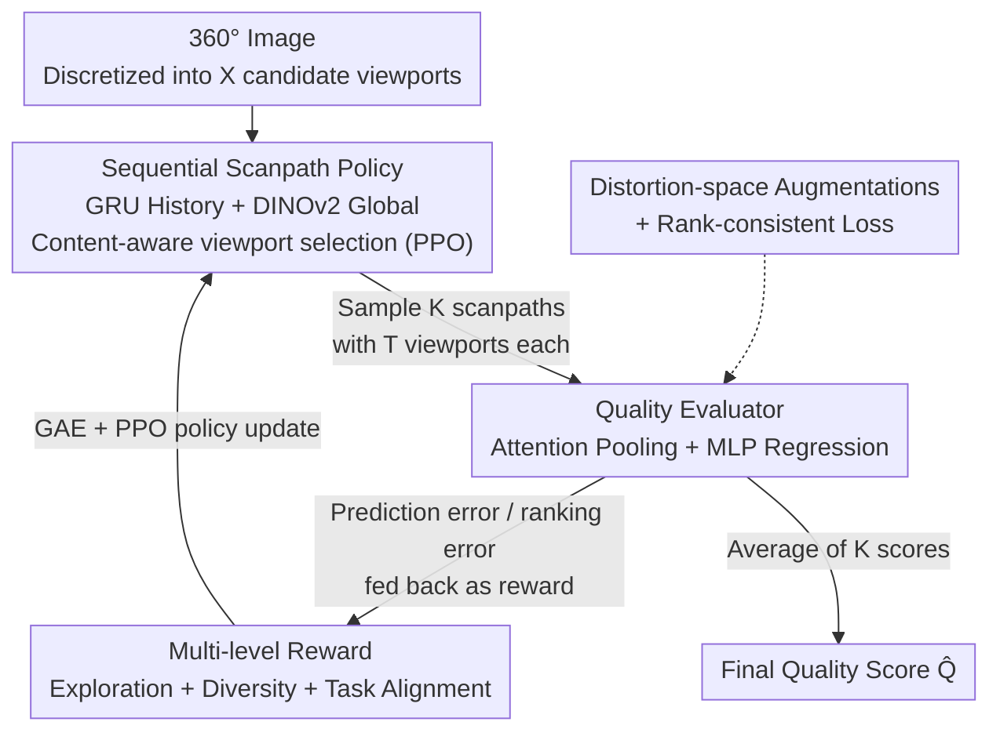

# RL-ScanIQA: Reinforcement-Learned Scanpaths for Blind 360deg Image Quality Assessment

**Conference**: CVPR 2026  
**Paper**: [CVF Open Access](https://openaccess.thecvf.com/content/CVPR2026/html/Wang_RL-ScanIQA_Reinforcement-Learned_Scanpaths_for_Blind_360deg_Image_Quality_Assessment_CVPR_2026_paper.html)  
**Code**: None  
**Area**: Image Quality Assessment / Low-level Vision  
**Keywords**: 360° Image Quality Assessment, Blind Quality Assessment, Reinforcement Learning, scanpath, PPO

## TL;DR
RL-ScanIQA reformulates blind 360° image quality assessment (BIQA) as an "active perception" problem: a PPO-trained scanpath policy autonomously selects which viewports to inspect, and a quality evaluator assigns scores. The two are jointly optimized end-to-end, with the policy directly driven by feedback from quality prediction (eliminating the need for human eye-tracking annotations). Combined with multi-level rewards and distortion-space augmentation, it achieves state-of-the-art (SOTA) performance on three 360° IQA benchmarks.

## Background & Motivation
**Background**: Image quality assessment (IQA) aims to predict the subjective human perceived quality of images. In practical scenarios, reference images are often unavailable, making no-reference blind image quality assessment (BIQA) the primary focus. 360° omnidirectional images differ from conventional 2D flat images as they are mapped onto a sphere. In an immersive environment, a viewer can only perceive a limited viewport at any given moment, exploring the scene progressively through head and eye movements. Therefore, the viewed regions (scanpaths) directly determine which distortions are encountered, thereby dictating the perceived quality.

**Limitations of Prior Work**: Existing BIQA methods for 360° images generally fall into three categories, each with inherent limitations. First, directly analyzing the full Equirectangular Projection (ERP) map introduces spatial distortion and polar stretching from projecting a sphere onto a flat plane. Second, sampling fixed viewports using predefined or static strategies (such as cubemaps or graph convolutional networks) neglects the sequential nature of human exploration, and fixed sampling points can miss localized distortions. Third, scanpath-based methods dynamically simulate human visual attention but **treat scanpath generation as an independent, externally trained preprocessing step**. These are trained via heuristics or by mimicking human eye movements, which decouples them from the downstream quality prediction task.

**Key Challenge**: The separation of scanpath generation and quality assessment into two independent stages causes two main issues: it prevents end-to-end optimization, and the policy learns to "mimic how humans look" instead of learning "how to look to best assess quality." Furthermore, during free-viewing, humans focus predominantly on salient content rather than distortion areas critical for quality assessment. Consequently, mimicking human eye movements can be misaligned with the objectives of IQA.

**Goal**: Make scanpath generation directly serve the IQA objective: the agent should learn to navigate to viewports that "best assist the evaluator in determining quality," rather than those that "humans find most appealing."

**Key Insight**: Formulate viewport selection as a sequential decision-making problem (Markov Decision Process, or MDP) and employ reinforcement learning to allow the agent to learn exploration policies directly from quality prediction feedback. Consequently, the scanpath generator and the quality evaluator can be jointly trained end-to-end, completely eliminating the reliance on human scanpath annotations.

**Core Idea**: Reformulate 360° BIQA as an "active perception" problem: an RL policy dynamically decides the next viewport during inspection, while the prediction accuracy of the quality evaluator acts as feedback (reward) to guide the policy, achieving joint optimization.

## Method

### Overall Architecture
Given a 360° image, the proposed method first discretizes the spherical viewing space into $X$ candidate viewports and initializes the agent at a starting viewport. The **scanpath generator** (a policy trained with PPO) sequentially samples $K$ scanpaths from these $X$ candidates, where each scanpath consists of $T$ viewports. The policy is guided by a "multi-level reward" signal. Subsequently, the **quality evaluator** predicts a quality score $\hat{Q}_1,\dots,\hat{Q}_K$ for each scanpath, and the final image quality is computed as the average of these $K$ scores. During training, distortion-space data augmentation and rank-consistent loss are incorporated to enhance cross-dataset generalization. Crucially, the two modules are jointly optimized end-to-end: the prediction errors or ranking discrepancies from the evaluator are returned as rewards to update the scanpath policy, establishing a closed-loop of "viewing $\to$ scoring $\to$ feedback $\to$ viewport selection refinement."

### Key Designs

**1. Joint RL Optimization: Reformulating 360° IQA as End-to-End Active Perception**

Addressing the root cause where scanpath generation and quality assessment are decoupled (leading to policies that merely mimic eye movements), this work reformulates the objective as RL-based active perception. The scanpath generator (policy $\pi_\theta$) and the quality evaluator are **jointly optimized** modules where the policy no longer relies on human eye-tracking supervision but directly receives rewards from the prediction feedback of the quality evaluator. Consequently, the agent learns "task-relevant exploration trajectories"—inspecting regions that maximize the accuracy of the quality evaluator—rather than simply replicating human gaze. This reformulation is the core of the paper: the authors emphasize that the value of this method stems from the entire paradigm of "end-to-end task-driven scanpath learning" rather than isolated reward design or augmentations. This is verified by ablations, where replacing the learned policy with real human eye-tracking trajectories (w/ Human GT Scanpaths) degrades performance (JUFE SRCC decays from 0.816 to 0.724), as human scanpaths exhibit limited diversity and skew toward salient content rather than distortion regions critical for quality assessment.

**2. Sequential Scanpath Policy: Modeling Viewport Selection as a Content-Aware MDP**

Scanpath generation is formalized as a Markov Decision Process (MDP) with a finite horizon $T$. At each step $t$, the agent selects a viewport from a discretized spherical action space $\{x_t^j\}_{j=1}^X$ (where each viewport is parameterized by its yaw-pitch center coordinate and a fixed FOV, with horizontal wrapping and polar clamping to guarantee spherical continuity). The state is defined as $s_t=[h_{t-1};g]$, where $h_{t-1}$ is the hidden state summary of historical viewports $\{x_1,\dots,x_{t-1}\}$ computed by a GRU, and $g\in\mathbb{R}^{1024}$ is the global descriptor extracted from the full image by a frozen DINOv2 encoder. To ensure "content-aware" decision-making, the policy explicitly introduces candidate viewport features $\{f_t^j\}$ extracted by the same shared DINOv2. The score for the next viewport is computed as:

$$z_t^j = v^\top \tanh\big(W_h h_{t-1} + W_g g + W_f f_t^j + b\big) + m_t(j),$$

where $m_t(j)$ is a dynamic mask for invalid viewports, resulting in the final policy distribution $\pi_\theta(x_t\mid s_t)=\mathrm{Softmax}(\{z_t^j\}_{j=1}^X)$. The policy is optimized using PPO with a clipped surrogate objective, value loss, and entropy regularization:

$$L(\theta)=\mathbb{E}\big[\min(\rho\hat{A}_t,\ \mathrm{clip}(\rho,1-\epsilon,1+\epsilon)\hat{A}_t)\big]+c_v\mathbb{E}[(V_\phi(s)-R_{total})^2]-c_H\mathbb{E}[H(\pi_\theta(\cdot\mid s))],$$

where the advantage $\hat{A}_t$ is estimated using Generalized Advantage Estimation (GAE). This design ensures that the decision-making process accounts for what has already been viewed (GRU history to avoid repetition), the global context of the image (DINOv2 global), and the content of the candidate viewports themselves, successfully integrating "sequence modeling + content awareness" into the policy.

**3. Multi-Level Reward: Transforming Sparse IQA Supervision into Dense Shaping Signals**

Relying solely on "whether the prediction of the entire scanpath is accurate" as a reward is highly sparse, leading to unstable training and potential mode collapse. The authors construct three distinct levels of rewards to make the feedback dense:

- **A. Step-level Exploration Reward (SER)**: A step-specific local reward that synthesizes four perceptual clues: Shannon entropy of the viewport's grayscale histogram $H(x_t)$ (encouraging inspection of texture-rich, high-frequency, and distortion-sensitive areas); a dissimilarity term based on $1-\mathrm{SSIM}(x_{t-1},x_t)$ (penalizing transitions to patches overly similar to the preceding one to encourage coverage); a novelty flag $\delta_{new}(x_t)$ (avoiding revisitations to previously explored areas); and an equator bias prior $B(x_t)=\exp(-\gamma_{eq}\cdot|\mathrm{pitch}(x_t)|)$ (derived from eye-tracking research indicating humans focus near the equator in panoramas). These are linearly combined as $r_t=\lambda_{ent}H(x_t)+\lambda_{ssim}\mathbb{1}[t>1](1-\mathrm{SSIM})+\lambda_{nov}\delta_{new}+\lambda_{eqb}B(x_t)$.
- **B. Set-level Diversity Reward (SDR)**: Given that distortions vary across different areas (e.g., compression artifacts in sky regions, motion blur on the ground) and different viewers inspect different locations, a single scanpath is insufficient. A set-level reward is designed for $K$ scanpaths: $R_{div}=\beta_{cov}\frac{|\cup_k S_k|}{X}-\beta_{jac}\frac{1}{K(K-1)}\sum_{i\neq j}\mathrm{Jacc}(S_i,S_j)$. The first term rewards the union of all scanpaths to cover a wider spherical range, while the second term penalizes overlap using pairwise Jaccard similarity, forcing a complementary rather than redundant set of scanpaths.
- **C. Task-aligned Perceptual Reward (TPR)**: This component directly aligns the rewards with the IQA objective. Given a pair of images and their ground truth (GT) Mean Opinion Scores (MOS), a negative MSE reward $R_{mse}=-[(\hat{Q}_1-Q_1)^2+(\hat{Q}_2-Q_2)^2]$ is formulated to encourage the policy to explore regions that help the evaluator predict accurately. Additionally, a pairwise ranking reward $R_{rank}=-\log(1+\exp[-s(\hat{Q}_1-\hat{Q}_2)])$ (with $s=\mathrm{sign}(Q_1-Q_2)$) ensures correct relative quality ranking, with the soft ranking offering smooth gradients even when quality differences are minute.

The total reward is computed as $R_{total}=\frac{1}{K}\sum_k\sum_t r_t^{(k)}+R_{div}+\lambda_{mse}R_{mse}+\lambda_{rank}R_{rank}$. Ablations indicate that removing TPR causes the most significant performance degradation on CVIQD/OIQA (as it directly aligns with the task), while removing SDR incurs the largest drop on the real-world distortion dataset JUFE (where diversity is crucial for non-uniform distortions).

**4. Quality Evaluator & Cross-Domain Enhancement: Attention-Pooled Scoring and Distortion-Space Augmentation for Generalization**

The quality evaluator renders each viewport along a scanpath into a rectilinear patch, encodes them into $\{f_1,\dots,f_T\}$ using DINOv2, and aggregates them via global feature $g$-conditioned attention pooling. The attention weights are formulated as $\alpha_t\propto \exp(v^\top\tanh(W_p f_t^k+W_g g))$, prompting the model to emphasize viewports that are highly informative for quality assessment. This yields a scanpath-level representation $m_k=\sum_t \alpha_t f_t^k$, and the concatenated vector $[m_k;g]$ is fed into an MLP to regress the scanpath score $\hat{Q}_k$. To improve robustness across different datasets, the authors apply data augmentation in the distortion space paired with rank-consistent constraints: a similarity consistency loss $L_{cons}=(\hat{Q}_{clean}-\hat{Q}_{weak})^2$ (reflecting that human perception is insensitive to mild perturbations, hence weakly augmented scores should remain close); a triplet loss $L_{triplet}$ enforcing monotonic ranking of distortion levels (clean < mild < strong); and a cross-ranking loss $L_{cross}$ ensuring that the relative MOS rankings between two augmented images are preserved. These augmentation losses specifically target "discrepancies between training and test distortion distributions"—demonstrated in the ablations where omitting augmentations (w/o Aug.) drops cross-domain PLCC from 0.913 to 0.825.

### Loss & Training
The total loss for the quality assessment head is formulated as $L_{total}=\beta_{mse}L_{mse}+\beta_{rank}L_{rank}+\beta_{cons}L_{cons}+\beta_{triplet}L_{triplet}+\beta_{cross}L_{cross}$. Implementation details: the sphere is discretized into $8\times4=32$ candidate viewports, each with a $90^\circ\times90^\circ$ FOV and rendered at a resolution of $224\times224$ pixels. The policy utilizes 6 GRU modules, and the initial viewport is determined solely by the global image feature to avoid layout bias. Optimization is performed using Adam over 300 epochs, with a learning rate of $3\times10^{-4}$ for the policy, $1\times10^{-4}$ for the evaluator, a batch size of 4, and the L2 gradient norm clipped to 1.0. During inference, parameters are set to $K=15$ and $T=7$, and predictions across all scanpaths are averaged.

## Key Experimental Results

### Main Results
Evaluated on three 360° IQA benchmarks: CVIQD (528 images with compression distortion), OIQA (320 images featuring JPEG/JPEG2000/Gaussian blur/noise), and JUFE (1032 images with non-uniform regional distortions, representing more realistic scenarios, complete with eye-tracking data). Performance metrics include SRCC (Spearman Rank Correlation Coefficient) and PLCC (Pearson Linear Correlation Coefficient).

| Dataset | Metric | RL-ScanIQA | Prev. SOTA (Method) | Result |
|--------|------|-----------|------------------|------|
| CVIQD | SRCC / PLCC | **0.970 / 0.970** | 0.958 / 0.963 (Assessor360) | Overall SOTA |
| OIQA | SRCC / PLCC | 0.941 / **0.967** | ?? / ?? | Highest PLCC, Second SRCC |
| JUFE | SRCC / PLCC | 0.816 / **0.902** | 0.843 / 0.857 (GSR-X) | Highest PLCC, Second SRCC |

Cross-dataset generalization (train on one, test on the other two):

| Train $\to$ Test | Metric | RL-ScanIQA | Prev. SOTA |
|-----------|------|-----------|----------|
| CVIQD $\to$ OIQA/JUFE | SRCC | **0.901 / 0.800** | 0.853 / 0.765 |
| CVIQD $\to$ OIQA/JUFE | PLCC | **0.913 / 0.822** | 0.887 / 0.749 |
| JUFE $\to$ CVIQD/OIQA | PLCC | **0.802 / 0.833** | 0.733 / 0.741 |

The improvements are more pronounced in cross-domain scenarios, highlighting the effectiveness of the distortion-space augmentation and rank-consistency regularization.

### Ablation Study

| Configuration | JUFE SRCC | JUFE PLCC | Description |
|------|-----------|-----------|------|
| Main Model | 0.816 | 0.902 | Full Model |
| w/ Human GT Scanpaths | 0.724 | 0.752 | Replaced with real human eye-tracking $\to$ performance drop, demonstrating that the learned task-driven scanpath outperforms mimicking human eyes |
| w/o Joint Training | 0.651 | 0.783 | Two-stage decoupled training $\to$ severe performance drop, proving that joint optimization is crucial |

Ablation of reward components (removing specific reward levels):

| Configuration | CVIQD SRCC | OIQA SRCC | JUFE SRCC | Description |
|------|-----------|-----------|-----------|------|
| Main Model | 0.968 | 0.941 | 0.816 | Full multi-level reward |
| w/o SER | 0.952 | 0.903 | 0.754 | Without step-level exploration reward |
| w/o SDR | 0.946 | 0.897 | 0.731 | Without diversity reward, most detrimental to JUFE |
| w/o TPR | 0.921 | 0.874 | 0.720 | Without task alignment reward, most detrimental to CVIQD/OIQA |

### Key Findings
- **Joint Training is Essential**: Without joint training (w/o Joint Training), SRCC on JUFE collapses from 0.816 to 0.651, indicating that separating scanpath generation from overall quality assessment remains a critical pain point; end-to-end integration is vital to force the policy to learn task-relevant exploration.
- **Task-Aligned Reward (TPR) is Key**: Removing TPR results in the largest performance drop on CVIQD/OIQA, since it directly anchors the reward to the final prediction objective; conversely, the diversity reward (SDR) is most critical on the non-uniformly distorted JUFE dataset.
- **Inference Hyperparameters**: As the number of scanpaths $K$ increases, SRCC rises rapidly and saturates at around $K=15$, where larger values only increase computation. Meanwhile, $T=7$ represents the optimal point for accuracy/efficiency trade-off ($T=4$ provides insufficient exploration, whereas $T=15$ yields minimal improvement at high computational costs).
- **Qualitative Visualization**: For high-quality images, the policy adopts a wide and uniform coverage pattern. For low-quality inputs, attention centers on distortion-prone districts (e.g., over-compressed skies, blurred terrains), demonstrating that the policy successfully adapts its exploration strategy based on image quality.

## Highlights & Insights
- **Reformulating IQA as Active Perception**: The most insightful design lies in shifting away from treating "how to view" as a static preprocessing step. Instead, the model automatically learns "where to inspect to best evaluate quality" driven by a closed-loop quality prediction feedback system, converting a static evaluation task into a dynamic sequential decision-making process.
- **Sparse IQA Supervision to Dense Reward Shaping**: A single MOS supervision signal is highly sparse; the tripartite reward structure (step-level exploration, set-level diversity, and task alignment) decomposes it into dense shaping signals. This reward engineering concept is highly transferable to other low-level vision tasks requiring active sampling (e.g., omnidirectional saliency, active defect detection).
- **Set-Level Diversity Reward**: Constructing complementary scanpaths via union-coverage goals and pairwise Jaccard penalties elegantly models subjective observer variances while providing robustness to localized distortions.
- **Distortion-Space Augmentation & Rank-Consistency**: The substantial cross-domain enhancement is primarily attributed to this design. The guiding philosophy is to "align distortion distributions instead of absolute scores," which is broadly applicable to any cross-dataset classification, quality, or ranking tasks.

## Limitations & Future Work
- The authors do not explicitly specify the inference overhead of a single scanpath. However, setting $K=15$ and $T=7$ implies rendering and encoding over a hundred viewports per image, indicating substantial computational overhead (the ablations also acknowledge that costs scale linearly with $K$).
- The discrete action space is restricted to $32$ candidate viewports with a fixed $90^\circ$ FOV, which remains relatively coarse. Adopting continuous viewport control or variable FOVs may yield further improvements but might make RL optimization considerably more challenging.
- On the JUFE dataset, the SRCC of RL-ScanIQA remains lower than that of GSR-X (0.816 vs. 0.843), signifying that the sorting/ranking capability under realistic non-uniform distortions can be refined. While the authors emphasize a higher PLCC (better calibration), the marginal lag in SRCC stands as an objective drawback.
- The method is limited to evaluating static 360° images and has not been extended to 360° videos, though omnidirectional video quality remains an open problem. Temporal-dimensional scanpaths present a natural direction for future exploration.
- A large number of reward and loss weight hyperparameters ($\lambda_{ent},\lambda_{ssim},\lambda_{nov},\lambda_{eqb},\beta_*$, etc.) require tuning. Without a detailed sensitivity analysis in the paper, the cost of replication could be high.

## Related Work & Insights
- **vs. Assessor360 / GSR-X (Scanpath-Based)**: These approaches treat scanpath generation as an isolated preprocessing step, training models through heuristics or human gaze mimicry, which decouples them from IQA goals. In contrast, the proposed method builds scanpath generation as an end-to-end RL policy directly driven by quality assessment feedback, allowing it to learn "task-relevant" rather than "human-like" exploration and thereby improving cross-domain generalization.
- **vs. MC360IQA / VGCN (Fixed Viewport Sampling)**: These methods rely on predefined, static viewports or graph convolutions to model viewport spatial relationships, which diminishes the sequential nature of panoramic viewing. The proposed method utilizes an MDP paired with a GRU to explicitly model sequential exploration, enabling adaptive focusing on distorted regions.
- **vs. Q-Insight (Multimodal RL IQA)**: Q-Insight performs language-conditioned multimodal RL for quality prediction assuming a fully visible frame with uniform attention, which is incompatible with the 360° format where only one viewport is observable at any fraction of a second. The proposed RL is specifically targeted at "determining which viewport to inspect"—a challenge localized to 360° active perception.
- **vs. ERP Full-Image Methods (e.g., NIQE)**: Directly analyzing Equirectangular Projection (ERP) maps is constrained by polar distortion and geographic spatial biases. The proposed method bypasses the geometric distortion of ERP layouts completely through viewport-level evaluation.

## Rating
- Novelty: ⭐⭐⭐⭐⭐ This is the first framework to reformulate 360° BIQA as end-to-end RL-based active perception. It jointly trains scanpath generation and quality assessment without requiring human eye-tracking annotations, offering a clean and powerful formulation.
- Experimental Thoroughness: ⭐⭐⭐⭐ Evaluated extensively across three benchmarks under both in-dataset and cross-dataset protocols, competing against 24 methods. The ablations on rewards, training paradigms, and hyperparameters are thorough, though a hyperparameter sensitivity analysis and inference runtime statistics are somewhat missing.
- Writing Quality: ⭐⭐⭐⭐ The progression of motivation, method, and reward design is clear, and the mathematical formulations are complete. While some graphical OCR contents are slightly disorganized, the main text is highly accurate and readable.
- Value: ⭐⭐⭐⭐ Significant improvements in cross-domain generalization. The active perception and multi-level reward shaping paradigm holds valuable transferability to other low-level vision tasks requiring active sampling.

<!-- RELATED:START -->

## Related Papers

- [\[CVPR 2026\] Life-IQA: Boosting Blind Image Quality Assessment through GCN-enhanced Layer Interaction and MoE-based Feature Decoupling](life-iqa_boosting_blind_image_quality_assessment_through_gcn-enhanced_layer_inte.md)
- [\[CVPR 2026\] Rethinking Knowledge Transfer in Image Quality Assessment: A Perceptual Preference Structure Alignment Perspective](rethinking_knowledge_transfer_in_image_quality_assessment_a_perceptual_preferenc.md)
- [\[CVPR 2026\] Learned Image Compression via Sparse Attention and Adaptive Frequency](learned_image_compression_via_sparse_attention_and_adaptive_frequency.md)
- [\[CVPR 2026\] DPGF-Net: Dual-Prior Guided Fusion Network for Joint Assessment of Perceptual Quality and Semantic Consistency in AI-Generated Images](dpgf-net_dual-prior_guided_fusion_network_for_joint_assessment_of_perceptual_qua.md)
- [\[CVPR 2026\] Unpaired Image Deraining Using Reward-Guided Self-Reinforcement Strategy](unpaired_image_deraining_using_reward-guided_self-reinforcement_strategy.md)

<!-- RELATED:END -->
