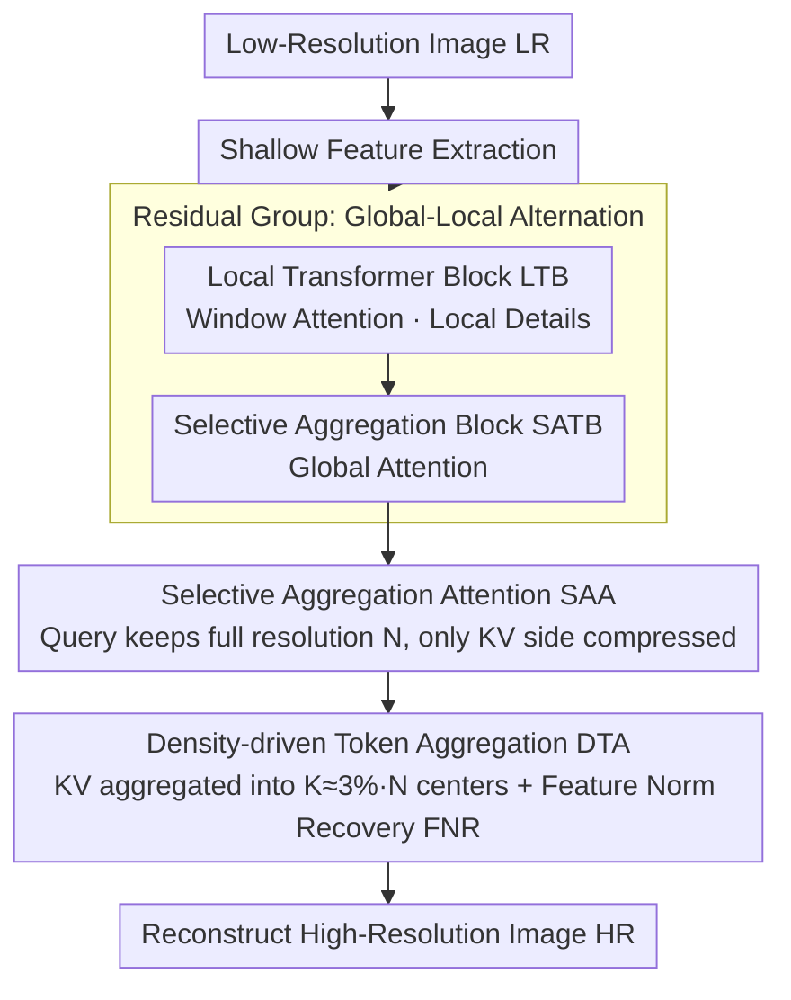

# SAT: Selective Aggregation Transformer for Image Super-Resolution

**Conference**: CVPR 2026  
**arXiv**: [2604.07994](https://arxiv.org/abs/2604.07994)  
**Code**: [https://github.com/PhuTran1005/SAT](https://github.com/PhuTran1005/SAT)  
**Area**: Image Super-Resolution  
**Keywords**: super-resolution, transformer, token aggregation, efficient attention, global modeling

## TL;DR

Ours proposes the Selective Aggregation Transformer (SAT), which reduces the number of tokens in the Key-Value matrix by 97% through density-driven token aggregation while maintaining full resolution for the Query. This achieves efficient global attention modeling, surpassing the SOTA PFT by 0.22dB with a 27% reduction in FLOPs.

## Background & Motivation

Transformer-based super-resolution methods capture long-range dependencies but face quadratic computational complexity. Window attention methods limit the receptive field, while recent methods have various shortcomings: IPG's graph operations are hardware-unfriendly, ATD's external dictionary introduces limited additional information, and PFT's cross-layer attention links may propagate errors from earlier layers.

Key Observation: High-frequency regions (edges, textures) in SR require more computation, while low-frequency regions (smooth areas) can be safely aggregated. Existing methods process the entire image uniformly, leading to inefficient computational allocation.

## Method

### Overall Architecture

SAT aims to resolve the dilemma in Transformer SR where "global attention is too expensive, and window attention cannot see far enough." The backbone utilizes a residual group structure, where two types of blocks are alternately stacked within the group: Local Transformer Blocks (LTB, performing window attention for local details) and Selective Aggregation Transformer Blocks (SATB, performing global attention for long-range dependencies). The key lies in the global attention within the SATB, which no longer treats the entire image uniformly. Instead, it significantly compresses the Key-Value side while maintaining the full resolution of the Query, thereby reducing computation while approximating global modeling.

### Key Designs

**1. Selective Aggregation Attention (SAA): Asymmetric attention with fixed Query and compressed KV**

The quadratic complexity bottleneck of global attention lies in the multiplication of $N$ tokens. However, SR is a pixel-wise reconstruction task; the Query side cannot lose resolution, so only the Key-Value side can be modified. SAA therefore performs asymmetric compression: the Query maintains all $N$ tokens, while the Key-Value side is aggregated into $K$ representative tokens ($K \approx 3\% \times N$), reducing attention complexity from $O(N^2 d)$ to $O(NKd)$. Removing 97% of tokens while maintaining or even improving reconstruction quality is possible because compression only occurs in the information-redundant KV side, ensuring the accuracy of pixel-wise output is not sacrificed.

**2. Density-driven Token Aggregation (DTA): Retaining more tokens in high-frequency regions and merging low-frequency regions**

The core problem of KV compression is "which tokens to keep." Uniform aggregation blurs high-frequency details like edges and textures. Therefore, DTA adopts the concept of density peak clustering to select aggregation centers: it calculates the local density (k-nearest neighbor cosine similarity) for each token and the minimum distance to points with higher density. Tokens with a large product of these two metrics are chosen as centers. Consequently, smooth areas are merged, and fine-grained tokens in high-frequency regions are naturally preserved. After centers are selected, similarity-weighted aggregation is performed, followed by Feature Norm Recovery (FNR) to restore the feature norm that collapses after weighted averaging back to the original distribution—ablations show that training is unstable without FNR. To prevent the center selection process itself from degrading to $O(N^2)$, DTA uses hierarchical sub-sampling to reduce this step to $O(K^2)$.

**3. Global-Local Alternating Structure: SATB looks far, LTB looks close**

Relying solely on global or local attention is insufficient: performance drops significantly when only local attention is kept in ablations. SAT thus alternates between SATB (global attention) and LTB (window attention using Rwin-SA) within residual groups. This allows long-range dependencies and local details—two different receptive fields—to complement each other in deep features, a configuration validated as optimal through ablation studies.

### Loss & Training

Trained using the standard L1 pixel loss. The paper also provides two theoretical guarantees: Theorem 3.1 provides a complexity bound proving SAA indeed reduces global attention to linear levels, while Theorem 3.2 provides an approximation bound showing significant acceleration is achieved with controllable quality degradation.

## Key Experimental Results

### Main Results

| Dataset | Metric | Ours | Prev. SOTA (PFT) | Gain |
|--------|------|-----|-------------|------|
| Urban100 ×4 | PSNR | +0.22dB | baseline | Significant |
| Multi-dataset | FLOPs | -27% | baseline | Substantial efficiency improvement |

### Ablation Study

| Configuration | PSNR | Description |
|------|------|------|
| Without FNR (Feature Norm Recovery) | Decrease | FNR is crucial for stable training |
| Uniform Aggregation vs. Density-driven | Decrease | Density-aware center selection is superior |
| Only Local Attention | Decrease | Global modeling is indispensable |

### Key Findings

- Reconstruction quality is maintained or even improved despite a 97% reduction in token count.
- Density-driven selection naturally preserves fine-grained tokens in high-frequency regions while merging low-frequency areas.
- FNR is essential for maintaining the feature norm distribution after weighted averaging.

## Highlights & Insights

- Asymmetric Query-KV compression perfectly matches the requirements of SR tasks (Query remains pixel-wise, KV can be aggregated).
- Density-driven selection is adaptive to image content, preserving high frequencies and aggregating low frequencies.
- Complete theoretical analysis (complexity and approximation bounds) enhances the credibility of the method.
- Global-local alternation is the optimal choice validated through thorough ablation.

## Limitations & Future Work

- The aggregation ratio (k=3%) and sub-sampling factor β require tuning.
- The k-nearest neighbor search in DTA still incurs some computational overhead.
- Performance on extremely irregular textures remains to be verified.

## Rating

- Novelty: ⭐⭐⭐⭐ — The combination of asymmetric KV compression and density-driven aggregation is novel.
- Technical Depth: ⭐⭐⭐⭐⭐ — Rigorous theoretical analysis.
- Experimental Thoroughness: ⭐⭐⭐⭐⭐ — Comprehensive comparisons and sufficient ablations.
- Value: ⭐⭐⭐⭐ — Significantly reduces FLOPs while improving performance.

<!-- RELATED:START -->

## Related Papers

- [\[CVPR 2026\] DreamSR: Towards Ultra-High-Resolution Image Super-Resolution via a Receptive-Field Enhanced Diffusion Transformer](dreamsr_towards_ultra-high-resolution_image_super-resolution_via_a_receptive-fie.md)
- [\[CVPR 2026\] One-Step Diffusion Transformer for Controllable Real-World Image Super-Resolution](one-step_diffusion_transformer_for_controllable_real-world_image_super-resolutio.md)
- [\[CVPR 2025\] Progressive Focused Transformer for Single Image Super-Resolution](../../CVPR2025/image_restoration/progressive_focused_transformer_for_single_image_super-resolution.md)
- [\[CVPR 2026\] STCDiT: Spatio-Temporally Consistent Diffusion Transformer for High-Quality Video Super-Resolution](stcdit_spatio-temporally_consistent_diffusion_transformer_for_high-quality_video.md)
- [\[CVPR 2026\] Bridging the Perception Gap in Image Super-Resolution Evaluation](bridging_the_perception_gap_in_image_super-resolution_evaluation.md)

<!-- RELATED:END -->
