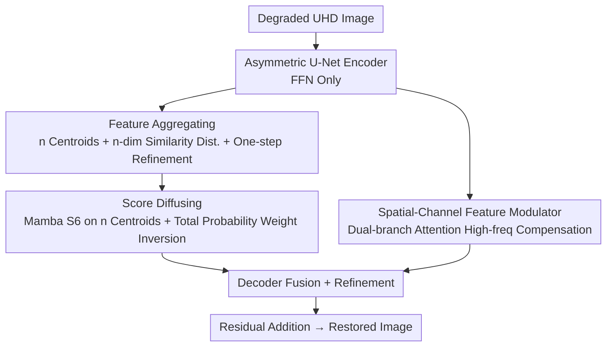

# Scan Clusters, Not Pixels: A Cluster-Centric Paradigm for Efficient Ultra-high-definition Image Restoration

**Conference**: CVPR 2026  
**Paper**: [CVF Open Access](https://openaccess.thecvf.com/content/CVPR2026/html/Wu_Scan_Clusters_Not_Pixels_A_Cluster-Centric_Paradigm_for_Efficient_Ultra-high-definition_CVPR_2026_paper.html)  
**Code**: https://github.com/5chen/C2SSM  
**Area**: Image Restoration / State Space Models  
**Keywords**: UHD Image Restoration, Mamba/SSM, Cluster-Centric Scanning, Linear Complexity, Full-Resolution Inference

## TL;DR
Addressing the bottleneck where Mamba still requires pixel-wise scanning in Ultra-High-Definition (4K) image restoration, leading to memory explosion, C2SSM replaces "pixel-serial scanning" with "cluster-centric scanning." The method distills millions of pixels into a few semantic centroids via a neurally-parameterized mixture distribution, performs Mamba scanning only on these centroids, and diffuses global context back to all pixels based on similarity distributions. This paradigm achieves SOTA performance across five UHD restoration tasks with the lowest FLOPs (0.407G).

## Background & Motivation
**Background**: UHD (3840×2160) image restoration requires establishing a global receptive field across tens of millions of pixels. The quadratic complexity of Transformer self-attention is prohibitive. Recently, State Space Models (SSMs) like Mamba have become mainstream alternatives due to their linear complexity, with models such as MambaIR, MambaIRv2, and Wave-Mamba introducing SSMs to restoration tasks.

**Limitations of Prior Work**: Although SSMs offer linear complexity, their basic operational unit remains the **individual pixel**. A UHD image contains over 8 million pixels; pixel-serial scanning incurs unsustainable memory and computational overhead, making full-resolution inference impossible on consumer GPUs. Existing workarounds have significant drawbacks: multi-scale downsampling (e.g., UHDformer) loses global context and high-frequency details, while patch-based cropping (e.g., LLFormer) introduces boundary artifacts.

**Key Challenge**: Natural images possess **structural redundancy** (highly similar features in adjacent regions and an overall low-rank structure). However, existing methods utilize **pixel-wise computational primitives**, treating pixels as independent entities and failing to exploit semantic aggregation, thus incurring unnecessary computational costs.

**Goal**: Reduce global modeling complexity from $O(C\cdot H^2W^2)$ levels to enable full-resolution restoration of 4K images on consumer-grade hardware without sacrificing restoration quality.

**Key Insight**: The authors question, "To understand an image, is it really necessary to process every single pixel?" Since image features converge into small clusters of semantically coherent regions, representations should be **cluster-centric** rather than pixel-centric.

**Core Idea**: Replace pixel-serial scanning with "scan clusters, not pixels." The image is modeled as a neurally-parameterized mixture distribution where global reasoning is performed only on sparse centroids, and context is probabilistically diffused back to every pixel.

## Method

### Overall Architecture
C2SSM adopts an **asymmetric U-Net** encoder-decoder structure. The encoder utilizes **only FFNs** to save computation. The decoder, inspired by MetaFormer, integrates two core modules alongside FFNs: the **CCSM (Cluster-Centric Scanning Module)** and the **SCFM (Spatial-Channel Feature Modulator)**. These operate in parallel, with the former handling efficient global modeling and the latter compensating for high-frequency details.

The CCSM follows a two-stage pipeline: "**Feature Aggregating → Scanning on Centroids (first half of Score Diffusing) → Probabilistic Weight Inversion/Diffusion back to pixels**." It clusters all pixels into $n$ semantic centroids, executes Mamba's selective scan (S6) only on these $n$ centroids to obtain global weights, and kemudian projects these weights back to each pixel using the total probability formula based on pixel-to-centroid similarity. The SCFM runs **parallel** to the weight inversion stage, using dual-branch attention to recover high-frequency information lost during clustering.

### Key Designs

**1. Cluster-Centric Scanning Paradigm: Centroid-serial instead of Pixel-serial Scanning**

This serves as the core framework, addressing the memory explosion caused by scanning millions of pixels. The work reformulates global modeling as **inference on a neurally-parameterized mixture distribution**. Rich image features are distilled into a sparse set of semantic centroids; scanning and reasoning occur only on these centroids, with results diffused back to all pixels. The complexity of running Mamba on $n$ centroids is $O(C\cdot n^2)$, which is negligible compared to the pixel-wise $O(C\cdot H^2W^2)$ since $n\ll HW$. This is the root cause of its ability to perform full-resolution inference on consumer GPUs with significantly lower FLOPs.

**2. Feature Aggregating: Efficient Pixel Assignment and Centroid Refinement**

To bypass the overhead of iterative clustering, $n$ centroids $\{c_1,\dots,c_n\}$ are initialized via uniform sampling and k-Nearest Neighbors. For each centroid $c_k$, the cosine similarity $sim(f_p,c_k)$ with pixel feature $f_p$ is normalized into a probability density $p_k(f_p)=\frac{sim(f_p,c_k)}{\sum_{p\in\Omega}sim(f_p,c_k)}$. This forms an $n$-dimensional similarity distribution $\mathcal{D}=\{D_1,\dots,D_n\}$. Centroid refinement is completed in a single step via a learnable gate:

$$\hat{c}_k=\frac{1}{N_k}\Big(v_k+\sum_{p\in\Omega}\delta(\alpha\cdot p_k(f_p)+\beta)\cdot\hat{f}_p\Big)$$

where $\delta(\cdot)$ is a smooth gating function that softly selects pixels relevant to the centroid; learnable $\alpha$ adjusts the sharpness of selection, and $\beta$ shifts the activation threshold. $N_k=1+\sum_p\delta(\cdot)$ provides normalization. Critically, the entire process is a **one-step operator without iteration**, ensuring computational efficiency.

**3. Score Diffusing: Global Inference via Total Probability Weight Inversion**

To achieve long-range dependencies without all-to-all pixel computation, the refined centroids $\hat{C}=[\hat{c}_1,\dots,\hat{c}_n]$ are processed through Mamba’s S6 scan, yielding global context weights $W=S6(\hat{C};\theta_{mamba})$. **Weight inversion** then occurs: the assignment probability $\alpha_{p,k}$ of pixel $p$ to cluster $k$ is derived from the similarity distribution via softmax. Following the law of total probability, the expected weight for each pixel is calculated:

$$w_p=\mathbb{E}_{k\sim\mathcal{D}(p)}[w_k]=\sum_{k=1}^{n}\alpha_{p,k}\cdot w_k$$

This mimics the effect of Transformer attention where every position aggregates global information, but avoids $O(N^2)$ pixel interactions by performing global reasoning on a statistically representative graph of sparse centroids.

**4. Spatial-Channel Feature Modulator (SCFM): Compounding High-frequency Loss**

Clustering naturally smooths details. The SCFM acts as a parallel high-frequency "information compensator." It utilizes dual-branch attention: a spatial branch $W_s=\delta(\mathrm{Conv}([\mathrm{Max}(F_{in});\mathrm{Mean}(F_{in})]))$ captures spatial saliency, and a channel branch $W_c=\delta(\mathrm{Max}(F_d)+\mathrm{Avg}(F_d))$ captures channel importance. The final output is $F_{out}=\mathrm{Conv}(W_s\cdot F_{in})+\mathrm{Conv}(W_c\cdot F_{in})$. Ablations show it complements the CCSM to preserve high-frequency fidelity.

### Loss & Training
The base reconstruction utilizes **L1 Loss + FFT Loss** in the RGB space. The optimizer is AdamW with an initial learning rate of $5\times10^{-4}$ and cosine annealing. Training was conducted on 4 A800 GPUs, using random 768×768 crops from 4K images with a batch size of 16 for 150K iterations. The network uses $N_1=3$ levels, with decoder block structures of $N_2=[2,4,4]$, 4 blocks for bottleneck/refinement, a base embedding dimension of 32, and a default centroid count of $n=4$.

## Key Experimental Results

### Main Results
Across **five UHD restoration tasks** (Low-light, Rain, Blur, Haze, Snow), C2SSM achieves consistent SOTA with only 2.71M parameters:

| Task / Dataset | Metric | C2SSM | Prev. SOTA | Gain |
|--------------|------|-------|----------|------|
| Low-light UHD-LOL4K | PSNR | 39.61 | MixNet 39.22 | +0.39 dB |
| Low-light UHD-LL | PSNR | 27.63 | MixNet 27.54 | +0.09 dB |
| Deraining 4K-Rain13k | PSNR | 35.13 | ERR 34.48 | +0.65 dB |
| Deblurring UHD-Blur | PSNR | 31.53 | ERR 29.72 | +1.81 dB |
| Dehazing UHD-Haze | PSNR | 24.08 | UHD-processer 23.24 | +0.84 dB |
| Desnowing UHD-Snow | PSNR | 42.45 | UHDDIP 41.56 | +0.89 dB |

Compared to the Mamba baseline Wave-Mamba, it leads by 2.18 dB in low-light tasks; it also performs best on 4K-RealRain (no-reference) with NIQE 8.198 / PIQE 54.90.

### Ablation Study
Ablations on UHD-LOL4K (Tab. 8):

| Configuration | PSNR | SSIM | Param | Notes |
|------|------|------|-------|------|
| full model (ours) | 39.61 | 0.992 | 2.71M | Final Model |
| remove CCSM | 35.87 | 0.987 | 2.21M | Largest drop (-3.74 dB); global modeling is key |
| replace CCSM→ResBlock | 37.32 | 0.989 | 2.38M | Loss of global reasoning |
| replace CCSM→Vanilla Mamba | 37.43 | 0.990 | 3.11M | Pixel-serial; slower and worse |
| replace CCSM→ASSM | 38.71 | 0.991 | 2.96M | Still inferior to centroid scanning |
| remove SCFM | 39.05 | 0.992 | 2.53M | Smaller drop (-0.56 dB); auxiliary module |

Complexity comparison for 64×64 input (Tab. 10): C2SSM FLOPs are only **0.407G**, lower than MambaIR (4.774G), Wave-Mamba (0.881G), EVSSM (7.893G), and MambaIRv2 (4.940G). Except for Wave-Mamba, other methods cannot perform full-resolution UHD inference.

### Key Findings
- **CCSM is the primary driver**: Removing it drops performance by 3.74 dB, far exceeding the impact of removing SCFM (0.56 dB), confirming that long-range global modeling is vital for restoration.
- **Optimal Centroid Count $n=4$**: Too many centroids introduce redundancy, though UHD-Blur (complex indoor scenes) peaks at $n=6$, suggesting optimal $n$ scales with scene complexity.
- **Full-resolution Feasibility**: Vanilla Mamba and ASSM require 8× downsampling due to memory constraints; C2SSM uses sparse representations to enable true full-resolution processing.

## Highlights & Insights
- **Shifting the Scanning Unit from Pixels to Clusters** is a paradigm shift for visual Mamba: it is not just about making the scan faster, but about scanning fewer items ($HW\to n$).
- **Probabilistic Closed-loop Design**: The similarity distribution $\mathcal{D}$ is reused for both centroid refinement (forward aggregation) and weight inversion (backward diffusion), linking the two stages theoretically.
- **One-step Clustering** avoids K-means iterations, embedding differentiable clustering into a single forward pass—the engineering key to low UHD overhead.
- Simultaneous SOTA and lowest FLOPs indicate that semantic redundancy is a significant "dividend" in UHD restoration that prior work failed to fully exploit.

## Limitations & Future Work
- **Task-specific Centroid Count**: $n$ is sensitive to scene complexity; the paper uses a fixed $n=4$ and lacks an adaptive mechanism.
- Centroid initialization relies on random uniform sampling + kNN; the impact of initialization randomness on stability requires further discussion.
- The method focuses on UHD restoration; its transferability to other large-scale tasks like video or detection remains a future direction.
- SCFM contribution is relatively limited; superior methods for high-frequency recovery could be explored.

## Related Work & Insights
- **vs Wave-Mamba**: Wave-Mamba models only low-frequency signals via wavelets with fixed channel counts; C2SSM models global context at full resolution via centroids, leading by 2.18 dB in low-light tasks.
- **vs MambaIR / MambaIRv2**: These still use pixel/patch-level scanning, which explodes in memory for UHD. C2SSM’s FLOPs are approximately 1/12th of theirs.
- **vs UHDformer**: Downsampling architectures lose high-frequency details; C2SSM enables true full-resolution processing, avoiding downsampling info loss.

## Rating
- Novelty: ⭐⭐⭐⭐⭐ Represents a paradigm shift by merging differentiable clustering with Mamba scanning.
- Experimental Thoroughness: ⭐⭐⭐⭐⭐ Extensive tasks, ablations, and efficiency comparisons.
- Writing Quality: ⭐⭐⭐⭐ Clear framework and theoretical grounding, though some math symbols are complex.
- Value: ⭐⭐⭐⭐⭐ Enables 4K full-resolution restoration on consumer GPUs; methodology is generalizable to large-scale vision tasks.

<!-- RELATED:START -->

## Related Papers

- [\[ICLR 2026\] FreeAdapt: Unleashing Diffusion Priors for Ultra-High-Definition Image Restoration](../../ICLR2026/image_restoration/freeadapt_unleashing_diffusion_priors_for_ultra-high-definition_image_restoratio.md)
- [\[CVPR 2026\] DreamSR: Towards Ultra-High-Resolution Image Super-Resolution via a Receptive-Field Enhanced Diffusion Transformer](dreamsr_towards_ultra-high-resolution_image_super-resolution_via_a_receptive-fie.md)
- [\[CVPR 2026\] ShiftLUT: Spatial Shift Enhanced Look-Up Tables for Efficient Image Restoration](shiftlut_spatial_shift_enhanced_look-up_tables_for_efficient_image_restoration.md)
- [\[CVPR 2026\] Retrieve-to-Restore: Efficient All-in-One Image Restoration with a Retrieval-Based Degradation Bank](retrieve-to-restore_efficient_all-in-one_image_restoration_with_a_retrieval-base.md)
- [\[CVPR 2026\] Human-Centric Multi-Exposure Fusion: Benchmark and Bi-level Cognition Distillation Framework](human-centric_multi-exposure_fusion_benchmark_and_bi-level_cognition_distillatio.md)

<!-- RELATED:END -->
