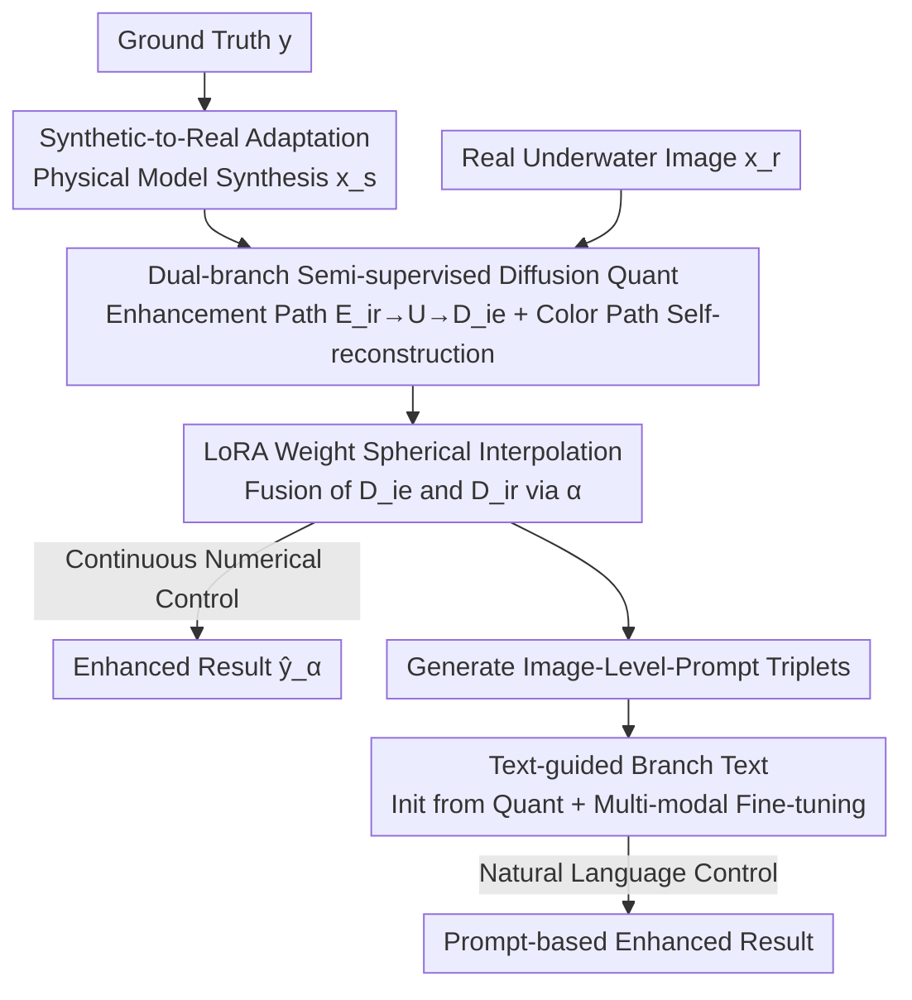

# SDUIE: Semi-Supervised Diffusion for Underwater Image Enhancement with Quant-Text Dual Control

**Conference**: CVPR 2026  
**Paper**: [CVF Open Access](https://openaccess.thecvf.com/content/CVPR2026/html/Cong_SDUIE_Semi-Supervised_Diffusion_for_Underwater_Image_Enhancement_with_Quant-Text_Dual_CVPR_2026_paper.html)  
**Code**: https://github.com/Xiaofeng-life/SDUIE  
**Area**: Image Restoration / Underwater Image Enhancement / Diffusion Models  
**Keywords**: Underwater Image Enhancement, Semi-supervised Diffusion, LoRA Weight Fusion, Controllable Enhancement Level, Text-guided

## TL;DR
To address the issue where existing underwater image enhancement methods only provide fixed outputs despite varying user preferences, SDUIE proposes a semi-supervised dual-branch diffusion framework. It enables **continuous numerical adjustment** via a fusion factor $\alpha$ (SDUIE-Quant) and **semantic adjustment** via natural language prompts (SDUIE-Text), achieving SOTA performance while preserving underwater aesthetic tones.

## Background & Motivation
**Background**: Underwater imaging suffers from wavelength-dependent attenuation (rapid decay of red/yellow light, relative stability of blue/green light), leading to prevalent blue-green color casts. Methods are categorized into non-deep learning priors/physical models (e.g., ULAP, HLRP) and data-driven methods using CNNs, Transformers, GANs, Flow, or Diffusion (e.g., Semi-UIR, UIE-DM, WF-Diff).

**Limitations of Prior Work**: Most methods produce a **single fixed output**. However, underwater enhancement is an **ill-posed problem**—no "unique perfect enhancement" exists, as users have different subjective preferences regarding enhancement intensity. Fixed outputs results in either under-enhancement or over-enhancement. Few works offering diverse outputs (CECF, PWAE) rely on style guide images and **lack explicit control over enhancement levels**. UIESS uses style latent spaces, but these spaces often contain redundant information and lack text instruction support.

**Key Challenge**: There is a tension between "objective fidelity" and "subjective preference." Retaining moderate blue-green tones is crucial for maintaining underwater characteristics, yet individual preferences vary. There is a need for a mechanism that **adaptively adjusts enhancement levels based on perceptual needs**, supporting both precise numerical and intuitive semantic control.

**Goal**: To build an underwater enhancement framework capable of both precise numerical adjustment (continuous variation via an $\alpha$ factor) and natural language instruction (e.g., "enhance this image to level ___"), while resolving the domain gap between synthetic training data and real underwater generalization.

**Key Insight**: Reuse pre-trained diffusion model priors via LoRA fine-tuning. Model the "enhancement level" as the **weight fusion ratio** between two decoders (enhancement vs. color preservation), transforming continuous adjustment into an interpolatable weight merging process.

**Core Idea**: A dual-branch semi-supervised diffusion framework + LoRA weight spherical interpolation = continuous controllable enhancement levels (Quant). The Quant branch then automatically generates "image-level-prompt" triplets to train the text control branch (Text).

## Method

### Overall Architecture
SDUIE utilizes a pre-trained **Latent Diffusion Model** as the backbone with **LoRA** fine-tuning. It consists of **SDUIE-Quant** (numerical control) and **SDUIE-Text** (semantic control), sharing the same latent space and "synthetic-to-real" adaptation strategy.

SDUIE-Quant features a **dual-branch** structure: encoders $E_{ie}$ (for ground truth $y$) and $E_{ir}$ (for synthetic/real underwater images $x_s, x_r$) share a single UNet $U$. Decoder $D_{ie}$ handles **image enhancement**, while $D_{ir}$ manages **color preservation**. Training follows two paths: the **image enhancement path** (synthetic underwater $\to$ ground truth, supervised) and the **color preservation path** (self-reconstruction to learn real underwater tones, self-supervised), forming the "semi-supervised" approach. During inference, continuous levels are achieved by fusing LoRA weights between $D_{ie}$ and $D_{ir}$ with a fusion factor $\alpha \in [0, 1]$.

SDUIE-Text's components ($E'_{ir}, U', D'_{ie}$) are initialized from the trained Quant model. it uses "image-level" pairs generated by Quant under different $\alpha$ values paired with prompt templates to learn the mapping from "text semantics $\to$ enhancement level."

### Key Designs

**1. Dual-branch Semi-supervised Diffusion (SDUIE-Quant): Shared Latent Space**

To address the dilemma where synthetic supervision hurts real-world generalization while pure self-supervision fails to learn enhancement, the task is split into two paths sharing UNet $U$. The **image enhancement path** $E_{ir}\to U\to D_{ie}$ learns to map $x_s$ to $y$ using pixel-level loss $L^{ie}_{p,x_s}=\|D_{ie}(U(\tau_\theta(p),E_{ir}(x_s)))-y\|_1$ and adversarial loss $L^{ie}_{a,x_s}$. The **color preservation path** performs self-reconstruction on $x_s, x_r, y$ (e.g., $L^{ir}_{p,x_r}=\|D_{ir}(U(\tau_\theta(p),E_{ir}(x_r)))-x_r\|_1$), allowing the model to learn natural underwater tone patterns. Since all pairs share $U$, representations are aligned in latent space.

**2. Synthetic-to-Real Adaptation: Physics-based Synthesis**

To provide ground truth for real underwater images, indoor terrestrial images are used as labels. Corresponding underwater images are synthesized using a color-distortion-aware physical model:

$$x_s(c)=\eta(c)\circ[y(c)\circ e^{-\beta d}+L(c)\circ(1-e^{-\beta d})]$$

where $c$ is the channel, $d$ is the depth map, $\beta$ is the scattering coefficient, $L$ is ambient light, and $\eta$ is a color distortion vector derived from manual underwater color patches. This creates 1,001 supervision pairs.

**3. LoRA Weight Spherical Interpolation: Level Control via $\alpha$**

This is the core mechanism for "continuous controllable enhancement." During inference, rather than re-training, **Spherical Linear Interpolation (Slerp)** is applied between the LoRA weights of $D_{ie}$ and $D_{ir}$:

$$S(\omega_{ie},\omega_{ir};\alpha)=\omega_{ir}\frac{\sin((1-\alpha)\theta)}{\sin\theta}+\omega_{ie}\frac{\sin(\alpha\theta)}{\sin\theta},\quad\theta=\arccos(\omega_{ie}\cdot\omega_{ir})$$

The factor $\alpha \in [0, 1]$ controls the ratio: $\alpha=0$ produces pure color preservation ($D_{ir}$), while $\alpha=1$ produces full enhancement ($D_{ie}$). Intermediate values provide smooth gradations.

**4. SDUIE-Text: Translating Numerical Levels to Natural Language Instructions**

To make $\alpha$ intuitive for users, SDUIE-Text is initialized from Quant. It uses enhanced images $\hat{y}_\alpha$ generated by Quant at various $\alpha$ values paired with prompt templates like "Enhance this image by ___ level." to form a dataset $S_{\hat{y}}=\{\hat{y}_\alpha,p_\alpha\}$. The model is fine-tuned using pixel-level $L^{ie'}_{p,\hat{y}}$ and adversarial $L^{ie'}_{a,\hat{y}}$ losses.

### Loss & Training
The total loss combines enhancement and color preservation paths: $L_{all}=L^{ie}_{p,x_s}+L^{ie}_{a,x_s}+\lambda_1(L^{ir}_{p,x_s}+L^{ir}_{p,y}+L^{ir}_{p,x_r})+\lambda_2(L^{ir}_{a,x_s}+L^{ir}_{a,y}+L^{ir}_{a,x_r})$. All networks are updated alternately. $\lambda_1=\lambda_2=1$; Adam optimizer, LR 0.0001, batch size 1. LoRA ranks for UNet $U$ and VAE are 8 and 4, respectively.

## Key Experimental Results

### Main Results
Evaluated on UCCS, EUVP, U45, and Challenge-60 datasets using **UIQM**, **UCIQE**, and **URANKER** (all higher is better). SDUIE-Quant ($\alpha=1.0$) and SDUIE-Text (level "ten") significantly outperform existing methods in UIQM and URANKER:

| Dataset | Metric | SDUIE-Quant | Prev. SOTA | Note |
|--------|------|-------------|----------|------|
| U45 | UIQM | 5.501 | HLRP 4.908 | Large Lead |
| U45 | URANKER | 2.478 | Semi-UIR 2.032 | +0.45 |
| UCCS | UIQM | 5.351 | HLRP 4.760 | Large Lead |
| UCCS | URANKER | 2.481 | CDF 1.549 | Significant Gain |

Visually, SDUIE handles blue tones more effectively than MIP/IBLA/ULAP and avoids the under-enhancement or brightness dimming seen in HLRP/CECF/UIE-DM.

### Ablation Study
Objective scores for SDUIE-Quant across different $\alpha$ values (UCCS) increase monotonically, validating the controllability of levels:

| $\alpha$ | 0 | 0.2 | 0.4 | 0.6 | 0.8 | 1.0 |
|----------|------|------|------|------|------|------|
| UIQM ↑ | 1.501 | 1.905 | 2.740 | 4.073 | 4.996 | 5.351 |
| UCIQE ↑ | 0.488 | 0.490 | 0.506 | 0.529 | 0.550 | 0.563 |
| URANKER ↑ | -1.415 | -0.924 | 0.157 | 1.545 | 2.274 | 2.481 |

### Key Findings
- **High Correlation**: Enhancement intensity correlates monotonically with objective metrics, confirming that "controllable enhancement" is quantifiable.
- **Quant vs. Text**: Performance is comparable between SDUIE-Quant and SDUIE-Text, indicating successful translation from numerical to semantic control.
- **Continuous Trade-off**: $\alpha$ values provide a smooth transition between original color preservation and full enhancement.

## Highlights & Insights
- Modeling **enhancement level as LoRA weight interpolation** is an elegant approach for controllable generation, providing a continuous spectrum without training separate models for each level.
- Using **Quant to generate data for Text** represents a self-bootstrapping "numeric-to-language" alignment paradigm.
- The user-centric design acknowledges the ill-posed nature of underwater enhancement by handing control back to the user.

## Limitations & Future Work
- **UCIQE Gain**: Improvements in UCIQE are less pronounced compared to UIQM/URANKER, suggesting limited advantages in dimensions like color uniformity.
- Physical model parameters ($\beta, L, \eta$) are manually selected, and the impact of the remaining domain gap in extremely turbid scenes is not fully explored.
- The SDUIE-Text vocabulary (e.g., "ten") is limited; complex semantic instructions remain unverified.

## Related Work & Insights
- **vs. UIESS**: Both control intensity, but SDUIE uses weight interpolation instead of style latent space tuning, providing cleaner control and a text interface.
- **vs. Semi-UIR**: Both use semi-supervised learning, but SDUIE utilizes shared latent space dual-branch diffusion and physics-based pairs to handle domain adaptation.

## Rating
- Novelty: ⭐⭐⭐⭐ 
- Experimental Thoroughness: ⭐⭐⭐⭐ 
- Writing Quality: ⭐⭐⭐⭐ 
- Value: ⭐⭐⭐⭐

<!-- RELATED:START -->

## Related Papers

- [\[CVPR 2026\] Dual Ascent Diffusion for Inverse Problems](dual_ascent_diffusion_for_inverse_problems.md)
- [\[ICML 2026\] Semi-Supervised Neural Super-Resolution for Mesh-Based Simulations](../../ICML2026/image_restoration/semi-supervised_neural_super-resolution_for_mesh-based_simulations.md)
- [\[CVPR 2026\] Restore Text First, Enhance Image Later: Two-Stage Scene Text Image Super-Resolution with Glyph Structure Guidance](restore_text_first_enhance_image_later_two-stage_scene_text_image_super-resoluti.md)
- [\[CVPR 2026\] IFCSR: Inference-Free Fidelity-Realism Control for One-Step Diffusion-based Real-World Image Super-Resolution](ifcsr_inference-free_fidelity-realism_control_for_one-step_diffusion-based_real-.md)
- [\[CVPR 2026\] Bi-Bridge: Bidirectional Diffusion Bridges for Low-Light Image Enhancement](bi-bridge_bidirectional_diffusion_bridges_for_low-light_image_enhancement.md)

<!-- RELATED:END -->
