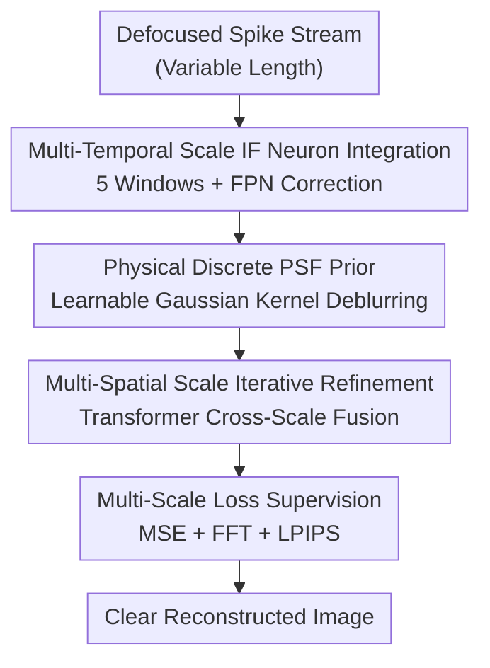

# DeSpike: Defocus Deblurring and Image Reconstruction for Spike Camera

**Conference**: CVPR 2026  
**Paper**: [CVF Open Access](https://openaccess.thecvf.com/content/CVPR2026/html/Ma_Seeing_Through_Blur_Tackling_Defocus_in_Spike-Based_Imaging_CVPR_2026_paper.html)  
**Code**: None  
**Area**: Image Restoration / Neuromorphic Vision  
**Keywords**: Spike Camera, Defocus Deblurring, Integrate-and-Fire Neuron, PSF Prior, Image Reconstruction

## TL;DR
DeSpike is the first end-to-end deblurring and reconstruction framework specifically designed for spike camera defocus blur. It first characterizes how defocus distorts spike firing using a thin-lens physical model, then restores clear images from blurred spike streams using multi-temporal scale IF neurons, learnable discrete PSF priors, and multi-spatial scale iterative refinement. It significantly outperforms existing deblurring methods on both synthetic and real defocused spike data.

## Background & Motivation
**Background**: Spike cameras are a class of neuromorphic sensors where each pixel continuously integrates incident light intensity and fires a spike (integrate-and-fire, IF) when a threshold is exceeded. With a temporal resolution of up to 40,000 Hz, they are naturally resistant to motion blur and capture absolute intensity details, making them suitable for scenarios like autonomous driving and high-speed robotics. Existing spike reconstruction works (TFP/TFI, Spk2ImgNet, RSIR, WGSE, etc.) primarily address **motion blur** and **sensor noise**.

**Limitations of Prior Work**: In reality, shallow depth of field or focusing delays lead to **defocus blur**, a degradation largely ignored in spike reconstruction. Defocus is fundamentally different from motion blur: while motion blur is a temporal distortion that can be mitigated by high sampling rates, defocus is **spatial dispersion at the optical level**. it alters the spatial distribution of photons at the sensor, thereby changing spike firing behavior in a way that traditional temporal techniques cannot recover.

**Key Challenge**: Defocus disperses photons from a scene point across a neighborhood (forming a Circle of Confusion, CoC), causing slower light intensity accumulation at a single pixel and resulting in **delayed or even missed spikes**. Moreover, this perturbation is **spatially non-uniform and temporally non-monotonic**—some spikes are delayed due to local attenuation, while others are advanced due to energy inflow from neighbors, disrupting the temporal consistency assumed in spike pipelines. Existing spike autofocus methods can only "preventatively" avoid capturing defocus but cannot **restore already defocused** spike streams.

**Goal**: (1) Establish a physical model of how defocus affects spike firing; (2) directly reconstruct clear images from defocused spike streams.

**Key Insight**: Since the root of defocus is optical dispersion (describable by a PSF), the **physical defocus model** is explicitly embedded into the network. This model guides how neurons integrate spikes across scales and treats the PSF as a learnable prior for "deconvolution."

**Core Idea**: Restore clear images end-to-end from defocused spike streams using a "thin-lens PSF physical prior + multi-temporal scale IF integration + multi-spatial scale iterative refinement."

## Method

### Overall Architecture
DeSpike takes a variable-length defocused spike stream as input and outputs a clear reconstructed image. The pipeline follows a two-stage approach: first, in the **temporal dimension**, a set of IF neurons accumulates spikes under different integration windows into features (while simultaneously compensating for Fixed Pattern Noise, FPN). Then, in the **spatial dimension**, a set of learnable discrete PSF kernels performs "deblurring" on these features. Adaptive weighting across defocus levels is achieved via Transformer attention, followed by multi-spatial scale iterative refinement to recover details progressively, with multi-scale loss supervision at each level.

Physical modeling is the foundation: based on the thin-lens equation $\frac{1}{f}=\frac{1}{u}+\frac{1}{v}$, a defocused point forms a Circle of Confusion with radius $r=\frac{D}{2}\cdot\frac{\Delta v}{v}$ on the sensor. Spatial blur is approximated by a Gaussian PSF $G(x,y;\sigma)=\frac{1}{2\pi\sigma^2}\exp(-\frac{x^2+y^2}{2\sigma^2})$. Consequently, the firing of a defocused spike becomes the temporal integration of the **blurred** light intensity:

$$S(x,y,t)=\begin{cases}1,& \int_{t_n}^{t}\eta\cdot(I*G)(x,y,\tau)\,d\tau\ge\theta\\0,&\text{otherwise}\end{cases}$$

This equation highlights the detriment of defocus: convolution reduces the effective light intensity per pixel, slowing down integration and delaying (or even inhibiting) spikes—exactly what the subsequent modules aim to counteract.

### Key Designs

**1. Multi-Temporal Scale IF Neuron Integration: Capturing "Early" and "Late" Spikes Simultaneously**

Temporal perturbations from defocus are non-monotonic—some spikes are advanced while others are delayed within the same frame. A single integration window inevitably loses information. DeSpike uses a set of **non-spiking neurons** to perform differentiable membrane integration over multiple discrete time windows $\{T_1,\dots,T_n\}$ (the paper uses $n=5$ with lengths 64/96/128/160/192). Each window yields a feature $F_i=\mathrm{SN}(S(T_i))$, encoding both sharp and blurred structures across temporal scales. Crucially, hardware characteristics are embedded: a per-pixel FPN correction term is added to the membrane potential update:

$$V(t)=V(t-1)+\gamma(x,y)\cdot S(t)$$

The correction coefficient $\gamma(x,y)=\frac{R(x_m,y_m)}{R(x,y)}$ is estimated from the response deviation relative to a reference pixel $(x_m,y_m)$ under a uniform light field. Since defocus deblurring is highly sensitive to noise, this step suppresses FPN during integration to prevent noise amplification during deconvolution.

**2. Physical Discrete PSF Prior: Formulating "Deblurring" as a Learnable Deconvolution Kernel Bank**

Since defocus is physically a Gaussian PSF convolution, the most direct prior for deblurring is its inverse process. DeSpike constructs a set of discrete learnable kernels $\{k_1,\dots,k_m\}$, each corresponding to a level of dispersion (initialized as Gaussians with scale $\sigma_j$). Applying these to temporal features yields $D_{i,j}=k_j*F_i$, essentially performing "spatial deconvolution" for different blur levels to produce candidates. Given that real-world defocus is spatially non-uniform, a Transformer attention mechanism weights and fuses the outputs based on contextual relevance, allowing different image regions to select appropriate deconvolution strengths.

**3. Multi-Spatial Scale Iterative Refinement: Progressively Recovering Residual Blur**

A single deconvolution pass often fails to clear severe defocus. Thus, the PSF deblurring results are fed into an iterative refinement module. Each $F_i$ is downsampled to multiple spatial resolutions, convolved with discrete kernels $k_p$ at each scale, and fused with the reconstruction from the previous level using a Transformer:

$$\mathrm{Rec}_j=M\big(T(F),\ \mathrm{Rec}_{j-1}\!\uparrow\ \otimes\ \textstyle\bigcup_{p=1}^{s_G}k_p*F\big),\quad j=1,2,3$$

where $M$ denotes element-wise fusion, $T$ is the Transformer encoder, $\uparrow$ represents upsampling, and $\otimes$ is a fusion operator. This recursive structure allows the model to utilize **global spatial context** and **local blur priors** at each level to restore clear structures under severe defocus. ⚠️ Operator symbols follow the original text.

**4. Multi-Scale Hierarchical Loss: Supervision Across Time × Space Grid**

To constrain intermediate outputs in both temporal and spatial dimensions, the loss is applied over a hierarchical grid of $N_t$ time windows × $N_s$ spatial resolutions ($N_t=5, N_s=3$):

$$L=\lambda_1\sum_{i=1}^{N_t}\sum_{s=1}^{N_s}\beta_{i,s}L_{i,s}^{\mathrm{MSE}}+\lambda_2 L_{\mathrm{FFT}}+\lambda_3 L_{\mathrm{LPIPS}}$$

Channel-wise MSE ensures pixel-level fidelity, while frequency domain $L_{\mathrm{FFT}}$ and perceptual $L_{\mathrm{LPIPS}}$ are added only to the final output at the coarsest resolution to balance texture and perceptual quality. Weights are set as $\beta_{1..5}=0.1/0.3/0.5/0.7/1.0$ (higher weights for larger scales), with $\lambda_1,\lambda_2,\lambda_3=1/0.2/0.2$.

## Key Experimental Results

### Main Results
Dataset: Defocused spike sequences synthesized from the DPDD dataset (350 training / 32 testing pairs), plus 75 real defocused sequences captured by a spike camera. Training: 2000 epochs, batch size 2, on a single RTX 4090. Baselines: Cascade pipelines of "Spike Reconstruction (TFP/TFI/RSIR/Spk2ImgNet) + Frame-domain Deblurring (GKMNet/NRKNet)"; `*` indicates retraining on the synthetic set.

| Data | Metric | DeSpike | Best Baseline | Note |
|------|------|---------|----------|------|
| Synth | PSNR↑ | **18.94** | 17.77 (RSIR-NRKNet) | Significant lead |
| Synth | SSIM↑ | 0.57 | 0.58 (TFP-GKMNet) | Slightly lower |
| Synth | LPIPS↓ | **0.25** | 0.29 (TFP-GKMNet) | Best perceptual quality |
| Real | RankIQA↓ | **4.74** | 4.82 (TFI-GKMNet) | Best no-reference quality |
| Real | Contrast↑ | **0.15** | 0.12 | Highest contrast |

PSNR and LPIPS lead across the board. SSIM is only slightly inferior to TFP reconstruction with GKMNet deblurring. On real data, all metrics are optimal; the model restores both structures and underlying textures in scenes like wire meshes and window frames, whereas cascade pipelines lose details during the initial reconstruction step.

### Ablation Study
| Config | PSNR↑ | SSIM↑ | LPIPS↓ | Note |
|------|-------|-------|--------|------|
| All Modules | 18.94 | 0.57 | 0.25 | Full Model |
| w/o MTS | 18.28 | 0.53 | 0.30 | Remove multi-temporal scale integration |
| w/o MSS | 18.20 | 0.53 | 0.29 | Remove multi-spatial scale iterative refinement |
| w/o NC | 17.36 | 0.50 | 0.33 | Remove FPN compensation |
| w/o transformer | 17.02 | 0.46 | 0.38 | Replace attention with standard QKV |
| w/o physical kernel | 18.48 | 0.54 | 0.29 | Replace physical kernels with standard conv |

### Key Findings
- **Transformer attention fusion contributes most**: Removing it drops PSNR from 18.94 to 17.02 and increases LPIPS to 0.38, showing that cross-scale adaptive weighting is critical for non-uniform defocus.
- **FPN compensation (NC) is the next vital component**: Removing it drops PSNR to 17.36, confirming that deblurring is highly sensitive to noise and suppression during integration is necessary.
- **Physical PSF prior is effective but "gentler"**: Replacing it with standard convolution drops PSNR only to 18.48, suggesting it plays a stabilizing/regularizing role.
- **Robustness**: The model remains stable across different defocus distances (front/on/back of focal plane) and shorter time windows (64/32 steps). Performance decreases with shorter windows but still exceeds competitors.

## Highlights & Insights
- **Optical physics embedded in neuromorphic sensor models**: Derives the "defocus-modified spike firing" IF equation from thin-lens and CoC theory, ensuring one-to-one correspondence between physical modeling and network architecture.
- **First to tackle spike camera defocus**: This fills a gap in spike reconstruction, which previously only addressed motion blur and noise, identifying that defocus temporal perturbations are non-monotonic.
- **"End-to-End" triumphs over "Reconstruct-then-Deblur"**: Cascade pipelines lose information during the first stage; DeSpike recovers directly from the spike stream, a strategy transferable to other "sensor-side" degradations.
- **Learnable discrete PSF kernels + attention weighting**: Converts the classic "kernel selection" problem in deconvolution into differentiable attention fusion, a generic solution for spatially non-uniform blur.

## Limitations & Future Work
- Training sequences were **synthesized** from DPDD frame data; there may be a gap between synthetic and real optical defocus. Real-world data is limited to 75 sequences without paired ground truths.
- SSIM lags slightly behind some baselines, indicating room for improvement in structural similarity. Impact of hyper-parameters (number of kernels $m$, window settings) is not fully explored.
- FPN correction coefficients $\gamma$ require offline calibration with a uniform light field; changing cameras requires recalibration.
- ⚠️ Code is not provided; implementation details for some modules (fusion operator $\otimes$, iterative refinement) rely on text descriptions.
- Future work: Joint learning of defocus and motion degradation, using real paired data or self-supervision to reduce the synthetic gap, and extending PSF priors to be depth-dependent (predicting local $\sigma$ per depth).

## Related Work & Insights
- **vs. Frame-domain Defocus Deblurring (DPDNet / GKMNet / NRKNet)**: These target traditional cameras and often require defocus map estimation; ours operates directly in the spike domain and adapts the GKMNet "predefined kernels + learned weights" idea into learnable PSF priors.
- **vs. Spike Reconstruction (Spk2ImgNet / RSIR / WGSE / TFP-TFI)**: These solve motion blur and noise but are ineffective against defocus. DeSpike is the first framework for the latter and integrates RSIR's FPN noise modeling into IF integration.
- **vs. Spike Autofocus**: Autofocus "prevents" defocus but cannot fix existing blurred data; DeSpike is a "post-capture" fix, making them complementary.

## Rating
- Novelty: ⭐⭐⭐⭐⭐ First defocus deblurring framework for spike cameras, tightly coupled physical modeling and network design.
- Experimental Thoroughness: ⭐⭐⭐⭐ Synthetic + real data, multiple focal lengths/window sizes, six ablation studies; however, real-world data scale is small.
- Writing Quality: ⭐⭐⭐⭐ Physical motivation is clear; some operator notations are slightly ambiguous.
- Value: ⭐⭐⭐⭐ Fills a crucial gap in spike reconstruction, practical for high-speed scenarios like autonomous driving.

<!-- RELATED:START -->

## Related Papers

- [\[CVPR 2026\] HFR and HDR Video from Multi-Attenuated Spikes Using a Rapidly Rotating SpokeND Filter](hfr_and_hdr_video_from_multi-attenuated_spikes_using_a_rapidly_rotating_spokend_.md)
- [\[CVPR 2026\] Hybrid Agents for Image Restoration](hybrid_agents_for_image_restoration.md)
- [\[CVPR 2026\] DRFusion: Degradation-Robust Fusion via Degradation-Aware Diffusion Framework](drfusion_degradation_robust_fusion_via_degradation_aware_diffusion_framework.md)
- [\[CVPR 2026\] Towards Universal Computational Aberration Correction in Photographic Cameras: A Comprehensive Benchmark Analysis](unicac_universal_computational_aberration_correction_benchmark.md)
- [\[CVPR 2026\] Bi-Bridge: Bidirectional Diffusion Bridges for Low-Light Image Enhancement](bi-bridge_bidirectional_diffusion_bridges_for_low-light_image_enhancement.md)

<!-- RELATED:END -->
