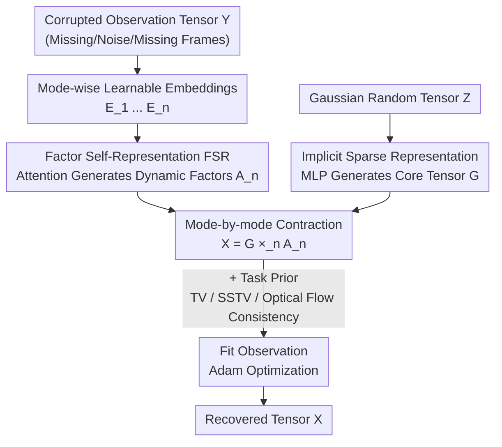

# Self-Attention Driven Tensor Representation for High-Order Data Recovery

**Conference**: CVPR 2026  
**Paper**: [CVF Open Access](https://openaccess.thecvf.com/content/CVPR2026/html/Shi_Self-Attention_Driven_Tensor_Representation_for_High-Order_Data_Recovery_CVPR_2026_paper.html)  
**Code**: None  
**Area**: Image Restoration / Low-Rank Tensor Representation / Tensor Completion  
**Keywords**: Low-rank tensor representation, self-attention, implicit sparsity, tensor completion, high-order data recovery

## TL;DR
This paper integrates the self-attention mechanism into the factor modeling of Low-Rank Tensor Representation (LRTR). Specifically, "Factor Self-Representation" is proposed to replace fixed MLP/CNN mappings for dynamically capturing local and non-local non-linear dependencies in the factor space. Furthermore, an MLP is utilized to parameterize the core tensor to implicitly impose sparsity constraints. Supported by theoretical proofs of recoverability, this approach consistently outperforms existing SOTA methods across three high-order data recovery tasks: completion, denoising, and video frame interpolation.

## Background & Motivation
**Background**: Real-world visual data (such as color videos, multispectral images (MSI), and MRI) are naturally multi-dimensional and possess strong self-correlation, which mathematically manifests as low-rankedness. Low-Rank Tensor Representation (LRTR) reconstructs accurate low-rank structures in high-order data through interactions among several low-rank factors, serving as a powerful tool for visual data compression and modeling. Classical LRTR models (such as CP, Tucker, TSVD, and tensor network decompositions like TT/TR/FCTN) characterize low-rank priors via linear multiplicative interactions.

**Limitations of Prior Work**: The dependencies within real-world data are far more complex than simple linear interactions, preventing pure linear LRTR from capturing non-linear relationships. Consequently, many recent methods employ MLPs or CNNs to introduce non-linear mappings among factors (e.g., Hierarchical Low-Rank Tensor Factorization, HLRTF). However, this paradigm suffers from two major drawbacks: (1) **The mapping form is fixed**, lacking flexibility to adapt to local dependencies; (2) **Modeling non-local dependencies is constrained by network depth and parameter size**, requiring deeper and larger networks to capture long-range correlation. Moreover, the vast majority of non-linear LRTR methods **lack theoretical support**, offering no guarantees for recovery performance.

**Key Challenge**: For accurate recovery, factor mappings must both adapt to local structures (dynamic rather than fixed) and capture long-range non-local dependencies (global) without relying on stacked layers. Traditional MLP/CNN paradigms, being "fixed and constrained by receptive fields/depth", inherently fail to achieve both objectives simultaneously.

**Goal**: To equip LRTR models with a "dynamic global mapping" mechanism that can simultaneously represent local and non-local dependencies, while providing solid theoretical support by proving recoverability.

**Key Insight**: The authors observe that the self-attention mechanism is highly successful in modeling contextual dependencies. Crucially, it serves as a mapping that is "dynamically computed based on content and naturally global", perfectly addressing the twin vulnerabilities of MLP/CNN methods.

**Core Idea**: To construct Self-Attention Driven Tensor Representation (SADTR), the **first framework to model non-linear dependencies in LRTR from the perspective of self-attention**. It leverages attention to generate factors per mode (dynamic global mapping) and employs implicit neural representations to constrain the sparsity of the core tensor, consolidated by theoretical analyses of recoverability.

## Method

### Overall Architecture
SADTR reformulates an $n$-order tensor $\mathcal{X}$ as a Tucker-style contraction of "one core tensor + $n$ factor matrices". Crucially, neither the core tensor nor the factors are fixed learnable parameters; instead, they are **generated** by two distinct neural mechanisms. Formally, it is defined as:

$$\mathcal{X} = \mathcal{H}_\Phi(\mathcal{Z}) \times_1 \text{FSR}_{\Theta_1}(E_1) \times_2 \text{FSR}_{\Theta_2}(E_2) \times_3 \cdots \times_n \text{FSR}_{\Theta_n}(E_n)$$

where $\text{FSR}_{\Theta_i}(\cdot)$ is the **Factor Self-Representation** of each mode (dynamically generating the $i$-th factor matrix $A_i$ from a learnable embedding $E_i$ via self-attention), and $\mathcal{H}_\Phi(\cdot)$ is the **Implicit Sparse Representation** (mapping a random tensor $\mathcal{Z}$ to the core tensor $\mathcal{G}$ using an MLP). The pipeline operates as follows: for each mode, the learnable embedding is fed into self-attention to produce the dynamic factors; simultaneously, a Gaussian random tensor is passed through the MLP to yield the implicitly sparse core tensor. The factors and core tensor are contracted mode-by-mode to reconstruct $\mathcal{X}$. Finally, the observed terms, along with task-specific priors, are used to fit the degraded data, and backpropagation optimizes all learnable parameters.

### Key Designs

**1. Factor Self-Representation (FSR): Replacing Fixed Mappings with Attention-Driven Dynamic Global Mappings**

This design directly addresses the limitations of MLP/CNN, specifically "fixed mapping" and "non-local representation constrained by depth". For the $n$-th mode, a learnable feature embedding matrix $E_n \in \mathbb{R}^{I_n \times I_n}$ is introduced first, where each row represents the embedding feature at a specific position along that mode to compress high-dimensional inputs into a lower-dimensional dense space for more accurate structural characterization. Then, query, key, and value projection matrices are derived from this embedding:

$$Q_n = \sigma(E_n W_n^q),\quad K_n = \sigma(E_n W_n^k),\quad V_n = \sigma(E_n W_n^v)$$

where $W_n^q, W_n^k, W_n^v \in \mathbb{R}^{I_n \times r_n}$ denote the learnable weights, $r_n$ is the latent projection dimension, and $\sigma$ represents the non-linear activation function (implemented as a sine function). Intuitively, $Q_n$ encodes what kind of correlation each factor component "seeks", $K_n$ provides indices of factor features to measure similarity among different components, and $V_n$ carries the actual information provided by each feature. Next, the weights are computed and aggregated via standard scaled dot-product attention:

$$W_n^a = \text{softmax}\!\left(\frac{Q_n (K_n)^\top}{\sqrt{r_n}}\right),\qquad A_n = W_n^a V_n$$

Thus, in the resulting factor matrix $A_n$, **each position is represented as an attention-weighted non-linear combination of all positions**. This embodies "dynamic global mapping": mapping weights are computed on the fly based on content (dynamic, adapting to local features) and can bridge arbitrarily distant positions in a single step (inherently non-local, without stacking deep networks). Visualization in the paper reveals that the row-wise energy distribution of $Q_n$ boosts the response of information-rich regions while suppressing redundant ones. The attention weights are highly sparse with only a few key positions activated, indicating that the model selectively focuses on crucial information.

**2. Implicit Sparse Representation: Parameterizing Core Tensors via MLPs to Impose Sparsity Constraints Without Optimization**

Real-world data often exhibit sparsity. While many recovery methods explicitly impose $\ell_1$ or TV penalties on the core tensor, doing so **introduces an auxiliary optimization subproblem**, thereby scaling up complexity. This paper adopts a different strategy: generating the core tensor $\mathcal{G}$ via an MLP $\mathcal{H}_\Phi(\cdot)$ from a standard Gaussian random tensor $\mathcal{Z} \sim \mathcal{N}(0,1)$:

$$\mathcal{G} = \mathcal{H}_\Phi(\mathcal{Z}) = W_l\,\sigma\!\big(W_{l-1}\cdots\sigma(W_1 \mathcal{Z})\big)$$

Sparsity is not "forced" by penalty terms but is "inherently" induced by this implicit neural representation. This is theoretically backed by Theorem 1 (Implicit Sparsity) in the paper: if weights of each layer satisfy $\|W_i\|_1 \le \gamma$ and the activation function $\sigma$ is $\delta$-Lipschitz, then for any $a, b$:

$$\|\mathcal{H}_\Phi(a) - \mathcal{H}_\Phi(b)\|_1 \le \gamma^l \delta^{l-1}\|a - b\|_1$$

Since the input $\mathcal{Z}$ follows a Gaussian distribution, $\|a-b\|_1$ tends toward a constant in high-dimensional spaces. Consequently, the variation of the output $\mathcal{G}$ is bounded. Statistically, elements aggregate near zero, formulating an implicit sparse distribution. The paper validates this via PDF and histogram analyses: the elements of the core tensor $\mathcal{G}$ are significantly more clustered around 0 compared to directly optimizing a core tensor. The key advantage is preserving the sparsity prior while **completely avoiding additional optimization induced by explicit regularization**.

**3. Theoretical Analysis of Recoverability: Providing Recovery Guarantees for Non-linear LRTR**

Addressing the theoretical gap in non-linear LRTR, the authors present a complete proof using 3rd-order tensor completion as an exemplar. They formulate SADTR as a completion model $\min_{\Phi, \{\Theta_k\}} \|\mathcal{Y} - \mathcal{M} \odot \mathcal{X}\|_F^2$ (where $\mathcal{M}$ is a mask) and define the solution set and generalization error as $\text{Gap}(\mathcal{X}, \Omega) = \sqrt{\text{loss}_1(\mathcal{X})} - \sqrt{\text{loss}_2(\mathcal{X})}$ (the gap between observed loss and total loss). Lemma 1 derives the upper bound for the covering number of the solution space $N(\mathcal{X}^{SR}, \varepsilon)$, and Lemma 2 translates this complexity measure into a probabilistic upper bound for the generalization gap. Finally, Theorem 2 (Recoverability) reveals that the recovery error consists of three components: **noise $\mathcal{N}$, generalization error $\text{Gap}^*(\Omega)$, and representation error**. Exact recovery is achieved only when all three approach zero, requiring the model to strike a balance between "expressiveness (minimizing representation error)" and "simplicity (minimizing generalization error)". This analytical framework can be naturally extended to higher-order tensors and other non-linear tensor decomposition models, serving as a distinct contribution of this paper compared to previous purely empirical non-linear LRTR studies.

### Loss & Training
SADTR is presented in two versions: **SADTR\***, which exclusively models the low-rank prior, and **SADTR**, which incorporates task-specific priors. The three applications map to three objective functions:
- **High-order data completion**: $\min \|P_\Omega(\mathcal{Y} - \mathcal{X})\|_F^2 + \mu_1 \|\mathcal{X}\|_{TV}$ (Total Variation is employed to introduce local smoothness with $\mu_1 = 4\times10^{-5}$).
- **Multispectral image denoising**: $\min \|\mathcal{Y} - \mathcal{X} - \mathcal{S}\|_F^2 + \mu_2 \|\mathcal{X}\|_{SSTV}$ (where $\mathcal{S}$ represents the sparse noise term to be estimated, and SSTV is the spatial-spectral TV with $\mu_2 = 5\times10^{-7}$; $\mathcal{S}$ is omitted under pure Gaussian noise, solved via alternating minimization).
- **Video frame synthesis**: $\min \|\mathcal{Y} - \mathcal{X} \times_4 W\|_F^2 + \mu_3 \|\mathcal{X}\|_\Re$ (where $\|\cdot\|_\Re$ denotes the optical flow consistency prior to guarantee inter-frame coherence with $\mu_3 = 0.5$).

All models are optimized on Adam with a fixed step size toward long-term convergence on a fixed point under differentiable objectives. Parameters are initialized with a standard normal distribution, with sine activations. The rank is set to $r_i = I_i / k$ selected via grid search over $k \in \{1,2,4,8,16\}$, and the depth of the implicit sparse MLP is set to 2.

## Key Experimental Results

### Main Results
Evaluations across three high-order data recovery tasks using PSNR / SSIM metrics, with comparisons against linear LRTR (FTNN, FCTN, HTNN) and non-linear LRTR (HLRTF, LRTFR, OTLRM) variants.

High-order data completion (extreme missing rate MR = 95%; higher is more challenging):

| Data | Metric | OTLRM (Prev. SOTA) | SADTR\* | SADTR |
|------|------|------|------|------|
| 3D MSI (256×256×31) | PSNR | 34.667 | 35.935 | **36.759** |
| 3D MSI | SSIM | 0.946 | 0.957 | **0.974** |
| 4D Color Video | PSNR | 28.273 | 28.357 | **29.732** |
| 5D Light Field | PSNR | 31.295 | 32.072 | **32.614** |

Multispectral image denoising (Case 2 = Gaussian + sparse noise):

| Data | Metric | Strongest Baseline | SADTR\* | SADTR |
|------|------|------|------|------|
| MSI Imgb2/Beers | PSNR | 32.110 (HLRTF) | 33.143 | **33.586** |
| HSI WDC/Pavia | PSNR | 31.336 (E3DTV) | 31.259 | **31.809** |

Video frame synthesis (UCF-101, missing even frames): SADTR is visually superior to methods relying solely on low-rank priors (e.g., FTNN) and secures a clear lead in PSNR on sequences such as BlowingCandles and ApplyEyeMakeup (e.g., 31.82 vs. 27.49 for OTLRM).

### Ablation Study
Ablative analysis isolating components on MSI Toys completion (MR = 95%) and MSI Beers denoising (Case 1):

| Configuration | Description |
|------|------|
| SADTR-V0 | Full model |
| SADTR-V1 | Remove FSR from all factors |
| SADTR-V2 | Remove FSR from factors 2 and 3 |
| SADTR-V3 | Remove FSR from factor 3 |
| SADTR-V4 | Remove implicit sparse representation |

### Key Findings
- **The more FSR is utilized, the better**: PSNR consistently climbs from V1 (all removed) $\rightarrow$ V3 (retaining mode 1 and 2) $\rightarrow$ V0 (all preserved). This demonstrates that dynamically generating factors via attention per mode reliably yields performance boosts, verifying the efficacy of "dynamic global mapping" over fixed counterparts.
- **Implicit sparsity is indispensable**: Removing it (V4) leads to performance degradation, demonstrating that parameterizing the core tensor with an MLP to implicitly enforce sparsity genuinely enhances overall performance rather than acting as a redundant add-on.
- **Substantial gains from auxiliary priors**: Incorporating TV/SSTV/optical flow priors into SADTR\* yields a noticeable boost in almost all settings (e.g., PSNR 35.935 $\rightarrow$ 36.759 in 3D MSI completion), illustrating that this paradigm seamlessly accommodates task-specific knowledge.

## Highlights & Insights
- **Treating self-attention as a "mapping" rather than a "network layer"**: While former non-linear LRTR works insert MLPs/CNNs as fixed non-linear mappings between factors, this study conceptualizes self-attention as a "content-adaptive + naturally global" dynamic mapping. This insight beautifully compensates for the rigid mapping configurations and limited receptive fields of traditional networks, representing an ingenious paradigm shift.
- **Implicit sparsity instead of explicit regularization**: Rather than hard-constraining utilizing $\ell_1$/TV penalties, this method adopts an MLP with Gaussian inputs to let sparsity "emerge naturally". Backed by Lipschitz bounds proofs, this bypasses an auxiliary optimization subproblem. This philosophy of "substituting regularization terms with representational architecture" can readily extend to other reconstruction tasks favoring sparse/smooth priors.
- **Cohesion between theory and methodology**: By establishing the analytical chain of "covering number $\rightarrow$ generalization gap $\rightarrow$ recoverability" and decomposing the recovery error into noise, generalization, and representation terms, this work establishes an analytical benchmark for non-linear tensor recovery, which is traditionally highly empirical.
- **One representation to rule three tasks**: Completion, denoising, and frame interpolation are handled by simply modifying the observation and prior terms while keeping the core SADTR backbone unchanged, showcasing the versatility of the unified representation.

## Limitations & Future Work
- **Acknowledged by authors**: Exact recovery demands that noise, generalization error, and representation error simultaneously vanish, which is a stringent joint condition. Furthermore, the theoretical proofs are elaborated using 3rd-order tensors, and although higher-order extensions are claimed, the full proofs are omitted (relegated to supplementary materials).
- **Independently identified**: The embedding matrix $E_n \in \mathbb{R}^{I_n \times I_n}$ and mode-wise attention execution imply that complexity scales with the size of each dimension, yet the scalability and memory footprint on ultra-large tensors are not discussed. The activation is fixed as sine, and ranks are grid-searched via $I_i/k$; hence, the robustness of results regarding choices of hyperparameters and activation functions remains unexplored.
- **Directions for improvement**: Researchers could explore multi-head or sparse attention to reduce mode-wise computational overhead. Additionally, replacing the implicit sparse MLP with alternate implicit neural representations (such as INRs with positional encoding) could further elevate core tensor modeling. Finally, validating the boundary of this unified representation on higher-order tensors (e.g., above 6th-order medical or remote sensing data) is a promising path.

## Related Work & Insights
- **vs. Linear LRTR (CP / Tucker / TT / TR / FCTN)**: These methods characterize low-rankness through fixed linear multiplicative interactions, failing to capture non-linear dependencies. In contrast, SADTR introduces dynamic non-linear mappings via attention, yielding substantial leads across all tasks.
- **vs. MLP/CNN-based Non-linear LRTR (HLRTF / LRTFR / OTLRM)**: Their non-linear mappings are static, with non-local modeling constrained by network depth, and they lack theoretical guarantees. SADTR's factor self-representation represents a dynamic global mapping that connects arbitrary positions in a single step, complete with coverable recoverability studies.
- **vs. Diffusion Model-based Reconstruction (HIR-Diff)**: HIR-Diff suffers severe performance drops under intricate situations containing sparse or stripe noise (e.g., plunging to ~25 PSNR in Case 2/3), whereas SADTR remains highly robust under mixed noise setups without requiring large-scale pre-training.

## Rating
- Novelty: ⭐⭐⭐⭐⭐ First paradigm to model non-linear LRTR from a self-attention perspective, yielding a clear and self-contained framework
- Experimental Thoroughness: ⭐⭐⭐⭐ Covers three tasks (completion, denoising, and frame interpolation) across multiple datasets, although ablation studies are illustrated with plots rather than itemized numerical tables
- Writing Quality: ⭐⭐⭐⭐⭐ Logically coherent flow spanning motivation-methodology-theory-experiments, with a solid theoretical foundation
- Value: ⭐⭐⭐⭐ Establishes an analytically tractable unified framework for non-linear tensor recovery, offering methodological value to the field of low-rank reconstruction

<!-- RELATED:START -->

## Related Papers

- [\[CVPR 2026\] Gaussian Splatting-based Low-Rank Tensor Representation for Multi-Dimensional Image Recovery](gaussian_splatting-based_low-rank_tensor_representation_for_multi-dimensional_im.md)
- [\[CVPR 2026\] Self-Diffusion Driven Blind Imaging](self-diffusion_driven_blind_imaging.md)
- [\[CVPR 2026\] Spectral Super-Resolution via Adversarial Unfolding and Data-Driven Spectrum Regularization](spectral_super-resolution_via_adversarial_unfolding_and_data-driven_spectrum_reg.md)
- [\[CVPR 2026\] PNG: Diffusion-Based sRGB Real Noise Generation via Prompt-Driven Noise Representation Learning](diffusion-based_srgb_real_noise_generation_via_prompt-driven_noise_representatio.md)
- [\[CVPR 2026\] BiProLoRA: Bilevel Prompt LoRA for Real Scene Recovery](biprolora_bilevel_prompt_lora_for_real_scene_recovery.md)

<!-- RELATED:END -->
