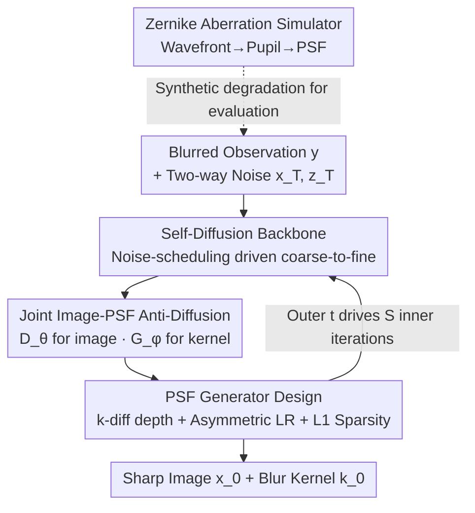

# Self-Diffusion Driven Blind Imaging

**Conference**: CVPR 2026  
**Paper**: [CVF Open Access](https://openaccess.thecvf.com/content/CVPR2026/html/Yang_Self-Diffusion_Driven_Blind_Imaging_CVPR_2026_paper.html)  
**Code**: None  
**Area**: Image Restoration / Blind Deblurring  
**Keywords**: Blind Deconvolution, Self-Diffusion, PSF Estimation, Zero-shot, Optical Aberrations

## TL;DR
DeblurSDI extends "self-diffusion" (a reverse problem solver requiring no pretraining) from non-blind scenarios with known degradation operators to blind scenarios. Using two randomly initialized networks without pretraining, it **simultaneously** reconstructs the sharp image and the Point Spread Function (PSF) during a reverse diffusion process starting from pure noise. The noise scheduling naturally stabilizes the joint optimization, which is typically prone to collapse, significantly outperforming existing blind deblurring methods on optical aberrations and motion blur.

## Background & Motivation

**Background**: Optical imaging systems are inevitably contaminated by optical aberrations and motion blur due to diffraction limits, lens manufacturing tolerances, assembly errors, camera shake, and object motion. Restoration requires either explicit calibration of the Point Spread Function (PSF) for each lens or a blind deconvolution approach—estimating the sharp image $x$ and the unknown kernel $k$ simultaneously from a single degraded image $y$, satisfying the forward model $y = x \circledast k + n$.

**Limitations of Prior Work**: Calibration methods offer high precision but require specialized hardware, multiple captures, and expert knowledge, which is impractical for consumer cameras like smartphones. Blind deconvolution methods suffer from the ill-posed nature of joint optimization: handcrafted priors (sparsity, heavy-tailed gradients, TV) are extremely sensitive to initialization, kernel size, and hyperparameters, often leading to kernel drift or convergence collapse. Implicit neural priors like Deep Image Prior (e.g., SelfDeblur) are flexible but remain unstable and prone to overfitting, especially with large kernels or complex spatial structures. Pretrained diffusion priors (e.g., DPS) are powerful in non-blind scenarios but rely on large-scale pretraining, suffer from domain shifts, and **cannot estimate the kernel**, making them unsuitable for full blind deconvolution.

**Key Challenge**: The most difficult part of blind deconvolution is not image restoration but PSF estimation. When the image and kernel networks are optimized together, the solution space is vast, making it easy to collapse into trivial solutions (Dirac kernels or simply replicating the blurred image). Existing methods either sacrifice adaptability (via calibration/pretraining) or stability (via bare optimization).

**Core Idea**: The authors observed a property of self-diffusion called "noise-regulated spectral bias"—injecting noise according to a schedule forces the network to learn low frequencies first, then gradually refine high frequencies, forming a coarse-to-fine implicit regularization. By applying this implicit regularization **simultaneously** to both the image and PSF estimation paths, the joint optimization is transformed from "prone to collapse" to "stable and reliable" without any external priors or pretraining.

## Method

### Overall Architecture

DeblurSDI is a zero-shot, self-supervised, and pretraining-free blind imaging framework. it reformulates blind image restoration as a **reverse self-diffusion process**: starting from two paths of pure Gaussian noise (one for image estimation $x_T$ and one for PSF estimation $z_T$), it refines them over $T$ outer time steps to output the sharp image and the blur kernel.

The pipeline contains only two learnable components, both **randomly initialized on-the-fly and trained specifically for the given image**: the image denoiser $D_\theta$ (U-Net structure with five-level encoder-decoder + skip connections + deep NonLocal blocks) recovers the sharp image from noisy estimates; the PSF generator $G_\phi$ (Fully Connected Network with a final softmax layer to ensure non-negativity and normalization) generates the blur kernel. Within each outer time step $t$, $S$ inner iterations are performed using the same Adam optimizer to update $\theta$ and $\phi$, fitting the data consistency constraint "current sharp image $\circledast$ current kernel = observed image". After inner convergence, the denoising result is passed to the next time step as the image/kernel estimate, continuing the coarse-to-fine process.

To evaluate with synthetically generated yet physically realistic degradation, the authors also built an **optical aberration simulator** based on Zernike polynomials to synthesize a family of real PSFs (defocus, coma, astigmatism, spherical aberration, etc.) from wavefront distortions.

### Key Designs

**1. Using "Noise-Regulated Spectral Bias" of Self-Diffusion as Implicit Regularization Backbone**

Self-diffusion was originally designed for linear inverse problems $Ax_\text{true}=y$ with a known forward operator $A$. Starting from pure noise, each step adds noise to the current estimate $\hat{x}_t = x_t + \sigma_t \cdot \epsilon_t$, and a randomly initialized self-denoiser $D_\theta$ minimizes the data fidelity loss $L_t(\theta) = \lVert A D_{\theta,t}(\hat{x}_t) - y \rVert_2^2$. The key to its effectiveness is that the noise schedule $\sigma_t$ acts as implicit regularization—during high-noise stages, the network can only capture low-frequency structures, and as $\sigma_t$ decays, it refines high-frequency details. The authors use this to stabilize ill-posed optimization: blind deconvolution fails because the search space is too large; repeatedly injecting noise into intermediate results **expands the search space for inverse solutions** and prevents local collapse. This also explains why the reconstruction curve shows a non-monotonic "rise-fall-rise" pattern.

**2. Dual-Network Coupled Joint Image-PSF Anti-Diffusion**

This is the core adaptation for the blind scenario where both $x_\text{true}$ and $k$ are unknown. The authors utilize two independent randomly initialized networks: $D_\theta$ for $x_\text{true}$ and $G_\phi$ for $k$, each with its own noise schedule. At each step, perturbations are applied to both estimates:

$$\hat{x}_t = x_t + \sigma_t \cdot \epsilon_x, \qquad \hat{z}_t = z_t + \sigma'_t \cdot \epsilon_z,$$

where the image noise schedule is $\sigma_t = \sqrt{1-\bar\alpha_t}$ and the kernel noise schedule is $\sigma'_t = \mu \sigma_t$ ($\mu$ is an adjustable coefficient). Both networks are optimized simultaneously in an inner loop with a joint objective:

$$L_t(\theta,\phi) = \lVert (D_\theta(\hat{x}_t) \circledast G_\phi(\hat{z}_t)) - y \rVert_2^2 + \lambda_k R(G_\phi(\hat{z}_t)),$$

where the first term is data fidelity and the second term $R(\cdot)$ is the L1 norm for PSF sparsity (real motion kernels are sparse). Unlike the bare coupling in SelfDeblur, both estimates here follow coarse-to-fine noise schedules, preventing the PSF from immediately collapsing into trivial Dirac kernels.

**3. Learnable Degradation Design for PSF Generator: Depth + Asymmetric LR + Sparsity**

PSF estimation is the most fragile part of blind imaging, and the authors implemented several specific designs for $G_\phi$. Structurally, it uses an FCN (low kernel dimensionality), with a final softmax layer to enforce non-negativity and a sum of 1, then reshapes it into a 2D kernel. Multiple ReLU layers are stacked to encourage sparsity. Two modes are compared: **Standard**, where the latent variable $z$ is sampled from a normal distribution and **fixed**; and **k-diff (diffusion)**, where $z_t$ evolves with the self-diffusion process and the hidden layers are deepened. Experiments show k-diff is significantly better, and deeper hidden layers improve kernel accuracy, proving that applying noise scheduling and sufficient depth to the kernel generator is key to stabilizing PSF estimation. Optimization uses an **asymmetric learning rate**: $1\times10^{-3}$ for the image denoiser and only 25% ($2.5\times10^{-4}$) for the kernel generator, as small kernel changes are magnified by convolution.

**4. Zernike Polynomial-based Optical Aberration Simulation**

Wavefront distortion is described as a weighted sum of Zernike polynomials $W(\rho,\theta) = \sum_{(n,m)\in\mathcal{A}} a_{n,m} Z_n^m(\rho,\theta)$ (up to order $n=4$, covering defocus, astigmatism, coma, trefoil, spherical, and quadrafoil). The wavefront yields the complex pupil function $P(\rho,\theta) = \mathbb{1}_{\rho\le 1}\exp(\tfrac{2\pi i}{\lambda}W)$, and the PSF is the normalized magnitude squared of the pupil's Fourier transform $h(x,y) = |\mathcal{F}\{P\}|^2 / \max|\mathcal{F}\{P\}|^2$. This simulation provides a quantifiable benchmark for optical aberration restoration.

### Loss & Training
The core objective is data fidelity $\lVert D_\theta(\hat{x}_t)\circledast G_\phi(\hat{z}_t)-y\rVert_2^2$ plus L1 kernel sparsity regularization with weight $\lambda_k=2\times10^{-3}$. A single Adam optimizer updates $\theta, \phi$ jointly over $T=30$ outer steps and $S=200$ inner iterations. The noise variance schedule $\beta$ is linearly interpolated from $1\times10^{-4}$ to $2\times10^{-2}$.

## Key Experimental Results

### Main Results

Optical Aberration Correction (PSNR/SSIM):

| Dataset | Phase-Only | FFT-ReLU | SelfDeblur | FastDiffusionEM | DeblurSDI |
|--------|-----------|----------|------------|-----------------|-----------|
| Levin | 15.52/0.372 | 19.57/0.566 | 18.13/0.471 | 18.68/0.509 | **28.36/0.860** |
| Cho | 22.04/0.827 | 23.07/0.857 | 20.69/0.779 | 15.66/0.477 | **25.60/0.923** |
| Kohler | 27.37/0.789 | 29.89/0.836 | 20.76/0.541 | 19.83/0.524 | **32.07/0.906** |
| FFHQ | 26.31/0.770 | 23.21/0.694 | 19.65/0.559 | 17.90/0.451 | **33.00/0.934** |

Blind Motion Deblurring (PSNR/SSIM):

| Dataset | Phase-Only | FFT-ReLU | SelfDeblur | FastDiffusionEM | DeblurSDI |
|--------|-----------|----------|------------|-----------------|-----------|
| Levin | 20.68/0.606 | 15.56/0.385 | 25.06/0.730 | 16.55/0.401 | **31.85/0.791** |
| Cho | 19.89/0.675 | 18.73/0.655 | 20.37/0.684 | 15.39/0.469 | **28.73/0.886** |
| Kohler | 28.23/0.809 | 25.33/0.714 | 21.97/0.600 | 18.85/0.481 | **29.17/0.765** |
| FFHQ | 25.80/0.790 | 21.71/0.658 | 19.82/0.556 | 15.59/0.359 | **33.90/0.906** |

DeblurSDI leads significantly in almost all categories, outperforming the next best method by 8–10 dB PSNR on Levin/FFHQ. notably, the pretrained FastDiffusionEM performed poorly, showing that even with strong image priors, failing to estimate the kernel leads to collapse.

### Ablation Study

| Configuration | Key Observation |
|------|---------|
| Standard Mode (Fixed kernel $z$) | Lower PSNR/SSIM; PSF generator lacks diffusion scheduling |
| k-diff, $n=1$ | Gain over Standard mode confirms benefit of noise scheduling |
| k-diff, $n=2,3,5$ | Quality improves monotonically with hidden layer depth |
| $T:10\to30$ | Most significant gain observed when increasing outer steps |

### Key Findings
- **Noise scheduling + Depth for PSF is core**: k-diff consistently outperforms the Standard mode. Depth in the kernel generator is crucial for stability.
- **Stability is a major advantage**: DeblurSDI's performance is nearly invariant to kernel sizes (15–33), whereas other methods fluctuate wildly.
- **Robustness**: Maintains high performance (PSNR>28) up to additive noise $\sigma=0.02$.
- The non-monotonic "rise-fall-rise" curve indicates that noise helps escape local minima and expand the solution search space.

## Highlights & Insights
- **Transferring "Spectral Bias" to Blind Scenarios**: The core insight is that self-diffusion's implicit regularization can stabilize both image and kernel estimation. This concept can be reused in other joint-estimation inverse problems (blind SR, blind denoising).
- **Zero-pretraining + Single-image Self-supervision**: Avoids domain shifts of pretrained priors by training on the fly for each specific image.
- **Asymmetric Learning Rate Utility**: Reducing kernel LR to 25% of image LR is a practical trick for coupled optimization where one variable (kernel) is more sensitive.
- **Physical Constraints via Architecture**: Using softmax and L1 sparsity directly encodes PSF physical properties into the structure rather than relying on post-optimization projections.

## Limitations & Future Work
- **High Computational Cost**: Running $T=30 \times S=200$ iterations with two neural networks makes it much slower than one-pass optimization methods.
- **Mainly Synthetic Evaluation**: Performance on real-world captures with spatially-varying PSFs and real sensor noise is not fully validated. ⚠️ Quantitative results for real captures are missing.
- **Noise Floor**: Performance degrades significantly beyond $\sigma=0.03$.
- **Hyperparameter Sensitivity**: While robust to some parameters, values like $T, S, \mu, \lambda_k$ still require empirical tuning.

## Related Work & Insights
- **vs. SelfDeblur (DIP-style Optimization)**: Both are zero-shot, but SelfDeblur uses bare coupled optimization, making it extremely sensitive to kernel initialization; DeblurSDI's noise scheduling provides coarse-to-fine stabilization.
- **vs. FastDiffusionEM (Pretrained Prior)**: FastDiffusionEM relies on priors that cause domain shift and fails at kernel estimation; DeblurSDI outperforms it by ~18 dB on the FFHQ dataset.
- **vs. Model-driven Calibration**: Calibration is more accurate but rigid; DeblurSDI offers a flexible, calibration-free alternative.

## Rating
- Novelty: ⭐⭐⭐⭐ Systematic application of spectral bias to blind PSF estimation.
- Experimental Thoroughness: ⭐⭐⭐⭐ Multi-dataset ablation, but missing real-world quantitative proof.
- Writing Quality: ⭐⭐⭐⭐ Clear physical modeling and derivation.
- Value: ⭐⭐⭐⭐ Strong potential for consumer imaging despite the speed trade-off.

<!-- RELATED:START -->

## Related Papers

- [\[CVPR 2026\] Self-Attention Driven Tensor Representation for High-Order Data Recovery](self-attention_driven_tensor_representation_for_high-order_data_recovery.md)
- [\[CVPR 2026\] LF-BVN: Blind-View Network for Self-Supervised Light Field Denoising](lf-bvn_blind-view_network_for_self-supervised_light_field_denoising.md)
- [\[CVPR 2026\] SGDE: Self-supervised Geometry Degradation Estimation Framework for Coded Aperture Compressive Spectral Imaging](sgde_self-supervised_geometry_degradation_estimation_framework_for_coded_apertur.md)
- [\[CVPR 2026\] TM-BSN: Triangular-Masked Blind-Spot Network for Real-World Self-Supervised Image Denoising](tm-bsn_triangular-masked_blind-spot_network_for_real-world_self-supervised_image.md)
- [\[CVPR 2026\] PNG: Diffusion-Based sRGB Real Noise Generation via Prompt-Driven Noise Representation Learning](diffusion-based_srgb_real_noise_generation_via_prompt-driven_noise_representatio.md)

<!-- RELATED:END -->
