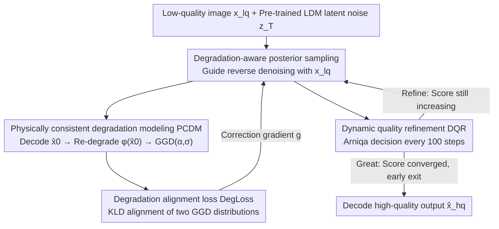

# Self-supervised Dynamic Heterogeneous Degradation Modeling for Unified Zero-Shot Image Restoration

**Conference**: CVPR 2026  
**Paper**: [CVF Open Access](https://openaccess.thecvf.com/content/CVPR2026/html/Hu_Self-supervised_Dynamic_Heterogeneous_Degradation_Modeling_for_Unified_Zero_Shot_Image_Restoration_CVPR_2026_paper.html)  
**Code**: https://github.com/yangjinglyy/UP-ZeroIR  
**Area**: Image Restoration / Diffusion Models  
**Keywords**: Zero-shot Image Restoration, Degradation Modeling, Generalized Gaussian Distribution, Posterior Sampling, Latent Diffusion

## TL;DR
UP-ZeroIR identifies that heterogeneous degradations such as noise, haze, and low-light can be characterized by a two-parameter Generalized Gaussian Distribution (GGD) in latent space. Consequently, degradation modeling is reformulated as a "distribution alignment" problem, integrated with a strategy for self-assessing quality and dynamically adjusting the sampling trajectory. This allows the pre-trained diffusion model to set new SOTA results in both single and mixed degradation restoration under zero-shot settings without retraining.

## Background & Motivation

**Background**: Real-world images are contaminated by various degradations like noise, blur, haze, and low-light during acquisition and transmission. There are three primary routes to handle these: task-specific models (individual physical forward models + paired supervision for each degradation), all-in-one models (shared networks + learned degradation embeddings for unified handling), and zero-shot restoration (leveraging pre-trained diffusion priors by adjusting sampling schedules/guidance signals without task-specific retraining). The zero-shot route is the most flexible as it avoids retraining for each new degradation.

**Limitations of Prior Work**: Existing zero-shot methods treat degradation as a "black-box perturbation," relying on stacked network layers or pre-trained features to implicitly capture degradation characteristics. This introduces three specific problems: (1) **Weak representation**—without explicit physical prompts, the diffusion process must "guess" the degradation during stochastic sampling, leading to insufficient guidance; (2) **High training/sampling costs**—implicit representations force models to use deeper networks and more sampling steps to compensate; (3) **Fixed trajectories prone to collapse**—inference follows a predefined diffusion trajectory, often converging to sub-optimal solutions when encountering complex or mixed degradations.

**Key Challenge**: The physical mechanisms of heterogeneous degradations differ drastically (noise is additive, haze involves transmission attenuation, low-light follows illumination-reflectance decomposition). Existing methods either model each individually (not generalizable) or abandon physical modeling entirely (uncontrollable). The root problem is the **lack of a unified yet physically-grounded degradation representation** that allows all degradations to be incorporated into a single optimizable framework.

**Key Insight**: The authors make a crucial empirical observation—despite different mechanisms, degradations manifest as **systematic distribution shifts** in pixel space: noise causes distribution **dispersion**, haze shifts the distribution toward **higher brightness**, and low-light **compresses the dynamic range**. These similar behaviors suggest a unified parametric representation. Furthermore, when images are encoded into the latent space of an LDM (which suppresses pixel-level redundancy and retains key cues), these degradation distributions consistently exhibit homogeneous forms that can be sufficiently summarized by just two parameters of a GGD: $(\alpha, \sigma)$.

**Core Idea**: Reparameterize heterogeneous degradations as a minimal set of physically self-consistent parameters in latent space (the scale $\sigma$ and shape $\alpha$ of a GGD). This transforms the challenge of "modeling complex degradations" into a directly optimizable "distribution alignment in latent space" problem, utilizing a quality-driven dynamic strategy to correct sampling trajectories and avoid sub-optimal collapse.

## Method

### Overall Architecture

UP-ZeroIR takes a low-quality image $x_{lq}$ as conditional input, leveraging a pre-trained LDM to perform iterative denoising from Gaussian noise $z_T$ in latent space to decode high-quality results. The system operates on the core belief that **degradation should not be a black box, but a homogeneous distribution in latent space that can be aligned and optimized**. Four components collaborate: posterior sampling injects guidance from low-quality observations; PCDM re-degrades the "current estimated clean image" and characterizes it via GGD; DegLoss measures the gap between "re-degraded" and "real input" distributions to drive alignment; and DQR uses no-reference quality assessment to dynamically decide whether to refine or exit during sampling.

### Key Designs

**1. Degradation-aware posterior sampling: Injecting low-quality observations as guidance signals**

In standard LDM reverse processes, the clean latent $\hat{z}_0 = (z_t - \sqrt{1-\bar\alpha_t}\,\epsilon_\theta(z_t,t))/\sqrt{\bar\alpha_t}$ is estimated where the only uncertainty is the predicted noise $\epsilon_\theta$. The trajectory is independent of degradation, leading to "blind guessing." This design introduces $x_{lq}$ to rewrite the posterior with a correction term:

$$q(z_{t-1}\mid z_t, x_{lq}) \propto \mathcal{N}\big(z_{t-1};\ \mu(z_t,\hat z_0) + \delta g,\ \delta\big)$$

The correction $g = \nabla_{z_t}\log p(x_{lq}\mid z_t)$ is a gradient coupling the denoising drift $\mu$ with the observation $x_{lq}$, ensuring the denoising direction aligns with the "current degradation." This likelihood is approximated using the clean estimate as $p(x_{lq}\mid\hat z_0) = \frac{1}{Z}\exp(-[\lambda_1 J(\phi(\hat z_0), x_{lq}) + \lambda_2 Q(\hat z_0)])$, where $J$ measures the distance between the "re-degraded clean estimate" and the real low-quality image, and $Q$ evaluates image quality.

**2. Physically consistent degradation modeling PCDM: Compressing heterogeneous degradations into homogeneous GGD**

The pain point is the lack of unified representation. The authors empirically establish that latent representations of degraded images can be approximated by a General Gaussian Distribution:

$$\mathrm{GGD}(x;\alpha,\sigma^2) = \frac{\alpha}{2\beta\Gamma(1/\alpha)}\exp\Big(-\big|\tfrac{x}{\beta}\big|^\alpha\Big),\quad \beta = \sigma\sqrt{\tfrac{\Gamma(1/\alpha)}{\Gamma(3/\alpha)}}$$

Where $\sigma$ controls scale (dispersion) and $\alpha$ controls shape (tail behavior). These parameters act as "low-dimensional sufficient statistics" capturing the principal components of degradation. Specifically, PCDM decodes the latent $\hat z_0$ into a pixel image $\hat x_0 = D(\hat z_0)$ at each step, embeds GGD parameters $(\alpha_0, \sigma_0)$ via a linear layer $l$, and uses a lightweight convolutional module to re-generate the "degraded" observation:

$$\phi(\hat x_0) = f_3\big(f_2(f_1(\hat x_0)) + l(\alpha_0,\sigma_0)\cdot f_1(\hat x_0)\big)$$

This reformulates "modeling degradation" as "learning a distribution-level equivalent mapping."

**3. Degradation alignment loss DegLoss: Distribution-level supervision via KLD**

DegLoss measures how "similar" the re-degraded image $\phi(\hat x_0)$ is to the input $x_{lq}$. Instead of pixel-wise L1/L2, it maps both to latent representations $z_\phi, z_{lq}$ via the LDM encoder, models them as $\mathrm{GGD}(z_\phi;\alpha_1,\sigma_1^2)$ and $\mathrm{GGD}(z_{lq};\alpha_2,\sigma_2^2)$, and uses the KL Divergence $J_{deg}$ as the alignment target. This provides an explicit, differentiable objective for unified degradation alignment. The final loss $J_{total} = \lambda_1 J_{deg} + \lambda_2 J_{mse} + \lambda_3 J_{pse} + \lambda_4 J_{adv}$ ensures reconstruction fidelity. An image quality term $Q(\hat z_0)$ is also included to constrain luminance and chrominance.

**4. Dynamic quality refinement DQR: Adaptive decision on when to stop or re-perturb**

Fixed step inference often results in sub-optimal convergence. DQR introduces the pre-trained no-reference quality model Arniqa. Every $\Delta t = 100$ steps, it assigns a score $s_j$ to the current restoration $\hat x_0$ and makes an adaptive decision:

$$\text{Decision} = \begin{cases} \text{Great}, & s_j - s_{j-1} < \eta \\ \text{Refine}, & s_j - s_{j-1} \geq \eta \end{cases}$$

If the score difference is below threshold $\eta$, quality has saturated, and the process exits early to save computation. If it is still rising, refinement continues—either by standard diffusion if $t>0$, or by re-injecting noise $z_{t'} = z_t\sqrt{a_t} + \sqrt{1-a_t}\,z_\epsilon$ to restart a posterior sampling round if $t=0$ but quality hasn't converged.

### Loss & Training
The method is zero-shot and requires no task-specific training. Stable Diffusion (1000 steps) is used as the pre-trained prior. PCDM is optimized **online during test-time** using Adam (learning rate $1\times10^{-5}$). Scaling factor $Z=4000$, DQR threshold $\eta=0.01$. Experiments were conducted on a single NVIDIA L20 GPU.

## Key Experimental Results

Evaluations were performed on low-light enhancement, dehazing, and denoising, comparing with zero-shot posterior sampling methods (GDP, TAO, LD-RPS) and supervised/all-in-one methods.

### Main Results

| Task / Dataset | Metric | Ours (UP-ZeroIR) | 2nd Best (LD-RPS) | Gain |
|--------|------|------|----------|------|
| Low-light LOLv1 | PSNR↑ | 18.21 | 17.26 | +0.95 dB |
| Low-light LOLv2 | PSNR↑ | 19.20 | 18.22 | +0.98 dB |
| Dehazing HSTS | PSNR↑ | 21.51 | 20.48 | +1.03 dB |
| Denoising Kodak24 | PSNR↑ | 28.51 | 27.66 | +0.85 dB |

The method significantly outperforms zero-shot baselines across all tasks. SSIM results are also mostly superior (e.g., Kodak24 0.845 vs 0.830). GDP lags significantly in dehazing and denoising due to lack of degradation priors.

### Mixed Degradation

| Configuration | PSNR↑ / SSIM↑ / LPIPS↓ | Description |
|------|---------|------|
| Low-light + Noise (Ours) | 18.00 / 0.812 / 0.271 | Outperforms TAO(17.38) and LD-RPS(16.87) |
| Low-light + Haze + Noise (Ours) | 17.86 / 0.810 / 0.275 | Maintains lead; LD-RPS drops to 16.77 |

Ours shows strong robustness as noise levels increase, benefiting from unified physical distribution modeling.

### Ablation Study

Impact of removing/replacing core components (measured on LOLv1 PSNR):

| Configuration | LOLv1 PSNR↑ | Relative to Full | Description |
|------|---------|------|------|
| Full Version | 18.21 | — | Full model |
| w/o PCDM | 17.78 | −0.43 | Replaced with ResBlock of equal capacity |
| w/o DegLoss | 17.93 | −0.28 | Replaced with pixel-wise L1 |
| w/o DQR | 17.92 | −0.29 | Used fixed 1000-step schedule |

### Key Findings
- **PCDM is the primary contributor**: Replacing it with a standard ResBlock caused the largest drop (−0.43 dB), confirming that "explicit physical priors" are more valuable than simple parameter depth.
- **DegLoss is essential**: Replacing distribution alignment with pixel-level loss dropped performance by 0.28 dB, showing that KLD alignment provides the necessary physical interpretability.
- **DQR prevents collapse**: A fixed schedule performed 0.29 dB worse, verifying the value of quality-driven dynamic search.
- **Visual Convergence**: Denoising visualizations show PSNR rising from 9.46 dB to 30.32 dB as the degradation distribution follows a stable, self-consistent trajectory toward the clean distribution.

## Highlights & Insights
- **Crucial Latent Space Homogeneity Observation**: Reformulating heterogeneous degradations into a two-parameter GGD alignment provides the foundation for unified modeling without task-specific engineering.
- **Self-supervised Loop**: The "re-degrade and align" cycle (PCDM + DegLoss) enables optimization without paired supervision, fitting the zero-shot paradigm perfectly.
- **Controlled Search via DQR**: Turning the diffusion trajectory into an "adaptive search" using NR-IQA as a "judge" saves computation and prevents sub-optimal results.
- **Low-dimensional Statistics**: Using GGD parameters $(\alpha, \sigma)$ is more controllable and interpretable than implicit deep features.

## Limitations & Future Work
- **GGD Assumption Constraints**: While noise/haze/low-light fit well, structured degradations like motion blur or JPEG artifacts may not be fully captured by two-parameter GGD.
- **Test-time Overhead**: PCDM must be optimized online for each image during inference, which, combined with diffusion steps, may result in high latency.
- **Dependence on External IQA**: DQR relies on Arniqa's accuracy; biases in the quality model could propagate to the restoration result.
- **Future Directions**: Exploring mixture distributions for complex degradations and integrating lightweight differentiable quality proxies.

## Related Work & Insights
- **vs. Task-specific Methods**: While specific models are interpretable, they lack generalizability. Ours provides physical grounding at the "latent distribution level" rather than per-task forward models, allowing a single framework to handle all.
- **vs. All-in-one Methods (e.g., PromptIR)**: All-in-one methods use implicit embeddings and deep networks. Ours uses explicit GGD parameters, offering better interpretability and scalability.
- **vs. Prior Zero-shot Methods (GDP/TAO/LD-RPS)**: These treat degradation as a black box. Ours leads LD-RPS by approx. 0.85–1.03 dB PSNR by introducing explicit physical likelihood gradients and dynamic trajectory adjustments.

## Rating
- Novelty: ⭐⭐⭐⭐⭐ (First to leverage latent GGD homogeneity for zero-shot physical alignment)
- Experimental Thoroughness: ⭐⭐⭐⭐ (Solid across multiple tasks/mixed degradations; lacks detailed inference speed comparisons)
- Writing Quality: ⭐⭐⭐⭐ (Clear logic from observations to design; formula-dense)
- Value: ⭐⭐⭐⭐ (Highly practical for real-world zero-shot deployment)

<!-- RELATED:START -->

## Related Papers

- [\[CVPR 2026\] DVAR: Dynamic Visual Autoregressive Modeling for Image Super-Resolution](dvar_dynamic_visual_autoregressive_modeling_for_image_super-resolution.md)
- [\[CVPR 2026\] ZeroIDIR: Zero-Reference Illumination Degradation Image Restoration with Perturbed Consistency Diffusion Models](zeroidir_zero-reference_illumination_degradation_image_restoration_with_perturbe.md)
- [\[CVPR 2026\] Zero-Shot Image Denoising via Hybrid Prior-Guided Pseudo Sample Generation](zero-shot_image_denoising_via_hybrid_prior-guided_pseudo_sample_generation.md)
- [\[CVPR 2026\] MR. Illuminate: Zero-Shot Low-Light Image Enhancement with Diffusion Prior](mr_illuminate_zero-shot_low-light_image_enhancement_with_diffusion_prior.md)
- [\[CVPR 2026\] Dynamic Exposure Burst Image Restoration](dynamic_exposure_burst_image_restoration.md)

<!-- RELATED:END -->
