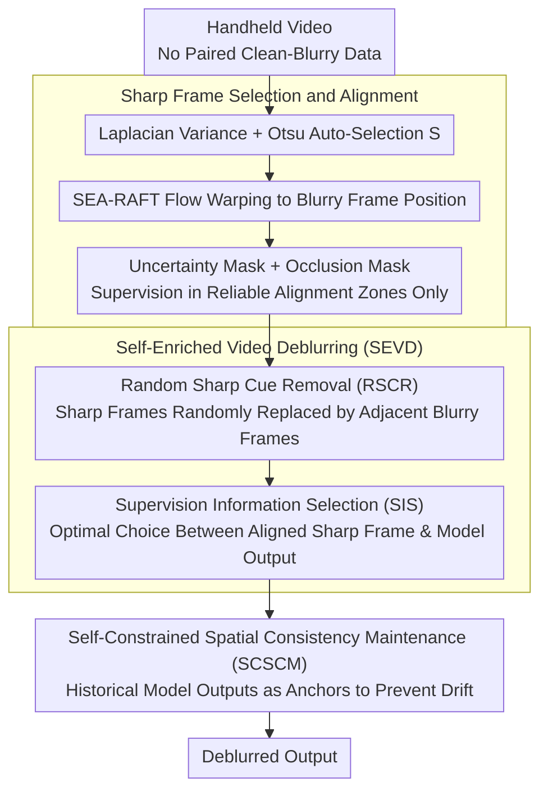

# SelfHVD: Self-Supervised Handheld Video Deblurring

**Conference**: CVPR 2026  
**arXiv**: [2508.08605](https://arxiv.org/abs/2508.08605)  
**Code**: [https://cshonglei.github.io/SelfHVD](https://cshonglei.github.io/SelfHVD)  
**Area**: Image Restoration  
**Keywords**: Video deblurring, self-supervised learning, handheld devices, OIS, self-augmented training

## TL;DR
SelfHVD utilizes naturally existing sharp frames in handheld videos as supervisory signals. Through Self-Enriched Video Deblurring (SEVD) for constructing high-quality training pairs and Self-Constrained Spatial Consistency Maintenance (SCSCM) to prevent displacement shifts, it achieves handheld video deblurring without paired data.

## Background & Motivation
1. **Background**: Learning-based video deblurring methods have made significant progress in network design, but pre-trained models are typically effective only for blurry data similar to the training samples.
2. **Limitations of Prior Work**: Handheld video blur is affected not only by camera shake but also by OIS correction. Its blur distribution differs significantly from existing training datasets (e.g., GoPro, BSD), leading to poor performance of existing models.
3. **Key Challenge**: Collecting paired handheld video deblurring datasets is expensive and complex, whereas directly using synthetic blurry data involves a domain gap.
4. **Goal**: To learn a deblurring model in a self-supervised manner by utilizing the naturally existing sharp frames in handheld videos, avoiding the need for paired data.
5. **Key Insight**: When the recording device's motion trajectory is simple (e.g., linear) and the speed is slow, OIS can function correctly, producing sharp frames. These sharp frames can provide deblurring cues and supervision for adjacent blurry frames.
6. **Core Idea**: Sharp frames $\rightarrow$ alignment supervision $\rightarrow$ SEVD self-augmentation surpassing the sharp frame upper limit $\rightarrow$ SCSCM preventing spatial drift.

## Method

### Overall Architecture
SelfHVD aims to restore blurry frames without any paired clean-blurry data, relying solely on the handheld video itself. It is based on the overlooked fact that OIS functions properly when camera motion is simple and slow, naturally producing some sharp frames within the video. The entire pipeline follows a three-step process: first, these naturally sharp frames are selected and aligned to adjacent blurry frames to serve as supervision; then, the model's own deblurring capability is used to create training pairs that are better than the original sharp frames, allowing the model to surpass the "perfect reproduction of sharp frames" ceiling; finally, historical models constrain the output to block spatial drift caused by the long-term accumulation of alignment errors.

### Key Designs

**1. Sharp Frame Selection and Alignment: Mining "Natural Supervision" from Handheld Video**

The first step of self-supervision is finding credible sharp frames and aligning them precisely—errors in selection or alignment will contaminate all subsequent self-training. SelfHVD uses the variance of the image Laplacian $v_l(\mathbf{I})$ to measure sharpness (sharper textures yield higher variance) and employs Otsu’s method for automatic thresholding to eliminate manual tuning. Simultaneously, the video is segmented into 20-frame blocks to force a uniform temporal distribution of sharp frames, preventing dependency on specific segments. Once sharp frames $\mathbf{S}$ are selected, SEA-RAFT optical flow warps them to the target blurry frame $\mathbf{B}_i$ position to obtain $\mathbf{S}_{j\to i}$. This is paired with two masks—an uncertainty mask $\mathbf{M}_{uncer}$ to filter pixels with low flow confidence and an occlusion mask $\mathbf{M}_{occ}$ to filter foreground/background occlusion areas—ensuring supervision is applied only where alignment is reliable. This process achieves a frame selection accuracy of 96.77% on GoProShake and 91.88% on HVD, demonstrating that "naturally sharp frames" are a cheap and reliable source of supervision.

**2. Self-Enriched Video Deblurring (SEVD): Breaking the "Sharp Frame Limit" Ceiling**

Using sharp frames directly as supervision has a fatal flaw: the model can only learn to be as good as those frames, yet sharp frames in handheld videos are often not sharp enough and lack object motion blur coverage. SEVD allows the model to surpass itself by creating harder training pairs using its own outputs, divided into two steps: Random Sharp Cue Removal (RSCR) randomly replaces input sharp frames with adjacent blurry frames to create a degraded video $\tilde{\mathbf{B}}$ with fewer cues, forcing the model to restore from sparser information; Supervision Information Selection (SIS) then chooses the better option between two candidates—the aligned sharp frame $\mathbf{S}_{j\to i}$ and the deblurring output of the original complete video $\mathcal{D}(\mathbf{B})_k$—to serve as supervision for $\tilde{\mathbf{B}}$. When the aligned sharp frame is not excessively distorted by warping and is indeed sharper, it is used; otherwise, the model uses its own deblurring result (with a stop gradient to prevent noise reinforcement). Because the supervisory upper bound is no longer a single frame but the "best result the model can currently produce," the model can exceed the quality of the sharpest input frame and handle object motion blur using cross-frame cues.

**3. Self-Constrained Spatial Consistency Maintenance (SCSCM): Blocking Spatial Drift from Alignment Errors**

Optical flow alignment can never be pixel-perfect, and these tiny deviations accumulate over long-term self-training, causing the output to shift relative to the input, making the content "drift." Based on information bottleneck theory, the authors observed that models maintain spatial consistency between input and output well in early training stages; drift only manifests later. SCSCM freezes the output of historical model parameters $\Theta_{\mathcal{D}_e}$ from the $e$-th iteration as an auxiliary anchor, constraining the current output to align with it:

$$\mathcal{L}_{scscm} = \|\tilde{\mathbf{R}}_i - sg(\mathbf{R}_k^e)\|_1$$

where $sg(\cdot)$ denotes the stop gradient. This effectively uses the "earlier self that hasn't drifted" as a regularization term to pull back the "drifting present self," requiring no additional annotation and specifically targeting the failure mode unique to self-training.

### Loss & Training
The total loss consists of three $L_1$ terms: the mask-weighted reconstruction loss $\mathcal{L}_{rec}$ (supervising sharp frames in reliable areas), the SEVD conditional selection loss $\mathcal{L}_{sevd}$ (supervising with the better path chosen by SIS), and the historical model constraint $\mathcal{L}_{scscm}$ (maintaining spatial consistency). Together, these form an end-to-end trainable objective for the "select sharp frames—self-enrich—prevent drift" closed loop.

## Key Experimental Results

### Main Results

| Dataset | Metric | SelfHVD | Ren et al. | DaDeblur | Gain |
| :--- | :--- | :--- | :--- | :--- | :--- |
| GoProShake | PSNR | **Best** | Second | - | Significant |
| HVD (Real) | Visual Quality | **Best** | - | Second | Visibly Sharper |

### Ablation Study

| Configuration | Key Metrics | Note |
| :--- | :--- | :--- |
| Full SelfHVD | **Best** | Complete Model |
| Sharp-only Supervision | Baseline | Limit restricted by sharp frame quality |
| + SEVD | Significant Gain | Self-enrichment breaks the limit |
| + SCSCM | Further Gain | Prevents spatial drift |
| Uncertainty + Occlusion Mask | Better than No Mask | Excludes misaligned regions |

### Key Findings
- SEVD enables the model to surpass the quality of the sharpest frames in the input video, which is the most critical contribution.
- SCSCM is particularly important in the later stages of training; without it, the model gradually exhibits spatial drift.
- The method shows some capability in repairing object motion blur because SEVD utilizes sharp information across frames.

## Highlights & Insights
- **Closed-loop self-supervised design** is highly ingenious: sharp frame $\rightarrow$ model $\rightarrow$ better supervision $\rightarrow$ better model.
- **Practical application of information bottleneck theory**: SCSCM was designed using observations of early-stage spatial consistency, guiding practice with theory.
- The method is agnostic to the deblurring network architecture and can be adapted to various backbones.

## Limitations & Future Work
- Relies on the existence of sufficient sharp frames in the video; not applicable to videos that are severely blurred throughout.
- The accuracy of optical flow models remains a bottleneck; alignment in complex motion scenes may be inaccurate.
- Future work could explore integration with diffusion model-based deblurring methods.

## Related Work & Insights
- **vs. Ren et al.**: Uses randomly generated blur kernels to blur sharp frames for training pairs, but synthetic blur still differs from real blur. This work directly utilizes real sharp frames and a self-enrichment strategy closer to the real distribution.
- **vs. DaDeblur**: Uses diffusion models to blur sharp images, but the generated blur is still not authentic.

## Rating
- Novelty: ⭐⭐⭐⭐⭐ SEVD self-augmented training and SCSCM spatial consistency are innovative contributions.
- Experimental Thoroughness: ⭐⭐⭐⭐ Validated on synthetic and real datasets with complete ablations.
- Writing Quality: ⭐⭐⭐⭐ Clear motivation and complete logical chain.
- Value: ⭐⭐⭐⭐ Solves practical pain points in handheld video deblurring.

<!-- RELATED:START -->

## Related Papers

- [\[CVPR 2026\] Gyro-based Deep Video Deblurring](gyro-based_deep_video_deblurring.md)
- [\[CVPR 2026\] LF-BVN: Blind-View Network for Self-Supervised Light Field Denoising](lf-bvn_blind-view_network_for_self-supervised_light_field_denoising.md)
- [\[CVPR 2026\] Next-Scale Prediction: A Self-Supervised Approach for Real-World Image Denoising](next-scale_prediction_a_self-supervised_approach_for_real-world_image_denoising.md)
- [\[CVPR 2026\] Self-supervised Dynamic Heterogeneous Degradation Modeling for Unified Zero-Shot Image Restoration](self-supervised_dynamic_heterogeneous_degradation_modeling_for_unified_zero-shot.md)
- [\[CVPR 2026\] SGDE: Self-supervised Geometry Degradation Estimation Framework for Coded Aperture Compressive Spectral Imaging](sgde_self-supervised_geometry_degradation_estimation_framework_for_coded_apertur.md)

<!-- RELATED:END -->
