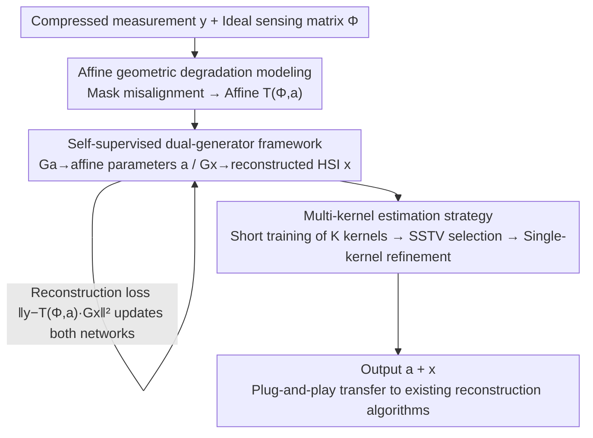

# SGDE: Self-supervised Geometry Degradation Estimation Framework for Coded Aperture Compressive Spectral Imaging

**Conference**: CVPR 2026  
**Paper**: [CVF Open Access](https://openaccess.thecvf.com/content/CVPR2026/html/He_SGDE_Self-supervised_Geometry_Degradation_Estimation_Framework_for_Coded_Aperture_Compressive_CVPR_2026_paper.html)  
**Code**: https://github.com/heyuqiao/SGDE  
**Area**: Image Restoration / Computational Spectral Imaging  
**Keywords**: Coded Aperture Compressive Spectral Imaging, CASSI, mask misalignment, self-supervised degradation estimation, affine transform

## TL;DR
To address the issue where slight misalignments of the mask in Coded Aperture Compressive Spectral Imaging (CASSI) severely degrade reconstruction quality, this work explicitly models mask misalignment as an affine transform embedded into the imaging model. Using a self-supervised "dual-generator + multi-kernel estimation" framework, it simultaneously estimates the affine parameters and reconstructs high-spectral images (HSIs) without requiring any reference targets or device-specific training data. This enables the reconstruction to stably maintain PSNR > 35 dB under perturbations such as 1-pixel shift and 0.4° rotation, and the estimated affine parameters can be transferred to existing reconstruction algorithms in a plug-and-play manner.

## Background & Motivation

**Background**: Hyperspectral imaging captures spatial and spectral information simultaneously across dozens to hundreds of bands. However, traditional scan-by-scan systems suffer from slow acquisition speed and struggle with dynamic scenes. CASSI (Coded Aperture Snapshot Spectral Imaging) uses a coded aperture (mask) to perform spatial modulation on the hyperspectral data cube, disperses it via a prism, and captures a 2D compressed measurement in a single exposure on a grayscale detector. Reconstruction algorithms (such as model-based methods, DIP, end-to-end networks, and deep unfolding networks DUN) are then used to recover the hyperspectral image (HSI) from the measurement.

**Limitations of Prior Work**: CASSI tightly couples "physical coding" with "computational decoding"—the mask directly determines the sensing matrix $\Phi$. If the hardware undergoes even sub-pixel level misalignment (due to thermal expansion/contraction or mechanical vibration), the code-decode correspondence is disrupted, immediately introducing severe artifacts into the reconstruction. Fig. 3 of the paper shows real-world tests where a 1-pixel mask translation causes a massive drop in PSNR. Existing countermeasures have critical flaws: ① most reconstruction algorithms assume ideal imaging conditions, ignoring physical system defects; ② offline calibration methods (using monochromators, reference targets for optical modeling) achieve high accuracy but depend on specialized equipment and complex pipelines, failing to adapt to dynamic perturbations in real-time; ③ learning-based degradation estimation methods are supervised, exhibiting poor generalization across different devices, and struggle to accurately characterize physical misalignments like mask displacement.

**Key Challenge**: CASSI is highly sensitive to mask misalignment, while real-world perturbations are dynamic, device-specific, and cannot be pre-collected to cover all scenarios. This creates a fundamental conflict with supervised learning (which requires device-specific training data) and offline calibration (which requires a static, controlled environment).

**Goal**: To dynamically and adaptively estimate geometric degradation of the mask online and compensate for it during reconstruction without relying on reference targets or device-specific training data.

**Key Insight**: The authors observe that the dominant components of mask misalignment are low-order geometric deformations—in-plane translations, rotations, and scaling caused by defocus along the optical axis. These can be unified under an **affine transform**, which offers strong physical interpretability. Moreover, degradation estimation is highly analogous to "blind image restoration" (simultaneously estimating latent images and degradation kernels), meaning it can leverage the self-supervised DIP paradigm for joint optimization.

**Core Idea**: Explicitly model mask misalignment as an affine transform embedded in the imaging model. Two generator networks (one for HSI, another for affine parameters) are utilized to perform self-supervised joint optimization directly on the measurement, combined with a "multi-kernel estimation" strategy to bypass the narrow range of estimation caused by CASSI's sensitivity.

## Method

### Overall Architecture

The goal of SGDE is: given only a compressed measurement $y$ and the ideal sensing matrix $\Phi$, **simultaneously** reconstruct the hyperspectral image $x$ and estimate the affine parameters $a$ of the mask misalignment without ground truth or reference targets.

This is formulated as a maximum a posteriori (MAP) estimation problem:

$$\hat{x},\hat{a}=\arg\min_{x,a}\;\|y-\mathcal{T}(\Phi,a)\cdot x\|_2^2+\mathcal{R}(x)+\mathcal{K}(a)$$

where $\mathcal{T}(\Phi,a)$ is the degraded sensing matrix derived from the "affinely warped mask", and $\mathcal{R},\mathcal{K}$ are regularizations on the HSI and affine parameters. To avoid introducing overly strong priors that might bias the degradation estimation, the authors adopt the Deep Image Prior (DIP) paradigm: representing $x$ and $a$ implicitly using two generator networks, which are optimized directly on the measurement:

$$\min_{\mathcal{G}_x,\mathcal{G}_a}\;\big\|y-\mathcal{T}(\Phi,\mathcal{G}_a(z_a))\cdot\mathcal{G}_x(z_x)\big\|_2^2$$

The overall pipeline is an optimization loop with a feedback cycle: the upper branch's affine generator $\mathcal{G}_a$ estimates the affine parameters to compensate for mask misalignment, while the lower branch's HSI generator $\mathcal{G}_x$ reconstructs the spectral image. Both feed into the forward degradation imaging model to compute the reconstruction loss against the real measurement $y$. Backpropagation of gradients jointly updates both networks. An outer multi-kernel strategy is wrapped around this to expand the range of estimated perturbations.

### Key Designs

**1. Affine Geometric Degradation Modeling: Turning Mask Misalignment into a Differentiable, Physically Interpretable Degradation Operator**

The pain point is straightforward: the mask $M$ directly defines the sensing matrix $\Phi$, and sub-pixel misalignment is enough to disrupt the coding-decoding correspondence, but "misalignment" itself is an abstract physical phenomenon. A mathematical expression that can be embedded into the imaging model and optimized via derivatives is required. The authors capture the primary components of mask misalignment as low-order geometric deformations—in-plane translations/rotations (shifting pixel coordinates) and scaling due to movement along the optical axis (caused by non-parallel light paths). They map pixel $(i,j)$ on the ideal mask to position $(i',j')$ on the degraded mask using an affine transform:

$$\begin{bmatrix} i' \\ j' \\ 1 \end{bmatrix}=\begin{bmatrix} a_{11} & a_{12} & t_x \\ a_{21} & a_{22} & t_y \\ 0 & 0 & 1 \end{bmatrix}\begin{bmatrix} i \\ j \\ 1 \end{bmatrix}$$

Using only six parameters $a=[a_{11},a_{12},a_{21},a_{22},t_x,t_y]$, rotation, scaling, and translation are encoded. Non-integer coordinates are handled using bilinear interpolation, and out-of-bound values are set to zero. Substituting the warped mask $M'$ into the imaging process yields the degradation model $y=\mathcal{T}(\Phi,a)\cdot x+n$. The benefit of this formulation is that the degradation is compressed into an extremely low-dimensional, physically meaningful, and differentiable parameter space, enabling gradient-based optimization to directly estimate the misalignment. The authors clarify that this is a **complement** to offline calibration: offline calibration remains responsible for removing large-scale static offsets, while the affine parameterization targets dynamic, sub-pixel misalignments. The paper focuses on geometric perturbations of the mask rather than the prism, as the prism primarily inflicts wavelength dispersion where adjacent bands remain highly correlated, making prism shift relatively less critical.

**2. Self-Supervised Dual-Generator Framework: Utilizing DIP to Jointly Estimate Degradation and Reconstruct Images on a Single Measurement, Entirely Eliminating the Need for Training Data**

The core pain point is that supervised degradation estimation requires device-specific training data, generalizes poorly across devices, and offline calibration requires reference targets. The authors represent $x$ and $a$ implicitly using two networks and optimize them in a self-supervised manner solely based on reconstruction loss. The HSI generator $\mathcal{G}_x$ requires high representation capability to capture complex spatial-spectral details, using LCTC as its backbone (a U-Net style structure combined with a Convolutional Threshold Sparsifying Coding CTSC module, employing a convolutional dictionary and soft threshold operators to promote spectral sparsity while balancing spatial details and spectral smoothness). The affine generator $\mathcal{G}_a$ is a lightweight MLP with a single hidden layer and tanh activation. The latent variables $z_x,z_a$ for both are sampled from a uniform distribution.

The key trick lies in constraining the output of $\mathcal{G}_a$ within a tight predefined range. As shown in Fig. 3, even a 1-pixel shift can yield massive reconstruction errors and unstable optimization; without constraints, the output of the tanh activation would cause the affine parameters to fluctuate excessively. Compared to supervised alternatives, this self-supervised design brings two direct benefits: ① no device-specific training data is required, allowing for natural cross-device generalization; ② no expensive simulation data augmentation is needed for mask degradation. These advantages permit SGDE to serve as a plug-and-play degradation estimation tool.

**3. Multi-Kernel Estimation Strategy: Bypassing Broad Sensitivity Ranges and Non-Differentiable SSTV Obstacles via SSTV Kernel Selection**

The pain point is that CASSI is too sensitive, rendering the effective degradation estimation range of a single network (kernel) narrow, while physical misalignment from vibrations/thermal drift often exceeds this range. A natural idea would be to use SSTV (Spectral-Spatial Total Variation) to quantify the severity of the misalignment—the greater the misalignment, the higher the SSTV of the reconstructed HSI. However, SSTV has a critical flaw: while affine parameters act on the mask, SSTV is computed on the reconstructed HSI; **there is no differentiable path between the two**. Consequently, SSTV cannot be used directly as a loss function to backpropagate gradients and update the HSI generator.

The authors' solution is to formulate this as a "selection" rather than an "optimization" problem (Algorithm 1): initialize $K$ kernels (networks) with their initial affine parameters distributed across different regions of the parameter space. Each kernel is first briefly trained for $T_s$ steps using the reconstruction loss (it is observed in practice that the affine generator converges faster than the HSI generator). Then, the SSTV of each reconstructed HSI is computed, and the kernel with the smallest SSTV is selected: $i^*=\arg\min_i \text{SSTV}_i$. This kernel's parameters are used to initialize a second-phase, single-kernel refinement, which is trained for $T_\ell$ steps to yield the final $a,x$. This two-stage design safely expands the range of exploitable degradation estimation under controllable computational overhead. It circumvents the non-differentiability of SSTV and the narrow estimation range of a single kernel by utilizing "multi-point initialization + discrete selection based on non-differentiable metrics". The paper implements two variants: SK-LCTC (single-kernel, estimating within an empirically determined range of $\pm2$ pixels, $\pm0.8^\circ$ rotation, and $\pm0.008$ scaling) and MK-LCTC (8 kernels, initialized at different parameter offsets, selecting the optimal kernel after 1000 iterations for refinement).

### Loss & Training
The training target features only a single self-supervised data fidelity loss $\|y-\mathcal{T}(\Phi,\mathcal{G}_a(z_a))\cdot\mathcal{G}_x(z_x)\|_2^2$ without introducing extra reconstruction priors (in the DIP paradigm, the network structure itself acts as an implicit prior). Implementation: i7-12900K + a single A6000 GPU; the learning rate is fixed at $1\times10^{-3}$ and trained for 6000 iterations. MK-LCTC uses 8 kernels, with short-term training of 1000 iterations for each before choosing the best via SSTV. Each LCTC requires only about 2 GB of VRAM, and multiple kernels can run in parallel to minimize overhead. ⚠️ Note on transition timing (multi-kernel to single-kernel): adjusting based on perturbation magnitude—large misalignments (0.5-pixel shift) can be distinguished within ~500 iterations, whereas small offsets (0.1-pixel) are distinguishable before ~1500 iterations, subject to the original text.

## Key Experimental Results

### Main Results
**Simulation**: 10 scenes selected from the KAIST dataset and cropped to $256\times256\times28$. Managed perturbations (translation/pixels, rotation/degrees, scaling/ratio) are applied to the mask. Evaluation is conducted using PSNR / SSIM, compared against model-based GAP-TV, supervised end-to-end GST, supervised deep unfolding RDLUF/DERNN/MIDET, and self-supervised DDIP/LCTC. The table below extracts representative perturbation groups (average PSNR in dB across KAIST-Scene 01-10):

| Method | Type | No Perturbation | Shift 1.0 | Rotation 0.4° | Combo (0.5, 0.2, 0.002) | Time (s) |
|------|------|--------|----------|-----------|----------------------|---------|
| GAP-TV | Model-based | 30.11 | 18.37 | 21.83 | 21.80 | 38.60 |
| GST | End-to-End (Supervised) | 33.32 | 33.21 | 30.54 | 30.50 | 0.66 |
| RDLUF | Deep Unfolding (Supervised) | 39.21 | 23.25 | 25.60 | 26.61 | 2.59 |
| DERNN | Deep Unfolding (Supervised) | 39.41 | 22.56 | 25.33 | 25.99 | 6.50 |
| MIDET | Deep Unfolding (Supervised) | 39.09 | 23.27 | 25.23 | 25.98 | 2.19 |
| DDIP | DIP (Self-supervised) | 37.33 | 15.33 | 19.83 | 19.65 | 1238.25 |
| LCTC | DIP (Self-supervised) | 38.51 | 18.37 | 21.15 | 21.46 | 411.98 |
| **SK-LCTC** | DIP (Self-supervised) | 38.64 | 38.33 | 27.95 | 36.15 | 415.54 |
| **MK-LCTC** | DIP (Self-supervised) | **38.39** | **38.15** | **35.41** | **36.04** | 531.24 |

Key readings: DIP-based baselines (DDIP, LCTC) drop more than 16 dB under a 1-pixel translation (LCTC from 38.51 to 18.37, DDIP from 37.33 to 15.33). Deep unfolding networks perform slightly better but still degrade severely, revealing that their learned degradation models cannot generalize to mask misalignments. GST remains relatively stable due to supervised training, but its baseline is inherently lower (around 31-33 dB). SK-LCTC handles most perturbations well but drops about 10 dB under a 0.4° rotation (38.64 to 27.95). MK-LCTC consistently maintains a PSNR > 35 dB across all perturbations. In terms of overhead, SK-LCTC takes about 415s for 6000 iterations, but the affine parameters usually converge within the first few hundred iterations (~41s) and can be directly migrated to existing reconstruction methods, adding negligible computational overhead to the main reconstruction flow.

**Real-World Data**: Validated on the TSA dataset (5 real scenes, 660×714, 450–650 nm, 28 reconstructed bands) and a self-built SD-CASSI system (512×542, 520–710 nm, 16 reconstructed bands). Even without artificial perturbations, both variants reconstruct sharper spatial details than the LCTC baseline. Transferring the affine parameters estimated from TSA-Scene 01 directly to LCTC/DDIP/RDLUF/MIDET/DERNN consistently suppresses artifacts and improves quality, proving that actual TSA data contains non-negligible mask misalignments.

### Ablation Study
**Number of kernels + Initialization locations** (Fixed perturbation of 1-pixel shift / 0.004 scaling / 0.4° rotation, KAIST-Scene 01):

| Number of Kernels | Forward PSNR | Forward SSIM | Reverse PSNR | Reverse SSIM |
|--------|--------------|--------------|--------------|--------------|
| 1 | 25.50 | 0.648 | 36.30 | 0.941 |
| 2 | 26.15 | 0.650 | 35.73 | 0.935 |
| 7 | 28.62 | 0.767 | 36.23 | 0.937 |
| 8 | 36.13 | 0.938 | 36.21 | 0.936 |

Forward (sequentially adding kernels, with only the last kernel initialized near the perturbation area) requires 8 kernels to succeed. Reverse (starting directly near the perturbation area) performs exceptionally well with just a single kernel.

### Key Findings
- **Degradation estimation performance is primarily determined by the initialization locations of the kernels, rather than the total number of kernels**: The strong contrast between Forward and Reverse shown in the table above indicates that if the perturbation range and type are roughly known, a small number of kernels is sufficient; the value of adding more kernels lies in extending coverage to the correct region.
- **The range of a single-kernel is naturally constrained by the minimum coding unit of the mask**: Table 2 shows that a single kernel reliably estimates small misalignments but fails abruptly once the perturbation exceeds its effective range (e.g., a 1-pixel coding unit can at most correct a 1-pixel shift). This is the root cause necessitating the multi-kernel strategy.
- **MK-LCTC is the cornerstone of robustness**: It is the only variant that consistently maintains PSNR > 35 dB across all perturbation combinations in the main table, whereas SK-LCTC degrades under large rotations.
- **Controllable degradation estimation overhead**: Affine parameter convergence is much faster than HSI reconstruction (~41 s vs. 415 s) and is readily transferable in a plug-and-play fashion. Although multi-kernel execution increases runtime linearly with the number of kernels, each kernel requires only ~2 GB of memory and can be parallelized.

## Highlights & Insights
- **Transforming a "non-differentiable metric" into a "discrete selection" is the most brilliant mechanism in this work**: While SSTV can reliably gauge misalignment, it cannot backpropagate gradients. Rather than forcing a differentiable proxy, the authors resolve this by running short-term multi-kernel training followed by SSTV selection, turning optimization into a discrete choice. This paradigm of "using metrics for selection instead of losses" is highly transferable to other self-supervised tasks with non-differentiable evaluation signals.
- **The combination of 6-parameter affine and DIP self-supervision directly solves the pain points**: Reducing the degradation to an extremely low-dimensional and physically interpretable space allows the self-supervised DIP to function without any external data, ensuring cross-device, plug-and-play capability. The estimated affine parameters can be directly injected into existing reconstruction algorithms (LCTC/DDIP/RDLUF/MIDET/DERNN) to boost quality, offering high practical value.
- **"Initialization location > Number of kernels" is a counter-intuitive but useful piece of empirical advice**: It suggests that in these sensitive inverse problems, placing the search starting point correctly a priori is far more cost-effective than blindly scaling up computing power.

## Limitations & Future Work
- **Author Acknowledgement**: Future work can explore more efficient optimization strategies or more precise degradation models—implying that room for improvement remains in the current two-stage optimization and affine approximations.
- **Affine transformation is only a low-order approximation**: Real optical degradation includes non-affine components like distortion, aberration, and prism effects. The paper explicitly focuses on low-order geometric deformation of the mask, delegating large-scale static offsets to offline calibration, limiting its coverage of high-order or non-geometric degradation.
- **Heavy computational overhead**: Self-supervised DIP requires optimizing from scratch for thousands of iterations for every single measurement (~415s for SK, ~531s for MK). Compared to supervised methods (GST 0.66s, RDLUF 2.59s), real-time performance is poor, making it more suitable for offline/semi-online calibration rather than high-frame-rate scenarios.
- **Multi-kernel requires a rough estimate of the perturbation range**: Ablation shows that performance is highly dependent on initialization locations falling in the correct regions. If the perturbation type and range are completely unknown, more kernels or denser coverage might be needed, scaling up the computational cost.
- **Lack of ground truth for real-world data limits validation to qualitative comparison**: Without GT spectra for real-world scenes, only qualitative visual comparisons can be made using reconstructed RGB projections, making it difficult to quantitatively prove absolute precision.

## Related Work & Insights
- **vs. Offline Calibration (Arguello / Song / Gualdrón-Hurtado / Lei OCOD / Paillet et al.)**: These methods employ precise optical modeling + monochromators/reference targets for offline calibration, achieving high static accuracy but failing to adapt to dynamic perturbations. SGDE acts as an online self-supervised estimator, serving as a dynamic complement to offline calibration rather than a replacement.
- **vs. Supervised Degradation Estimation (GST / D2PL-Net / RDLUF / DADF-Net et al.)**: These approaches learn degradation matrices/parameters under supervised settings, but are limited by device-specific training data and exhibit poor generalization across systems. SGDE is fully self-supervised and requires no training data, generalizing naturally across devices.
- **vs. Blind Image Restoration (SelfDeblur / Noise-Adaptive Multi-Kernel / Unsupervised Self-Augmentation et al.)**: Both CASSI degradation estimation and blind restoration jointly estimate the latent image and the degradation kernel. The authors borrow the self-supervised and multi-kernel concepts from the latter. The key distinction is that CASSI's degradation acts on the physical mask and is extremely sensitive to misalignment, which is addressed here by introducing affine physical modeling and SSTV-based kernel selection.

## Rating
- Novelty: ⭐⭐⭐⭐⭐ First self-supervised affine degradation estimation framework targeting CASSI mask misalignment, featuring an elegant SSTV multi-kernel selection design.
- Experimental Thoroughness: ⭐⭐⭐⭐ Complete simulation evaluation over a diverse perturbation grid alongside ablation study, and validation on real-built systems, though real-world scenes are limited to qualitative results.
- Writing Quality: ⭐⭐⭐⭐ The logic flow from motivation, modeling, to methodology is clear and well-diagrammed; some perturbation tables are slightly dense.
- Value: ⭐⭐⭐⭐⭐ Highly practical for real-world CASSI deployments due to being plug-and-play, device-agnostic, and requiring no training data.

<!-- RELATED:START -->

## Related Papers

- [\[CVPR 2026\] LRDUN: A Low-Rank Deep Unfolding Network for Efficient Spectral Compressive Imaging](lrdun_a_low-rank_deep_unfolding_network_for_efficient_spectral_compressive_imagi.md)
- [\[CVPR 2026\] Self-supervised Dynamic Heterogeneous Degradation Modeling for Unified Zero-Shot Image Restoration](self-supervised_dynamic_heterogeneous_degradation_modeling_for_unified_zero-shot.md)
- [\[ICML 2026\] Phy-CoSF: Physics-Guided Continuous Spectral Fields Reconstruction and Super-Resolution for Snapshot Compressive Imaging](../../ICML2026/image_restoration/phy-cosf_physics-guided_continuous_spectral_fields_reconstruction_and_super-reso.md)
- [\[CVPR 2026\] Self-Diffusion Driven Blind Imaging](self-diffusion_driven_blind_imaging.md)
- [\[CVPR 2026\] Convexity-Aware Noise Calibration: A Self-Supervised Framework for Noise-Level-Unknown Image Denoising](convexity-aware_noise_calibration_a_self-supervised_framework_for_noise-level-un.md)

<!-- RELATED:END -->
