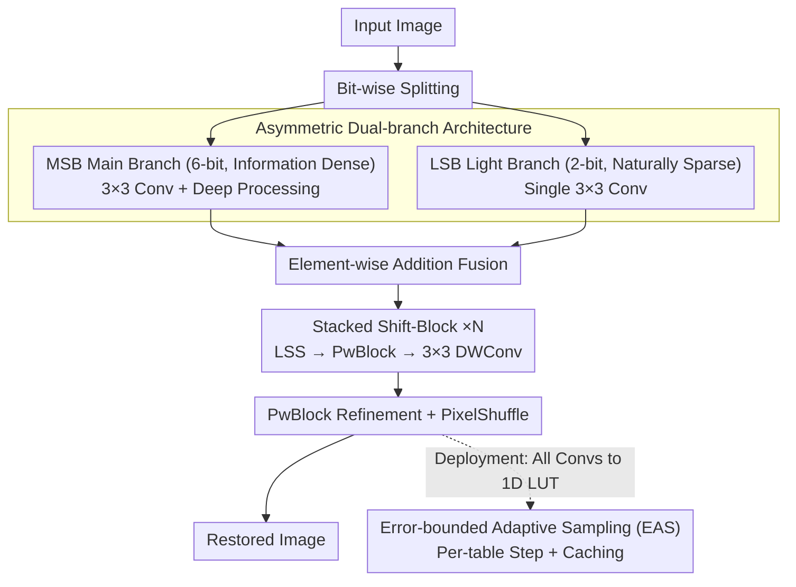

# ShiftLUT: Spatial Shift Enhanced Look-Up Tables for Efficient Image Restoration

**Conference**: CVPR 2026  
**arXiv**: [2603.00906](https://arxiv.org/abs/2603.00906)  
**Code**: [GitHub](https://github.com/Sailor-t/ShiftLUT)  
**Area**: Efficient Image Restoration  
**Keywords**: Look-Up Tables, Efficient Super-Resolution, Spatial Shift, Asymmetric Architecture, Adaptive Sampling

## TL;DR

ShiftLUT is proposed to achieve the largest receptive field (65×65) among LUT-based methods via a Learnable Spatial Shift (LSS) module. Combined with an asymmetric dual-branch architecture and Error-bounded Adaptive Sampling (EAS), it outperforms all existing LUT methods with 104KB storage and 84ms inference latency.

## Background & Motivation

Look-Up Table (LUT) methods adopt a "space-for-time" strategy, replacing convolutional operations with efficient memory lookups, making them suitable for deployment on edge devices like smartphones. However, they face a **Key Challenge**:

**Limited Receptive Field**: LUT storage grows exponentially ($B^N$), making receptive field expansion extremely costly.
   - MuLUT expands the receptive field by cascading multiple LUTs, but storage and latency increase linearly.
   - TinyLUT-F achieves a 33×33 receptive field but requires 171KB storage and 146ms latency.

**Inefficient Symmetric Dual-branch Design**: SPLUT divides input into MSB (most significant 6 bits) and LSB (least significant 2 bits) branches for parallel processing. However, the symmetric design wastes computation on the LSB branch, where deep feature zero-activation ratios approach 100%.

**Inflexible LUT Compression**: Existing methods use a fixed sampling step for all LUTs, ignoring that different LUTs contribute differently to the final result.

## Method

### Overall Architecture

The core problem ShiftLUT addresses is the exponential storage explosion required to expand the receptive field in LUT methods. The solution is to move "receptive field expansion" from the storage dimension to the feature processing dimension—allowing features to be "transported" across spatial locations before the lookup, thereby aggregating distant pixel information with almost no increase in the number of LUTs.

The pipeline follows a three-step process. The input image is first split by bits into MSB (6-bit) and LSB (2-bit) branches. Shallow features are extracted via 3×3 convolutions and fused via element-wise addition. The fused features are passed through several stacked Shift-Blocks, each consisting of "LSS Spatial Shift → PwBlock (Point-wise Convolution) → 3×3 Depth-wise Convolution." Finally, a PwBlock performs channel refinement, and PixelShuffle upsamples the features to reconstruct the restored image. The model is categorized into three versions based on the number of Shift-Blocks: ShiftLUT-S (0 blocks), ShiftLUT-M (1 block), and ShiftLUT-L (7 blocks), with receptive fields increasing from 9×9 to 65×65. During inference, all convolutions are converted into 1D LUTs via the SMS strategy with rotational ensemble.

### Key Designs

**1. Learnable Spatial Shift (LSS): Expanding Receptive Field at Zero Extra Lookup Cost**

The receptive field of a LUT is limited because covering one additional neighbor pixel adds a dimension and multiplies storage by $B$. LSS bypasses this by not expanding the window of a single lookup, but rather shifting each feature channel spatially by a certain distance before aggregating them via subsequent point-wise convolutions. After the shift, distant pixel information is "perfectly" aligned at the concurrent point-wise location. Specifically, a lightweight offset prediction network $\mathcal{O}(\cdot)$ (Conv + MLP) predicts a pair of offsets $\{(\Delta x_c, \Delta y_c)\}_{c=1}^{C} = \mathcal{O}(\mathbf{F})$ for each channel, then transports features channel-wise: $\mathbf{F}'_c(x,y) = \mathbf{F}_c(x - \Delta x_c, y - \Delta y_c)$.

The core ingenuity lies in the training-inference decoupling. Stage 1 treats offsets as learnable floating-point numbers with bilinear interpolation. Stage 2 discards the prediction network and uses fixed integer offsets (rounded means from training). During inference, this degrades into pure integer-indexed shifts with zero interpolation overhead. This is feasible because the learned offset variance is extremely low (< $10^{-3}$), indicating LSS converges to fixed, channel-dependent sampling patterns. Compared to manual shifts (e.g., PCS), LSS lets data discover optimal configurations and reverts to zero-cost fixed forms during deployment.

**2. Asymmetric Dual-branch Architecture: Reallocating Redundant Computation**

Methods like SPLUT process MSB and LSB branches symmetrically. However, the LSB branch's deep layers exhibit nearly 100% zero-activation ratios. MSB carries dense low-frequency structural info, while LSB carries naturally sparse high-frequency details. Stacking deep networks for a near-zero sparse signal is inefficient. ShiftLUT reduces the LSB branch to a single 3×3 convolution and reallocates saved resources to the information-dense MSB branch. This asymmetric design reduces latency from 164ms to 84ms with no loss in PSNR (both 28.19).

**3. Error-bounded Adaptive Sampling (EAS): Per-LUT Compression**

Existing LUT compression uses a uniform sampling step, which is suboptimal as different LUTs contribute differently to the output. EAS formulates step selection as a maximization problem under error constraints: choosing the largest step $s$ that keeps the error below a preset bound $\varepsilon$:

$$\max_{s \in \mathcal{S}} s \quad \text{s.t.} \quad \text{Error}(s) < \varepsilon$$

Candidate steps are restricted to powers of 2 ($\mathcal{S} = \{2^k\}$) to replace division with bit-shifts. The error metric includes a weight penalty $\frac{s}{s-1}$ proportional to storage savings to avoid sacrificing excessive accuracy for minimal gains. A caching mechanism pre-calculates interpolated LUT outputs into a shared buffer (6-bit input takes only 64 bytes) before inference, allowing pixels to query the cache directly, ensuring storage reduction without latency increases.

### Loss & Training

- Dataset: DIV2K
- Optimizer: Adam, $\beta_1=0.9, \beta_2=0.999$, initial lr $5 \times 10^{-3}$, cosine annealing
- 200K iterations, batch 32, patch 48×48
- Two-stage LSS training (Learnable Offset → Fixed Integer Offset)
- EAS tolerance $\varepsilon = 0.4$

## Key Experimental Results

### Main Results

| Method | Storage | Latency | Receptive Field | Set5 PSNR | Urban100 | Manga109 | Average |
|------|------|------|--------|-----------|----------|----------|------|
| SPLUT-L | 18432KB | 265ms | 5×5 | 30.52 | 24.46 | 27.70 | 27.42 |
| MuLUT | 4159KB | 242ms | 9×9 | 30.60 | 24.46 | 27.90 | 27.48 |
| TinyLUT-F | 171KB | 146ms | 33×33 | 31.18 | 24.92 | 28.83 | 28.01 |
| **Ours-S** | **24KB** | **22ms** | 9×9 | 30.50 | 24.39 | 27.65 | 27.39 |
| **Ours-M** | **38KB** | **31ms** | 17×17 | 30.77 | 24.62 | 28.18 | 27.66 |
| **Ours-L** | **104KB** | **84ms** | **65×65** | **31.33** | **25.12** | **29.16** | **28.19** |

*Note: ShiftLUT-L achieves SOTA across all benchmarks with 61% the storage of TinyLUT-F and 42% faster speed.*

### Ablation Study

| Configuration | Key Metric | Description |
|------|---------|------|
| w/o LSS vs. w/ LSS | PSNR +0.30+ dB | Consistently effective across all network scales |
| Symmetric vs. Asymmetric | 28.19 vs. 28.19 PSNR | Same performance, latency halved (164ms to 84ms) |
| EAS ($\varepsilon=0.4$) | Equal to original LUT | Storage halved with negligible latency change |
| EAS ($\varepsilon=0.8$) | PSNR drop < 0.03 dB | Aggressive compression maintains high accuracy |
| Uniform step=4 | PSNR drop 0.04 dB | EAS is superior (84ms vs 211ms and better PSNR) |

### Key Findings

- LSS provides a **stable improvement of >0.30 dB** across various configurations, proving its generality.
- LAM (Local Attribution Map) confirms that LSS enables the model to utilize a significantly larger spatial range of pixels.
- The low offset variance confirms that LSS effectively learns optimal static sampling patterns.
- The 6-bit MSB / 2-bit LSB split is the optimal trade-off for storage and performance.
- ShiftLUT achieves SOTA in Denoising (Set12: 32.43) and Deblocking (Classic5: 29.12).

## Highlights & Insights

1. **Elegant LSS Design**: Learnable offsets discover optimal sampling configurations, converting into zero-overhead fixed shifts after training, balancing flexibility and efficiency.
2. **Asymmetric Architecture Rationale**: Logic backed by zero-value activation analysis convincing demonstrates the waste in symmetric designs.
3. **Adaptive Compression via EAS**: Tailoring sampling steps per LUT combined with caching represents a substantial improvement in LUT compression.
4. **Multi-task Validation**: Effectiveness verified across SR, denoising, and deblocking tasks.
5. **Pareto Frontier**: The ShiftLUT series establishes a new Pareto frontier in the 3D space of storage, speed, and quality.

## Limitations & Future Work

1. Representation capability remains bounded by input quantization (6-bit MSB).
2. Two-stage LSS training increases training complexity.
3. Evaluations are limited to ×4 SR; other scaling factors are not tested.
4. Performance under real-world (non-bicubic) degradation remains unknown.
5. Future directions: lightweight video restoration and larger LUT decomposition patterns.

## Related Work & Insights

- **TinyLUT**: Introduced 1D LUT + SMS; ShiftLUT adds spatial shift on top of this.
- **SPLUT**: Pioneer of MSB/LSB dual-branch; ShiftLUT improves its inefficient symmetric design.
- **PCS/Group ShiftNet**: Used fixed shift operations; LSS upgrades this to a learnable mechanism.
- **ECLUT**: Expands coverage at the output; LSS expands the receptive field at the feature level.
- **Insight**: The core bottleneck of LUT methods is the receptive field rather than FLOPs; spatial shift is the key to zero-overhead expansion.

## Rating

- Novelty: ⭐⭐⭐⭐ (Elegant LSS and insightful asymmetric design)
- Experimental Thoroughness: ⭐⭐⭐⭐ (3 tasks, 5+ datasets, comprehensive ablations)
- Writing Quality: ⭐⭐⭐⭐ (Clear logic and flow)
- Value: ⭐⭐⭐⭐⭐ (Highly practical for edge deployment, 24KB-104KB scale)

<!-- RELATED:START -->

## Related Papers

- [\[ICCV 2025\] IM-LUT: Interpolation Mixing Look-Up Tables for Image Super-Resolution](../../ICCV2025/image_restoration/im-lut_interpolation_mixing_look-up_tables_for_image_super-resolution.md)
- [\[CVPR 2026\] Beyond the Ground Truth: Enhanced Supervision for Image Restoration](beyond_the_ground_truth_enhanced_supervision_for_image_restoration.md)
- [\[CVPR 2026\] Retrieve-to-Restore: Efficient All-in-One Image Restoration with a Retrieval-Based Degradation Bank](retrieve-to-restore_efficient_all-in-one_image_restoration_with_a_retrieval-base.md)
- [\[CVPR 2026\] VoDaSuRe: A Large-Scale Dataset Revealing Domain Shift in Volumetric Super-Resolution](vodasure_a_large-scale_dataset_revealing_domain_shift_in_volumetric_super-resolu.md)
- [\[CVPR 2026\] Scan Clusters, Not Pixels: A Cluster-Centric Paradigm for Efficient Ultra-high-definition Image Restoration](scan_clusters_not_pixels_a_cluster-centric_paradigm_for_efficient_ultra-high-def.md)

<!-- RELATED:END -->
