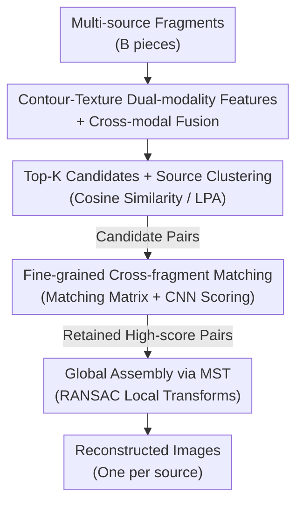

# ShreddingNet: Coarse-to-Fine Restoration for Multi-Source Shredded Manuscripts

**Conference**: CVPR 2026  
**Paper**: [CVF Open Access](https://openaccess.thecvf.com/content/CVPR2026/html/Cui_ShreddingNet_Coarse-to-Fine_Restoration_for_Multi-Source_Shredded_Manuscripts_CVPR_2026_paper.html)  
**Code**: https://github.com/tqychy/shreddingnet  
**Area**: Image Restoration / Puzzle Assembly  
**Keywords**: Artifact Restoration, Fragment Assembly, Multi-source, Coarse-to-fine Matching, Linear Complexity

## TL;DR
ShreddingNet utilizes a two-stage pipeline—"coarse matching for source-based clustering followed by fine-grained pair-wise scoring"—to solve the restoration problem where fragments from multiple paintings are mixed. It reduces model complexity from $O(n^2)$ to $O(n)$, achieving a global assembly F1-score of 98.37% on two datasets, outperforming the previous SOTA by 5.72%.

## Background & Motivation
**Background**: Digital restoration of paintings and artifacts is a critical application of computer vision in cultural heritage. Existing works mostly focus on "single-source" scenarios, where all fragments originate from a single image (e.g., JigsawNet uses CNNs to filter adjacent fragment pairs in a single-source puzzle), reassembling them via exhaustive pair-wise enumeration.

**Limitations of Prior Work**: In practice, fragments are often **multi-source**—shreds from various works are mixed without prior knowledge of the number of original images or the presence of "outlier fragments." Previous methods face significant hurdles in this setting: Siamese frameworks like JigsawNet require exhaustive checks for all pairs, leading to $O(n^2)$ complexity; LLMCO4MR handles multi-source outliers but **assumes the number of outliers is known**, which is impractical; PairingNet achieves high recall but low precision and does not handle full reassembly. Furthermore, many methods rely solely on contour cues and ignore real-world degradations like stains, mold, or incomplete edges.

**Key Challenge**: It is difficult to simultaneously satisfy "unconstrained multi-source support," "linear scalability," and "robustness to degradation." Avoiding $O(n^2)$ exhaustion requires candidate pruning, but pruning risks discarding true matches or incorrectly linking fragments from different sources.

**Goal**: To separate multi-source fragments by their origin and precisely reassemble them into their respective original images without relying on strong assumptions (e.g., "fragments must contain text" or "number of outliers is known"), all while maintaining linear model complexity.

**Key Insight**: The authors made a pivotal observation: **incorrect candidate pairs generated during the coarse matching stage rarely cross source boundaries** (only 0.69%/1.02% of false pairs were cross-source in experiments). Fragments from different sources naturally exhibit higher variance in shape and texture, making them harder to mismatch.

**Core Idea**: A coarse-to-fine workflow comprising "Coarse Matching → Source-based Clustering → Fine-grained Matching → Global Assembly." Coarse matching reduces the candidate pool to a linear scale and facilitates fragment clustering; the fine-grained stage then performs intensive pair-wise interaction only on Top-K candidates for each fragment, ensuring $O(n)$ complexity.

## Method

### Overall Architecture
The input consists of $B$ mixed fragments potentially from multiple sources, and the output is a set of reconstructed images. The pipeline consists of three stages: **Coarse Matching** extracts and fuses dual-modality "contour + texture" features to calculate pair-wise cosine similarity, retaining only Top-K candidates per fragment (reducing matches from $B^2$ to $B \times K$) and clustering fragments by source; **Fine-grained Matching** performs pair-wise interaction only on these candidates to generate a contour-point matching matrix, uses a lightweight CNN to predict confidence scores to filter low-quality pairs, and estimates local transformations via RANSAC; **Global Assembly** treats retained matches as a weighted graph where each connected component represents an original image, computes a Maximum Spanning Tree (MST) for each component, and composes local transformations along the tree to reconstruct the full images.

### Key Designs

**1. Contour-Texture Dual-modality Features + Cross-modal Fusion: Replacing unstable global processing with local fragment features**

Fragments vary wildly in size, orientation, and shape, and often lack clear semantics, making image-level processing unstable. The authors extract features around **contour points**: for each point, a $7 \times 7$ dual-modality patch is taken—one from the original image (texture) and one from the contour binary map (shape)—forming a sequence $I \in \mathbb{R}^{L \times 7 \times 7}$ ($L$ is the max contour points). Each patch sequence is fed into an independent 14-layer ResGCN after 8-nearest-neighbor graph construction, yielding texture features $F_t$ and contour features $F_c$. Fusion uses **bi-directional cross-attention**: texture acts as Query to enhance contour and vice-versa, with the average taken as $F_{\text{fused}}$. This preserves boundary geometry (essential for stitching) while introducing texture semantics.

**2. Top-K Candidates + Source Clustering: Scaling candidates to linear size and grouping by origin**

This is the core step that addresses the $O(n^2)$ bottleneck and the "unknown source count" problem. For each fragment, pair-wise cosine similarities are computed using $F_{\text{fused}}$, keeping only the Top-K candidates. The total candidate count drops to at most $B \times K$. Regarding clustering, because coarse-matching errors **rarely cross sources**, fragments are treated as nodes and candidates as edges for graph clustering. **Label Propagation Algorithm (LPA)** is utilized instead of K-Means or Spectral Clustering because LPA does not require a predefined number of clusters (handling unknown source counts) and operates naturally on graphs with low complexity.

**3. Fine-grained Cross-fragment Matching + CNN Scoring: Refining and filtering messy candidates**

The coarse stage provides high recall but many false positives. The fine-grained stage processes **pairs** using stacked cross-attention decoders to allow mutual reasoning. Given a pair, features $f_1^1 \in \mathbb{R}^{L_1 \times dim}$ and $f_2^1 \in \mathbb{R}^{L_2 \times dim}$ undergo $n$ layers of interaction to compute a contour-point matching matrix:

$$f_1^i = \mathrm{Att}(f_2^{i-1}, f_1^{i-1}, f_1^{i-1}),\quad f_2^i = \mathrm{Att}(f_1^{i-1}, f_2^{i-1}, f_2^{i-1}),\quad M = f_1^n \times (f_2^n)^T$$

Valid matches form a continuous high-similarity region along the main diagonal of $M$. Since noise can break this continuity, a lightweight CNN (3 convolution layers to capture diagonal patterns/density) + MLP + Sigmoid is used to output a confidence score. Only pairs exceeding a threshold are kept, followed by RANSAC for transform estimation.

**4. Maximum Spanning Tree Global Assembly: Composing local matches into a global coordinate system**

The final matches form a weighted graph where connected components represent original images. The MST is extracted for each component to composite local transformations, avoiding cumulative errors from redundant or conflicting transforms. This stage is fast and accurate because the preceding candidate set is already highly refined.

### Loss & Training
Three networks are trained separately (Coarse Matching, Fine-grained Matching, and Scoring) using Adam with cosine annealing, a weight decay of $5 \times 10^{-4}$, and a 7:1:2 split for train/val/test. Data is synthetic: original images (art 2192: Chinese paintings; pex 2000: Kaggle photos) are shredded. Training sets are clean, while test sets include stains, mold, and incomplete contours to evaluate zero-shot robustness.

## Key Experimental Results

### Main Results (Comparison with baselines on art 2192, IC = Images per batch)
Global Assembly (GA) precision and recall vs. JigsawNet and PairingNet:

| IC | Method | GA Prec(%) | GA Rec(%) |
|----|------|-----------|-----------|
| 3 | JigsawNet | 92.79 | 82.88 |
| 3 | PairingNet | 94.81 | 90.49 |
| 3 | **Ours** | **99.15** | **97.59** |
| 6 | JigsawNet | 92.46 | 82.28 |
| 6 | PairingNet | 94.10 | 90.67 |
| 6 | **Ours** | **98.55** | **97.28** |

Ours achieves significantly higher precision than PairingNet. Inference time on art 2192 (IC=3) was 207.2s on average, compared to JigsawNet's 811.36s and PairingNet's 350.84s, demonstrating linear scalability.

### Ablation Study (art 2192, ARI measures source clustering accuracy)

| Config | FM Prec(%) | FM Rec(%) | ARI(%) | GA Prec(%) | GA Rec(%) |
|------|-----------|-----------|--------|-----------|-----------|
| w/o Source Clustering | 76.71 | 79.01 | 53.44 | 97.94 | 97.31 |
| w/o Fine-grained Matching | 20.77 | 98.49 | 91.16 | N/A | N/A |
| w/o CNN Scoring | 65.17 | 78.46 | 91.78 | 96.43 | 93.54 |
| Full Model | 77.07 | 78.40 | 92.29 | 99.15 | 97.59 |

### Key Findings
- **Removing source clustering causes ARI to crash** (92.29 → 53.44), proving that "clustering by source" is vital for multi-source scenarios.
- **Removing fine-grained matching destroys precision** (77.07 → 20.77), as it is responsible for filtering coarse false positives.
- **CNN scoring outperforms rule-based scoring**, providing a clearer decision boundary.
- **Hyperparameter $K$**: Performance improves up to $K=20$. Beyond $20$, recall saturates while precision fluctuates downwards as more noise enters the fine-grained stage.
- **Robustness**: Global precision remains >95% under degradation, though recall drops to 75–82% (severely eroded fragments remain unrecoverable).

## Highlights & Insights
- **The "rare cross-source error" observation is crucial**: Even if coarse matching precision is low, the fact that errors stay within the same source allows it to be used for high-accuracy clustering—turning "noise" into a signal for separation.
- **Linear complexity $O(n)$ via Top-K candidates** is a pragmatic choice, translating directly to a ~4x speed advantage over JigsawNet.
- **Using LPA instead of K-Means** avoids the "unknown number of images" problem, making it far more practical than methods requiring a known outlier count.
- **Capturing diagonal continuity in $M$ via CNN** shows that structural priors can be effectively learned by small networks, a concept transferable to other matching matrix tasks.

## Limitations & Future Work
- **Reliance on synthetic data**: Most tests use algorithmically shredded data. Real-world validation is limited to two small hand-torn sets.
- **Recall drop under extreme degradation**: Fragments with completely destroyed textures along the edges are unrecoverable by texture/contour logic.
- **Dependency on $K$**: The optimal $K$ value may vary by dataset or resolution; its stability was not exhaustively explored.
- **Non-end-to-end**: The three networks are trained separately. Joint optimization could potentially reduce error accumulation between stages.

## Related Work & Insights
- **vs. JigsawNet**: JigsawNet uses CNNs for single-source reassembly with $O(n^2)$ complexity. This work achieves $O(n)$ and natively supports multi-source scenarios.
- **vs. PairingNet**: PairingNet finds adjacent pairs but lacks a full reassembly stage and has lower precision. This work provides cleaner candidate sets for assembly.
- **vs. LLMCO4MR**: LLMCO4MR requires the outlier count to be known. ShreddingNet’s use of LPA makes fewer assumptions, fitting real-world restoration better.

## Rating
- Novelty: ⭐⭐⭐⭐ (Clever use of coarse matching for clustering)
- Experimental Thoroughness: ⭐⭐⭐⭐ (Covers efficiency, robustness, and ablation)
- Writing Quality: ⭐⭐⭐⭐ (Logical flow and clear motivation)
- Value: ⭐⭐⭐⭐ (Practical linear complexity for large-scale artifact puzzles)

## Related Papers

- [\[CVPR 2026\] FinPercep-RM: A Fine-grained Reward Model and Co-evolutionary Curriculum for RL-based Real-world Super-Resolution](finpercep_rm_a_fine_grained_reward_model_and_co_evolutionary_curriculum_for_rl_ba.md)
- [\[CVPR 2026\] DNF-SR: Dual-Input and Negative-Aware Feature Fine-Tuning for Real-World Image Super-Resolution](dnf-sr_dual-input_and_negative-aware_feature_fine-tuning_for_real-world_image_su.md)
- [\[AAAI 2026\] Clear Nights Ahead: Towards Multi-Weather Nighttime Image Restoration](../../AAAI2026/image_restoration/clear_nights_ahead_towards_multi-weather_nighttime_image_res.md)
- [\[CVPR 2026\] Multinex: Lightweight Low-light Image Enhancement via Multi-prior Retinex](multinex_lightweight_low-light_image_enhancement_via_multi-prior_retinex.md)
- [\[AAAI 2026\] MFmamba: A Multi-function Network for Panchromatic Image Resolution Restoration Based on State-Space Model](../../AAAI2026/image_restoration/mfmamba_a_multi-function_network_for_panchromatic_image_resolution_restoration_b.md)

<!-- RELATED:END -->

<!-- RELATED:START -->

## Related Papers

- [\[CVPR 2026\] DNF-SR: Dual-Input and Negative-Aware Feature Fine-Tuning for Real-World Image Super-Resolution](dnf-sr_dual-input_and_negative-aware_feature_fine-tuning_for_real-world_image_su.md)
- [\[CVPR 2026\] HFR and HDR Video from Multi-Attenuated Spikes Using a Rapidly Rotating SpokeND Filter](hfr_and_hdr_video_from_multi-attenuated_spikes_using_a_rapidly_rotating_spokend_.md)
- [\[CVPR 2026\] UniRain: Unified Image Deraining with RAG-based Dataset Distillation and Multi-objective Reweighted Optimization](unirain_unified_image_deraining_rag_dataset_distillation.md)
- [\[CVPR 2026\] Beyond Single Solution: Multi-Hypothesis Collaborative Deep Unfolding Network for Image Compressive Sensing](beyond_single_solution_multi-hypothesis_collaborative_deep_unfolding_network_for.md)
- [\[CVPR 2026\] Dynamic Exposure Burst Image Restoration](dynamic_exposure_burst_image_restoration.md)

<!-- RELATED:END -->
